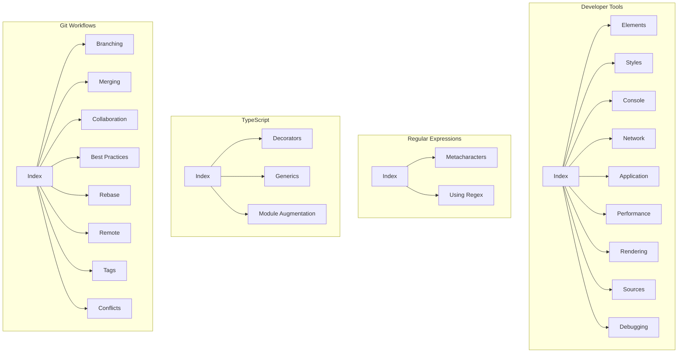
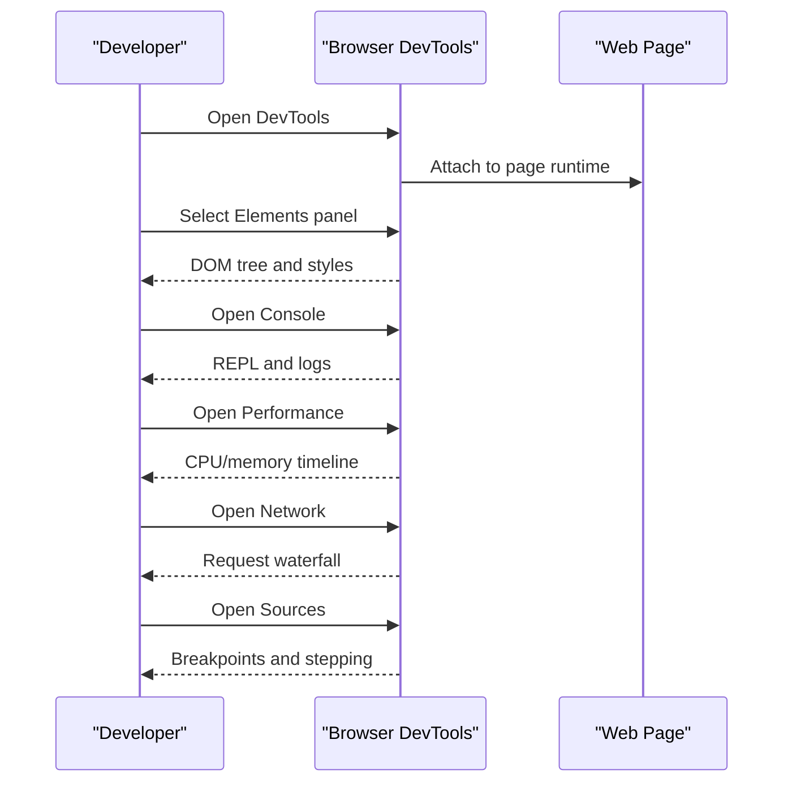
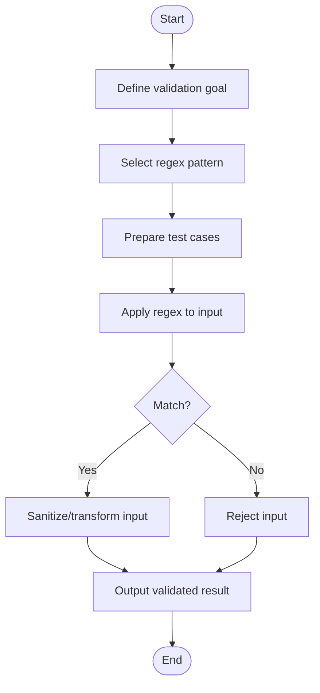
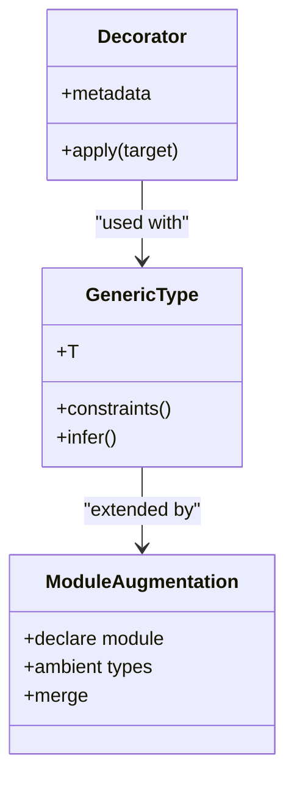
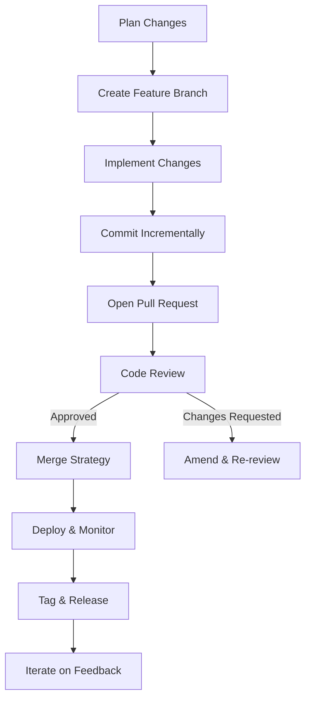
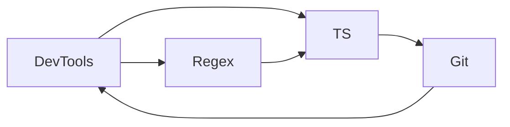

# Additional Resources

<cite>
**Referenced Files in This Document**
- [01_index.md](file://docs/04_更多/02_开发者工具/01_index.md)
- [07_元素.md](file://docs/04_更多/02_开发者工具/07_元素.md)
- [08_样式.md](file://docs/04_更多/02_开发者工具/08_样式.md)
- [09_键盘快捷键.md](file://docs/04_更多/02_开发者工具/09_键盘快捷键.md)
- [10_控制台.md](file://docs/04_更多/02_开发者工具/10_控制台.md)
- [11_网络.md](file://docs/04_更多/02_开发者工具/11_网络.md)
- [12_应用.md](file://docs/04_更多/02_开发者工具/12_应用.md)
- [13_应用_PWA.md](file://docs/04_更多/02_开发者工具/13_应用_PWA.md)
- [14_应用_存储.md](file://docs/04_更多/02_开发者工具/14_应用_存储.md)
- [15_应用_后台服务.md](file://docs/04_更多/02_开发者工具/15_应用_后台服务.md)
- [16_应用_框架.md](file://docs/04_更多/02_开发者工具/16_应用_框架.md)
- [17_源代码.md](file://docs/04_更多/02_开发者工具/17_源代码.md)
- [18_源代码_查看文件.md](file://docs/04_更多/02_开发者工具/18_源代码_查看文件.md)
- [19_源代码_代码段.md](file://docs/04_更多/02_开发者工具/19_源代码_代码段.md)
- [20_源代码_编辑文件.md](file://docs/04_更多/02_开发者工具/20_源代码_编辑文件.md)
- [21_源代码_本地替换.md](file://docs/04_更多/02_开发者工具/21_源代码_本地替换.md)
- [22_源代码_断点.md](file://docs/04_更多/02_开发者工具/22_源代码_断点.md)
- [23_源代码_调试.md](file://docs/04_更多/02_开发者工具/23_源代码_调试.md)
- [24_性能.md](file://docs/04_更多/02_开发者工具/24_性能.md)
- [25_渲染.md](file://docs/04_更多/02_开发者工具/25_渲染.md)
- [01_index.md](file://docs/04_更多/03_正则/01_index.md)
- [02_元字符.md](file://docs/04_更多/03_正则/02_元字符.md)
- [03_使用正则.md](file://docs/04_更多/03_正则/03_使用正则.md)
- [01_node.md](file://docs/04_更多/01_node/01_node.md)
- [02_概述.md](file://docs/02_工程化/01_vscode/02_概述.md)
- [01_npm.md](file://docs/02_工程化/06_npm/01_npm.md)
- [01_pnpm.md](file://docs/02_工程化/10_pnpm/01_pnpm.md)
- [01_home.md](file://docs/02_工程化/08_Prettier/01_home.md)
- [01_index.md](file://docs/04_更多/05_ts/01_index.md)
- [02_装饰器.md](file://docs/04_更多/05_ts/02_装饰器.md)
- [03_泛型.md](file://docs/04_更多/05_ts/03_泛型.md)
- [04_模块增强.md](file://docs/04_更多/05_ts/04_模块增强.md)
- [01_分支管理.md](file://docs/04_更多/06_git/01_分支管理.md)
- [02_合并策略.md](file://docs/04_更多/06_git/02_合并策略.md)
- [03_协作开发.md](file://docs/04_更多/06_git/03_协作开发.md)
- [04_工作流最佳实践.md](file://docs/04_更多/06_git/04_工作流最佳实践.md)
- [05_变基与交互式变基.md](file://docs/04_更多/06_git/05_变基与交互式变基.md)
- [06_Git工作流模式.md](file://docs/04_更多/06_git/06_Git工作流模式.md)
- [07_远程分支与推送.md](file://docs/04_更多/06_git/07_远程分支与推送.md)
- [08_标签与发布.md](file://docs/04_更多/06_git/08_标签与发布.md)
- [09_冲突解决.md](file://docs/04_更多/06_git/09_冲突解决.md)
- [10_撤销与回退.md](file://docs/04_更多/06_git/10_撤销与回退.md)
- [11_安全与审计.md](file://docs/04_更多/06_git/11_安全与审计.md)
- [12_性能优化.md](file://docs/04_更多/06_git/12_性能优化.md)
- [13_工具链集成.md](file://docs/04_更多/06_git/13_工具链集成.md)
- [14_工作区与子模块.md](file://docs/04_更多/06_git/14_工作区与子模块.md)
- [15_迁移与重构.md](file://docs/04_更多/06_git/15_迁移与重构.md)
- [16_文档与注释.md](file://docs/04_更多/06_git/16_文档与注释.md)
- [17_备份与恢复.md](file://docs/04_更多/06_git/17_备份与恢复.md)
- [18_故障排查.md](file://docs/04_更多/06_git/18_故障排查.md)
- [19_高级技巧.md](file://docs/04_更多/06_git/19_高级技巧.md)
- [20_案例研究.md](file://docs/04_更多/06_git/20_案例研究.md)
- [21_社区贡献.md](file://docs/04_更多/06_git/21_社区贡献.md)
- [22_版本兼容性.md](file://docs/04_更多/06_git/22_版本兼容性.md)
- [23_依赖管理.md](file://docs/04_更多/06_git/23_依赖管理.md)
- [24_持续集成.md](file://docs/04_更多/06_git/24_持续集成.md)
- [25_发布与部署.md](file://docs/04_更多/06_git/25_发布与部署.md)
- [26_监控与日志.md](file://docs/04_更多/06_git/26_监控与日志.md)
- [27_可观测性.md](file://docs/04_更多/06_git/27_可观测性.md)
- [28_可维护性.md](file://docs/04_更多/06_git/28_可维护性.md)
- [29_可扩展性.md](file://docs/04_更多/06_git/29_可扩展性.md)
- [30_可移植性.md](file://docs/04_更多/06_git/30_可移植性.md)
- [31_可测试性.md](file://docs/04_更多/06_git/31_可测试性.md)
- [32_可访问性.md](file://docs/04_更多/06_git/32_可访问性.md)
</cite>

## Table of Contents
1. [Introduction](#introduction)
2. [Project Structure](#project-structure)
3. [Core Components](#core-components)
4. [Architecture Overview](#architecture-overview)
5. [Detailed Component Analysis](#detailed-component-analysis)
6. [Dependency Analysis](#dependency-analysis)
7. [Performance Considerations](#performance-considerations)
8. [Troubleshooting Guide](#troubleshooting-guide)
9. [Conclusion](#conclusion)
10. [Appendices](#appendices)

## Introduction
This Additional Resources section consolidates specialized learning materials and practical workflows across four pillars:
- Browser Developer Tools: navigation, inspection, debugging, performance profiling, and rendering analysis
- Regular Expressions: metacharacters, pattern matching, and validation techniques
- Advanced TypeScript Features: decorators, generics, and module augmentation
- Version Control Workflows: branching strategies, merge workflows, collaboration patterns, and best practices

The content balances conceptual overviews for beginners and deep technical insights for experienced practitioners, grounded in the repository’s structured documentation.

## Project Structure
The Additional Resources content is organized under a dedicated “More” category with topic-specific subdirectories. Each topic area contains focused articles covering theory, techniques, and practical workflows.

```mermaid
graph TB
Root["docs/04_更多"] --> DevTools["02_开发者工具"]
Root --> Regex["03_正则"]
Root --> TS["05_ts"]
Root --> Git["06_git"]
DevTools --> DT_Index["01_index.md"]
DevTools --> Elements["07_元素.md"]
DevTools --> Styles["08_样式.md"]
DevTools --> Shortcuts["09_键盘快捷键.md"]
DevTools --> Console["10_控制台.md"]
DevTools --> Network["11_网络.md"]
DevTools --> Apps["12_应用.md"]
DevTools --> PWA["13_应用_PWA.md"]
DevTools --> Storage["14_应用_存储.md"]
DevTools --> Background["15_应用_后台服务.md"]
DevTools --> Framework["16_应用_框架.md"]
DevTools --> Sources["17_源代码.md"]
DevTools --> ViewFiles["18_源代码_查看文件.md"]
DevTools --> Snippets["19_源代码_代码段.md"]
DevTools --> EditFiles["20_源代码_编辑文件.md"]
DevTools --> LocalOverrides["21_源代码_本地替换.md"]
DevTools --> Breakpoints["22_源代码_断点.md"]
DevTools --> Debugging["23_源代码_调试.md"]
DevTools --> Performance["24_性能.md"]
DevTools --> Rendering["25_渲染.md"]
Regex --> R_Index["01_index.md"]
Regex --> Metachars["02_元字符.md"]
Regex --> UsingRegex["03_使用正则.md"]
TS --> TS_Index["01_index.md"]
TS --> Decorators["02_装饰器.md"]
TS --> Generics["03_泛型.md"]
TS --> ModuleAug["04_模块增强.md"]
Git --> Branching["01_分支管理.md"]
Git --> Merging["02_合并策略.md"]
Git --> Collaboration["03_协作开发.md"]
Git --> BestPractices["04_工作流最佳实践.md"]
Git --> Rebase["05_变基与交互式变基.md"]
Git --> Workflows["06_Git工作流模式.md"]
Git --> Remote["07_远程分支与推送.md"]
Git --> Tags["08_标签与发布.md"]
Git --> Conflicts["09_冲突解决.md"]
Git --> Undo["10_撤销与回退.md"]
Git --> Security["11_安全与审计.md"]
Git --> Perf["12_性能优化.md"]
Git --> Toolchain["13_工具链集成.md"]
Git --> Workspaces["14_工作区与子模块.md"]
Git --> Migration["15_迁移与重构.md"]
Git --> Docs["16_文档与注释.md"]
Git --> Backup["17_备份与恢复.md"]
Git --> Diagnostics["18_故障排查.md"]
Git --> Advanced["19_高级技巧.md"]
Git --> CaseStudies["20_案例研究.md"]
Git --> Contributing["21_社区贡献.md"]
Git --> Compatibility["22_版本兼容性.md"]
Git --> Dependencies["23_依赖管理.md"]
Git --> CI["24_持续集成.md"]
Git --> Releases["25_发布与部署.md"]
Git --> Monitoring["26_监控与日志.md"]
Git --> Observability["27_可观测性.md"]
Git --> Maintainability["28_可维护性.md"]
Git --> Scalability["29_可扩展性.md"]
Git --> Portability["30_可移植性.md"]
Git --> Testability["31_可测试性.md"]
Git --> Accessibility["32_可访问性.md"]
```

**Diagram sources**
- [01_index.md](file://docs/04_更多/02_开发者工具/01_index.md)
- [02_元字符.md](file://docs/04_更多/03_正则/02_元字符.md)
- [01_index.md](file://docs/04_更多/05_ts/01_index.md)
- [01_分支管理.md](file://docs/04_更多/06_git/01_分支管理.md)

**Section sources**
- [01_index.md](file://docs/04_更多/02_开发者工具/01_index.md)
- [01_index.md](file://docs/04_更多/03_正则/01_index.md)
- [01_index.md](file://docs/04_更多/05_ts/01_index.md)
- [01_分支管理.md](file://docs/04_更多/06_git/01_分支管理.md)

## Core Components
This section outlines the primary domains covered by the Additional Resources and their intended audiences.

- Browser Developer Tools
  - Purpose: Learn to inspect, debug, profile, and optimize web applications using built-in browser tooling.
  - Audience: Beginners seeking fundamentals; experienced developers mastering advanced workflows.
  - Topics: Elements panel, Styles inspection, Console commands, Network analysis, Application storage, Performance profiling, Rendering diagnostics, Source navigation, breakpoints, and debugging.

- Regular Expressions
  - Purpose: Master pattern matching, string manipulation, and validation using regex.
  - Audience: Everyone from newcomers to advanced practitioners.
  - Topics: Metacharacters, quantifiers, anchors, character classes, groups, lookaround, and practical usage scenarios.

- Advanced TypeScript Features
  - Purpose: Explore decorators, generics, and module augmentation to write expressive and reusable code.
  - Audience: Intermediate to advanced TypeScript developers.
  - Topics: Decorator syntax and semantics, generic constraints and inference, module augmentation patterns.

- Version Control Workflows
  - Purpose: Adopt robust Git workflows for branching, merging, collaboration, and release management.
  - Audience: Contributors and maintainers across skill levels.
  - Topics: Branching strategies, merge workflows, collaboration patterns, rebasing, remote management, tagging, conflict resolution, and best practices.

**Section sources**
- [01_index.md](file://docs/04_更多/02_开发者工具/01_index.md)
- [02_元字符.md](file://docs/04_更多/03_正则/02_元字符.md)
- [01_index.md](file://docs/04_更多/05_ts/01_index.md)
- [01_分支管理.md](file://docs/04_更多/06_git/01_分支管理.md)

## Architecture Overview
The Additional Resources architecture is a topic-driven knowledge graph with cross-links between related areas. Each topic area contains multiple focused documents that progressively build understanding from fundamentals to advanced techniques.

**Diagram sources**
- [01_index.md](file://docs/04_更多/02_开发者工具/01_index.md)
- [01_index.md](file://docs/04_更多/03_正则/01_index.md)
- [01_index.md](file://docs/04_更多/05_ts/01_index.md)
- [01_分支管理.md](file://docs/04_更多/06_git/01_分支管理.md)

## Detailed Component Analysis

### Browser Developer Tools
This component covers the end-to-end lifecycle of using browser devtools for inspection, debugging, and performance optimization.

- Elements Panel
  - Inspect DOM structure, attributes, and computed styles.
  - Modify styles live and observe real-time effects.
- Styles Inspection
  - Understand cascade, specificity, and overridden properties.
- Console
  - Execute JavaScript, log, profile, and test expressions.
- Network
  - Analyze requests, headers, timing, and response bodies.
- Application
  - Manage storage, service workers, and app metadata.
- Performance Profiling
  - Record CPU profiles, memory snapshots, and long tasks.
- Rendering Diagnostics
  - Investigate paint, composite, and layout bottlenecks.
- Sources Navigation
  - View, edit, and override local files during development.
- Breakpoints and Debugging
  - Set conditional breakpoints, watch expressions, and step through code.

**Diagram sources**
- [07_元素.md](file://docs/04_更多/02_开发者工具/07_元素.md)
- [10_控制台.md](file://docs/04_更多/02_开发者工具/10_控制台.md)
- [11_网络.md](file://docs/04_更多/02_开发者工具/11_网络.md)
- [17_源代码.md](file://docs/04_更多/02_开发者工具/17_源代码.md)
- [24_性能.md](file://docs/04_更多/02_开发者工具/24_性能.md)
- [25_渲染.md](file://docs/04_更多/02_开发者工具/25_渲染.md)

**Section sources**
- [07_元素.md](file://docs/04_更多/02_开发者工具/07_元素.md)
- [08_样式.md](file://docs/04_更多/02_开发者工具/08_样式.md)
- [09_键盘快捷键.md](file://docs/04_更多/02_开发者工具/09_键盘快捷键.md)
- [10_控制台.md](file://docs/04_更多/02_开发者工具/10_控制台.md)
- [11_网络.md](file://docs/04_更多/02_开发者工具/11_网络.md)
- [12_应用.md](file://docs/04_更多/02_开发者工具/12_应用.md)
- [13_应用_PWA.md](file://docs/04_更多/02_开发者工具/13_应用_PWA.md)
- [14_应用_存储.md](file://docs/04_更多/02_开发者工具/14_应用_存储.md)
- [15_应用_后台服务.md](file://docs/04_更多/02_开发者工具/15_应用_后台服务.md)
- [16_应用_框架.md](file://docs/04_更多/02_开发者工具/16_应用_框架.md)
- [17_源代码.md](file://docs/04_更多/02_开发者工具/17_源代码.md)
- [18_源代码_查看文件.md](file://docs/04_更多/02_开发者工具/18_源代码_查看文件.md)
- [19_源代码_代码段.md](file://docs/04_更多/02_开发者工具/19_源代码_代码段.md)
- [20_源代码_编辑文件.md](file://docs/04_更多/02_开发者工具/20_源代码_编辑文件.md)
- [21_源代码_本地替换.md](file://docs/04_更多/02_开发者工具/21_源代码_本地替换.md)
- [22_源代码_断点.md](file://docs/04_更多/02_开发者工具/22_源代码_断点.md)
- [23_源代码_调试.md](file://docs/04_更多/02_开发者工具/23_源代码_调试.md)
- [24_性能.md](file://docs/04_更多/02_开发者工具/24_性能.md)
- [25_渲染.md](file://docs/04_更多/02_开发者工具/25_渲染.md)

### Regular Expressions
This component focuses on regex fundamentals and practical applications for string manipulation and validation.

- Metacharacters
  - Anchors, character classes, quantifiers, alternation, groups, and assertions.
- Pattern Matching
  - Global vs single match, capturing groups, named groups, and lookahead/lookbehind.
- Validation Techniques
  - Input sanitization, form validation, parsing, and extraction.

**Diagram sources**
- [02_元字符.md](file://docs/04_更多/03_正则/02_元字符.md)
- [03_使用正则.md](file://docs/04_更多/03_正则/03_使用正则.md)

**Section sources**
- [01_index.md](file://docs/04_更多/03_正则/01_index.md)
- [02_元字符.md](file://docs/04_更多/03_正则/02_元字符.md)
- [03_使用正则.md](file://docs/04_更多/03_正则/03_使用正则.md)

### Advanced TypeScript Features
This component explores advanced TypeScript constructs to improve type safety and code expressiveness.

- Decorators
  - Class and member decorators, metadata emission, and common patterns.
- Generics
  - Type parameters, constraints, conditional types, mapped types, and inference.
- Module Augmentation
  - Extending existing module typings, ambient declarations, and declaration merging.

**Diagram sources**
- [02_装饰器.md](file://docs/04_更多/05_ts/02_装饰器.md)
- [03_泛型.md](file://docs/04_更多/05_ts/03_泛型.md)
- [04_模块增强.md](file://docs/04_更多/05_ts/04_模块增强.md)

**Section sources**
- [01_index.md](file://docs/04_更多/05_ts/01_index.md)
- [02_装饰器.md](file://docs/04_更多/05_ts/02_装饰器.md)
- [03_泛型.md](file://docs/04_更多/05_ts/03_泛型.md)
- [04_模块增强.md](file://docs/04_更多/05_ts/04_模块增强.md)

### Version Control Workflows
This component consolidates Git workflows from branching to deployment, emphasizing collaboration and reliability.

- Branching Strategies
  - Feature branches, release branches, hotfix branches, and naming conventions.
- Merge Workflows
  - Squash merges, rebase merges, and merge commits.
- Collaboration Patterns
  - Forking, pull requests, code review, and maintainer workflows.
- Best Practices
  - Commit hygiene, branching discipline, and documentation standards.
- Rebase and Interactive Rebase
  - Cleaning up history, resolving conflicts, and maintaining linear history.
- Remote Management
  - Push/pull, upstream tracking, and remote branch workflows.
- Tagging and Release
  - Semantic versioning, annotated tags, and release notes.
- Conflict Resolution
  - Tools, strategies, and prevention.
- Safety and Auditing
  - Protecting mainline, backup procedures, and audit trails.
- Performance and Toolchain Integration
  - Hooks, CI integration, and automation.
- Workspaces and Submodules
  - Monorepo patterns and submodule management.
- Migration and Refactoring
  - Large-scale changes, branch migrations, and cleanup.
- Documentation and Comments
  - Commit messages, changelogs, and inline documentation.
- Backups and Recovery
  - Stash, reflog, and recovery strategies.
- Diagnostics and Advanced Techniques
  - Bisect, graft, cherry-pick, and troubleshooting.
- Case Studies and Community Contribution
  - Real-world examples and contribution guidelines.
- Compatibility, Dependencies, CI/CD, Releases, Monitoring, Observability, Maintainability, Scalability, Portability, Testability, Accessibility
  - Cross-cutting concerns for sustainable development.

**Diagram sources**
- [01_分支管理.md](file://docs/04_更多/06_git/01_分支管理.md)
- [02_合并策略.md](file://docs/04_更多/06_git/02_合并策略.md)
- [03_协作开发.md](file://docs/04_更多/06_git/03_协作开发.md)
- [04_工作流最佳实践.md](file://docs/04_更多/06_git/04_工作流最佳实践.md)
- [05_变基与交互式变基.md](file://docs/04_更多/06_git/05_变基与交互式变基.md)
- [06_Git工作流模式.md](file://docs/04_更多/06_git/06_Git工作流模式.md)
- [07_远程分支与推送.md](file://docs/04_更多/06_git/07_远程分支与推送.md)
- [08_标签与发布.md](file://docs/04_更多/06_git/08_标签与发布.md)
- [09_冲突解决.md](file://docs/04_更多/06_git/09_冲突解决.md)
- [10_撤销与回退.md](file://docs/04_更多/06_git/10_撤销与回退.md)
- [11_安全与审计.md](file://docs/04_更多/06_git/11_安全与审计.md)
- [12_性能优化.md](file://docs/04_更多/06_git/12_性能优化.md)
- [13_工具链集成.md](file://docs/04_更多/06_git/13_工具链集成.md)
- [14_工作区与子模块.md](file://docs/04_更多/06_git/14_工作区与子模块.md)
- [15_迁移与重构.md](file://docs/04_更多/06_git/15_迁移与重构.md)
- [16_文档与注释.md](file://docs/04_更多/06_git/16_文档与注释.md)
- [17_备份与恢复.md](file://docs/04_更多/06_git/17_备份与恢复.md)
- [18_故障排查.md](file://docs/04_更多/06_git/18_故障排查.md)
- [19_高级技巧.md](file://docs/04_更多/06_git/19_高级技巧.md)
- [20_案例研究.md](file://docs/04_更多/06_git/20_案例研究.md)
- [21_社区贡献.md](file://docs/04_更多/06_git/21_社区贡献.md)
- [22_版本兼容性.md](file://docs/04_更多/06_git/22_版本兼容性.md)
- [23_依赖管理.md](file://docs/04_更多/06_git/23_依赖管理.md)
- [24_持续集成.md](file://docs/04_更多/06_git/24_持续集成.md)
- [25_发布与部署.md](file://docs/04_更多/06_git/25_发布与部署.md)
- [26_监控与日志.md](file://docs/04_更多/06_git/26_监控与日志.md)
- [27_可观测性.md](file://docs/04_更多/06_git/27_可观测性.md)
- [28_可维护性.md](file://docs/04_更多/06_git/28_可维护性.md)
- [29_可扩展性.md](file://docs/04_更多/06_git/29_可扩展性.md)
- [30_可移植性.md](file://docs/04_更多/06_git/30_可移植性.md)
- [31_可测试性.md](file://docs/04_更多/06_git/31_可测试性.md)
- [32_可访问性.md](file://docs/04_更多/06_git/32_可访问性.md)

**Section sources**
- [01_分支管理.md](file://docs/04_更多/06_git/01_分支管理.md)
- [02_合并策略.md](file://docs/04_更多/06_git/02_合并策略.md)
- [03_协作开发.md](file://docs/04_更多/06_git/03_协作开发.md)
- [04_工作流最佳实践.md](file://docs/04_更多/06_git/04_工作流最佳实践.md)
- [05_变基与交互式变基.md](file://docs/04_更多/06_git/05_变基与交互式变基.md)
- [06_Git工作流模式.md](file://docs/04_更多/06_git/06_Git工作流模式.md)
- [07_远程分支与推送.md](file://docs/04_更多/06_git/07_远程分支与推送.md)
- [08_标签与发布.md](file://docs/04_更多/06_git/08_标签与发布.md)
- [09_冲突解决.md](file://docs/04_更多/06_git/09_冲突解决.md)
- [10_撤销与回退.md](file://docs/04_更多/06_git/10_撤销与回退.md)
- [11_安全与审计.md](file://docs/04_更多/06_git/11_安全与审计.md)
- [12_性能优化.md](file://docs/04_更多/06_git/12_性能优化.md)
- [13_工具链集成.md](file://docs/04_更多/06_git/13_工具链集成.md)
- [14_工作区与子模块.md](file://docs/04_更多/06_git/14_工作区与子模块.md)
- [15_迁移与重构.md](file://docs/04_更多/06_git/15_迁移与重构.md)
- [16_文档与注释.md](file://docs/04_更多/06_git/16_文档与注释.md)
- [17_备份与恢复.md](file://docs/04_更多/06_git/17_备份与恢复.md)
- [18_故障排查.md](file://docs/04_更多/06_git/18_故障排查.md)
- [19_高级技巧.md](file://docs/04_更多/06_git/19_高级技巧.md)
- [20_案例研究.md](file://docs/04_更多/06_git/20_案例研究.md)
- [21_社区贡献.md](file://docs/04_更多/06_git/21_社区贡献.md)
- [22_版本兼容性.md](file://docs/04_更多/06_git/22_版本兼容性.md)
- [23_依赖管理.md](file://docs/04_更多/06_git/23_依赖管理.md)
- [24_持续集成.md](file://docs/04_更多/06_git/24_持续集成.md)
- [25_发布与部署.md](file://docs/04_更多/06_git/25_发布与部署.md)
- [26_监控与日志.md](file://docs/04_更多/06_git/26_监控与日志.md)
- [27_可观测性.md](file://docs/04_更多/06_git/27_可观测性.md)
- [28_可维护性.md](file://docs/04_更多/06_git/28_可维护性.md)
- [29_可扩展性.md](file://docs/04_更多/06_git/29_可扩展性.md)
- [30_可移植性.md](file://docs/04_更多/06_git/30_可移植性.md)
- [31_可测试性.md](file://docs/04_更多/06_git/31_可测试性.md)
- [32_可访问性.md](file://docs/04_更多/06_git/32_可访问性.md)

## Dependency Analysis
The Additional Resources topics are loosely coupled but interlinked. For example:
- Developer Tools inform Regex validation and TS development workflows.
- Regex and TS enhance Git commit quality and CI checks.
- Git workflows support the deployment and observability of applications analyzed via DevTools.

**Diagram sources**
- [01_index.md](file://docs/04_更多/02_开发者工具/01_index.md)
- [01_index.md](file://docs/04_更多/03_正则/01_index.md)
- [01_index.md](file://docs/04_更多/05_ts/01_index.md)
- [01_分支管理.md](file://docs/04_更多/06_git/01_分支管理.md)

**Section sources**
- [01_index.md](file://docs/04_更多/02_开发者工具/01_index.md)
- [01_index.md](file://docs/04_更多/03_正则/01_index.md)
- [01_index.md](file://docs/04_更多/05_ts/01_index.md)
- [01_分支管理.md](file://docs/04_更多/06_git/01_分支管理.md)

## Performance Considerations
- Developer Tools
  - Use Performance and Rendering panels to identify bottlenecks; avoid excessive reflows and repaints; leverage throttling to simulate low-end devices.
- Regular Expressions
  - Prefer anchored patterns, avoid catastrophic backtracking; cache frequently used patterns; validate inputs early to reduce regex cost.
- TypeScript
  - Favor precise types and narrow generics to improve compile-time checks; avoid broad any or unknown; use declaration merging judiciously.
- Git
  - Keep histories clean with interactive rebase; avoid large binary files; split commits logically; use shallow clones for CI.

[No sources needed since this section provides general guidance]

## Troubleshooting Guide
- Developer Tools
  - Use Console for quick tests; Network tab for request/response inspection; Sources for breakpoint debugging; Performance for CPU/memory analysis.
- Regex
  - Validate patterns incrementally; test against edge cases; use online testers to confirm behavior; prefer explicit character classes over greedy wildcards.
- TypeScript
  - Enable strict mode; resolve type errors promptly; use module augmentation carefully to prevent conflicts; verify emitted declarations.
- Git
  - Use reflog for recovery; stash contextual changes; resolve conflicts systematically; leverage bisect for regressions.

**Section sources**
- [10_控制台.md](file://docs/04_更多/02_开发者工具/10_控制台.md)
- [11_网络.md](file://docs/04_更多/02_开发者工具/11_网络.md)
- [17_源代码.md](file://docs/04_更多/02_开发者工具/17_源代码.md)
- [24_性能.md](file://docs/04_更多/02_开发者工具/24_性能.md)
- [03_使用正则.md](file://docs/04_更多/03_正则/03_使用正则.md)
- [02_装饰器.md](file://docs/04_更多/05_ts/02_装饰器.md)
- [03_泛型.md](file://docs/04_更多/05_ts/03_泛型.md)
- [04_模块增强.md](file://docs/04_更多/05_ts/04_模块增强.md)
- [10_撤销与回退.md](file://docs/04_更多/06_git/10_撤销与回退.md)
- [09_冲突解决.md](file://docs/04_更多/06_git/09_冲突解决.md)
- [18_故障排查.md](file://docs/04_更多/06_git/18_故障排查.md)

## Conclusion
The Additional Resources section provides a comprehensive, topic-focused knowledge base for modern web development tooling and practices. By combining hands-on browser devtools mastery, regex proficiency, advanced TypeScript techniques, and robust Git workflows, teams can improve productivity, code quality, and system reliability.

[No sources needed since this section summarizes without analyzing specific files]

## Appendices
- Beginner Pathways
  - Start with Developer Tools fundamentals, progress to Regex basics, then TypeScript generics and decorators, and finally adopt Git branching and collaboration patterns.
- Advanced Mastery
  - Deep-dive into Performance and Rendering diagnostics, Regex lookahead/lookbehind, advanced TS patterns, and enterprise-grade Git workflows including CI/CD and observability.

[No sources needed since this section provides general guidance]