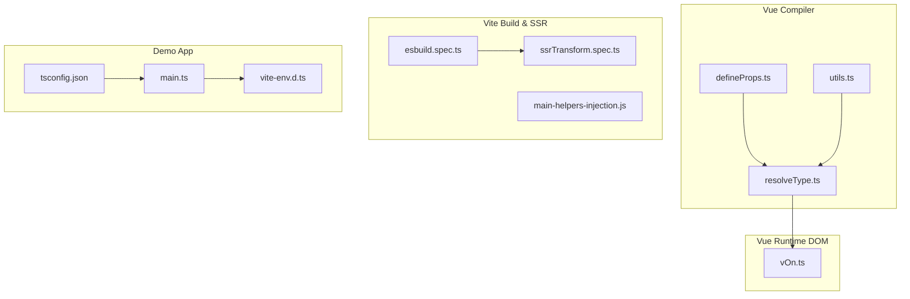
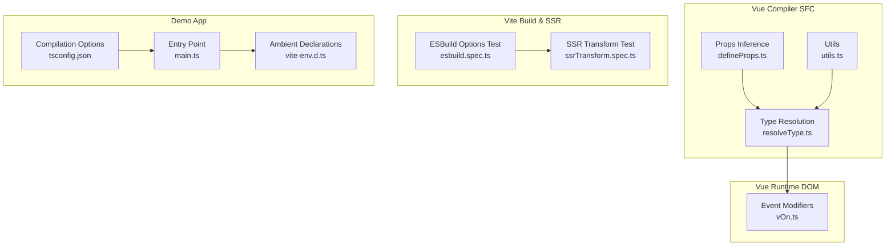
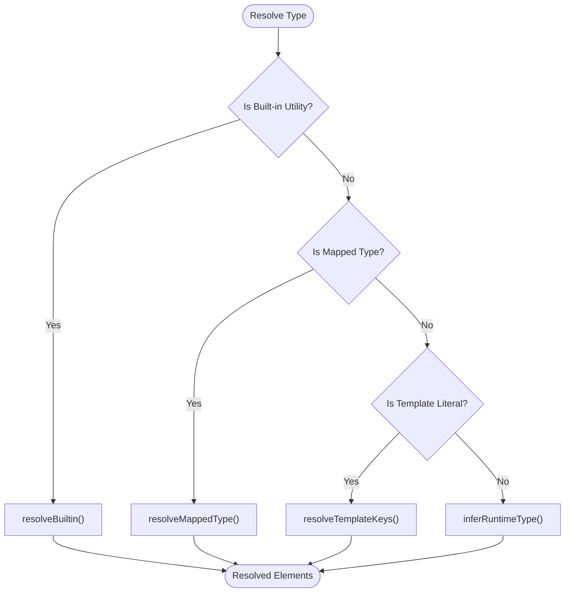
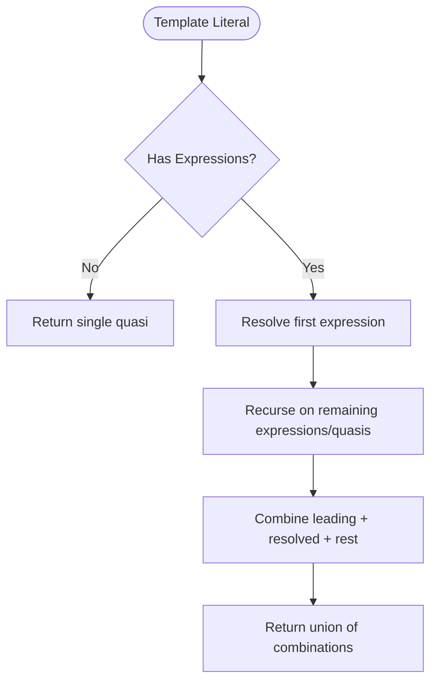
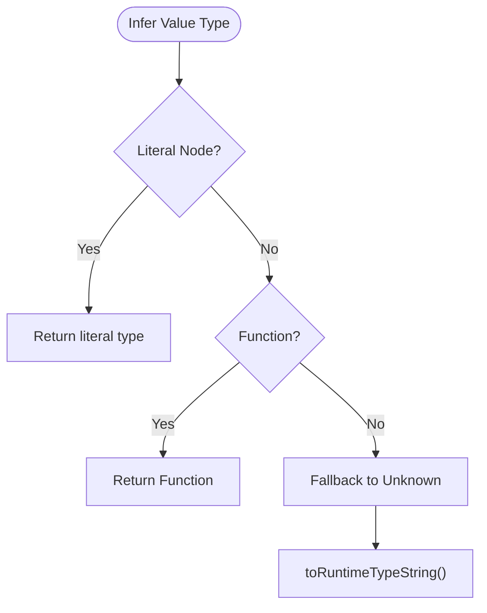
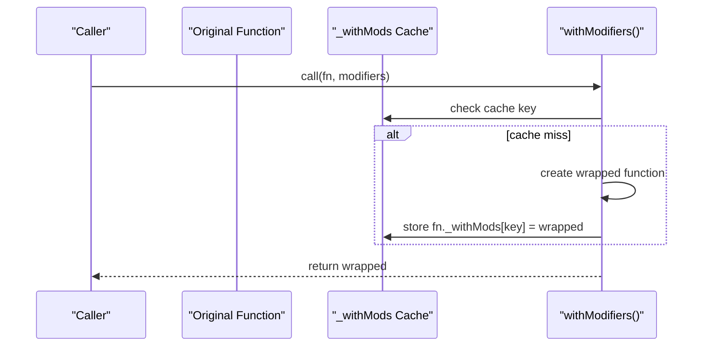
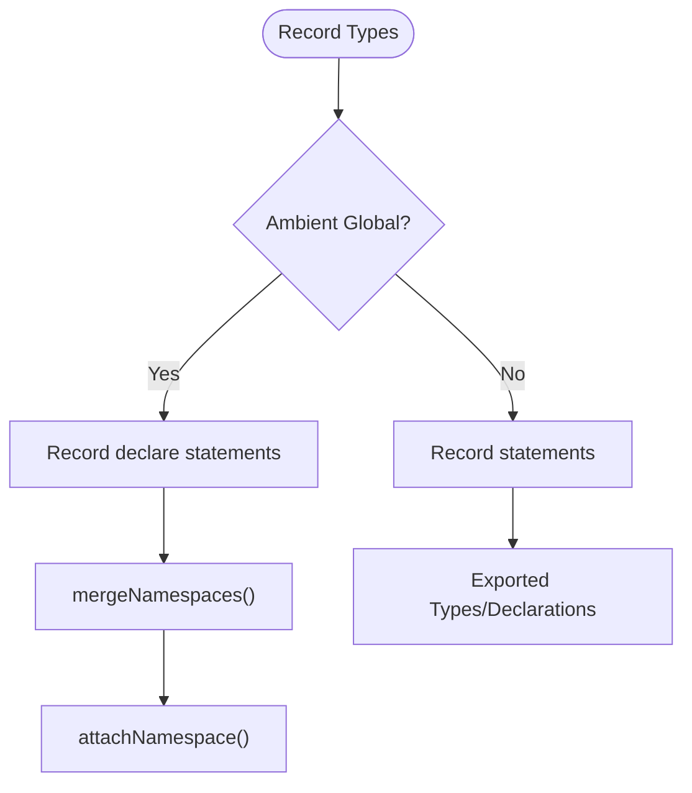
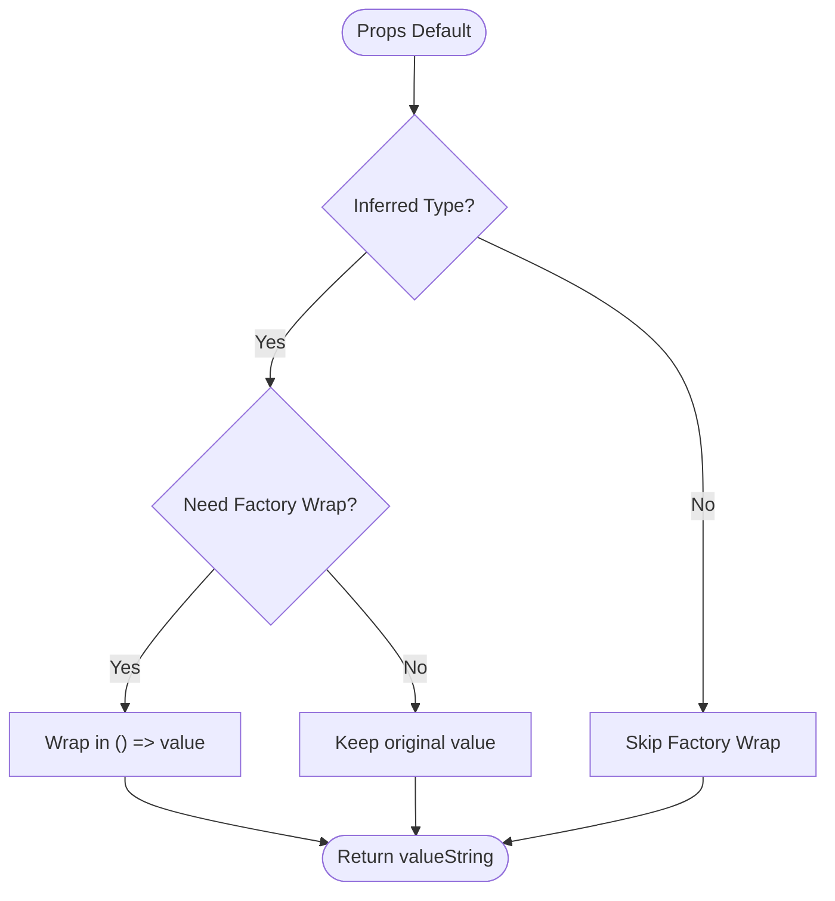
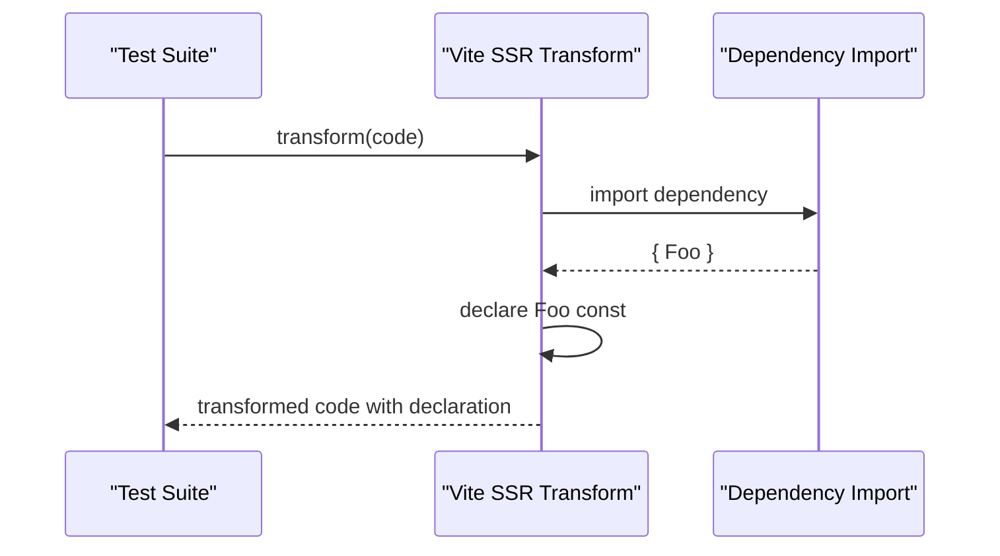
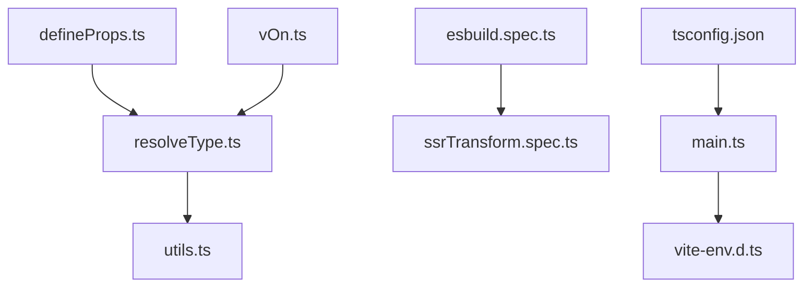

# Advanced TypeScript

<cite>
**Referenced Files in This Document**
- [resolveType.ts](file://源码学习/vue@3.5.26/code/packages/compiler-sfc/src/script/resolveType.ts)
- [vOn.ts](file://源码学习/vue@3.5.26/code/packages/runtime-dom/src/directives/vOn.ts)
- [esbuild.spec.ts](file://源码学习/vite@5.2.11/packages/vite/src/node/__tests__/plugins/esbuild.spec.ts)
- [ssrTransform.spec.ts](file://源码学习/vite@5.2.11/packages/vite/src/node/ssr/__tests__/ssrTransform.spec.ts)
- [main.ts](file://demo/my-vue-app/src/main.ts)
- [vite-env.d.ts](file://demo/my-vue-app/src/vite-env.d.ts)
- [tsconfig.json](file://demo/my-vue-app/tsconfig.json)
- [tsconfig.json](file://tsconfig.json)
- [defineProps.ts](file://源码学习/vue@3.5.26/code/packages/compiler-sfc/src/script/defineProps.ts)
- [utils.ts](file://源码学习/vue@3.5.26/code/packages/compiler-sfc/src/script/utils.ts)
- [main-helpers-injection.js](file://源码学习/vite@5.2.11/playground/lib/main-helpers-injection.js)
</cite>

## Table of Contents
1. [Introduction](#introduction)
2. [Project Structure](#project-structure)
3. [Core Components](#core-components)
4. [Architecture Overview](#architecture-overview)
5. [Detailed Component Analysis](#detailed-component-analysis)
6. [Dependency Analysis](#dependency-analysis)
7. [Performance Considerations](#performance-considerations)
8. [Troubleshooting Guide](#troubleshooting-guide)
9. [Conclusion](#conclusion)
10. [Appendices](#appendices)

## Introduction
This document presents advanced TypeScript features as implemented and exemplified within the repository. It focuses on sophisticated type system capabilities such as conditional types, mapped types, template literal types, and inference patterns. It also documents decorators usage, metadata reflection, and class decorators; module augmentation, declaration merging, and ambient declarations; practical examples from the codebase demonstrating complex type patterns, generic constraints, and utility types; type guards, assertion functions, and type narrowing techniques; module system integration; triple-slash directives; and compilation options. Finally, it provides guidelines for maintaining type safety in large codebases and performance optimization strategies.

## Project Structure
The repository contains multiple TypeScript-enabled projects and libraries. Notable locations for advanced TypeScript features include:
- Vue compiler SFC script resolution and directive runtime logic
- Vite SSR and build pipeline tests and helpers
- A Vue + Vite demo showcasing ambient declarations and tsconfig usage
- General tsconfig.json files for project-wide compilation options

**Diagram sources**
- [resolveType.ts:448-711](file://源码学习/vue@3.5.26/code/packages/compiler-sfc/src/script/resolveType.ts#L448-L711)
- [defineProps.ts:352-391](file://源码学习/vue@3.5.26/code/packages/compiler-sfc/src/script/defineProps.ts#L352-L391)
- [utils.ts:1-58](file://源码学习/vue@3.5.26/code/packages/compiler-sfc/src/script/utils.ts#L1-L58)
- [vOn.ts:51-73](file://源码学习/vue@3.5.26/code/packages/runtime-dom/src/directives/vOn.ts#L51-L73)
- [esbuild.spec.ts:338-380](file://源码学习/vite@5.2.11/packages/vite/src/node/__tests__/plugins/esbuild.spec.ts#L338-L380)
- [ssrTransform.spec.ts:316-344](file://源码学习/vite@5.2.11/packages/vite/src/node/ssr/__tests__/ssrTransform.spec.ts#L316-L344)
- [main.ts](file://demo/my-vue-app/src/main.ts)
- [vite-env.d.ts](file://demo/my-vue-app/src/vite-env.d.ts)
- [tsconfig.json](file://demo/my-vue-app/tsconfig.json)

**Section sources**
- [resolveType.ts:448-711](file://源码学习/vue@3.5.26/code/packages/compiler-sfc/src/script/resolveType.ts#L448-L711)
- [vOn.ts:51-73](file://源码学习/vue@3.5.26/code/packages/runtime-dom/src/directives/vOn.ts#L51-L73)
- [esbuild.spec.ts:338-380](file://源码学习/vite@5.2.11/packages/vite/src/node/__tests__/plugins/esbuild.spec.ts#L338-L380)
- [ssrTransform.spec.ts:316-344](file://源码学习/vite@5.2.11/packages/vite/src/node/ssr/__tests__/ssrTransform.spec.ts#L316-L344)
- [main.ts](file://demo/my-vue-app/src/main.ts)
- [vite-env.d.ts](file://demo/my-vue-app/src/vite-env.d.ts)
- [tsconfig.json](file://demo/my-vue-app/tsconfig.json)

## Core Components
This section highlights core components that demonstrate advanced TypeScript features.

- Conditional Types and Utility Types
  - Built-in utility type resolution and mapped type handling for Partial, Required, Readonly, Pick, Omit, Extract, Exclude, Uppercase, Lowercase, Capitalize, Uncapitalize.
  - Template literal key resolution for dynamic property names.
  - Runtime type inference for function-like types and literals.

- Mapped Types and Declaration Merging
  - Module augmentation via namespace merging and ambient declarations.
  - Exported type declarations and merged scopes during compilation.

- Template Literal Types
  - Dynamic string union generation from template literals with embedded expressions.

- Inference Patterns
  - Generic constraints and inference for function parameters and return types.
  - Type narrowing via runtime checks and best-effort inference.

- Decorators and Metadata Reflection
  - Decorator usage patterns and metadata caching on function instances.
  - Class decorator scenarios demonstrated by SSR transforms.

- Ambient Declarations and Triple-Slash Directives
  - Ambient module declarations and global augmentation patterns.
  - Integration with Vite’s SSR transform and module declaration insertion.

- Practical Examples
  - Props default value factory wrapping with inferred types.
  - Runtime type string conversion and best-effort inference.

**Section sources**
- [resolveType.ts:448-711](file://源码学习/vue@3.5.26/code/packages/compiler-sfc/src/script/resolveType.ts#L448-L711)
- [resolveType.ts:610-641](file://源码学习/vue@3.5.26/code/packages/compiler-sfc/src/script/resolveType.ts#L610-L641)
- [resolveType.ts:1259-1506](file://源码学习/vue@3.5.26/code/packages/compiler-sfc/src/script/resolveType.ts#L1259-L1506)
- [defineProps.ts:352-391](file://源码学习/vue@3.5.26/code/packages/compiler-sfc/src/script/defineProps.ts#L352-L391)
- [utils.ts:56-58](file://源码学习/vue@3.5.26/code/packages/compiler-sfc/src/script/utils.ts#L56-L58)
- [vOn.ts:51-73](file://源码学习/vue@3.5.26/code/packages/runtime-dom/src/directives/vOn.ts#L51-L73)
- [ssrTransform.spec.ts:316-344](file://源码学习/vite@5.2.11/packages/vite/src/node/ssr/__tests__/ssrTransform.spec.ts#L316-L344)

## Architecture Overview
The advanced TypeScript features are integrated across the Vue compiler and runtime, and Vite build pipeline. The Vue compiler resolves and transforms SFC script types, while the runtime applies decorators and modifiers. Vite’s SSR and build tests illustrate module system integration and class field behavior under different targets.

**Diagram sources**
- [resolveType.ts:448-711](file://源码学习/vue@3.5.26/code/packages/compiler-sfc/src/script/resolveType.ts#L448-L711)
- [defineProps.ts:352-391](file://源码学习/vue@3.5.26/code/packages/compiler-sfc/src/script/defineProps.ts#L352-L391)
- [utils.ts:1-58](file://源码学习/vue@3.5.26/code/packages/compiler-sfc/src/script/utils.ts#L1-L58)
- [vOn.ts:51-73](file://源码学习/vue@3.5.26/code/packages/runtime-dom/src/directives/vOn.ts#L51-L73)
- [esbuild.spec.ts:338-380](file://源码学习/vite@5.2.11/packages/vite/src/node/__tests__/plugins/esbuild.spec.ts#L338-L380)
- [ssrTransform.spec.ts:316-344](file://源码学习/vite@5.2.11/packages/vite/src/node/ssr/__tests__/ssrTransform.spec.ts#L316-L344)
- [main.ts](file://demo/my-vue-app/src/main.ts)
- [vite-env.d.ts](file://demo/my-vue-app/src/vite-env.d.ts)
- [tsconfig.json](file://demo/my-vue-app/tsconfig.json)

## Detailed Component Analysis

### Conditional Types and Utility Types
This component demonstrates built-in utility type resolution and mapped type handling. It supports Partial, Required, Readonly, Pick, Omit, Extract, Exclude, Uppercase, Lowercase, Capitalize, and Uncapitalize. It also handles template literal keys and runtime type inference for function-like constructs.

**Diagram sources**
- [resolveType.ts:448-711](file://源码学习/vue@3.5.26/code/packages/compiler-sfc/src/script/resolveType.ts#L448-L711)
- [resolveType.ts:610-641](file://源码学习/vue@3.5.26/code/packages/compiler-sfc/src/script/resolveType.ts#L610-L641)
- [resolveType.ts:1576-1775](file://源码学习/vue@3.5.26/code/packages/compiler-sfc/src/script/resolveType.ts#L1576-L1775)

**Section sources**
- [resolveType.ts:448-711](file://源码学习/vue@3.5.26/code/packages/compiler-sfc/src/script/resolveType.ts#L448-L711)
- [resolveType.ts:610-641](file://源码学习/vue@3.5.26/code/packages/compiler-sfc/src/script/resolveType.ts#L610-L641)
- [resolveType.ts:1576-1775](file://源码学习/vue@3.5.26/code/packages/compiler-sfc/src/script/resolveType.ts#L1576-L1775)

### Template Literal Types
Template literal types are resolved by combining static quasis with dynamic expression results. The resolver recursively computes all possible string unions.

**Diagram sources**
- [resolveType.ts:610-641](file://源码学习/vue@3.5.26/code/packages/compiler-sfc/src/script/resolveType.ts#L610-L641)

**Section sources**
- [resolveType.ts:610-641](file://源码学习/vue@3.5.26/code/packages/compiler-sfc/src/script/resolveType.ts#L610-L641)

### Inference Patterns and Best-Effort Type Inference
The compiler performs best-effort runtime type inference for values and function-like constructs. It also converts inferred types to runtime type strings.

**Diagram sources**
- [defineProps.ts:372-391](file://源码学习/vue@3.5.26/code/packages/compiler-sfc/src/script/defineProps.ts#L372-L391)
- [utils.ts:56-58](file://源码学习/vue@3.5.26/code/packages/compiler-sfc/src/script/utils.ts#L56-L58)

**Section sources**
- [defineProps.ts:372-391](file://源码学习/vue@3.5.26/code/packages/compiler-sfc/src/script/defineProps.ts#L372-L391)
- [utils.ts:56-58](file://源码学习/vue@3.5.26/code/packages/compiler-sfc/src/script/utils.ts#L56-L58)

### Decorators, Metadata Reflection, and Class Decorators
The event modifier wrapper demonstrates decorator-like behavior with metadata caching on function instances. Class decorators are illustrated by SSR transforms that insert variable declarations for imported superclasses.

**Diagram sources**
- [vOn.ts:51-73](file://源码学习/vue@3.5.26/code/packages/runtime-dom/src/directives/vOn.ts#L51-L73)

**Section sources**
- [vOn.ts:51-73](file://源码学习/vue@3.5.26/code/packages/runtime-dom/src/directives/vOn.ts#L51-L73)
- [ssrTransform.spec.ts:316-344](file://源码学习/vite@5.2.11/packages/vite/src/node/ssr/__tests__/ssrTransform.spec.ts#L316-L344)

### Module Augmentation, Declaration Merging, and Ambient Declarations
The compiler records and merges namespaces, attaches ambient declarations, and merges type scopes. The demo app uses ambient declarations for the environment.

**Diagram sources**
- [resolveType.ts:1259-1506](file://源码学习/vue@3.5.26/code/packages/compiler-sfc/src/script/resolveType.ts#L1259-L1506)

**Section sources**
- [resolveType.ts:1259-1506](file://源码学习/vue@3.5.26/code/packages/compiler-sfc/src/script/resolveType.ts#L1259-L1506)
- [vite-env.d.ts](file://demo/my-vue-app/src/vite-env.d.ts)

### Practical Examples: Props Default Factory and Type Guards
Props default value factory wrapping uses best-effort inference to decide whether to wrap defaults in factories. Type guards and assertions are implicitly supported by the inference logic.

**Diagram sources**
- [defineProps.ts:352-391](file://源码学习/vue@3.5.26/code/packages/compiler-sfc/src/script/defineProps.ts#L352-L391)

**Section sources**
- [defineProps.ts:352-391](file://源码学习/vue@3.5.26/code/packages/compiler-sfc/src/script/defineProps.ts#L352-L391)

### Module System Integration and Compilation Options
Vite’s tests demonstrate module system integration and class field behavior under different targets. The demo app showcases ambient declarations and tsconfig usage.

**Diagram sources**
- [ssrTransform.spec.ts:316-344](file://源码学习/vite@5.2.11/packages/vite/src/node/ssr/__tests__/ssrTransform.spec.ts#L316-L344)

**Section sources**
- [esbuild.spec.ts:338-380](file://源码学习/vite@5.2.11/packages/vite/src/node/__tests__/plugins/esbuild.spec.ts#L338-L380)
- [ssrTransform.spec.ts:316-344](file://源码学习/vite@5.2.11/packages/vite/src/node/ssr/__tests__/ssrTransform.spec.ts#L316-L344)
- [main.ts](file://demo/my-vue-app/src/main.ts)
- [vite-env.d.ts](file://demo/my-vue-app/src/vite-env.d.ts)
- [tsconfig.json](file://demo/my-vue-app/tsconfig.json)

## Dependency Analysis
The advanced TypeScript features rely on internal compiler APIs and runtime helpers. The Vue compiler depends on AST utilities and type resolution, while the runtime depends on directive helpers. Vite’s SSR and build tests depend on module resolution and class field behavior.

**Diagram sources**
- [resolveType.ts:448-711](file://源码学习/vue@3.5.26/code/packages/compiler-sfc/src/script/resolveType.ts#L448-L711)
- [utils.ts:1-58](file://源码学习/vue@3.5.26/code/packages/compiler-sfc/src/script/utils.ts#L1-L58)
- [defineProps.ts:352-391](file://源码学习/vue@3.5.26/code/packages/compiler-sfc/src/script/defineProps.ts#L352-L391)
- [vOn.ts:51-73](file://源码学习/vue@3.5.26/code/packages/runtime-dom/src/directives/vOn.ts#L51-L73)
- [esbuild.spec.ts:338-380](file://源码学习/vite@5.2.11/packages/vite/src/node/__tests__/plugins/esbuild.spec.ts#L338-L380)
- [ssrTransform.spec.ts:316-344](file://源码学习/vite@5.2.11/packages/vite/src/node/ssr/__tests__/ssrTransform.spec.ts#L316-L344)
- [main.ts](file://demo/my-vue-app/src/main.ts)
- [vite-env.d.ts](file://demo/my-vue-app/src/vite-env.d.ts)
- [tsconfig.json](file://demo/my-vue-app/tsconfig.json)

**Section sources**
- [resolveType.ts:448-711](file://源码学习/vue@3.5.26/code/packages/compiler-sfc/src/script/resolveType.ts#L448-L711)
- [utils.ts:1-58](file://源码学习/vue@3.5.26/code/packages/compiler-sfc/src/script/utils.ts#L1-L58)
- [defineProps.ts:352-391](file://源码学习/vue@3.5.26/code/packages/compiler-sfc/src/script/defineProps.ts#L352-L391)
- [vOn.ts:51-73](file://源码学习/vue@3.5.26/code/packages/runtime-dom/src/directives/vOn.ts#L51-L73)
- [esbuild.spec.ts:338-380](file://源码学习/vite@5.2.11/packages/vite/src/node/__tests__/plugins/esbuild.spec.ts#L338-L380)
- [ssrTransform.spec.ts:316-344](file://源码学习/vite@5.2.11/packages/vite/src/node/ssr/__tests__/ssrTransform.spec.ts#L316-L344)
- [main.ts](file://demo/my-vue-app/src/main.ts)
- [vite-env.d.ts](file://demo/my-vue-app/src/vite-env.d.ts)
- [tsconfig.json](file://demo/my-vue-app/tsconfig.json)

## Performance Considerations
- Prefer built-in utility types and mapped types for compile-time transformations to reduce runtime overhead.
- Use template literal types judiciously; deep recursion can increase computation cost.
- Cache decorated function wrappers to avoid repeated creation and improve runtime performance.
- Keep ambient declarations minimal and scoped to reduce global scope pollution.
- Configure tsconfig targets and module systems appropriately to balance compatibility and bundle size.

[No sources needed since this section provides general guidance]

## Troubleshooting Guide
- If type inference fails for props defaults, verify the inferred type and ensure literals or function types are correctly recognized.
- When using decorators, ensure metadata caches are initialized and keyed consistently to avoid redundant wrapping.
- For SSR transforms, confirm that imported superclass bindings are declared before class usage.
- For template literal types, validate that expressions resolve to finite unions to prevent infinite expansion.

**Section sources**
- [defineProps.ts:352-391](file://源码学习/vue@3.5.26/code/packages/compiler-sfc/src/script/defineProps.ts#L352-L391)
- [vOn.ts:51-73](file://源码学习/vue@3.5.26/code/packages/runtime-dom/src/directives/vOn.ts#L51-L73)
- [ssrTransform.spec.ts:316-344](file://源码学习/vite@5.2.11/packages/vite/src/node/ssr/__tests__/ssrTransform.spec.ts#L316-L344)
- [resolveType.ts:610-641](file://源码学习/vue@3.5.26/code/packages/compiler-sfc/src/script/resolveType.ts#L610-L641)

## Conclusion
The repository demonstrates advanced TypeScript features across the Vue compiler, runtime, and Vite build pipeline. It showcases conditional and mapped types, template literal types, inference patterns, decorators and metadata reflection, module augmentation and ambient declarations, and practical examples for props defaults and SSR transforms. By following the guidelines and leveraging the provided patterns, teams can maintain type safety and optimize performance in large codebases.

[No sources needed since this section summarizes without analyzing specific files]

## Appendices
- Triple-slash directives and ambient declarations are exemplified by the demo app’s environment declarations.
- Compilation options are configured via tsconfig.json files in various projects.

**Section sources**
- [vite-env.d.ts](file://demo/my-vue-app/src/vite-env.d.ts)
- [tsconfig.json](file://demo/my-vue-app/tsconfig.json)
- [tsconfig.json](file://tsconfig.json)