# Developer Tools

<cite>
**Referenced Files in This Document**
- [01_index.md](file://docs/04_更多/02_开发者工具/01_index.md)
- [07_元素.md](file://docs/04_更多/02_开发者工具/07_元素.md)
- [08_样式.md](file://docs/04_更多/02_开发者工具/08_样式.md)
- [10_控制台.md](file://docs/04_更多/02_开发者工具/10_控制台.md)
- [11_网络.md](file://docs/04_更多/02_开发者工具/11_网络.md)
- [17_源代码.md](file://docs/04_更多/02_开发者工具/17_源代码.md)
- [22_源代码_断点.md](file://docs/04_更多/02_开发者工具/22_源代码_断点.md)
- [23_源代码_调试.md](file://docs/04_更多/02_开发者工具/23_源代码_调试.md)
- [24_性能.md](file://docs/04_更多/02_开发者工具/24_性能.md)
</cite>

## Table of Contents
1. [Introduction](#introduction)
2. [Project Structure](#project-structure)
3. [Core Components](#core-components)
4. [Architecture Overview](#architecture-overview)
5. [Detailed Component Analysis](#detailed-component-analysis)
6. [Dependency Analysis](#dependency-analysis)
7. [Performance Considerations](#performance-considerations)
8. [Troubleshooting Guide](#troubleshooting-guide)
9. [Conclusion](#conclusion)
10. [Appendices](#appendices)

## Introduction
This document presents a comprehensive guide to browser debugging and performance analysis using Chrome DevTools, grounded in the repository’s developer tools documentation. It explains how to inspect and modify the DOM, debug CSS, evaluate JavaScript, monitor network requests, manage breakpoints, and profile runtime performance. Practical workflows are included for diagnosing common issues, optimizing page load times, and identifying performance bottlenecks. Guidance on mobile emulation, device toolbar usage, and cross-browser compatibility testing is also provided.

**Section sources**
- [01_index.md:1-4](file://docs/04_更多/02_开发者工具/01_index.md#L1-L4)

## Project Structure
The developer tools content is organized as a set of focused topic pages under the “More / Developer Tools” section. The most relevant topics for this guide include:
- Elements panel: DOM inspection, pseudo-states, and quick selection
- Styles panel: computed styles, color picker, shadow editor, and Flexbox debugging
- Console: settings, filtering, searching, and JavaScript evaluation
- Network panel: recording, filtering, intercepting, and analyzing requests
- Sources panel: viewing, editing, and debugging files
- Breakpoints: types and management
- Debugging: stepping, scopes, call stack, and watch expressions
- Performance: recording, settings, and analysis tabs

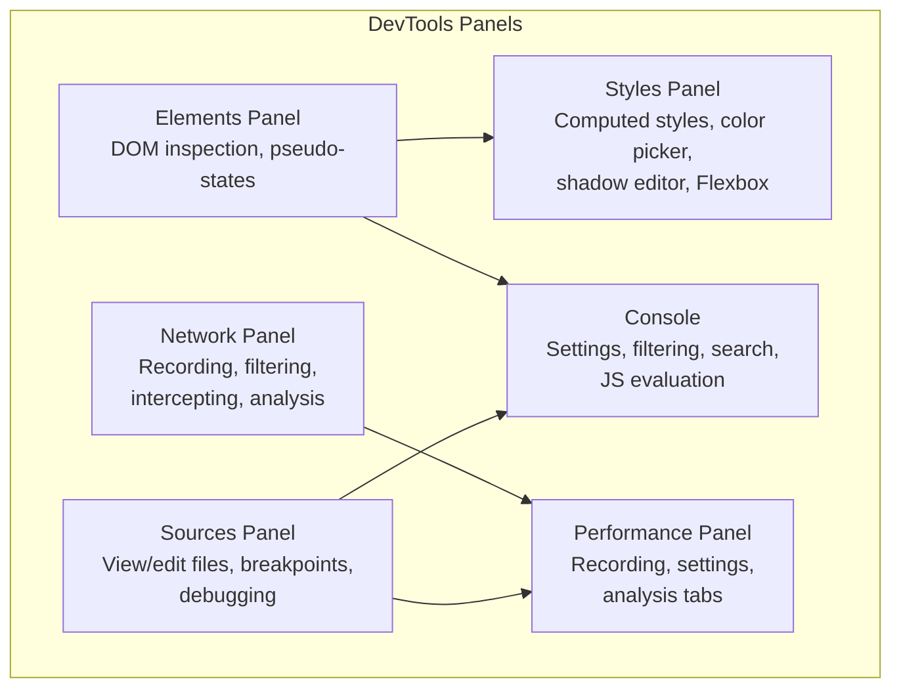

**Section sources**
- [07_元素.md:1-28](file://docs/04_更多/02_开发者工具/07_元素.md#L1-L28)
- [08_样式.md:1-39](file://docs/04_更多/02_开发者工具/08_样式.md#L1-L39)
- [10_控制台.md:1-215](file://docs/04_更多/02_开发者工具/10_控制台.md#L1-L215)
- [11_网络.md:1-252](file://docs/04_更多/02_开发者工具/11_网络.md#L1-L252)
- [17_源代码.md:1-14](file://docs/04_更多/02_开发者工具/17_源代码.md#L1-L14)
- [24_性能.md:1-198](file://docs/04_更多/02_开发者工具/24_性能.md#L1-L198)

## Core Components
- Elements panel: Inspect and manipulate DOM nodes, force pseudo-states, and quickly select elements via selectors and selection history.
- Styles panel: View computed styles, adjust element sizing, use the color picker, edit shadows, and debug Flexbox layouts.
- Console: Configure logging behavior, filter and search messages, evaluate JavaScript expressions, and use utility APIs for DOM queries and object inspection.
- Network panel: Record network activity, filter by type and resource, simulate network conditions, block requests, and analyze headers, payloads, and timing.
- Sources panel: View and edit files, create and save code snippets, set up workspaces, and debug JavaScript with breakpoints.
- Breakpoints: Manage various breakpoint types (line, conditional, logpoint, DOM, XHR/Fetch, event listener, exception, function, Trusted Types).
- Debugging controls: Step over, step into, step out, continue, and “run to” specific lines; inspect scopes and call stacks; watch custom expressions.
- Performance panel: Record runtime or load performance, configure settings (CPU throttling, memory GC, screenshots), and analyze timelines, frames, memory, and interactions.

**Section sources**
- [07_元素.md:1-28](file://docs/04_更多/02_开发者工具/07_元素.md#L1-L28)
- [08_样式.md:1-39](file://docs/04_更多/02_开发者工具/08_样式.md#L1-L39)
- [10_控制台.md:1-215](file://docs/04_更多/02_开发者工具/10_控制台.md#L1-L215)
- [11_网络.md:1-252](file://docs/04_更多/02_开发者工具/11_网络.md#L1-L252)
- [17_源代码.md:1-14](file://docs/04_更多/02_开发者工具/17_源代码.md#L1-L14)
- [22_源代码_断点.md:1-127](file://docs/04_更多/02_开发者工具/22_源代码_断点.md#L1-L127)
- [23_源代码_调试.md:1-66](file://docs/04_更多/02_开发者工具/23_源代码_调试.md#L1-L66)
- [24_性能.md:1-198](file://docs/04_更多/02_开发者工具/24_性能.md#L1-L198)

## Architecture Overview
The DevTools workflow integrates panels that feed data into each other. The Network panel captures runtime events that appear in the Performance timeline. The Sources panel provides breakpoints and stepping that influence the Performance timeline and Console logs. The Elements and Styles panels inform layout and rendering costs captured in the Performance panel.

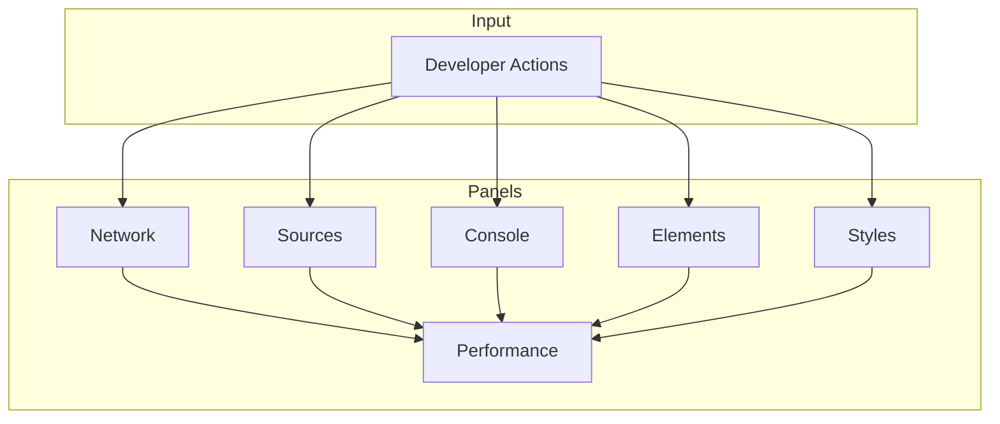

**Section sources**
- [11_网络.md:1-252](file://docs/04_更多/02_开发者工具/11_网络.md#L1-L252)
- [24_性能.md:1-198](file://docs/04_更多/02_开发者工具/24_性能.md#L1-L198)
- [23_源代码_调试.md:1-66](file://docs/04_更多/02_开发者工具/23_源代码_调试.md#L1-L66)

## Detailed Component Analysis

### Elements Panel: DOM Inspection and Pseudo-State Testing
- Scroll into view and reorder DOM nodes to observe layout changes.
- Force pseudo-states (:active, :hover, :focus, :visited, :focus-within) to test interactive styles.
- Use selection helpers ($0) and store selections as global variables for reuse.
- Inspect DOM object attributes and properties directly.

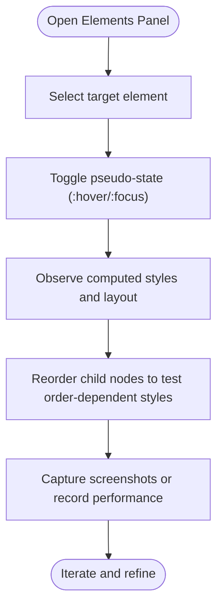

**Section sources**
- [07_元素.md:1-28](file://docs/04_更多/02_开发者工具/07_元素.md#L1-L28)

### Styles Panel: CSS Debugging and Layout Tools
- Add pseudo-selectors and adjust element dimensions to isolate style effects.
- Review computed styles to distinguish initial values and custom properties.
- Use the color picker and shadow editor for precise visual tuning.
- Debug Flexbox layouts with dedicated layout tools.

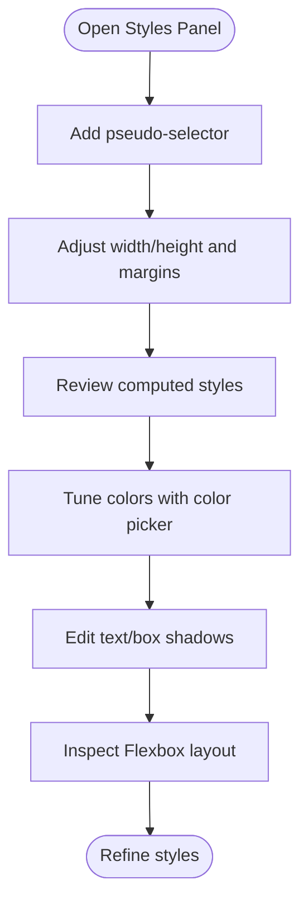

**Section sources**
- [08_样式.md:1-39](file://docs/04_更多/02_开发者工具/08_样式.md#L1-L39)

### Console: JavaScript Evaluation and Logging
- Configure logging behavior: hide network logs, preserve logs across navigation, restrict to selected context, group similar messages, show CORS errors, and enable early evaluation.
- Filter and search messages by level, text, regular expressions, URL, and source.
- Evaluate JavaScript expressions, use live expressions, and switch execution contexts.
- Inspect object properties, including getters, enumerability, and internal slots.
- Utilize utility APIs for DOM selection and inspection.

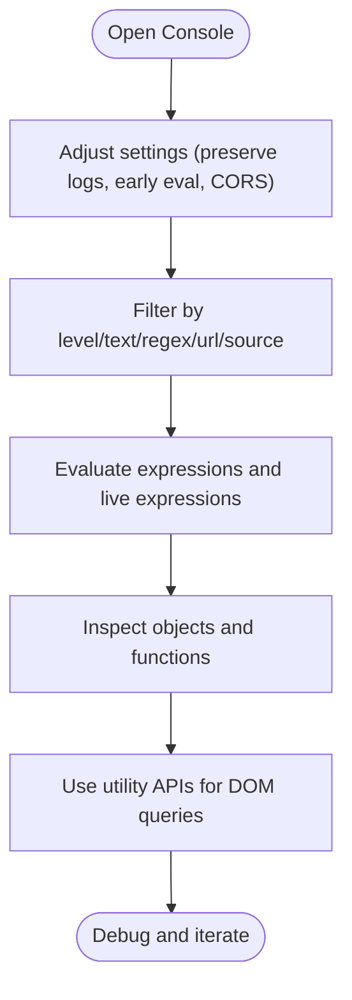

**Section sources**
- [10_控制台.md:1-215](file://docs/04_更多/02_开发者工具/10_控制台.md#L1-L215)

### Network Panel: Recording, Filtering, and Analysis
- Start/stop recording, preserve logs during page loads, and capture screenshots during load.
- Replay XHR requests and search headers/responses.
- Block requests, disable/flush cache, clear cookies, and simulate network conditions.
- Filter by resource type, size, time range, and third-party origins.
- Analyze request details: headers, payload, preview, response, initiator stack, timing, and cookies.

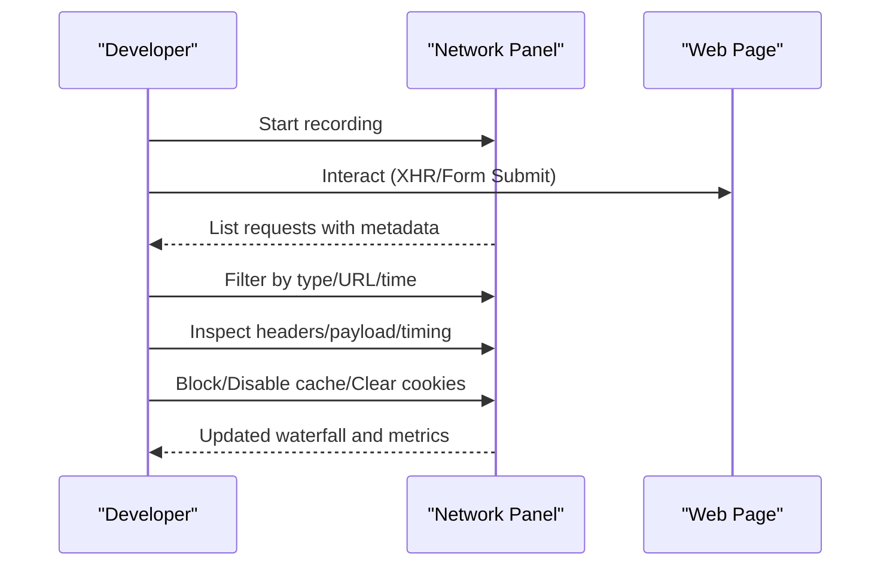

**Section sources**
- [11_网络.md:1-252](file://docs/04_更多/02_开发者工具/11_网络.md#L1-L252)

### Sources Panel: Viewing, Editing, and Debugging
- View and edit CSS/JavaScript files.
- Create and save code snippets for reuse across pages.
- Set up workspaces to persist edits to disk.
- Debug JavaScript with breakpoints and stepping controls.

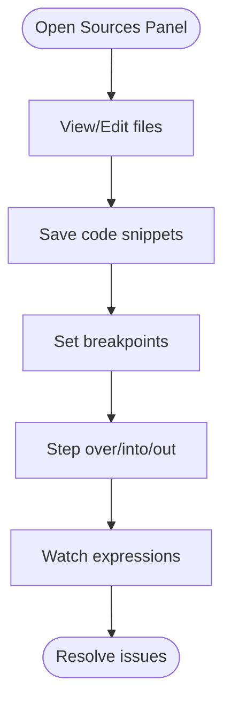

**Section sources**
- [17_源代码.md:1-14](file://docs/04_更多/02_开发者工具/17_源代码.md#L1-L14)

### Breakpoints: Management and Types
- Line breakpoints pause before executing the line.
- Conditional breakpoints pause only when a condition is true.
- Logpoints log messages to the Console without pausing.
- DOM change breakpoints pause on subtree/attribute/removal changes.
- XHR/Fetch breakpoints pause when the request URL matches a pattern.
- Event listener breakpoints pause after an event handler runs.
- Exception breakpoints pause on thrown exceptions.
- Function breakpoints pause on every call to a named function.
- Trusted Types breakpoints pause on policy violations.

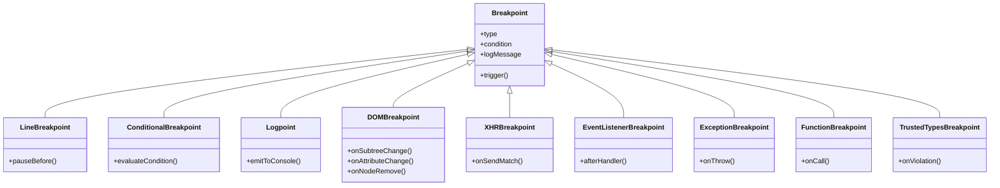

**Section sources**
- [22_源代码_断点.md:1-127](file://docs/04_更多/02_开发者工具/22_源代码_断点.md#L1-L127)

### Debugging Controls: Stepping, Scopes, Call Stack, and Watches
- Step controls: skip function calls, enter next function, exit current function, continue execution, and run to a specific line.
- Inspect and modify local, closure, and global scope properties.
- View the call stack and jump to caller locations; restart individual frames.
- Watch custom JavaScript expressions.

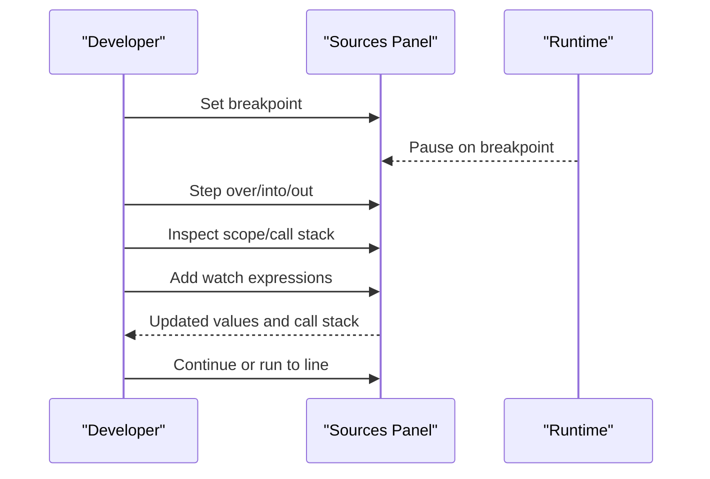

**Section sources**
- [23_源代码_调试.md:1-66](file://docs/04_更多/02_开发者工具/23_源代码_调试.md#L1-L66)

### Performance Panel: Recording, Settings, and Analysis
- Choose runtime or load performance recording modes.
- Configure settings: capture screenshots, force GC, disable JS sampling, throttle bandwidth/CPU, enable advanced paint instrumentation, simulate hardware concurrency.
- Analyze timelines: search activities, zoom/pan, breadcrumb navigation.
- Explore Main track for long tasks and causality arrows.
- Use self/total time views (bottom-up, call tree, event log).
- Inspect memory, time markers (FP/FCP/LCP/DCL/load), FPS frames, layer info, network waterfall, user interactions (INP), and GPU activity.

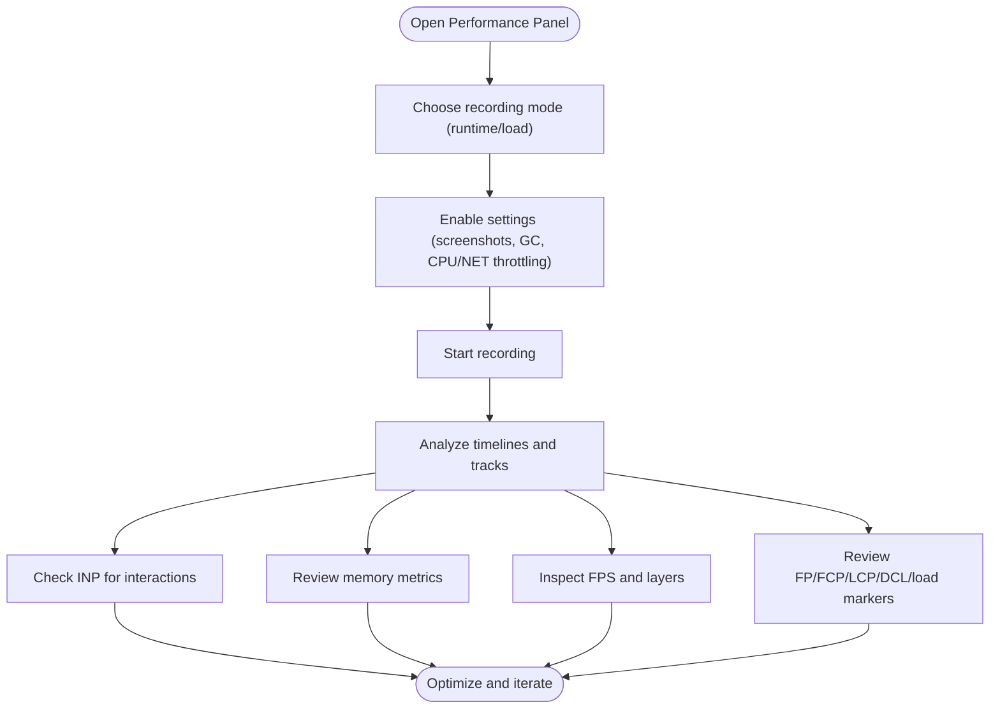

**Section sources**
- [24_性能.md:1-198](file://docs/04_更多/02_开发者工具/24_性能.md#L1-L198)

## Dependency Analysis
- Network panel data informs Performance timeline events and vice versa.
- Sources panel breakpoints and stepping influence Performance traces and Console logs.
- Elements and Styles panels’ changes impact layout and rendering costs captured by Performance.

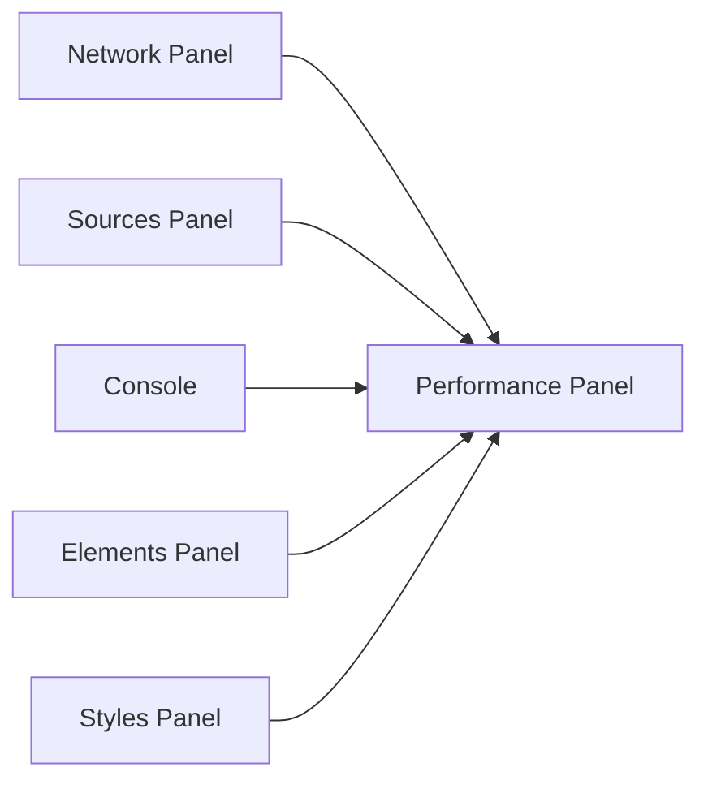

**Section sources**
- [11_网络.md:1-252](file://docs/04_更多/02_开发者工具/11_网络.md#L1-L252)
- [24_性能.md:1-198](file://docs/04_更多/02_开发者工具/24_性能.md#L1-L198)
- [23_源代码_调试.md:1-66](file://docs/04_更多/02_开发者工具/23_源代码_调试.md#L1-L66)

## Performance Considerations
- Use Performance panel to identify long tasks, layout thrashing, excessive paints, and slow interactions.
- Apply Network panel filters and blocking to reduce external dependencies during profiling.
- Enable CPU throttling and network throttling in Performance settings to simulate constrained environments.
- Monitor memory trends and garbage collection pauses to detect potential leaks.
- Focus on Largest Contentful Paint (LCP), First Contentful Paint (FCP), and Interaction to Next Paint (INP) markers for user-centric metrics.

[No sources needed since this section provides general guidance]

## Troubleshooting Guide
- Console settings: disable network logs, preserve logs across navigation, restrict to selected context, and toggle grouping to improve signal/noise.
- Network panel: block unwanted requests, disable/flush cache, clear cookies, and simulate offline/slow connections to reproduce and diagnose issues.
- Breakpoints: verify ignore lists and conditions; use logpoints to avoid disrupting execution flow.
- Performance panel: enable screenshots and advanced paint instrumentation; leverage breadcrumbs and keyboard shortcuts to navigate timelines efficiently.

**Section sources**
- [10_控制台.md:1-215](file://docs/04_更多/02_开发者工具/10_控制台.md#L1-L215)
- [11_网络.md:1-252](file://docs/04_更多/02_开发者工具/11_网络.md#L1-L252)
- [22_源代码_断点.md:1-127](file://docs/04_更多/02_开发者工具/22_源代码_断点.md#L1-L127)
- [24_性能.md:1-198](file://docs/04_更多/02_开发者工具/24_性能.md#L1-L198)

## Conclusion
Chrome DevTools offers a cohesive suite of panels for inspecting the DOM, debugging CSS, evaluating JavaScript, capturing and analyzing network traffic, and profiling runtime performance. By combining the Elements, Styles, Console, Network, Sources, Breakpoints, and Performance panels, developers can systematically diagnose issues, optimize page load times, and identify performance bottlenecks. The workflows outlined here provide practical, step-by-step guidance for everyday debugging and advanced profiling.

[No sources needed since this section summarizes without analyzing specific files]

## Appendices
- Mobile device emulation and device toolbar usage: configure device metrics and user agent to test responsive layouts and device-specific behaviors.
- Cross-browser compatibility testing: use Console and Network panels to compare behaviors across browsers, noting differences in API support, rendering engines, and network handling.

[No sources needed since this section provides general guidance]