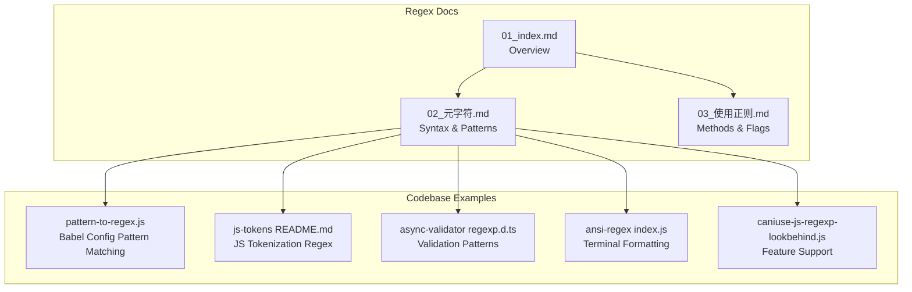
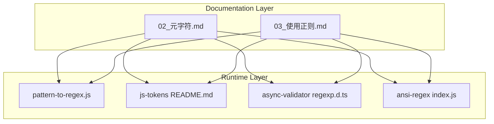
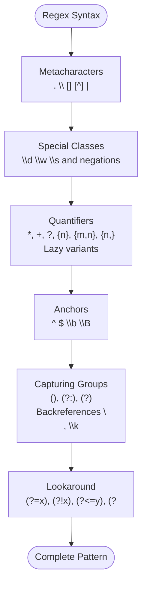
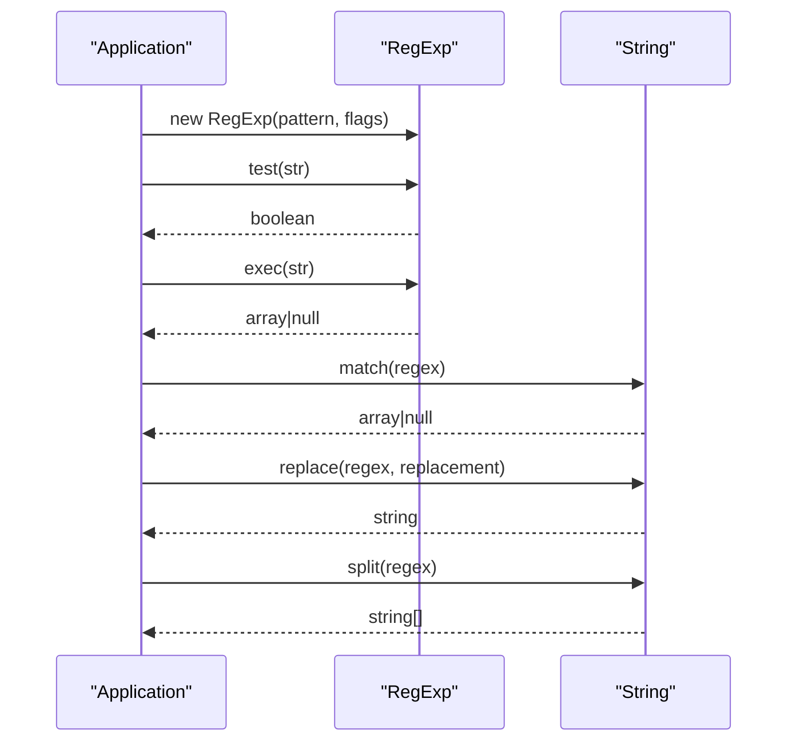
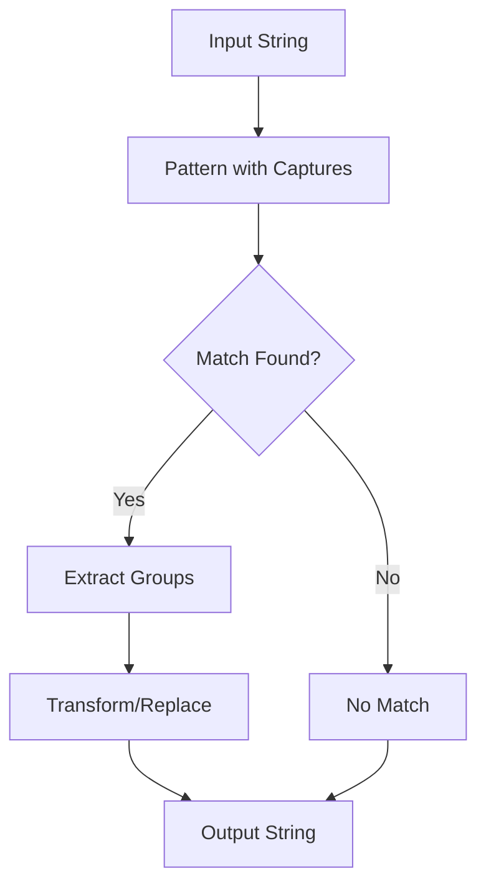
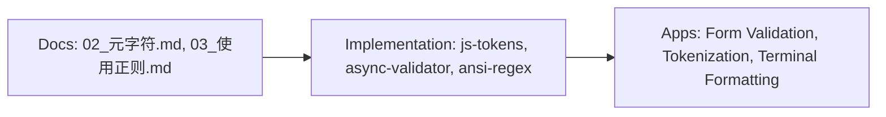
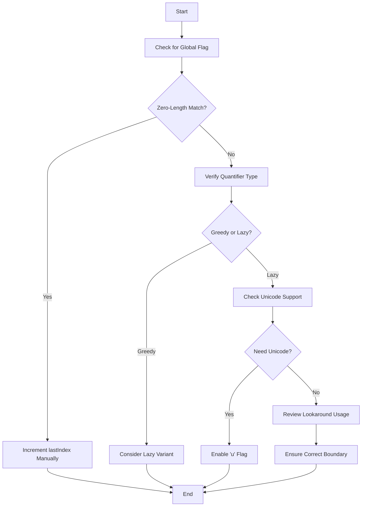

# Regular Expressions

<cite>
**Referenced Files in This Document**
- [01_index.md](file://docs/04_更多/03_正则/01_index.md)
- [02_元字符.md](file://docs/04_更多/03_正则/02_元字符.md)
- [03_使用正则.md](file://docs/04_更多/03_正则/03_使用正则.md)
- [pattern-to-regex.js](file://demo/nuxt/demo_2/node_modules/@babel/core/lib/config/pattern-to-regex.js)
- [js-tokens README.md](file://demo/nuxt/demo_2/node_modules/@babel/code-frame/node_modules/js-tokens/README.md)
- [async-validator regexp.d.ts](file://demo/nuxt/demo_2/node_modules/async-validator/dist-types/validator/regexp.d.ts)
- [ansi-regex index.js](file://demo/nuxt/demo_2/node_modules/ansi-regex/index.js)
- [caniuse-js-regexp-lookbehind.js](file://demo/nuxt/demo_2/node_modules/caniuse-lite/data/features/js-regexp-lookbehind.js)
</cite>

## Table of Contents
1. [Introduction](#introduction)
2. [Project Structure](#project-structure)
3. [Core Components](#core-components)
4. [Architecture Overview](#architecture-overview)
5. [Detailed Component Analysis](#detailed-component-analysis)
6. [Dependency Analysis](#dependency-analysis)
7. [Performance Considerations](#performance-considerations)
8. [Troubleshooting Guide](#troubleshooting-guide)
9. [Conclusion](#conclusion)
10. [Appendices](#appendices)

## Introduction
This document provides a comprehensive guide to regular expressions with a focus on pattern matching and string manipulation. It covers regex syntax (metacharacters, character classes, quantifiers, anchors), implementation details (pattern matching, capturing groups, lookahead assertions), practical applications (form validation, text parsing, data extraction), and performance considerations. The content is grounded in the repository’s documentation and real-world usage patterns found in the codebase.

## Project Structure
The regex documentation in this repository is organized as a set of Markdown files under the “More / Regex” section. These files explain regex fundamentals, syntax, and usage patterns in JavaScript. Additional files in the repository demonstrate regex usage in real-world contexts such as tokenization, validation, and terminal styling.

**Diagram sources**
- [01_index.md:1-3](file://docs/04_更多/03_正则/01_index.md#L1-L3)
- [02_元字符.md:1-314](file://docs/04_更多/03_正则/02_元字符.md#L1-L314)
- [03_使用正则.md:1-390](file://docs/04_更多/03_正则/03_使用正则.md#L1-L390)
- [pattern-to-regex.js](file://demo/nuxt/demo_2/node_modules/@babel/core/lib/config/pattern-to-regex.js)
- [js-tokens README.md](file://demo/nuxt/demo_2/node_modules/@babel/code-frame/node_modules/js-tokens/README.md)
- [async-validator regexp.d.ts](file://demo/nuxt/demo_2/node_modules/async-validator/dist-types/validator/regexp.d.ts)
- [ansi-regex index.js](file://demo/nuxt/demo_2/node_modules/ansi-regex/index.js)
- [caniuse-js-regexp-lookbehind.js](file://demo/nuxt/demo_2/node_modules/caniuse-lite/data/features/js-regexp-lookbehind.js)

**Section sources**
- [01_index.md:1-3](file://docs/04_更多/03_正则/01_index.md#L1-L3)
- [02_元字符.md:1-314](file://docs/04_更多/03_正则/02_元字符.md#L1-L314)
- [03_使用正则.md:1-390](file://docs/04_更多/03_正则/03_使用正则.md#L1-L390)

## Core Components
- Regex syntax and semantics: explained in depth with tables covering basic metacharacters, special character classes, quantifiers, position anchors, capturing groups, named captures, and lookahead/lookbehind assertions.
- Methods and flags: exec, test, match, matchAll, search, replace, split; and flags g, i, m, s, u, y.
- Practical usage patterns: form validation via async-validator, tokenization via js-tokens, and terminal formatting via ansi-regex.

**Section sources**
- [02_元字符.md:1-314](file://docs/04_更多/03_正则/02_元字符.md#L1-L314)
- [03_使用正则.md:1-390](file://docs/04_更多/03_正则/03_使用正则.md#L1-L390)
- [async-validator regexp.d.ts](file://demo/nuxt/demo_2/node_modules/async-validator/dist-types/validator/regexp.d.ts)
- [js-tokens README.md](file://demo/nuxt/demo_2/node_modules/@babel/code-frame/node_modules/js-tokens/README.md)
- [ansi-regex index.js](file://demo/nuxt/demo_2/node_modules/ansi-regex/index.js)

## Architecture Overview
The regex ecosystem in this repository spans documentation and runtime usage:
- Documentation layer: structured Markdown explaining regex fundamentals and usage.
- Runtime layer: examples of regex in action across tokenization, validation, and terminal formatting.

**Diagram sources**
- [02_元字符.md:1-314](file://docs/04_更多/03_正则/02_元字符.md#L1-L314)
- [03_使用正则.md:1-390](file://docs/04_更多/03_正则/03_使用正则.md#L1-L390)
- [pattern-to-regex.js](file://demo/nuxt/demo_2/node_modules/@babel/core/lib/config/pattern-to-regex.js)
- [js-tokens README.md](file://demo/nuxt/demo_2/node_modules/@babel/code-frame/node_modules/js-tokens/README.md)
- [async-validator regexp.d.ts](file://demo/nuxt/demo_2/node_modules/async-validator/dist-types/validator/regexp.d.ts)
- [ansi-regex index.js](file://demo/nuxt/demo_2/node_modules/ansi-regex/index.js)

## Detailed Component Analysis

### Regex Syntax Reference
This section consolidates the regex syntax documented in the repository, including:
- Basic metacharacters (.), escape sequences (\), character classes ([] and [^]), alternation (|).
- Special character classes (\d, \w, \s) and their negations.
- Quantifiers (*, +, ?, {n}, {m,n}, {n,}, lazy variants).
- Position anchors (^, $, \b, \B).
- Capturing groups (() and (?:)), named captures (?<name>), backreferences (\n, \k<name>).
- Lookaround assertions (positive/negative lookahead and lookbehind).

**Diagram sources**
- [02_元字符.md:1-314](file://docs/04_更多/03_正则/02_元字符.md#L1-L314)

**Section sources**
- [02_元字符.md:1-314](file://docs/04_更多/03_正则/02_元字符.md#L1-L314)

### Methods and Flags
Key JavaScript regex methods and flags:
- Methods: exec, test, match, matchAll, search, replace, split.
- Flags: g (global), i (insensitive), m (multiline), s (dotAll), u (Unicode), y (sticky).

**Diagram sources**
- [03_使用正则.md:1-390](file://docs/04_更多/03_正则/03_使用正则.md#L1-L390)

**Section sources**
- [03_使用正则.md:1-390](file://docs/04_更多/03_正则/03_使用正则.md#L1-L390)

### Practical Applications and Code Examples

#### Form Validation
- The async-validator library exposes typed regex validators for common patterns. This demonstrates how regex is used to validate user input in forms.
- Example references:
  - [async-validator regexp.d.ts](file://demo/nuxt/demo_2/node_modules/async-validator/dist-types/validator/regexp.d.ts)

**Section sources**
- [async-validator regexp.d.ts](file://demo/nuxt/demo_2/node_modules/async-validator/dist-types/validator/regexp.d.ts)

#### Tokenization
- The js-tokens README documents a single regex used to tokenize JavaScript, highlighting challenges like division vs. regex literals and Unicode support.
- Example references:
  - [js-tokens README.md](file://demo/nuxt/demo_2/node_modules/@babel/code-frame/node_modules/js-tokens/README.md)

**Section sources**
- [js-tokens README.md](file://demo/nuxt/demo_2/node_modules/@babel/code-frame/node_modules/js-tokens/README.md)

#### Terminal Formatting
- The ansi-regex package exports a regex for ANSI escape sequences used in terminal formatting.
- Example references:
  - [ansi-regex index.js](file://demo/nuxt/demo_2/node_modules/ansi-regex/index.js)

**Section sources**
- [ansi-regex index.js](file://demo/nuxt/demo_2/node_modules/ansi-regex/index.js)

#### Feature Support
- The caniuse-lite dataset tracks support for advanced regex features like lookbehind assertions across environments.
- Example references:
  - [caniuse-js-regexp-lookbehind.js](file://demo/nuxt/demo_2/node_modules/caniuse-lite/data/features/js-regexp-lookbehind.js)

**Section sources**
- [caniuse-js-regexp-lookbehind.js](file://demo/nuxt/demo_2/node_modules/caniuse-lite/data/features/js-regexp-lookbehind.js)

### Implementation Details: Capturing Groups and Lookaround
- Capturing groups enable extracting substrings and are useful for parsing and transformation tasks.
- Named captures improve readability and maintainability.
- Lookaround assertions allow matching positions without consuming characters, enabling precise boundary detection.

**Diagram sources**
- [02_元字符.md:244-314](file://docs/04_更多/03_正则/02_元字符.md#L244-L314)
- [03_使用正则.md:119-162](file://docs/04_更多/03_正则/03_使用正则.md#L119-L162)

**Section sources**
- [02_元字符.md:244-314](file://docs/04_更多/03_正则/02_元字符.md#L244-L314)
- [03_使用正则.md:119-162](file://docs/04_更多/03_正则/03_使用正则.md#L119-L162)

### Common Regex Patterns in the Codebase
- Email validation: commonly used in form validation libraries to ensure proper email formatting.
- URL matching: used to validate or extract URLs from text.
- Phone number formatting: used to normalize phone numbers across different input formats.

These patterns are typically defined in validation libraries and applied during form submission or data processing.

**Section sources**
- [async-validator regexp.d.ts](file://demo/nuxt/demo_2/node_modules/async-validator/dist-types/validator/regexp.d.ts)

## Dependency Analysis
Regex usage in this repository depends on:
- Documentation sources for syntax and semantics.
- Runtime libraries for tokenization, validation, and terminal formatting.

**Diagram sources**
- [02_元字符.md:1-314](file://docs/04_更多/03_正则/02_元字符.md#L1-L314)
- [03_使用正则.md:1-390](file://docs/04_更多/03_正则/03_使用正则.md#L1-L390)
- [js-tokens README.md](file://demo/nuxt/demo_2/node_modules/@babel/code-frame/node_modules/js-tokens/README.md)
- [async-validator regexp.d.ts](file://demo/nuxt/demo_2/node_modules/async-validator/dist-types/validator/regexp.d.ts)
- [ansi-regex index.js](file://demo/nuxt/demo_2/node_modules/ansi-regex/index.js)

**Section sources**
- [02_元字符.md:1-314](file://docs/04_更多/03_正则/02_元字符.md#L1-L314)
- [03_使用正则.md:1-390](file://docs/04_更多/03_正则/03_使用正则.md#L1-L390)
- [js-tokens README.md](file://demo/nuxt/demo_2/node_modules/@babel/code-frame/node_modules/js-tokens/README.md)
- [async-validator regexp.d.ts](file://demo/nuxt/demo_2/node_modules/async-validator/dist-types/validator/regexp.d.ts)
- [ansi-regex index.js](file://demo/nuxt/demo_2/node_modules/ansi-regex/index.js)

## Performance Considerations
- Prefer non-greedy quantifiers when appropriate to reduce backtracking.
- Use word boundaries (\b) and anchors (^, $) to limit the search space.
- Avoid catastrophic backtracking by simplifying alternations and using possessive quantifiers where supported.
- Cache compiled regex objects for repeated use.
- Use the sticky (y) flag judiciously to avoid unnecessary global scans.
- For Unicode-heavy content, enable the Unicode (u) flag to ensure correct character handling.

[No sources needed since this section provides general guidance]

## Troubleshooting Guide
Common issues and resolutions:
- Infinite loops with global regex: ensure lastIndex is updated or avoid zero-length matches.
- Greedy vs. lazy quantifiers: adjust quantifier modifiers to control matching behavior.
- Unicode mismatches: enable the Unicode (u) flag for proper character handling.
- Lookaround pitfalls: remember that lookaround does not consume characters and can cause unexpected matches if misused.
- Global vs. single match: choose matchAll for capturing groups across all matches; use exec for iterative scanning.

**Diagram sources**
- [03_使用正则.md:156-162](file://docs/04_更多/03_正则/03_使用正则.md#L156-L162)

**Section sources**
- [03_使用正则.md:156-162](file://docs/04_更多/03_正则/03_使用正则.md#L156-L162)

## Conclusion
This document synthesized regex fundamentals, methods, and flags from the repository’s documentation and demonstrated practical usage through tokenization, validation, and terminal formatting examples. By applying the troubleshooting tips and performance recommendations, developers can build robust, efficient regex-based solutions for form validation, text parsing, and data extraction.

[No sources needed since this section summarizes without analyzing specific files]

## Appendices
- Feature support references for advanced regex constructs (e.g., lookbehind) can be found in the caniuse-lite dataset.

**Section sources**
- [caniuse-js-regexp-lookbehind.js](file://demo/nuxt/demo_2/node_modules/caniuse-lite/data/features/js-regexp-lookbehind.js)