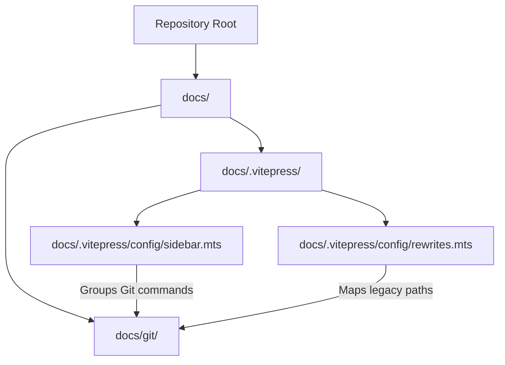
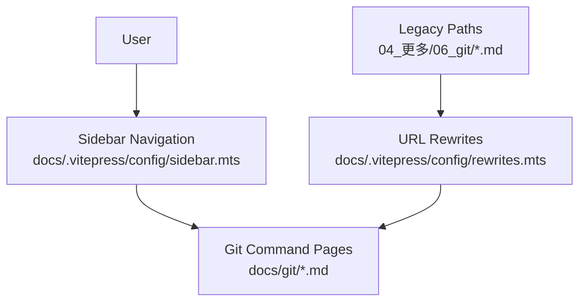
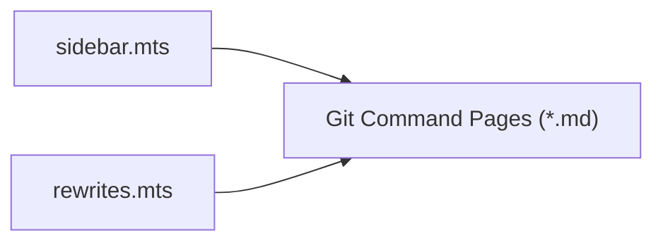
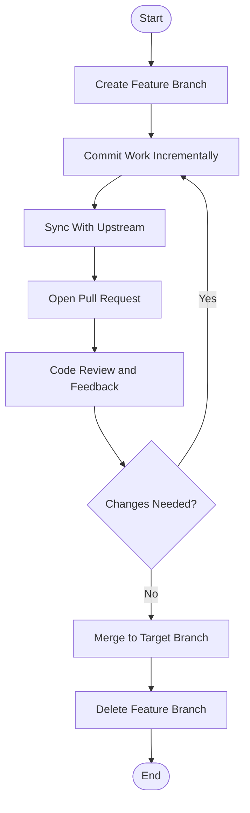

# Version Control with Git

<cite>
**Referenced Files in This Document**
- [sidebar.mts](file://docs/.vitepress/config/sidebar.mts)
- [rewrites.mts](file://docs/.vitepress/config/rewrites.mts)
- [index.md](file://docs/index.md)
- [.gitignore](file://.gitignore)
- [README.md](file://README.md)
</cite>

## Table of Contents
1. [Introduction](#introduction)
2. [Project Structure](#project-structure)
3. [Core Components](#core-components)
4. [Architecture Overview](#architecture-overview)
5. [Detailed Component Analysis](#detailed-component-analysis)
6. [Dependency Analysis](#dependency-analysis)
7. [Performance Considerations](#performance-considerations)
8. [Troubleshooting Guide](#troubleshooting-guide)
9. [Conclusion](#conclusion)
10. [Appendices](#appendices)

## Introduction
This document consolidates Git workflow best practices and collaboration strategies for teams working within this repository. It explains how to initialize projects, manage branches, merge and rebase safely, handle remotes, and collaborate effectively via pull requests and shared workflows. Advanced topics include cherry-picking, interactive rebase, submodules, conflict resolution, stash usage, repository maintenance, Git hooks, and integration with development tools. Branching strategies, release management, and team collaboration guidelines are also covered, along with troubleshooting and recovery procedures.

## Project Structure
The documentation for Git commands and workflows is organized as a VitePress site with a sidebar navigation and URL rewrites that map legacy paths to modern routes. The sidebar groups Git commands into logical categories such as configuration, creation, basic operations, branching and merging, sharing and updating, patching, and inspection. Rewrites ensure backward compatibility for existing links.

**Diagram sources**
- [sidebar.mts:1252-1392](file://docs/.vitepress/config/sidebar.mts#L1252-L1392)
- [rewrites.mts:250-271](file://docs/.vitepress/config/rewrites.mts#L250-L271)

**Section sources**
- [sidebar.mts:1252-1392](file://docs/.vitepress/config/sidebar.mts#L1252-L1392)
- [rewrites.mts:250-271](file://docs/.vitepress/config/rewrites.mts#L250-L271)

## Core Components
- Git command categories and navigation:
  - Setup and configuration
  - Getting and creating projects
  - Basic commands (status, add, commit, rm, mv, restore, reset)
  - Branching and merging (branch, switch, merge, tag, stash)
  - Sharing and updating (remote, fetch, pull, push)
  - Patching (cherry-pick, revert, rebase)
  - Inspecting and comparing (show, log)

These categories reflect the documented Git command set and guide users to dedicated pages for each command.

**Section sources**
- [sidebar.mts:1256-1391](file://docs/.vitepress/config/sidebar.mts#L1256-L1391)

## Architecture Overview
The documentation architecture separates navigation (sidebar) from routing (rewrites) to present a structured learning path and maintain backward compatibility. Users navigate via the sidebar to discover Git topics, while rewrites ensure old URLs resolve to new locations seamlessly.

**Diagram sources**
- [sidebar.mts:1252-1392](file://docs/.vitepress/config/sidebar.mts#L1252-L1392)
- [rewrites.mts:250-271](file://docs/.vitepress/config/rewrites.mts#L250-L271)

**Section sources**
- [sidebar.mts:1252-1392](file://docs/.vitepress/config/sidebar.mts#L1252-L1392)
- [rewrites.mts:250-271](file://docs/.vitepress/config/rewrites.mts#L250-L271)

## Detailed Component Analysis

### Initialization and Project Creation
- Initialize a repository locally and clone remote repositories to bootstrap development.
- Configure user identity and editor preferences early to ensure consistent commits across collaborators.

Recommended steps:
- Initialize local repository
- Clone remote repository
- Configure user.name and user.email
- Set default branch and editor

**Section sources**
- [sidebar.mts:1270-1281](file://docs/.vitepress/config/sidebar.mts#L1270-L1281)

### Branching and Merging Workflows
- Create feature branches from a stable base (e.g., develop or main).
- Use switch to move between branches and merge to integrate completed work.
- Prefer fast-forward merges when history cleanliness is desired; otherwise, use merge commits to preserve branch context.

Common patterns:
- Feature branch lifecycle
- Release branch management
- Hotfix branching

Conflict prevention tips:
- Regularly sync with upstream
- Keep branches small and focused
- Communicate frequently during cross-branch integrations

**Section sources**
- [sidebar.mts:1315-1339](file://docs/.vitepress/config/sidebar.mts#L1315-L1339)

### Rebase and Cherry-Pick Strategies
- Interactive rebase to clean up history, reorder commits, squash, edit messages, or drop commits before sharing.
- Cherry-pick to apply specific commits from another branch or timeline without full merge.

Guidelines:
- Use rebase for local history cleanup; avoid rebasing pushed commits.
- Use cherry-pick for targeted inclusion of fixes or features across branches.

**Section sources**
- [sidebar.mts:1361-1377](file://docs/.vitepress/config/sidebar.mts#L1361-L1377)

### Remote Repository Management and Collaboration
- Manage remotes (add, rename, remove) and configure push/pull behavior per branch.
- Fetch updates, then pull or merge to update local working copy.
- Push changes to origin with appropriate refspecs; enforce review via pull requests or merge requests.

Collaboration patterns:
- Fork-and-pull vs shared-branch workflows
- Pull request etiquette and review cycles
- Maintaining clean commit histories

**Section sources**
- [sidebar.mts:1341-1360](file://docs/.vitepress/config/sidebar.mts#L1341-L1360)

### Stash and Conflict Resolution
- Use stash to temporarily save WIP without committing.
- Resolve conflicts during merge or rebase; stage resolved files and finalize the operation.

Best practices:
- Keep stashes short-lived
- Use meaningful stash messages
- Resolve conflicts systematically and test after resolution

**Section sources**
- [sidebar.mts:1334-1338](file://docs/.vitepress/config/sidebar.mts#L1334-L1338)

### Inspection and History Review
- Use log to browse commit history and show to inspect specific commits.
- Combine with grep-like filtering and date ranges for efficient auditing.

**Section sources**
- [sidebar.mts:1378-1391](file://docs/.vitepress/config/sidebar.mts#L1378-L1391)

### Hooks, Custom Workflows, and Tooling Integration
- Git hooks enable pre-commit checks, CI triggers, and custom automation.
- Integrate with editors, linters, and CI systems to enforce standards and quality gates.

Practical tips:
- Use pre-commit hooks for formatting and linting
- Automate repetitive tasks with post-checkout or post-merge hooks
- Align hook scripts with team policies and share configurations

**Section sources**
- [rewrites.mts:267-269](file://docs/.vitepress/config/rewrites.mts#L267-L269)

### Submodule Usage
- Add external repositories as submodules to include third-party libraries or shared components.
- Update and synchronize submodules regularly; treat them as separate Git repositories with their own history.

Guidelines:
- Pin submodule commits to specific versions
- Document submodule purpose and update procedures
- Educate contributors on submodule workflows

**Section sources**
- [sidebar.mts:1315-1339](file://docs/.vitepress/config/sidebar.mts#L1315-L1339)

### Repository Maintenance
- Clean up unreachable objects, prune stale branches, and optimize pack sizes periodically.
- Audit large files and sensitive data; rotate credentials and tokens.

Tools and commands:
- Garbage collection and repacking
- Large file detection and remediation
- Credential and token rotation

**Section sources**
- [sidebar.mts:1378-1391](file://docs/.vitepress/config/sidebar.mts#L1378-L1391)

## Dependency Analysis
The documentation depends on two primary configuration files:
- Sidebar defines the navigation taxonomy and links to Git command pages.
- Rewrites map legacy paths to current page locations, ensuring continuity.

**Diagram sources**
- [sidebar.mts:1252-1392](file://docs/.vitepress/config/sidebar.mts#L1252-L1392)
- [rewrites.mts:250-271](file://docs/.vitepress/config/rewrites.mts#L250-L271)

**Section sources**
- [sidebar.mts:1252-1392](file://docs/.vitepress/config/sidebar.mts#L1252-L1392)
- [rewrites.mts:250-271](file://docs/.vitepress/config/rewrites.mts#L250-L271)

## Performance Considerations
- Keep branch histories linear where possible to reduce merge overhead.
- Use shallow clones for large repositories when depth is sufficient.
- Prefer sparse-checkout for monorepos to limit working tree size.
- Optimize fetch strategies (single-branch, shallow) for CI environments.

[No sources needed since this section provides general guidance]

## Troubleshooting Guide
Common issues and recovery procedures:
- Lost commits after rebase: use reflog to locate dropped commits and reapply.
- Merge/rebase conflicts: resolve hunks, stage changes, and continue the operation.
- Stuck rebase: abort to undo and retry with adjusted strategy.
- Corrupted repository: recreate from a known-good remote or backup.

Operational tips:
- Back up critical branches before risky operations
- Use temporary branches for experimentation
- Leverage blame and bisect to isolate problematic changes

**Section sources**
- [sidebar.mts:1361-1377](file://docs/.vitepress/config/sidebar.mts#L1361-L1377)

## Conclusion
This Git documentation organizes essential commands and workflows into a navigable structure, enabling teams to adopt consistent practices for collaboration, branching, and maintenance. By following the recommended strategies—clean histories, clear communication, robust remote workflows, and disciplined conflict resolution—teams can sustain high productivity and code quality.

[No sources needed since this section summarizes without analyzing specific files]

## Appendices

### Appendix A: Recommended Branching and Release Strategies
- Feature branching: short-lived, frequent integrations
- Release branching: stabilize releases on dedicated branches
- Hotfix branching: minimal, urgent corrections applied across affected branches

[No sources needed since this section provides general guidance]

### Appendix B: Team Collaboration Guidelines
- Establish naming conventions for branches and commits
- Enforce pull request templates and review standards
- Rotate maintainer responsibilities and document escalation paths

[No sources needed since this section provides general guidance]

### Appendix C: Example Workflows (Conceptual)

[No sources needed since this diagram shows conceptual workflow, not actual code structure]