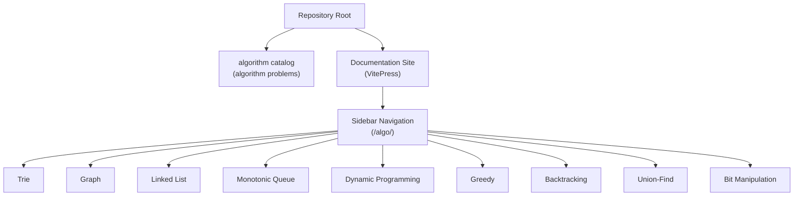
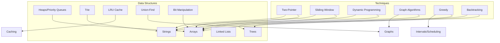
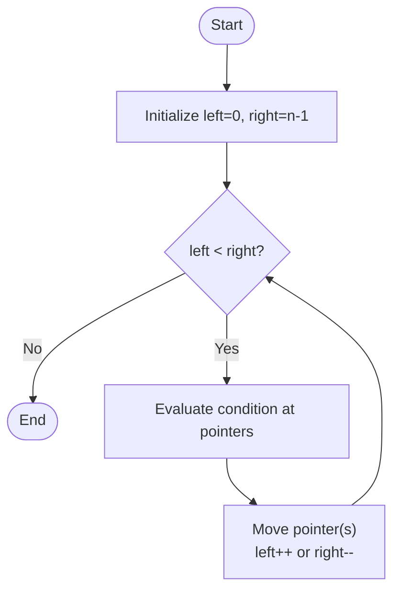
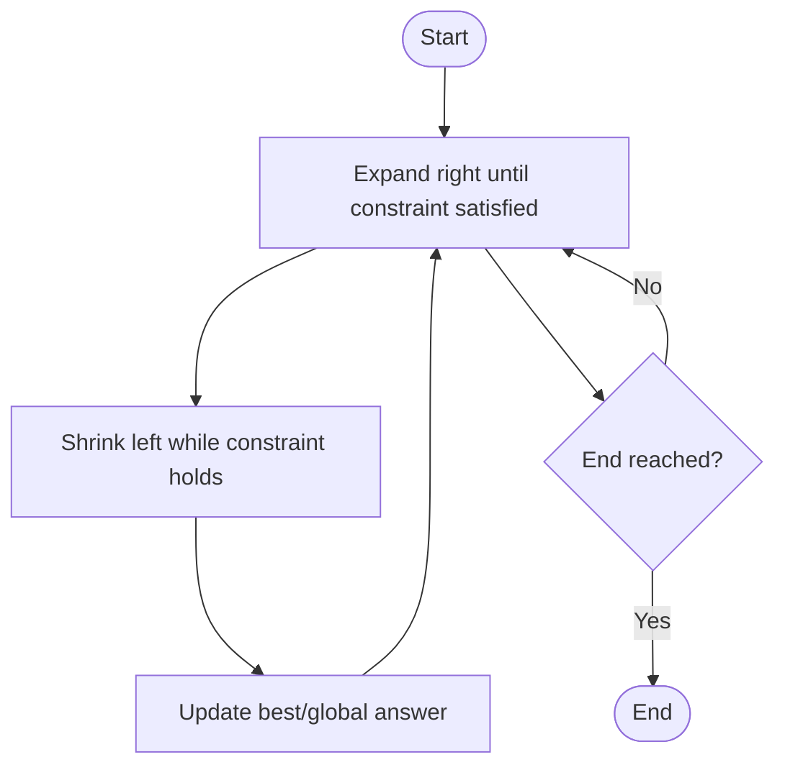
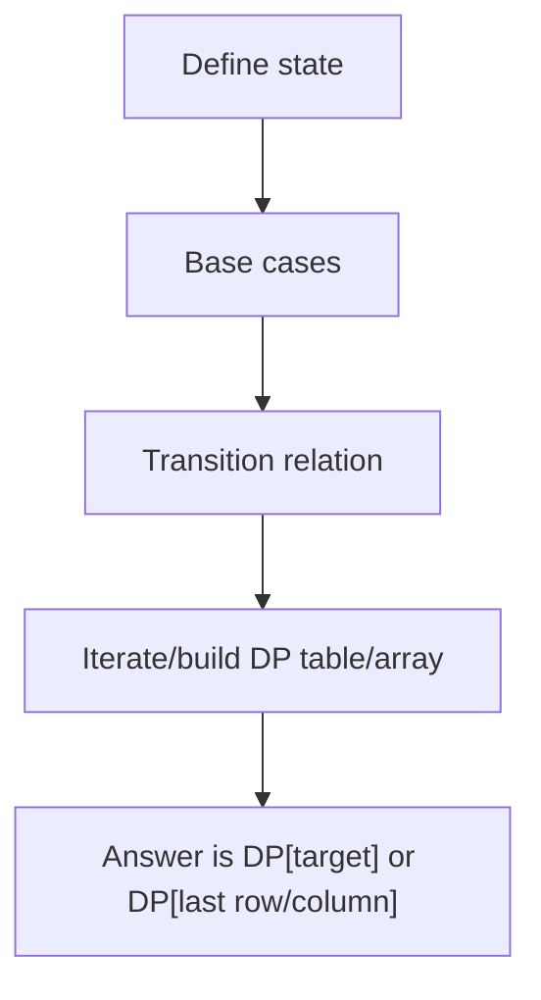
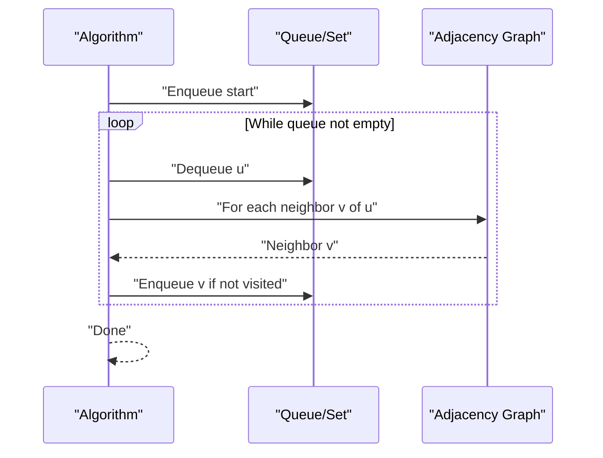
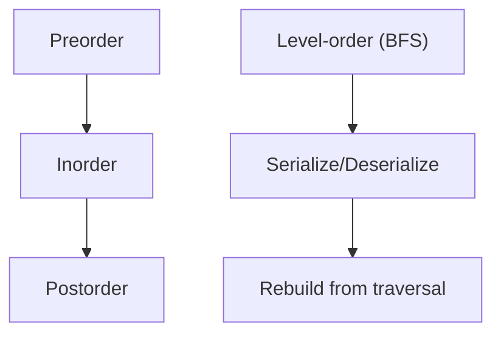
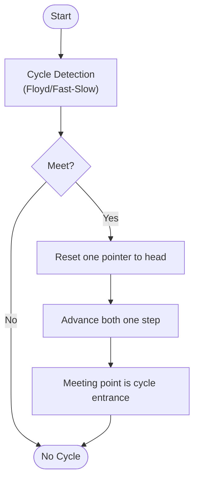
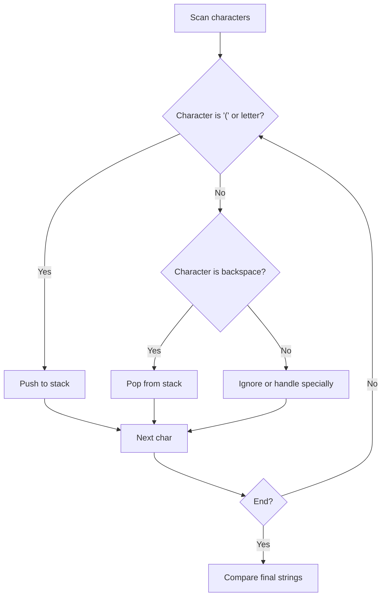
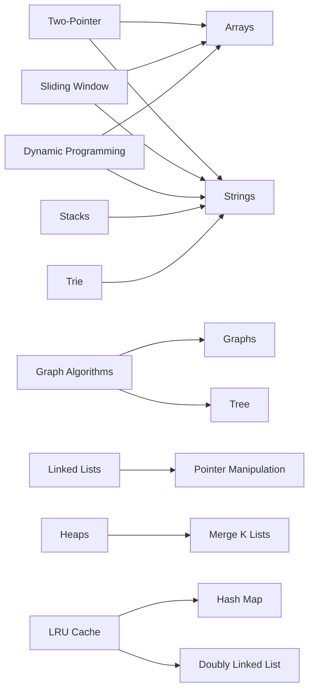

# Algorithm Practice

<cite>
**Referenced Files in This Document**
- [sidebar.mts](file://docs/.vitepress/config/sidebar.mts)
- [115.distinct-subsequences.js](file://算法/115.distinct-subsequences.js)
- [76.minimum-window-substring.js](file://算法/76.minimum-window-substring.js)
- [1.two-sum.js](file://算法/1.two-sum.js)
- [20.valid-parentheses.js](file://算法/20.valid-parentheses.js)
- [23.merge-k-sorted-lists.js](file://算法/23.merge-k-sorted-lists.js)
- [104.maximum-depth-of-binary-tree.js](file://算法/104.maximum-depth-of-binary-tree.js)
- [100.same-tree.js](file://算法/100.same-tree.js)
- [130.surrounded-regions.ts](file://算法/130.surrounded-regions.ts)
- [146.lru-cache.ts](file://算法/146.lru-cache.ts)
- [200.number-of-islands.ts](file://算法/200.number-of-islands.ts)
- [127.word-ladder.js](file://算法/127.word-ladder.js)
- [300.longest-increasing-subsequence.js](file://算法/300.longest-increasing-subsequence.js)
- [42.trapping-rain-water.js](file://算法/42.trapping-rain-water.js)
- [15.3-sum.js](file://算法/15.3-sum.js)
- [11.container-with-most-water.js](file://算法/11.container-with-most-water.js)
- [238.product-of-array-except-self.js](file://算法/238.product-of-array-except-self.js)
- [53.maximum-subarray.js](file://算法/53.maximum-subarray.js)
- [155.min-stack.ts](file://算法/155.min-stack.ts)
- [297.serialize-and-deserialize-binary-tree.js](file://算法/297.serialize-and-deserialize-binary-tree.js)
- [208.implement-trie-prefix-tree.ts](file://算法/208.implement-trie-prefix-tree.ts)
- [138.copy-list-with-random-pointer.ts](file://算法/138.copy-list-with-random-pointer.ts)
- [141.linked-list-cycle.ts](file://算法/141.linked-list-cycle.ts)
- [160.intersection-of-two-linked-lists.ts](file://算法/160.intersection-of-two-linked-lists.ts)
- [206.reverse-linked-list.js](file://算法/206.reverse-linked-list.js)
- [844.backspace-string-compare.js](file://算法/844.backspace-string-compare.js)
- [94.binary-tree-inorder-traversal.js](file://算法/94.binary-tree-inorder-traversal.js)
- [102.binary-tree-level-order-traversal.js](file://算法/102.binary-tree-level-order-traversal.js)
- [297.serialize-and-deserialize-binary-tree.js](file://算法/297.serialize-and-deserialize-binary-tree.js)
- [127.word-ladder.js](file://算法/127.word-ladder.js)
- [130.surrounded-regions.ts](file://算法/130.surrounded-regions.ts)
- [146.lru-cache.ts](file://算法/146.lru-cache.ts)
- [200.number-of-islands.ts](file://算法/200.number-of-islands.ts)
- [300.longest-increasing-subsequence.js](file://算法/300.longest-increasing-subsequence.js)
- [42.trapping-rain-water.js](file://算法/42.trapping-rain-water.js)
- [15.3-sum.js](file://算法/15.3-sum.js)
- [11.container-with-most-water.js](file://算法/11.container-with-most-water.js)
- [238.product-of-array-except-self.js](file://算法/238.product-of-array-except-self.js)
- [53.maximum-subarray.js](file://算法/53.maximum-subarray.js)
- [155.min-stack.ts](file://算法/155.min-stack.ts)
- [208.implement-trie-prefix-tree.ts](file://算法/208.implement-trie-prefix-tree.ts)
- [138.copy-list-with-random-pointer.ts](file://算法/138.copy-list-with-random-pointer.ts)
- [141.linked-list-cycle.ts](file://算法/141.linked-list-cycle.ts)
- [160.intersection-of-two-linked-lists.ts](file://算法/160.intersection-of-two-linked-lists.ts)
- [206.reverse-linked-list.js](file://算法/206.reverse-linked-list.js)
- [844.backspace-string-compare.js](file://算法/844.backspace-string-compare.js)
- [94.binary-tree-inorder-traversal.js](file://算法/94.binary-tree-inorder-traversal.js)
- [102.binary-tree-level-order-traversal.js](file://算法/102.binary-tree-level-order-traversal.js)
</cite>

## Table of Contents
1. [Introduction](#introduction)
2. [Project Structure](#project-structure)
3. [Core Components](#core-components)
4. [Architecture Overview](#architecture-overview)
5. [Detailed Component Analysis](#detailed-component-analysis)
6. [Dependency Analysis](#dependency-analysis)
7. [Performance Considerations](#performance-considerations)
8. [Troubleshooting Guide](#troubleshooting-guide)
9. [Conclusion](#conclusion)
10. [Appendices](#appendices)

## Introduction
This document consolidates algorithm practice material from the repository’s algorithm catalog and documentation site. It focuses on problem-solving strategies, data structures, and implementation patterns commonly used in technical interviews and competitive programming. The content covers:
- Design approaches: two-pointer techniques, sliding windows, dynamic programming, and graph traversal
- Data structures: arrays, strings, linked lists, trees, and graphs
- Complexity analysis and optimization techniques
- Practical examples drawn from real problems in the repository

The goal is to provide both conceptual guidance for beginners and precise implementation insights for experienced developers.

## Project Structure
The algorithm practice materials are organized under the algorithm catalog and complemented by a documentation site with curated topics. The sidebar defines top-level algorithm categories that align with common interview topics.

**Diagram sources**
- [sidebar.mts:1163-1181](file://docs/.vitepress/config/sidebar.mts#L1163-L1181)

**Section sources**
- [sidebar.mts:1163-1181](file://docs/.vitepress/config/sidebar.mts#L1163-L1181)

## Core Components
This section outlines the major algorithmic paradigms and data structures covered in the repository, along with representative examples.

- Two-pointer techniques
  - Arrays and strings: fast/slow pointers, converging pointers
  - Representative examples: [11.container-with-most-water.js](file://算法/11.container-with-most-water.js), [15.3-sum.js](file://算法/15.3-sum.js), [238.product-of-array-except-self.js](file://算法/238.product-of-array-except-self.js)

- Sliding window
  - Fixed or variable-size windows over arrays/strings
  - Representative example: [76.minimum-window-substring.js](file://算法/76.minimum-window-substring.js)

- Dynamic programming (DP)
  - Optimal substructure and memoization/tabulation
  - Representative example: [115.distinct-subsequences.js](file://算法/115.distinct-subsequences.js)

- Graph algorithms
  - BFS/DFS traversal, shortest paths, topological sorting
  - Representative examples: [127.word-ladder.js](file://算法/127.word-ladder.js), [200.number-of-islands.ts](file://算法/200.number-of-islands.ts), [130.surrounded-regions.ts](file://算法/130.surrounded-regions.ts)

- Trees and binary trees
  - Traversals, serialization/deserialization, depth/path calculations
  - Representative examples: [104.maximum-depth-of-binary-tree.js](file://算法/104.maximum-depth-of-binary-tree.js), [94.binary-tree-inorder-traversal.js](file://算法/94.binary-tree-inorder-traversal.js), [102.binary-tree-level-order-traversal.js](file://算法/102.binary-tree-level-order-traversal.js), [297.serialize-and-deserialize-binary-tree.js](file://算法/297.serialize-and-deserialize-binary-tree.js)

- Linked lists
  - Pointers manipulation, cycle detection, merging, reversing
  - Representative examples: [23.merge-k-sorted-lists.js](file://算法/23.merge-k-sorted-lists.js), [141.linked-list-cycle.ts](file://算法/141.linked-list-cycle.ts), [160.intersection-of-two-linked-lists.ts](file://算法/160.intersection-of-two-linked-lists.ts), [206.reverse-linked-list.js](file://算法/206.reverse-linked-list.js), [138.copy-list-with-random-pointer.ts](file://算法/138.copy-list-with-random-pointer.ts)

- Strings and stacks
  - Balanced parentheses, stack-based parsing/comparison
  - Representative examples: [20.valid-parentheses.js](file://算法/20.valid-parentheses.js), [844.backspace-string-compare.js](file://算法/844.backspace-string-compare.js)

- Heaps and advanced structures
  - Priority queues, monotonic structures
  - Representative example: [23.merge-k-sorted-lists.js](file://算法/23.merge-k-sorted-lists.js)

- Hash maps and sets
  - Frequency counting, set membership, caching
  - Representative examples: [1.two-sum.js](file://算法/1.two-sum.js), [76.minimum-window-substring.js](file://算法/76.minimum-window-substring.js)

- Greedy and interval scheduling
  - Local optimum reasoning and activity selection
  - Representative examples: [53.maximum-subarray.js](file://算法/53.maximum-subarray.js), [42.trapping-rain-water.js](file://算法/42.trapping-rain-water.js)

- Specialized structures
  - LRU cache, trie (prefix tree)
  - Representative examples: [146.lru-cache.ts](file://算法/146.lru-cache.ts), [208.implement-trie-prefix-tree.ts](file://算法/208.implement-trie-prefix-tree.ts)

**Section sources**
- [11.container-with-most-water.js:1-200](file://算法/11.container-with-most-water.js#L1-L200)
- [15.3-sum.js:1-200](file://算法/15.3-sum.js#L1-L200)
- [238.product-of-array-except-self.js:1-200](file://算法/238.product-of-array-except-self.js#L1-L200)
- [76.minimum-window-substring.js:1-103](file://算法/76.minimum-window-substring.js#L1-L103)
- [115.distinct-subsequences.js:1-65](file://算法/115.distinct-subsequences.js#L1-L65)
- [127.word-ladder.js:1-200](file://算法/127.word-ladder.js#L1-L200)
- [200.number-of-islands.ts:1-200](file://算法/200.number-of-islands.ts#L1-L200)
- [130.surrounded-regions.ts:1-200](file://算法/130.surrounded-regions.ts#L1-L200)
- [104.maximum-depth-of-binary-tree.js:1-200](file://算法/104.maximum-depth-of-binary-tree.js#L1-L200)
- [94.binary-tree-inorder-traversal.js:1-200](file://算法/94.binary-tree-inorder-traversal.js#L1-L200)
- [102.binary-tree-level-order-traversal.js:1-200](file://算法/102.binary-tree-level-order-traversal.js#L1-L200)
- [297.serialize-and-deserialize-binary-tree.js:1-200](file://算法/297.serialize-and-deserialize-binary-tree.js#L1-L200)
- [23.merge-k-sorted-lists.js:1-200](file://算法/23.merge-k-sorted-lists.js#L1-L200)
- [141.linked-list-cycle.ts:1-200](file://算法/141.linked-list-cycle.ts#L1-L200)
- [160.intersection-of-two-linked-lists.ts:1-200](file://算法/160.intersection-of-two-linked-lists.ts#L1-L200)
- [206.reverse-linked-list.js:1-200](file://算法/206.reverse-linked-list.js#L1-L200)
- [138.copy-list-with-random-pointer.ts:1-200](file://算法/138.copy-list-with-random-pointer.ts#L1-L200)
- [20.valid-parentheses.js:1-200](file://算法/20.valid-parentheses.js#L1-L200)
- [844.backspace-string-compare.js:1-200](file://算法/844.backspace-string-compare.js#L1-L200)
- [146.lru-cache.ts:1-200](file://算法/146.lru-cache.ts#L1-L200)
- [208.implement-trie-prefix-tree.ts:1-200](file://算法/208.implement-trie-prefix-tree.ts#L1-L200)
- [1.two-sum.js:1-200](file://算法/1.two-sum.js#L1-L200)
- [53.maximum-subarray.js:1-200](file://算法/53.maximum-subarray.js#L1-L200)
- [42.trapping-rain-water.js:1-200](file://算法/42.trapping-rain-water.js#L1-L200)

## Architecture Overview
The algorithm practice is structured around reusable patterns and canonical data structures. The following diagram shows how problems are grouped by technique and data structure.

[No sources needed since this diagram shows conceptual grouping, not a direct code mapping]

## Detailed Component Analysis

### Two-Pointer Techniques
Two-pointer strategies are effective for arrays and strings where we can move pointers toward each other or in parallel to reduce time complexity.

Representative problems:
- Container With Most Water: [11.container-with-most-water.js:1-200](file://算法/11.container-with-most-water.js#L1-L200)
- 3Sum: [15.3-sum.js:1-200](file://算法/15.3-sum.js#L1-L200)
- Product of Array Except Self: [238.product-of-array-except-self.js:1-200](file://算法/238.product-of-array-except-self.js#L1-L200)

Complexity:
- Time: O(n) for linear scans; O(n log n) when sorting is involved
- Space: O(1) auxiliary for in-place updates

Optimization tips:
- Sort when applicable to enable two-pointer convergence
- Skip duplicates to avoid redundant work
- Use fast/slow pointers for linked list problems

**Section sources**
- [11.container-with-most-water.js:1-200](file://算法/11.container-with-most-water.js#L1-L200)
- [15.3-sum.js:1-200](file://算法/15.3-sum.js#L1-L200)
- [238.product-of-array-except-self.js:1-200](file://算法/238.product-of-array-except-self.js#L1-L200)

### Sliding Window
Sliding window reduces nested loops by maintaining a dynamic window that satisfies a constraint.

Representative problem:
- Minimum Window Substring: [76.minimum-window-substring.js:1-103](file://算法/76.minimum-window-substring.js#L1-L103)

Complexity:
- Time: O(n) with two pointers scanning the string
- Space: O(k) for character counts/maps

Optimization tips:
- Use frequency maps to track required vs current counts
- Maintain a “deficit” counter to detect completeness quickly

**Section sources**
- [76.minimum-window-substring.js:1-103](file://算法/76.minimum-window-substring.js#L1-L103)

### Dynamic Programming
DP builds solutions from smaller subproblems using optimal substructure and overlapping subproblems.

Representative problem:
- Distinct Subsequences: [115.distinct-subsequences.js:1-65](file://算法/115.distinct-subsequences.js#L1-L65)

Complexity:
- Time: O(n*m) for 2D DP on strings of length n and m
- Space: O(n*m); often optimized to O(m) with rolling arrays

Optimization tips:
- Prefer bottom-up tabulation for clarity
- Reduce dimensionality when transitions depend only on previous row/column

**Section sources**
- [115.distinct-subsequences.js:1-65](file://算法/115.distinct-subsequences.js#L1-L65)

### Graph Algorithms
Graph traversal and transformations are central to many problems.

Representative problems:
- Number of Islands: [200.number-of-islands.ts:1-200](file://算法/200.number-of-islands.ts#L1-L200)
- Surrounded Regions: [130.surrounded-regions.ts:1-200](file://算法/130.surrounded-regions.ts#L1-L200)
- Word Ladder: [127.word-ladder.js:1-200](file://算法/127.word-ladder.js#L1-L200)

Complexity:
- BFS/DFS: O(V + E) for adjacency list
- Topological sort: O(V + E)

Optimization tips:
- Use visited sets to prevent cycles
- Preprocess adjacency lists for sparse graphs

**Section sources**
- [200.number-of-islands.ts:1-200](file://算法/200.number-of-islands.ts#L1-L200)
- [130.surrounded-regions.ts:1-200](file://算法/130.surrounded-regions.ts#L1-L200)
- [127.word-ladder.js:1-200](file://算法/127.word-ladder.js#L1-L200)

### Trees and Binary Trees
Tree traversals and serialization are frequently tested.

Representative problems:
- Maximum Depth: [104.maximum-depth-of-binary-tree.js:1-200](file://算法/104.maximum-depth-of-binary-tree.js#L1-L200)
- Inorder Traversal: [94.binary-tree-inorder-traversal.js:1-200](file://算法/94.binary-tree-inorder-traversal.js#L1-L200)
- Level-order Traversal: [102.binary-tree-level-order-traversal.js:1-200](file://算法/102.binary-tree-level-order-traversal.js#L1-L200)
- Serialize/Deserialize: [297.serialize-and-deserialize-binary-tree.js:1-200](file://算法/297.serialize-and-deserialize-binary-tree.js#L1-L200)

Complexity:
- Traversals: O(n)
- Serialization: O(n) space/time

Optimization tips:
- Use iterative DFS/BFS to avoid recursion limits
- Encode null markers explicitly for robustness

**Section sources**
- [104.maximum-depth-of-binary-tree.js:1-200](file://算法/104.maximum-depth-of-binary-tree.js#L1-L200)
- [94.binary-tree-inorder-traversal.js:1-200](file://算法/94.binary-tree-inorder-traversal.js#L1-L200)
- [102.binary-tree-level-order-traversal.js:1-200](file://算法/102.binary-tree-level-order-traversal.js#L1-L200)
- [297.serialize-and-deserialize-binary-tree.js:1-200](file://算法/297.serialize-and-deserialize-binary-tree.js#L1-L200)

### Linked Lists
Pointer manipulation underpins most linked list problems.

Representative problems:
- Linked List Cycle: [141.linked-list-cycle.ts:1-200](file://算法/141.linked-list-cycle.ts#L1-L200)
- Intersection of Two Lists: [160.intersection-of-two-linked-lists.ts:1-200](file://算法/160.intersection-of-two-linked-lists.ts#L1-L200)
- Reverse Linked List: [206.reverse-linked-list.js:1-200](file://算法/206.reverse-linked-list.js#L1-L200)
- Copy List with Random Pointer: [138.copy-list-with-random-pointer.ts:1-200](file://算法/138.copy-list-with-random-pointer.ts#L1-L200)

Complexity:
- O(n) time; O(1) extra space for iterative approaches

Optimization tips:
- Use sentinel nodes to simplify edge cases
- Swap references instead of values when possible

**Section sources**
- [141.linked-list-cycle.ts:1-200](file://算法/141.linked-list-cycle.ts#L1-L200)
- [160.intersection-of-two-linked-lists.ts:1-200](file://算法/160.intersection-of-two-linked-lists.ts#L1-L200)
- [206.reverse-linked-list.js:1-200](file://算法/206.reverse-linked-list.js#L1-L200)
- [138.copy-list-with-random-pointer.ts:1-200](file://算法/138.copy-list-with-random-pointer.ts#L1-L200)

### Strings and Stacks
Stacks are ideal for balanced parentheses and backspace comparisons.

Representative problems:
- Valid Parentheses: [20.valid-parentheses.js:1-200](file://算法/20.valid-parentheses.js#L1-L200)
- Backspace String Compare: [844.backspace-string-compare.js:1-200](file://算法/844.backspace-string-compare.js#L1-L200)

Complexity:
- Time: O(n)
- Space: O(n) worst-case for stack

Optimization tips:
- Build final strings in reverse and compare pointers
- Use constant space with two-pointer techniques for specific constraints

**Section sources**
- [20.valid-parentheses.js:1-200](file://算法/20.valid-parentheses.js#L1-L200)
- [844.backspace-string-compare.js:1-200](file://算法/844.backspace-string-compare.js#L1-L200)

### Heaps and Advanced Structures
Priority queues and specialized structures appear in merging and optimization problems.

Representative problem:
- Merge k Sorted Lists: [23.merge-k-sorted-lists.js:1-200](file://算法/23.merge-k-sorted-lists.js#L1-L200)

Complexity:
- Time: O(N log k) where N is total nodes, k is number of lists
- Space: O(k) for heap

Optimization tips:
- Use min-heaps to always select the smallest current element
- Consider divide-and-conquer to reduce heap size

**Section sources**
- [23.merge-k-sorted-lists.js:1-200](file://算法/23.merge-k-sorted-lists.js#L1-L200)

### Specialized Structures
- Trie (Prefix Tree): [208.implement-trie-prefix-tree.ts:1-200](file://算法/208.implement-trie-prefix-tree.ts#L1-L200)
- LRU Cache: [146.lru-cache.ts:1-200](file://算法/146.lru-cache.ts#L1-L200)

Complexity:
- Trie insert/search: O(L) where L is key length
- LRU operations: O(1) average with hashmap + doubly linked list

Optimization tips:
- Keep children fixed-size arrays or maps depending on alphabet
- Evict least recently used efficiently via DLL + hashmap

**Section sources**
- [208.implement-trie-prefix-tree.ts:1-200](file://算法/208.implement-trie-prefix-tree.ts#L1-L200)
- [146.lru-cache.ts:1-200](file://算法/146.lru-cache.ts#L1-L200)

## Dependency Analysis
The algorithm catalog demonstrates strong cohesion within technique-specific groups and cross-cutting reuse of data structures.

[No sources needed since this diagram shows conceptual relationships]

## Performance Considerations
- Prefer linear-time solutions when possible (two-pointer, sliding window)
- Reduce space usage with in-place algorithms and rolling arrays
- Use appropriate data structures:
  - Hash maps for O(1) lookups
  - Heaps for priority-based selection
  - Tries for prefix queries
- Avoid redundant recomputation via memoization or tabulation
- Consider amortized analysis for streaming or repeated operations

[No sources needed since this section provides general guidance]

## Troubleshooting Guide
Common pitfalls and remedies:
- Off-by-one errors in array indices and window boundaries
  - Mitigation: test with minimal inputs and print bounds
- Stack underflow when popping from empty stacks
  - Mitigation: guard pops with emptiness checks
- Infinite loops in pointer movement
  - Mitigation: ensure progress (increment/decrement) in each iteration
- Memory leaks in caches (LRU, maps)
  - Mitigation: evict entries when capacity exceeded
- Incorrect base cases in DP
  - Mitigation: define empty string/zero-length scenarios explicitly

[No sources needed since this section provides general guidance]

## Conclusion
This repository’s algorithm catalog and documentation site provide a comprehensive foundation for mastering algorithmic problem solving. By focusing on canonical patterns—two-pointer, sliding window, dynamic programming, graph traversal, and data structure fundamentals—you can systematically approach a wide range of interview questions. Practice decomposing problems into subproblems, selecting the right data structure, and optimizing for time and space.

[No sources needed since this section summarizes without analyzing specific files]

## Appendices
- Additional topics in the documentation site sidebar include:
  - Trie, Graph, Linked List, Monotonic Queue, Dynamic Programming, Greedy, Backtracking, Union-Find, Bit Manipulation

**Section sources**
- [sidebar.mts:1163-1181](file://docs/.vitepress/config/sidebar.mts#L1163-L1181)