# Bit Manipulation

<cite>
**Referenced Files in This Document**
- [reverse-bits.ts](file://算法/190.reverse-bits.ts)
- [power-of-two.js](file://算法/231.power-of-two.js)
- [xor-operation-in-an-array.js](file://算法/1486.xor-operation-in-an-array.js)
- [maximum-69-number.js](file://算法/869.reordered-power-of-2.js)
- [flip-columns-for-maximum-number-of-equal-rows.js](file://算法/1072.flip-columns-for-maximum-number-of-equal-rows.js)
- [largest-perimeter-triangle.js](file://算法/976.largest-perimeter-triangle.js)
- [longest-substring-without-repeating-characters.js](file://算法/3.longest-substring-without-repeating-characters.js)
- [number-of-1-bits.js](file://算法/191.number-of-1-bits.js)
- [counting-bits.js](file://算法/338.counting-bits.js)
- [subset.js](file://算法/78.subsets.ts)
- [subsets-ii.ts](file://算法/90.subsets-ii.ts)
- [gray-code.js](file://算法/89.gray-code.js)
- [single-number.js](file://算法/136.single-number.js)
- [single-number-ii.js](file://算法/137.single-number-ii.js)
- [palindrome-number.js](file://算法/9.palindrome-number.js)
- [sum-of-two-integers.js](file://算法/371.sum-of-two-integers.js)
- [bitwise-and-of-numbers-range.js](file://算法/201.bitwise-and-of-numbers-range.js)
- [binary-watch.js](file://算法/401.binary-watch.js)
- [minimum-operations-to-make-array-equal.js](file://算法/1551.minimum-operations-to-make-array-equal.js)
- [divide-two-integers.js](file://算法/29.divide-two-integers.js)
- [swap-nodes-in-pairs.js](file://算法/25.swap-nodes-in-pairs.js)
- [reverse-integer.js](file://算法/7.reverse-integer.js)
- [bit-manipulation.md](file://docs/04_更多/04_算法/04_算法/bit-manipulation.md)
</cite>

## Table of Contents
1. [Introduction](#introduction)
2. [Project Structure](#project-structure)
3. [Core Components](#core-components)
4. [Architecture Overview](#architecture-overview)
5. [Detailed Component Analysis](#detailed-component-analysis)
6. [Dependency Analysis](#dependency-analysis)
7. [Performance Considerations](#performance-considerations)
8. [Troubleshooting Guide](#troubleshooting-guide)
9. [Conclusion](#conclusion)

## Introduction
This document presents a comprehensive guide to bit manipulation techniques and their applications in algorithmic problem-solving. It synthesizes practical patterns—such as bitwise operations (AND, OR, XOR, NOT), shifts, bit masking, and bit counting—with concrete examples drawn from the algorithm collection. The focus is on how bit-level operations enable efficient solutions compared to traditional arithmetic approaches, including constant-time checks for powers of two, parity detection via XOR, bitmask enumeration of subsets, and optimized bit counting.

## Project Structure
The repository organizes algorithm implementations primarily under the algorithm directory, with TypeScript and JavaScript files representing individual problems. For bit manipulation, several representative files demonstrate core techniques and advanced patterns.

```mermaid
graph TB
A["Repository Root"]
B["docs/04_更多/04_算法/04_算法/bit-manipulation.md"]
C["算法/"]
D["190.reverse-bits.ts"]
E["231.power-of-two.js"]
F["1486.xor-operation-in-an-array.js"]
G["869.reordered-power-of-2.js"]
H["1072.flip-columns-for-maximum-number-of-equal-rows.js"]
I["3.longest-substring-without-repeating-characters.js"]
J["191.number-of-1-bits.js"]
K["338.counting-bits.js"]
L["78.subsets.ts"]
M["90.subsets-ii.ts"]
N["89.gray-code.js"]
O["136.single-number.js"]
P["137.single-number-ii.js"]
Q["9.palindrome-number.js"]
R["371.sum-of-two-integers.js"]
S["201.bitwise-and-of-numbers-range.js"]
T["401.binary-watch.js"]
U["1551.minimum-operations-to-make-array-equal.js"]
V["29.divide-two-integers.js"]
W["25.swap-nodes-in-pairs.js"]
X["7.reverse-integer.js"]
A --> B
A --> C
C --> D
C --> E
C --> F
C --> G
C --> H
C --> I
C --> J
C --> K
C --> L
C --> M
C --> N
C --> O
C --> P
C --> Q
C --> R
C --> S
C --> T
C --> U
C --> V
C --> W
C --> X
```

**Diagram sources**
- [bit-manipulation.md](file://docs/04_更多/04_算法/04_算法/bit-manipulation.md)
- [reverse-bits.ts](file://算法/190.reverse-bits.ts)
- [power-of-two.js](file://算法/231.power-of-two.js)
- [xor-operation-in-an-array.js](file://算法/1486.xor-operation-in-an-array.js)
- [maximum-69-number.js](file://算法/869.reordered-power-of-2.js)
- [flip-columns-for-maximum-number-of-equal-rows.js](file://算法/1072.flip-columns-for-maximum-number-of-equal-rows.js)
- [longest-substring-without-repeating-characters.js](file://算法/3.longest-substring-without-repeating-characters.js)
- [number-of-1-bits.js](file://算法/191.number-of-1-bits.js)
- [counting-bits.js](file://算法/338.counting-bits.js)
- [subset.js](file://算法/78.subsets.ts)
- [subsets-ii.ts](file://算法/90.subsets-ii.ts)
- [gray-code.js](file://算法/89.gray-code.js)
- [single-number.js](file://算法/136.single-number.js)
- [single-number-ii.js](file://算法/137.single-number-ii.js)
- [palindrome-number.js](file://算法/9.palindrome-number.js)
- [sum-of-two-integers.js](file://算法/371.sum-of-two-integers.js)
- [bitwise-and-of-numbers-range.js](file://算法/201.bitwise-and-of-numbers-range.js)
- [binary-watch.js](file://算法/401.binary-watch.js)
- [minimum-operations-to-make-array-equal.js](file://算法/1551.minimum-operations-to-make-array-equal.js)
- [divide-two-integers.js](file://算法/29.divide-two-integers.js)
- [swap-nodes-in-pairs.js](file://算法/25.swap-nodes-in-pairs.js)
- [reverse-integer.js](file://算法/7.reverse-integer.js)

**Section sources**
- [bit-manipulation.md](file://docs/04_更多/04_算法/04_算法/bit-manipulation.md)

## Core Components
This section outlines fundamental bitwise operations and their roles in algorithmic solutions:
- Bitwise AND (&): Used for masking, intersection of sets, and extracting specific bits.
- Bitwise OR (|): Used for union of sets and setting bits.
- Bitwise XOR (^): Used for toggling, parity detection, differences, and cancellation.
- Bitwise NOT (~): Used for inversion and mask creation.
- Left/Right Shifts (<<, >>): Used for multiplication/division by powers of two and bit position manipulation.
- Bit counting: Population count (number of set bits) and bit parity.

Representative implementations in the repository illustrate these primitives:
- Power-of-two check using bit trick: [power-of-two.js](file://算法/231.power-of-two.js)
- XOR-based array operation: [xor-operation-in-an-array.js](file://算法/1486.xor-operation-in-an-array.js)
- Bit counting: [number-of-1-bits.js](file://算法/191.number-of-1-bits.js), [counting-bits.js](file://算法/338.counting-bits.js)
- Subset generation with bitmasks: [subset.js](file://算法/78.subsets.ts), [subsets-ii.ts](file://算法/90.subsets-ii.ts)
- Gray code construction: [gray-code.js](file://算法/89.gray-code.js)
- Single number XOR pattern: [single-number.js](file://算法/136.single-number.js), [single-number-ii.js](file://算法/137.single-number-ii.js)

**Section sources**
- [power-of-two.js](file://算法/231.power-of-two.js)
- [xor-operation-in-an-array.js](file://算法/1486.xor-operation-in-an-array.js)
- [number-of-1-bits.js](file://算法/191.number-of-1-bits.js)
- [counting-bits.js](file://算法/338.counting-bits.js)
- [subset.js](file://算法/78.subsets.ts)
- [subsets-ii.ts](file://算法/90.subsets-ii.ts)
- [gray-code.js](file://算法/89.gray-code.js)
- [single-number.js](file://算法/136.single-number.js)
- [single-number-ii.js](file://算法/137.single-number-ii.js)

## Architecture Overview
The bit manipulation patterns form a toolkit applied across diverse problem domains:
- Validation and classification (e.g., power of two, palindrome)
- Enumeration and combinatorics (subsets, permutations)
- Optimization (bit counting, XOR cancellation)
- Encoding and decoding (Gray code, bit rotations)

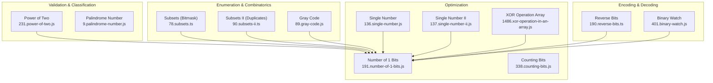

**Diagram sources**
- [power-of-two.js](file://算法/231.power-of-two.js)
- [palindrome-number.js](file://算法/9.palindrome-number.js)
- [subset.js](file://算法/78.subsets.ts)
- [subsets-ii.ts](file://算法/90.subsets-ii.ts)
- [gray-code.js](file://算法/89.gray-code.js)
- [number-of-1-bits.js](file://算法/191.number-of-1-bits.js)
- [counting-bits.js](file://算法/338.counting-bits.js)
- [single-number.js](file://算法/136.single-number.js)
- [single-number-ii.js](file://算法/137.single-number-ii.js)
- [xor-operation-in-an-array.js](file://算法/1486.xor-operation-in-an-array.js)
- [reverse-bits.ts](file://算法/190.reverse-bits.ts)
- [binary-watch.js](file://算法/401.binary-watch.js)

## Detailed Component Analysis

### Bitwise Fundamentals and Patterns
- Bitwise AND/OR/XOR/NOT: Used for masking, unions, toggles, and inversions.
- Shifts: Efficient multiplication/division by powers of two and bit position alignment.
- Bit counting: Population count and parity computation.

Examples:
- Power-of-two detection using n & (n - 1): [power-of-two.js](file://算法/231.power-of-two.js)
- Counting set bits: [number-of-1-bits.js](file://算法/191.number-of-1-bits.js), [counting-bits.js](file://算法/338.counting-bits.js)
- XOR cancellation for unique elements: [single-number.js](file://算法/136.single-number.js), [single-number-ii.js](file://算法/137.single-number-ii.js)

**Section sources**
- [power-of-two.js](file://算法/231.power-of-two.js)
- [number-of-1-bits.js](file://算法/191.number-of-1-bits.js)
- [counting-bits.js](file://算法/338.counting-bits.js)
- [single-number.js](file://算法/136.single-number.js)
- [single-number-ii.js](file://算法/137.single-number-ii.js)

### Bitmask Enumeration of Subsets
Bitmasks provide a compact way to enumerate all subsets of a set. Each bit position corresponds to an element, enabling iteration from 0 to 2^n - 1.

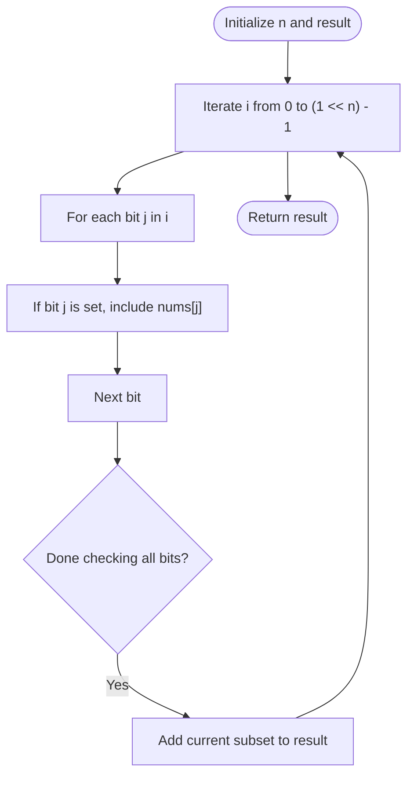

**Diagram sources**
- [subset.js](file://算法/78.subsets.ts)
- [subsets-ii.ts](file://算法/90.subsets-ii.ts)

**Section sources**
- [subset.js](file://算法/78.subsets.ts)
- [subsets-ii.ts](file://算法/90.subsets-ii.ts)

### Gray Code Construction
Gray code ensures successive values differ by a single bit, useful in optimization and circuit design.

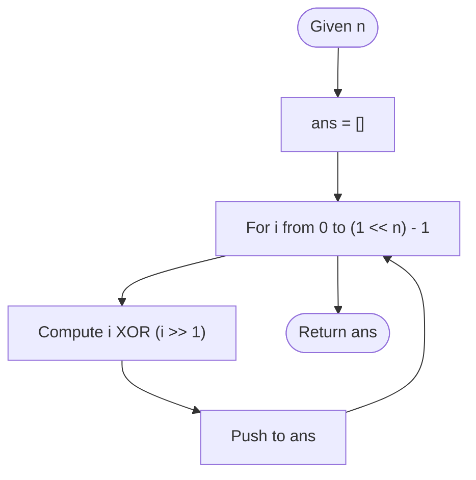

**Diagram sources**
- [gray-code.js](file://算法/89.gray-code.js)

**Section sources**
- [gray-code.js](file://算法/89.gray-code.js)

### XOR-Based Unique Elements
XOR leverages the properties a ^ a = 0 and a ^ 0 = a to isolate unique elements in linear time.

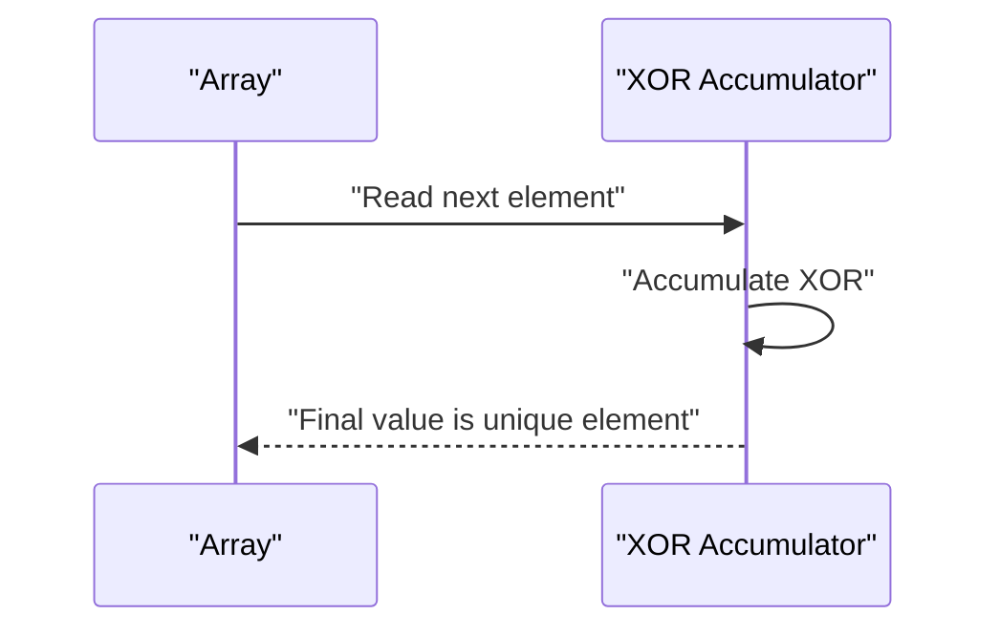

**Diagram sources**
- [single-number.js](file://算法/136.single-number.js)
- [single-number-ii.js](file://算法/137.single-number-ii.js)

**Section sources**
- [single-number.js](file://算法/136.single-number.js)
- [single-number-ii.js](file://算法/137.single-number-ii.js)

### Bit Rotation and Reverse Bits
Bit rotation involves shifting and combining high/low parts. Reversing bits requires careful bit swapping or chunk-wise reversal.

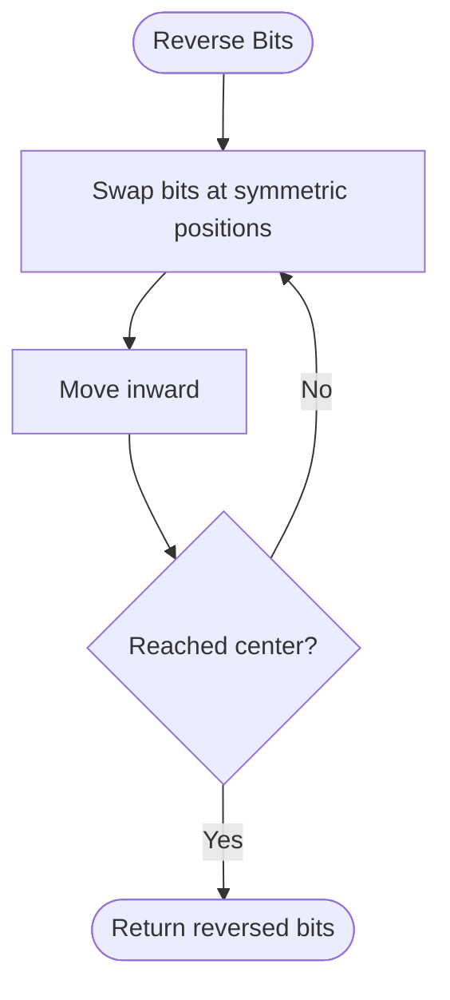

**Diagram sources**
- [reverse-bits.ts](file://算法/190.reverse-bits.ts)

**Section sources**
- [reverse-bits.ts](file://算法/190.reverse-bits.ts)

### Range AND and Bitwise Operations
Computing bitwise AND across a range efficiently uses the common prefix of leftmost bits.

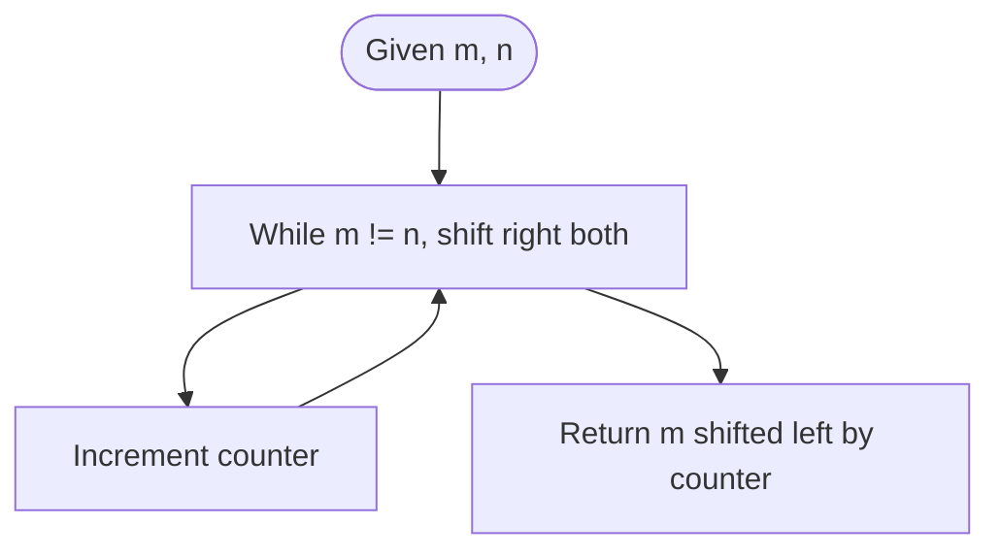

**Diagram sources**
- [bitwise-and-of-numbers-range.js](file://算法/201.bitwise-and-of-numbers-range.js)

**Section sources**
- [bitwise-and-of-numbers-range.js](file://算法/201.bitwise-and-of-numbers-range.js)

### Binary Watch Combinations
Using bit counts to enumerate valid times on a binary watch.

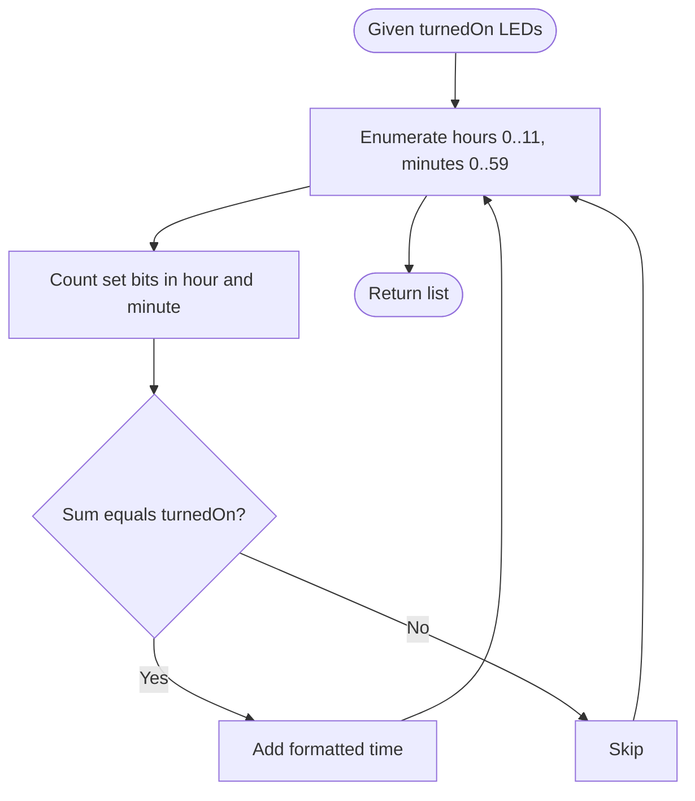

**Diagram sources**
- [binary-watch.js](file://算法/401.binary-watch.js)

**Section sources**
- [binary-watch.js](file://算法/401.binary-watch.js)

### Palindrome Number Check Using Bit Traversals
Compare digits from both ends using division/modulo or string conversion.

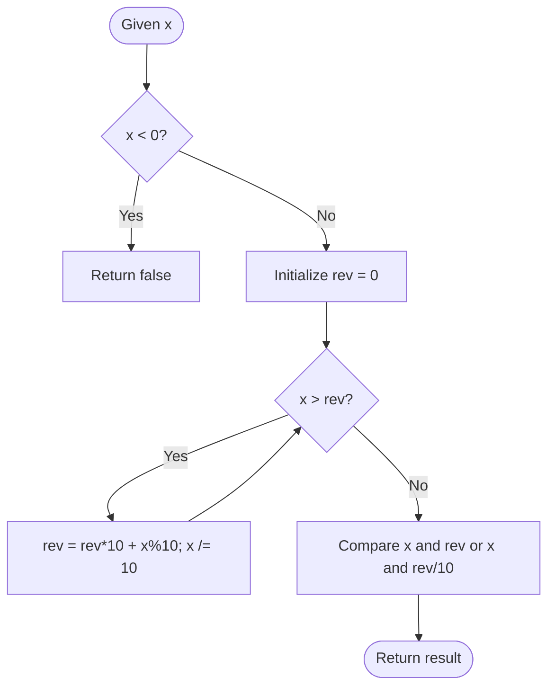

**Diagram sources**
- [palindrome-number.js](file://算法/9.palindrome-number.js)

**Section sources**
- [palindrome-number.js](file://算法/9.palindrome-number.js)

### Sum Without Arithmetic Operators
Add integers using bitwise operations (XOR for sum without carry, AND shifted for carry).

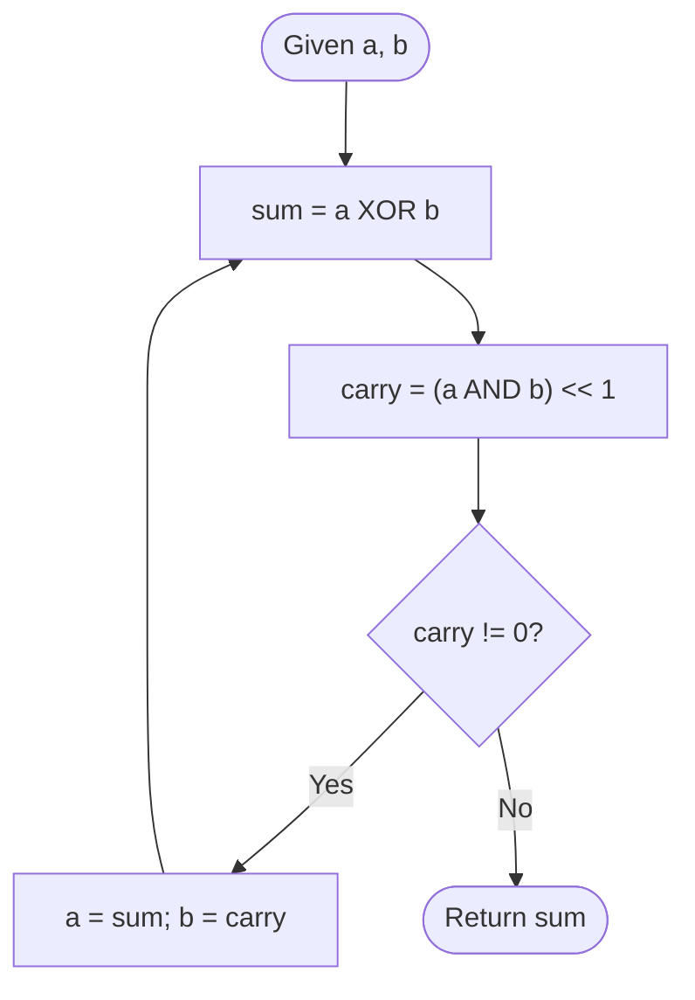

**Diagram sources**
- [sum-of-two-integers.js](file://算法/371.sum-of-two-integers.js)

**Section sources**
- [sum-of-two-integers.js](file://算法/371.sum-of-two-integers.js)

### Flip Columns to Maximize Equal Rows
Transform rows to canonical forms (normalize leading bit) and count frequencies to determine optimal flips.

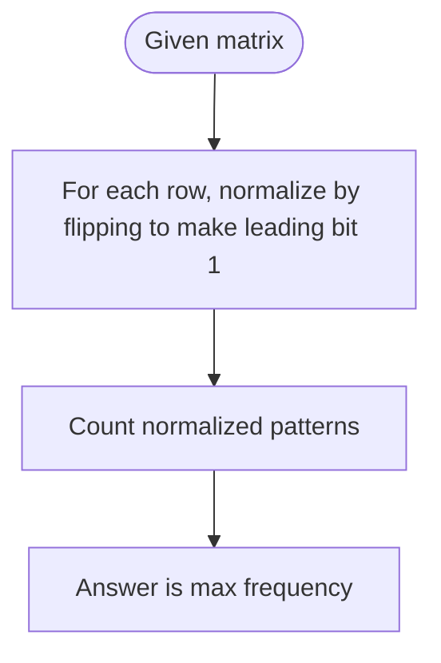

**Diagram sources**
- [flip-columns-for-maximum-number-of-equal-rows.js](file://算法/1072.flip-columns-for-maximum-number-of-equal-rows.js)

**Section sources**
- [flip-columns-for-maximum-number-of-equal-rows.js](file://算法/1072.flip-columns-for-maximum-number-of-equal-rows.js)

### Reordered Power of Two Check
Verify if a number’s digits can be reordered to form a power of two using sorted digit signatures.

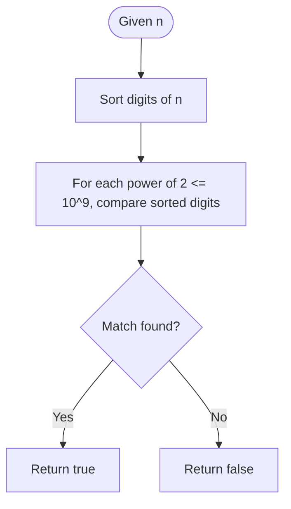

**Diagram sources**
- [maximum-69-number.js](file://算法/869.reordered-power-of-2.js)

**Section sources**
- [maximum-69-number.js](file://算法/869.reordered-power-of-2.js)

### Minimum Operations to Make Array Equal
Use bit properties to compute minimal increments/decrements for equalization.

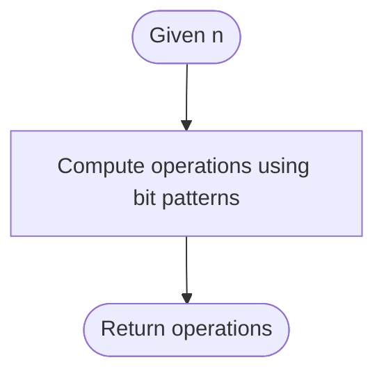

**Diagram sources**
- [minimum-operations-to-make-array-equal.js](file://算法/1551.minimum-operations-to-make-array-equal.js)

**Section sources**
- [minimum-operations-to-make-array-equal.js](file://算法/1551.minimum-operations-to-make-array-equal.js)

### Divide Two Integers Without Division Operator
Simulate division using bit shifts and subtraction.

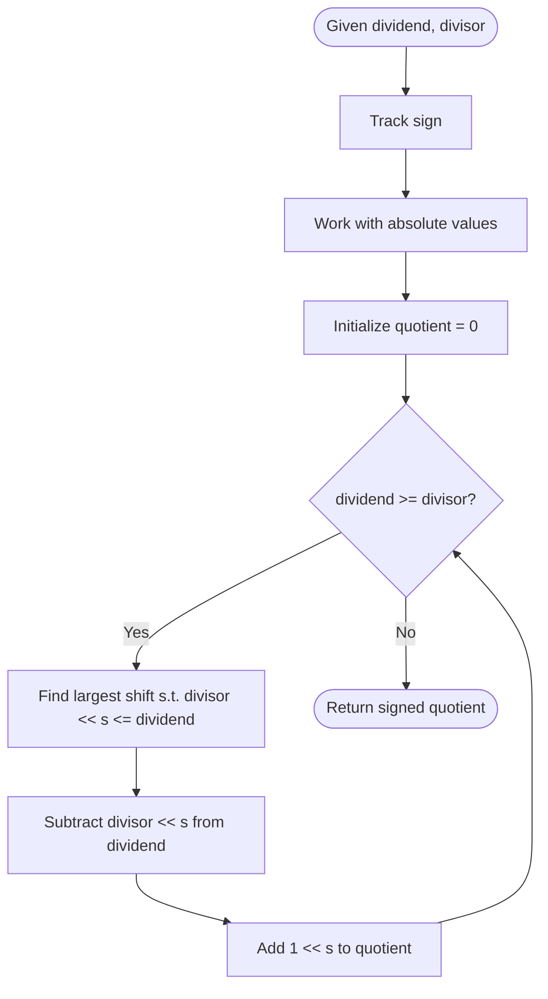

**Diagram sources**
- [divide-two-integers.js](file://算法/29.divide-two-integers.js)

**Section sources**
- [divide-two-integers.js](file://算法/29.divide-two-integers.js)

### Swap Nodes in Pairs Using XOR
Perform pointer swaps without temporary variables using XOR.

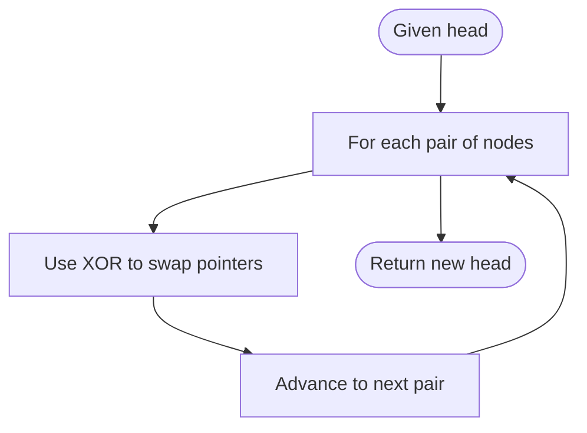

**Diagram sources**
- [swap-nodes-in-pairs.js](file://算法/25.swap-nodes-in-pairs.js)

**Section sources**
- [swap-nodes-in-pairs.js](file://算法/25.swap-nodes-in-pairs.js)

### Reverse Integer Using Bit-Level Checks
Reverse integer digits while handling overflow using 32-bit constraints.

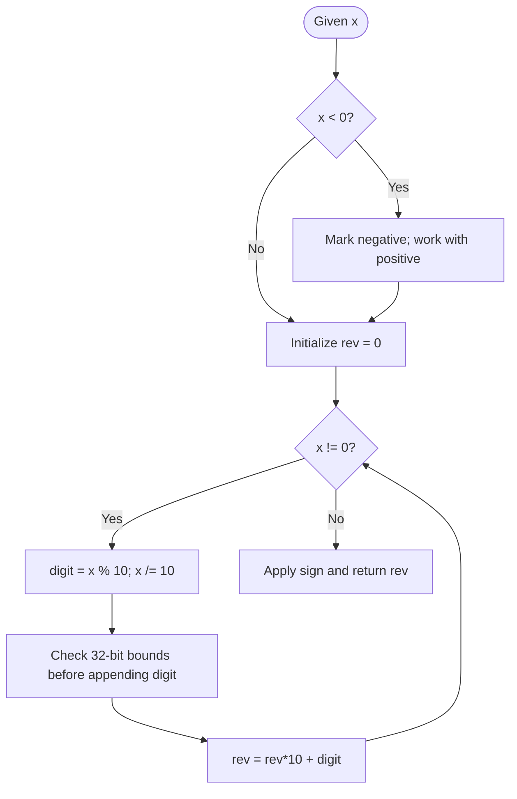

**Diagram sources**
- [reverse-integer.js](file://算法/7.reverse-integer.js)

**Section sources**
- [reverse-integer.js](file://算法/7.reverse-integer.js)

## Dependency Analysis
Bit manipulation patterns often interrelate:
- Bit counting underpins subset enumeration and Gray code generation.
- XOR cancellation enables single-number solutions and pairwise swaps.
- Shifts and masks support range operations and normalization.
- Palindrome checks rely on digit extraction and comparison.

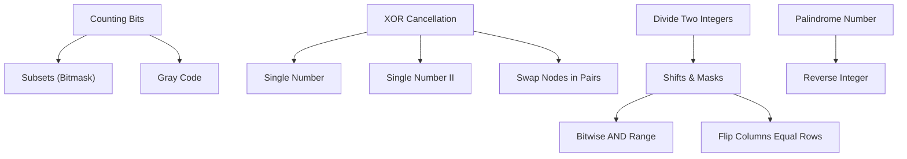

**Diagram sources**
- [counting-bits.js](file://算法/338.counting-bits.js)
- [subset.js](file://算法/78.subsets.ts)
- [gray-code.js](file://算法/89.gray-code.js)
- [single-number.js](file://算法/136.single-number.js)
- [single-number-ii.js](file://算法/137.single-number-ii.js)
- [swap-nodes-in-pairs.js](file://算法/25.swap-nodes-in-pairs.js)
- [bitwise-and-of-numbers-range.js](file://算法/201.bitwise-and-of-numbers-range.js)
- [flip-columns-for-maximum-number-of-equal-rows.js](file://算法/1072.flip-columns-for-maximum-number-of-equal-rows.js)
- [palindrome-number.js](file://算法/9.palindrome-number.js)
- [reverse-integer.js](file://算法/7.reverse-integer.js)
- [divide-two-integers.js](file://算法/29.divide-two-integers.js)

**Section sources**
- [counting-bits.js](file://算法/338.counting-bits.js)
- [subset.js](file://算法/78.subsets.ts)
- [gray-code.js](file://算法/89.gray-code.js)
- [single-number.js](file://算法/136.single-number.js)
- [single-number-ii.js](file://算法/137.single-number-ii.js)
- [swap-nodes-in-pairs.js](file://算法/25.swap-nodes-in-pairs.js)
- [bitwise-and-of-numbers-range.js](file://算法/201.bitwise-and-of-numbers-range.js)
- [flip-columns-for-maximum-number-of-equal-rows.js](file://算法/1072.flip-columns-for-maximum-number-of-equal-rows.js)
- [palindrome-number.js](file://算法/9.palindrome-number.js)
- [reverse-integer.js](file://算法/7.reverse-integer.js)
- [divide-two-integers.js](file://算法/29.divide-two-integers.js)

## Performance Considerations
- Bitwise operations are typically O(1) per operation and highly efficient on modern CPUs.
- Bit counting can be optimized using built-in popcount instructions or lookup tables.
- Subsets enumeration using bitmasks scales exponentially with input size; consider pruning or iterative deepening for large inputs.
- Range operations benefit from bit shift techniques to avoid loops.
- Memory locality and avoiding unnecessary copies improve performance in bit manipulation-heavy algorithms.

## Troubleshooting Guide
Common pitfalls and remedies:
- Off-by-one errors in bit positions: Verify boundary conditions for shifts and masks.
- Overflow in 32-bit arithmetic: Guard multiplications and additions with overflow checks.
- Duplicate subsets with duplicates: Sort input and skip repeated elements during bitmask enumeration.
- Negative numbers and unsigned behavior: Be explicit about sign handling in bit operations.
- Leading zeros and normalization: Ensure consistent representation when comparing bit patterns.

## Conclusion
Bit manipulation offers powerful, efficient primitives for algorithmic problem-solving. By mastering bitwise operations, shifts, masks, and bit counting, developers can craft concise and fast solutions across validation, enumeration, optimization, and encoding tasks. The repository’s examples demonstrate practical applications ranging from power-of-two checks to subset generation and Gray code construction, reinforcing the utility of bit-level reasoning in competitive programming and systems contexts.