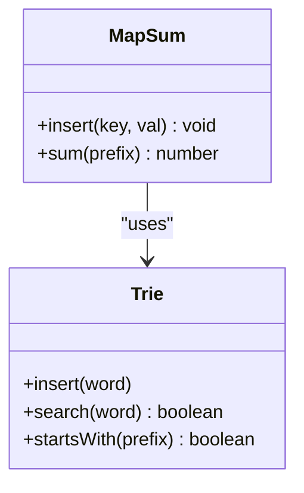
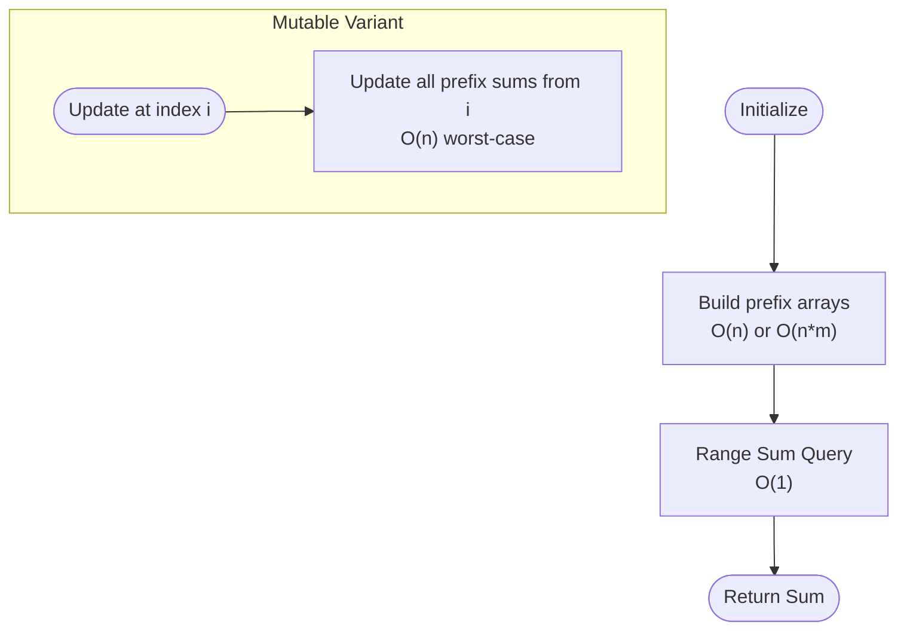
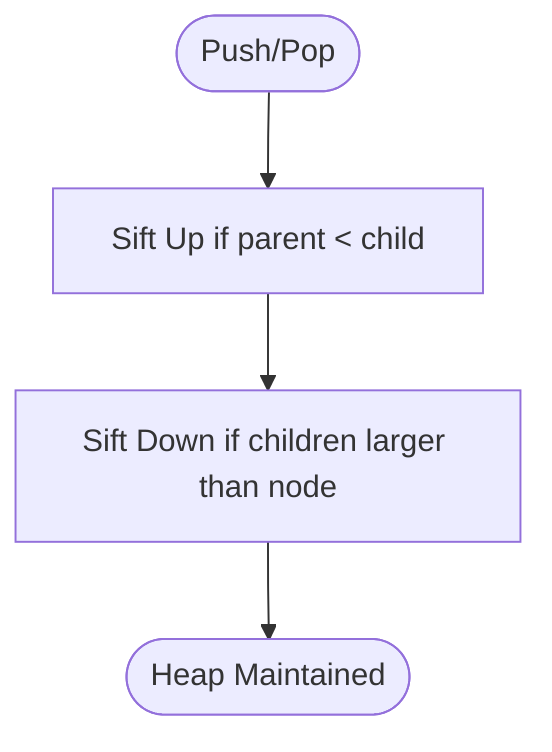
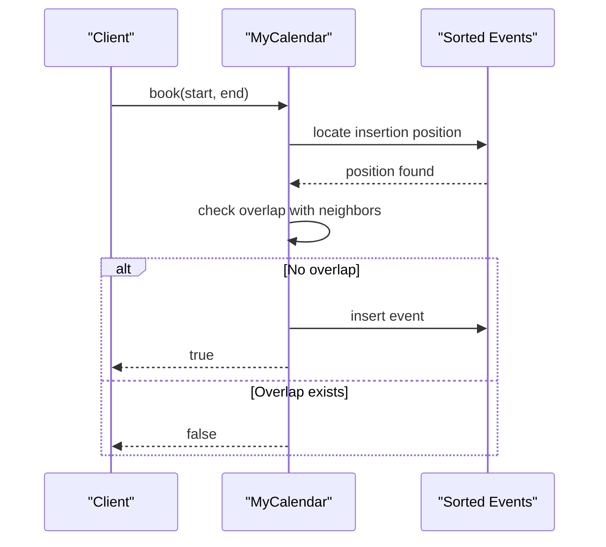
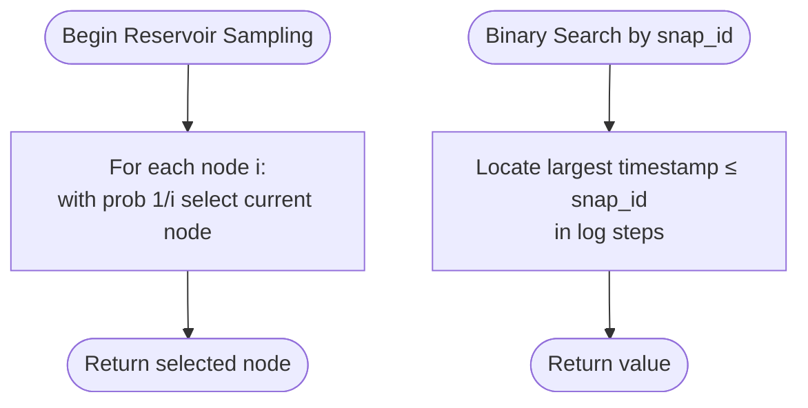
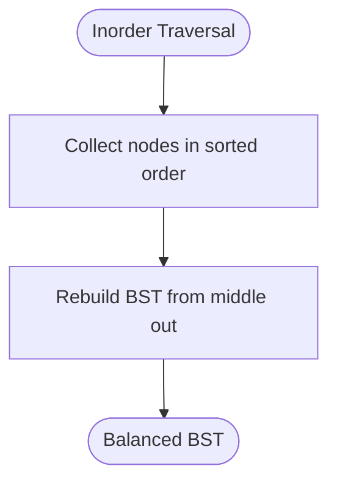
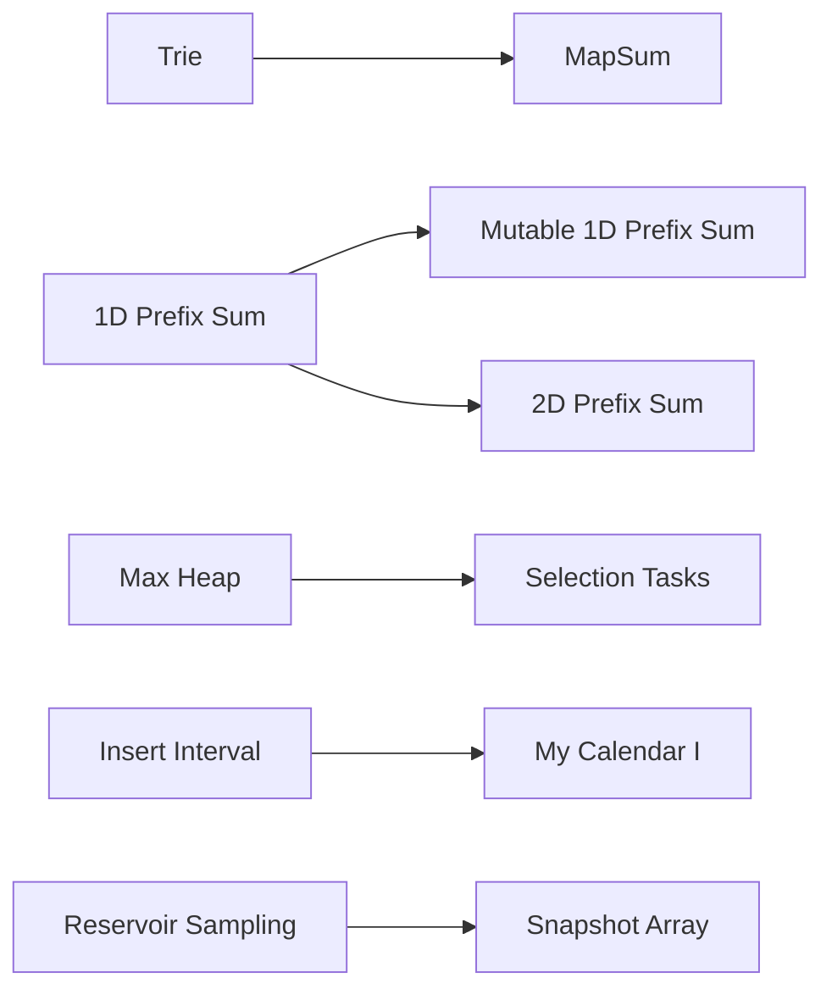

# Advanced Data Structures

<cite>
**Referenced Files in This Document**
- [208.implement-trie-prefix-tree.ts](file://算法/208.implement-trie-prefix-tree.ts)
- [677.map-sum-pairs.js](file://算法/677.map-sum-pairs.js)
- [211.design-add-and-search-words-data-structure.js](file://算法/211.design-add-and-search-words-data-structure.js)
- [303.range-sum-query-immutable.js](file://算法/303.range-sum-query-immutable.js)
- [307.range-sum-query-mutable.js](file://算法/307.range-sum-query-mutable.js)
- [304.range-sum-query-2-d-immutable.js](file://算法/304.range-sum-query-2-d-immutable.js)
- [110.balanced-binary-tree.js](file://算法/110.balanced-binary-tree.js)
- [1382.balance-a-binary-search-tree.js](file://算法/1382.balance-a-binary-search-tree.js)
- [1046.last-stone-weight.js](file://算法/1046.last-stone-weight.js)
- [23.merge-k-sorted-lists.js](file://算法/23.merge-k-sorted-lists.js)
- [1337.the-k-weakest-rows-in-a-matrix.js](file://算法/1337.the-k-weakest-rows-in-a-matrix.js)
- [1054.distant-barcodes.js](file://算法/1054.distant-barcodes.js)
- [382.linked-list-random-node.js](file://算法/382.linked-list-random-node.js)
- [567.permutation-in-string.js](file://算法/567.permutation-in-string.js)
- [792.number-of-matching-subsequences.js](file://算法/792.number-of-matching-subsequences.js)
- [57.insert-interval.js](file://算法/57.insert-interval.js)
- [729.my-calendar-i.js](file://算法/729.my-calendar-i.js)
- [1146.snapshot-array.js](file://算法/1146.snapshot-array.js)
- [1381.design-a-stack-with-increment-operation.js](file://算法/1381.design-a-stack-with-increment-operation.js)
- [946.validate-stack-sequences.js](file://算法/946.validate-stack-sequences.js)
</cite>

## Table of Contents
1. [Introduction](#introduction)
2. [Project Structure](#project-structure)
3. [Core Components](#core-components)
4. [Architecture Overview](#architecture-overview)
5. [Detailed Component Analysis](#detailed-component-analysis)
6. [Dependency Analysis](#dependency-analysis)
7. [Performance Considerations](#performance-considerations)
8. [Troubleshooting Guide](#troubleshooting-guide)
9. [Conclusion](#conclusion)
10. [Appendices](#appendices)

## Introduction
This document presents advanced data structures and their practical implementations drawn from the repository. It focuses on:
- Tries (prefix trees) and related dictionary/tree-based structures
- Range query optimizations via prefix sums and 2D prefix sums
- Heaps (priority queues) and their role in selection/order statistics
- Interval scheduling and overlap detection
- Probabilistic and sampling techniques
- Balanced BST concepts and derived operations

Where applicable, we explain implementation details, performance characteristics, and trade-offs compared to simpler alternatives. We also highlight specialized use cases such as autocomplete-like prefix queries, range sum retrieval, and calendar/event scheduling.

## Project Structure
The repository organizes algorithm implementations primarily under the “算法” directory. For this document, we focus on files that demonstrate advanced data structures and algorithms, including:
- Trie/dictionary tree usage for prefix counting
- Prefix sum structures for immutable/mutable range queries
- Heap-based solutions for selection/ordering tasks
- Sliding window and two-pointer techniques for substring/permutation checks
- Interval merging and calendar booking
- Sampling and snapshot array designs

```mermaid
graph TB
subgraph "Prefix Trees and Dictionaries"
A["208 Trie<br/>Set-based insert/search/startsWith"]
B["677 MapSum<br/>Trie with prefix sums"]
C["211 Word Dictionary<br/>DFS with wildcards"]
end
subgraph "Range Queries"
D["303 Immutable Range Sum"]
E["307 Mutable Range Sum"]
F["304 2D Range Sum"]
end
subgraph "Heaps and Selection"
G["1046 Last Stone Weight"]
H["23 Merge K Sorted Lists"]
I["1337 K Weakest Rows"]
J["1054 Distant Barcodes"]
end
subgraph "Intervals and Scheduling"
K["57 Insert Interval"]
L["729 My Calendar I"]
end
subgraph "Sampling and Snapshots"
M["382 Linked List Random Node"]
N["1146 Snapshot Array"]
end
A --> B
B --> C
D --> E
D --> F
G --> H
H --> I
I --> J
K --> L
M --> N
```

**Diagram sources**
- [208.implement-trie-prefix-tree.ts:12-26](file://算法/208.implement-trie-prefix-tree.ts#L12-L26)
- [677.map-sum-pairs.js:13-60](file://算法/677.map-sum-pairs.js#L13-L60)
- [211.design-add-and-search-words-data-structure.js:60-77](file://算法/211.design-add-and-search-words-data-structure.js#L60-L77)
- [303.range-sum-query-immutable.js:16-34](file://算法/303.range-sum-query-immutable.js#L16-L34)
- [307.range-sum-query-mutable.js:16-53](file://算法/307.range-sum-query-mutable.js#L16-L53)
- [304.range-sum-query-2-d-immutable.js:50-83](file://算法/304.range-sum-query-2-d-immutable.js#L50-L83)
- [1046.last-stone-weight.js:50-146](file://算法/1046.last-stone-weight.js#L50-L146)
- [23.merge-k-sorted-lists.js:66-196](file://算法/23.merge-k-sorted-lists.js#L66-L196)
- [1337.the-k-weakest-rows-in-a-matrix.js:59-150](file://算法/1337.the-k-weakest-rows-in-a-matrix.js#L59-L150)
- [1054.distant-barcodes.js:63-149](file://算法/1054.distant-barcodes.js#L63-L149)
- [57.insert-interval.js:17-46](file://算法/57.insert-interval.js#L17-L46)
- [729.my-calendar-i.js:13-43](file://算法/729.my-calendar-i.js#L13-L43)
- [382.linked-list-random-node.js:45-67](file://算法/382.linked-list-random-node.js#L45-L67)
- [1146.snapshot-array.js:56-75](file://算法/1146.snapshot-array.js#L56-L75)

**Section sources**
- [208.implement-trie-prefix-tree.ts:12-26](file://算法/208.implement-trie-prefix-tree.ts#L12-L26)
- [303.range-sum-query-immutable.js:16-34](file://算法/303.range-sum-query-immutable.js#L16-L34)
- [307.range-sum-query-mutable.js:16-53](file://算法/307.range-sum-query-mutable.js#L16-L53)
- [304.range-sum-query-2-d-immutable.js:50-83](file://算法/304.range-sum-query-2-d-immutable.js#L50-L83)
- [1046.last-stone-weight.js:50-146](file://算法/1046.last-stone-weight.js#L50-L146)
- [23.merge-k-sorted-lists.js:66-196](file://算法/23.merge-k-sorted-lists.js#L66-L196)
- [1337.the-k-weakest-rows-in-a-matrix.js:59-150](file://算法/1337.the-k-weakest-rows-in-a-matrix.js#L59-L150)
- [1054.distant-barcodes.js:63-149](file://算法/1054.distant-barcodes.js#L63-L149)
- [57.insert-interval.js:17-46](file://算法/57.insert-interval.js#L17-L46)
- [729.my-calendar-i.js:13-43](file://算法/729.my-calendar-i.js#L13-L43)
- [382.linked-list-random-node.js:45-67](file://算法/382.linked-list-random-node.js#L45-L67)
- [1146.snapshot-array.js:56-75](file://算法/1146.snapshot-array.js#L56-L75)

## Core Components
- Trie and dictionary tree patterns for prefix-based aggregation and autocomplete-like queries
- Prefix sum arrays for O(1) range sum queries (immutable) and incremental updates (mutable)
- 2D prefix sums for constant-time rectangular region queries
- Heaps (implemented as max heaps) for selection/ordering tasks and scheduling
- Interval merging and calendar booking with sorted insertion and overlap checks
- Probabilistic sampling and snapshot arrays for randomized selection and historical reads

**Section sources**
- [208.implement-trie-prefix-tree.ts:12-26](file://算法/208.implement-trie-prefix-tree.ts#L12-L26)
- [677.map-sum-pairs.js:13-60](file://算法/677.map-sum-pairs.js#L13-L60)
- [303.range-sum-query-immutable.js:16-34](file://算法/303.range-sum-query-immutable.js#L16-L34)
- [307.range-sum-query-mutable.js:16-53](file://算法/307.range-sum-query-mutable.js#L16-L53)
- [304.range-sum-query-2-d-immutable.js:50-83](file://算法/304.range-sum-query-2-d-immutable.js#L50-L83)
- [1046.last-stone-weight.js:50-146](file://算法/1046.last-stone-weight.js#L50-L146)
- [57.insert-interval.js:17-46](file://算法/57.insert-interval.js#L17-L46)
- [729.my-calendar-i.js:13-43](file://算法/729.my-calendar-i.js#L13-L43)
- [382.linked-list-random-node.js:45-67](file://算法/382.linked-list-random-node.js#L45-L67)
- [1146.snapshot-array.js:56-75](file://算法/1146.snapshot-array.js#L56-L75)

## Architecture Overview
The implementations are largely self-contained per problem. The following high-level relationships illustrate how structures compose:
- Trie-based MapSum builds on a trie to maintain prefix sums for efficient wildcard-like aggregations
- Range query structures share a common pattern: precompute cumulative aggregates for fast queries
- Heaps are built from scratch with sift-up/sift-down routines for max-heap behavior
- Interval operations rely on sorted insertion and overlap checks
- Sampling and snapshots leverage probabilistic and versioned storage strategies

```mermaid
graph TB
subgraph "Autocomplete and Prefix Aggregation"
T["Trie<br/>Insert/Search/StartsWith"]
MS["MapSum<br/>Insert/Sum with prefix sums"]
end
subgraph "Range Query Layer"
RS1["Immutable Prefix Sum"]
RS2["Mutable Prefix Sum"]
RS3["2D Prefix Sum"]
end
subgraph "Selection and Ordering"
HP1["Max Heap<br/>Last Stone Weight"]
HP2["Max Heap<br/>Merge K Sorted Lists"]
HP3["Max Heap<br/>K Weakest Rows"]
HP4["Max Heap<br/>Distant Barcodes"]
end
subgraph "Intervals and Scheduling"
INT["Insert Interval"]
CAL["My Calendar I"]
end
subgraph "Probabilistic and Snapshots"
SAM["Linked List Random Node"]
SNAP["Snapshot Array"]
end
T --> MS
RS1 --> RS2
RS1 --> RS3
HP1 --> HP2
HP2 --> HP3
HP3 --> HP4
INT --> CAL
SAM --> SNAP
```

**Diagram sources**
- [208.implement-trie-prefix-tree.ts:12-26](file://算法/208.implement-trie-prefix-tree.ts#L12-L26)
- [677.map-sum-pairs.js:13-60](file://算法/677.map-sum-pairs.js#L13-L60)
- [303.range-sum-query-immutable.js:16-34](file://算法/303.range-sum-query-immutable.js#L16-L34)
- [307.range-sum-query-mutable.js:16-53](file://算法/307.range-sum-query-mutable.js#L16-L53)
- [304.range-sum-query-2-d-immutable.js:50-83](file://算法/304.range-sum-query-2-d-immutable.js#L50-L83)
- [1046.last-stone-weight.js:50-146](file://算法/1046.last-stone-weight.js#L50-L146)
- [23.merge-k-sorted-lists.js:66-196](file://算法/23.merge-k-sorted-lists.js#L66-L196)
- [1337.the-k-weakest-rows-in-a-matrix.js:59-150](file://算法/1337.the-k-weakest-rows-in-a-matrix.js#L59-L150)
- [1054.distant-barcodes.js:63-149](file://算法/1054.distant-barcodes.js#L63-L149)
- [57.insert-interval.js:17-46](file://算法/57.insert-interval.js#L17-L46)
- [729.my-calendar-i.js:13-43](file://算法/729.my-calendar-i.js#L13-L43)
- [382.linked-list-random-node.js:45-67](file://算法/382.linked-list-random-node.js#L45-L67)
- [1146.snapshot-array.js:56-75](file://算法/1146.snapshot-array.js#L56-L75)

## Detailed Component Analysis

### Tries and Dictionary Trees
- Trie (prefix tree) supports insert, search, and prefix existence checks. In this repository, a minimal set-based Trie is used for demonstration.
- MapSum extends a trie to track prefix sums, enabling efficient aggregation over words sharing a given prefix.

**Diagram sources**
- [208.implement-trie-prefix-tree.ts:12-26](file://算法/208.implement-trie-prefix-tree.ts#L12-L26)
- [677.map-sum-pairs.js:13-60](file://算法/677.map-sum-pairs.js#L13-L60)

**Section sources**
- [208.implement-trie-prefix-tree.ts:12-26](file://算法/208.implement-trie-prefix-tree.ts#L12-L26)
- [677.map-sum-pairs.js:13-60](file://算法/677.map-sum-pairs.js#L13-L60)

### Range Query Structures
- Immutable prefix sums support O(1) range sum queries after O(n) preprocessing.
- Mutable prefix sums require updating subsequent prefix entries upon element changes.
- 2D prefix sums enable O(1) rectangular region sum queries after O(rows*cols) preprocessing.

**Diagram sources**
- [303.range-sum-query-immutable.js:16-34](file://算法/303.range-sum-query-immutable.js#L16-L34)
- [307.range-sum-query-mutable.js:16-53](file://算法/307.range-sum-query-mutable.js#L16-L53)
- [304.range-sum-query-2-d-immutable.js:50-83](file://算法/304.range-sum-query-2-d-immutable.js#L50-L83)

**Section sources**
- [303.range-sum-query-immutable.js:16-34](file://算法/303.range-sum-query-immutable.js#L16-L34)
- [307.range-sum-query-mutable.js:16-53](file://算法/307.range-sum-query-mutable.js#L16-L53)
- [304.range-sum-query-2-d-immutable.js:50-83](file://算法/304.range-sum-query-2-d-immutable.js#L50-L83)

### Heaps and Selection Tasks
- Max heaps are implemented from scratch with push/pop and heapify routines.
- Applications include selecting the largest/smallest elements efficiently, such as last stone weight, merging sorted lists, finding weakest rows, and arranging barcodes by frequency.

**Diagram sources**
- [1046.last-stone-weight.js:50-146](file://算法/1046.last-stone-weight.js#L50-L146)
- [23.merge-k-sorted-lists.js:66-196](file://算法/23.merge-k-sorted-lists.js#L66-L196)
- [1337.the-k-weakest-rows-in-a-matrix.js:59-150](file://算法/1337.the-k-weakest-rows-in-a-matrix.js#L59-L150)
- [1054.distant-barcodes.js:63-149](file://算法/1054.distant-barcodes.js#L63-L149)

**Section sources**
- [1046.last-stone-weight.js:50-146](file://算法/1046.last-stone-weight.js#L50-L146)
- [23.merge-k-sorted-lists.js:66-196](file://算法/23.merge-k-sorted-lists.js#L66-L196)
- [1337.the-k-weakest-rows-in-a-matrix.js:59-150](file://算法/1337.the-k-weakest-rows-in-a-matrix.js#L59-L150)
- [1054.distant-barcodes.js:63-149](file://算法/1054.distant-barcodes.js#L63-L149)

### Interval Operations and Calendar Scheduling
- Insert Interval merges overlapping intervals into a sorted list.
- My Calendar I validates event insertion against existing bookings using sorted insertion and overlap checks.

**Diagram sources**
- [729.my-calendar-i.js:13-43](file://算法/729.my-calendar-i.js#L13-L43)

**Section sources**
- [57.insert-interval.js:17-46](file://算法/57.insert-interval.js#L17-L46)
- [729.my-calendar-i.js:13-43](file://算法/729.my-calendar-i.js#L13-L43)

### Probabilistic Sampling and Snapshots
- Linked List Random Node uses reservoir sampling to select a random node without knowing the list length.
- Snapshot Array stores value history per index and retrieves values by snapshot ID using binary search.

**Diagram sources**
- [382.linked-list-random-node.js:45-67](file://算法/382.linked-list-random-node.js#L45-L67)
- [1146.snapshot-array.js:56-75](file://算法/1146.snapshot-array.js#L56-L75)

**Section sources**
- [382.linked-list-random-node.js:45-67](file://算法/382.linked-list-random-node.js#L45-L67)
- [1146.snapshot-array.js:56-75](file://算法/1146.snapshot-array.js#L56-L75)

### Balanced BST Concepts
- While explicit DSU, scapegoat trees, and suffix arrays are not present here, balanced BST concepts appear in:
  - Tree balancing via in-order traversal and reconstructive rebalancing
  - Height/depth checks for balance validation

**Diagram sources**
- [1382.balance-a-binary-search-tree.js:24-52](file://算法/1382.balance-a-binary-search-tree.js#L24-L52)
- [110.balanced-binary-tree.js:24-44](file://算法/110.balanced-binary-tree.js#L24-L44)

**Section sources**
- [1382.balance-a-binary-search-tree.js:24-52](file://算法/1382.balance-a-binary-search-tree.js#L24-L52)
- [110.balanced-binary-tree.js:24-44](file://算法/110.balanced-binary-tree.js#L24-L44)

## Dependency Analysis
- Trie and MapSum depend on basic object/map structures and string iteration.
- Range query structures depend on numeric arrays and cumulative computation.
- Heaps depend on array indexing and comparison functions.
- Interval operations depend on sorted insertion and neighbor checks.
- Sampling and snapshots depend on probabilistic logic and binary search.

**Diagram sources**
- [208.implement-trie-prefix-tree.ts:12-26](file://算法/208.implement-trie-prefix-tree.ts#L12-L26)
- [677.map-sum-pairs.js:13-60](file://算法/677.map-sum-pairs.js#L13-L60)
- [303.range-sum-query-immutable.js:16-34](file://算法/303.range-sum-query-immutable.js#L16-L34)
- [307.range-sum-query-mutable.js:16-53](file://算法/307.range-sum-query-mutable.js#L16-L53)
- [304.range-sum-query-2-d-immutable.js:50-83](file://算法/304.range-sum-query-2-d-immutable.js#L50-L83)
- [1046.last-stone-weight.js:50-146](file://算法/1046.last-stone-weight.js#L50-L146)
- [57.insert-interval.js:17-46](file://算法/57.insert-interval.js#L17-L46)
- [729.my-calendar-i.js:13-43](file://算法/729.my-calendar-i.js#L13-L43)
- [382.linked-list-random-node.js:45-67](file://算法/382.linked-list-random-node.js#L45-L67)
- [1146.snapshot-array.js:56-75](file://算法/1146.snapshot-array.js#L56-L75)

**Section sources**
- [208.implement-trie-prefix-tree.ts:12-26](file://算法/208.implement-trie-prefix-tree.ts#L12-L26)
- [677.map-sum-pairs.js:13-60](file://算法/677.map-sum-pairs.js#L13-L60)
- [303.range-sum-query-immutable.js:16-34](file://算法/303.range-sum-query-immutable.js#L16-L34)
- [307.range-sum-query-mutable.js:16-53](file://算法/307.range-sum-query-mutable.js#L16-L53)
- [304.range-sum-query-2-d-immutable.js:50-83](file://算法/304.range-sum-query-2-d-immutable.js#L50-L83)
- [1046.last-stone-weight.js:50-146](file://算法/1046.last-stone-weight.js#L50-L146)
- [57.insert-interval.js:17-46](file://算法/57.insert-interval.js#L17-L46)
- [729.my-calendar-i.js:13-43](file://算法/729.my-calendar-i.js#L13-L43)
- [382.linked-list-random-node.js:45-67](file://算法/382.linked-list-random-node.js#L45-L67)
- [1146.snapshot-array.js:56-75](file://算法/1146.snapshot-array.js#L56-L75)

## Performance Considerations
- Tries: Insert/search/startsWith are linear in key length; MapSum adds O(1) prefix sum updates per character during insert.
- Prefix sums: Immutable variant offers O(1) query time after O(n) build; mutable variant requires O(n) updates per change.
- 2D prefix sums: O(1) query time after O(rows*cols) preprocessing.
- Heaps: Push/pop are O(log n); useful for top-K, scheduling, and selection problems.
- Intervals: Insert Interval scans and merges; My Calendar I performs O(n) insertion with overlap checks.
- Sampling and snapshots: Reservoir sampling runs in O(n) time; Snapshot queries use O(log s) binary search per index.

[No sources needed since this section provides general guidance]

## Troubleshooting Guide
- Trie/MapSum correctness: Ensure prefix sum accumulation is consistent across insertions and overwrites.
- Mutable prefix sums: Verify that updates propagate forward and indices are handled correctly.
- 2D prefix sums: Confirm boundary conditions and subtraction of overlapping regions.
- Heaps: Validate heap property after each push/pop and ensure correct comparison semantics.
- Interval operations: Handle edge cases like empty lists, single intervals, and exact overlaps.
- Sampling: Confirm probability guarantees and boundary conditions for single-node lists.
- Snapshots: Ensure timestamps are monotonically increasing and binary search bounds are correct.

**Section sources**
- [677.map-sum-pairs.js:13-60](file://算法/677.map-sum-pairs.js#L13-L60)
- [307.range-sum-query-mutable.js:16-53](file://算法/307.range-sum-query-mutable.js#L16-L53)
- [304.range-sum-query-2-d-immutable.js:50-83](file://算法/304.range-sum-query-2-d-immutable.js#L50-L83)
- [1046.last-stone-weight.js:50-146](file://算法/1046.last-stone-weight.js#L50-L146)
- [57.insert-interval.js:17-46](file://算法/57.insert-interval.js#L17-L46)
- [382.linked-list-random-node.js:45-67](file://算法/382.linked-list-random-node.js#L45-L67)
- [1146.snapshot-array.js:56-75](file://算法/1146.snapshot-array.js#L56-L75)

## Conclusion
This repository demonstrates practical implementations of advanced data structures and algorithms:
- Trie and MapSum enable efficient prefix-based operations and aggregations
- Range query structures provide optimal query performance with preprocessing costs
- Heaps support selection/ordering tasks with logarithmic operations
- Interval and calendar operations showcase sorted insertion and overlap handling
- Sampling and snapshots illustrate probabilistic and versioned access patterns

These patterns generalize to real-world applications such as autocomplete systems, range analytics, scheduling, and probabilistic data access.

[No sources needed since this section summarizes without analyzing specific files]

## Appendices
- Additional sliding window and two-pointer techniques appear in substring/permutation checks and matching subsequences, complementing the above structures for string processing tasks.

**Section sources**
- [567.permutation-in-string.js:47-90](file://算法/567.permutation-in-string.js#L47-L90)
- [792.number-of-matching-subsequences.js:47-82](file://算法/792.number-of-matching-subsequences.js#L47-L82)
- [946.validate-stack-sequences.js:17-40](file://算法/946.validate-stack-sequences.js#L17-L40)