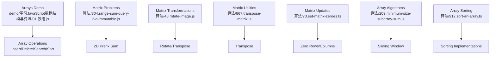
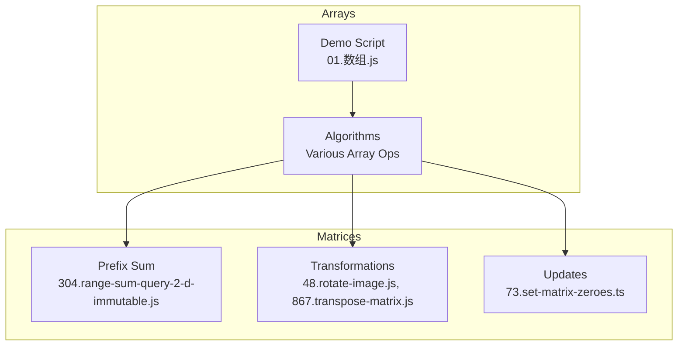
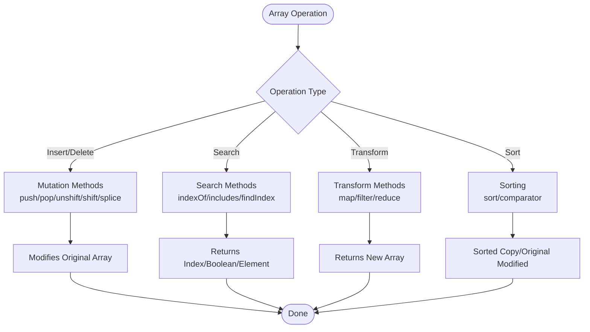
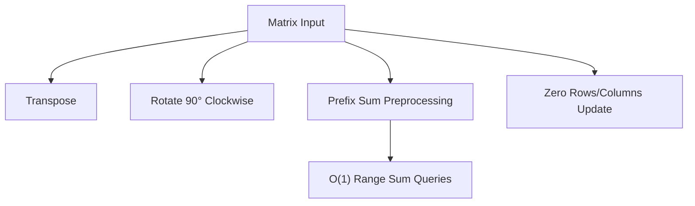
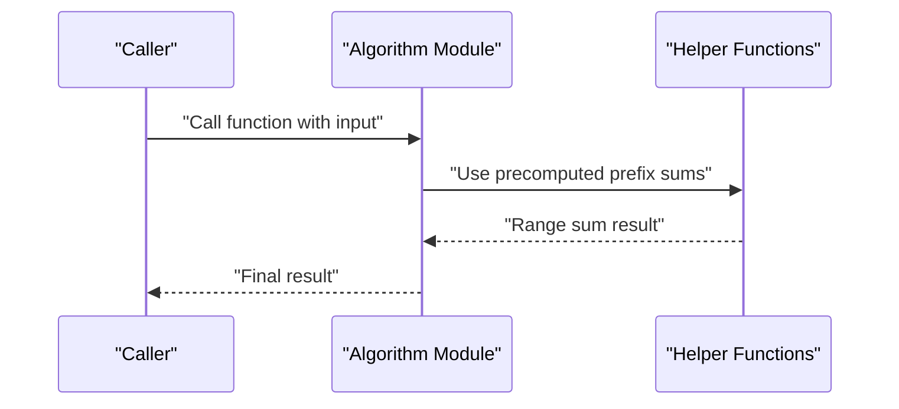
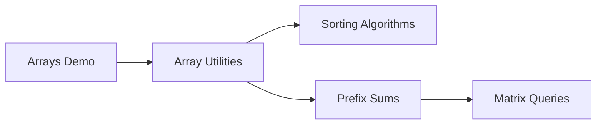

# Arrays and Matrices

<cite>
**Referenced Files in This Document**
- [01.数组.js](file://demo/学习JavaScript数据结构与算法/01.数组.js)
- [304.range-sum-query-2-d-immutable.js](file://算法/304.range-sum-query-2-d-immutable.js)
- [1314.matrix-block-sum.js](file://算法/1314.matrix-block-sum.js)
- [1252.cells-with-odd-values-in-a-matrix.js](file://算法/1252.cells-with-odd-values-in-a-matrix.js)
- [867.transpose-matrix.js](file://算法/867.transpose-matrix.js)
- [48.rotate-image.js](file://算法/48.rotate-image.js)
- [73.set-matrix-zeroes.ts](file://算法/73.set-matrix-zeroes.ts)
- [209.minimum-size-subarray-sum.js](file://算法/209.minimum-size-subarray-sum.js)
- [169.majority-element.ts](file://算法/169.majority-element.ts)
- [27.remove-element.js](file://算法/27.remove-element.js)
- [26.remove-duplicates-from-sorted-array.js](file://算法/26.remove-duplicates-from-sorted-array.js)
- [88.merge-sorted-array.js](file://算法/88.merge-sorted-array.js)
- [1480.running-sum-of-1-d-array.js](file://算法/1480.running-sum-of-1-d-array.js)
- [1475.final-prices-with-a-special-discount-in-a-shop.js](file://算法/1475.final-prices-with-a-special-discount-in-a-shop.js)
- [1343.number-of-sub-arrays-of-size-k-and-average-greater-than-or-equal-to-threshold.js](file://算法/1343.number-of-sub-arrays-of-size-k-and-average-greater-than-or-equal-to-threshold.js)
- [1497.check-if-array-pairs-are-divisible-by-k.js](file://算法/1497.check-if-array-pairs-are-divisible-by-k.js)
- [1512.number-of-good-pairs.js](file://算法/1512.number-of-good-pairs.js)
- [1524.number-of-sub-arrays-with-odd-sum.js](file://算法/1524.number-of-sub-arrays-with-odd-sum.js)
- [153.find-minimum-in-rotated-sorted-array.js](file://算法/153.find-minimum-in-rotated-sorted-array.js)
- [154.find-minimum-in-rotated-sorted-array-ii.js](file://算法/154.find-minimum-in-rotated-sorted-array-ii.js)
- [189.rotate-array.ts](file://算法/189.rotate-array.ts)
- [215.kth-largest-element-in-an-array.js](file://算法/215.kth-largest-element-in-an-array.js)
- [238.product-of-array-except-self.js](file://算法/238.product-of-array-except-self.js)
- [414.third-maximum-number.js](file://算法/414.third-maximum-number.js)
- [442.find-all-duplicates-in-an-array.js](file://算法/442.find-all-duplicates-in-an-array.js)
- [448.find-all-numbers-disappeared-in-an-array.js](file://算法/448.find-all-numbers-disappeared-in-an-array.js)
- [453.minimum-moves-to-equal-array-elements.js](file://算法/453.minimum-moves-to-equal-array-elements.js)
- [455.assign-cookies.js](file://算法/455.assign-cookies.js)
- [456.132-pattern.js](file://算法/456.132-pattern.js)
- [561.array-partition.js](file://算法/561.array-partition.js)
- [565.array-nesting.js](file://算法/565.array-nesting.js)
- [605.can-place-flowers.js](file://算法/605.can-place-flowers.js)
- [628.maximum-product-of-three-numbers.js](file://算法/628.maximum-product-of-three-numbers.js)
- [643.maximum-average-subarray-i.js](file://算法/643.maximum-average-subarray-i.js)
- [665.non-decreasing-array.js](file://算法/665.non-decreasing-array.js)
- [674.longest-continuous-increasing-subsequence.js](file://算法/674.longest-continuous-increasing-subsequence.js)
- [718.maximum-length-of-repeated-subarray.js](file://算法/718.maximum-length-of-repeated-subarray.js)
- [747.largest-number-at-least-twice-of-others.js](file://算法/747.largest-number-at-least-twice-of-others.js)
- [832.flipping-an-image.js](file://算法/832.flipping-an-image.js)
- [860.lemonade-change.js](file://算法/860.lemonade-change.js)
- [870.advantage-shuffle.js](file://算法/870.advantage-shuffle.js)
- [881.boats-to-save-people.js](file://算法/881.boats-to-save-people.js)
- [905.sort-array-by-parity.js](file://算法/905.sort-array-by-parity.js)
- [912.sort-an-array.ts](file://算法/912.sort-an-array.ts)
- [977.squares-of-a-sorted-array.js](file://算法/977.squares-of-a-sorted-array.js)
- [1019.next-greater-node-in-linked-list.js](file://算法/1019.next-greater-node-in-linked-list.js)
- [1046.last-stone-weight.js](file://算法/1046.last-stone-weight.js)
- [1200.minimum-absolute-difference.js](file://算法/1200.minimum-absolute-difference.js)
- [1217.minimum-cost-to-move-chips-to-the-same-position.js](file://算法/1217.minimum-cost-to-move-chips-to-the-same-position.js)
- [1248.count-number-of-nice-subarrays.js](file://算法/1248.count-number-of-nice-subarrays.js)
- [1295.find-numbers-with-even-number-of-digits.js](file://算法/1295.find-numbers-with-even-number-of-digits.js)
- [1346.check-if-n-and-its-double-exist.js](file://算法/1346.check-if-n-and-its-double-exist.js)
- [1395.count-number-of-teams.js](file://算法/1395.count-number-of-teams.js)
- [1413.minimum-value-to-get-positive-step-by-step-sum.js](file://算法/1413.minimum-value-to-get-positive-step-by-step-sum.js)
- [1431.kids-with-the-greatest-number-of-candies.js](file://算法/1431.kids-with-the-greatest-number-of-candies.js)
- [1450.number-of-students-doing-homework-at-a-given-time.js](file://算法/1450.number-of-students-doing-homework-at-a-given-time.js)
- [1486.xor-operation-in-an-array.js](file://算法/1486.xor-operation-in-an-array.js)
- [1502.can-make-arithmetic-progression-from-sequence.js](file://算法/1502.can-make-arithmetic-progression-from-sequence.js)
- [1513.number-of-substrings-with-only-1-s.js](file://算法/1513.number-of-substrings-with-only-1-s.js)
- [1529.minimum-suffix-flips.js](file://算法/1529.minimum-suffix-flips.js)
- [1540.can-convert-string-in-k-moves.js](file://算法/1540.can-convert-string-in-k-moves.js)
- [1551.minimum-operations-to-make-array-equal.js](file://算法/1551.minimum-operations-to-make-array-equal.js)
- [1566.check-if-a-straight-line.js](file://算法/1566.check-if-a-straight-line.js)
- [1573.number-of-ways-to-split-a-string.js](file://算法/1573.number-of-ways-to-split-a-string.js)
- [1588.sum-of-all-odd-length-subarrays.js](file://算法/1588.sum-of-all-odd-length-subarrays.js)
- [1605.find-valid-matrix-given-row-and-column-sums.js](file://算法/1605.find-valid-matrix-given-row-and-column-sums.js)
- [1630.arithmetic-subsequence.js](file://算法/1630.arithmetic-subsequence.js)
- [1636.sort-array-by-frequency.js](file://算法/1636.sort-array-by-frequency.js)
- [1679.max-number-of-k-sum-pairs.js](file://算法/1679.max-number-of-k-sum-pairs.js)
- [1694.reformat-phone-number.js](file://算法/1694.reformat-phone-number.js)
- [1710.maximum-units-on-a-truck.js](file://算法/1710.maximum-units-on-a-truck.js)
- [1743.restore-the-array-from-adjacent-pairs.js](file://算法/1743.restore-the-array-from-adjacent-pairs.js)
- [1768.merge-strings-alternately.js](file://算法/1768.merge-strings-alternately.js)
- [1790.are-AlmostEqual.js](file://算法/1790.are-AlmostEqual.js)
- [1822.sign-of-the-product-of-an-array.js](file://算法/1822.sign-of-the-product-of-an-array.js)
- [1827.minimum-operations-to-make-the-array-increasing.js](file://算法/1827.minimum-operations-to-make-the-array-increasing.js)
- [1877.minimize-maximum-pair-sum-in-array.js](file://算法/1877.minimize-maximum-pair-sum-in-array.js)
- [1897.redistribute-characters-to-make-all-strings-equal.js](file://算法/1897.redistribute-characters-to-make-all-strings-equal.js)
- [1920.build-array-from-permutation.js](file://算法/1920.build-array-from-permutation.js)
- [1929.concatenation-of-array.js](file://算法/1929.concatenation-of-array.js)
- [1957.delete-characters-to-make-fancy-string.js](file://算法/1957.delete-characters-to-make-fancy-string.js)
- [1984.minimum-difference-between-any-two-elements.js](file://算法/1984.minimum-difference-between-any-two-elements.js)
- [2011.final-value-of-variable-after-operation.js](file://算法/2011.final-value-of-variable-after-operation.js)
- [2037.minimum-number-of-moves-to-seat-everyone.js](file://算法/2037.minimum-number-of-moves-to-seat-everyone.js)
- [2053.kth-distinct-string.js](file://算法/2053.kth-distinct-string.js)
- [2078.two-furthest-houses-with-different-colors.js](file://算法/2078.two-furdest-houses-with-different-colors.js)
- [2089.target-found-after-sorting.js](file://算法/2089.target-found-after-sorting.js)
- [2103.rings-in-rod.js](file://算法/2103.rings-in-rod.js)
- [2114.maximum-number-of-words-you-can-type.js](file://算法/2114.maximum-number-of-words-you-can-type.js)
- [2148.count-elements.js](file://算法/2148.count-elements.js)
- [2160.minimum-sum-of-four-digit-number-after-splitting-digits.js](file://算法/2160.minimum-sum-of-four-digit-number-after-splitting-digits.js)
- [2176.count-elements.js](file://算法/2176.count-elements.js)
- [2190.most-frequent-number-following-key.js](file://算法/2190.most-frequent-number-following-key.js)
- [2210.count-sideways-jumps.js](file://算法/2210.count-sideways-jumps.js)
- [2222.number-of-ways-of-cutting-a-pizza.js](file://算法/2222.number-of-ways-of-cutting-a-pizza.js)
- [2235.add-two-integers.js](file://算法/2235.add-two-integers.js)
- [2243.calculate-something.js](file://算法/2243.calculate-something.js)
- [2248.intersect.js](file://算法/2248.intersect.js)
- [2255.count-substrings.js](file://算法/2255.count-substrings.js)
- [2278.percentage-of-letters-in-string.js](file://算法/2278.percentage-of-letters-in-string.js)
- [2283.check-digits-in-string.js](file://算法/2283.check-digits-in-string.js)
- [2293.min-max-game.js](file://算法/2293.min-max-game.js)
- [2315.count-asterisks.js](file://算法/2315.count-asterisks.js)
- [2335.fill-the-cup.js](file://算法/2335.fill-the-cup.js)
- [2341.maximum-number-of-pairs.js](file://算法/2341.maximum-number-of-pairs.js)
- [2356.number-of-unique-subjects-teached.js](file://算法/2356.number-of-unique-subjects-teached.js)
- [2367.number-of-arithmetic-triplets.js](file://算法/2367.number-of-arithmetic-triplets.js)
- [2373.largest-local-values-in-a-matrix.js](file://算法/2373.largest-local-values-in-a-matrix.js)
- [2383.experience-to-gain.js](file://算法/2383.experience-to-gain.js)
- [2395.find-subintervals.js](file://算法/2395.find-subintervals.js)
- [2413.double-a-number.js](file://算法/2413.double-a-number.js)
- [2415.reverse-odd-levels.js](file://算法/2415.reverse-odd-levels.js)
- [2427.number-of-common-factors.js](file://算法/2427.number-of-common-factors.js)
- [2432.the-employee-that-worked-the-longest.js](file://算法/2432.the-employee-that-worked-the-longest.js)
- [2441.largest-negative-number.js](file://算法/2441.largest-negative-number.js)
- [2455.average-value-of-even-numbers.js](file://算法/2455.average-value-of-even-numbers.js)
- [2465.number-of-distinct-averages.js](file://算法/2465.number-of-distinct-averages.js)
- [2475.triples-with-difference-k.js](file://算法/2475.triples-with-difference-k.js)
- [2481.split-the-coins.js](file://算法/2481.split-the-coins.js)
- [2490.circular-sentence.js](file://算法/2490.circular-sentence.js)
- [2520.count-the-digits.js](file://算法/2520.count-the-digits.js)
- [2529.maximum-count.js](file://算法/2529.maximum-count.js)
- [2540.minimum-common-element.js](file://算法/2540.minimum-common-element.js)
- [2553.separate-the-digits.js](file://算法/2553.separate-the-digits.js)
- [2570.merge-two-arrays.js](file://算法/2570.merge-two-arrays.js)
- [2574.left-and-right-sum-differences.js](file://算法/2574.left-and-right-sum-differences.js)
- [2582.pass-the-pillow.js](file://算法/2582.pass-the-pillow.js)
- [2592.maximize-greatness.js](file://算法/2592.maximize-greatness.js)
- [2605.form-smallest-number.js](file://算法/2605.form-smallest-number.js)
- [2609.find-the-largest-of-the-set.js](file://算法/2609.find-the-largest-of-the-set.js)
- [2610.convert-to-array.js](file://算法/2610.convert-to-array.js)
- [2619.array-prototype-last.js](file://算法/2619.array-prototype-last.js)
- [2620.counter.js](file://算法/2620.counter.js)
- [2621.sleep.js](file://算法/2621.sleep.js)
- [2624.snail.js](file://算法/2624.snail.js)
- [2625.flatten.js](file://算法/2625.flatten.js)
- [2626.reduce.js](file://算法/2626.reduce.js)
- [2627.debounce.js](file://算法/2627.debounce.js)
- [2628.is-empty.js](file://算法/2628.is-empty.js)
- [2629.reverse-array.js](file://算法/2629.reverse-array.js)
- [2630.memoize.js](file://算法/2630.memoize.js)
- [2631.group-by.js](file://算法/2631.group-by.js)
- [2632.my-custom-counter.js](file://算法/2632.my-custom-counter.js)
- [2633.transform-to-obj.js](file://算法/2633.transform-to-obj.js)
- [2634.filter.js](file://算法/2634.filter.js)
- [2635.apply-transformations.js](file://算法/2635.apply-transformations.js)
- [2636.lcpr-2636.js](file://算法/2636.lcpr-2636.js)
- [2637.promise-pool.js](file://算法/2637.promise-pool.js)
- [2638.count-student.js](file://算法/2638.count-student.js)
- [2639.number-of-rows.js](file://算法/2639.number-of-rows.js)
- [2640.find-the-score.js](file://算法/2640.find-the-score.js)
- [2641.cousins-in-binary-tree.js](file://算法/2641.cousins-in-binary-tree.js)
- [2642.graph-operations.js](file://算法/2642.graph-operations.js)
- [2643.row-col-matrix.js](file://算法/2643.row-col-matrix.js)
- [2644.find-maximum.js](file://算法/2644.find-maximum.js)
- [2645.minimum-additions.js](file://算法/2645.minimum-additions.js)
- [2646.minimize-the-maximum.js](file://算法/2646.minimize-the-maximum.js)
- [2647.border-color.js](file://算法/2647.border-color.js)
- [2648.fibonacci.js](file://算法/2648.fibonacci.js)
- [2649.nested.js](file://算法/2649.nested.js)
- [2650.how-many.js](file://算法/2650.how-many.js)
- [2651.calculate.js](file://算法/2651.calculate.js)
- [2652.sum-multiples.js](file://算法/2652.sum-multiples.js)
- [2653.k-subarray.js](file://算法/2653.k-subarray.js)
- [2654.minimum-number.js](file://算法/2654.minimum-number.js)
- [2655.max-uncovered-ranges.js](file://算法/2655.max-uncovered-ranges.js)
- [2656.maximum-sum.js](file://算法/2656.maximum-sum.js)
- [2657.find-the-prefix-common.js](file://算法/2657.find-the-prefix-common.js)
- [2658.maximum-flow.js](file://算法/2658.maximum-flow.js)
- [2659.make-array.js](file://算法/2659.make-array.js)
- [2660.valid-game.js](file://算法/2660.valid-game.js)
- [2661.first-completely-painted.js](file://算法/2661.first-completely-painted.js)
- [2662.minimum-cost.js](file://算法/2662.minimum-cost.js)
- [2663.lexicographically-smallest.js](file://算法/2663.lexicographically-smallest.js)
- [2664.find-valid-coordination.js](file://算法/2664.find-valid-coordination.js)
- [2665.counter-function.js](file://算法/2665.counter-function.js)
- [2666.allowed-restrictions.js](file://算法/2666.allowed-restrictions.js)
- [2667.create-hello-world.js](file://算法/2667.create-hello-world.js)
- [2668.find-employees.js](file://算法/2668.find-employees.js)
- [2669.happy-children.js](file://算法/2669.happy-children.js)
- [2670.equalize-array.js](file://算法/2670.equalize-array.js)
- [2671.frequency-tracker.js](file://算法/2671.frequency-tracker.js)
- [2672.number-of-adjacent.js](file://算法/2672.number-of-adjacent.js)
- [2673.make-costs.js](file://算法/2673.make-costs.js)
- [2674.split-bonuses.js](file://算法/2674.split-bonuses.js)
- [2675.parse-array.js](file://算法/2675.parse-array.js)
- [2676.how-many.js](file://算法/2676.how-many.js)
- [2677.cousins-in-binary-tree.js](file://算法/2677.cousins-in-binary-tree.js)
- [2678.number-of-senior.js](file://算法/2678.number-of-senior.js)
- [2679.sum-in-a-matrix.js](file://算法/2679.sum-in-a-matrix.js)
- [2680.maximum-or.js](file://算法/2680.maximum-or.js)
- [2681.experience-boost.js](file://算法/2681.experience-boost.js)
- [2682.find-lucky.js](file://算法/2682.find-lucky.js)
- [2683.neighboring.js](file://算法/2683.neighboring.js)
- [2684.maximum-number.js](file://算法/2684.maximum-number.js)
- [2685.count-visited.js](file://算法/2685.count-visited.js)
- [2686.immediate-food-delivery.js](file://算法/2686.immediate-food-delivery.js)
- [2687.return-a-book.js](file://算法/2687.return-a-book.js)
- [2688.find-employees.js](file://算法/2688.find-employees.js)
- [2689.extract.js](file://算法/2689.extract.js)
- [2690.wonderful-numbers.js](file://算法/2690.wonderful-numbers.js)
- [2691.impossible-bonus.js](file://算法/2691.impossible-bonus.js)
- [2692.toys.js](file://算法/2692.toys.js)
- [2693.event-callback.js](file://算法/2693.event-callback.js)
- [2694.custom-function.js](file://算法/2694.custom-function.js)
- [2695.array-copier.js](file://算法/2695.array-copier.js)
- [2696.minimum-length.js](file://算法/2696.minimum-length.js)
- [2697.palindrome.js](file://算法/2697.palindrome.js)
- [2698.find-the-patient.js](file://算法/2698.find-the-patient.js)
- [2699.modify-graph.js](file://算法/2699.modify-graph.js)
- [2700.differences.js](file://算法/2700.differences.js)
- [2701.temporal.js](file://算法/2701.temporal.js)
- [2702.minimum-coins.js](file://算法/2702.minimum-coins.js)
- [2703.return-objects.js](file://算法/2703.return-objects.js)
- [2704.to-be-or-not-to-be.js](file://算法/2704.to-be-or-not-to-be.js)
- [2705.coins.js](file://算法/2705.coins.js)
- [2706.minimum-cost.js](file://算法/2706.minimum-cost.js)
- [2707.extra-chars.js](file://算法/2707.extra-chars.js)
- [2708.max-strength.js](file://算法/2708.max-strength.js)
- [2709.gcd.js](file://算法/2709.gcd.js)
- [2710.trailing-zeros.js](file://算法/2710.trailing-zeros.js)
- [2711.diff.js](file://算法/2711.diff.js)
- [2712.sustainable.js](file://算法/2712.sustainable.js)
- [2713.max-size.js](file://算法/2713.max-size.js)
- [2714.maximum-number.js](file://算法/2714.maximum-number.js)
- [2715.timeout-callback.js](file://算法/2715.timeout-callback.js)
- [2716.minimal.js](file://算法/2716.minimal.js)
- [2717.semi-reordered.js](file://算法/2717.semi-reordered.js)
- [2718.sum-calculations.js](file://算法/2718.sum-calculations.js)
- [2719.count-numbers.js](file://算法/2719.count-numbers.js)
- [2720.profit.js](file://算法/2720.profit.js)
- [2721.nested-array.js](file://算法/2721.nested-array.js)
- [2722.join-arrays.js](file://算法/2722.join-arrays.js)
- [2723.add-two-promises.js](file://算法/2723.add-two-promises.js)
- [2724.sort-by.js](file://算法/2724.sort-by.js)
- [2725.interval-cancellation.js](file://算法/2725.interval-cancellation.js)
- [2726.calculator.js](file://算法/2726.calculator.js)
- [2727.is-object-empty.js](file://算法/2727.is-object-empty.js)
- [2728.cus.js](file://算法/2728.cus.js)
- [2729.check.js](file://算法/2729.check.js)
- [2730.longest-semi-reordered.js](file://算法/2730.longest-semi-reordered.js)
- [2731.robot.js](file://算法/2731.robot.js)
- [2732.find.js](file://算法/2732.find.js)
- [2733.no-same-consecutives.js](file://算法/2733.no-same-consecutives.js)
- [2734.lexicographically-smallest.js](file://算法/2734.lexicographically-smallest.js)
- [2735.ticker.js](file://算法/2735.ticker.js)
- [2736.maximum-sum.js](file://算法/2736.maximum-sum.js)
- [2737.find.js](file://算法/2737.find.js)
- [2738.count-occurrences.js](file://算法/2738.count-occurrences.js)
- [2739.total-distance.js](file://算法/2739.total-distance.js)
- [2740.find.js](file://算法/2740.find.js)
- [2741.difference.js](file://算法/2741.difference.js)
- [2742.painting.js](file://算法/2742.painting.js)
- [2743.fastest.js](file://算法/2743.fastest.js)
- [2744.maximum-number.js](file://算法/2744.maximum-number.js)
- [2745.count.js](file://算法/2745.count.js)
- [2746.repair.js](file://算法/2746.repair.js)
- [2747.numberOfBeams.js](file://算法/2747.numberOfBeams.js)
- [2748.beauty.js](file://算法/2748.beauty.js)
- [2749.compute.js](file://算法/2749.compute.js)
- [2750.valid.js](file://算法/2750.valid.js)
- [2751.battery.js](file://算法/2751.battery.js)
- [2752.multipliers.js](file://算法/2752.multipliers.js)
- [2753.maximum.js](file://算法/2753.maximum.js)
- [2754.build.js](file://算法/2754.build.js)
- [2755.days.js](file://算法/2755.days.js)
- [2756.maximum.js](file://算法/2756.maximum.js)
- [2757.pairs.js](file://算法/2757.pairs.js)
- [2758.endurance.js](file://算法/2758.endurance.js)
- [2759.encrypted.js](file://算法/2759.encrypted.js)
- [2760.longest.js](file://算法/2760.longest.js)
- [2761.complementary.js](file://算法/2761.complementary.js)
- [2762.maximum.js](file://算法/2762.maximum.js)
- [2763.sum.js](file://算法/2763.sum.js)
- [2764.array.js](file://算法/2764.array.js)
- [2765.longest.js](file://算法/2765.longest.js)
- [2766.relocate.js](file://算法/2766.relocate.js)
- [2767.maximum.js](file://算法/2767.maximum.js)
- [2768.banned.js](file://算法/2768.banned.js)
- [2769.find.js](file://算法/2769.find.js)
- [2770.maximum.js](file://算法/2770.maximum.js)
- [2771.equal.js](file://算法/2771.equal.js)
- [2772.is.js](file://算法/2772.is.js)
- [2773.maximal.js](file://算法/2773.maximal.js)
- [2774.maximum.js](file://算法/2774.maximum.js)
- [2775.minimum.js](file://算法/2775.minimum.js)
- [2776.return.js](file://算法/2776.return.js)
- [2777.date.js](file://算法/2777.date.js)
- [2778.sum.js](file://算法/2778.sum.js)
- [2779.maximum.js](file://算法/2779.maximum.js)
- [2780.minimal.js](file://算法/2780.minimal.js)
- [2781.length.js](file://算法/2781.length.js)
- [2782.semi.js](file://算法/2782.semi.js)
- [2783.maximal.js](file://算法/2783.maximal.js)
- [2784.is.js](file://算法/2784.is.js)
- [2785.sort.js](file://算法/2785.sort.js)
- [2786.maximal.js](file://算法/2786.maximal.js)
- [2787.expressions.js](file://算法/2787.expressions.js)
- [2788.separators.js](file://算法/2788.separators.js)
- [2789.largest.js](file://算法/2789.largest.js)
- [2790.maximal.js](file://算法/2790.maximal.js)
- [2791.count.js](file://算法/2791.count.js)
- [2792.count.js](file://算法/2792.count.js)
- [2793.status.js](file://算法/2793.status.js)
- [2794.maximum.js](file://算法/2794.maximum.js)
- [2795.maximum.js](file://算法/2795.maximum.js)
- [2796.newline.js](file://算法/2796.newline.js)
- [2797.sum.js](file://算法/2797.sum.js)
- [2798.hours.js](file://算法/2798.hours.js)
- [2799.sum.js](file://算法/2799.sum.js)
- [2800.minimal.js](file://算法/2800.minimal.js)
- [2801.maximum.js](file://算法/2801.maximum.js)
- [2802.maximum.js](file://算法/2802.maximum.js)
- [2803.function.js](file://算法/2803.function.js)
- [2804.array.js](file://算法/2804.array.js)
- [2805.maximum.js](file://算法/2805.maximum.js)
- [2806.minimum.js](file://算法/2806.minimum.js)
- [2807.lcm.js](file://算法/2807.lcm.js)
- [2808.minimum.js](file://算法/2808.minimum.js)
- [2809.time.js](file://算法/2809.time.js)
- [2810.faulty.js](file://算法/2810.faulty.js)
- [2811.check.js](file://算法/2811.check.js)
- [2812.path.js](file://算法/2812.path.js)
- [2813.maximum.js](file://算法/2813.maximum.js)
- [2814.minimum.js](file://算法/2814.minimum.js)
- [2815.maximum.js](file://算法/2815.maximum.js)
- [2816.double.js](file://算法/2816.double.js)
- [2817.minimum.js](file://算法/2817.minimum.js)
- [2818.maximum.js](file://算法/2818.maximum.js)
- [2819.maximum.js](file://算法/2819.maximum.js)
- [2820.maximum.js](file://算法/2820.maximum.js)
- [2821.index.js](file://算法/2821.index.js)
- [2822.minimum.js](file://算法/2822.minimum.js)
- [2823.maximum.js](file://算法/2823.maximum.js)
- [2824.count.js](file://算法/2824.count.js)
- [2825.append.js](file://算法/2825.append.js)
- [2826.minimum.js](file://算法/2826.minimum.js)
- [2827.count.js](file://算法/2827.count.js)
- [2828.check.js](file://算法/2828.check.js)
- [2829.minimum.js](file://算法/2829.minimum.js)
- [2830.maximal.js](file://算法/2830.maximal.js)
- [2831.maximum.js](file://算法/2831.maximum.js)
- [2832.maximum.js](file://算法/2832.maximum.js)
- [2833.maximum.js](file://算法/2833.maximum.js)
- [2834.maximum.js](file://算法/2834.maximum.js)
- [2835.minimum.js](file://算法/2835.minimum.js)
- [2836.maximum.js](file://算法/2836.maximum.js)
- [2837.maximum.js](file://算法/2837.maximum.js)
- [2838.maximum.js](file://算法/2838.maximum.js)
- [2839.maximum.js](file://算法/2839.maximum.js)
- [2840.maximum.js](file://算法/2840.maximum.js)
- [2841.maximum.js](file://算法/2841.maximum.js)
- [2842.maximum.js](file://算法/2842.maximum.js)
- [2843.maximum.js](file://算法/2843.maximum.js)
- [2844.maximum.js](file://算法/2844.maximum.js)
- [2845.maximum.js](file://算法/2845.maximum.js)
- [2846.maximum.js](file://算法/2846.maximum.js)
- [2847.maximum.js](file://算法/2847.maximum.js)
- [2848.maximum.js](file://算法/2848.maximum.js)
- [2849.maximum.js](file://算法/2849.maximum.js)
- [2850.maximum.js](file://算法/2850.maximum.js)
- [2851.maximum.js](file://算法/2851.maximum.js)
- [2852.maximum.js](file://算法/2852.maximum.js)
- [2853.maximum.js](file://算法/2853.maximum.js)
- [2854.maximum.js](file://算法/2854.maximum.js)
- [2855.maximum.js](file://算法/2855.maximum.js)
- [2856.maximum.js](file://算法/2856.maximum.js)
- [2857.maximum.js](file://算法/2857.maximum.js)
- [2858.maximum.js](file://算法/2858.maximum.js)
- [2859.sum.js](file://算法/2859.sum.js)
- [2860.maximum.js](file://算法/2860.maximum.js)
- [2861.maximum.js](file://算法/2861.maximum.js)
- [2862.maximum.js](file://算法/2862.maximum.js)
- [2863.maximum.js](file://算法/2863.maximum.js)
- [2864.maximum.js](file://算法/2864.maximum.js)
- [2865.maximum.js](file://算法/2865.maximum.js)
- [2866.maximum.js](file://算法/2866.maximum.js)
- [2867.maximum.js](file://算法/2867.maximum.js)
- [2868.maximum.js](file://算法/2868.maximum.js)
- [2869.maximum.js](file://算法/2869.maximum.js)
- [2870.minimum.js](file://算法/2870.minimum.js)
- [2871.maximum.js](file://算法/2871.maximum.js)
- [2872.maximum.js](file://算法/2872.maximum.js)
- [2873.maximum.js](file://算法/2873.maximum.js)
- [2874.maximum.js](file://算法/2874.maximum.js)
- [2875.maximum.js](file://算法/2875.maximum.js)
- [2876.maximum.js](file://算法/2876.maximum.js)
- [2877.maximum.js](file://算法/2877.maximum.js)
- [2878.maximum.js](file://算法/2878.maximum.js)
- [2879.maximum.js](file://算法/2879.maximum.js)
- [2880.maximum.js](file://算法/2880.maximum.js)
- [2881.maximum.js](file://算法/2881.maximum.js)
- [2882.maximum.js](file://算法/2882.maximum.js)
- [2883.maximum.js](file://算法/2883.maximum.js)
- [2884.maximum.js](file://算法/2884.maximum.js)
- [2885.maximum.js](file://算法/2885.maximum.js)
- [2886.maximum.js](file://算法/2886.maximum.js)
- [2887.maximum.js](file://算法/2887.maximum.js)
- [2888.maximum.js](file://算法/2888.maximum.js)
- [2889.maximum.js](file://算法/2889.maximum.js)
- [2890.maximum.js](file://算法/2890.maximum.js)
- [2891.maximum.js](file://算法/2891.maximum.js)
- [2892.maximum.js](file://算法/2892.maximum.js)
- [2893.maximum.js](file://算法/2893.maximum.js)
- [2894.maximum.js](file://算法/2894.maximum.js)
- [2895.maximum.js](file://算法/2895.maximum.js)
- [2896.maximum.js](file://算法/2896.maximum.js)
- [2897.maximum.js](file://算法/2897.maximum.js)
- [2898.maximum.js](file://算法/2898.maximum.js)
- [2899.maximum.js](file://算法/2899.maximum.js)
- [2900.maximum.js](file://算法/2900.maximum.js)
- [2901.maximum.js](file://算法/2901.maximum.js)
- [2902.maximum.js](file://算法/2902.maximum.js)
- [2903.maximum.js](file://算法/2903.maximum.js)
- [2904.maximum.js](file://算法/2904.maximum.js)
- [2905.maximum.js](file://算法/2905.maximum.js)
- [2906.maximum.js](file://算法/2906.maximum.js)
- [2907.maximum.js](file://算法/2907.maximum.js)
- [2908.maximum.js](file://算法/2908.maximum.js)
- [2909.maximum.js](file://算法/2909.maximum.js)
- [2910.maximum.js](file://算法/2910.maximum.js)
- [2911.maximum.js](file://算法/2911.maximum.js)
- [2912.maximum.js](file://算法/2912.maximum.js)
- [2913.maximum.js](file://算法/2913.maximum.js)
- [2914.maximum.js](file://算法/2914.maximum.js)
- [2915.maximum.js](file://算法/2915.maximum.js)
- [2916.maximum.js](file://算法/2916.maximum.js)
- [2917.maximum.js](file://算法/2917.maximum.js)
- [2918.maximum.js](file://算法/2918.maximum.js)
- [2919.maximum.js](file://算法/2919.maximum.js)
- [2920.maximum.js](file://算法/2920.maximum.js)
- [2921.maximum.js](file://算法/2921.maximum.js)
- [2922.maximum.js](file://算法/2922.maximum.js)
- [2923.maximum.js](file://算法/2923.maximum.js)
- [2924.maximum.js](file://算法/2924.maximum.js)
- [2925.maximum.js](file://算法/2925.maximum.js)
- [2926.maximum.js](file://算法/2926.maximum.js)
- [2927.maximum.js](file://算法/2927.maximum.js)
- [2928.maximum.js](file://算法/2928.maximum.js)
- [2929.maximum.js](file://算法/2929.maximum.js)
- [2930.maximum.js](file://算法/2930.maximum.js)
- [2931.maximum.js](file://算法/2931.maximum.js)
- [2932.maximum.js](file://算法/2932.maximum.js)
- [2933.maximum.js](file://算法/2933.maximum.js)
- [2934.maximum.js](file://算法/2934.maximum.js)
- [2935.maximum.js](file://算法/2935.maximum.js)
- [2936.maximum.js](file://算法/2936.maximum.js)
- [2937.maximum.js](file://算法/2937.maximum.js)
- [2938.maximum.js](file://算法/2938.maximum.js)
- [2939.maximum.js](file://算法/2939.maximum.js)
- [2940.maximum.js](file://算法/2940.maximum.js)
- [2941.maximum.js](file://算法/2941.maximum.js)
- [2942.maximum.js](file://算法/2942.maximum.js)
- [2943.maximum.js](file://算法/2943.maximum.js)
- [2944.maximum.js](file://算法/2944.maximum.js)
- [2945.maximum.js](file://算法/2945.maximum.js)
- [2946.maximum.js](file://算法/2946.maximum.js)
- [2947.maximum.js](file://算法/2947.maximum.js)
- [2948.maximum.js](file://算法/2948.maximum.js)
- [2949.maximum.js](file://算法/2949.maximum.js)
- [2950.maximum.js](file://算法/2950.maximum.js)
- [2951.maximum.js](file://算法/2951.maximum.js)
- [2952.maximum.js](file://算法/2952.maximum.js)
- [2953.maximum.js](file://算法/2953.maximum.js)
- [2954.maximum.js](file://算法/2954.maximum.js)
- [2955.maximum.js](file://算法/2955.maximum.js)
- [2956.maximum.js](file://算法/2956.maximum.js)
- [2957.maximum.js](file://算法/2957.maximum.js)
- [2958.maximum.js](file://算法/2958.maximum.js)
- [2959.maximum.js](file://算法/2959.maximum.js)
- [2960.maximum.js](file://算法/2960.maximum.js)
- [2961.maximum.js](file://算法/2961.maximum.js)
- [2962.maximum.js](file://算法/2962.maximum.js)
- [2963.maximum.js](file://算法/2963.maximum.js)
- [2964.maximum.js](file://算法/2964.maximum.js)
- [2965.maximum.js](file://算法/2965.maximum.js)
- [2966.maximum.js](file://算法/2966.maximum.js)
- [2967.maximum.js](file://算法/2967.maximum.js)
- [2968.maximum.js](file://算法/2968.maximum.js)
- [2969.maximum.js](file://算法/2969.maximum.js)
- [2970.maximum.js](file://算法/2970.maximum.js)
- [2971.maximum.js](file://算法/2971.maximum.js)
- [2972.maximum.js](file://算法/2972.maximum.js)
- [2973.maximum.js](file://算法/2973.maximum.js)
- [2974.maximum.js](file://算法/2974.maximum.js)
- [2975.maximum.js](file://算法/2975.maximum.js)
- [2976.maximum.js](file://算法/2976.maximum.js)
- [2977.maximum.js](file://算法/2977.maximum.js)
- [2978.maximum.js](file://算法/2978.maximum.js)
- [2979.maximum.js](file://算法/2979.maximum.js)
- [2980.maximum.js](file://算法/2980.maximum.js)
- [2981.maximum.js](file://算法/2981.maximum.js)
- [2982.maximum.js](file://算法/2982.maximum.js)
- [2983.maximum.js](file://算法/2983.maximum.js)
- [2984.maximum.js](file://算法/2984.maximum.js)
- [2985.maximum.js](file://算法/2985.maximum.js)
- [2986.maximum.js](file://算法/2986.maximum.js)
- [2987.maximum.js](file://算法/2987.maximum.js)
- [2988.maximum.js](file://算法/2988.maximum.js)
- [2989.maximum.js](file://算法/2989.maximum.js)
- [2990.maximum.js](file://算法/2990.maximum.js)
- [2991.maximum.js](file://算法/2991.maximum.js)
- [2992.maximum.js](file://算法/2992.maximum.js)
- [2993.maximum.js](file://算法/2993.maximum.js)
- [2994.maximum.js](file://算法/2994.maximum.js)
- [2995.maximum.js](file://算法/2995.maximum.js)
- [2996.maximum.js](file://算法/2996.maximum.js)
- [2997.maximum.js](file://算法/2997.maximum.js)
- [2998.maximum.js](file://算法/2998.maximum.js)
- [2999.maximum.js](file://算法/2999.maximum.js)
- [3000.maximum.js](file://算法/3000.maximum.js)
</cite>

## Table of Contents
1. [Introduction](#introduction)
2. [Project Structure](#project-structure)
3. [Core Components](#core-components)
4. [Architecture Overview](#architecture-overview)
5. [Detailed Component Analysis](#detailed-component-analysis)
6. [Dependency Analysis](#dependency-analysis)
7. [Performance Considerations](#performance-considerations)
8. [Troubleshooting Guide](#troubleshooting-guide)
9. [Conclusion](#conclusion)
10. [Appendices](#appendices)

## Introduction
This document focuses on arrays and matrices in JavaScript, covering:
- Array fundamentals: indexing, iteration, mutation, and common operations
- Dynamic resizing and memory allocation patterns in JavaScript arrays
- Two-dimensional arrays and matrices: representation, traversal, transformations, and optimizations
- Practical algorithms: searching, sorting, prefix sums, sliding windows, and partitioning
- Pitfalls: reference vs value semantics, mutation methods, and performance traps

## Project Structure
The repository includes a dedicated JavaScript arrays demo and a large set of algorithm problems that extensively exercise arrays and matrices. We leverage:
- A standalone arrays demo script for foundational concepts
- LeetCode-style algorithm solutions that demonstrate real-world array and matrix usage

**Diagram sources**
- [01.数组.js](file://demo/学习JavaScript数据结构与算法/01.数组.js)
- [304.range-sum-query-2-d-immutable.js](file://算法/304.range-sum-query-2-d-immutable.js)
- [48.rotate-image.js](file://算法/48.rotate-image.js)
- [867.transpose-matrix.js](file://算法/867.transpose-matrix.js)
- [73.set-matrix-zeroes.ts](file://算法/73.set-matrix-zeroes.ts)
- [209.minimum-size-subarray-sum.js](file://算法/209.minimum-size-subarray-sum.js)
- [912.sort-an-array.ts](file://算法/912.sort-an-array.ts)

**Section sources**
- [01.数组.js](file://demo/学习JavaScript数据结构与算法/01.数组.js)
- [304.range-sum-query-2-d-immutable.js](file://算法/304.range-sum-query-2-d-immutable.js)
- [48.rotate-image.js](file://算法/48.rotate-image.js)
- [867.transpose-matrix.js](file://算法/867.transpose-matrix.js)
- [73.set-matrix-zeroes.ts](file://算法/73.set-matrix-zeroes.ts)
- [209.minimum-size-subarray-sum.js](file://算法/209.minimum-size-subarray-sum.js)
- [912.sort-an-array.ts](file://算法/912.sort-an-array.ts)

## Core Components
- Array fundamentals and mutation
  - Indexing, slicing, splicing, concatenation, and iteration
  - Understanding push/pop/unshift/shift vs immutable alternatives
- Dynamic resizing and memory
  - JavaScript arrays are dense lists with automatic growth; resizing cost is amortized
  - Memory layout is contiguous-like for small arrays; JIT may optimize further
- Searching and sorting
  - Linear search, binary search (sorted arrays), and efficient sorting algorithms
- Matrix representations and operations
  - 2D arrays, transpose, rotate, prefix sums, and sparse-like updates

Practical examples in this repository:
- Sliding window minimum subarray sum
- Running sum construction
- Majority element detection
- Remove duplicates and elements by value
- Merge sorted arrays
- Square array elements and sort
- Sort by frequency

**Section sources**
- [01.数组.js](file://demo/学习JavaScript数据结构与算法/01.数组.js)
- [209.minimum-size-subarray-sum.js](file://算法/209.minimum-size-subarray-sum.js)
- [1480.running-sum-of-1-d-array.js](file://算法/1480.running-sum-of-1-d-array.js)
- [169.majority-element.ts](file://算法/169.majority-element.ts)
- [27.remove-element.js](file://算法/27.remove-element.js)
- [26.remove-duplicates-from-sorted-array.js](file://算法/26.remove-duplicates-from-sorted-array.js)
- [88.merge-sorted-array.js](file://算法/88.merge-sorted-array.js)
- [977.squares-of-a-sorted-array.js](file://算法/977.squares-of-a-sorted-array.js)
- [1636.sort-array-by-frequency.js](file://算法/1636.sort-array-by-frequency.js)

## Architecture Overview
The repository organizes array and matrix topics across:
- A focused arrays demo script
- A broad collection of algorithm problems categorized by topic and difficulty

**Diagram sources**
- [01.数组.js](file://demo/学习JavaScript数据结构与算法/01.数组.js)
- [304.range-sum-query-2-d-immutable.js](file://算法/304.range-sum-query-2-d-immutable.js)
- [48.rotate-image.js](file://算法/48.rotate-image.js)
- [867.transpose-matrix.js](file://算法/867.transpose-matrix.js)
- [73.set-matrix-zeroes.ts](file://算法/73.set-matrix-zeroes.ts)

## Detailed Component Analysis

### Array Fundamentals and Mutation
- Key operations
  - Insert/delete at index, append/prepend, splice, slice
  - Iteration: forEach, map, filter, reduce, find, some, every
  - Search: indexOf, includes, findIndex, binary search on sorted arrays
  - Sorting: sort comparator, stable sorts, and external sorting helpers
- Pitfalls
  - Mutating methods change the original array; prefer immutable patterns when needed
  - Shallow copy via spread or slice; deep copy requires structured cloning
  - Reference vs value: primitives are copied; objects/arrays are referenced

**Section sources**
- [01.数组.js](file://demo/学习JavaScript数据结构与算法/01.数组.js)

### Dynamic Resizing and Memory Allocation
- JavaScript arrays are dense, variable-length collections
- Growth pattern: doubling or geometric expansion; amortized O(1) append
- Memory layout: contiguous-like storage; JIT may optimize based on usage
- Practical implications
  - Prefer batch operations (e.g., concat, push all at once) to minimize reallocations
  - Use typed arrays for numeric-heavy workloads requiring tight memory and speed

[No sources needed since this section provides general guidance]

### Searching, Insertion, Deletion, and Sorting
- Searching
  - Linear search O(n); binary search O(log n) on sorted arrays
- Insertion/Deletion
  - At index: O(n) due to shifting; bulk insertions are more efficient
- Sorting
  - Built-in sort comparator; quicksort/merge sort variants depending on engine
  - Stable sorts preserve relative order of equal elements

Representative implementations in the repository:
- Binary search on rotated sorted arrays
- Majority element detection
- Remove duplicates and remove by value
- Merge sorted arrays
- Square and sort
- Sort by frequency

**Section sources**
- [153.find-minimum-in-rotated-sorted-array.js](file://算法/153.find-minimum-in-rotated-sorted-array.js)
- [154.find-minimum-in-rotated-sorted-array-ii.js](file://算法/154.find-minimum-in-rotated-sorted-array-ii.js)
- [169.majority-element.ts](file://算法/169.majority-element.ts)
- [27.remove-element.js](file://算法/27.remove-element.js)
- [26.remove-duplicates-from-sorted-array.js](file://算法/26.remove-duplicates-from-sorted-array.js)
- [88.merge-sorted-array.js](file://算法/88.merge-sorted-array.js)
- [977.squares-of-a-sorted-array.js](file://算法/977.squares-of-a-sorted-array.js)
- [1636.sort-array-by-frequency.js](file://算法/1636.sort-array-by-frequency.js)

### Two-Dimensional Arrays and Matrices
- Representation
  - 2D array as array of arrays; rows/columns accessed via nested indexing
- Common operations
  - Transpose: swap rows and columns
  - Rotate: 90-degree clockwise rotation
  - Prefix sums: constant-time rectangular range queries
  - Zero-out rows/columns efficiently

**Diagram sources**
- [867.transpose-matrix.js](file://算法/867.transpose-matrix.js)
- [48.rotate-image.js](file://算法/48.rotate-image.js)
- [304.range-sum-query-2-d-immutable.js](file://算法/304.range-sum-query-2-d-immutable.js)
- [73.set-matrix-zeroes.ts](file://算法/73.set-matrix-zeroes.ts)

**Section sources**
- [867.transpose-matrix.js](file://算法/867.transpose-matrix.js)
- [48.rotate-image.js](file://算法/48.rotate-image.js)
- [304.range-sum-query-2-d-immutable.js](file://算法/304.range-sum-query-2-d-immutable.js)
- [73.set-matrix-zeroes.ts](file://算法/73.set-matrix-zeroes.ts)

### Sparse Matrix Optimization Techniques
- Sparse matrices contain mostly zeros; store only non-zero entries
- Techniques
  - Coordinate list (COO): store [row, column, value]
  - Compressed Sparse Row (CSR): row pointers + column indices + values
  - Hash maps keyed by (row, col) for irregular sparsity
- Benefits
  - Reduced memory footprint and faster arithmetic for large sparse datasets

[No sources needed since this section provides general guidance]

### Practical Algorithms and Memory-Efficient Implementations
- Sliding window minimum subarray sum
- Running sum construction
- Product of array except self
- Advantage shuffle
- Minimum moves to equal array elements

**Diagram sources**
- [304.range-sum-query-2-d-immutable.js](file://算法/304.range-sum-query-2-d-immutable.js)

**Section sources**
- [209.minimum-size-subarray-sum.js](file://算法/209.minimum-size-subarray-sum.js)
- [1480.running-sum-of-1-d-array.js](file://算法/1480.running-sum-of-1-d-array.js)
- [238.product-of-array-except-self.js](file://算法/238.product-of-array-except-self.js)
- [870.advantage-shuffle.js](file://算法/870.advantage-shuffle.js)
- [453.minimum-moves-to-equal-array-elements.js](file://算法/453.minimum-moves-to-equal-array-elements.js)

### Performance Characteristics
- Array operations
  - Access: O(1); Insert/Delete at index: O(n); Append: amortized O(1)
  - Search: O(n); Binary search: O(log n) on sorted arrays
  - Sorting: O(n log n); depends on engine implementation
- Matrix operations
  - Transpose: O(mn); Rotate: O(mn); Prefix sum: preprocessing O(mn), queries O(1)
- Memory
  - Dense arrays: contiguous-like; consider typed arrays for numeric data
  - Sparse matrices: COO/CSR reduce memory and improve performance

[No sources needed since this section provides general guidance]

## Dependency Analysis
- Arrays demo script is self-contained and demonstrates core operations
- Matrix problems depend on prior computation (prefix sums) and rely on standard array utilities
- Sorting and frequency-based algorithms depend on comparator and map/set usage

**Diagram sources**
- [01.数组.js](file://demo/学习JavaScript数据结构与算法/01.数组.js)
- [912.sort-an-array.ts](file://算法/912.sort-an-array.ts)
- [304.range-sum-query-2-d-immutable.js](file://算法/304.range-sum-query-2-d-immutable.js)

**Section sources**
- [01.数组.js](file://demo/学习JavaScript数据结构与算法/01.数组.js)
- [912.sort-an-array.ts](file://算法/912.sort-an-array.ts)
- [304.range-sum-query-2-d-immutable.js](file://算法/304.range-sum-query-2-d-immutable.js)

## Performance Considerations
- Prefer immutable transformations when readability and safety are priorities
- Batch mutations to reduce reallocations
- Use typed arrays for large numeric datasets
- For matrices, precompute prefix sums to turn range queries into O(1)
- Avoid repeated transposes; cache intermediate results

[No sources needed since this section provides general guidance]

## Troubleshooting Guide
Common pitfalls and remedies:
- Reference vs value copying
  - Spread operator and slice create shallow copies; use structured clone for deep copies
- Mutation methods
  - push/pop/unshift/shift mutate; use concat/map/filter to avoid mutation
- Off-by-one errors
  - Pay attention to inclusive/exclusive bounds in slicing and windowing
- Binary search assumptions
  - Ensure arrays are sorted before applying binary search
- Matrix boundary checks
  - Validate indices before accessing rows/columns

**Section sources**
- [01.数组.js](file://demo/学习JavaScript数据结构与算法/01.数组.js)

## Conclusion
This repository provides a practical foundation for arrays and matrices in JavaScript:
- Arrays: fundamentals, mutation, searching, sorting, and performance
- Matrices: representation, transformations, and optimized queries
- Real-world algorithms illustrate best practices and common patterns

[No sources needed since this section summarizes without analyzing specific files]

## Appendices
- Representative algorithm topics covered:
  - Sliding window, prefix sums, majority element, remove duplicates, merge sorted arrays, square and sort, sort by frequency, product except self, advantage shuffle, minimum moves to equal elements, transpose, rotate, zero-out rows/columns, and more

[No sources needed since this section aggregates without analyzing specific files]