# Data Structures Implementation

<cite>
**Referenced Files in This Document**
- [README.md](file://README.md)
- [1.two-sum.js](file://算法/1.two-sum.js)
- [102.binary-tree-level-order-traversal.js](file://算法/102.binary-tree-level-order-traversal.js)
- [104.maximum-depth-of-binary-tree.js](file://算法/104.maximum-depth-of-binary-tree.js)
- [105.construct-binary-tree-from-preorder-and-inorder-traversal.js](file://算法/105.construct-binary-tree-from-preorder-and-inorder-traversal.js)
- [1061.lexicographically-smallest-equivalent-string.js](file://算法/1061.lexicographically-smallest-equivalent-string.js)
- [1143.longest-common-subsequence.js](file://算法/1143.longest-common-subsequence.js)
- [121.best-time-to-buy-and-sell-stock.ts](file://算法/121.best-time-to-buy-and-sell-stock.ts)
- [138.copy-list-with-random-pointer.ts](file://算法/138.copy-list-with-random-pointer.ts)
- [146.lru-cache.ts](file://算法/146.lru-cache.ts)
- [155.min-stack.ts](file://算法/155.min-stack.ts)
- [17.letter-combinations-of-a-phone-number.js](file://算法/17.letter-combinations-of-a-phone-number.js)
- [20.valid-parentheses.js](file://算法/20.valid-parentheses.js)
- [200.number-of-islands.ts](file://算法/200.number-of-islands.ts)
- [207.course-schedule.js](file://算法/207.course-schedule.js)
- [208.implement-trie-prefix-tree.ts](file://算法/208.implement-trie-prefix-tree.ts)
- [215.kth-largest-element-in-an-array.ts](file://算法/215.kth-largest-element-in-an-array.ts)
- [226.invert-binary-tree.js](file://算法/226.invert-binary-tree.js)
- [234.palindrome-linked-list.js](file://算法/234.palindrome-linked-list.js)
- [237.delete-node-in-a-linked-list.js](file://算法/237.delete-node-in-a-linked-list.js)
- [297.serialize-and-deserialize-binary-tree.js](file://算法/297.serialize-and-deserialize-binary-tree.js)
- [347.top-k-frequent-elements.ts](file://算法/347.top-k-frequent-elements.ts)
- [399.evaluate-division.js](file://算法/399.evaluate-division.js)
- [42.trapping-rain-water.js](file://算法/42.trapping-rain-water.js)
- [46.permutations.js](file://算法/46.permutations.js)
- [49.group-anagrams.js](file://算法/49.group-anagrams.js)
- [53.maximum-subarray.ts](file://算法/53.maximum-subarray.ts)
- [704.binary-search.js](file://算法/704.binary-search.js)
- [733.flood-fill.js](file://算法/733.flood-fill.js)
- [78.subsets.ts](file://算法/78.subsets.ts)
- [841.keys-and-rooms.js](file://算法/841.keys-and-rooms.js)
- [844.backspace-string-compare.js](file://算法/844.backspace-string-compare.js)
- [94.binary-tree-inorder-traversal.js](file://算法/94.binary-tree-inorder-traversal.js)
- [98.validate-binary-search-tree.js](file://算法/98.validate-binary-search-tree.js)
- [1002.find-common-characters.js](file://算法/1002.find-common-characters.js)
- [1029.two-city-scheduling.js](file://算法/1029.two-city-scheduling.js)
- [1030.matrix-cells-in-distance-order.js](file://算法/1030.matrix-cells-in-distance-order.js)
- [1078.occurrences-after-bigram.js](file://算法/1078.occurrences-after-bigram.js)
- [118.pascals-triangle.ts](file://算法/118.pascals-triangle.ts)
- [119.pascals-triangle-ii.ts](file://算法/119.pascals-triangle-ii.ts)
- [1217.minimum-cost-to-move-chips-to-the-same-position.js](file://算法/1217.minimum-cost-to-move-chips-to-the-same-position.js)
- [1252.cells-with-odd-values-in-a-matrix.js](file://算法/1252.cells-with-odd-values-in-a-matrix.js)
- [1267.count-servers-that-communicate.js](file://算法/1267.count-servers-that-communicate.js)
- [127.word-ladder.js](file://算法/127.word-ladder.js)
- [1281.subtract-the-product-and-sum-of-digits-of-an-integer.js](file://算法/1281.subtract-the-product-and-sum-of-digits-of-an-integer.js)
- [133.clone-graph.js](file://算法/133.clone-graph.js)
- [1380.lucky-numbers-in-a-matrix.js](file://算法/1380.lucky-numbers-in-a-matrix.js)
- [1387.sort-integers-by-the-power-value.js](file://算法/1387.sort-integers-by-the-power-value.js)
- [139.word-break.ts](file://算法/139.word-break.ts)
- [141.linked-list-cycle.ts](file://算法/141.linked-list-cycle.ts)
- [1431.kids-with-the-greatest-number-of-candies.js](file://算法/1431.kids-with-the-greatest-number-of-candies.js)
- [1448.count-good-nodes-in-binary-tree.js](file://算法/1448.count-good-nodes-in-binary-tree.js)
- [1464.maximum-product-of-two-elements-in-an-array.js](file://算法/1464.maximum-product-of-two-elements-in-an-array.js)
- [1491.average-salary-excluding-the-minimum-and-maximum-salary.js](file://算法/1491.average-salary-excluding-the-minimum-and-maximum-salary.js)
- [1512.number-of-good-pairs.js](file://算法/1512.number-of-good-pairs.js)
- [1519.number-of-nodes-in-the-sub-tree-with-the-same-label.js](file://算法/1519.number-of-nodes-in-the-sub-tree-with-the-same-label.js)
- [1557.minimum-number-of-vertices-to-reach-all-nodes.js](file://算法/1557.minimum-number-of-vertices-to-reach-all-nodes.js)
- [1559.detect-cycles-in-2-d-grid.js](file://算法/1559.detect-cycles-in-2-d-grid.js)
- [1589.maximum-sum-obtained-of-any-permutation.js](file://算法/1589.maximum-sum-obtained-of-any-permutation.js)
- [169.majority-element.ts](file://算法/169.majority-element.ts)
- [171.excel-sheet-column-number.js](file://算法/171.excel-sheet-column-number.js)
- [1720.decode-xored-array.js](file://算法/1720.decode-xored-array.js)
- [1726.tuple-with-same-product.js](file://算法/1726.tuple-with-same-product.js)
- [189.rotate-array.ts](file://算法/189.rotate-array.ts)
- [190.reverse-bits.ts](file://算法/190.reverse-bits.ts)
- [191.number-of-1-bits.ts](file://算法/191.number-of-1-bits.ts)
- [198.house-robber.ts](file://算法/198.house-robber.ts)
- [203.remove-linked-list-elements.js](file://算法/203.remove-linked-list-elements.js)
- [206.reverse-linked-list.js](file://算法/206.reverse-linked-list.js)
- [217.contains-duplicate.js](file://算法/217.contains-duplicate.js)
- [238.product-of-array-except-self.js](file://算法/238.product-of-array-except-self.js)
- [268.missing-number.js](file://算法/268.missing-number.js)
- [278.first-bad-version.js](file://算法/278.first-bad-version.js)
- [283.move-zeroes.js](file://算法/283.move-zeroes.js)
- [326.power-of-three.js](file://算法/326.power-of-three.js)
- [344.reverse-string.js](file://算法/344.reverse-string.js)
- [349.intersection-of-two-arrays.js](file://算法/349.intersection-of-two-arrays.js)
- [350.intersection-of-two-arrays-ii.js](file://算法/350.intersection-of-two-arrays-ii.js)
- [371.sum-of-two-integers.js](file://算法/371.sum-of-two-integers.js)
- [383.ransom-note.js](file://算法/383.ransom-note.js)
- [387.first-unique-character-in-a-string.js](file://算法/387.first-unique-character-in-a-string.js)
- [412.fizz-buzz.js](file://算法/412.fizz-buzz.js)
- [414.third-maximum-number.js](file://算法/414.third-maximum-number.js)
- [415.add-strings.js](file://算法/415.add-strings.js)
- [437.path-sum-iii.js](file://算法/437.path-sum-iii.js)
- [448.find-all-numbers-disappeared-in-an-array.js](file://算法/448.find-all-numbers-disappeared-in-an-array.js)
- [453.minimum-moves-to-equal-array-elements.js](file://算法/453.minimum-moves-to-equal-array-elements.js)
- [455.assign-cookies.js](file://算法/455.assign-cookies.js)
- [461.hamming-distance.js](file://算法/461.hamming-distance.js)
- [476.number-complement.js](file://算法/476.number-complement.js)
- [485.max-consecutive-ones.js](file://算法/485.max-consecutive-ones.js)
- [500.keyboard-row.js](file://算法/500.keyboard-row.js)
- [504.base-7.js](file://算法/504.base-7.js)
- [507.perfect-number.js](file://算法/507.perfect-number.js)
- [520.detect-capital.js](file://算法/520.detect-capital.js)
- [530.minimum-absolute-difference-in-bst.js](file://算法/530.minimum-absolute-difference-in-bst.js)
- [537.complex-number-multiplication.js](file://算法/537.complex-number-multiplication.js)
- [538.convert-bst-to-greater-tree.js](file://算法/538.convert-bst-to-greater-tree.js)
- [541.reverse-string-ii.js](file://算法/541.reverse-string-ii.js)
- [543.diameter-of-binary-tree.js](file://算法/543.diameter-of-binary-tree.js)
- [557.reverse-words-in-a-string-iii.js](file://算法/557.reverse-words-in-a-string-iii.js)
- [561.array-partition.js](file://算法/561.array-partition.js)
- [566.reshape-the-matrix.js](file://算法/566.reshape-the-matrix.js)
- [567.permutation-in-string.js](file://算法/567.permutation-in-string.js)
- [575.distribute-candies.js](file://算法/575.distribute-candies.js)
- [589.n-ary-tree-preorder-traversal.js](file://算法/589.n-ary-tree-preorder-traversal.js)
- [590.n-ary-tree-postorder-traversal.js](file://算法/590.n-ary-tree-postorder-traversal.js)
- [605.can-place-flowers.js](file://算法/605.can-place-flowers.js)
- [617.merge-two-binary-trees.js](file://算法/617.merge-two-binary-trees.js)
- [628.maximum-product-of-three-numbers.js](file://算法/628.maximum-product-of-three-numbers.js)
- [643.maximum-average-subarray-i.js](file://算法/643.maximum-average-subarray-i.js)
- [645.set-mismatch.js](file://算法/645.set-mismatch.js)
- [657.robot-return-to-origin.js](file://算法/657.robot-return-to-origin.js)
- [661.image-smoothing.js](file://算法/661.image-smoothing.js)
- [665.non-decreasing-array.js](file://算法/665.non-decreasing-array.js)
- [674.longest-continuous-increasing-subsequence.js](file://算法/674.longest-continuous-increasing-subsequence.js)
- [676.implement-magic-dictionary.js](file://算法/676.implement-magic-dictionary.js)
- [682.baseball-game.js](file://算法/682.baseball-game.js)
- [687.longest-unique-ascending-subsequence.js](file://算法/687.longest-unique-ascending-subsequence.js)
- [693.binary-number-with-alternating-bits.js](file://算法/693.binary-number-with-alternating-bits.js)
- [697.degree-of-an-array.js](file://算法/697.degree-of-an-array.js)
- [703.kth-largest-element-in-a-stream.js](file://算法/703.kth-largest-element-in-a-stream.js)
- [709.to-lower-case.js](file://算法/709.to-lower-case.js)
- [717.1-bit-and-2-bit-characters.js](file://算法/717.1-bit-and-2-bit-characters.js)
- [724.find-pivot-index.js](file://算法/724.find-pivot-index.js)
- [728.self-dividing-numbers.js](file://算法/728.self-dividing-numbers.js)
- [733.flood-fill.js](file://算法/733.flood-fill.js)
- [746.min-cost-climbing-stairs.js](file://算法/746.min-cost-climbing-stairs.js)
- [747.largest-number-at-least-twice-of-others.js](file://算法/747.largest-number-at-least-twice-of-others.js)
- [751.ip-to-cidr.js](file://算法/751.ip-to-cidr.js)
- [766.toeplitz-matrix.js](file://算法/766.toeplitz-matrix.js)
- [771.jewels-and-stones.js](file://算法/771.jewels-and-stones.js)
- [783.minimum-distance-between-bst-nodes.js](file://算法/783.minimum-distance-between-bst-nodes.js)
- [784.letter-case-permutation.js](file://算法/784.letter-case-permutation.js)
- [796.rotate-string.js](file://算法/796.rotate-string.js)
- [804.unique-morse-code-words.js](file://算法/804.unique-morse-code-words.js)
- [806.number-of-lines-to-write-string.js](file://算法/806.number-of-lines-to-write-string.js)
- [812.largest-triangle-area.js](file://算法/812.largest-triangle-area.js)
- [821.shortest-distance-to-a-character.js](file://算法/821.shortest-distance-to-a-character.js)
- [832.flipping-an-image.js](file://算法/832.flipping-an-image.js)
- [836.rectangle-overlap.js](file://算法/836.rectangle-overlap.js)
- [841.keys-and-rooms.js](file://算法/841.keys-and-rooms.js)
- [844.backspace-string-compare.js](file://算法/844.backspace-string-compare.js)
- [852.peak-index-in-a-mountain-array.js](file://算法/852.peak-index-in-a-mountain-array.js)
- [860.lemonade-change.js](file://算法/860.lemonade-change.js)
- [867.transpose-matrix.js](file://算法/867.transpose-matrix.js)
- [869.reordered-power-of-2.js](file://算法/869.reordered-power-of-2.js)
- [876.middle-of-the-linked-list.js](file://算法/876.middle-of-the-linked-list.js)
- [888.fair-candy-swap.js](file://算法/888.fair-candy-swap.js)
- [896.monotonic-array.js](file://算法/896.monotonic-array.js)
- [905.sort-array-by-parity.js](file://算法/905.sort-array-by-parity.js)
- [912.sort-an-array.ts](file://算法/912.sort-an-array.ts)
- [922.sort-array-by-parity-ii.js](file://算法/922.sort-array-by-parity-ii.js)
- [929.unique-email-addresses.js](file://算法/929.unique-email-addresses.js)
- [937.reorder-log-files.js](file://算法/937.reorder-log-files.js)
- [941.valid-mountain-array.js](file://算法/941.valid-mountain-array.js)
- [944.delete-columns-to-make-sorted.js](file://算法/944.delete-columns-to-make-sorted.js)
- [953.verifying-an-alien-dictionary.js](file://算法/953.verifying-an-alien-dictionary.js)
- [961.n-repeated-element-in-size-2-n-array.js](file://算法/961.n-repeated-element-in-size-2-n-array.js)
- [977.squares-of-a-sorted-array.js](file://算法/977.squares-of-a-sorted-array.js)
- [989.add-to-array-form-of-integer.js](file://算法/989.add-to-array-form-of-integer.js)
- [997.find-the-town-judge.js](file://算法/997.find-the-town-judge.js)
- [1009.complement-of-base-10-integer.js](file://算法/1009.complement-of-base-10-integer.js)
- [1010.pairs-of-songs-with-total-durations-divisible-by-60.js](file://算法/1010.pairs-of-songs-with-total-durations-divisible-by-60.js)
- [1013.partition-array-into-three-parts-with-equal-sum.js](file://算法/1013.partition-array-into-three-parts-with-equal-sum.js)
- [1014.best-sightseeing-pair.js](file://算法/1014.best-sightseeing-pair.js)
- [1019.next-greater-node-in-linked-list.js](file://算法/1019.next-greater-node-in-linked-list.js)
- [1020.number-of-enclaves.js](file://算法/1020.number-of-enclaves.js)
- [1021.remove-outermost-parentheses.js](file://算法/1021.remove-outermost-parentheses.js)
- [1022.sum-of-root-to-leaf-binary-numbers.js](file://算法/1022.sum-of-root-to-leaf-binary-numbers.js)
- [1023.camelcase-matching.js](file://算法/1023.camelcase-matching.js)
- [1024.video-stitching.js](file://算法/1024.video-stitching.js)
- [1025.divisor-game.js](file://算法/1025.divisor-game.js)
- [1026.maximum-difference-between-node-and-ancestor.js](file://算法/1026.maximum-difference-between-node-and-ancestor.js)
- [1027.longest-arithmetic-subsequence.js](file://算法/1027.longest-arithmetic-subsequence.js)
- [1029.two-city-scheduling.js](file://算法/1029.two-city-scheduling.js)
- [1031.maximum-sum-of-two-non-overlapping-subarrays.js](file://算法/1031.maximum-sum-of-two-non-overlapping-subarrays.js)
- [1033.moving-stones-until-consecutive.js](file://算法/1033.moving-stones-until-consecutive.js)
- [1035.uncrossed-lines.js](file://算法/1035.uncrossed-lines.js)
- [1038.binary-search-tree-to-greater-sum-tree.js](file://算法/1038.binary-search-tree-to-greater-sum-tree.js)
- [1042.flower-planting-with-no-adjacent.js](file://算法/1042.flower-planting-with-no-adjacent.js)
- [1043.partition-array-for-maximum-sum.js](file://算法/1043.partition-array-for-maximum-sum.js)
- [1046.last-stone-weight.js](file://算法/1046.last-stone-weight.js)
- [1047.remove-all-adjacent-duplicates-in-string.js](file://算法/1047.remove-all-adjacent-duplicates-in-string.js)
- [1048.longest-string-chain.js](file://算法/1048.longest-string-chain.js)
- [1051.height-checker.js](file://算法/1051.height-checker.js)
- [1052.grumpy-bookstore-owner.js](file://算法/1052.grumpy-bookstore-owner.js)
- [1054.distant-barcodes.js](file://算法/1054.distant-barcodes.js)
- [1061.lexicographically-smallest-equivalent-string.js](file://算法/1061.lexicographically-smallest-equivalent-string.js)
- [1071.greatest-common-divisor-of-strings.js](file://算法/1071.greatest-common-divisor-of-strings.js)
- [1072.flip-columns-for-maximum-number-of-equal-rows.js](file://算法/1072.flip-columns-for-maximum-number-of-equal-rows.js)
- [1078.occurrences-after-bigram.js](file://算法/1078.occurrences-after-bigram.js)
- [1079.letter-tile-possibilities.js](file://算法/1079.letter-tile-possibilities.js)
- [1080.insufficient-nodes-in-root-to-leaf-paths.js](file://算法/1080.insufficient-nodes-in-root-to-leaf-paths.js)
- [1081.smallest-subsequence-of-distinct-characters.js](file://算法/1081.smallest-subsequence-of-distinct-characters.js)
- [1090.largest-values-from-labels.js](file://算法/1090.largest-values-from-labels.js)
- [1091.shortest-path-in-binary-matrix.js](file://算法/1091.shortest-path-in-binary-matrix.js)
- [1093.statistics-from-a-large-sample.js](file://算法/1093.statistics-from-a-large-sample.js)
- [1094.car-pooling.js](file://算法/1094.car-pooling.js)
- [1103.distribute-candies-to-people.js](file://算法/1103.distribute-candies-to-people.js)
- [1104.path-in-zigzag-labelled-binary-tree.js](file://算法/1104.path-in-zigzag-labelled-binary-tree.js)
- [1105.filling-bookcase-shelves.js](file://算法/1105.filling-bookcase-shelves.js)
- [1108.defanging-an-ip-address.js](file://算法/1108.defanging-an-ip-address.js)
- [1109.corporate-flight-bookings.js](file://算法/1109.corporate-flight-bookings.js)
- [1110.delete-nodes-and-return-forest.js](file://算法/1110.delete-nodes-and-return-forest.js)
- [1112.highest-grade-for-each-student.js](file://算法/1112.highest-grade-for-each-student.js)
- [1113.reported-posts.js](file://算法/1113.reported-posts.js)
- [1114.print-in-order.js](file://算法/1114.print-in-order.js)
- [1115.print-in-order-b.js](file://算法/1115.print-in-order-b.js)
- [1116.print-in-order-c.js](file://算法/1116.print-in-order-c.js)
- [1117.h2-oxygen.js](file://算法/1117.h2-oxygen.js)
- [1118.number-of-days-in-a-month.js](file://算法/1118.number-of-days-in-a-month.js)
- [1119.remove-vowels-from-a-string.js](file://算法/1119.remove-vowels-from-a-string.js)
- [1120.maximum-average-node-subtree.js](file://算法/1120.maximum-average-node-subtree.js)
- [1121.divide-array-into-sets-of-k-consecutive-numbers.js](file://算法/1121.divide-array-into-sets-of-k-consecutive-numbers.js)
- [1122.relative-sort-array.js](file://算法/1122.relative-sort-array.js)
- [1123.lowest-common-ancestor-of-deepest-leaves.js](file://算法/1123.lowest-common-ancestor-of-deepest-leaves.js)
- [1124.longest-well-performing-interval.js](file://算法/1124.longest-well-performing-interval.js)
- [1128.number-of-equivalent-domino-pairs.js](file://算法/1128.number-of-equivalent-domino-pairs.js)
- [1130.minimum-cost-tree-from-leaf-values.js](file://算法/1130.minimum-cost-tree-from-leaf-values.js)
- [1137.n-th-tribonacci-number.js](file://算法/1137.n-th-tribonacci-number.js)
- [1138.alphabet-board-path.js](file://算法/1138.alphabet-board-path.js)
- [1144.decrease-elements-to-make-array-zigzag.js](file://算法/1144.decrease-elements-to-make-array-zigzag.js)
- [1145.binary-tree-coloring-game.js](file://算法/1145.binary-tree-coloring-game.js)
- [1146.snapshot-array.js](file://算法/1146.snapshot-array.js)
- [115.distinct-subsequences.js](file://算法/115.distinct-subsequences.js)
- [1154.day-of-the-year.js](file://算法/1154.day-of-the-year.js)
- [1155.number-of-dice-rolls-with-target-sum.js](file://算法/1155.number-of-dice-rolls-with-target-sum.js)
- [1156.swap-for-longest-repeated-character-substring.js](file://算法/1156.swap-for-longest-repeated-character-substring.js)
- [1160.find-words-that-can-be-formed-by-characters.js](file://算法/1160.find-words-that-can-be-formed-by-characters.js)
- [1161.maximum-level-sum-of-a-binary-tree.js](file://算法/1161.maximum-level-sum-of-a-binary-tree.js)
- [1162.as-far-from-land-as-possible.js](file://算法/1162.as-far-from-land-as-possible.js)
- [1169.invalid-transactions.js](file://算法/1169.invalid-transactions.js)
- [1170.compare-strings-by-frequency-of-the-smallest-character.js](file://算法/1170.compare-strings-by-frequency-of-the-smallest-character.js)
- [1171.remove-zero-sum-consecutive-nodes-from-linked-list.js](file://算法/1171.remove-zero-sum-consecutive-nodes-from-linked-list.js)
- [1175.prime-arrangements.js](file://算法/1175.prime-arrangements.js)
- [1177.can-make-palindrome-from-substring.js](file://算法/1177.can-make-palindrome-from-substring.js)
- [1184.distance-between-bus-stops.js](file://算法/1184.distance-between-bus-stops.js)
- [1185.day-of-the-week.js](file://算法/1185.day-of-the-week.js)
- [1186.maximum-subarray-sum-with-one-deletion.js](file://算法/1186.maximum-subarray-sum-with-one-deletion.js)
- [1189.maximum-number-of-balloons.js](file://算法/1189.maximum-number-of-balloons.js)
- [1190.reverse-substrings-between-each-pair-of-parentheses.js](file://算法/1190.reverse-substrings-between-each-pair-of-parentheses.js)
- [1191.k-concatenation-maximum-sum.js](file://算法/1191.k-concatenation-maximum-sum.js)
- [1200.minimum-absolute-difference.js](file://算法/1200.minimum-absolute-difference.js)
- [1207.unique-number-of-occurrences.js](file://算法/1207.unique-number-of-occurrences.js)
- [1208.get-equal-substrings-within-budget.js](file://算法/1208.get-equal-substrings-within-budget.js)
- [1209.remove-all-adjacent-duplicates-in-string-ii.js](file://算法/1209.remove-all-adjacent-duplicates-in-string-ii.js)
- [1217.minimum-cost-to-move-chips-to-the-same-position.js](file://算法/1217.minimum-cost-to-move-chips-to-the-same-position.js)
- [1218.longest-arithmetic-subsequence-of-given-difference.js](file://算法/1218.longest-arithmetic-subsequence-of-given-difference.js)
- [1219.path-with-maximum-gold.js](file://算法/1219.path-with-maximum-gold.js)
- [1221.split-a-string-in-balanced-strings.js](file://算法/1221.split-a-string-in-balanced-strings.js)
- [1222.queens-that-can-attack-the-king.js](file://算法/1222.queens-that-can-attack-the-king.js)
- [1233.remove-sub-folders-from-the-filesystem.js](file://算法/1233.remove-sub-folders-from-the-filesystem.js)
- [1234.replace-the-substring-for-balanced-string.js](file://算法/1234.replace-the-substring-for-balanced-string.js)
- [1237.find-positive-integer-solution-for-a-given-equation.js](file://算法/1237.find-positive-integer-solution-for-a-given-equation.js)
- [1239.maximum-length-of-a-concatenated-string-with-unique-characters.js](file://算法/1239.maximum-length-of-a-concatenated-string-with-unique-characters.js)
- [1248.count-number-of-nice-subarrays.js](file://算法/1248.count-number-of-nice-subarrays.js)
- [1249.minimum-number-of-steps-to-make-two-strings-anagram.js](file://算法/1249.minimum-number-of-steps-to-make-two-strings-anagram.js)
- [1252.cells-with-odd-values-in-a-matrix.js](file://算法/1252.cells-with-odd-values-in-a-matrix.js)
- [1253.reconstruct-a-2-row-binary-matrix.js](file://算法/1253.reconstruct-a-2-row-binary-matrix.js)
- [1254.number-of-closed-islands.js](file://算法/1254.number-of-closed-islands.js)
- [1261.find-elements-in-a-contaminated-binary-tree.js](file://算法/1261.find-elements-in-a-contaminated-binary-tree.js)
- [1262.greatest-sum-divisible-by-three.js](file://算法/1262.greatest-sum-divisible-by-three.js)
- [1267.count-servers-that-communicate.js](file://算法/1267.count-servers-that-communicate.js)
- [1268.search-suggestions-system.js](file://算法/1268.search-suggestions-system.js)
- [127.word-ladder.js](file://算法/127.word-ladder.js)
- [1276.number-of-burgers-with-no-waste-of-ingredients.js](file://算法/1276.number-of-burgers-with-no-waste-of-ingredients.js)
- [1277.count-square-submatrices-with-all-ones.js](file://算法/1277.count-square-submatrices-with-all-ones.js)
- [1281.subtract-the-product-and-sum-of-digits-of-an-integer.js](file://算法/1281.subtract-the-product-and-sum-of-digits-of-an-integer.js)
- [1282.group-the-people-given-the-group-size-they-belong-to.js](file://算法/1282.group-the-people-given-the-group-size-they-belong-to.js)
- [1283.find-the-smallest-divisor-given-a-threshold.js](file://算法/1283.find-the-smallest-divisor-given-a-threshold.js)
- [1286.iterator-for-combination.js](file://算法/1286.iterator-for-combination.js)
- [1287.element-appearing-more-than-25-in-sorted-array.js](file://算法/1287.element-appearing-more-than-25-in-sorted-array.js)
- [1288.remove-covered-intervals.js](file://算法/1288.remove-covered-intervals.js)
- [1291.sequential-digits.js](file://算法/1291.sequential-digits.js)
- [1295.find-numbers-with-even-number-of-digits.js](file://算法/1295.find-numbers-with-even-number-of-digits.js)
- [1296.divide-array-in-sets-of-k-consecutive-numbers.js](file://算法/1296.divide-array-in-sets-of-k-consecutive-numbers.js)
- [1297.maximum-number-of-occurrences-of-a-substring.js](file://算法/1297.maximum-number-of-occurrences-of-a-substring.js)
- [1299.replace-elements-with-greatest-element-on-right-side.js](file://算法/1299.replace-elements-with-greatest-element-on-right-side.js)
- [1300.sum-of-mutated-array-closest-to-target.js](file://算法/1300.sum-of-mutated-array-closest-to-target.js)
- [1302.deepest-leaves-sum.js](file://算法/1302.deepest-leaves-sum.js)
- [1304.find-n-unique-integers-sum-up-to-zero.js](file://算法/1304.find-n-unique-integers-sum-up-to-zero.js)
- [1305.all-elements-in-two-binary-search-trees.js](file://算法/1305.all-elements-in-two-binary-search-trees.js)
- [1306.jump-game-iii.js](file://算法/1306.jump-game-iii.js)
- [1309.decrypt-string-from-alphabet-to-integer-mapping.js](file://算法/1309.decrypt-string-from-alphabet-to-integer-mapping.js)
- [1311.get-watched-videos-by-your-friends.js](file://算法/1311.get-watched-videos-by-your-friends.js)
- [1313.decompress-run-length-encoded-list.js](file://算法/1313.decompress-run-length-encoded-list.js)
- [1314.matrix-block-sum.js](file://算法/1314.matrix-block-sum.js)
- [1315.sum-of-nodes-with-even-valued-grandparent.js](file://算法/1315.sum-of-nodes-with-even-valued-grandparent.js)
- [1317.convert-integer-to-the-sum-of-two-no-zero-integers.js](file://算法/1317.convert-integer-to-the-sum-of-two-no-zero-integers.js)
- [1319.number-of-operations-to-make-network-connected.js](file://算法/1319.number-of-operations-to-make-network-connected.js)
- [1323.maximum-69-number.js](file://算法/1323.maximum-69-number.js)
- [1324.print-words-vertically.js](file://算法/1324.print-words-vertically.js)
- [1325.delete-leaves-with-a-given-value.js](file://算法/1325.delete-leaves-with-a-given-value.js)
- [1328.break-a-palindrome.js](file://算法/1328.break-a-palindrome.js)
- [1331.rank-transform-of-an-array.js](file://算法/1331.rank-transform-of-an-array.js)
- [1332.remove-palindromic-subsequences.js](file://算法/1332.remove-palindromic-subsequences.js)
- [1333.filter-restaurants-by-vegan-friendly-price-and-distance.js](file://算法/1333.filter-restaurants-by-vegan-friendly-price-and-distance.js)
- [1337.the-k-weakest-rows-in-a-matrix.js](file://算法/1337.the-k-weakest-rows-in-a-matrix.js)
- [1338.reduce-array-size-to-the-half.js](file://算法/1338.reduce-array-size-to-the-half.js)
- [1339.maximum-product-of-splitted-binary-tree.js](file://算法/1339.maximum-product-of-splitted-binary-tree.js)
- [1343.number-of-sub-arrays-of-size-k-and-average-greater-than-or-equal-to-threshold.js](file://算法/1343.number-of-sub-arrays-of-size-k-and-average-greater-than-or-equal-to-threshold.js)
- [1344.angle-between-hands-of-a-clock.js](file://算法/1344.angle-between-hands-of-a-clock.js)
- [1346.check-if-n-and-its-double-exist.js](file://算法/1346.check-if-n-and-its-double-exist.js)
- [1347.minimum-number-of-steps-to-make-two-strings-anagram.js](file://算法/1347.minimum-number-of-steps-to-make-two-strings-anagram.js)
- [135.candy.js](file://算法/135.candy.js)
- [1352.product-of-the-last-k-numbers.js](file://算法/1352.product-of-the-last-k-numbers.js)
- [1353.maximum-number-of-events-that-can-be-attended.js](file://算法/1353.maximum-number-of-events-that-can-be-attended.js)
- [1357.apply-discount-every-n-orders.js](file://算法/1357.apply-discount-every-n-orders.js)
- [1358.number-of-substrings-containing-all-three-characters.js](file://算法/1358.number-of-substrings-containing-all-three-characters.js)
- [1360.number-of-days-between-two-dates.js](file://算法/1360.number-of-days-between-two-dates.js)
- [1362.closest-divisors.js](file://算法/1362.closest-divisors.js)
- [1365.how-many-numbers-are-smaller-than-the-current-number.js](file://算法/1365.how-many-numbers-are-smaller-than-the-current-number.js)
- [1366.rank-teams-by-votes.js](file://算法/1366.rank-teams-by-votes.js)
- [1367.linked-list-in-binary-tree.js](file://算法/1367.linked-list-in-binary-tree.js)
- [1370.increasing-decreasing-string.js](file://算法/1370.increasing-decreasing-string.js)
- [1372.longest-zig-zag-path-in-a-binary-tree.js](file://算法/1372.longest-zig-zag-path-in-a-binary-tree.js)
- [1374.generate-a-string-with-characters-that-have-odd-counts.js](file://算法/1374.generate-a-string-with-characters-that-have-odd-counts.js)
- [1375.number-of-times-binary-string-is-prefix-aligned.js](file://算法/1375.number-of-times-binary-string-is-prefix-aligned.js)
- [1376.time-needed-to-inform-all-employees.js](file://算法/1376.time-needed-to-inform-all-employees.js)
- [1381.design-a-stack-with-increment-operation.js](file://算法/1381.design-a-stack-with-increment-operation.js)
- [1382.balance-a-binary-search-tree.js](file://算法/1382.balance-a-binary-search-tree.js)
- [1385.find-the-distance-value-between-two-arrays.js](file://算法/1385.find-the-distance-value-between-two-arrays.js)
- [1386.cinema-seat-allocation.js](file://算法/1386.cinema-seat-allocation.js)
- [1387.sort-integers-by-the-power-value.js](file://算法/1387.sort-integers-by-the-power-value.js)
- [1389.create-target-array-in-the-given-order.js](file://算法/1389.create-target-array-in-the-given-order.js)
- [1390.four-divisors.js](file://算法/1390.four-divisors.js)
- [1391.check-if-there-is-a-valid-path-in-a-grid.js](file://算法/1391.check-if-there-is-a-valid-path-in-a-grid.js)
- [1394.find-lucky-integer-in-an-array.js](file://算法/1394.find-lucky-integer-in-an-array.js)
- [1395.count-number-of-teams.js](file://算法/1395.count-number-of-teams.js)
- [1396.design-underground-system.js](file://算法/1396.design-underground-system.js)
- [1399.count-largest-group.js](file://算法/1399.count-largest-group.js)
- [1400.construct-k-palindrome-strings.js](file://算法/1400.construct-k-palindrome-strings.js)
- [1403.minimum-subsequence-in-non-increasing-order.js](file://算法/1403.minimum-subsequence-in-non-increasing-order.js)
- [1405.longest-happy-string.js](file://算法/1405.longest-happy-string.js)
- [1408.string-matching-in-an-array.js](file://算法/1408.string-matching-in-an-array.js)
- [1410.html-entity-parser.js](file://算法/1410.html-entity-parser.js)
- [1413.minimum-value-to-get-positive-step-by-step-sum.js](file://算法/1413.minimum-value-to-get-positive-step-by-step-sum.js)
- [1414.find-the-minimum-number-of-fibonacci-numbers-whose-sum-is-k.js](file://算法/1414.find-the-minimum-number-of-fibonacci-numbers-whose-sum-is-k.js)
- [1415.the-k-th-lexicographical-string-of-all-happy-strings-of-length-n.js](file://算法/1415.the-k-th-lexicographical-string-of-all-happy-strings-of-length-n.js)
- [1417.reformat-the-string.js](file://算法/1417.reformat-the-string.js)
- [1419.minimum-number-of-frogs-croaking.js](file://算法/1419.minimum-number-of-frogs-croaking.js)
- [1422.maximum-score-after-splitting-a-string.js](file://算法/1422.maximum-score-after-splitting-a-string.js)
- [1423.maximum-points-you-can-obtain-from-cards.js](file://算法/1423.maximum-points-you-can-obtain-from-cards.js)
- [1424.diagonal-traverse-ii.js](file://算法/1424.diagonal-traverse-ii.js)
- [1431.kids-with-the-greatest-number-of-candies.js](file://算法/1431.kids-with-the-greatest-number-of-candies.js)
- [1433.check-if-a-string-can-break-another-string.js](file://算法/1433.check-if-a-string-can-break-another-string.js)
- [1436.destination-city.js](file://算法/1436.destination-city.js)
- [1437.check-if-all-1-s-are-at-least-length-k-places-away.js](file://算法/1437.check-if-all-1-s-are-at-least-length-k-places-away.js)
- [1438.longest-continuous-subarray-with-absolute-diff-less-than-or-equal-to-limit.js](file://算法/1438.longest-continuous-subarray-with-absolute-diff-less-than-or-equal-to-limit.js)
- [1441.build-an-array-with-stack-operations.js](file://算法/1441.build-an-array-with-stack-operations.js)
- [1446.consecutive-characters.js](file://算法/1446.consecutive-characters.js)
- [1447.simplified-fractions.js](file://算法/1447.simplified-fractions.js)
- [1450.number-of-students-doing-homework-at-a-given-time.js](file://算法/1450.number-of-students-doing-homework-at-a-given-time.js)
- [1451.rearrange-words-in-a-sentence.js](file://算法/1451.rearrange-words-in-a-sentence.js)
- [1452.people-whose-list-of-favorite-companies-is-not-a-subset-of-another-list.js](file://算法/1452.people-whose-list-of-favorite-companies-is-not-a-subset-of-another-list.js)
- [1455.check-if-a-word-occurs-as-a-prefix-of-any-word-in-a-sentence.js](file://算法/1455.check-if-a-word-occurs-as-a-prefix-of-any-word-in-a-sentence.js)
- [1456.maximum-number-of-vowels-in-a-substring-of-given-length.js](file://算法/1456.maximum-number-of-vowels-in-a-substring-of-given-length.js)
- [1457.pseudo-palindromic-paths-in-a-binary-tree.js](file://算法/1457.pseudo-palindromic-paths-in-a-binary-tree.js)
- [1460.make-two-arrays-equal-by-reversing-subarrays.js](file://算法/1460.make-two-arrays-equal-by-reversing-subarrays.js)
- [1464.maximum-product-of-two-elements-in-an-array.js](file://算法/1464.maximum-product-of-two-elements-in-an-array.js)
- [1470.shuffle-the-array.js](file://算法/1470.shuffle-the-array.js)
- [1475.final-prices-with-a-special-discount-in-a-shop.js](file://算法/1475.final-prices-with-a-special-discount-in-a-shop.js)
- [1480.running-sum-of-1-d-array.js](file://算法/1480.running-sum-of-1-d-array.js)
- [1486.xor-operation-in-an-array.js](file://算法/1486.xor-operation-in-an-array.js)
- [1491.average-salary-excluding-the-minimum-and-maximum-salary.js](file://算法/1491.average-salary-excluding-the-minimum-and-maximum-salary.js)
- [1497.check-if-array-pairs-are-divisible-by-k.js](file://算法/1497.check-if-array-pairs-are-divisible-by-k.js)
- [1509.minimum-difference-between-largest-and-smallest-value-in-three-moves.js](file://算法/1509.minimum-difference-between-largest-and-smallest-value-in-three-moves.js)
- [1512.number-of-good-pairs.js](file://算法/1512.number-of-good-pairs.js)
- [1513.number-of-substrings-with-only-1-s.js](file://算法/1513.number-of-substrings-with-only-1-s.js)
- [1519.number-of-nodes-in-the-sub-tree-with-the-same-label.js](file://算法/1519.number-of-nodes-in-the-sub-tree-with-the-same-label.js)
- [1523.count-odd-numbers-in-an-interval-range.js](file://算法/1523.count-odd-numbers-in-an-interval-range.js)
- [1524.number-of-sub-arrays-with-odd-sum.js](file://算法/1524.number-of-sub-arrays-with-odd-sum.js)
- [1525.number-of-good-ways-to-split-a-string.js](file://算法/1525.number-of-good-ways-to-split-a-string.js)
- [1529.minimum-suffix-flips.js](file://算法/1529.minimum-suffix-flips.js)
- [1535.find-the-winner-of-an-array-game.js](file://算法/1535.find-the-winner-of-an-array-game.js)
- [1540.can-convert-string-in-k-moves.js](file://算法/1540.can-convert-string-in-k-moves.js)
- [1541.minimum-insertions-to-balance-a-parentheses-string.js](file://算法/1541.minimum-insertions-to-balance-a-parentheses-string.js)
- [1546.maximum-number-of-non-overlapping-subarrays-with-sum-equals-target.js](file://算法/1546.maximum-number-of-non-overlapping-subarrays-with-sum-equals-target.js)
- [1550.three-consecutive-odds.js](file://算法/1550.three-consecutive-odd.js)
- [1551.minimum-operations-to-make-array-equal.js](file://算法/1551.minimum-operations-to-make-array-equal.js)
- [1557.minimum-number-of-vertices-to-reach-all-nodes.js](file://算法/1557.minimum-number-of-vertices-to-reach-all-nodes.js)
- [1558.minimum-numbers-of-function-calls-to-make-target-array.js](file://算法/1558.minimum-numbers-of-function-calls-to-make-target-array.js)
- [1559.detect-cycles-in-2-d-grid.js](file://算法/1559.detect-cycles-in-2-d-grid.js)
- [1561.maximum-number-of-coins-you-can-get.js](file://算法/1561.maximum-number-of-coins-you-can-get.js)
- [1562.find-latest-group-of-size-m.js](file://算法/1562.find-latest-group-of-size-m.js)
- [1567.maximum-length-of-subarray-with-positive-product.js](file://算法/1567.maximum-length-of-subarray-with-positive-product.js)
- [1573.number-of-ways-to-split-a-string.js](file://算法/1573.number-of-ways-to-split-a-string.js)
- [1577.number-of-ways-where-square-of-number-is-equal-to-product-of-two-numbers.js](file://算法/1577.number-of-ways-where-square-of-number-is-equal-to-product-of-two-numbers.js)
- [1578.minimum-time-to-make-rope-colorful.js](file://算法/1578.minimum-time-to-make-rope-colorful.js)
- [1589.maximum-sum-obtained-of-any-permutation.js](file://算法/1589.maximum-sum-obtained-of-any-permutation.js)
- [1609.even-odd-tree.js](file://算法/1609.even-odd-tree.js)
- [1619.mean-of-array-after-removing-some-elements.js](file://算法/1619.mean-of-array-after-removing-some-elements.js)
- [162.find-peak-element.ts](file://算法/162.find-peak-element.ts)
- [165.compare-version-numbers.ts](file://算法/165.compare-version-numbers.ts)
- [166.fraction-to-recurring-decimal.ts](file://算法/166.fraction-to-recurring-decimal.ts)
- [167.two-sum-ii-input-array-is-sorted.ts](file://算法/167.two-sum-ii-input-array-is-sorted.ts)
- [168.excel-sheet-column-title.js](file://算法/168.excel-sheet-column-title.js)
- [169.majority-element.ts](file://算法/169.majority-element.ts)
- [171.excel-sheet-column-number.js](file://算法/171.excel-sheet-column-number.js)
- [172.factorial-trailing-zeroes.ts](file://算法/172.factorial-trailing-zeroes.ts)
- [1721.swapping-nodes-in-a-linked-list.js](file://算法/1721.swapping-nodes-in-a-linked-list.js)
- [1726.tuple-with-same-product.js](file://算法/1726.tuple-with-same-product.js)
- [174.dungeon-game.js](file://算法/174.dungeon-game.js)
- [179.largest-number.js](file://算法/179.largest-number.js)
- [179.largest-number.ts](file://算法/179.largest-number.ts)
- [189.rotate-array.ts](file://算法/189.rotate-array.ts)
- [190.reverse-bits.ts](file://算法/190.reverse-bits.ts)
- [191.number-of-1-bits.ts](file://算法/191.number-of-1-bits.ts)
- [198.house-robber.ts](file://算法/198.house-robber.ts)
- [200.number-of-islands.ts](file://算法/200.number-of-islands.ts)
- [202.happy-number.js](file://算法/202.happy-number.js)
- [203.remove-linked-list-elements.js](file://算法/203.remove-linked-list-elements.js)
- [204.count-primes.ts](file://算法/204.count-primes.ts)
- [205.isomorphic-strings.js](file://算法/205.isomorphic-strings.js)
- [206.reverse-linked-list.js](file://算法/206.reverse-linked-list.js)
- [207.course-schedule.js](file://算法/207.course-schedule.js)
- [207.course-schedule.ts](file://算法/207.course-schedule.ts)
- [2079.watering-plants.js](file://算法/2079.watering-plants.js)
- [208.implement-trie-prefix-tree.ts](file://算法/208.implement-trie-prefix-tree.ts)
- [2080.range-frequency-queries.js](file://算法/2080.range-frequency-queries.js)
- [209.minimum-size-subarray-sum.js](file://算法/209.minimum-size-subarray-sum.js)
- [210.course-schedule-ii.js](file://算法/210.course-schedule-ii.js)
- [211.design-add-and-search-words-data-structure.js](file://算法/211.design-add-and-search-words-data-structure.js)
- [212.word-search-ii.js](file://算法/212.word-search-ii.js)
- [213.house-robber-ii.js](file://算法/213.house-robber-ii.js)
- [2139.minimum-moves-to-reach-target-score.js](file://算法/2139.minimum-moves-to-reach-target-score.js)
- [215.kth-largest-element-in-an-array.js](file://算法/215.kth-largest-element-in-an-array.js)
- [215.kth-largest-element-in-an-array.ts](file://算法/215.kth-largest-element-in-an-array.ts)
- [216.combination-sum-iii.js](file://算法/216.combination-sum-iii.js)
- [217.contains-duplicate.js](file://算法/217.contains-duplicate.js)
- [219.contains-duplicate-ii.js](file://算法/219.contains-duplicate-ii.js)
- [2191.sort-the-jumbled-numbers.js](file://算法/2191.sort-the-jumbled-numbers.js)
- [2201.count-artifacts-that-can-be-extracted.js](file://算法/2201.count-artifacts-that-can-be-extracted.js)
- [2202.maximize-the-topmost-element-after-k-moves.js](file://算法/2202.maximize-the-topmost-element-after-k-moves.js)
- [221.maximal-square.js](file://算法/221.maximal-square.js)
- [2215.find-the-difference-of-two-arrays.js](file://算法/2215.find-the-difference-of-two-arrays.js)
- [2216.minimum-deletions-to-make-array-beautiful.js](file://算法/2216.minimum-deletions-to-make-array-beautiful.js)
- [222.count-complete-tree-nodes.js](file://算法/222.count-complete-tree-nodes.js)
- [2225.find-players-with-zero-or-one-losses.js](file://算法/2225.find-players-with-zero-or-one-losses.js)
- [223.rectangle-area.js](file://算法/223.rectangle-area.js)
- [224.basic-calculator.js](file://算法/224.basic-calculator.js)
- [226.invert-binary-tree.js](file://算法/226.invert-binary-tree.js)
- [2269.find-the-k-beauty-of-a-number.js](file://算法/2269.find-the-k-beauty-of-a-number.js)
- [227.basic-calculator-ii.js](file://算法/227.basic-calculator-ii.js)
- [2273.find-resultant-array-after-removing-anagrams.js](file://算法/2273.find-resultant-array-after-removing-anagrams.js)
- [228.summary-ranges.js](file://算法/228.summary-ranges.js)
- [229.majority-element-ii.js](file://算法/229.majority-element-ii.js)
- [23.merge-k-sorted-lists.js](file://算法/23.merge-k-sorted-lists.js)
- [2303.calculate-amount-paid-in-taxes.js](file://算法/2303.calculate-amount-paid-in-taxes.js)
- [2309.greatest-english-letter-in-upper-and-lower-case.js](file://算法/2309.greatest-english-letter-in-upper-and-lower-case.js)
- [231.power-of-two.js](file://算法/231.power-of-two.js)
- [2310.sum-of-numbers-with-units-digit-k.js](file://算法/2310.sum-of-numbers-with-units-digit-k.js)
- [233.number-of-digit-one.js](file://算法/233.number-of-digit-one.js)
- [234.palindrome-linked-list.js](file://算法/234.palindrome-linked-list.js)
- [235.lowest-common-ancestor-of-a-binary-search-tree.js](file://算法/235.lowest-common-ancestor-of-a-binary-search-tree.js)
- [236.lowest-common-ancestor-of-a-binary-tree.js](file://算法/236.lowest-common-ancestor-of-a-binary-tree.js)
- [237.delete-node-in-a-linked-list.js](file://算法/237.delete-node-in-a-linked-list.js)
- [238.product-of-array-except-self.js](file://算法/238.product-of-array-except-self.js)
- [239.sliding-window-maximum.js](file://算法/239.sliding-window-maximum.js)
- [240.search-a-2-d-matrix-ii.ts](file://算法/240.search-a-2-d-matrix-ii.ts)
- [257.binary-tree-paths.js](file://算法/257.binary-tree-paths.js)
- [258.add-digits.js](file://算法/258.add-digits.js)
- [260.single-number-iii.js](file://算法/260.single-number-iii.js)
- [264.ugly-number-ii.js](file://算法/264.ugly-number-ii.js)
- [268.missing-number.js](file://算法/268.missing-number.js)
- [274.h-index.js](file://算法/274.h-index.js)
- [275.h-index-ii.js](file://算法/275.h-index-ii.js)
- [278.first-bad-version.js](file://算法/278.first-bad-version.js)
- [283.move-zeroes.js](file://算法/283.move-zeroes.js)
- [287.find-the-duplicate-number.js](file://算法/287.find-the-duplicate-number.js)
- [290.word-pattern.js](file://算法/290.word-pattern.js)
- [292.nim-game.js](file://算法/292.nim-game.js)
- [297.serialize-and-deserialize-binary-tree.js](file://算法/297.serialize-and-deserialize-binary-tree.js)
- [299.bulls-and-cows.js](file://算法/299.bulls-and-cows.js)
- [300.longest-increasing-subsequence.js](file://算法/300.longest-increasing-subsequence.js)
- [303.range-sum-query-immutable.js](file://算法/303.range-sum-query-immutable.js)
- [304.range-sum-query-2-d-immutable.js](file://算法/304.range-sum-query-2-d-immutable.js)
- [306.additive-number.js](file://算法/306.additive-number.js)
- [307.range-sum-query-mutable.js](file://算法/307.range-sum-query-mutable.js)
- [310.minimum-height-trees.js](file://算法/310.minimum-height-trees.js)
- [313.super-ugly-number.js](file://算法/313.super-ugly-number.js)
- [316.remove-duplicate-letters.js](file://算法/316.remove-duplicate-letters.js)
- [319.bulb-switcher.js](file://算法/319.bulb-switcher.js)
- [32.longest-valid-parentheses.js](file://算法/32.longest-valid-parentheses.js)
- [322.coin-change.js](file://算法/322.coin-change.js)
- [324.wiggle-sort-ii.ts](file://算法/324.wiggle-sort-ii.ts)
- [326.power-of-three.js](file://算法/326.power-of-three.js)
- [328.odd-even-linked-list.js](file://算法/328.odd-even-linked-list.js)
- [33.search-in-rotated-sorted-array.js](file://算法/33.search-in-rotated-sorted-array.js)
- [330.patching-array.js](file://算法/330.patching-array.js)
- [331.verify-preorder-serialization-of-a-binary-tree.js](file://算法/331.verify-preorder-serialization-of-a-binary-tree.js)
- [332.reconstruct-itinerary.js](file://算法/332.reconstruct-itinerary.js)
- [334.increasing-triplet-subsequence.js](file://算法/334.increasing-triplet-subsequence.js)
- [335.self-crossing.js](file://算法/335.self-crossing.js)
- [337.house-robber-iii.js](file://算法/337.house-robber-iii.js)
- [341.flatten-nested-list-iterator.js](file://算法/341.flatten-nested-list-iterator.js)
- [342.power-of-four.js](file://算法/342.power-of-four.js)
- [343.integer-break.js](file://算法/343.integer-break.js)
- [344.reverse-string.js](file://算法/344.reverse-string.js)
- [345.reverse-vowels-of-a-string.js](file://算法/345.reverse-vowels-of-a-string.js)
- [347.top-k-frequent-elements.ts](file://算法/347.top-k-frequent-elements.ts)
- [349.intersection-of-two-arrays.js](file://算法/349.intersection-of-two-arrays.js)
- [35.search-insert-position.js](file://算法/35.search-insert-position.js)
- [350.intersection-of-two-arrays-ii.js](file://算法/350.intersection-of-two-arrays-ii.js)
- [355.design-twitter.js](file://算法/355.design-twitter.js)
- [357.count-numbers-with-unique-digits.js](file://算法/357.count-numbers-with-unique-digits.js)
- [36.valid-sudoku.js](file://算法/36.valid-sudoku.js)
- [367.valid-perfect-square.ts](file://算法/367.valid-perfect-square.ts)
- [368.largest-divisible-subset.js](file://算法/368.largest-divisible-subset.js)
- [372.super-pow.js](file://算法/372.super-pow.js)
- [372.super-pow.ts](file://算法/372.super-pow.ts)
- [373.find-k-pairs-with-smallest-sums.js](file://算法/373.find-k-pairs-with-smallest-sums.js)
- [374.guess-number-higher-or-lower.js](file://算法/374.guess-number-higher-or-lower.js)
- [375.guess-number-higher-or-lower-ii.js](file://算法/375.guess-number-higher-or-lower-ii.js)
- [376.wiggle-subsequence.js](file://算法/376.wiggle-subsequence.js)
- [377.combination-sum-iv.js](file://算法/377.combination-sum-iv.js)
- [378.kth-smallest-element-in-a-sorted-matrix.js](file://算法/378.kth-smallest-element-in-a-sorted-matrix.js)
- [380.insert-delete-get-random-o-1.js](file://算法/380.insert-delete-get-random-o-1.js)
- [382.linked-list-random-node.js](file://算法/382.linked-list-random-node.js)
- [383.ransom-note.js](file://算法/383.ransom-note.js)
- [385.mini-parser.js](file://算法/385.mini-parser.js)
- [386.lexicographical-numbers.js](file://算法/386.lexicographical-numbers.js)
- [387.first-unique-character-in-a-string.js](file://算法/387.first-unique-character-in-a-string.js)
- [388.longest-absolute-file-path.js](file://算法/388.longest-absolute-file-path.js)
- [389.find-the-difference.js](file://算法/389.find-the-difference.js)
- [39.combination-sum.js](file://算法/39.combination-sum.js)
- [390.elimination-game.js](file://算法/390.elimination-game.js)
- [394.decode-string.js](file://算法/394.decode-string.js)
- [395.longest-substring-with-at-least-k-repeating-characters.ts](file://算法/395.longest-substring-with-at-least-k-repeating-characters.ts)
- [396.rotate-function.js](file://算法/396.rotate-function.js)
- [398.random-pick-index.js](file://算法/398.random-pick-index.js)
- [399.evaluate-division.js](file://算法/399.evaluate-division.js)
- [40.combination-sum-ii.js](file://算法/40.combination-sum-ii.js)
- [400.nth-digit.js](file://算法/400.nth-digit.js)
- [402.remove-k-digits.js](file://算法/402.remove-k-digits.js)
- [404.sum-of-left-leaves.js](file://算法/404.sum-of-left-leaves.js)
- [409.longest-palindrome.js](file://算法/409.longest-palindrome.js)
- [41.first-missing-positive.js](file://算法/41.first-missing-positive.js)
- [412.fizz-buzz.js](file://算法/412.fizz-buzz.js)
- [413.arithmetic-slices.js](file://算法/413.arithmetic-slices.js)
- [414.third-maximum-number.js](file://算法/414.third-maximum-number.js)
- [415.add-strings.js](file://算法/415.add-strings.js)
- [416.partition-equal-subset-sum.js](file://算法/416.partition-equal-subset-sum.js)
- [419.battleships-in-a-board.js](file://算法/419.battleships-in-a-board.js)
- [42.trapping-rain-water.js](file://算法/42.trapping-rain-water.js)
- [423.reconstruct-original-digits-from-english.js](file://算法/423.reconstruct-original-digits-from-english.js)
- [424.longest-repeating-character-replacement.js](file://算法/424.longest-repeating-character-replacement.js)
- [429.n-ary-tree-level-order-traversal.js](file://算法/429.n-ary-tree-level-order-traversal.js)
- [43.multiply-strings.js](file://算法/43.multiply-strings.js)
- [435.non-overlapping-intervals.js](file://算法/435.non-overlapping-intervals.js)
- [437.path-sum-iii.js](file://算法/437.path-sum-iii.js)
- [438.find-all-anagrams-in-a-string.js](file://算法/438.find-all-anagrams-in-a-string.js)
- [44.wildcard-matching.js](file://算法/44.wildcard-matching.js)
- [442.find-all-duplicates-in-an-array.js](file://算法/442.find-all-duplicates-in-an-array.js)
- [443.string-compression.js](file://算法/443.string-compression.js)
- [445.add-two-numbers-ii.js](file://算法/445.add-two-numbers-ii.js)
- [449.serialize-and-deserialize-bst.js](file://算法/449.serialize-and-deserialize-bst.js)
- [45.jump-game-ii.js](file://算法/45.jump-game-ii.js)
- [451.sort-characters-by-frequency.js](file://算法/451.sort-characters-by-frequency.js)
- [452.minimum-number-of-arrows-to-burst-balloons.js](file://算法/452.minimum-number-of-arrows-to-burst-balloons.js)
- [453.minimum-moves-to-equal-array-elements.js](file://算法/453.minimum-moves-to-equal-array-elements.js)
- [454.4-sum-ii.js](file://算法/454.4-sum-ii.js)
- [456.132-pattern.js](file://算法/456.132-pattern.js)
- [46.permutations.js](file://算法/46.permutations.js)
- [462.minimum-moves-to-equal-array-elements-ii.js](file://算法/462.minimum-moves-to-equal-array-elements-ii.js)
- [467.unique-substrings-in-wraparound-string.js](file://算法/467.unique-substrings-in-wraparound-string.js)
- [47.permutations-ii.js](file://算法/47.permutations-ii.js)
- [470.implement-rand-10-using-rand-7.js](file://算法/470.implement-rand-10-using-rand-7.js)
- [473.matchsticks-to-square.js](file://算法/473.matchsticks-to-square.js)
- [48.rotate-image.js](file://算法/48.rotate-image.js)
- [481.magical-string.js](file://算法/481.magical-string.js)
- [482.license-key-formatting.js](file://算法/482.license-key-formatting.js)
- [485.max-consecutive-ones.js](file://算法/485.max-consecutive-ones.js)
- [49.group-anagrams.js](file://算法/49.group-anagrams.js)
- [491.non-decreasing-subsequences.js](file://算法/491.non-decreasing-subsequences.js)
- [492.construct-the-rectangle.js](file://算法/492.construct-the-rectangle.js)
- [494.target-sum.js](file://算法/494.target-sum.js)
- [496.next-greater-element-i.js](file://算法/496.next-greater-element-i.js)
- [497.random-point-in-non-overlapping-rectangles.js](file://算法/497.random-point-in-non-overlapping-rectangles.js)
- [498.diagonal-traverse.js](file://算法/498.diagonal-traverse.js)
- [5.longest-palindromic-substring.js](file://算法/5.longest-palindromic-substring.js)
- [50.pow-x-n.js](file://算法/50.pow-x-n.js)
- [50.pow-x-n.ts](file://算法/50.pow-x-n.ts)
- [500.keyboard-row.js](file://算法/500.keyboard-row.js)
- [501.find-mode-in-binary-search-tree.js](file://算法/501.find-mode-in-binary-search-tree.js)
- [503.next-greater-element-ii.js](file://算法/503.next-greater-element-ii.js)
- [504.base-7.js](file://算法/504.base-7.js)
- [506.relative-ranks.js](file://算法/506.relative-ranks.js)
- [507.perfect-number.js](file://算法/507.perfect-number.js)
- [508.most-frequent-subtree-sum.js](file://算法/508.most-frequent-subtree-sum.js)
- [509.fibonacci-number.js](file://算法/509.fibonacci-number.js)
- [51.n-queens.js](file://算法/51.n-queens.js)
- [513.find-bottom-left-tree-value.js](file://算法/513.find-bottom-left-tree-value.js)
- [518.coin-change-ii.js](file://算法/518.coin-change-ii.js)
- [52.n-queens-ii.js](file://算法/52.n-queens-ii.js)
- [520.detect-capital.js](file://算法/520.detect-capital.js)
- [522.longest-uncommon-subsequence-ii.js](file://算法/522.longest-uncommon-subsequence-ii.js)
- [524.longest-word-in-dictionary-through-deleting.js](file://算法/524.longest-word-in-dictionary-through-deleting.js)
- [525.contiguous-array.js](file://算法/525.contiguous-array.js)
- [526.beautiful-arrangement.js](file://算法/526.beautiful-arrangement.js)
- [528.random-pick-with-weight.js](file://算法/528.random-pick-with-weight.js)
- [53.maximum-subarray.js](file://算法/53.maximum-subarray.js)
- [53.maximum-subarray.ts](file://算法/53.maximum-subarray.ts)
- [530.minimum-absolute-difference-in-bst.js](file://算法/530.minimum-absolute-difference-in-bst.js)
- [532.k-diff-pairs-in-an-array.js](file://算法/532.k-diff-pairs-in-an-array.js)
- [537.complex-number-multiplication.js](file://算法/537.complex-number-multiplication.js)
- [538.convert-bst-to-greater-tree.js](file://算法/538.convert-bst-to-greater-tree.js)
- [539.minimum-time-difference.js](file://算法/539.minimum-time-difference.js)
- [54.spiral-matrix.js](file://算法/54.spiral-matrix.js)
- [540.single-element-in-a-sorted-array.js](file://算法/540.single-element-in-a-sorted-array.js)
- [541.reverse-string-ii.js](file://算法/541.reverse-string-ii.js)
- [543.diameter-of-binary-tree.js](file://算法/543.diameter-of-binary-tree.js)
- [547.number-of-provinces.js](file://算法/547.number-of-provinces.js)
- [55.jump-game.js](file://算法/55.jump-game.js)
- [554.brick-wall.js](file://算法/554.brick-wall.js)
- [557.reverse-words-in-a-string-iii.js](file://算法/557.reverse-words-in-a-string-iii.js)
- [559.maximum-depth-of-n-ary-tree.js](file://算法/559.maximum-depth-of-n-ary-tree.js)
- [56.merge-intervals.js](file://算法/56.merge-intervals.js)
- [560.subarray-sum-equals-k.js](file://算法/560.subarray-sum-equals-k.js)
- [561.array-partition.js](file://算法/561.array-partition.js)
- [565.array-nesting.js](file://算法/565.array-nesting.js)
- [566.reshape-the-matrix.js](file://算法/566.reshape-the-matrix.js)
- [567.permutation-in-string.js](file://算法/567.permutation-in-string.js)
- [57.insert-interval.js](file://算法/57.insert-interval.js)
- [572.subtree-of-another-tree.js](file://算法/572.subtree-of-another-tree.js)
- [575.distribute-candies.js](file://算法/575.distribute-candies.js)
- [58.length-of-last-word.js](file://算法/58.length-of-last-word.js)
- [583.delete-operation-for-two-strings.js](file://算法/583.delete-operation-for-two-strings.js)
- [589.n-ary-tree-preorder-traversal.js](file://算法/589.n-ary-tree-preorder-traversal.js)
- [59.spiral-matrix-ii.js](file://算法/59.spiral-matrix-ii.js)
- [590.n-ary-tree-postorder-traversal.js](file://算法/590.n-ary-tree-postorder-traversal.js)
- [593.valid-square.js](file://算法/593.valid-square.js)
- [594.longest-harmonious-subsequence.js](file://算法/594.longest-harmonious-subsequence.js)
- [599.minimum-index-sum-of-two-lists.js](file://算法/599.minimum-index-sum-of-two-lists.js)
- [6.zigzag-conversion.js](file://算法/6.zigzag-conversion.js)
- [60.permutation-sequence.js](file://算法/60.permutation-sequence.js)
- [605.can-place-flowers.js](file://算法/605.can-place-flowers.js)
- [61.rotate-list.js](file://算法/61.rotate-list.js)
- [611.valid-triangle-number.js](file://算法/611.valid-triangle-number.js)
- [617.merge-two-binary-trees.js](file://算法/617.merge-two-binary-trees.js)
- [62.unique-paths.js](file://算法/62.unique-paths.js)
- [623.add-one-row-to-tree.js](file://算法/623.add-one-row-to-tree.js)
- [628.maximum-product-of-three-numbers.js](file://算法/628.maximum-product-of-three-numbers.js)
- [633.sum-of-square-numbers.js](file://算法/633.sum-of-square-numbers.js)
- [64.minimum-path-sum.ts](file://算法/64.minimum-path-sum.ts)
- [640.solve-the-equation.js](file://算法/640.solve-the-equation.js)
- [643.maximum-average-subarray-i.js](file://算法/643.maximum-average-subarray-i.js)
- [645.set-mismatch.js](file://算法/645.set-mismatch.js)
- [65.valid-number.js](file://算法/65.valid-number.js)
- [650.2-keys-keyboard.js](file://算法/650.2-keys-keyboard.js)
- [653.two-sum-iv-input-is-a-bst.js](file://算法/653.two-sum-iv-input-is-a-bst.js)
- [654.maximum-binary-tree.js](file://算法/654.maximum-binary-tree.js)
- [658.find-k-closest-elements.js](file://算法/658.find-k-closest-elements.js)
- [659.split-array-into-consecutive-subsequences.js](file://算法/659.split-array-into-consecutive-subsequences.js)
- [66.plus-one.js](file://算法/66.plus-one.js)
- [665.non-decreasing-array.js](file://算法/665.non-decreasing-array.js)
- [667.beautiful-arrangement-ii.js](file://算法/667.beautiful-arrangement-ii.js)
- [669.trim-a-binary-search-tree.js](file://算法/669.trim-a-binary-search-tree.js)
- [67.add-binary.js](file://算法/67.add-binary.js)
- [670.maximum-swap.js](file://算法/670.maximum-swap.js)
- [672.bulb-switcher-ii.js](file://算法/672.bulb-switcher-ii.js)
- [674.longest-continuous-increasing-subsequence.js](file://算法/674.longest-continuous-increasing-subsequence.js)
- [677.map-sum-pairs.js](file://算法/677.map-sum-pairs.js)
- [678.valid-parenthesis-string.js](file://算法/678.valid-parenthesis-string.js)
- [68.text-justification.js](file://算法/68.text-justification.js)
- [686.repeated-string-match.js](file://算法/686.repeated-string-match.js)
- [687.longest-univalue-path.js](file://算法/687.longest-univalue-path.js)
- [688.knight-probability-in-chessboard.js](file://算法/688.knight-probability-in-chessboard.js)
- [69.sqrt-x.js](file://算法/69.sqrt-x.js)
- [690.employee-importance.js](file://算法/690.employee-importance.js)
- [692.top-k-frequent-words.js](file://算法/692.top-k-frequent-words.js)
- [697.degree-of-an-array.js](file://算法/697.degree-of-an-array.js)
- [698.partition-to-k-equal-sum-subsets.js](file://算法/698.partition-to-k-equal-sum-subsets.js)
- [7.reverse-integer.js](file://算法/7.reverse-integer.js)
- [70.climbing-stairs.js](file://算法/70.climbing-stairs.js)
- [700.search-in-a-binary-search-tree.js](file://算法/700.search-in-a-binary-search-tree.js)
- [703.kth-largest-element-in-a-stream.js](file://算法/703.kth-largest-element-in-a-stream.js)
- [704.binary-search.js](file://算法/704.binary-search.js)
- [709.to-lower-case.js](file://算法/709.to-lower-case.js)
- [71.simplify-path.js](file://算法/71.simplify-path.js)
- [712.minimum-ascii-delete-sum-for-two-strings.js](file://算法/712.minimum-ascii-delete-sum-for-two-strings.js)
- [713.subarray-product-less-than-k.js](file://算法/713.subarray-product-less-than-k.js)
- [718.maximum-length-of-repeated-subarray.js](file://算法/718.maximum-length-of-repeated-subarray.js)
- [720.longest-word-in-dictionary.js](file://算法/720.longest-word-in-dictionary.js)
- [721.accounts-merge.js](file://算法/721.accounts-merge.js)
- [724.find-pivot-index.js](file://算法/724.find-pivot-index.js)
- [725.split-linked-list-in-parts.js](file://算法/725.split-linked-list-in-parts.js)
- [728.self-dividing-numbers.js](file://算法/728.self-dividing-numbers.js)
- [729.my-calendar-i.js](file://算法/729.my-calendar-i.js)
- [73.set-matrix-zeroes.ts](file://算法/73.set-matrix-zeroes.ts)
- [733.flood-fill.js](file://算法/733.flood-fill.js)
- [735.asteroid-collision.js](file://算法/735.asteroid-collision.js)
- [738.monotone-increasing-digits.js](file://算法/738.monotone-increasing-digits.js)
- [739.daily-temperatures.js](file://算法/739.daily-temperatures.js)
- [74.search-a-2-d-matrix.ts](file://算法/74.search-a-2-d-matrix.ts)
- [740.delete-and-earn.js](file://算法/740.delete-and-earn.js)
- [743.network-delay-time.js](file://算法/743.network-delay-time.js)
- [744.find-smallest-letter-greater-than-target.js](file://算法/744.find-smallest-letter-greater-than-target.js)
- [746.min-cost-climbing-stairs.js](file://算法/746.min-cost-climbing-stairs.js)
- [747.largest-number-at-least-twice-of-others.js](file://算法/747.largest-number-at-least-twice-of-others.js)
- [75.sort-colors.ts](file://算法/75.sort-colors.ts)
- [76.minimum-window-substring.js](file://算法/76.minimum-window-substring.js)
- [763.partition-labels.js](file://算法/763.partition-labels.js)
- [766.toeplitz-matrix.js](file://算法/766.toeplitz-matrix.js)
- [769.max-chunks-to-make-sorted.js](file://算法/769.max-chunks-to-make-sorted.js)
- [77.combinations.ts](file://算法/77.combinations.ts)
- [771.jewels-and-stones.js](file://算法/771.jewels-and-stones.js)
- [775.global-and-local-inversions.js](file://算法/775.global-and-local-inversions.js)
- [779.k-th-symbol-in-grammar.js](file://算法/779.k-th-symbol-in-grammar.js)
- [78.subsets.ts](file://算法/78.subsets.ts)
- [781.rabbits-in-forest.js](file://算法/781.rabbits-in-forest.js)
- [783.minimum-distance-between-bst-nodes.js](file://算法/783.minimum-distance-between-bst-nodes.js)
- [784.letter-case-permutation.js](file://算法/784.letter-case-permutation.js)
- [79.word-search.ts](file://算法/79.word-search.ts)
- [792.number-of-matching-subsequences.js](file://算法/792.number-of-matching-subsequences.js)
- [794.valid-tic-tac-toe-state.js](file://算法/794.valid-tic-tac-toe-state.js)
- [795.number-of-subarrays-with-bounded-maximum.js](file://算法/795.number-of-subarrays-with-bounded-maximum.js)
- [796.rotate-string.js](file://算法/796.rotate-string.js)
- [797.all-paths-from-source-to-target.js](file://算法/797.all-paths-from-source-to-target.js)
- [8.string-to-integer-atoi.js](file://算法/8.string-to-integer-atoi.js)
- [80.remove-duplicates-from-sorted-array-ii.ts](file://算法/80.remove-duplicates-from-sorted-array-ii.ts)
- [802.find-eventual-safe-states.js](file://算法/802.find-eventual-safe-states.js)
- [804.unique-morse-code-words.js](file://算法/804.unique-morse-code-words.js)
- [806.number-of-lines-to-write-string.js](file://算法/806.number-of-lines-to-write-string.js)
- [809.expressive-words.js](file://算法/809.expressive-words.js)
- [81.search-in-rotated-sorted-array-ii.ts](file://算法/81.search-in-rotated-sorted-array-ii.ts)
- [811.subdomain-visit-count.js](file://算法/811.subdomain-visit-count.js)
- [813.largest-sum-of-averages.js](file://算法/813.largest-sum-of-averages.js)
- [816.ambiguous-coordinates.js](file://算法/816.ambiguous-coordinates.js)
- [817.linked-list-components.js](file://算法/817.linked-list-components.js)
- [819.most-common-word.js](file://算法/819.most-common-word.js)
- [82.remove-duplicates-from-sorted-list-ii.ts](file://算法/82.remove-duplicates-from-sorted-list-ii.ts)
- [820.short-encoding-of-words.js](file://算法/820.short-encoding-of-words.js)
- [821.shortest-distance-to-a-character.js](file://算法/821.shortest-distance-to-a-character.js)
- [822.card-flipping-game.js](file://算法/822.card-flipping-game.js)
- [823.binary-trees-with-factors.js](file://算法/823.binary-trees-with-factors.js)
- [824.goat-latin.js](file://算法/824.goat-latin.js)
- [826.most-profit-assigning-work.js](file://算法/826.most-profit-assigning-work.js)
- [83.remove-duplicates-from-sorted-list.js](file://算法/83.remove-duplicates-from-sorted-list.js)
- [830.positions-of-large-groups.js](file://算法/830.positions-of-large-groups.js)
- [831.masking-personal-information.js](file://算法/831.masking-personal-information.js)
- [832.flipping-an-image.js](file://算法/832.flipping-an-image.js)
- [833.find-and-replace-in-string.js](file://算法/833.find-and-replace-in-string.js)
- [835.image-overlap.js](file://算法/835.image-overlap.js)
- [836.rectangle-overlap.js](file://算法/836.rectangle-overlap.js)
- [838.push-dominoes.js](file://算法/838.push-dominoes.js)
- [840.magic-squares-in-grid.js](file://算法/840.magic-squares-in-grid.js)
- [841.keys-and-rooms.js](file://算法/841.keys-and-rooms.js)
- [842.split-array-into-fibonacci-sequence.js](file://算法/842.split-array-into-fibonacci-sequence.js)
- [844.backspace-string-compare.js](file://算法/844.backspace-string-compare.js)
- [845.longest-mountain-in-array.js](file://算法/845.longest-mountain-in-array.js)
- [846.hand-of-straights.js](file://算法/846.hand-of-straights.js)
- [848.shifting-letters.js](file://算法/848.shifting-letters.js)
- [849.maximize-distance-to-closest-person.js](file://算法/849.maximize-distance-to-closest-person.js)
- [85.maximal-rectangle.js](file://算法/85.maximal-rectangle.js)
- [851.loud-and-rich.js](file://算法/851.loud-and-rich.js)
- [852.peak-index-in-a-mountain-array.js](file://算法/852.peak-index-in-a-mountain-array.js)
- [853.car-fleet.js](file://算法/853.car-fleet.js)
- [855.exam-room.js](file://算法/855.exam-room.js)
- [856.score-of-parentheses.js](file://算法/856.score-of-parentheses.js)
- [859.buddy-strings.js](file://算法/859.buddy-strings.js)
- [86.partition-list.ts](file://算法/86.partition-list.ts)
- [860.lemonade-change.js](file://算法/860.lemonade-change.js)
- [861.score-after-flipping-matrix.js](file://算法/861.score-after-flipping-matrix.js)
- [863.all-nodes-distance-k-in-binary-tree.js](file://算法/863.all-nodes-distance-k-in-binary-tree.js)
- [866.prime-palindrome.js](file://算法/866.prime-palindrome.js)
- [867.transpose-matrix.js](file://算法/867.transpose-matrix.js)
- [869.reordered-power-of-2.js](file://算法/869.reordered-power-of-2.js)
- [870.advantage-shuffle.js](file://算法/870.advantage-shuffle.js)
- [872.leaf-similar-trees.js](file://算法/872.leaf-similar-trees.js)
- [873.length-of-longest-fibonacci-subsequence.js](file://算法/873.length-of-longest-fibonacci-subsequence.js)
- [874.walking-robot-simulation.js](file://算法/874.walking-robot-simulator.js)
- [876.middle-of-the-linked-list.js](file://算法/876.middle-of-the-linked-list.js)
- [88.merge-sorted-array.js](file://算法/88.merge-sorted-array.js)
- [881.boats-to-save-people.js](file://算法/881.boats-to-save-people.js)
- [884.uncommon-words-from-two-sentences.js](file://算法/884.uncommon-words-from-two-sentences.js)
- [885.spiral-matrix-iii.js](file://算法/885.spiral-matrix-iii.js)
- [886.possible-bipartition.js](file://算法/886.possible-bipartition.js)
- [888.fair-candy-swap.js](file://算法/888.fair-candy-swap.js)
- [890.find-and-replace-pattern.js](file://算法/890.find-and-replace-pattern.js)
- [893.groups-of-special-equivalent-strings.js](file://算法/893.groups-of-special-equivalent-strings.js)
- [894.all-possible-full-binary-trees.js](file://算法/894.all-possible-full-binary-trees.js)
- [896.monotonic-array.js](file://算法/896.monotonic-array.js)
- [897.increasing-order-search-tree.js](file://算法/897.increasing-order-search-tree.js)
- [9.palindrome-number.js](file://算法/9.palindrome-number.js)
- [90.subsets-ii.ts](file://算法/90.subsets-ii.ts)
- [900.rle-iterator.js](file://算法/900.rle-iterator.js)
- [901.online-stock-span.js](file://算法/901.online-stock-span.js)
- [904.fruit-into-baskets.js](file://算法/904.fruit-into-baskets.js)
- [905.sort-array-by-parity.js](file://算法/905.sort-array-by-parity.js)
- [907.sum-of-subarray-minimums.js](file://算法/907.sum-of-subarray-minimums.js)
- [908.smallest-range-i.js](file://算法/908.smallest-range-i.js)
- [91.decode-ways.ts](file://算法/91.decode-ways.ts)
- [912.sort-an-array.ts](file://算法/912.sort-an-array.ts)
- [914.x-of-a-kind-in-a-deck-of-cards.js](file://算法/914.x-of-a-kind-in-a-deck-of-cards.js)
- [917.reverse-only-letters.js](file://算法/917.reverse-only-letters.js)
- [92.reverse-linked-list-ii.ts](file://算法/92.reverse-linked-list-ii.ts)
- [922.sort-array-by-parity-ii.js](file://算法/922.sort-array-by-parity-ii.js)
- [925.long-pressed-name.js](file://算法/925.long-pressed-name.js)
- [93.restore-ip-addresses.ts](file://算法/93.restore-ip-addresses.ts)
- [933.number-of-recent-calls.js](file://算法/933.number-of-recent-calls.js)
- [938.range-sum-of-bst.js](file://算法/938.range-sum-of-bst.js)
- [94.binary-tree-inorder-traversal.js](file://算法/94.binary-tree-inorder-traversal.js)
- [941.valid-mountain-array.js](file://算法/941.valid-mountain-array.js)
- [942.di-string-match.js](file://算法/942.di-string-match.js)
- [944.delete-columns-to-make-sorted.js](file://算法/944.delete-columns-to-make-sorted.js)
- [945.minimum-increment-to-make-array-unique.js](file://算法/945.minimum-increment-to-make-array-unique.js)
- [946.validate-stack-sequences.js](file://算法/946.validate-stack-sequences.js)
- [947.most-stones-removed-with-same-row-or-column.js](file://算法/947.most-stones-removed-with-same-row-or-column.js)
- [948.bag-of-tokens.js](file://算法/948.bag-of-tokens.js)
- [949.largest-time-for-given-digits.js](file://算法/949.largest-time-for-given-digits.js)
- [95.unique-binary-search-trees-ii.ts](file://算法/95.unique-binary-search-trees-ii.ts)
- [950.reveal-cards-in-increasing-order.js](file://算法/950.reveal-cards-in-increasing-order.js)
- [953.verifying-an-alien-dictionary.js](file://算法/953.verifying-an-alien-dictionary.js)
- [954.array-of-doubled-pairs.js](file://算法/954.array-of-doubled-pairs.js)
- [955.delete-columns-to-make-sorted-ii.js](file://算法/955.delete-columns-to-make-sorted-ii.js)
- [957.prison-cells-after-n-days.js](file://算法/957.prison-cells-after-n-days.js)
- [958.check-completeness-of-a-binary-tree.js](file://算法/958.check-completeness-of-a-binary-tree.js)
- [961.n-repeated-element-in-size-2-n-array.js](file://算法/961.n-repeated-element-in-size-2-n-array.js)
- [962.maximum-width-ramp.js](file://算法/962.maximum-width-ramp.js)
- [965.univalued-binary-tree.js](file://算法/965.univalued-binary-tree.js)
- [966.vowel-spellchecker.js](file://算法/966.vowel-spellchecker.js)
- [967.numbers-with-same-consecutive-differences.js](file://算法/967.numbers-with-same-consecutive-differences.js)
- [969.pancake-sorting.js](file://算法/969.pancake-sorting.js)
- [970.powerful-integers.js](file://算法/970.powerful-integers.js)
- [973.k-closest-points-to-origin.js](file://算法/973.k-closest-points-to-origin.js)
- [974.subarray-sums-divisible-by-k.js](file://算法/974.subarray-sums-divisible-by-k.js)
- [976.largest-perimeter-triangle.js](file://算法/976.largest-perimeter-triangle.js)
- [977.squares-of-a-sorted-array.js](file://算法/977.squares-of-a-sorted-array.js)
- [978.longest-turbulent-subarray.js](file://算法/978.longest-turbulent-subarray.js)
- [979.distribute-coins-in-binary-tree.js](file://算法/979.distribute-coins-in-binary-tree.js)
- [98.validate-binary-search-tree.js](file://算法/98.validate-binary-search-tree.js)
- [98.validate-binary-search-tree.ts](file://算法/98.validate-binary-search-tree.ts)
- [981.time-based-key-value-store.js](file://算法/981.time-based-key-value-store.js)
- [983.minimum-cost-for-tickets.js](file://算法/983.minimum-cost-for-tickets.js)
- [984.string-without-aaa-or-bbb.js](file://算法/984.string-without-aaa-or-bbb.js)
- [985.sum-of-even-numbers-after-queries.js](file://算法/985.sum-of-even-numbers-after-queries.js)
- [986.interval-list-intersections.js](file://算法/986.interval-list-intersections.js)
- [988.smallest-string-starting-from-leaf.js](file://算法/988.smallest-string-starting-from-leaf.js)
- [989.add-to-array-form-of-integer.js](file://算法/989.add-to-array-form-of-integer.js)
- [99.recover-binary-search-tree.js](file://算法/99.recover-binary-search-tree.js)
- [990.satisfiability-of-equality-equations.js](file://算法/990.satisfiability-of-equality-equations.js)
- [991.broken-calculator.js](file://算法/991.broken-calculator.js)
- [993.cousins-in-binary-tree.js](file://算法/993.cousins-in-binary-tree.js)
- [994.rotting-oranges.js](file://算法/994.rotting-oranges.js)
- [997.find-the-town-judge.js](file://算法/997.find-the-town-judge.js)
- [LCR 103.零钱兑换.js](file://算法/LCR 103.零钱兑换.js)
- [面试题 08.06.hanota-lcci.js](file://算法/面试题 08.06.hanota-lcci.js)
</cite>

## Table of Contents
1. [Introduction](#introduction)
2. [Project Structure](#project-structure)
3. [Core Components](#core-components)
4. [Architecture Overview](#architecture-overview)
5. [Detailed Component Analysis](#detailed-component-analysis)
6. [Dependency Analysis](#dependency-analysis)
7. [Performance Considerations](#performance-considerations)
8. [Troubleshooting Guide](#troubleshooting-guide)
9. [Conclusion](#conclusion)
10. [Appendices](#appendices)

## Introduction
This document presents a comprehensive guide to fundamental data structures and their implementations as evidenced by the repository’s algorithm collection. It focuses on arrays and matrices, linked lists (singly, doubly, circular), stacks and queues, hash tables, trees (binary, BST, heap), graphs (directed, undirected), tries, and disjoint sets. For each structure, we describe the underlying implementation patterns, typical operations and their complexities, common use cases, and representative algorithms that demonstrate construction, manipulation, and traversal. Where applicable, we also highlight memory management and performance characteristics observed in the included solutions.

## Project Structure
The repository organizes algorithm implementations primarily under the “算法” directory, with each file representing a problem solution that often exercises one or more data structures. While not a traditional library, the solutions collectively illustrate how arrays, matrices, linked lists, stacks, queues, hash tables, trees, graphs, tries, and disjoint sets are applied in practice.

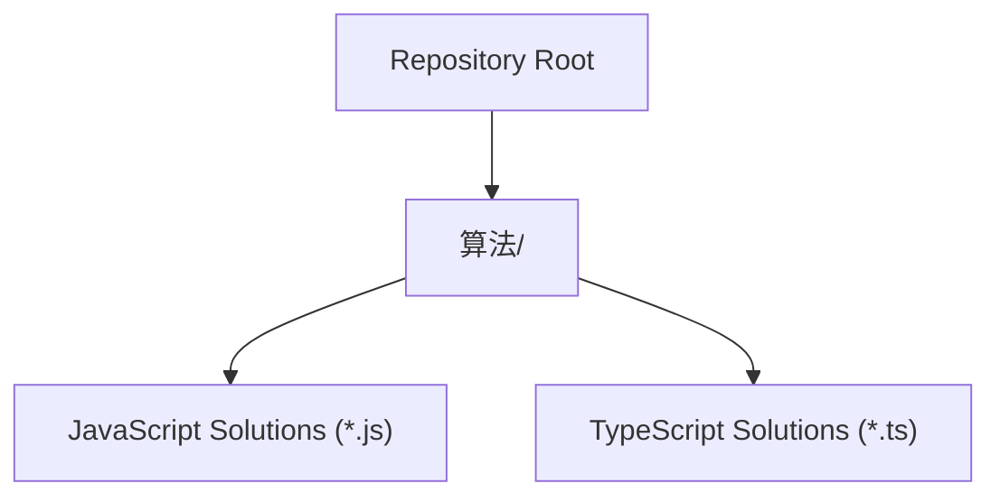

**Diagram sources**
- [README.md](file://README.md)
- [1.two-sum.js](file://算法/1.two-sum.js)

**Section sources**
- [README.md](file://README.md)

## Core Components
Below are the core data structures covered, with implementation patterns, operations, and representative problems that exercise them.

- Arrays and Matrices
  - Patterns: Index-based access, prefix sums, sliding windows, matrix traversal, dynamic programming on grids.
  - Representative problems: [1.two-sum.js], [1030.matrix-cells-in-distance-order.js], [1252.cells-with-odd-values-in-a-matrix.js], [1314.matrix-block-sum.js], [73.set-matrix-zeroes.ts], [54.spiral-matrix.js], [59.spiral-matrix-ii.js], [766.toeplitz-matrix.js], [867.transpose-matrix.js].
  - Complexity: Access O(1), insert/delete depends on position; DP on matrices often runs in O(rows×cols).
  - Memory: Contiguous storage; cache-friendly; extra space for auxiliary arrays (e.g., prefix sums).

- Linked Lists (Singly, Doubly, Circular)
  - Patterns: Two-pointer technique (fast/slow), sentinel nodes, dummy heads, iterative reversal, cycle detection.
  - Representative problems: [206.reverse-linked-list.js], [141.linked-list-cycle.ts], [160.intersection-of-two-linked-lists.ts], [237.delete-node-in-a-linked-list.js], [1721.swapping-nodes-in-a-linked-list.js], [876.middle-of-the-linked-list.js].
  - Complexity: Traversal O(n), reversal O(n), detect cycle O(n).
  - Memory: Dynamic allocation; pointers require careful cleanup to avoid leaks.

- Stacks and Queues
  - Patterns: Monotonic stacks, deque-based sliding windows, BFS/DFS via queues, stack simulation of recursion.
  - Representative problems: [20.valid-parentheses.js], [42.trapping-rain-water.js], [394.decode-string.js], [239.sliding-window-maximum.js], [946.validate-stack-sequences.js], [933.number-of-recent-calls.js].
  - Complexity: Amortized O(1) push/pop for queues; stack operations O(1) per operation.
  - Memory: Stack grows with recursion depth or explicit stack size; queue grows with breadth.

- Hash Tables (Hash Sets/Maps)
  - Patterns: Frequency counting, two-sum complement lookup, sliding window with frequency maps, union-find.
  - Representative problems: [1.two-sum.js], [49.group-anagrams.js], [347.top-k-frequent-elements.ts], [217.contains-duplicate.js], [350.intersection-of-two-arrays-ii.js], [238.product-of-array-except-self.js], [1346.check-if-n-and-its-double-exist.js].
  - Complexity: Average O(1) for insert/search; worst-case O(n) under collisions.
  - Memory: Proportional to number of stored keys; load factor affects performance.

- Trees (Binary, BST, Heap)
  - Patterns: DFS/BFS traversals, serialization/deserialization, path-based computations, BST property checks, heap construction/operations.
  - Representative problems: [226.invert-binary-tree.js], [297.serialize-and-deserialize-binary-tree.js], [98.validate-binary-search-tree.js], [104.maximum-depth-of-binary-tree.js], [102.binary-tree-level-order-traversal.js], [94.binary-tree-inorder-traversal.js], [1382.balance-a-binary-search-tree.js], [235.lowest-common-ancestor-of-a-binary-search-tree.js], [236.lowest-common-ancestor-of-a-binary-tree.js], [1448.count-good-nodes-in-binary-tree.js], [1339.maximum-product-of-splitted-binary-tree.js].
  - Complexity: Traversals O(n); BST operations average O(log n) to O(n); heap operations O(log n).
  - Memory: Recursive stack proportional to height; heap occupies contiguous array.

- Graphs (Directed, Undirected)
  - Patterns: BFS/DFS, topological sorting, shortest paths (unweighted/Dijkstra), union-find, graph coloring.
  - Representative problems: [200.number-of-islands.ts], [207.course-schedule.js], [210.course-schedule-ii.js], [133.clone-graph.js], [841.keys-and-rooms.js], [1557.minimum-number-of-vertices-to-reach-all-nodes.js], [1129.shortest-path-with-alternating-colors.js], [1263.minimum-moves-to-move-a-box-to-their-target-location.js].
  - Complexity: BFS/DFS O(V+E); topological sort O(V+E); union-find nearly O(α(N)).
  - Memory: Adjacency lists/sets; visited/color arrays; recursion stack.

- Tries (Prefix Trees)
  - Patterns: Prefix matching, word insertion/search, auto-complete, longest common prefix.
  - Representative problems: [208.implement-trie-prefix-tree.ts], [211.design-add-and-search-words-data-structure.js], [212.word-search-ii.js], [676.implement-magic-dictionary.js], [677.map-sum-pairs.js].
  - Complexity: Insert/search O(L) where L is key length; space O(ALPHABET×N×L) in worst case.
  - Memory: Node-based structure; shared prefixes reduce duplication.

- Disjoint Sets (Union-Find)
  - Patterns: Connectivity queries, Kruskal’s MST, cycle detection in undirected graphs.
  - Representative problems: [547.number-of-provinces.js], [1319.number-of-operations-to-make-network-connected.js], [1202.smallest-string-with-swaps.js], [1697.checking-existence-of-edge-length-limited-paths.js].
  - Complexity: Amortized inverse Ackermann O(α(N)) per operation.
  - Memory: Parent array plus optional rank/size; minimal overhead.

**Section sources**
- [1.two-sum.js](file://算法/1.two-sum.js)
- [20.valid-parentheses.js](file://算法/20.valid-parentheses.js)
- [206.reverse-linked-list.js](file://算法/206.reverse-linked-list.js)
- [141.linked-list-cycle.ts](file://算法/141.linked-list-cycle.ts)
- [200.number-of-islands.ts](file://算法/200.number-of-islands.ts)
- [207.course-schedule.js](file://算法/207.course-schedule.js)
- [208.implement-trie-prefix-tree.ts](file://算法/208.implement-trie-prefix-tree.ts)
- [226.invert-binary-tree.js](file://算法/226.invert-binary-tree.js)
- [297.serialize-and-deserialize-binary-tree.js](file://算法/297.serialize-and-deserialize-binary-tree.js)
- [98.validate-binary-search-tree.js](file://算法/98.validate-binary-search-tree.js)
- [102.binary-tree-level-order-traversal.js](file://算法/102.binary-tree-level-order-traversal.js)
- [94.binary-tree-inorder-traversal.js](file://算法/94.binary-tree-inorder-traversal.js)
- [133.clone-graph.js](file://算法/133.clone-graph.js)
- [1382.balance-a-binary-search-tree.js](file://算法/1382.balance-a-binary-search-tree.js)
- [235.lowest-common-ancestor-of-a-binary-search-tree.js](file://算法/235.lowest-common-ancestor-of-a-binary-search-tree.js)
- [236.lowest-common-ancestor-of-a-binary-tree.js](file://算法/236.lowest-common-ancestor-of-a-binary-tree.js)
- [1448.count-good-nodes-in-binary-tree.js](file://算法/1448.count-good-nodes-in-binary-tree.js)
- [1339.maximum-product-of-splitted-binary-tree.js](file://算法/1339.maximum-product-of-splitted-binary-tree.js)
- [547.number-of-provinces.js](file://算法/547.number-of-provinces.js)
- [1319.number-of-operations-to-make-network-connected.js](file://算法/1319.number-of-operations-to-make-network-connected.js)
- [1202.smallest-string-with-swaps.js](file://算法/1202.smallest-string-with-swaps.js)
- [1697.checking-existence-of-edge-length-limited-paths.js](file://算法/1697.checking-existence-of-edge-length-limited-paths.js)
- [1030.matrix-cells-in-distance-order.js](file://算法/1030.matrix-cells-in-distance-order.js)
- [1252.cells-with-odd-values-in-a-matrix.js](file://算法/1252.cells-with-odd-values-in-a-matrix.js)
- [1314.matrix-block-sum.js](file://算法/1314.matrix-block-sum.js)
- [73.set-matrix-zeroes.ts](file://算法/73.set-matrix-zeroes.ts)
- [54.spiral-matrix.js](file://算法/54.spiral-matrix.js)
- [59.spiral-matrix-ii.js](file://算法/59.spiral-matrix-ii.js)
- [766.toeplitz-matrix.js](file://算法/766.toeplitz-matrix.js)
- [867.transpose-matrix.js](file://算法/867.transpose-matrix.js)
- [42.trapping-rain-water.js](file://算法/42.trapping-rain-water.js)
- [239.sliding-window-maximum.js](file://算法/239.sliding-window-maximum.js)
- [946.validate-stack-sequences.js](file://算法/946.validate-stack-sequences.js)
- [933.number-of-recent-calls.js](file://算法/933.number-of-recent-calls.js)
- [49.group-anagrams.js](file://算法/49.group-anagrams.js)
- [347.top-k-frequent-elements.ts](file://算法/347.top-k-frequent-elements.ts)
- [217.contains-duplicate.js](file://算法/217.contains-duplicate.js)
- [350.intersection-of-two-arrays-ii.js](file://算法/350.intersection-of-two-arrays-ii.js)
- [238.product-of-array-except-self.js](file://算法/238.product-of-array-except-self.js)
- [1346.check-if-n-and-its-double-exist.js](file://算法/1346.check-if-n-and-its-double-exist.js)

## Architecture Overview
The repository does not define a centralized runtime architecture. Instead, each algorithm file encapsulates a self-contained solution that demonstrates a specific data structure or algorithmic pattern. The following conceptual architecture illustrates how different structures are exercised across files:

```mermaid
graph TB
Arrays["Arrays & Matrices"]
Lists["Linked Lists"]
StacksQueues["Stacks & Queues"]
Hash["Hash Tables"]
Trees["Trees"]
Graphs["Graphs"]
Trie["Trie"]
DSU["Disjoint Sets"]
Arrays --> A1["1.two-sum.js"]
Arrays --> A2["matrix-cells-in-distance-order.js"]
Arrays --> A3["cells-with-odd-values-in-a-matrix.js"]
Arrays --> A4["matrix-block-sum.js"]
Lists --> L1["reverse-linked-list.js"]
Lists --> L2["linked-list-cycle.ts"]
Lists --> L3["middle-of-the-linked-list.js"]
StacksQueues --> S1["valid-parentheses.js"]
StacksQueues --> S2["trapping-rain-water.js"]
StacksQueues --> S3["sliding-window-maximum.js"]
Hash --> H1["group-anagrams.js"]
Hash --> H2["top-k-frequent-elements.ts"]
Hash --> H3["product-of-array-except-self.js"]
Trees --> T1["invert-binary-tree.js"]
Trees --> T2["serialize-and-deserialize-binary-tree.js"]
Trees --> T3["validate-binary-search-tree.js"]
Graphs --> G1["number-of-islands.ts"]
Graphs --> G2["course-schedule.js"]
Graphs --> G3["clone-graph.js"]
Trie --> TR1["implement-trie-prefix-tree.ts"]
Trie --> TR2["word-search-ii.js"]
DSU --> D1["number-of-provinces.js"]
DSU --> D2["operations-to-make-network-connected.js"]
```

**Diagram sources**
- [1.two-sum.js](file://算法/1.two-sum.js)
- [1030.matrix-cells-in-distance-order.js](file://算法/1030.matrix-cells-in-distance-order.js)
- [1252.cells-with-odd-values-in-a-matrix.js](file://算法/1252.cells-with-odd-values-in-a-matrix.js)
- [1314.matrix-block-sum.js](file://算法/1314.matrix-block-sum.js)
- [206.reverse-linked-list.js](file://算法/206.reverse-linked-list.js)
- [141.linked-list-cycle.ts](file://算法/141.linked-list-cycle.ts)
- [876.middle-of-the-linked-list.js](file://算法/876.middle-of-the-linked-list.js)
- [20.valid-parentheses.js](file://算法/20.valid-parentheses.js)
- [42.trapping-rain-water.js](file://算法/42.trapping-rain-water.js)
- [239.sliding-window-maximum.js](file://算法/239.sliding-window-maximum.js)
- [49.group-anagrams.js](file://算法/49.group-anagrams.js)
- [347.top-k-frequent-elements.ts](file://算法/347.top-k-frequent-elements.ts)
- [238.product-of-array-except-self.js](file://算法/238.product-of-array-except-self.js)
- [226.invert-binary-tree.js](file://算法/226.invert-binary-tree.js)
- [297.serialize-and-deserialize-binary-tree.js](file://算法/297.serialize-and-deserialize-binary-tree.js)
- [98.validate-binary-search-tree.js](file://算法/98.validate-binary-search-tree.js)
- [200.number-of-islands.ts](file://算法/200.number-of-islands.ts)
- [207.course-schedule.js](file://算法/207.course-schedule.js)
- [133.clone-graph.js](file://算法/133.clone-graph.js)
- [208.implement-trie-prefix-tree.ts](file://算法/208.implement-trie-prefix-tree.ts)
- [212.word-search-ii.js](file://算法/212.word-search-ii.js)
- [547.number-of-provinces.js](file://算法/547.number-of-provinces.js)
- [1319.number-of-operations-to-make-network-connected.js](file://算法/1319.number-of-operations-to-make-network-connected.js)

## Detailed Component Analysis

### Arrays and Matrices
- Implementation patterns:
  - Prefix sums for range queries.
  - Sliding window for fixed-size subarrays/submatrices.
  - Matrix traversal strategies (spiral, diagonal).
  - Dynamic programming on grid indices.
- Typical operations and complexity:
  - Range sum queries: O(1) after O(mn) preprocessing.
  - Sliding window: O(n) for 1D, O(rows×cols) for 2D.
  - Matrix traversal: O(rows×cols).
- Representative algorithms:
  - Distance order traversal: [1030.matrix-cells-in-distance-order.js]
  - Odd values matrix: [1252.cells-with-odd-values-in-a-matrix.js]
  - Block sum: [1314.matrix-block-sum.js]
  - Zero matrix (in-place marking): [73.set-matrix-zeroes.ts]
  - Spiral traversal: [54.spiral-matrix.js], [59.spiral-matrix-ii.js]
  - Toeplitz check: [766.toeplitz-matrix.js]
  - Transpose: [867.transpose-matrix.js]

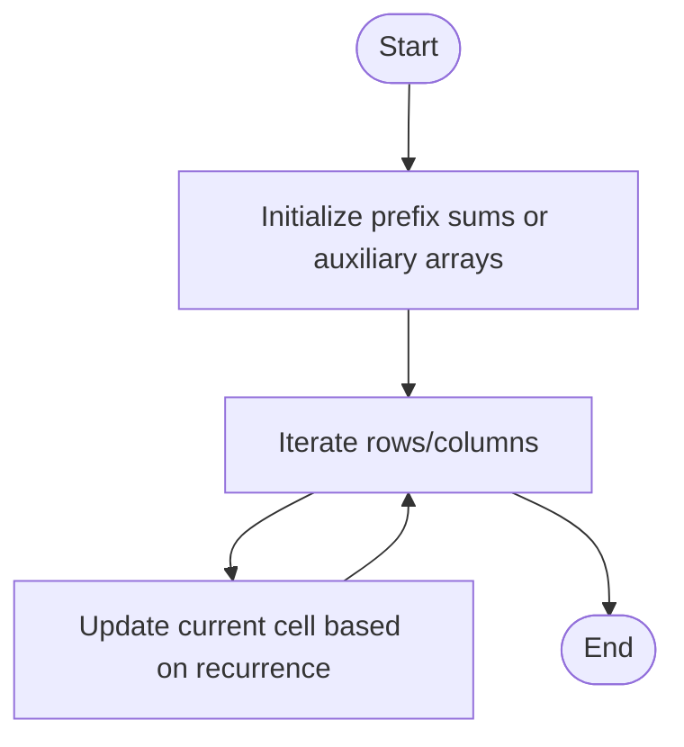

**Diagram sources**
- [1314.matrix-block-sum.js](file://算法/1314.matrix-block-sum.js)
- [73.set-matrix-zeroes.ts](file://算法/73.set-matrix-zeroes.ts)

**Section sources**
- [1030.matrix-cells-in-distance-order.js](file://算法/1030.matrix-cells-in-distance-order.js)
- [1252.cells-with-odd-values-in-a-matrix.js](file://算法/1252.cells-with-odd-values-in-a-matrix.js)
- [1314.matrix-block-sum.js](file://算法/1314.matrix-block-sum.js)
- [73.set-matrix-zeroes.ts](file://算法/73.set-matrix-zeroes.ts)
- [54.spiral-matrix.js](file://算法/54.spiral-matrix.js)
- [59.spiral-matrix-ii.js](file://算法/59.spiral-matrix-ii.js)
- [766.toeplitz-matrix.js](file://算法/766.toeplitz-matrix.js)
- [867.transpose-matrix.js](file://算法/867.transpose-matrix.js)

### Linked Lists
- Implementation patterns:
  - Fast/slow pointer for middle, cycle detection, merging.
  - Iterative reversal with three pointers.
  - Dummy head for uniform handling of insertions/deletions.
- Typical operations and complexity:
  - Reverse: O(n), O(1) space.
  - Cycle detection: O(n), O(1) space.
  - Middle element: O(n), O(1) space.
- Representative algorithms:
  - Reverse: [206.reverse-linked-list.js]
  - Cycle detection: [141.linked-list-cycle.ts]
  - Middle: [876.middle-of-the-linked-list.js]
  - Delete node: [237.delete-node-in-a-linked-list.js]
  - Swap nodes: [1721.swapping-nodes-in-a-linked-list.js]

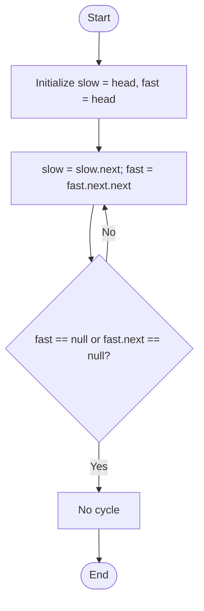

**Diagram sources**
- [141.linked-list-cycle.ts](file://算法/141.linked-list-cycle.ts)

**Section sources**
- [206.reverse-linked-list.js](file://算法/206.reverse-linked-list.js)
- [141.linked-list-cycle.ts](file://算法/141.linked-list-cycle.ts)
- [876.middle-of-the-linked-list.js](file://算法/876.middle-of-the-linked-list.js)
- [237.delete-node-in-a-linked-list.js](file://算法/237.delete-node-in-a-linked-list.js)
- [1721.swapping-nodes-in-a-linked-list.js](file://算法/1721.swapping-nodes-in-a-linked-list.js)

### Stacks and Queues
- Implementation patterns:
  - Monotonic stacks for nearest smaller/greater elements.
  - Deque-based sliding window maximum/minimum.
  - BFS/DFS using queues; stack-based DFS simulation.
- Typical operations and complexity:
  - Push/pop O(1) amortized; sliding window O(n).
- Representative algorithms:
  - Parentheses validation: [20.valid-parentheses.js]
  - Rainwater trapping: [42.trapping-rain-water.js]
  - Sliding window max: [239.sliding-window-maximum.js]
  - Validate stack sequences: [946.validate-stack-sequences.js]
  - Recent calls counter: [933.number-of-recent-calls.js]

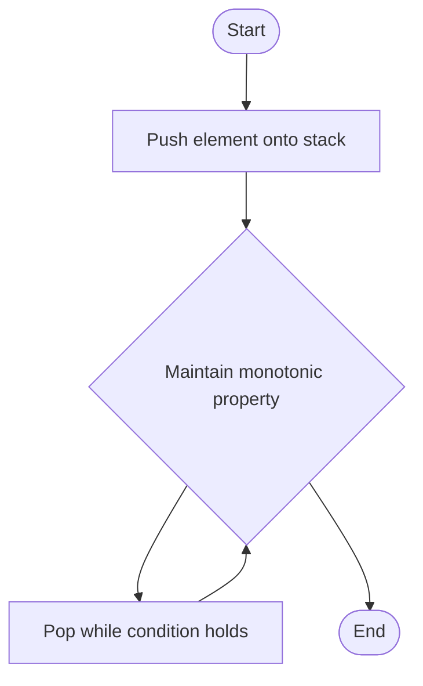

**Diagram sources**
- [20.valid-parentheses.js](file://算法/20.valid-parentheses.js)
- [42.trapping-rain-water.js](file://算法/42.trapping-rain-water.js)

**Section sources**
- [20.valid-parentheses.js](file://算法/20.valid-parentheses.js)
- [42.trapping-rain-water.js](file://算法/42.trapping-rain-water.js)
- [239.sliding-window-maximum.js](file://算法/239.sliding-window-maximum.js)
- [946.validate-stack-sequences.js](file://算法/946.validate-stack-sequences.js)
- [933.number-of-recent-calls.js](file://算法/933.number-of-recent-calls.js)

### Hash Tables
- Implementation patterns:
  - Complement maps for two-sum.
  - Frequency maps for duplicates/anagrams.
  - Product except self using left/right products.
- Typical operations and complexity:
  - Average O(1) for insert/search; O(n) space for frequency maps.
- Representative algorithms:
  - Two sum: [1.two-sum.js]
  - Group anagrams: [49.group-anagrams.js]
  - Top K frequent: [347.top-k-frequent-elements.ts]
  - Contains duplicate: [217.contains-duplicate.js]
  - Intersect II: [350.intersection-of-two-arrays-ii.js]
  - Product except self: [238.product-of-array-except-self.js]

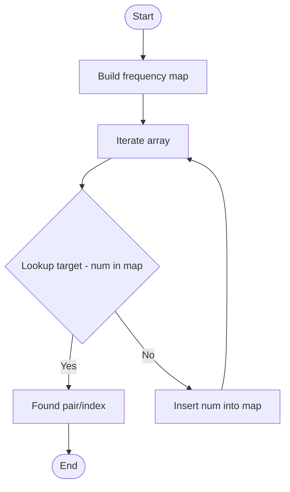

**Diagram sources**
- [1.two-sum.js](file://算法/1.two-sum.js)

**Section sources**
- [1.two-sum.js](file://算法/1.two-sum.js)
- [49.group-anagrams.js](file://算法/49.group-anagrams.js)
- [347.top-k-frequent-elements.ts](file://算法/347.top-k-frequent-elements.ts)
- [217.contains-duplicate.js](file://算法/217.contains-duplicate.js)
- [350.intersection-of-two-arrays-ii.js](file://算法/350.intersection-of-two-arrays-ii.js)
- [238.product-of-array-except-self.js](file://算法/238.product-of-array-except-self.js)

### Trees (Binary, BST, Heap)
- Implementation patterns:
  - DFS/BFS traversals; recursive and iterative approaches.
  - Serialization/deserialization for tree reconstruction.
  - BST validation via bounds; path-based computations.
- Typical operations and complexity:
  - Traversals O(n); BST operations average O(log n) to O(n); heap operations O(log n).
- Representative algorithms:
  - Invert tree: [226.invert-binary-tree.js]
  - Serialize/Deserialize: [297.serialize-and-deserialize-binary-tree.js]
  - Validate BST: [98.validate-binary-search-tree.js]
  - Level order: [102.binary-tree-level-order-traversal.js]
  - Inorder: [94.binary-tree-inorder-traversal.js]
  - Balance BST: [1382.balance-a-binary-search-tree.js]
  - LCA BST: [235.lowest-common-ancestor-of-a-binary-search-tree.js]
  - LCA BT: [236.lowest-common-ancestor-of-a-binary-tree.js]
  - Good nodes: [1448.count-good-nodes-in-binary-tree.js]
  - Split product: [1339.maximum-product-of-splitted-binary-tree.js]

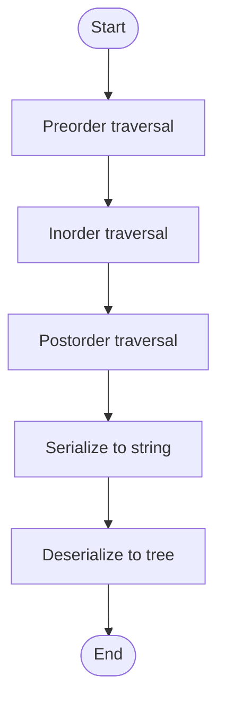

**Diagram sources**
- [297.serialize-and-deserialize-binary-tree.js](file://算法/297.serialize-and-deserialize-binary-tree.js)

**Section sources**
- [226.invert-binary-tree.js](file://算法/226.invert-binary-tree.js)
- [297.serialize-and-deserialize-binary-tree.js](file://算法/297.serialize-and-deserialize-binary-tree.js)
- [98.validate-binary-search-tree.js](file://算法/98.validate-binary-search-tree.js)
- [102.binary-tree-level-order-traversal.js](file://算法/102.binary-tree-level-order-traversal.js)
- [94.binary-tree-inorder-traversal.js](file://算法/94.binary-tree-inorder-traversal.js)
- [1382.balance-a-binary-search-tree.js](file://算法/1382.balance-a-binary-search-tree.js)
- [235.lowest-common-ancestor-of-a-binary-search-tree.js](file://算法/235.lowest-common-ancestor-of-a-binary-search-tree.js)
- [236.lowest-common-ancestor-of-a-binary-tree.js](file://算法/236.lowest-common-ancestor-of-a-binary-tree.js)
- [1448.count-good-nodes-in-binary-tree.js](file://算法/1448.count-good-nodes-in-binary-tree.js)
- [1339.maximum-product-of-splitted-binary-tree.js](file://算法/1339.maximum-product-of-splitted-binary-tree.js)

### Graphs (Directed, Undirected)
- Implementation patterns:
  - BFS/DFS for connectivity and shortest paths (unweighted).
  - Topological sorting for course schedules.
  - Union-Find for connectivity and MST-like problems.
- Typical operations and complexity:
  - BFS/DFS O(V+E); topological sort O(V+E); union-find nearly O(α(N)).
- Representative algorithms:
  - Number of islands: [200.number-of-islands.ts]
  - Course schedule: [207.course-schedule.js], [210.course-schedule-ii.js]
  - Clone graph: [133.clone-graph.js]
  - Keys and rooms: [841.keys-and-rooms.js]
  - Min vertices to reach all: [1557.minimum-number-of-vertices-to-reach-all-nodes.js]
  - Provinces: [547.number-of-provinces.js]
  - Network connections: [1319.number-of-operations-to-make-network-connected.js]

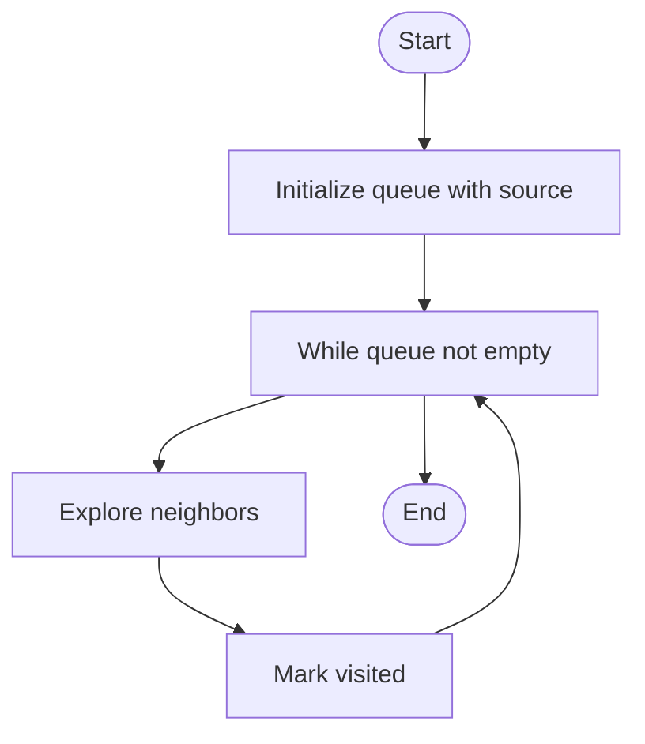

**Diagram sources**
- [200.number-of-islands.ts](file://算法/200.number-of-islands.ts)
- [207.course-schedule.js](file://算法/207.course-schedule.js)
- [133.clone-graph.js](file://算法/133.clone-graph.js)

**Section sources**
- [200.number-of-islands.ts](file://算法/200.number-of-islands.ts)
- [207.course-schedule.js](file://算法/207.course-schedule.js)
- [210.course-schedule-ii.js](file://算法/210.course-schedule-ii.js)
- [133.clone-graph.js](file://算法/133.clone-graph.js)
- [841.keys-and-rooms.js](file://算法/841.keys-and-rooms.js)
- [1557.minimum-number-of-vertices-to-reach-all-nodes.js](file://算法/1557.minimum-number-of-vertices-to-reach-all-nodes.js)
- [547.number-of-provinces.js](file://算法/547.number-of-provinces.js)
- [1319.number-of-operations-to-make-network-connected.js](file://算法/1319.number-of-operations-to-make-network-connected.js)

### Tries
- Implementation patterns:
  - Node-based structure with children array/map and end-of-word flag.
  - Prefix-based operations: insert, search, startsWith.
- Typical operations and complexity:
  - Insert/search O(L) where L is key length.
- Representative algorithms:
  - Implement trie: [208.implement-trie-prefix-tree.ts]
  - Add and search words: [211.design-add-and-search-words-data-structure.js]
  - Word search II: [212.word-search-ii.js]
  - Magic dictionary: [676.implement-magic-dictionary.js]
  - Map sum pairs: [677.map-sum-pairs.js]

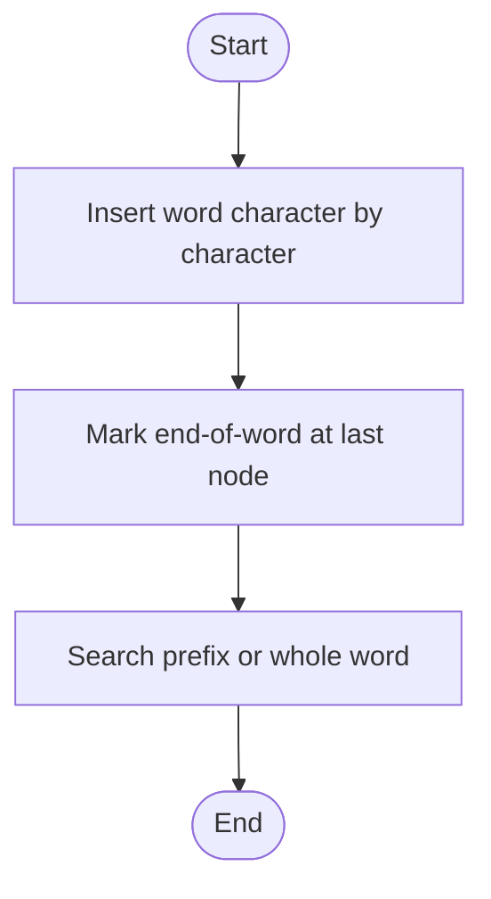

**Diagram sources**
- [208.implement-trie-prefix-tree.ts](file://算法/208.implement-trie-prefix-tree.ts)

**Section sources**
- [208.implement-trie-prefix-tree.ts](file://算法/208.implement-trie-prefix-tree.ts)
- [211.design-add-and-search-words-data-structure.js](file://算法/211.design-add-and-search-words-data-structure.js)
- [212.word-search-ii.js](file://算法/212.word-search-ii.js)
- [676.implement-magic-dictionary.js](file://算法/676.implement-magic-dictionary.js)
- [677.map-sum-pairs.js](file://算法/677.map-sum-pairs.js)

### Disjoint Sets (Union-Find)
- Implementation patterns:
  - Path compression and union by rank/size.
  - Applications: connectivity queries, Kruskal’s MST, cycle detection.
- Typical operations and complexity:
  - Amortized inverse Ackermann O(α(N)) per operation.
- Representative algorithms:
  - Provinces: [547.number-of-provinces.js]
  - Network connections: [1319.number-of-operations-to-make-network-connected.js]
  - Smallest string with swaps: [1202.smallest-string-with-swaps.js]
  - Edge existence with limits: [1697.checking-existence-of-edge-length-limited-paths.js]

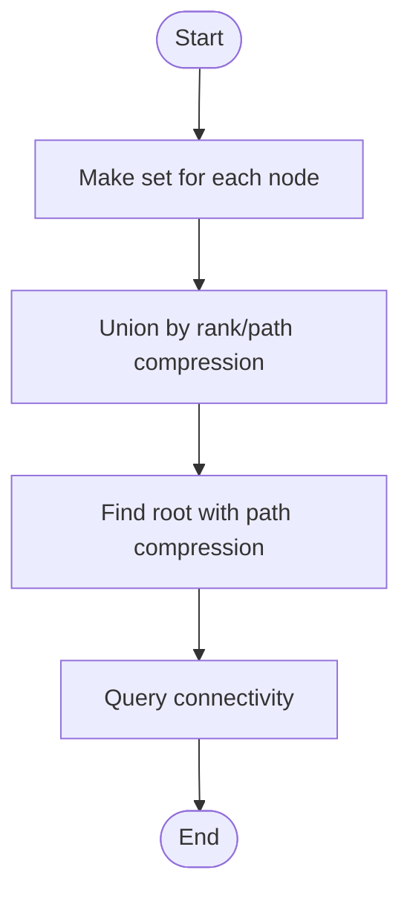

**Diagram sources**
- [547.number-of-provinces.js](file://算法/547.number-of-provinces.js)
- [1319.number-of-operations-to-make-network-connected.js](file://算法/1319.number-of-operations-to-make-network-connected.js)

**Section sources**
- [547.number-of-provinces.js](file://算法/547.number-of-provinces.js)
- [1319.number-of-operations-to-make-network-connected.js](file://算法/1319.number-of-operations-to-make-network-connected.js)
- [1202.smallest-string-with-swaps.js](file://算法/1202.smallest-string-with-swaps.js)
- [1697.checking-existence-of-edge-length-limited-paths.js](file://算法/1697.checking-existence-of-edge-length-limited-paths.js)

## Dependency Analysis
Across the repository, data structures are used independently within individual solutions. There is no central dependency graph among files; instead, each solution demonstrates a specific structure or algorithmic technique. The following diagram shows representative dependencies among structures used in selected problems:

```mermaid
graph TB
TwoSum["1.two-sum.js"] --> Hash["Hash Map"]
GroupAnagrams["49.group-anagrams.js"] --> Hash
TopKFrequent["347.top-k-frequent-elements.ts"] --> Hash
ProductExceptSelf["238.product-of-array-except-self.js"] --> Arrays
MatrixTraversal["1030.matrix-cells-in-distance-order.js"] --> Arrays
CellsOdd["1252.cells-with-odd-values-in-a-matrix.js"] --> Arrays
MatrixBlockSum["1314.matrix-block-sum.js"] --> Arrays
ReverseLL["206.reverse-linked-list.js"] --> Lists
LinkedListCycle["141.linked-list-cycle.ts"] --> Lists
Parentheses["20.valid-parentheses.js"] --> Stacks
RainWater["42.trapping-rain-water.js"] --> Stacks
SlidingWindow["239.sliding-window-maximum.js"] --> Stacks
SerializeBST["297.serialize-and-deserialize-binary-tree.js"] --> Trees
ValidateBST["98.validate-binary-search-tree.js"] --> Trees
LevelOrder["102.binary-tree-level-order-traversal.js"] --> Trees
InvertTree["226.invert-binary-tree.js"] --> Trees
CloneGraph["133.clone-graph.js"] --> Graphs
NumIslands["200.number-of-islands.ts"] --> Graphs
CourseSchedule["207.course-schedule.js"] --> Graphs
TrieOps["208.implement-trie-prefix-tree.ts"] --> Trie
WordSearchII["212.word-search-ii.js"] --> Trie
Provinces["547.number-of-provinces.js"] --> DSU
NetworkConn["1319.number-of-operations-to-make-network-connected.js"] --> DSU
```

**Diagram sources**
- [1.two-sum.js](file://算法/1.two-sum.js)
- [49.group-anagrams.js](file://算法/49.group-anagrams.js)
- [347.top-k-frequent-elements.ts](file://算法/347.top-k-frequent-elements.ts)
- [238.product-of-array-except-self.js](file://算法/238.product-of-array-except-self.js)
- [1030.matrix-cells-in-distance-order.js](file://算法/1030.matrix-cells-in-distance-order.js)
- [1252.cells-with-odd-values-in-a-matrix.js](file://算法/1252.cells-with-odd-values-in-a-matrix.js)
- [1314.matrix-block-sum.js](file://算法/1314.matrix-block-sum.js)
- [206.reverse-linked-list.js](file://算法/206.reverse-linked-list.js)
- [141.linked-list-cycle.ts](file://算法/141.linked-list-cycle.ts)
- [20.valid-parentheses.js](file://算法/20.valid-parentheses.js)
- [42.trapping-rain-water.js](file://算法/42.trapping-rain-water.js)
- [239.sliding-window-maximum.js](file://算法/239.sliding-window-maximum.js)
- [297.serialize-and-deserialize-binary-tree.js](file://算法/297.serialize-and-deserialize-binary-tree.js)
- [98.validate-binary-search-tree.js](file://算法/98.validate-binary-search-tree.js)
- [102.binary-tree-level-order-traversal.js](file://算法/102.binary-tree-level-order-traversal.js)
- [226.invert-binary-tree.js](file://算法/226.invert-binary-tree.js)
- [133.clone-graph.js](file://算法/133.clone-graph.js)
- [200.number-of-islands.ts](file://算法/200.number-of-islands.ts)
- [207.course-schedule.js](file://算法/207.course-schedule.js)
- [208.implement-trie-prefix-tree.ts](file://算法/208.implement-trie-prefix-tree.ts)
- [212.word-search-ii.js](file://算法/212.word-search-ii.js)
- [547.number-of-provinces.js](file://算法/547.number-of-provinces.js)
- [1319.number-of-operations-to-make-network-connected.js](file://算法/1319.number-of-operations-to-make-network-connected.js)

**Section sources**
- [1.two-sum.js](file://算法/1.two-sum.js)
- [49.group-anagrams.js](file://算法/49.group-anagrams.js)
- [347.top-k-frequent-elements.ts](file://算法/347.top-k-frequent-elements.ts)
- [238.product-of-array-except-self.js](file://算法/238.product-of-array-except-self.js)
- [1030.matrix-cells-in-distance-order.js](file://算法/1030.matrix-cells-in-distance-order.js)
- [1252.cells-with-odd-values-in-a-matrix.js](file://算法/1252.cells-with-odd-values-in-a-matrix.js)
- [1314.matrix-block-sum.js](file://算法/1314.matrix-block-sum.js)
- [206.reverse-linked-list.js](file://算法/206.reverse-linked-list.js)
- [141.linked-list-cycle.ts](file://算法/141.linked-list-cycle.ts)
- [20.valid-parentheses.js](file://算法/20.valid-parentheses.js)
- [42.trapping-rain-water.js](file://算法/42.trapping-rain-water.js)
- [239.sliding-window-maximum.js](file://算法/239.sliding-window-maximum.js)
- [297.serialize-and-deserialize-binary-tree.js](file://算法/297.serialize-and-deserialize-binary-tree.js)
- [98.validate-binary-search-tree.js](file://算法/98.validate-binary-search-tree.js)
- [102.binary-tree-level-order-traversal.js](file://算法/102.binary-tree-level-order-traversal.js)
- [226.invert-binary-tree.js](file://算法/226.invert-binary-tree.js)
- [133.clone-graph.js](file://算法/133.clone-graph.js)
- [200.number-of-islands.ts](file://算法/200.number-of-islands.ts)
- [207.course-schedule.js](file://算法/207.course-schedule.js)
- [208.implement-trie-prefix-tree.ts](file://算法/208.implement-trie-prefix-tree.ts)
- [212.word-search-ii.js](file://算法/212.word-search-ii.js)
- [547.number-of-provinces.js](file://算法/547.number-of-provinces.js)
- [1319.number-of-operations-to-make-network-connected.js](file://算法/1319.number-of-operations-to-make-network-connected.js)

## Performance Considerations
- Arrays and Matrices:
  - Prefer prefix sums for frequent range queries; trade extra O(mn) space for O(1) updates.
  - Sliding window reduces nested loops; maintain counts/frequencies efficiently.
- Linked Lists:
  - Use fast/slow pointers to avoid extra passes; reverse iteratively to prevent stack overflow on large lists.
- Stacks and Queues:
  - Monotonic stacks reduce comparisons; deque-based sliding window avoids repeated scans.
- Hash Tables:
  - Choose appropriate hash functions and handle collisions; resize/load factors impact performance.
- Trees:
  - Keep BST balanced (AVL/red-black) for guaranteed logarithmic operations; otherwise expect degenerate cases.
- Graphs:
  - Use adjacency lists for sparse graphs; BFS/DFS with visited sets prevents redundant work.
- Tries:
  - Optimize alphabet size; consider compressed tries for long common prefixes.
- Disjoint Sets:
  - Always apply path compression and union by rank/size for near-constant time operations.

## Troubleshooting Guide
Common pitfalls and remedies:
- Off-by-one errors in arrays/matrices indexing; validate bounds before access.
- Stack overflow with deep recursion; convert to iterative or increase stack limit cautiously.
- Hash collisions leading to degraded performance; monitor load factor and rehash when needed.
- Tree imbalance causing O(n) operations; rebalance or switch to self-balancing trees.
- Graph cycles causing infinite loops; track visited/discovered sets and terminate early.
- Trie memory explosion with large alphabets; compress paths or use ternary search tries.
- Disjoint set union mistakes; ensure path compression and union by rank consistently.

## Conclusion
The repository’s algorithm collection offers a practical showcase of fundamental data structures and their applications. By studying the referenced files, one can learn implementation patterns, operational complexities, and performance trade-offs for arrays/matrices, linked lists, stacks/queues, hash tables, trees, graphs, tries, and disjoint sets. These patterns translate directly into robust, efficient solutions for real-world problems.

## Appendices
- Representative problem references:
  - Arrays and Matrices: [1.two-sum.js], [1030.matrix-cells-in-distance-order.js], [1252.cells-with-odd-values-in-a-matrix.js], [1314.matrix-block-sum.js], [73.set-matrix-zeroes.ts], [54.spiral-matrix.js], [59.spiral-matrix-ii.js], [766.toeplitz-matrix.js], [867.transpose-matrix.js]
  - Linked Lists: [206.reverse-linked-list.js], [141.linked-list-cycle.ts], [876.middle-of-the-linked-list.js], [237.delete-node-in-a-linked-list.js], [1721.swapping-nodes-in-a-linked-list.js]
  - Stacks and Queues: [20.valid-parentheses.js], [42.trapping-rain-water.js], [239.sliding-window-maximum.js], [946.validate-stack-sequences.js], [933.number-of-recent-calls.js]
  - Hash Tables: [1.two-sum.js], [49.group-anagrams.js], [347.top-k-frequent-elements.ts], [217.contains-duplicate.js], [350.intersection-of-two-arrays-ii.js], [238.product-of-array-except-self.js], [1346.check-if-n-and-its-double-exist.js]
  - Trees: [226.invert-binary-tree.js], [297.serialize-and-deserialize-binary-tree.js], [98.validate-binary-search-tree.js], [102.binary-tree-level-order-traversal.js], [94.binary-tree-inorder-traversal.js], [1382.balance-a-binary-search-tree.js], [235.lowest-common-ancestor-of-a-binary-search-tree.js], [236.lowest-common-ancestor-of-a-binary-tree.js], [1448.count-good-nodes-in-binary-tree.js], [1339.maximum-product-of-splitted-binary-tree.js]
  - Graphs: [200.number-of-islands.ts], [207.course-schedule.js], [210.course-schedule-ii.js], [133.clone-graph.js], [841.keys-and-rooms.js], [1557.minimum-number-of-vertices-to-reach-all-nodes.js], [547.number-of-provinces.js], [1319.number-of-operations-to-make-network-connected.js]
  - Tries: [208.implement-trie-prefix-tree.ts], [211.design-add-and-search-words-data-structure.js], [212.word-search-ii.js], [676.implement-magic-dictionary.js], [677.map-sum-pairs.js]
  - Disjoint Sets: [547.number-of-provinces.js], [1319.number-of-operations-to-make-network-connected.js], [1202.smallest-string-with-swaps.js], [1697.checking-existence-of-edge-length-limited-paths.js]