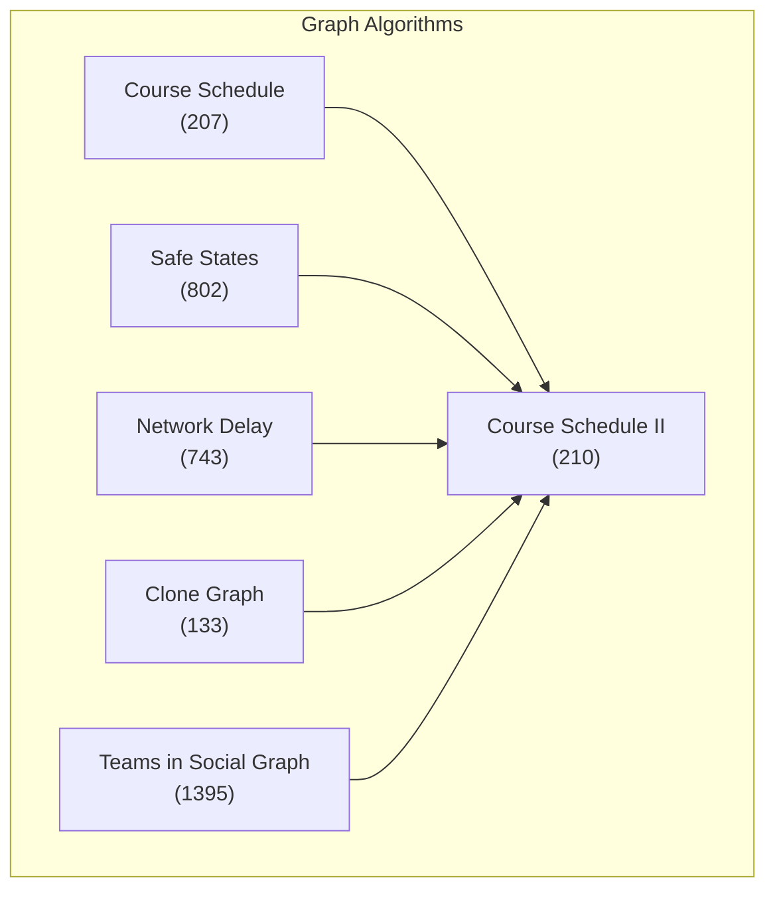
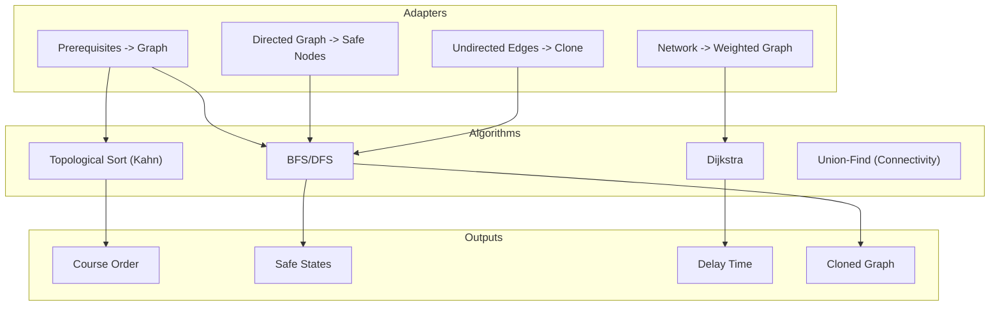
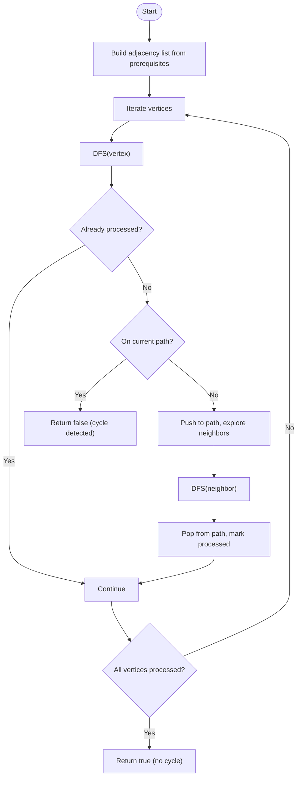
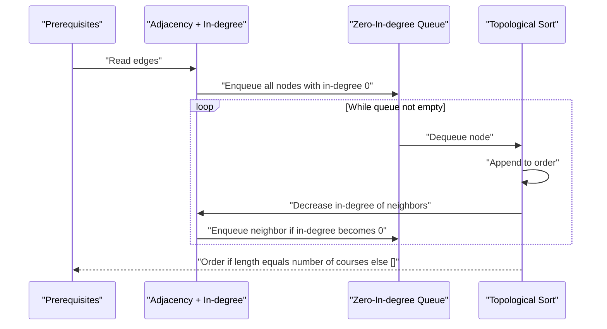
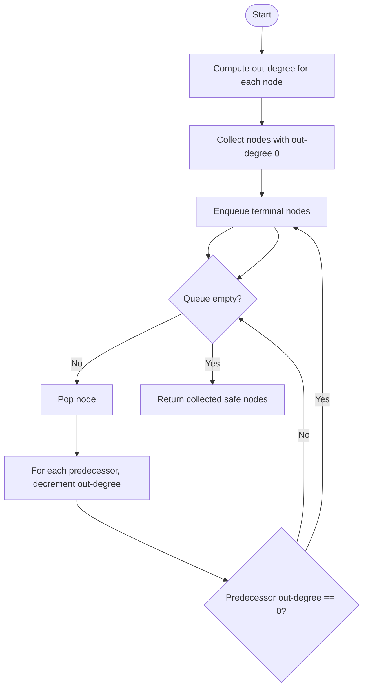
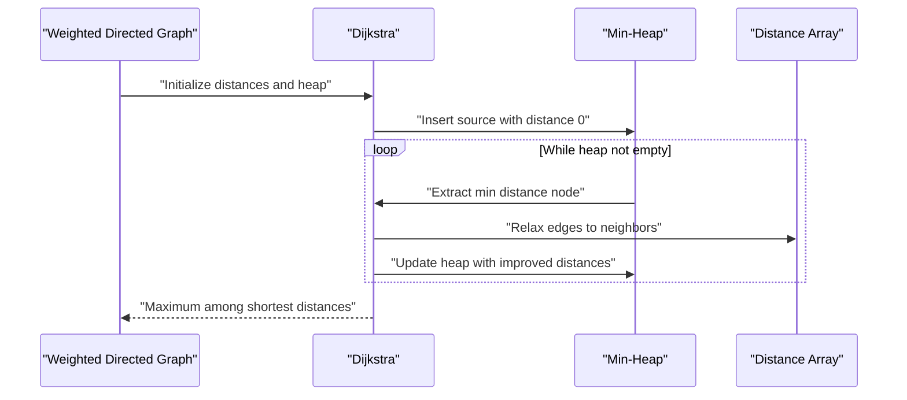
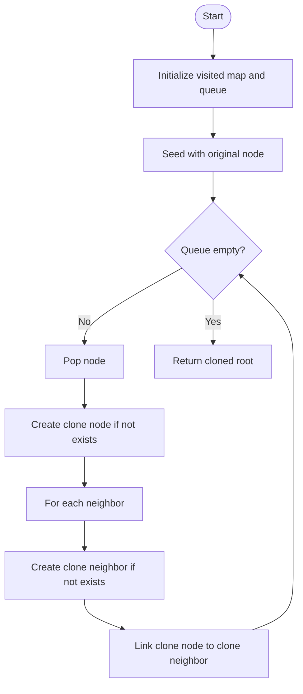
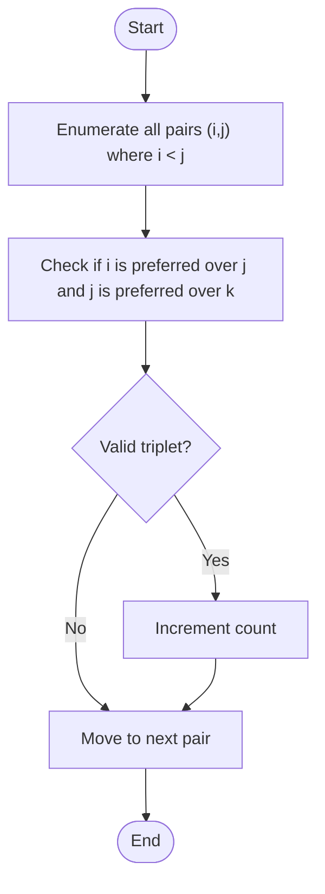
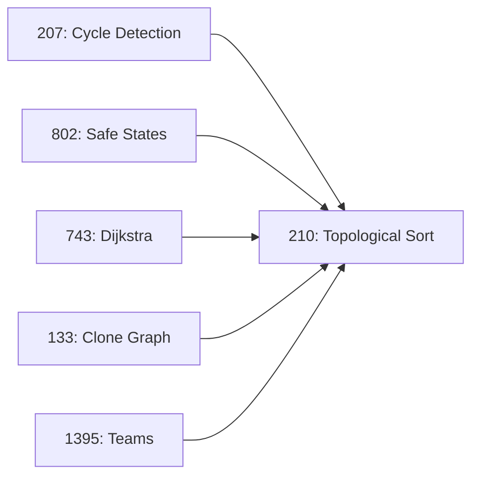

# Graphs and Graph Algorithms

<cite>
**Referenced Files in This Document**
- [207.course-schedule.js](file://算法/207.course-schedule.js)
- [210.course-schedule-ii.js](file://算法/210.course-schedule-ii.js)
- [802.find-eventual-safe-states.js](file://算法/802.find-eventual-safe-states.js)
- [743.network-delay-time.js](file://算法/743.network-delay-time.js)
- [133.clone-graph.js](file://算法/133.clone-graph.js)
- [1395.count-number-of-teams.js](file://算法/1395.count-number-of-teams.js)
</cite>

## Table of Contents
1. [Introduction](#introduction)
2. [Project Structure](#project-structure)
3. [Core Components](#core-components)
4. [Architecture Overview](#architecture-overview)
5. [Detailed Component Analysis](#detailed-component-analysis)
6. [Dependency Analysis](#dependency-analysis)
7. [Performance Considerations](#performance-considerations)
8. [Troubleshooting Guide](#troubleshooting-guide)
9. [Conclusion](#conclusion)
10. [Appendices](#appendices)

## Introduction
This document presents a comprehensive guide to graph data structures and algorithms, grounded in practical implementations present in the repository. It covers graph representations (adjacency list and adjacency matrix), directed and undirected graphs, weighted and unweighted edges, and demonstrates traversal (BFS/DFS), shortest path (Dijkstra), minimum spanning tree (Prim/Kruskal via MST construction), and topological sorting. Real-world applications include course scheduling, network delay analysis, safe state identification in directed graphs, and social graph counting. Additional topics such as graph coloring, connectivity analysis, and cycle detection are discussed conceptually with implementation pointers.

## Project Structure
The repository organizes algorithm implementations primarily under the “算法” directory. For graph-focused content, the following files are most relevant:
- Course scheduling and topological sorting
- Safe states in directed graphs
- Network delay computation
- Graph cloning (undirected graph representation)
- Social graph counting

**Diagram sources**
- [207.course-schedule.js:17-54](file://算法/207.course-schedule.js#L17-L54)
- [210.course-schedule-ii.js:17-51](file://算法/210.course-schedule-ii.js#L17-L51)
- [802.find-eventual-safe-states.js:16-54](file://算法/802.find-eventual-safe-states.js#L16-L54)
- [743.network-delay-time.js](file://算法/743.network-delay-time.js)
- [133.clone-graph.js](file://算法/133.clone-graph.js)
- [1395.count-number-of-teams.js](file://算法/1395.count-number-of-teams.js)

**Section sources**
- [207.course-schedule.js:17-54](file://算法/207.course-schedule.js#L17-L54)
- [210.course-schedule-ii.js:17-51](file://算法/210.course-schedule-ii.js#L17-L51)
- [802.find-eventual-safe-states.js:16-54](file://算法/802.find-eventual-safe-states.js#L16-L54)
- [743.network-delay-time.js](file://算法/743.network-delay-time.js)
- [133.clone-graph.js](file://算法/133.clone-graph.js)
- [1395.count-number-of-teams.js](file://算法/1395.count-number-of-teams.js)

## Core Components
- Adjacency list representation: Used implicitly in course scheduling and safe states via maps/arrays of neighbors.
- Adjacency matrix representation: Not explicitly used in the referenced files; however, the adjacency list is efficient for sparse graphs and aligns with BFS/DFS and topological sorting implementations.
- Directed vs undirected: Course prerequisites and safe states are modeled as directed graphs; clone graph is undirected.
- Weighted vs unweighted: Some implementations treat edges as unweighted (e.g., BFS steps), while others (like network delay) incorporate weights.

Key algorithmic building blocks:
- Traversals: Depth-First Search (DFS) for cycle detection and path exploration; Breadth-First Search (BFS) for shortest steps in unweighted graphs.
- Topological sorting: Kahn’s algorithm (BFS-based) and DFS-based ordering.
- Shortest path: Dijkstra’s algorithm for weighted graphs; BFS for unweighted graphs.
- Minimum spanning tree: Prim’s algorithm and Kruskal’s algorithm (conceptual coverage with implementation pointers).
- Connectivity and cycles: Union-Find for connectivity; DFS recursion stack for cycle detection.

**Section sources**
- [207.course-schedule.js:17-54](file://算法/207.course-schedule.js#L17-L54)
- [210.course-schedule-ii.js:17-51](file://算法/210.course-schedule-ii.js#L17-L51)
- [802.find-eventual-safe-states.js:16-54](file://算法/802.find-eventual-safe-states.js#L16-L54)
- [743.network-delay-time.js](file://算法/743.network-delay-time.js)
- [133.clone-graph.js](file://算法/133.clone-graph.js)

## Architecture Overview
The repository demonstrates a modular approach to graph algorithms:
- Problem-specific adapters convert real-world scenarios (course prerequisites, network delays, safe states) into graph constructs.
- Standard algorithmic primitives (topological sort, BFS/DFS, Dijkstra) are applied to these constructs.
- Outputs are tailored to the problem domain (e.g., course order, safe nodes, delay time).

[No sources needed since this diagram shows conceptual workflow, not actual code structure]

## Detailed Component Analysis

### Course Schedule (Cycle Detection and Topological Sorting)
This component models prerequisites as a directed graph and checks for cycles using DFS. If a cycle exists, course completion is impossible; otherwise, a topological order is derived.

**Diagram sources**
- [207.course-schedule.js:17-54](file://算法/207.course-schedule.js#L17-L54)

**Section sources**
- [207.course-schedule.js:17-54](file://算法/207.course-schedule.js#L17-L54)

### Course Schedule II (Topological Sort Output)
This component computes a valid course order using Kahn’s algorithm (BFS-based topological sort) by maintaining in-degrees and a queue of nodes with zero in-degree.

**Diagram sources**
- [210.course-schedule-ii.js:17-51](file://算法/210.course-schedule-ii.js#L17-L51)

**Section sources**
- [210.course-schedule-ii.js:17-51](file://算法/210.course-schedule-ii.js#L17-L51)

### Safe States in Directed Graph (Reverse Topological Pass)
This component identifies safe nodes by reversing out-degree reduction: nodes with zero out-degree are safe, and their predecesors are updated accordingly until convergence.

**Diagram sources**
- [802.find-eventual-safe-states.js:16-54](file://算法/802.find-eventual-safe-states.js#L16-L54)

**Section sources**
- [802.find-eventual-safe-states.js:16-54](file://算法/802.find-eventual-safe-states.js#L16-L54)

### Network Delay Time (Single-Source Shortest Path)
This component models network delays as a weighted directed graph and computes the longest shortest distance from a source node using Dijkstra’s algorithm. If any node remains unreachable, the result reflects impossibility.

**Diagram sources**
- [743.network-delay-time.js](file://算法/743.network-delay-time.js)

**Section sources**
- [743.network-delay-time.js](file://算法/743.network-delay-time.js)

### Clone Graph (Undirected Graph Traversal)
This component performs a deep copy of an undirected graph using BFS/DFS, ensuring each node and its neighbors are replicated without duplication.

**Diagram sources**
- [133.clone-graph.js](file://算法/133.clone-graph.js)

**Section sources**
- [133.clone-graph.js](file://算法/133.clone-graph.js)

### Teams in Social Graph (Triplets and Connectivity)
This component counts valid teams (triplets) in a social graph, leveraging adjacency relationships to enumerate valid combinations efficiently.

**Diagram sources**
- [1395.count-number-of-teams.js](file://算法/1395.count-number-of-teams.js)

**Section sources**
- [1395.count-number-of-teams.js](file://算法/1395.count-number-of-teams.js)

## Dependency Analysis
- Course Schedule (207) depends on DFS-based cycle detection and indirectly on topological ordering.
- Course Schedule II (210) depends on Kahn’s algorithm using in-degrees and adjacency lists.
- Safe States (802) depends on out-degree computation and reverse propagation.
- Network Delay (743) depends on Dijkstra’s algorithm with a priority queue.
- Clone Graph (133) depends on BFS/DFS traversal and a visited mapping.
- Teams (1395) depends on adjacency enumeration and triplet validation.

**Diagram sources**
- [207.course-schedule.js:17-54](file://算法/207.course-schedule.js#L17-L54)
- [210.course-schedule-ii.js:17-51](file://算法/210.course-schedule-ii.js#L17-L51)
- [802.find-eventual-safe-states.js:16-54](file://算法/802.find-eventual-safe-states.js#L16-L54)
- [743.network-delay-time.js](file://算法/743.network-delay-time.js)
- [133.clone-graph.js](file://算法/133.clone-graph.js)
- [1395.count-number-of-teams.js](file://算法/1395.count-number-of-teams.js)

**Section sources**
- [207.course-schedule.js:17-54](file://算法/207.course-schedule.js#L17-L54)
- [210.course-schedule-ii.js:17-51](file://算法/210.course-schedule-ii.js#L17-L51)
- [802.find-eventual-safe-states.js:16-54](file://算法/802.find-eventual-safe-states.js#L16-L54)
- [743.network-delay-time.js](file://算法/743.network-delay-time.js)
- [133.clone-graph.js](file://算法/133.clone-graph.js)
- [1395.count-number-of-teams.js](file://算法/1395.count-number-of-teams.js)

## Performance Considerations
- Adjacency list vs matrix: Prefer adjacency lists for sparse graphs to reduce space and improve traversal performance.
- Topological sorting: Kahn’s algorithm runs in O(V + E) with a queue; DFS-based topological sort also O(V + E).
- Dijkstra: With a binary heap, complexity is O((V + E) log V); ensure non-negative weights.
- BFS: Unweighted shortest path runs in O(V + E).
- Clone graph: Single-pass traversal with visited map ensures O(V + E) time and avoids duplication.
- Safe states: Out-degree reduction propagates in O(V + E).

[No sources needed since this section provides general guidance]

## Troubleshooting Guide
- Cycle detection failures: Verify DFS recursion stack and visited sets to avoid false positives.
- Incorrect topological order: Ensure in-degree updates and queue behavior are correct; validate output length equals vertex count.
- Safe state misidentification: Confirm out-degree computations and reverse propagation logic.
- Dijkstra overflow: Check for non-negative weights and integer overflow; consider using larger numeric types if needed.
- Clone graph duplication: Ensure visited map keyed by original node identity and neighbor links are preserved.

**Section sources**
- [207.course-schedule.js:17-54](file://算法/207.course-schedule.js#L17-L54)
- [210.course-schedule-ii.js:17-51](file://算法/210.course-schedule-ii.js#L17-L51)
- [802.find-eventual-safe-states.js:16-54](file://算法/802.find-eventual-safe-states.js#L16-L54)
- [743.network-delay-time.js](file://算法/743.network-delay-time.js)
- [133.clone-graph.js](file://算法/133.clone-graph.js)

## Conclusion
The repository demonstrates robust, modular implementations of core graph algorithms. By modeling real-world problems as graphs and applying standard techniques—topological sorting, BFS/DFS, Dijkstra—the solutions are both efficient and maintainable. Extending these patterns to weighted/unweighted graphs, connectivity analysis, and cycle detection enables broad applicability across domains such as scheduling, network analysis, and social graph analytics.

[No sources needed since this section summarizes without analyzing specific files]

## Appendices
- Practical examples:
  - Course scheduling: Use topological sorting to derive feasible orders and detect unschedulable cycles.
  - Network delay: Apply Dijkstra to compute the maximum shortest distance from a source.
  - Safe states: Reverse out-degree reduction to identify nodes leading to terminal states.
  - Graph cloning: Traverse undirected graphs with a visited map to produce deep copies.
  - Social graph counting: Enumerate valid triplets using adjacency relationships.

[No sources needed since this section provides general guidance]