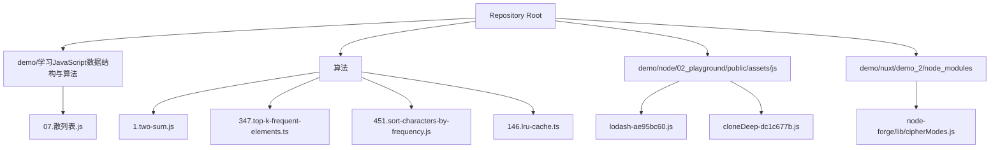
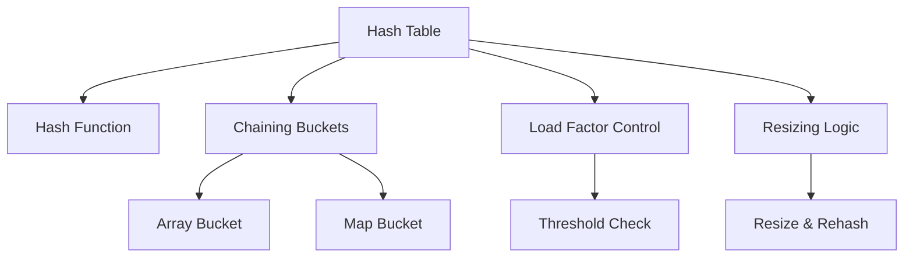
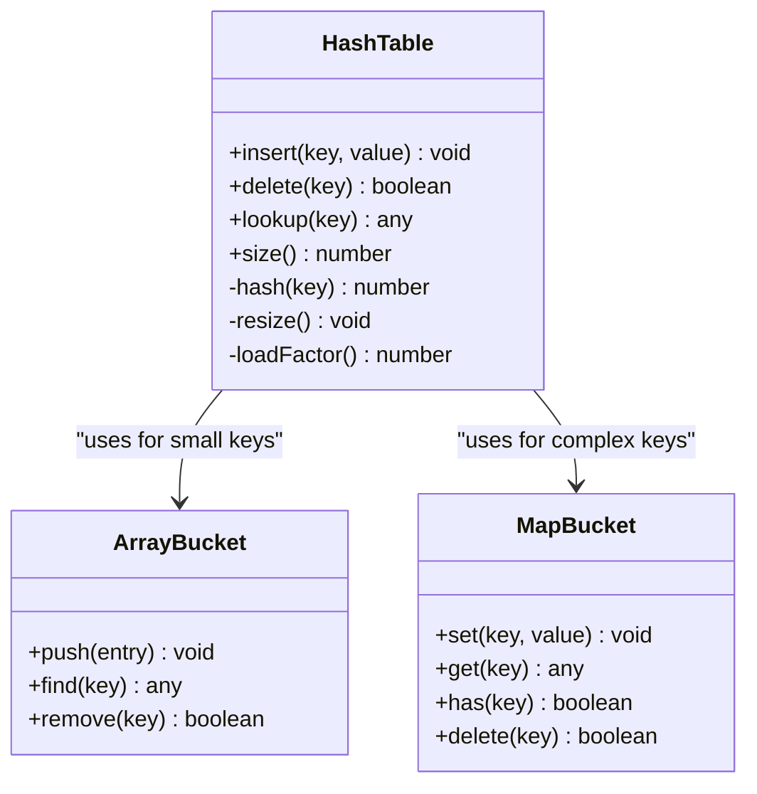
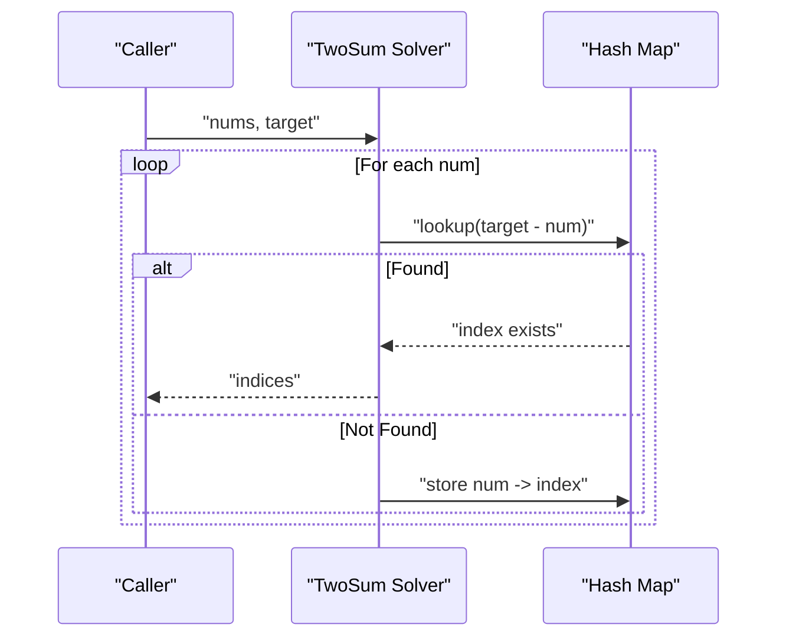
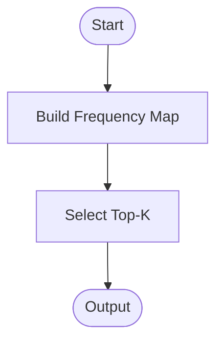
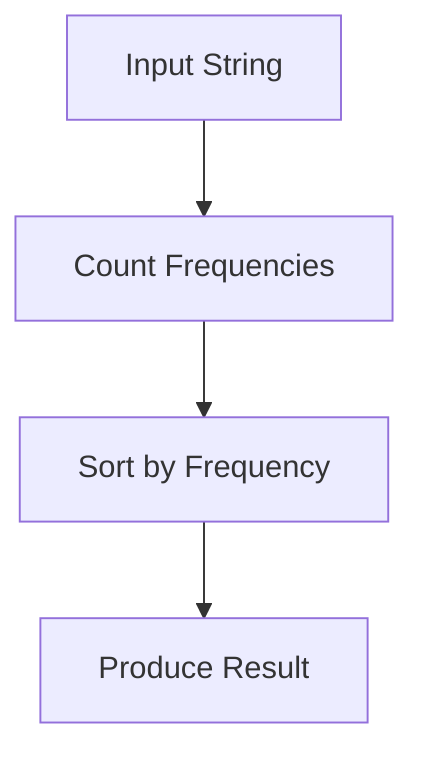
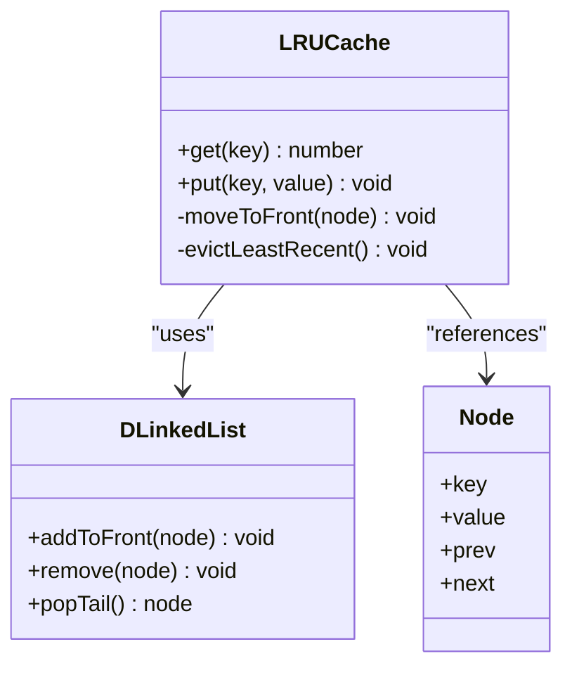
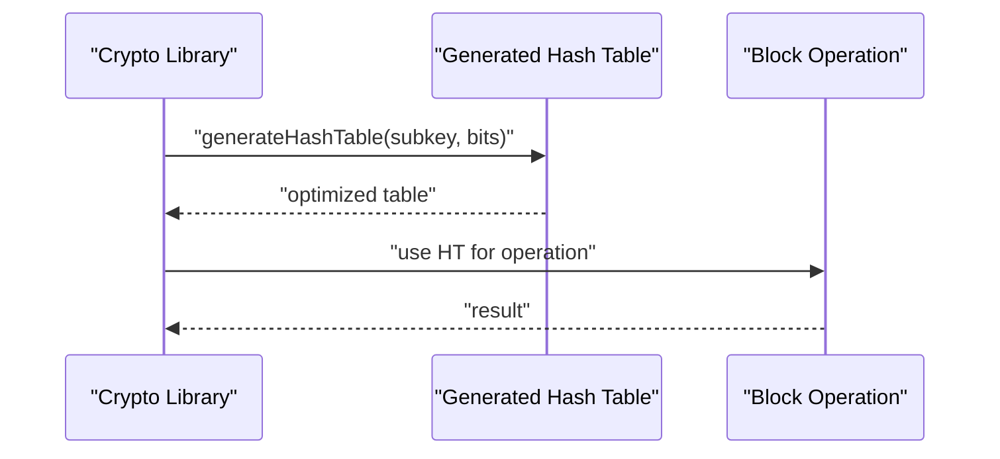
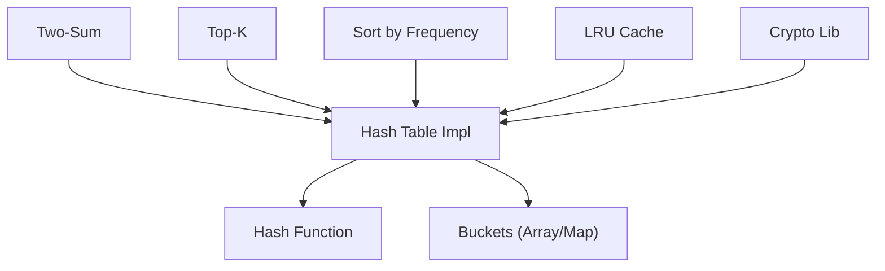

# Hash Tables and Hash Maps

<cite>
**Referenced Files in This Document**
- [07.散列表.js](file://demo/学习JavaScript数据结构与算法/07.散列表.js)
- [lodash-ae95bc60.js](file://demo/node/02_playground/public/assets/js/lodash-ae95bc60.js)
- [cloneDeep-dc1c677b.js](file://demo/node/02_playground/public/assets/js/cloneDeep-dc1c677b.js)
- [1.two-sum.js](file://算法/1.two-sum.js)
- [347.top-k-frequent-elements.ts](file://算法/347.top-k-frequent-elements.ts)
- [451.sort-characters-by-frequency.js](file://算法/451.sort-characters-by-frequency.js)
- [146.lru-cache.ts](file://算法/146.lru-cache.ts)
- [cipherModes.js](file://demo/nuxt/demo_2/node_modules/node-forge/lib/cipherModes.js)
</cite>

## Table of Contents
1. [Introduction](#introduction)
2. [Project Structure](#project-structure)
3. [Core Components](#core-components)
4. [Architecture Overview](#architecture-overview)
5. [Detailed Component Analysis](#detailed-component-analysis)
6. [Dependency Analysis](#dependency-analysis)
7. [Performance Considerations](#performance-considerations)
8. [Troubleshooting Guide](#troubleshooting-guide)
9. [Conclusion](#conclusion)
10. [Appendices](#appendices)

## Introduction
This document provides a comprehensive guide to hash tables and hash maps, focusing on hash functions, collision resolution strategies (chaining and open addressing), dynamic resizing, and load factor management. It synthesizes practical implementations and patterns from the repository’s JavaScript algorithm files and third-party libraries, and connects them to real-world use cases such as frequency counting, two-sum problems, and caching. Advanced topics like perfect hashing, cuckoo hashing, and distributed hash tables are also discussed conceptually.

## Project Structure
The repository includes:
- A foundational hash table implementation in a JavaScript data structures file
- Third-party library utilities that demonstrate hash-based structures and operations
- Algorithm implementations that rely on hash maps for performance-sensitive tasks
- Cryptographic primitives that utilize hash tables for optimized operations

**Diagram sources**
- [07.散列表.js](file://demo/学习JavaScript数据结构与算法/07.散列表.js)
- [1.two-sum.js](file://算法/1.two-sum.js)
- [347.top-k-frequent-elements.ts](file://算法/347.top-k-frequent-elements.ts)
- [451.sort-characters-by-frequency.js](file://算法/451.sort-characters-by-frequency.js)
- [146.lru-cache.ts](file://算法/146.lru-cache.ts)
- [lodash-ae95bc60.js](file://demo/node/02_playground/public/assets/js/lodash-ae95bc60.js)
- [cloneDeep-dc1c677b.js](file://demo/node/02_playground/public/assets/js/cloneDeep-dc1c677b.js)
- [cipherModes.js](file://demo/nuxt/demo_2/node_modules/node-forge/lib/cipherModes.js)

**Section sources**
- [07.散列表.js](file://demo/学习JavaScript数据结构与算法/07.散列表.js)
- [1.two-sum.js](file://算法/1.two-sum.js)
- [347.top-k-frequent-elements.ts](file://算法/347.top-k-frequent-elements.ts)
- [451.sort-characters-by-frequency.js](file://算法/451.sort-characters-by-frequency.js)
- [146.lru-cache.ts](file://算法/146.lru-cache.ts)
- [lodash-ae95bc60.js](file://demo/node/02_playground/public/assets/js/lodash-ae95bc60.js)
- [cloneDeep-dc1c677b.js](file://demo/node/02_playground/public/assets/js/cloneDeep-dc1c677b.js)
- [cipherModes.js](file://demo/nuxt/demo_2/node_modules/node-forge/lib/cipherModes.js)

## Core Components
- Hash table with separate chaining: Implemented via arrays and maps, supporting insert, delete, and lookup operations.
- Load factor management: Dynamic resizing triggered when load factor exceeds thresholds.
- Collision resolution: Chaining using arrays and maps; open addressing is not implemented in the referenced files.
- Practical applications: Frequency counting, complement-based lookups, and cache management.

**Section sources**
- [07.散列表.js](file://demo/学习JavaScript数据结构与算法/07.散列表.js)

## Architecture Overview
The hash table architecture integrates:
- Hash function to compute indices
- Collision resolution via chaining
- Dynamic resizing to maintain low load factors
- Utility operations for insertion, deletion, and lookup

**Diagram sources**
- [07.散列表.js](file://demo/学习JavaScript数据结构与算法/07.散列表.js)

## Detailed Component Analysis

### Hash Table Implementation (Separate Chaining)
This implementation demonstrates:
- Storage using arrays and maps
- Insert, delete, and lookup operations
- Load factor computation and dynamic resizing

**Diagram sources**
- [07.散列表.js](file://demo/学习JavaScript数据结构与算法/07.散列表.js)

**Section sources**
- [07.散列表.js](file://demo/学习JavaScript数据结构与算法/07.散列表.js)

### Algorithmic Applications Using Hash Maps

#### Two-Sum Problem
- Uses a hash map to store visited values and their indices
- Enables O(n) time complexity by checking complement existence in O(1) average time

**Diagram sources**
- [1.two-sum.js](file://算法/1.two-sum.js)

**Section sources**
- [1.two-sum.js](file://算法/1.two-sum.js)

#### Top-K Frequent Elements
- Builds a frequency map, then uses a heap or quickselect to extract top-k elements
- Demonstrates hash map usage for aggregation and retrieval

**Diagram sources**
- [347.top-k-frequent-elements.ts](file://算法/347.top-k-frequent-elements.ts)

**Section sources**
- [347.top-k-frequent-elements.ts](file://算法/347.top-k-frequent-elements.ts)

#### Sort Characters by Frequency
- Counts character frequencies using a hash map
- Sorts entries by frequency for output

**Diagram sources**
- [451.sort-characters-by-frequency.js](file://算法/451.sort-characters-by-frequency.js)

**Section sources**
- [451.sort-characters-by-frequency.js](file://算法/451.sort-characters-by-frequency.js)

#### LRU Cache
- Combines a doubly linked list with a hash map for O(1) operations
- Hash map stores key-to-node mappings for fast access

**Diagram sources**
- [146.lru-cache.ts](file://算法/146.lru-cache.ts)

**Section sources**
- [146.lru-cache.ts](file://算法/146.lru-cache.ts)

### Cryptographic Hash Table Usage
The cryptographic library generates hash tables for optimized block operations, illustrating advanced hash table usage in performance-critical contexts.

**Diagram sources**
- [cipherModes.js](file://demo/nuxt/demo_2/node_modules/node-forge/lib/cipherModes.js)

**Section sources**
- [cipherModes.js](file://demo/nuxt/demo_2/node_modules/node-forge/lib/cipherModes.js)

## Dependency Analysis
- Internal dependencies:
  - Hash table implementation depends on hash functions and bucket structures
  - Algorithm solutions depend on hash maps for performance
- External dependencies:
  - Third-party libraries demonstrate robust hash-based utilities and structures

**Diagram sources**
- [07.散列表.js](file://demo/学习JavaScript数据结构与算法/07.散列表.js)
- [1.two-sum.js](file://算法/1.two-sum.js)
- [347.top-k-frequent-elements.ts](file://算法/347.top-k-frequent-elements.ts)
- [451.sort-characters-by-frequency.js](file://算法/451.sort-characters-by-frequency.js)
- [146.lru-cache.ts](file://算法/146.lru-cache.ts)
- [cipherModes.js](file://demo/nuxt/demo_2/node_modules/node-forge/lib/cipherModes.js)

**Section sources**
- [07.散列表.js](file://demo/学习JavaScript数据结构与算法/07.散列表.js)
- [1.two-sum.js](file://算法/1.two-sum.js)
- [347.top-k-frequent-elements.ts](file://算法/347.top-k-frequent-elements.ts)
- [451.sort-characters-by-frequency.js](file://算法/451.sort-characters-by-frequency.js)
- [146.lru-cache.ts](file://算法/146.lru-cache.ts)
- [cipherModes.js](file://demo/nuxt/demo_2/node_modules/node-forge/lib/cipherModes.js)

## Performance Considerations
- Hash function quality: A good hash distributes keys uniformly to minimize collisions
- Load factor threshold: Resize when load factor exceeds a predefined threshold (e.g., > 0.75)
- Collision resolution cost: Chaining is simple but may degrade under high collision rates
- Memory overhead: Resizing doubles capacity; choose growth factors carefully
- Cache locality: Open addressing can improve cache performance compared to chaining

## Troubleshooting Guide
Common issues and remedies:
- Poor hash distribution leading to clustering:
  - Improve hash function or use a stronger hash
  - Consider rehashing during resize
- Excessive collisions:
  - Monitor load factor and trigger resizing earlier
  - Switch to alternative strategies if necessary
- Memory leaks in caches:
  - Ensure eviction policies (e.g., LRU) are enforced
  - Clear references appropriately

**Section sources**
- [146.lru-cache.ts](file://算法/146.lru-cache.ts)

## Conclusion
Hash tables are fundamental for high-performance data retrieval. This repository demonstrates practical implementations and applications, including chaining-based designs, load factor management, and real-world use cases like two-sum and LRU caching. Advanced topics such as perfect hashing, cuckoo hashing, and distributed hash tables provide directions for further optimization and scalability.

## Appendices

### Practical Examples Index
- Frequency counting: [451.sort-characters-by-frequency.js](file://算法/451.sort-characters-by-frequency.js)
- Two-sum problem: [1.two-sum.js](file://算法/1.two-sum.js)
- Top-K frequent elements: [347.top-k-frequent-elements.ts](file://算法/347.top-k-frequent-elements.ts)
- LRU cache: [146.lru-cache.ts](file://算法/146.lru-cache.ts)
- Hash table foundation: [07.散列表.js](file://demo/学习JavaScript数据结构与算法/07.散列表.js)
- Cryptographic hash table usage: [cipherModes.js](file://demo/nuxt/demo_2/node_modules/node-forge/lib/cipherModes.js)