# Heaps and Priority Queues

<cite>
**Referenced Files in This Document**
- [1046.last-stone-weight.js](file://算法/1046.last-stone-weight.js)
- [1054.distant-barcodes.js](file://算法/1054.distant-barcodes.js)
- [1337.the-k-weakest-rows-in-a-matrix.js](file://算法/1337.the-k-weakest-rows-in-a-matrix.js)
- [23.merge-k-sorted-lists.js](file://算法/23.merge-k-sorted-lists.js)
- [215.kth-largest-element-in-an-array.js](file://算法/215.kth-largest-element-in-an-array.js)
- [703.kth-largest-element-in-a-stream.js](file://算法/703.kth-largest-element-in-a-stream.js)
- [1353.maximum-number-of-events-that-can-be-attended.js](file://算法/1353.maximum-number-of-events-that-can-be-attended.js)
</cite>

## Table of Contents
1. [Introduction](#introduction)
2. [Project Structure](#project-structure)
3. [Core Components](#core-components)
4. [Architecture Overview](#architecture-overview)
5. [Detailed Component Analysis](#detailed-component-analysis)
6. [Dependency Analysis](#dependency-analysis)
7. [Performance Considerations](#performance-considerations)
8. [Troubleshooting Guide](#troubleshooting-guide)
9. [Conclusion](#conclusion)
10. [Appendices](#appendices)

## Introduction
This document explains heap data structures with a focus on max-heaps and min-heaps, covering heap property maintenance, insertion and extraction via heapify algorithms, and practical applications such as priority queues, heap sort, and k-largest/smallest element problems. It also includes real-world scenarios like median finding, merging k sorted arrays, and event scheduling. Finally, it compares heaps to balanced binary search trees (BSTs) in terms of performance and trade-offs.

## Project Structure
The repository includes several JavaScript implementations that demonstrate heap-based solutions:
- Max-heap with sift-up and sift-down for maintaining heap order
- Priority queue built atop a heap for efficient extract-max and insert
- Applications: last stone weight, k-weakest rows, merging k sorted lists, stream k-th largest, and event scheduling

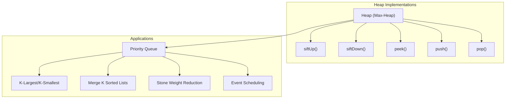

**Diagram sources**
- [1046.last-stone-weight.js:50-146](file://算法/1046.last-stone-weight.js#L50-L146)
- [1054.distant-barcodes.js:63-149](file://算法/1054.distant-barcodes.js#L63-L149)
- [1337.the-k-weakest-rows-in-a-matrix.js:59-150](file://算法/1337.the-k-weakest-rows-in-a-matrix.js#L59-L150)
- [23.merge-k-sorted-lists.js:66-212](file://算法/23.merge-k-sorted-lists.js#L66-L212)

**Section sources**
- [1046.last-stone-weight.js:50-146](file://算法/1046.last-stone-weight.js#L50-L146)
- [1054.distant-barcodes.js:63-149](file://算法/1054.distant-barcodes.js#L63-L149)
- [1337.the-k-weakest-rows-in-a-matrix.js:59-150](file://算法/1337.the-k-weakest-rows-in-a-matrix.js#L59-L150)
- [23.merge-k-sorted-lists.js:66-212](file://算法/23.merge-k-sorted-lists.js#L66-L212)

## Core Components
- Heap (Max-Heap) with array-backed storage
  - Indexing: parent(i) = floor((i - 1) / 2), left child = 2i + 1, right child = 2i + 2
  - Operations:
    - push(val): append to bottom, siftUp to restore heap property
    - pop(): swap root with bottom, pop, siftDown to restore heap property
    - peek(): return root element
    - size(): number of elements
    - isEmpty(): check emptiness
- Priority Queue built on top of the heap
  - Typical min-heap for priority queues; max-heap used here for demonstration
  - Supports enqueue/dequeue with O(log n) cost

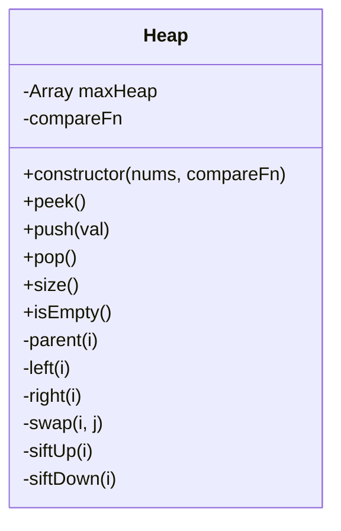

**Diagram sources**
- [1046.last-stone-weight.js:50-146](file://算法/1046.last-stone-weight.js#L50-L146)
- [1054.distant-barcodes.js:63-149](file://算法/1054.distant-barcodes.js#L63-L149)
- [1337.the-k-weakest-rows-in-a-matrix.js:59-150](file://算法/1337.the-k-weakest-rows-in-a-matrix.js#L59-L150)
- [23.merge-k-sorted-lists.js:66-212](file://算法/23.merge-k-sorted-lists.js#L66-L212)

**Section sources**
- [1046.last-stone-weight.js:50-146](file://算法/1046.last-stone-weight.js#L50-L146)
- [1054.distant-barcodes.js:63-149](file://算法/1054.distant-barcodes.js#L63-L149)
- [1337.the-k-weakest-rows-in-a-matrix.js:59-150](file://算法/1337.the-k-weakest-rows-in-a-matrix.js#L59-L150)
- [23.merge-k-sorted-lists.js:66-212](file://算法/23.merge-k-sorted-lists.js#L66-L212)

## Architecture Overview
The heap serves as the foundational data structure for multiple higher-level algorithms:
- Priority queue abstraction around heap operations
- K-selection problems solved by maintaining a small heap of size k
- Streaming k-th largest using a bounded heap
- Event scheduling by ordering by deadlines/endpoints

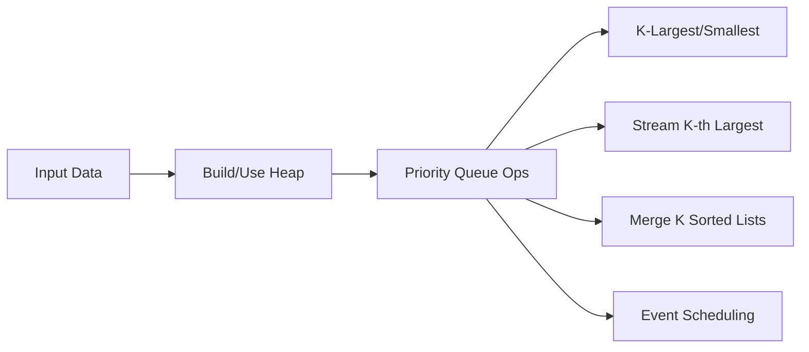

**Diagram sources**
- [703.kth-largest-element-in-a-stream.js:1-75](file://算法/703.kth-largest-element-in-a-stream.js#L1-L75)
- [23.merge-k-sorted-lists.js:23-51](file://算法/23.merge-k-sorted-lists.js#L23-L51)
- [1353.maximum-number-of-events-that-can-be-attended.js:1-37](file://算法/1353.maximum-number-of-events-that-can-be-attended.js#L1-L37)

**Section sources**
- [703.kth-largest-element-in-a-stream.js:1-75](file://算法/703.kth-largest-element-in-a-stream.js#L1-L75)
- [23.merge-k-sorted-lists.js:23-51](file://算法/23.merge-k-sorted-lists.js#L23-L51)
- [1353.maximum-number-of-events-that-can-be-attended.js:1-37](file://算法/1353.maximum-number-of-events-that-can-be-attended.js#L1-L37)

## Detailed Component Analysis

### Heap Property Maintenance and Heapify Algorithms
- Sift-Up (heapify-up): after insertion, compare with parent and swap upward until heap property holds
- Sift-Down (heapify-down): after extraction, swap root with last element, then bubble down by swapping with the better child until heap property holds
- Build Heap: iterate from last non-leaf to root, siftDown each node

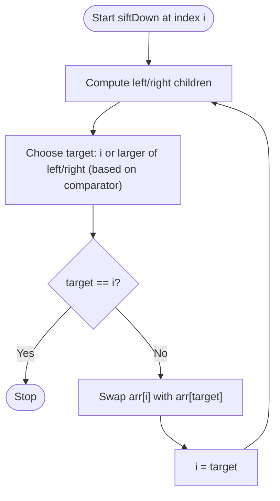

**Diagram sources**
- [1046.last-stone-weight.js:140-195](file://算法/1046.last-stone-weight.js#L140-L195)
- [23.merge-k-sorted-lists.js:170-195](file://算法/23.merge-k-sorted-lists.js#L170-L195)

**Section sources**
- [1046.last-stone-weight.js:127-195](file://算法/1046.last-stone-weight.js#L127-L195)
- [23.merge-k-sorted-lists.js:157-195](file://算法/23.merge-k-sorted-lists.js#L157-L195)

### Priority Queue Implementation Using Heaps
- A priority queue supports:
  - Insert with priority
  - Extract-max (or extract-min for min-heap)
  - Peek at highest priority
- Implemented using heap operations:
  - Insert -> push
  - Extract -> pop
  - Peek -> peek

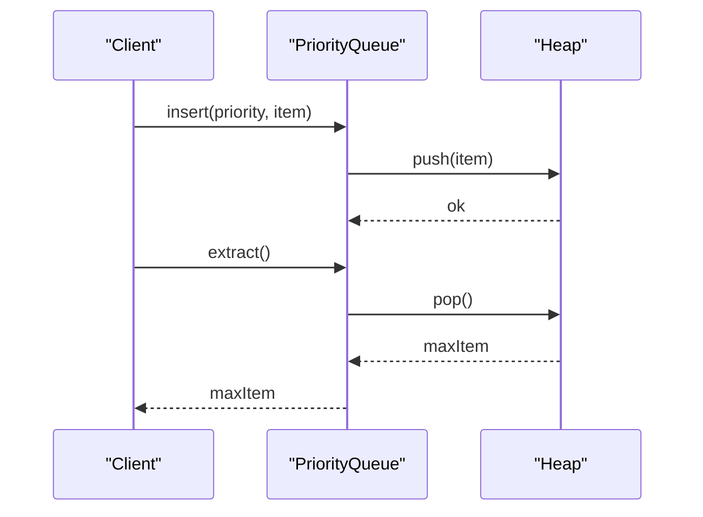

**Diagram sources**
- [1046.last-stone-weight.js:91-118](file://算法/1046.last-stone-weight.js#L91-L118)
- [1054.distant-barcodes.js:117-143](file://算法/1054.distant-barcodes.js#L117-L143)

**Section sources**
- [1046.last-stone-weight.js:91-143](file://算法/1046.last-stone-weight.js#L91-L143)
- [1054.distant-barcodes.js:117-143](file://算法/1054.distant-barcodes.js#L117-L143)

### Heap Sort Algorithm
- Build a max-heap from the array
- Repeatedly extract the maximum (root) and place it at the end
- Restore heap property after each extraction
- Time: O(n log n), Space: O(1) in-place

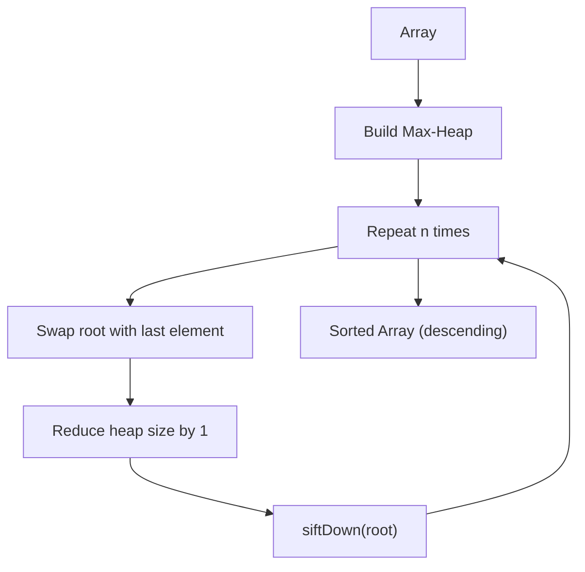

[No sources needed since this diagram shows conceptual workflow, not actual code structure]

### K-Largest/K-Smallest Elements
- Keep a min-heap of size k for “top-k largest” or a max-heap for “top-k smallest”
- For each new element:
  - If heap size < k, push
  - Else if replacement improves the heap, push/pop
- Time: O(n log k), Space: O(k)

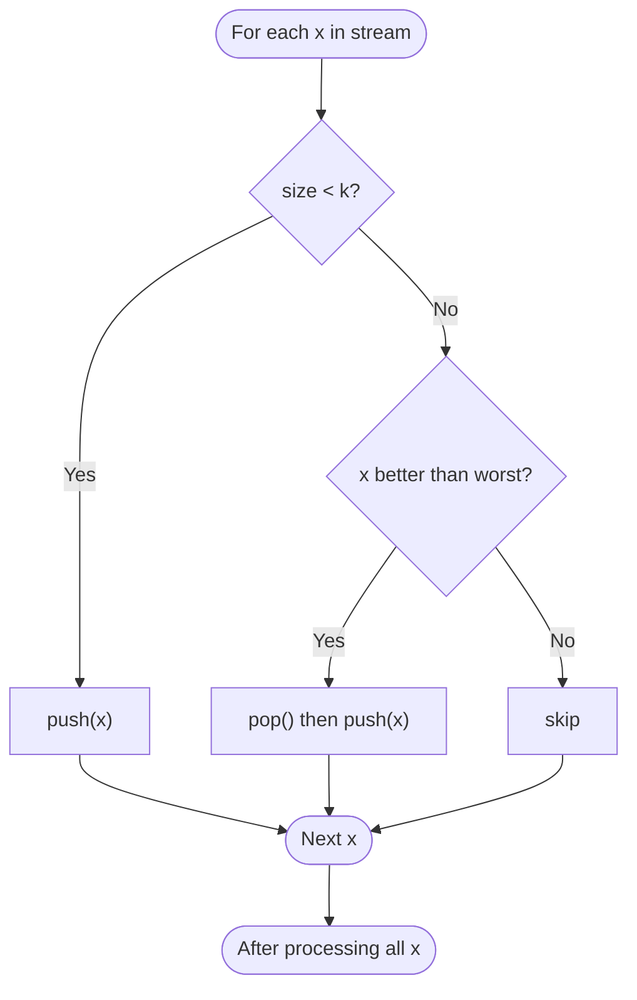

**Diagram sources**
- [703.kth-largest-element-in-a-stream.js:28-52](file://算法/703.kth-largest-element-in-a-stream.js#L28-L52)

**Section sources**
- [703.kth-largest-element-in-a-stream.js:1-75](file://算法/703.kth-largest-element-in-a-stream.js#L1-L75)

### Median Finding (Two Heaps)
- Maintain a max-heap for lower half and a min-heap for upper half
- Balance sizes so that either heaps are equal or max-heap has one extra
- Median is either the max of lower half or average of roots

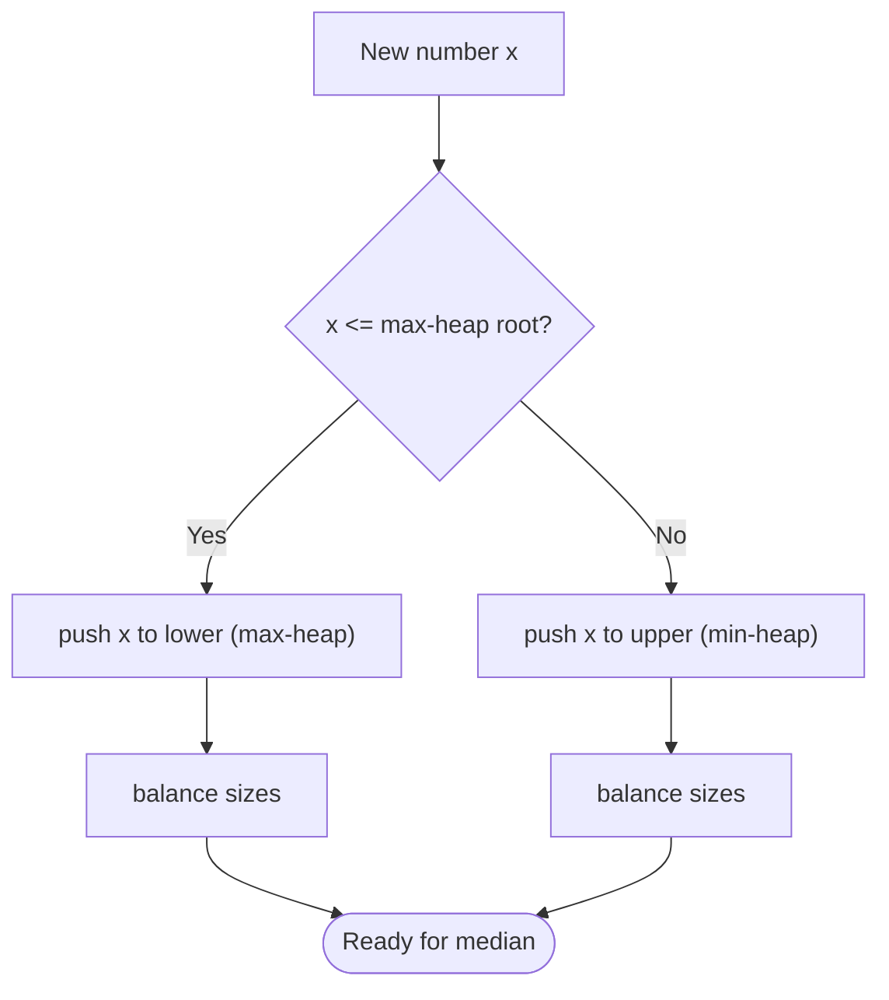

[No sources needed since this diagram shows conceptual workflow, not actual code structure]

### Merge K Sorted Arrays/Lists
- Use a min-heap to track the next smallest candidate from each list
- Initialize heap with the first element from each non-empty list
- Repeat: pop minimum, append to result, push next element from the same list

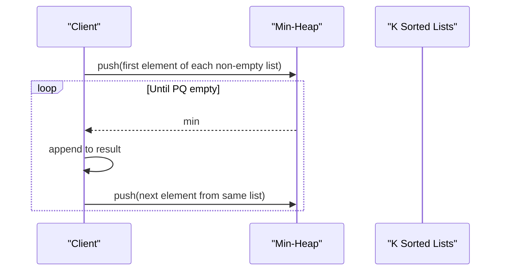

**Diagram sources**
- [23.merge-k-sorted-lists.js:23-51](file://算法/23.merge-k-sorted-lists.js#L23-L51)

**Section sources**
- [23.merge-k-sorted-lists.js:23-51](file://算法/23.merge-k-sorted-lists.js#L23-L51)

### Event Scheduling
- Order events by deadline/end time
- Use a min-heap keyed by end time to greedily pick earliest-ending events first
- Increment current day as events are scheduled

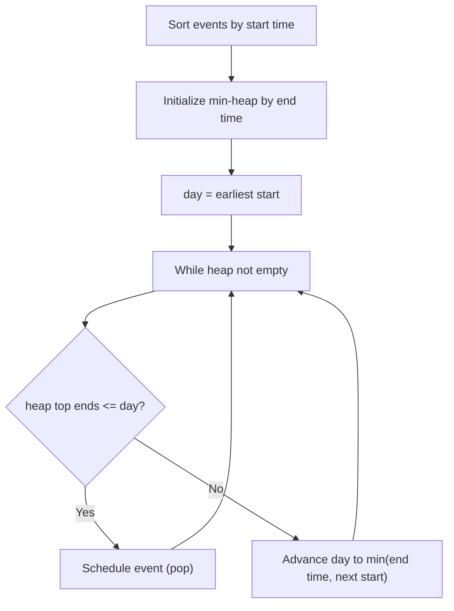

**Diagram sources**
- [1353.maximum-number-of-events-that-can-be-attended.js:16-25](file://算法/1353.maximum-number-of-events-that-can-be-attended.js#L16-L25)

**Section sources**
- [1353.maximum-number-of-events-that-can-be-attended.js:1-37](file://算法/1353.maximum-number-of-events-that-can-be-attended.js#L1-L37)

### Practical Examples from Repository
- Last Stone Weight: repeatedly extract two heaviest stones, smash, and insert the resulting stone until one remains
- K Weakest Rows: maintain a max-heap of row scores to keep the k weakest rows
- Distant Barcodes: arrange barcodes so no two adjacent positions have the same value using frequency counts and heap ordering
- Stream K-th Largest: maintain a min-heap of size k to support online queries

**Section sources**
- [1046.last-stone-weight.js:1-146](file://算法/1046.last-stone-weight.js#L1-L146)
- [1337.the-k-weakest-rows-in-a-matrix.js:1-150](file://算法/1337.the-k-weakest-rows-in-a-matrix.js#L1-L150)
- [1054.distant-barcodes.js:1-149](file://算法/1054.distant-barcodes.js#L1-L149)
- [703.kth-largest-element-in-a-stream.js:1-75](file://算法/703.kth-largest-element-in-a-stream.js#L1-L75)

## Dependency Analysis
- Heap is the core dependency for all heap-based applications
- Priority queue depends on heap operations
- K-selection and streaming k-th largest depend on heap size constraints
- Merge k sorted lists depends on a comparator to choose the next smallest element
- Event scheduling depends on sorting and a min-heap keyed by end time

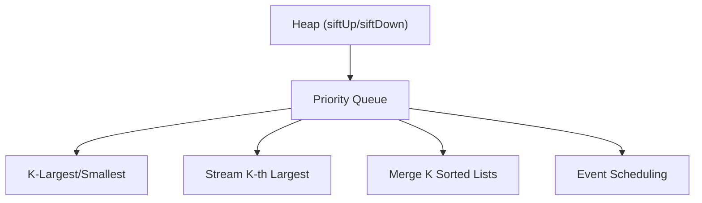

**Diagram sources**
- [1046.last-stone-weight.js:50-146](file://算法/1046.last-stone-weight.js#L50-L146)
- [23.merge-k-sorted-lists.js:66-212](file://算法/23.merge-k-sorted-lists.js#L66-L212)
- [703.kth-largest-element-in-a-stream.js:1-75](file://算法/703.kth-largest-element-in-a-stream.js#L1-L75)
- [1353.maximum-number-of-events-that-can-be-attended.js:1-37](file://算法/1353.maximum-number-of-events-that-can-be-attended.js#L1-L37)

**Section sources**
- [1046.last-stone-weight.js:50-146](file://算法/1046.last-stone-weight.js#L50-L146)
- [23.merge-k-sorted-lists.js:66-212](file://算法/23.merge-k-sorted-lists.js#L66-L212)
- [703.kth-largest-element-in-a-stream.js:1-75](file://算法/703.kth-largest-element-in-a-stream.js#L1-L75)
- [1353.maximum-number-of-events-that-can-be-attended.js:1-37](file://算法/1353.maximum-number-of-events-that-can-be-attended.js#L1-L37)

## Performance Considerations
- Heap operations:
  - push/pop/peek: O(log n)
  - build heap: O(n)
- K-selection:
  - Min-heap of size k: O(n log k)
- Merge k sorted lists:
  - Heap of size k with n total elements: O(n log k)
- Event scheduling:
  - Sorting + heap: O(n log n)
- Memory:
  - Array-backed heap: contiguous memory, cache-friendly
  - Indexing: parent/children formulas enable O(1) pointer-free navigation
- Comparison with balanced BST:
  - Heaps: simpler, O(log n) ops, no balancing rotations
  - BSTs: ordered traversal, range queries, but more complex to maintain balance

[No sources needed since this section provides general guidance]

## Troubleshooting Guide
- Off-by-one errors in heap indices:
  - Verify parent/child formulas and boundary checks
- Comparator misuse:
  - Ensure compareFn aligns with intended heap order (max vs min)
- Heap underflow:
  - Guard pop() when heap is empty
- Memory leaks:
  - Avoid retaining references to removed nodes in external structures

**Section sources**
- [1046.last-stone-weight.js:104-118](file://算法/1046.last-stone-weight.js#L104-L118)
- [23.merge-k-sorted-lists.js:128-148](file://算法/23.merge-k-sorted-lists.js#L128-L148)

## Conclusion
Heaps provide an efficient foundation for priority-driven algorithms. With simple array-backed storage and well-defined heapify procedures, they enable fast insertion, extraction, and maintenance of ordering. The repository demonstrates practical applications ranging from streaming analytics to scheduling and merging sorted sequences. While heaps are straightforward and efficient, balanced BSTs offer richer operations like ordered iteration and range queries, making the choice dependent on problem requirements.

## Appendices
- Additional k-largest/smallest references:
  - [215.kth-largest-element-in-an-array.js:1-53](file://算法/215.kth-largest-element-in-an-array.js#L1-L53)

**Section sources**
- [215.kth-largest-element-in-an-array.js:1-53](file://算法/215.kth-largest-element-in-an-array.js#L1-L53)