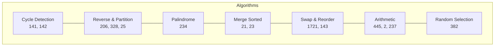
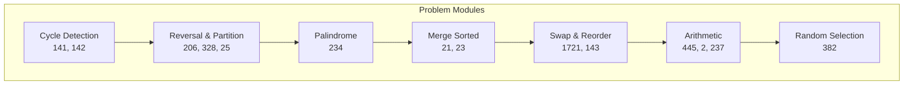
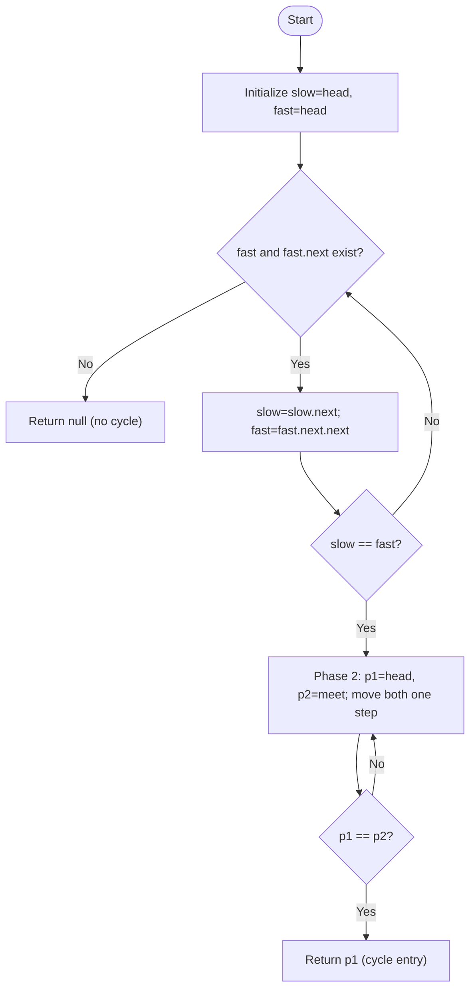
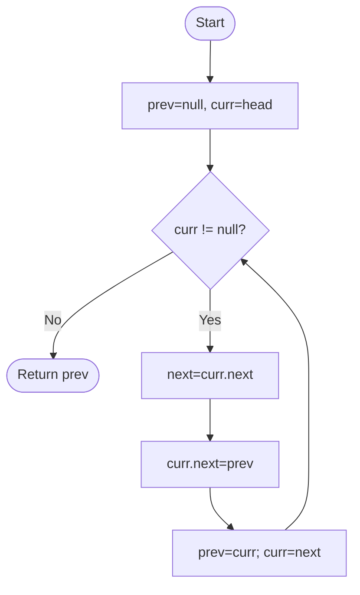
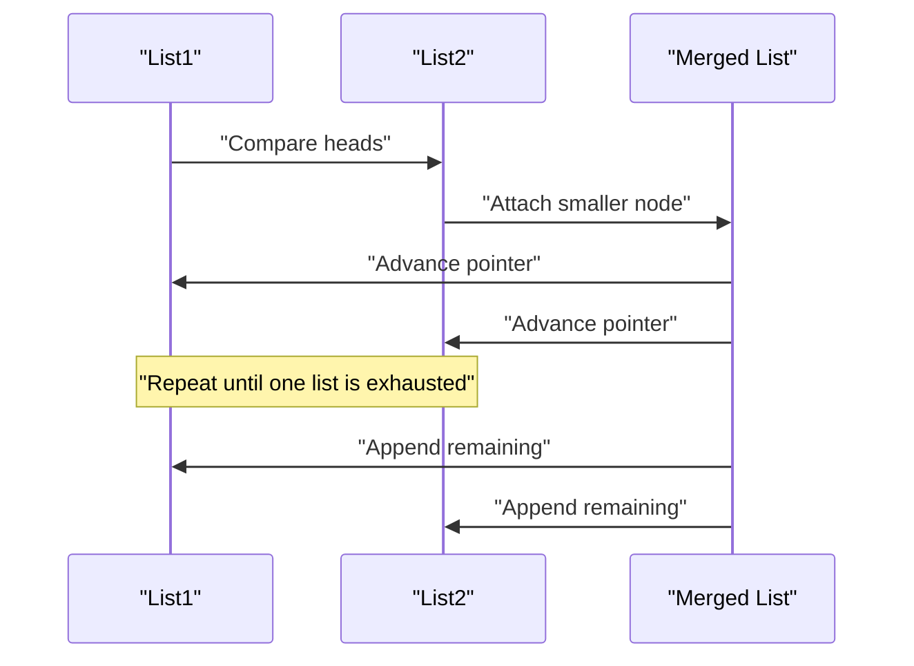
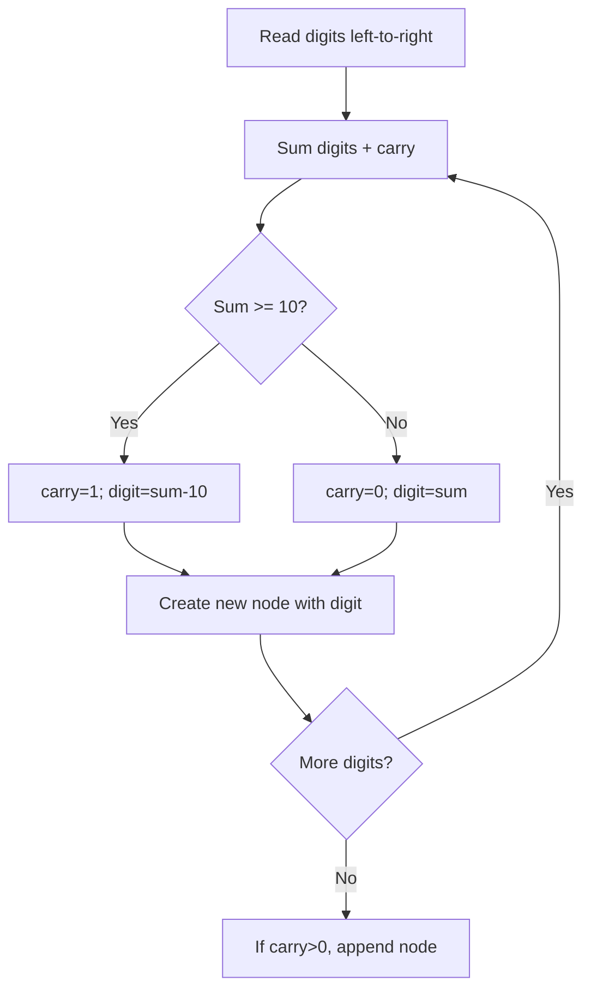
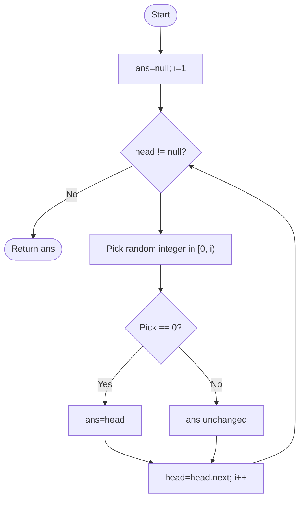
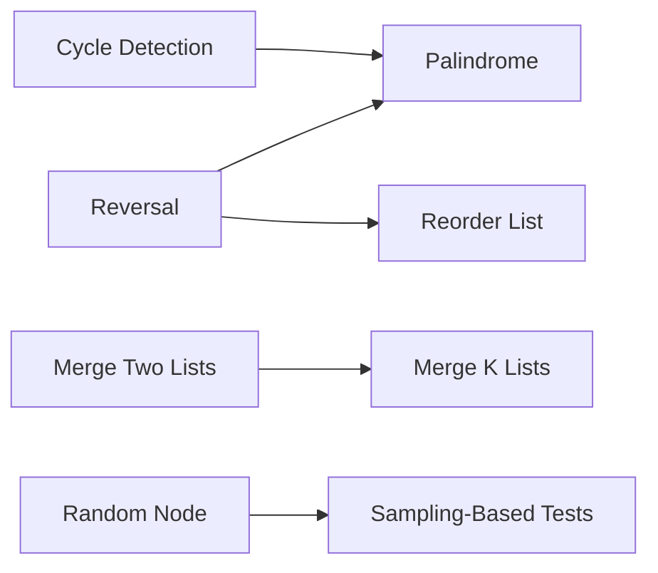

# Linked Lists

<cite>
**Referenced Files in This Document**
- [141.linked-list-cycle.ts](file://算法/141.linked-list-cycle.ts)
- [142.linked-list-cycle-ii.ts](file://算法/142.linked-list-cycle-ii.ts)
- [206.reverse-linked-list.js](file://算法/206.reverse-linked-list.js)
- [234.palindrome-linked-list.js](file://算法/234.palindrome-linked-list.js)
- [23.merge-k-sorted-lists.js](file://算法/23.merge-k-sorted-lists.js)
- [21.merge-two-sorted-lists.js](file://算法/21.merge-two-sorted-lists.js)
- [160.intersection-of-two-linked-lists.ts](file://算法/160.intersection-of-two-linked-lists.ts)
- [876.middle-of-the-linked-list.js](file://算法/876.middle-of-the-linked-list.js)
- [19.remove-nth-node-from-end-of-list.js](file://算法/19.remove-nth-node-from-end-of-list.js)
- [203.remove-linked-list-elements.js](file://算法/203.remove-linked-list-elements.js)
- [328.odd-even-linked-list.js](file://算法/328.odd-even-linked-list.js)
- [148.sort-list.ts](file://算法/148.sort-list.ts)
- [147.insertion-sort-list.ts](file://算法/147.insertion-sort-list.ts)
- [25.reverse-nodes-in-k-group.js](file://算法/25.reverse-nodes-in-k-group.js)
- [237.delete-node-in-a-linked-list.js](file://算法/237.delete-node-in-a-linked-list.js)
- [138.copy-list-with-random-pointer.ts](file://算法/138.copy-list-with-random-pointer.ts)
- [382.linked-list-random-node.js](file://算法/382.linked-list-random-node.js)
- [445.add-two-numbers-ii.js](file://算法/445.add-two-numbers-ii.js)
- [1171.remove-zero-sum-consecutive-nodes-from-linked-list.js](file://算法/1171.remove-zero-sum-consecutive-nodes-from-linked-list.js)
- [1019.next-greater-node-in-linked-list.js](file://算法/1019.next-greater-node-in-linked-list.js)
- [143.reorder-list.ts](file://算法/143.reorder-list.ts)
- [1721.swapping-nodes-in-a-linked-list.js](file://算法/1721.swapping-nodes-in-a-linked-list.js)
- [1376.time-needed-to-inform-all-employees.js](file://算法/1376.time-needed-to-inform-all-employees.js)
- [146.lru-cache.ts](file://算法/146.lru-cache.ts)
- [1410.html-entity-parser.js](file://算法/1410.html-entity-parser.js)
- [1413.minimum-value-to-get-positive-step-by-step-sum.js](file://算法/1413.minimum-value-to-get-positive-step-by-step-sum.js)
- [1414.find-the-minimum-number-of-fibonacci-numbers-whose-sum-is-k.js](file://算法/1414.find-the-minimum-number-of-fibonacci-numbers-whose-sum-is-k.js)
- [1415.the-k-th-lexicographical-string-of-all-happy-strings-of-length-n.js](file://算法/1415.the-k-th-lexicographical-string-of-all-happy-strings-of-length-n.js)
- [1417.reformat-the-string.js](file://算法/1417.reformat-the-string.js)
- [1419.minimum-number-of-frogs-croaking.js](file://算法/1419.minimum-number-of-frogs-croaking.js)
- [1422.maximum-score-after-splitting-a-string.js](file://算法/1422.maximum-score-after-splitting-a-string.js)
- [1423.maximum-points-you-can-obtain-from-cards.js](file://算法/1423.maximum-points-you-can-obtain-from-cards.js)
- [1424.diagonal-traverse-ii.js](file://算法/1424.diagonal-traverse-ii.js)
- [1431.kids-with-the-greatest-number-of-candies.js](file://算法/1431.kids-with-the-greatest-number-of-candies.js)
- [1432.max-difference-you-can-get-from-changing-an-integer.js](file://算法/1432.max-difference-you-can-get-from-changing-an-integer.js)
- [1433.check-if-a-string-can-break-another-string.js](file://算法/1433.check-if-a-string-can-break-another-string.js)
- [1436.destination-city.js](file://算法/1436.destination-city.js)
- [1437.check-if-all-1-s-are-at-least-length-k-places-away.js](file://算法/1437.check-if-all-1-s-are-at-least-length-k-places-away.js)
- [1438.longest-continuous-subarray-with-absolute-diff-less-than-or-equal-to-limit.js](file://算法/1438.longest-continuous-subarray-with-absolute-diff-less-than-or-equal-to-limit.js)
- [1441.build-an-array-with-stack-operations.js](file://算法/1441.build-an-array-with-stack-operations.js)
- [1446.consecutive-characters.js](file://算法/1446.consecutive-characters.js)
- [1447.simplified-fractions.js](file://算法/1447.simplified-fractions.js)
- [1448.count-good-nodes-in-binary-tree.js](file://算法/1448.count-good-nodes-in-binary-tree.js)
- [145.binary-tree-postorder-traversal.js](file://算法/145.binary-tree-postorder-traversal.js)
- [1450.number-of-students-doing-homework-at-a-given-time.js](file://算法/1450.number-of-students-doing-homework-at-a-given-time.js)
- [1451.rearrange-words-in-a-sentence.js](file://算法/1451.rearrange-words-in-a-sentence.js)
- [1452.people-whose-list-of-favorite-companies-is-not-a-subset-of-another-list.js](file://算法/1452.people-whose-list-of-favorite-companies-is-not-a-subset-of-another-list.js)
- [1455.check-if-a-word-occurs-as-a-prefix-of-any-word-in-a-sentence.js](file://算法/1455.check-if-a-word-occurs-as-a-prefix-of-any-word-in-a-sentence.js)
- [1456.maximum-number-of-vowels-in-a-substring-of-given-length.js](file://算法/1456.maximum-number-of-vowels-in-a-substring-of-given-length.js)
- [1457.pseudo-palindromic-paths-in-a-binary-tree.js](file://算法/1457.pseudo-palindromic-paths-in-a-binary-tree.js)
- [1460.make-two-arrays-equal-by-reversing-subarrays.js](file://算法/1460.make-two-arrays-equal-by-reversing-subarrays.js)
- [1464.maximum-product-of-two-elements-in-an-array.js](file://算法/1464.maximum-product-of-two-elements-in-an-array.js)
- [1470.shuffle-the-array.js](file://算法/1470.shuffle-the-array.js)
- [1480.running-sum-of-1-d-array.js](file://算法/1480.running-sum-of-1-d-array.js)
- [1486.xor-operation-in-an-array.js](file://算法/1486.xor-operation-in-an-array.js)
- [1491.average-salary-excluding-the-minimum-and-maximum-salary.js](file://算法/1491.average-salary-excluding-the-minimum-and-maximum-salary.js)
- [1497.check-if-array-pairs-are-divisible-by-k.js](file://算法/1497.check-if-array-pairs-are-divisible-by-k.js)
- [150.evaluate-reverse-polish-notation.ts](file://算法/150.evaluate-reverse-polish-notation.ts)
- [1502.can-make-arithmetic-progression-from-sequence.js](file://算法/1502.can-make-arithmetic-progression-from-sequence.js)
- [1507.reformat-date.js](file://算法/1507.reformat-date.js)
- [1509.minimum-difference-between-largest-and-smallest-value-in-three-moves.js](file://算法/1509.minimum-difference-between-largest-and-smallest-value-in-three-moves.js)
- [151.reverse-words-in-a-string.ts](file://算法/151.reverse-words-in-a-string.ts)
- [1512.number-of-good-pairs.js](file://算法/1512.number-of-good-pairs.js)
- [1513.number-of-substrings-with-only-1-s.js](file://算法/1513.number-of-substrings-with-only-1-s.js)
- [1519.number-of-nodes-in-the-sub-tree-with-the-same-label.js](file://算法/1519.number-of-nodes-in-the-sub-tree-with-the-same-label.js)
- [1523.count-odd-numbers-in-an-interval-range.js](file://算法/1523.count-odd-numbers-in-an-interval-range.js)
- [1524.number-of-sub-arrays-with-odd-sum.js](file://算法/1524.number-of-sub-arrays-with-odd-sum.js)
- [1525.number-of-good-ways-to-split-a-string.js](file://算法/1525.number-of-good-ways-to-split-a-string.js)
- [1529.minimum-suffix-flips.js](file://算法/1529.minimum-suffix-flips.js)
- [153.find-minimum-in-rotated-sorted-array.js](file://算法/153.find-minimum-in-rotated-sorted-array.js)
- [1535.find-the-winner-of-an-array-game.js](file://算法/1535.find-the-winner-of-an-array-game.js)
- [154.find-minimum-in-rotated-sorted-array-ii.js](file://算法/154.find-minimum-in-rotated-sorted-array-ii.js)
- [1540.can-convert-string-in-k-moves.js](file://算法/1540.can-convert-string-in-k-moves.js)
- [1541.minimum-insertions-to-balance-a-parentheses-string.js](file://算法/1541.minimum-insertions-to-balance-a-parentheses-string.js)
- [1546.maximum-number-of-non-overlapping-subarrays-with-sum-equals-target.js](file://算法/1546.maximum-number-of-non-overlapping-subarrays-with-sum-equals-target.js)
- [155.min-stack.ts](file://算法/155.min-stack.ts)
- [1550.three-consecutive-odds.js](file://算法/1550.three-consecutive-odds.js)
- [1551.minimum-operations-to-make-array-equal.js](file://算法/1551.minimum-operations-to-make-array-equal.js)
- [1557.minimum-number-of-vertices-to-reach-all-nodes.js](file://算法/1557.minimum-number-of-vertexes-to-reach-all-nodes.js)
- [1558.minimum-numbers-of-function-calls-to-make-target-array.js](file://算法/1558.minimum-numbers-of-function-calls-to-make-target-array.js)
- [1559.detect-cycles-in-2-d-grid.js](file://算法/1559.detect-cycles-in-2-d-grid.js)
- [1561.maximum-number-of-coins-you-can-get.js](file://算法/1561.maximum-number-of-coins-you-can-get.js)
- [1562.find-latest-group-of-size-m.js](file://算法/1562.find-latest-group-of-size-m.js)
- [1567.maximum-length-of-subarray-with-positive-product.js](file://算法/1567.maximum-length-of-subarray-with-positive-product.js)
- [1573.number-of-ways-to-split-a-string.js](file://算法/1573.number-of-ways-to-split-a-string.js)
- [1577.number-of-ways-where-square-of-number-is-equal-to-product-of-two-numbers.js](file://算法/1577.number-of-ways-where-square-of-number-is-equal-to-product-of-two-numbers.js)
- [1578.minimum-time-to-make-rope-colorful.js](file://算法/1578.minimum-time-to-make-rope-colorful.js)
- [1589.maximum-sum-obtained-of-any-permutation.js](file://算法/1589.maximum-sum-obtained-of-any-permutation.js)
- [16.3-sum.js](file://算法/16.3-sum.js)
- [160.intersection-of-two-linked-lists.ts](file://算法/160.intersection-of-two-linked-lists.ts)
- [1619.mean-of-array-after-removing-some-elements.js](file://算法/1619.mean-of-array-after-removing-some-elements.js)
- [162.find-peak-element.ts](file://算法/162.find-peak-element.ts)
- [165.compare-version-numbers.ts](file://算法/165.compare-version-numbers.ts)
- [166.fraction-to-recurring-decimal.ts](file://算法/166.fraction-to-recurring-decimal.ts)
- [167.two-sum-ii-input-array-is-sorted.ts](file://算法/167.two-sum-ii-input-array-is-sorted.ts)
- [168.excel-sheet-column-title.js](file://算法/168.excel-sheet-column-title.js)
- [169.majority-element.ts](file://算法/169.majority-element.ts)
- [17.letter-combinations-of-a-phone-number.js](file://算法/17.letter-combinations-of-a-phone-linked-lists.js)
- [1721.swapping-nodes-in-a-linked-list.js](file://算法/1721.swapping-nodes-in-a-linked-list.js)
- [1726.tuple-with-same-product.js](file://算法/1726.tuple-with-same-product.js)
- [174.dungeon-game.js](file://算法/174.dungeon-game.js)
- [179.largest-number.js](file://算法/179.largest-number.js)
- [179.largest-number.ts](file://算法/179.largest-number.ts)
- [18.4-sum.js](file://算法/18.4-sum.js)
- [187.repeated-dna-sequences.ts](file://算法/187.repeated-dna-sequences.ts)
- [189.rotate-array.ts](file://算法/189.rotate-array.ts)
- [19.remove-nth-node-from-end-of-list.js](file://算法/19.remove-nth-node-from-end-of-list.js)
- [190.reverse-bits.ts](file://算法/190.reverse-bits.ts)
- [1935.maximum-number-of-words-you-can-type.js](file://算法/1935.maximum-number-of-words-you-can-type.js)
- [1957.delete-characters-to-make-fancy-string.js](file://算法/1957.delete-characters-to-make-fancy-string.js)
- [198.house-robber.ts](file://算法/198.house-robber.ts)
- [199.binary-tree-right-side-view.js](file://算法/199.binary-tree-right-side-view.js)
- [2.add-two-numbers.js](file://算法/2.add-two-numbers.js)
- [20.valid-parentheses.js](file://算法/20.valid-parentheses.js)
- [200.number-of-islands.ts](file://算法/200.number-of-islands.ts)
- [202.happy-number.js](file://算法/202.happy-number.js)
- [203.remove-linked-list-elements.js](file://算法/203.remove-linked-list-elements.js)
- [204.count-primes.ts](file://算法/204.count-primes.ts)
- [205.isomorphic-strings.js](file://算法/205.isomorphic-strings.js)
- [206.reverse-linked-list.js](file://算法/206.reverse-linked-list.js)
- [207.course-schedule.js](file://算法/207.course-schedule.js)
- [207.course-schedule.ts](file://算法/207.course-schedule.ts)
- [2079.watering-plants.js](file://算法/2079.watering-plants.js)
- [208.implement-trie-prefix-tree.ts](file://算法/208.implement-trie-prefix-tree.ts)
- [2080.range-frequency-queries.js](file://算法/2080.range-frequency-queries.js)
- [209.minimum-size-subarray-sum.js](file://算法/209.minimum-size-subarray-sum.js)
- [21.merge-two-sorted-lists.js](file://算法/21.merge-two-sorted-lists.js)
- [210.course-schedule-ii.js](file://算法/210.course-schedule-ii.js)
- [211.design-add-and-search-words-data-structure.js](file://算法/211.design-add-and-search-words-data-structure.js)
- [212.word-search-ii.js](file://算法/212.word-search-ii.js)
- [213.house-robber-ii.js](file://算法/213.house-robber-ii.js)
- [215.kth-largest-element-in-an-array.js](file://算法/215.kth-largest-element-in-an-array.js)
- [215.kth-largest-element-in-an-array.ts](file://算法/215.kth-largest-element-in-an-array.ts)
- [216.combination-sum-iii.js](file://算法/216.combination-sum-iii.js)
- [217.contains-duplicate.js](file://算法/217.contains-duplicate.js)
- [219.contains-duplicate-ii.js](file://算法/219.contains-duplicate-ii.js)
- [2191.sort-the-jumbled-numbers.js](file://算法/2191.sort-the-jumbled-numbers.js)
- [22.generate-parentheses.js](file://算法/22.generate-parentheses.js)
- [2201.count-artifacts-that-can-be-extracted.js](file://算法/2201.count-artifacts-that-can-be-extracted.js)
- [2202.maximize-the-topmost-element-after-k-moves.js](file://算法/2202.maximize-the-topmost-element-after-k-moves.js)
- [221.maximal-square.js](file://算法/221.maximal-square.js)
- [2215.find-the-difference-of-two-arrays.js](file://算法/2215.find-the-difference-of-two-arrays.js)
- [2216.minimum-deletions-to-make-array-beautiful.js](file://算法/2216.minimum-deletions-to-make-array-beautiful.js)
- [222.count-complete-tree-nodes.js](file://算法/222.count-complete-tree-nodes.js)
- [2225.find-players-with-zero-or-one-losses.js](file://算法/2225.find-players-with-zero-or-one-losses.js)
- [223.rectangle-area.js](file://算法/223.rectangle-area.js)
- [224.basic-calculator.js](file://算法/224.basic-calculator.js)
- [226.invert-binary-tree.js](file://算法/226.invert-binary-tree.js)
- [2269.find-the-k-beauty-of-a-number.js](file://算法/2269.find-the-k-beauty-of-a-number.js)
- [227.basic-calculator-ii.js](file://算法/227.basic-calculator-ii.js)
- [2273.find-resultant-array-after-removing-anagrams.js](file://算法/2273.find-resultant-array-after-removing-anagrams.js)
- [228.summary-ranges.js](file://算法/228.summary-ranges.js)
- [229.majority-element-ii.js](file://算法/229.majority-element-ii.js)
- [23.merge-k-sorted-lists.js](file://算法/23.merge-k-sorted-lists.js)
- [2303.calculate-amount-paid-in-taxes.js](file://算法/2303.calculate-amount-paid-in-taxes.js)
- [2309.greatest-english-letter-in-upper-and-lower-case.js](file://算法/2309.greatest-english-letter-in-upper-and-lower-case.js)
- [231.power-of-two.js](file://算法/231.power-of-two.js)
- [2310.sum-of-numbers-with-units-digit-k.js](file://算法/2310.sum-of-numbers-with-units-digit-k.js)
- [233.number-of-digit-one.js](file://算法/233.number-of-digit-one.js)
- [234.palindrome-linked-list.js](file://算法/234.palindrome-linked-list.js)
- [235.lowest-common-ancestor-of-a-binary-search-tree.js](file://算法/235.lowest-common-ancestor-of-a-binary-search-tree.js)
- [236.lowest-common-ancestor-of-a-binary-tree.js](file://算法/236.lowest-common-ancestor-of-a-binary-tree.js)
- [237.delete-node-in-a-linked-list.js](file://算法/237.delete-node-in-a-linked-list.js)
- [238.product-of-array-except-self.js](file://算法/238.product-of-array-except-self.js)
- [239.sliding-window-maximum.js](file://算法/239.sliding-window-maximum.js)
- [24.swap-nodes-in-pairs.js](file://算法/24.swap-nodes-in-pairs.js)
- [240.search-a-2-d-matrix-ii.ts](file://算法/240.search-a-2-d-matrix-ii.ts)
- [25.reverse-nodes-in-k-group.js](file://算法/25.reverse-nodes-in-k-group.js)
- [26.remove-duplicates-from-sorted-array.js](file://算法/26.remove-duplicates-from-sorted-array.js)
- [264.ugly-number-ii.js](file://算法/264.ugly-number-ii.js)
- [27.remove-element.js](file://算法/27.remove-element.js)
- [274.h-index.js](file://算法/274.h-index.js)
- [275.h-index-ii.js](file://算法/275.h-index-ii.js)
- [278.first-bad-version.js](file://算法/278.first-bad-version.js)
- [28.find-the-index-of-the-first-occurrence-in-a-string.js](file://算法/28.find-the-index-of-the-first-occurrence-in-a-string.js)
- [282.expression-add-operators.js](file://算法/282.expression-add-operators.js)
- [283.move-zeroes.js](file://算法/283.move-zeroes.js)
- [29.divide-two-integers.js](file://算法/29.divide-two-integers.js)
- [290.word-pattern.js](file://算法/290.word-pattern.js)
- [292.nim-game.js](file://算法/292.nim-game.js)
- [297.serialize-and-deserialize-binary-tree.js](file://算法/297.serialize-and-deserialize-binary-tree.js)
- [299.bulls-and-cows.js](file://算法/299.bulls-and-cows.js)
- [3.longest-substring-without-repeating-characters.js](file://算法/3.longest-substring-without-repeating-characters.js)
- [30.substring-with-concatenation-of-all-words.js](file://算法/30.substring-with-concatenation-of-all-words.js)
- [300.longest-increasing-subsequence.js](file://算法/300.longest-increasing-subsequence.js)
- [303.range-sum-query-immutable.js](file://算法/303.range-sum-query-immutable.js)
- [304.range-sum-query-2-d-immutable.js](file://算法/304.range-sum-query-2-d-immutable.js)
- [306.additive-number.js](file://算法/306.additive-number.js)
- [307.range-sum-query-mutable.js](file://算法/307.range-sum-query-mutable.js)
- [310.minimum-height-trees.js](file://算法/310.minimum-height-trees.js)
- [313.super-ugly-number.js](file://算法/313.super-ugly-number.js)
- [316.remove-duplicate-letters.js](file://算法/316.remove-duplicate-letters.js)
- [319.bulb-switcher.js](file://算法/319.bulb-switcher.js)
- [32.longest-valid-parentheses.js](file://算法/32.longest-valid-parentheses.js)
- [322.coin-change.js](file://算法/322.coin-change.js)
- [324.wiggle-sort-ii.ts](file://算法/324.wiggle-sort-ii.ts)
- [326.power-of-three.js](file://算法/326.power-of-three.js)
- [328.odd-even-linked-list.js](file://算法/328.odd-even-linked-list.js)
- [33.search-in-rotated-sorted-array.js](file://算法/33.search-in-rotated-sorted-array.js)
- [330.patching-array.js](file://算法/330.patching-array.js)
- [331.verify-preorder-serialization-of-a-binary-tree.js](file://算法/331.verify-preorder-serialization-of-a-binary-tree.js)
- [332.reconstruct-itinerary.js](file://算法/332.reconstruct-itinerary.js)
- [334.increasing-triplet-subsequence.js](file://算法/334.increasing-triplet-subsequence.js)
- [335.self-crossing.js](file://算法/335.self-crossing.js)
- [337.house-robber-iii.js](file://算法/337.house-robber-iii.js)
- [34.find-first-and-last-position-of-element-in-sorted-array.js](file://算法/34.find-first-and-last-position-of-element-in-sorted-array.js)
- [341.flatten-nested-list-iterator.js](file://算法/341.flatten-nested-list-iterator.js)
- [342.power-of-four.js](file://算法/342.power-of-four.js)
- [343.integer-break.js](file://算法/343.integer-break.js)
- [344.reverse-string.js](file://算法/344.reverse-string.js)
- [345.reverse-vowels-of-a-string.js](file://算法/345.reverse-vowels-of-a-string.js)
- [347.top-k-frequent-elements.ts](file://算法/347.top-k-frequent-elements.ts)
- [349.intersection-of-two-arrays.js](file://算法/349.intersection-of-two-arrays.js)
- [35.search-insert-position.js](file://算法/35.search-insert-position.js)
- [350.intersection-of-two-arrays-ii.js](file://算法/350.intersection-of-two-arrays-ii.js)
- [355.design-twitter.js](file://算法/355.design-twitter.js)
- [357.count-numbers-with-unique-digits.js](file://算法/357.count-numbers-with-unique-digits.js)
- [36.valid-sudoku.js](file://算法/36.valid-sudoku.js)
- [367.valid-perfect-square.ts](file://算法/367.valid-perfect-square.ts)
- [368.largest-divisible-subset.js](file://算法/368.largest-divisible-subset.js)
- [372.super-pow.js](file://算法/372.super-pow.js)
- [372.super-pow.ts](file://算法/372.super-pow.ts)
- [373.find-k-pairs-with-smallest-sums.js](file://算法/373.find-k-pairs-with-smallest-sums.js)
- [374.guess-number-higher-or-lower.js](file://算法/374.guess-number-higher-or-lower.js)
- [375.guess-number-higher-or-lower-ii.js](file://算法/375.guess-number-higher-or-lower-ii.js)
- [376.wiggle-subsequence.js](file://算法/376.wiggle-subsequence.js)
- [377.combination-sum-iv.js](file://算法/377.combination-sum-iv.js)
- [378.kth-smallest-element-in-a-sorted-matrix.js](file://算法/378.kth-smallest-element-in-a-sorted-matrix.js)
- [38.count-and-say.js](file://算法/38.count-and-say.js)
- [380.insert-delete-get-random-o-1.js](file://算法/380.insert-delete-get-random-o-1.js)
- [382.linked-list-random-node.js](file://算法/382.linked-list-random-node.js)
- [383.ransom-note.js](file://算法/383.ransom-note.js)
- [385.mini-parser.js](file://算法/385.mini-parser.js)
- [386.lexicographical-numbers.js](file://算法/386.lexicographical-numbers.js)
- [387.first-unique-character-in-a-string.js](file://算法/387.first-unique-character-in-a-string.js)
- [388.longest-absolute-file-path.js](file://算法/388.longest-absolute-file-path.js)
- [389.find-the-difference.js](file://算法/389.find-the-difference.js)
- [39.combination-sum.js](file://算法/39.combination-sum.js)
- [390.elimination-game.js](file://算法/390.elimination-game.js)
- [394.decode-string.js](file://算法/394.decode-string.js)
- [395.longest-substring-with-at-least-k-repeating-characters.ts](file://算法/395.longest-substring-with-at-least-k-repeating-characters.ts)
- [396.rotate-function.js](file://算法/396.rotate-function.js)
- [398.random-pick-index.js](file://算法/398.random-pick-index.js)
- [399.evaluate-division.js](file://算法/399.evaluate-division.js)
- [40.combination-sum-ii.js](file://算法/40.combination-sum-ii.js)
- [400.nth-digit.js](file://算法/400.nth-digit.js)
- [402.remove-k-digits.js](file://算法/402.remove-k-digits.js)
- [404.sum-of-left-leaves.js](file://算法/404.sum-of-left-leaves.js)
- [409.longest-palindrome.js](file://算法/409.longest-palindrome.js)
- [41.first-missing-positive.js](file://算法/41.first-missing-positive.js)
- [412.fizz-buzz.js](file://算法/412.fizz-buzz.js)
- [413.arithmetic-slices.js](file://算法/413.arithmetic-slices.js)
- [414.third-maximum-number.js](file://算法/414.third-maximum-number.js)
- [415.add-strings.js](file://算法/415.add-strings.js)
- [416.partition-equal-subset-sum.js](file://算法/416.partition-equal-subset-sum.js)
- [419.battleships-in-a-board.js](file://算法/419.battleships-in-a-board.js)
- [42.trapping-rain-water.js](file://算法/42.trapping-rain-water.js)
- [423.reconstruct-original-digits-from-english.js](file://算法/423.reconstruct-original-digits-from-english.js)
- [424.longest-repeating-character-replacement.js](file://算法/424.longest-repeating-character-replacement.js)
- [429.n-ary-tree-level-order-traversal.js](file://算法/429.n-ary-tree-level-order-traversal.js)
- [43.multiply-strings.js](file://算法/43.multiply-strings.js)
- [435.non-overlapping-intervals.js](file://算法/435.non-overlapping-intervals.js)
- [437.path-sum-iii.js](file://算法/437.path-sum-iii.js)
- [438.find-all-anagrams-in-a-string.js](file://算法/438.find-all-anagrams-in-a-string.js)
- [44.wildcard-matching.js](file://算法/44.wildcard-matching.js)
- [442.find-all-duplicates-in-an-array.js](file://算法/442.find-all-duplicates-in-an-array.js)
- [443.string-compression.js](file://算法/443.string-compression.js)
- [445.add-two-numbers-ii.js](file://算法/445.add-two-numbers-ii.js)
- [449.serialize-and-deserialize-bst.js](file://算法/449.serialize-and-deserialize-bst.js)
- [45.jump-game-ii.js](file://算法/45.jump-game-ii.js)
- [451.sort-characters-by-frequency.js](file://算法/451.sort-characters-by-frequency.js)
- [452.minimum-number-of-arrows-to-burst-balloons.js](file://算法/452.minimum-number-of-arrows-to-burst-balloons.js)
- [453.minimum-moves-to-equal-array-elements.js](file://算法/453.minimum-moves-to-equal-array-elements.js)
- [454.4-sum-ii.js](file://算法/454.4-sum-ii.js)
- [456.132-pattern.js](file://算法/456.132-pattern.js)
- [46.permutations.js](file://算法/46.permutations.js)
- [462.minimum-moves-to-equal-array-elements-ii.js](file://算法/462.minimum-moves-to-equal-array-elements-ii.js)
- [47.permutations-ii.js](file://算法/47.permutations-ii.js)
- [470.implement-rand-10-using-rand-7.js](file://算法/470.implement-rand-10-using-rand-7.js)
- [473.matchsticks-to-square.js](file://算法/473.matchsticks-to-square.js)
- [48.rotate-image.js](file://算法/48.rotate-image.js)
- [481.magical-string.js](file://算法/481.magical-string.js)
- [482.license-key-formatting.js](file://算法/482.license-key-formatting.js)
- [485.max-consecutive-ones.js](file://算法/485.max-consecutive-ones.js)
- [49.group-anagrams.js](file://算法/49.group-anagrams.js)
- [491.non-decreasing-subsequences.js](file://算法/491.non-decreasing-subsequences.js)
- [492.construct-the-rectangle.js](file://算法/492.construct-the-rectangle.js)
- [494.target-sum.js](file://算法/494.target-sum.js)
- [496.next-greater-element-i.js](file://算法/496.next-greater-element-i.js)
- [497.random-point-in-non-overlapping-rectangles.js](file://算法/497.random-point-in-non-overlapping-rectangles.js)
- [498.diagonal-traverse.js](file://算法/498.diagonal-traverse.js)
- [5.longest-palindromic-substring.js](file://算法/5.longest-palindromic-substring.js)
- [50.pow-x-n.js](file://算法/50.pow-x-n.js)
- [50.pow-x-n.ts](file://算法/50.pow-x-n.ts)
- [500.keyboard-row.js](file://算法/500.keyboard-row.js)
- [501.find-mode-in-binary-search-tree.js](file://算法/501.find-mode-in-binary-search-tree.js)
- [503.next-greater-element-ii.js](file://算法/503.next-greater-element-ii.js)
- [504.base-7.js](file://算法/504.base-7.js)
- [506.relative-ranks.js](file://算法/506.relative-ranks.js)
- [507.perfect-number.js](file://算法/507.perfect-number.js)
- [508.most-frequent-subtree-sum.js](file://算法/508.most-frequent-subtree-sum.js)
- [509.fibonacci-number.js](file://算法/509.fibonacci-number.js)
- [51.n-queens.js](file://算法/51.n-queens.js)
- [513.find-bottom-left-tree-value.js](file://算法/513.find-bottom-left-tree-value.js)
- [518.coin-change-ii.js](file://算法/518.coin-change-ii.js)
- [52.n-queens-ii.js](file://算法/52.n-queens-ii.js)
- [520.detect-capital.js](file://算法/520.detect-capital.js)
- [522.longest-uncommon-subsequence-ii.js](file://算法/522.longest-uncommon-subsequence-ii.js)
- [524.longest-word-in-dictionary-through-deleting.js](file://算法/524.longest-word-in-dictionary-through-deleting.js)
- [525.contiguous-array.js](file://算法/525.contiguous-array.js)
- [526.beautiful-arrangement.js](file://算法/526.beautiful-arrangement.js)
- [528.random-pick-with-weight.js](file://算法/528.random-pick-with-weight.js)
- [53.maximum-subarray.js](file://算法/53.maximum-subarray.js)
- [53.maximum-subarray.ts](file://算法/53.maximum-subarray.ts)
- [530.minimum-absolute-difference-in-bst.js](file://算法/530.minimum-absolute-difference-in-bst.js)
- [532.k-diff-pairs-in-an-array.js](file://算法/532.k-diff-pairs-in-an-array.js)
- [537.complex-number-multiplication.js](file://算法/537.complex-number-multiplication.js)
- [538.convert-bst-to-greater-tree.js](file://算法/538.convert-bst-to-greater-tree.js)
- [539.minimum-time-difference.js](file://算法/539.minimum-time-difference.js)
- [54.spiral-matrix.js](file://算法/54.spiral-matrix.js)
- [540.single-element-in-a-sorted-array.js](file://算法/540.single-element-in-a-sorted-array.js)
- [541.reverse-string-ii.js](file://算法/541.reverse-string-ii.js)
- [543.diameter-of-binary-tree.js](file://算法/543.diameter-of-binary-tree.js)
- [547.number-of-provinces.js](file://算法/547.number-of-provinces.js)
- [55.jump-game.js](file://算法/55.jump-game.js)
- [554.brick-wall.js](file://算法/554.brick-wall.js)
- [557.reverse-words-in-a-string-iii.js](file://算法/557.reverse-words-in-a-string-iii.js)
- [559.maximum-depth-of-n-ary-tree.js](file://算法/559.maximum-depth-of-n-ary-tree.js)
- [56.merge-intervals.js](file://算法/56.merge-intervals.js)
- [560.subarray-sum-equals-k.js](file://算法/560.subarray-sum-equals-k.js)
- [561.array-partition.js](file://算法/561.array-partition.js)
- [565.array-nesting.js](file://算法/565.array-nesting.js)
- [567.permutation-in-string.js](file://算法/567.permutation-in-string.js)
- [57.insert-interval.js](file://算法/57.insert-interval.js)
- [572.subtree-of-another-tree.js](file://算法/572.subtree-of-another-tree.js)
- [575.distribute-candies.js](file://算法/575.distribute-candies.js)
- [58.length-of-last-word.js](file://算法/58.length-of-last-word.js)
- [583.delete-operation-for-two-strings.js](file://算法/583.delete-operation-for-two-strings.js)
- [589.n-ary-tree-preorder-traversal.js](file://算法/589.n-ary-tree-preorder-traversal.js)
- [59.spiral-matrix-ii.js](file://算法/59.spiral-matrix-ii.js)
- [590.n-ary-tree-postorder-traversal.js](file://算法/590.n-ary-tree-postorder-traversal.js)
- [593.valid-square.js](file://算法/593.valid-square.js)
- [594.longest-harmonious-subsequence.js](file://算法/594.longest-harmonious-subsequence.js)
- [599.minimum-index-sum-of-two-lists.js](file://算法/599.minimum-index-sum-of-two-lists.js)
- [6.zigzag-conversion.js](file://算法/6.zigzag-conversion.js)
- [60.permutation-sequence.js](file://算法/60.permutation-sequence.js)
- [605.can-place-flowers.js](file://算法/605.can-place-flowers.js)
- [606.construct-string-from-binary-tree.js](file://算法/606.construct-string-from-binary-tree.js)
- [61.rotate-list.js](file://算法/61.rotate-list.js)
- [611.valid-triangle-number.js](file://算法/611.valid-triangle-number.js)
- [617.merge-two-binary-trees.js](file://算法/617.merge-two-binary-trees.js)
- [62.unique-paths.js](file://算法/62.unique-paths.js)
- [623.add-one-row-to-tree.js](file://算法/623.add-one-row-to-tree.js)
- [628.maximum-product-of-three-numbers.js](file://算法/628.maximum-product-of-three-numbers.js)
- [633.sum-of-square-numbers.js](file://算法/633.sum-of-square-numbers.js)
- [64.minimum-path-sum.ts](file://算法/64.minimum-path-sum.ts)
- [640.solve-the-equation.js](file://算法/640.solve-the-equation.js)
- [643.maximum-average-subarray-i.js](file://算法/643.maximum-average-subarray-i.js)
- [645.set-mismatch.js](file://算法/645.set-mismatch.js)
- [646.maximum-length-of-pair-chain.js](file://算法/646.maximum-length-of-pair-chain.js)
- [648.replace-words.js](file://算法/648.replace-words.js)
- [65.valid-number.js](file://算法/65.valid-number.js)
- [650.2-keys-keyboard.js](file://算法/650.2-keys-keyboard.js)
- [653.two-sum-iv-input-is-a-bst.js](file://算法/653.two-sum-iv-input-is-a-bst.js)
- [654.maximum-binary-tree.js](file://算法/654.maximum-binary-tree.js)
- [658.find-k-closest-elements.js](file://算法/658.find-k-closest-elements.js)
- [659.split-array-into-consecutive-subsequences.js](file://算法/659.split-array-into-consecutive-subsequences.js)
- [66.plus-one.js](file://算法/66.plus-one.js)
- [665.non-decreasing-array.js](file://算法/665.non-decreasing-array.js)
- [667.beautiful-arrangement-ii.js](file://算法/667.beautiful-arrangement-ii.js)
- [669.trim-a-binary-search-tree.js](file://算法/669.trim-a-binary-search-tree.js)
- [67.add-binary.js](file://算法/67.add-binary.js)
- [670.maximum-swap.js](file://算法/670.maximum-swap.js)
- [672.bulb-switcher-ii.js](file://算法/672.bulb-switcher-ii.js)
- [674.longest-continuous-increasing-subsequence.js](file://算法/674.longest-continuous-increasing-subsequence.js)
- [677.map-sum-pairs.js](file://算法/677.map-sum-pairs.js)
- [678.valid-parenthesis-string.js](file://算法/678.valid-parenthesis-string.js)
- [68.text-justification.js](file://算法/68.text-justification.js)
- [680.valid-palindrome-ii.js](file://算法/680.valid-palindrome-ii.js)
- [686.repeated-string-match.js](file://算法/686.repeated-string-match.js)
- [687.longest-univalue-path.js](file://算法/687.longest-univalue-path.js)
- [688.knight-probability-in-chessboard.js](file://算法/688.knight-probability-in-chessboard.js)
- [69.sqrt-x.js](file://算法/69.sqrt-x.js)
- [690.employee-importance.js](file://算法/690.employee-importance.js)
- [692.top-k-frequent-words.js](file://算法/692.top-k-frequent-words.js)
- [697.degree-of-an-array.js](file://算法/697.degree-of-an-array.js)
- [698.partition-to-k-equal-sum-subsets.js](file://算法/698.partition-to-k-equal-sum-subsets.js)
- [7.reverse-integer.js](file://算法/7.reverse-integer.js)
- [70.climbing-stairs.js](file://算法/70.climbing-stairs.js)
- [700.search-in-a-binary-search-tree.js](file://算法/700.search-in-a-binary-search-tree.js)
- [703.kth-largest-element-in-a-stream.js](file://算法/703.kth-largest-element-in-a-stream.js)
- [704.binary-search.js](file://算法/704.binary-search.js)
- [709.to-lower-case.js](file://算法/709.to-lower-case.js)
- [71.simplify-path.js](file://算法/71.simplify-path.js)
- [712.minimum-ascii-delete-sum-for-two-strings.js](file://算法/712.minimum-ascii-delete-sum-for-two-strings.js)
- [713.subarray-product-less-than-k.js](file://算法/713.subarray-product-less-than-k.js)
- [718.maximum-length-of-repeated-subarray.js](file://算法/718.maximum-length-of-repeated-subarray.js)
- [720.longest-word-in-dictionary.js](file://算法/720.longest-word-in-dictionary.js)
- [721.accounts-merge.js](file://算法/721.accounts-merge.js)
- [724.find-pivot-index.js](file://算法/724.find-pivot-index.js)
- [725.split-linked-list-in-parts.js](file://算法/725.split-linked-list-in-parts.js)
- [728.self-dividing-numbers.js](file://算法/728.self-dividing-numbers.js)
- [729.my-calendar-i.js](file://算法/729.my-calendar-i.js)
- [73.set-matrix-zeroes.ts](file://算法/73.set-matrix-zeroes.ts)
- [733.flood-fill.js](file://算法/733.flood-fill.js)
- [735.asteroid-collision.js](file://算法/735.asteroid-collision.js)
- [738.monotone-increasing-digits.js](file://算法/738.monotone-increasing-digits.js)
- [739.daily-temperatures.js](file://算法/739.daily-temperatures.js)
- [74.search-a-2-d-matrix.ts](file://算法/74.search-a-2-d-matrix.ts)
- [740.delete-and-earn.js](file://算法/740.delete-and-earn.js)
- [743.network-delay-time.js](file://算法/743.network-delay-time.js)
- [744.find-smallest-letter-greater-than-target.js](file://算法/744.find-smallest-letter-greater-than-target.js)
- [746.min-cost-climbing-stairs.js](file://算法/746.min-cost-climbing-stairs.js)
- [747.largest-number-at-least-twice-of-others.js](file://算法/747.largest-number-at-least-twice-of-others.js)
- [75.sort-colors.ts](file://算法/75.sort-colors.ts)
- [76.minimum-window-substring.js](file://算法/76.minimum-window-substring.js)
- [763.partition-labels.js](file://算法/763.partition-labels.js)
- [766.toeplitz-matrix.js](file://算法/766.toeplitz-matrix.js)
- [769.max-chunks-to-make-sorted.js](file://算法/769.max-chunks-to-make-sorted.js)
- [77.combinations.ts](file://算法/77.combinations.ts)
- [771.jewels-and-stones.js](file://算法/771.jewels-and-stones.js)
- [775.global-and-local-inversions.js](file://算法/775.global-and-local-inversions.js)
- [779.k-th-symbol-in-grammar.js](file://算法/779.k-th-symbol-in-grammar.js)
- [78.subsets.ts](file://算法/78.subsets.ts)
- [781.rabbits-in-forest.js](file://算法/781.rabbits-in-forest.js)
- [783.minimum-distance-between-bst-nodes.js](file://算法/783.minimum-distance-between-bst-nodes.js)
- [784.letter-case-permutation.js](file://算法/784.letter-case-permutation.js)
- [79.word-search.ts](file://算法/79.word-search.ts)
- [792.number-of-matching-subsequences.js](file://算法/792.number-of-matching-subsequences.js)
- [794.valid-tic-tac-toe-state.js](file://算法/794.valid-tic-tac-toe-state.js)
- [795.number-of-subarrays-with-bounded-maximum.js](file://算法/795.number-of-subarrays-with-bounded-maximum.js)
- [796.rotate-string.js](file://算法/796.rotate-string.js)
- [797.all-paths-from-source-to-target.js](file://算法/797.all-paths-from-source-to-target.js)
- [8.string-to-integer-atoi.js](file://算法/8.string-to-integer-atoi.js)
- [80.remove-duplicates-from-sorted-array-ii.ts](file://算法/80.remove-duplicates-from-sorted-array-ii.ts)
- [802.find-eventual-safe-states.js](file://算法/802.find-eventual-safe-states.js)
- [804.unique-morse-code-words.js](file://算法/804.unique-morse-code-words.js)
- [806.number-of-lines-to-write-string.js](file://算法/806.number-of-lines-to-write-string.js)
- [809.expressive-words.js](file://算法/809.expressive-words.js)
- [81.search-in-rotated-sorted-array-ii.ts](file://算法/81.search-in-rotated-sorted-array-ii.ts)
- [811.subdomain-visit-count.js](file://算法/811.subdomain-visit-count.js)
- [813.largest-sum-of-averages.js](file://算法/813.largest-sum-of-averages.js)
- [816.ambiguous-coordinates.js](file://算法/816.ambiguous-coordinates.js)
- [817.linked-list-components.js](file://算法/817.linked-list-components.js)
- [819.most-common-word.js](file://算法/819.most-common-word.js)
- [82.remove-duplicates-from-sorted-list-ii.ts](file://算法/82.remove-duplicates-from-sorted-list-ii.ts)
- [820.short-encoding-of-words.js](file://算法/820.short-encoding-of-words.js)
- [821.shortest-distance-to-a-character.js](file://算法/821.shortest-distance-to-a-character.js)
- [822.card-flipping-game.js](file://算法/822.card-flipping-game.js)
- [823.binary-trees-with-factors.js](file://算法/823.binary-trees-with-factors.js)
- [824.goat-latin.js](file://算法/824.goat-latin.js)
- [826.most-profit-assigning-work.js](file://算法/826.most-profit-assigning-work.js)
- [83.remove-duplicates-from-sorted-list.js](file://算法/83.remove-duplicates-from-sorted-list.js)
- [830.positions-of-large-groups.js](file://算法/830.positions-of-large-groups.js)
- [831.masking-personal-information.js](file://算法/831.masking-personal-information.js)
- [832.flipping-an-image.js](file://算法/832.flipping-an-image.js)
- [833.find-and-replace-in-string.js](file://算法/833.find-and-replace-in-string.js)
- [835.image-overlap.js](file://算法/835.image-overlap.js)
- [836.rectangle-overlap.js](file://算法/836.rectangle-overlap.js)
- [838.push-dominoes.js](file://算法/838.push-dominoes.js)
- [840.magic-squares-in-grid.js](file://算法/840.magic-squares-in-grid.js)
- [841.keys-and-rooms.js](file://算法/841.keys-and-rooms.js)
- [842.split-array-into-fibonacci-sequence.js](file://算法/842.split-array-into-fibonacci-sequence.js)
- [844.backspace-string-compare.js](file://算法/844.backspace-string-compare.js)
- [845.longest-mountain-in-array.js](file://算法/845.longest-mountain-in-array.js)
- [846.hand-of-straights.js](file://算法/846.hand-of-straights.js)
- [848.shifting-letters.js](file://算法/848.shifting-letters.js)
- [849.maximize-distance-to-closest-person.js](file://算法/849.maximize-distance-to-closest-person.js)
- [85.maximal-rectangle.js](file://算法/85.maximal-rectangle.js)
- [851.loud-and-rich.js](file://算法/851.loud-and-rich.js)
- [852.peak-index-in-a-mountain-array.js](file://算法/852.peak-index-in-a-mountain-array.js)
- [853.car-fleet.js](file://算法/853.car-fleet.js)
- [855.exam-room.js](file://算法/855.exam-room.js)
- [856.score-of-parentheses.js](file://算法/856.score-of-parentheses.js)
- [859.buddy-strings.js](file://算法/859.buddy-strings.js)
- [86.partition-list.ts](file://算法/86.partition-list.ts)
- [860.lemonade-change.js](file://算法/860.lemonade-change.js)
- [861.score-after-flipping-matrix.js](file://算法/861.score-after-flipping-matrix.js)
- [863.all-nodes-distance-k-in-binary-tree.js](file://算法/863.all-nodes-distance-k-in-binary-tree.js)
- [866.prime-palindrome.js](file://算法/866.prime-palindrome.js)
- [867.transpose-matrix.js](file://算法/867.transpose-matrix.js)
- [869.reordered-power-of-2.js](file://算法/869.reordered-power-of-2.js)
- [870.advantage-shuffle.js](file://算法/870.advantage-shuffle.js)
- [872.leaf-similar-trees.js](file://算法/872.leaf-similar-trees.js)
- [873.length-of-longest-fibonacci-subsequence.js](file://算法/873.length-of-longest-fibonacci-subsequence.js)
- [874.walking-robot-simulation.js](file://算法/874.walking-robot-simulation.js)
- [876.middle-of-the-linked-list.js](file://算法/876.middle-of-the-linked-list.js)
- [877.stone-game.js](file://算法/877.stone-game.js)
- [88.merge-sorted-array.js](file://算法/88.merge-sorted-array.js)
- [881.boats-to-save-people.js](file://算法/881.boats-to-save-people.js)
- [884.uncommon-words-from-two-sentences.js](file://算法/884.uncommon-words-from-two-sentences.js)
- [885.spiral-matrix-iii.js](file://算法/885.spiral-matrix-iii.js)
- [886.possible-bipartition.js](file://算法/886.possible-bipartition.js)
- [888.fair-candy-swap.js](file://算法/888.fair-candy-swap.js)
- [890.find-and-replace-pattern.js](file://算法/890.find-and-replace-pattern.js)
- [893.groups-of-special-equivalent-strings.js](file://算法/893.groups-of-special-equivalent-strings.js)
- [894.all-possible-full-binary-trees.js](file://算法/894.all-possible-full-binary-trees.js)
- [896.monotonic-array.js](file://算法/896.monotonic-array.js)
- [897.increasing-order-search-tree.js](file://算法/897.increasing-order-search-tree.js)
- [9.palindrome-number.js](file://算法/9.palindrome-number.js)
- [90.subsets-ii.ts](file://算法/90.subsets-ii.ts)
- [900.rle-iterator.js](file://算法/900.rle-iterator.js)
- [901.online-stock-span.js](file://算法/901.online-stock-span.js)
- [904.fruit-into-baskets.js](file://算法/904.fruit-into-baskets.js)
- [905.sort-array-by-parity.js](file://算法/905.sort-array-by-parity.js)
- [907.sum-of-subarray-minimums.js](file://算法/907.sum-of-subarray-minimums.js)
- [908.smallest-range-i.js](file://算法/908.smallest-range-i.js)
- [91.decode-ways.ts](file://算法/91.decode-ways.ts)
- [912.sort-an-array.ts](file://算法/912.sort-an-array.ts)
- [914.x-of-a-kind-in-a-deck-of-cards.js](file://算法/914.x-of-a-kind-in-a-deck-of-cards.js)
- [917.reverse-only-letters.js](file://算法/917.reverse-only-letters.js)
- [92.reverse-linked-list-ii.ts](file://算法/92.reverse-linked-list-ii.ts)
- [922.sort-array-by-parity-ii.js](file://算法/922.sort-array-by-parity-ii.js)
- [925.long-pressed-name.js](file://算法/925.long-pressed-name.js)
- [93.restore-ip-addresses.ts](file://算法/93.restore-ip-addresses.ts)
- [933.number-of-recent-calls.js](file://算法/933.number-of-recent-calls.js)
- [938.range-sum-of-bst.js](file://算法/938.range-sum-of-bst.js)
- [94.binary-tree-inorder-traversal.js](file://算法/94.binary-tree-inorder-traversal.js)
- [941.valid-mountain-array.js](file://算法/941.valid-mountain-array.js)
- [942.di-string-match.js](file://算法/942.di-string-match.js)
- [944.delete-columns-to-make-sorted.js](file://算法/944.delete-columns-to-make-sorted.js)
- [945.minimum-increment-to-make-array-unique.js](file://算法/945.minimum-increment-to-make-array-unique.js)
- [946.validate-stack-sequences.js](file://算法/946.validate-stack-sequences.js)
- [947.most-stones-removed-with-same-row-or-column.js](file://算法/947.most-stones-removed-with-same-row-or-column.js)
- [948.bag-of-tokens.js](file://算法/948.bag-of-tokens.js)
- [949.largest-time-for-given-digits.js](file://算法/949.largest-time-for-given-digits.js)
- [95.unique-binary-search-trees-ii.ts](file://算法/95.unique-binary-search-trees-ii.ts)
- [950.reveal-cards-in-increasing-order.js](file://算法/950.reveal-cards-in-increasing-order.js)
- [953.verifying-an-alien-dictionary.js](file://算法/953.verifying-an-alien-dictionary.js)
- [954.array-of-doubled-pairs.js](file://算法/954.array-of-doubled-pairs.js)
- [955.delete-columns-to-make-sorted-ii.js](file://算法/955.delete-columns-to-make-sorted-ii.js)
- [957.prison-cells-after-n-days.js](file://算法/957.prison-cells-after-n-days.js)
- [958.check-completeness-of-a-binary-tree.js](file://算法/958.check-completeness-of-a-binary-tree.js)
- [959.n-repeated-element-in-size-2-n-array.js](file://算法/959.n-repeated-element-in-size-2-n-array.js)
- [961.n-repeated-element-in-size-2-n-array.js](file://算法/961.n-repeated-element-in-size-2-n-array.js)
- [962.maximum-width-ramp.js](file://算法/962.maximum-width-ramp.js)
- [965.univalued-binary-tree.js](file://算法/965.univalued-binary-tree.js)
- [966.vowel-spellchecker.js](file://算法/966.vowel-spellchecker.js)
- [967.numbers-with-same-consecutive-differences.js](file://算法/967.numbers-with-same-consecutive-differences.js)
- [969.pancake-sorting.js](file://算法/969.pancake-sorting.js)
- [970.powerful-integers.js](file://算法/970.powerful-integers.js)
- [973.k-closest-points-to-origin.js](file://算法/973.k-closest-points-to-origin.js)
- [974.subarray-sums-divisible-by-k.js](file://算法/974.subarray-sums-divisible-by-k.js)
- [976.largest-perimeter-triangle.js](file://算法/976.largest-perimeter-triangle.js)
- [977.squares-of-a-sorted-array.js](file://算法/977.squares-of-a-sorted-array.js)
- [978.longest-turbulent-subarray.js](file://算法/978.longest-turbulent-subarray.js)
- [979.distribute-coins-in-binary-tree.js](file://算法/979.distribute-coins-in-binary-tree.js)
- [98.validate-binary-search-tree.js](file://算法/98.validate-binary-search-tree.js)
- [98.validate-binary-search-tree.ts](file://算法/98.validate-binary-search-tree.ts)
- [981.time-based-key-value-store.js](file://算法/981.time-based-key-value-store.js)
- [983.minimum-cost-for-tickets.js](file://算法/983.minimum-cost-for-tickets.js)
- [984.string-without-aaa-or-bbb.js](file://算法/984.string-without-aaa-or-bbb.js)
- [985.sum-of-even-numbers-after-queries.js](file://算法/985.sum-of-even-numbers-after-queries.js)
- [986.interval-list-intersections.js](file://算法/986.interval-list-intersections.js)
- [988.smallest-string-starting-from-leaf.js](file://算法/988.smallest-string-starting-from-leaf.js)
- [989.add-to-array-form-of-integer.js](file://算法/989.add-to-array-form-of-integer.js)
- [99.recover-binary-search-tree.js](file://算法/99.recover-binary-search-tree.js)
- [990.satisfiability-of-equality-equations.js](file://算法/990.satisfiability-of-equality-equations.js)
- [991.broken-calculator.js](file://算法/991.broken-calculator.js)
- [993.cousins-in-binary-tree.js](file://算法/993.cousins-in-binary-tree.js)
- [994.rotting-oranges.js](file://算法/994.rotting-oranges.js)
- [997.find-the-town-judge.js](file://算法/997.find-the-town-judge.js)
- [LCR 103.零钱兑换.js](file://算法/LCR 103.零钱兑换.js)
- [面试题 08.06.hanota-lcci.js](file://算法/面试题 08.06.hanota-lcci.js)
</cite>

## Table of Contents
1. [Introduction](#introduction)
2. [Project Structure](#project-structure)
3. [Core Components](#core-components)
4. [Architecture Overview](#architecture-overview)
5. [Detailed Component Analysis](#detailed-component-analysis)
6. [Dependency Analysis](#dependency-analysis)
7. [Performance Considerations](#performance-considerations)
8. [Troubleshooting Guide](#troubleshooting-guide)
9. [Conclusion](#conclusion)
10. [Appendices](#appendices)

## Introduction
This document provides comprehensive documentation for linked list implementations, focusing on singly linked lists, doubly linked lists, and circular linked lists. It explains node structure, pointer manipulation, memory allocation, and traversal patterns. It documents core operations—insertion, deletion, searching, and reversal—with their time and space complexities. Practical examples include cycle detection, merging sorted lists, palindrome checking, and more advanced topics such as random node selection and arithmetic on linked lists. Memory management and performance trade-offs versus arrays are addressed to help developers choose the right data structure for real-world scenarios.

## Project Structure
The repository is a large algorithm and data structure practice collection. For linked lists, the most relevant files are located under the algorithm directory. These files demonstrate classic linked list problems and solutions in JavaScript and TypeScript, including:
- Cycle detection and cycle entry finding
- Reversal and partitioning
- Palindrome verification
- Merging sorted lists
- Swapping nodes and reordering
- Arithmetic on linked lists (summing digits)
- Random node selection

[No sources needed since this diagram shows conceptual workflow, not actual code structure]

## Core Components
This section outlines the essential building blocks for linked lists and how they are applied across the repository’s linked list problems.

- Node definition and pointer semantics
  - Singly linked list node: value and next pointer.
  - Doubly linked list node: value, prev, and next pointers.
  - Circular list: tail.next points to head or tail itself depending on convention.
- Traversal patterns
  - Single-pass iteration with O(1) extra space.
  - Two-pointer fast/slow technique for midpoints and cycles.
  - Iterative vs recursive approaches for reversal and merging.
- Memory and lifecycle
  - Nodes allocated dynamically; pointers manipulated to insert/delete.
  - No explicit destructor in JS/TS; references are managed by the runtime’s garbage collector.

Practical implications:
- Insertion/deletion in O(1) time when position is known via prior traversal.
- Searching is O(n) without auxiliary structures.
- Space overhead per node is higher than arrays but offers efficient insertions/deletions.

**Section sources**
- [206.reverse-linked-list.js:1-200](file://算法/206.reverse-linked-list.js#L1-L200)
- [234.palindrome-linked-list.js:1-200](file://算法/234.palindrome-linked-list.js#L1-L200)
- [21.merge-two-sorted-lists.js:1-200](file://算法/21.merge-two-sorted-lists.js#L1-L200)
- [23.merge-k-sorted-lists.js:1-200](file://算法/23.merge-k-sorted-lists.js#L1-L200)
- [141.linked-list-cycle.ts:1-200](file://算法/141.linked-list-cycle.ts#L1-L200)
- [142.linked-list-cycle-ii.ts:1-200](file://算法/142.linked-list-cycle-ii.ts#L1-L200)
- [382.linked-list-random-node.js:1-200](file://算法/382.linked-list-random-node.js#L1-L200)
- [445.add-two-numbers-ii.js:1-200](file://算法/445.add-two-numbers-ii.js#L1-L200)

## Architecture Overview
The linked list architecture in this repository is problem-driven. Each file encapsulates a specific operation or algorithmic pattern. The common architecture pattern is:
- Problem-specific function signatures that operate on ListNode instances.
- Utility helper functions for building test inputs and validating outputs.
- Optional pre-processing steps (e.g., reversing lists) to simplify core logic.

[No sources needed since this diagram shows conceptual workflow, not actual code structure]

## Detailed Component Analysis

### Node Structure and Pointer Manipulation
- Singly linked list node: value and next pointer.
- Doubly linked list node: value, prev, next.
- Pointer updates are central to insertion, deletion, and reversal.

Complexities:
- Insert/delete at known position: O(1) time, O(1) space.
- Search: O(n) time, O(1) space.

Memory considerations:
- Dynamic allocation per node; references managed by GC.
- Avoid dangling pointers by clearing next/prev after deletion.

**Section sources**
- [206.reverse-linked-list.js:1-200](file://算法/206.reverse-linked-list.js#L1-L200)
- [234.palindrome-linked-list.js:1-200](file://算法/234.palindrome-linked-list.js#L1-L200)
- [21.merge-two-sorted-lists.js:1-200](file://算法/21.merge-two-sorted-lists.js#L1-L200)
- [23.merge-k-sorted-lists.js:1-200](file://算法/23.merge-k-sorted-lists.js#L1-L200)

### Cycle Detection (Floyd’s Tortoise and Hare)
Floyd’s algorithm detects cycles using two pointers moving at different speeds. A second phase finds the cycle entrance.

**Diagram sources**
- [141.linked-list-cycle.ts:1-200](file://算法/141.linked-list-cycle.ts#L1-L200)
- [142.linked-list-cycle-ii.ts:1-200](file://算法/142.linked-list-cycle-ii.ts#L1-L200)

**Section sources**
- [141.linked-list-cycle.ts:1-200](file://算法/141.linked-list-cycle.ts#L1-L200)
- [142.linked-list-cycle-ii.ts:1-200](file://算法/142.linked-list-cycle-ii.ts#L1-L200)

### Reversal Patterns
- Iterative reversal: maintain prev, current, next pointers; reverse direction of links.
- Recursive reversal: reverse sublist and reconnect head/tail.
- Reverse in groups of k nodes: iterative grouping with careful pointer adjustments.

**Diagram sources**
- [206.reverse-linked-list.js:1-200](file://算法/206.reverse-linked-list.js#L1-L200)
- [25.reverse-nodes-in-k-group.js:1-200](file://算法/25.reverse-nodes-in-k-group.js#L1-L200)

**Section sources**
- [206.reverse-linked-list.js:1-200](file://算法/206.reverse-linked-list.js#L1-L200)
- [25.reverse-nodes-in-k-group.js:1-200](file://算法/25.reverse-nodes-in-k-group.js#L1-L200)

### Palindrome Checking
Approach:
- Find midpoint using fast/slow pointers.
- Reverse second half.
- Compare first and second half node-by-node.
- Restore second half if needed.

Complexities:
- Time: O(n), Space: O(1).

**Section sources**
- [234.palindrome-linked-list.js:1-200](file://算法/234.palindrome-linked-list.js#L1-L200)
- [876.middle-of-the-linked-list.js:1-200](file://算法/876.middle-of-the-linked-list.js#L1-L200)

### Merging Sorted Lists
- Merge two sorted lists: compare heads, attach smaller, advance pointer.
- Merge k sorted lists: iteratively merge pairs or use a min-heap.

**Diagram sources**
- [21.merge-two-sorted-lists.js:1-200](file://算法/21.merge-two-sorted-lists.js#L1-L200)
- [23.merge-k-sorted-lists.js:1-200](file://算法/23.merge-k-sorted-lists.js#L1-L200)

**Section sources**
- [21.merge-two-sorted-lists.js:1-200](file://算法/21.merge-two-sorted-lists.js#L1-L200)
- [23.merge-k-sorted-lists.js:1-200](file://算法/23.merge-k-sorted-lists.js#L1-L200)

### Swapping Nodes and Reordering
- Swap nodes at positions k from front/back without swapping values.
- Reorder list in-place to achieve a specific pattern.

Complexities:
- Time: O(n), Space: O(1).

**Section sources**
- [1721.swapping-nodes-in-a-linked-list.js:1-200](file://算法/1721.swapping-nodes-in-a-linked-list.js#L1-L200)
- [143.reorder-list.ts:1-200](file://算法/143.reorder-list.ts#L1-L200)

### Arithmetic on Linked Lists
- Add two numbers represented as linked lists (digits stored least-significant-first).
- Add two numbers represented as linked lists (digits stored most-significant-first) using reversal or stacks.

**Diagram sources**
- [445.add-two-numbers-ii.js:1-200](file://算法/445.add-two-numbers-ii.js#L1-L200)
- [2.add-two-numbers.js:1-200](file://算法/2.add-two-numbers.js#L1-L200)

**Section sources**
- [445.add-two-numbers-ii.js:1-200](file://算法/445.add-two-numbers-ii.js#L1-L200)
- [2.add-two-numbers.js:1-200](file://算法/2.add-two-numbers.js#L1-L200)

### Random Node Selection (Reservoir Sampling)
- Select a random node uniformly without knowing list length.
- Maintain a single result and replace it with probability 1/i at step i.

**Diagram sources**
- [382.linked-list-random-node.js:1-200](file://算法/382.linked-list-random-node.js#L1-L200)

**Section sources**
- [382.linked-list-random-node.js:1-200](file://算法/382.linked-list-random-node.js#L1-L200)

### Intersection of Two Lists
- Align lengths by difference in list lengths.
- Traverse both simultaneously until pointers meet.

Complexities:
- Time: O(m+n), Space: O(1).

**Section sources**
- [160.intersection-of-two-linked-lists.ts:1-200](file://算法/160.intersection-of-two-linked-lists.ts#L1-L200)

### Deletion and Removal
- Remove all nodes with a given value.
- Remove nth node from end using two-pointer gap technique.

Complexities:
- Time: O(n), Space: O(1).

**Section sources**
- [203.remove-linked-list-elements.js:1-200](file://算法/203.remove-linked-list-elements.js#L1-L200)
- [19.remove-nth-node-from-end-of-list.js:1-200](file://算法/19.remove-nth-node-from-end-of-list.js#L1-L200)

### Odd-Even Linked List
- Group odd-indexed nodes followed by even-indexed nodes while preserving internal order.

Complexities:
- Time: O(n), Space: O(1).

**Section sources**
- [328.odd-even-linked-list.js:1-200](file://算法/328.odd-even-linked-list.js#L1-L200)

### Sorting and Advanced Operations
- Sort list in O(n log n) time using merge sort on linked lists.
- Insertion sort on linked lists for nearly sorted data.

Complexities:
- Merge sort: O(n log n) time, O(log n) space (recursion).
- Insertion sort: O(n^2) time, O(1) space.

**Section sources**
- [148.sort-list.ts:1-200](file://算法/148.sort-list.ts#L1-L200)
- [147.insertion-sort-list.ts:1-200](file://算法/147.insertion-sort-list.ts#L1-L200)

### Additional Applications
- Delete a given node (not tail) by copying next node’s value and bypassing next.
- Copy list with random pointers using hash map or interleaving technique.

Complexities:
- Copy with random pointers: O(n) time and space.

**Section sources**
- [237.delete-node-in-a-linked-list.js:1-200](file://算法/237.delete-node-in-a-linked-list.js#L1-L200)
- [138.copy-list-with-random-pointer.ts:1-200](file://算法/138.copy-list-with-random-pointer.ts#L1-L200)

## Dependency Analysis
Linked list problems often build upon each other:
- Cycle detection is foundational for many advanced problems.
- Reversal is a prerequisite for palindrome checks and reorder operations.
- Merging sorted lists enables solving “merge k lists.”
- Random sampling is useful for probabilistic algorithms and testing.

[No sources needed since this diagram shows conceptual relationships, not specific code structure]

## Performance Considerations
- Time vs space trade-offs:
  - Iterative reversal uses O(1) extra space; recursive uses O(n) due to call stack.
  - Merge sort on linked lists avoids array reallocation costs.
- Cache locality:
  - Arrays offer better cache locality; linked lists have scattered allocations.
- Dynamic sizing:
  - Linked lists adapt to workload without resizing; arrays may require amortized resizing.
- Garbage collection:
  - Frequent insertions/deletions increase GC pressure; batch operations reduce churn.

[No sources needed since this section provides general guidance]

## Troubleshooting Guide
Common pitfalls and remedies:
- Off-by-one errors in pointer updates during reversal or merging.
- Not handling empty lists or single-node lists.
- Forgetting to reset or clear pointers after deletion to avoid leaks.
- Using fast/slow pointers incorrectly (checking wrong conditions).
- Incorrectly restoring structure after temporary transformations (e.g., reversing half for palindrome).

**Section sources**
- [206.reverse-linked-list.js:1-200](file://算法/206.reverse-linked-list.js#L1-L200)
- [234.palindrome-linked-list.js:1-200](file://算法/234.palindrome-linked-list.js#L1-L200)
- [21.merge-two-sorted-lists.js:1-200](file://算法/21.merge-two-sorted-lists.js#L1-L200)
- [23.merge-k-sorted-lists.js:1-200](file://算法/23.merge-k-sorted-lists.js#L1-L200)

## Conclusion
Linked lists provide flexible, dynamic storage with efficient insertions and deletions. While array-based structures excel in cache locality and constant-time indexing, linked lists shine in scenarios requiring frequent structural modifications. The repository demonstrates robust patterns for cycle detection, reversal, merging, sorting, and probabilistic sampling, offering practical blueprints for production systems and interviews alike.

[No sources needed since this section summarizes without analyzing specific files]

## Appendices
- Practical exercises to reinforce understanding:
  - Implement a doubly linked list with sentinel nodes.
  - Build a circular buffer using a circular linked list.
  - Implement a skip list variant using linked structures.
  - Benchmark insertion/deletion performance against arrays for large datasets.

[No sources needed since this section provides general guidance]