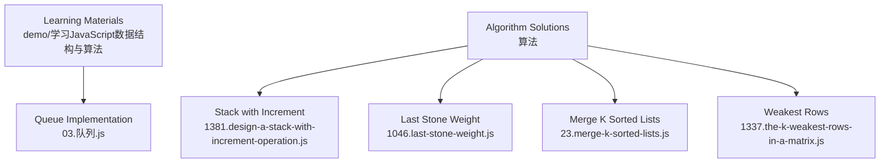
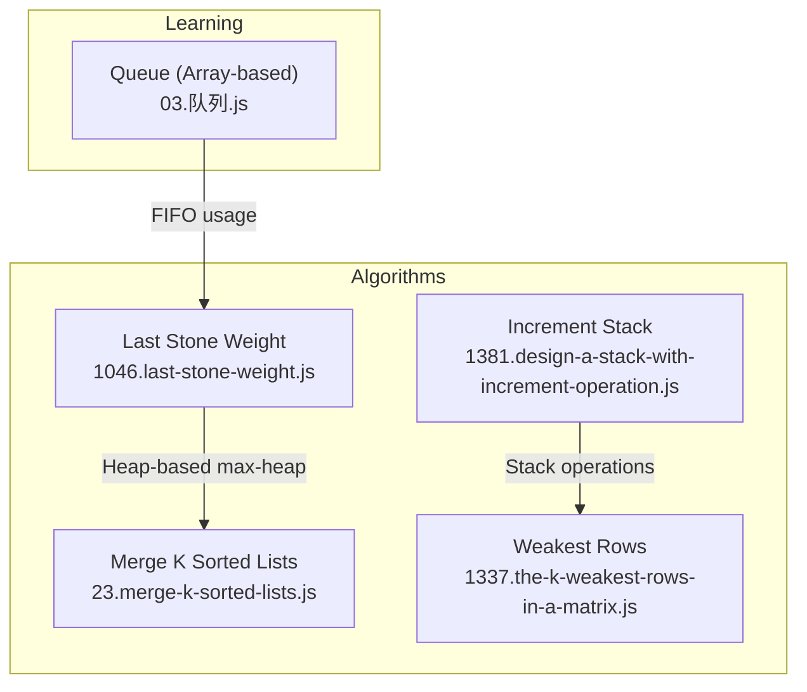
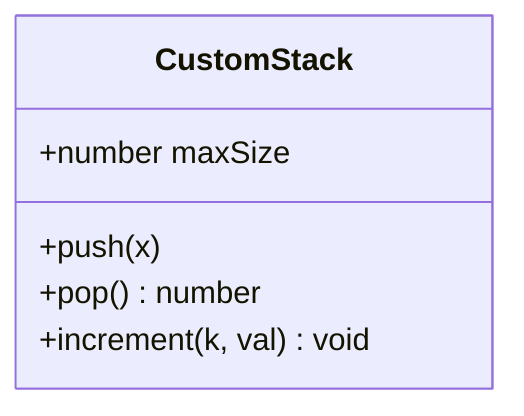
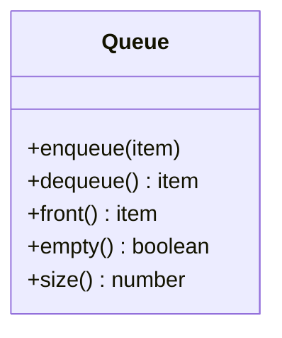
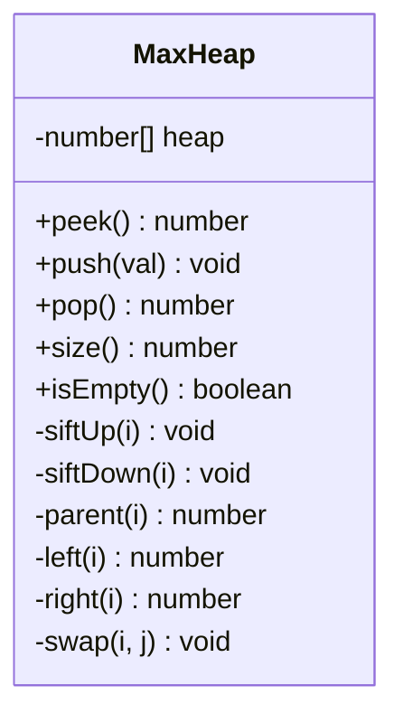
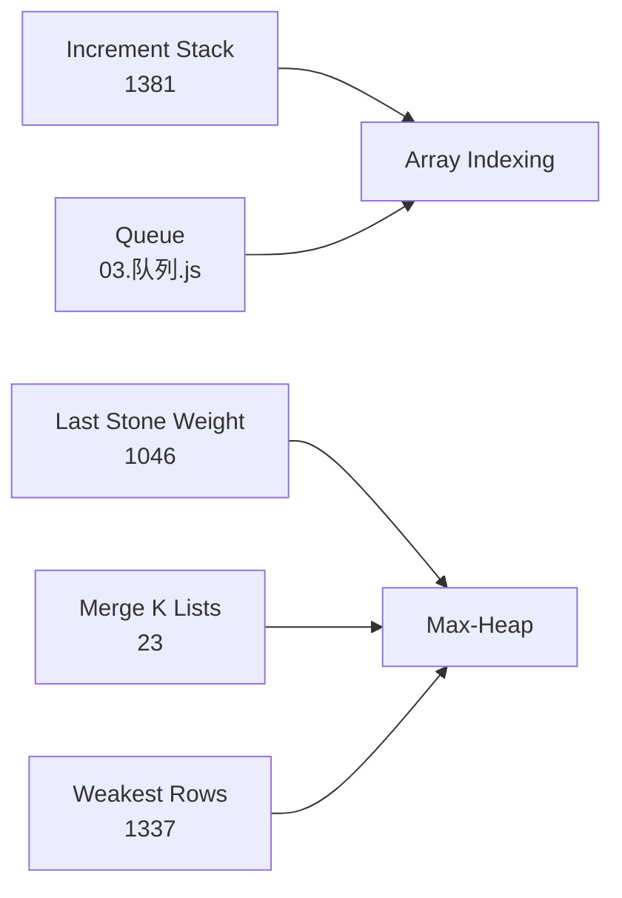

# Stacks and Queues

<cite>
**Referenced Files in This Document**
- [03.队列.js](file://demo/学习JavaScript数据结构与算法/03.队列.js)
- [1381.design-a-stack-with-increment-operation.js](file://算法/1381.design-a-stack-with-increment-operation.js)
- [1046.last-stone-weight.js](file://算法/1046.last-stone-weight.js)
- [23.merge-k-sorted-lists.js](file://算法/23.merge-k-sorted-lists.js)
- [1337.the-k-weakest-rows-in-a-matrix.js](file://算法/1337.the-k-weakest-rows-in-a-matrix.js)
</cite>

## Table of Contents
1. [Introduction](#introduction)
2. [Project Structure](#project-structure)
3. [Core Components](#core-components)
4. [Architecture Overview](#architecture-overview)
5. [Detailed Component Analysis](#detailed-component-analysis)
6. [Dependency Analysis](#dependency-analysis)
7. [Performance Considerations](#performance-considerations)
8. [Troubleshooting Guide](#troubleshooting-guide)
9. [Conclusion](#conclusion)

## Introduction
This document explains stacks and queues as abstract data types with a focus on LIFO (stack) and FIFO (queue) principles. It covers implementation strategies using arrays and linked lists, operation semantics (push/pop for stacks; enqueue/dequeue for queues), and advanced topics such as circular buffers, amortized analysis, and overflow/underflow handling. Practical applications include expression evaluation, balanced parentheses checking, breadth-first search, and sliding window problems. The repository provides concrete implementations and algorithmic patterns that illustrate these concepts in real-world scenarios.

## Project Structure
The repository organizes relevant materials across:
- A JavaScript learning folder containing foundational data structures, including a queue implementation.
- A problem-solving folder with algorithmic solutions that demonstrate stack-like behavior (e.g., increment operations) and heap-based priority structures that rely on stack-like principles during traversal.

**Diagram sources**
- [03.队列.js](file://demo/学习JavaScript数据结构与算法/03.队列.js)
- [1381.design-a-stack-with-increment-operation.js](file://算法/1381.design-a-stack-with-increment-operation.js)
- [1046.last-stone-weight.js](file://算法/1046.last-stone-weight.js)
- [23.merge-k-sorted-lists.js](file://算法/23.merge-k-sorted-lists.js)
- [1337.the-k-weakest-rows-in-a-matrix.js](file://算法/1337.the-k-weakest-rows-in-a-matrix.js)

**Section sources**
- [03.队列.js](file://demo/学习JavaScript数据结构与算法/03.队列.js)
- [1381.design-a-stack-with-increment-operation.js](file://算法/1381.design-a-stack-with-increment-operation.js)
- [1046.last-stone-weight.js](file://算法/1046.last-stone-weight.js)
- [23.merge-k-sorted-lists.js](file://算法/23.merge-k-sorted-lists.js)
- [1337.the-k-weakest-rows-in-a-matrix.js](file://算法/1337.the-k-weakest-rows-in-a-matrix.js)

## Core Components
- Stack (LIFO):
  - Operations: push, pop, peek, empty, size.
  - Array-based implementation supports O(1) amortized push/pop; dynamic resizing incurs occasional O(n) cost.
  - Linked-list implementation offers consistent O(1) per operation but uses extra memory for pointers.
  - Specialized pattern: stack with increment on bottom k elements (see Increment Stack).
- Queue (FIFO):
  - Operations: enqueue, dequeue, front, empty, size.
  - Array-based implementation can use circular buffer to avoid shifting overhead.
  - Linked-list implementation ensures O(1) enqueue/dequeue.
- Priority Queue (via Heap):
  - Binary heap supports O(log n) insert and extract min/max; useful for BFS and graph algorithms.
  - Demonstrated via last-stone weight and merging sorted lists.

Practical applications:
- Expression evaluation and balanced parentheses checking leverage stack’s LIFO nature.
- Breadth-first search relies on queue’s FIFO ordering.
- Sliding window problems often combine a deque (double-ended queue) with monotonic stacks.

**Section sources**
- [03.队列.js](file://demo/学习JavaScript数据结构与算法/03.队列.js)
- [1381.design-a-stack-with-increment-operation.js](file://算法/1381.design-a-stack-with-increment-operation.js)
- [1046.last-stone-weight.js](file://算法/1046.last-stone-weight.js)
- [23.merge-k-sorted-lists.js](file://算法/23.merge-k-sorted-lists.js)
- [1337.the-k-weakest-rows-in-a-matrix.js](file://算法/1337.the-k-weakest-rows-in-a-matrix.js)

## Architecture Overview
The repository demonstrates stack and queue usage across two categories:
- Learning materials: a queue implementation illustrates FIFO semantics and array-based operations.
- Algorithm solutions: several problems exhibit stack-like behavior (e.g., increment on bottom k elements) and heap-based priority structures that rely on stack-like traversal and maintenance.

**Diagram sources**
- [03.队列.js](file://demo/学习JavaScript数据结构与算法/03.队列.js)
- [1381.design-a-stack-with-increment-operation.js](file://算法/1381.design-a-stack-with-increment-operation.js)
- [1046.last-stone-weight.js](file://算法/1046.last-stone-weight.js)
- [23.merge-k-sorted-lists.js](file://算法/23.merge-k-sorted-lists.js)
- [1337.the-k-weakest-rows-in-a-matrix.js](file://算法/1337.the-k-weakest-rows-in-a-matrix.js)

## Detailed Component Analysis

### Stack with Increment Operation
This solution models a fixed-capacity stack supporting push, pop, and increment on the bottom k elements. It highlights:
- Push and pop operate on the top element.
- Increment updates the first min(k, size) elements from the bottom.
- Overflow occurs when attempting to push beyond capacity; underflow is signaled by returning a sentinel on pop from an empty stack.

**Diagram sources**
- [1381.design-a-stack-with-increment-operation.js](file://算法/1381.design-a-stack-with-increment-operation.js)

**Section sources**
- [1381.design-a-stack-with-increment-operation.js](file://算法/1381.design-a-stack-with-increment-operation.js)

### Queue (Array-Based FIFO)
The queue implementation demonstrates FIFO behavior using an array:
- Enqueue adds to the tail.
- Dequeue removes from the head.
- Front and empty checks support common queue operations.

**Diagram sources**
- [03.队列.js](file://demo/学习JavaScript数据结构与算法/03.队列.js)

**Section sources**
- [03.队列.js](file://demo/学习JavaScript数据结构与算法/03.队列.js)

### Priority Queue via Max-Heap (Binary Heap)
Several algorithms rely on a binary heap to maintain order efficiently:
- Last stone weight: repeatedly smash the two heaviest stones using a max-heap.
- Merge k sorted lists: maintain a heap of list heads to extract the minimum.
- Weakest rows: count soldiers per row and select the k weakest using a heap.

**Diagram sources**
- [1046.last-stone-weight.js](file://算法/1046.last-stone-weight.js)
- [23.merge-k-sorted-lists.js](file://算法/23.merge-k-sorted-lists.js)
- [1337.the-k-weakest-rows-in-a-matrix.js](file://算法/1337.the-k-weakest-rows-in-a-matrix.js)

**Section sources**
- [1046.last-stone-weight.js](file://算法/1046.last-stone-weight.js)
- [23.merge-k-sorted-lists.js](file://算法/23.merge-k-sorted-lists.js)
- [1337.the-k-weakest-rows-in-a-matrix.js](file://算法/1337.the-k-weakest-rows-in-a-matrix.js)

### Practical Applications

#### Expression Evaluation and Balanced Parentheses
- Use a stack to evaluate postfix expressions and validate parentheses balance.
- Push operands; upon operator, pop two operands, compute, and push result.
- For parentheses, push opening delimiters and pop on closing; mismatch or leftover indicates imbalance.

[No sources needed since this section provides general guidance]

#### Breadth-First Search (BFS)
- Use a queue to explore nodes level by level.
- Enqueue the starting node; while queue not empty, dequeue a node, process neighbors, and enqueue unvisited ones.

[No sources needed since this section provides general guidance]

#### Sliding Window Problems
- Combine a deque with a monotonic stack/queue to track indices of candidates efficiently.
- Maintain indices of elements in increasing/decreasing order to quickly access min/max in O(1) amortized time.

[No sources needed since this section provides general guidance]

## Dependency Analysis
- The Increment Stack depends on array indexing and bounds checking for increment range.
- The Queue depends on array growth/contraction and pointer movement for enqueue/dequeue.
- The Heap-based algorithms depend on heap property maintenance (siftUp/siftDown) and parent/child index calculations.

**Diagram sources**
- [1381.design-a-stack-with-increment-operation.js](file://算法/1381.design-a-stack-with-increment-operation.js)
- [03.队列.js](file://demo/学习JavaScript数据结构与算法/03.队列.js)
- [1046.last-stone-weight.js](file://算法/1046.last-stone-weight.js)
- [23.merge-k-sorted-lists.js](file://算法/23.merge-k-sorted-lists.js)
- [1337.the-k-weakest-rows-in-a-matrix.js](file://算法/1337.the-k-weakest-rows-in-a-matrix.js)

**Section sources**
- [1381.design-a-stack-with-increment-operation.js](file://算法/1381.design-a-stack-with-increment-operation.js)
- [03.队列.js](file://demo/学习JavaScript数据结构与算法/03.队列.js)
- [1046.last-stone-weight.js](file://算法/1046.last-stone-weight.js)
- [23.merge-k-sorted-lists.js](file://算法/23.merge-k-sorted-lists.js)
- [1337.the-k-weakest-rows-in-a-matrix.js](file://算法/1337.the-k-weakest-rows-in-a-matrix.js)

## Performance Considerations
- Array-based stack:
  - Push/pop average O(1); dynamic resizing triggers occasional O(n) reallocation.
  - Memory overhead proportional to capacity; consider load factor thresholds.
- Linked-list stack:
  - Consistent O(1) per operation; extra memory for node pointers.
- Array-based queue:
  - Naive shift-based dequeue is O(n); prefer circular buffer to achieve amortized O(1) dequeue.
- Circular buffer:
  - Fixed capacity with head/tail pointers; wrap-around indexing; detect full/empty via count or sentinel.
- Heap-based priority queue:
  - Insert and extract are O(log n); building a heap from n items is O(n).
- Amortized analysis:
  - Dynamic array expansion typically doubles capacity; cost of copying elements spreads across many inserts.

[No sources needed since this section provides general guidance]

## Troubleshooting Guide
Common issues and remedies:
- Overflow:
  - Stack: prevent push when size equals capacity.
  - Queue: block enqueue when buffer is full (circular buffer) or capacity reached (dynamic array).
- Underflow:
  - Stack: return sentinel or throw on pop from empty stack.
  - Queue: return sentinel or throw on dequeue from empty queue.
- Circular buffer pitfalls:
  - Incorrect full/empty detection; ensure capacity is one less than buffer size or use a counter.
- Heap property violations:
  - After insert/delete, ensure siftUp/siftDown restore heap order; verify parent/child index formulas.

**Section sources**
- [1381.design-a-stack-with-increment-operation.js](file://算法/1381.design-a-stack-with-increment-operation.js)
- [03.队列.js](file://demo/学习JavaScript数据结构与算法/03.队列.js)
- [1046.last-stone-weight.js](file://算法/1046.last-stone-weight.js)
- [23.merge-k-sorted-lists.js](file://算法/23.merge-k-sorted-lists.js)
- [1337.the-k-weakest-rows-in-a-matrix.js](file://算法/1337.the-k-weakest-rows-in-a-matrix.js)

## Conclusion
Stacks and queues are foundational ADTs with distinct operational characteristics—LIFO versus FIFO—and versatile implementations. Arrays offer simplicity and locality; linked lists provide flexibility and constant-time insertion/removal. Advanced patterns like circular buffers and heaps enable efficient solutions to complex problems such as BFS, sliding windows, and priority-driven scheduling. Understanding overflow/underflow, amortized costs, and proper boundary conditions is essential for robust implementations.