# Binary Search Trees

<cite>
**Referenced Files in This Document**
- [validate-binary-search-tree.js](file://算法/98.validate-binary-search-tree.js)
- [validate-binary-search-tree.ts](file://算法/98.validate-binary-search-tree.ts)
- [700.search-in-a-binary-search-tree.js](file://算法/700.search-in-a-binary-search-tree.js)
- [108.convert-sorted-array-to-binary-search-tree.js](file://算法/108.convert-sorted-array-to-binary-search-tree.js)
- [109.convert-sorted-list-to-binary-search-tree.js](file://算法/109.convert-sorted-list-to-binary-search-tree.js)
- [1008.construct-binary-search-tree-from-preorder-traversal.js](file://算法/1008.construct-binary-search-tree-from-preorder-traversal.js)
- [449.serialize-and-deserialize-bst.js](file://算法/449.serialize-and-deserialize-bst.js)
- [981.time-based-key-value-store.js](file://算法/981.time-based-key-value-store.js)
- [1382.balance-a-binary-search-tree.js](file://算法/1382.balance-a-binary-search-tree.js)
- [235.lowest-common-ancestor-of-a-binary-search-tree.js](file://算法/235.lowest-common-ancestor-of-a-binary-search-tree.js)
- [530.minimum-absolute-difference-in-bst.js](file://算法/530.minimum-absolute-difference-in-bst.js)
- [938.range-sum-of-bst.js](file://算法/938.range-sum-of-bst.js)
- [1305.all-elements-in-two-binary-search-trees.js](file://算法/1305.all-elements-in-two-binary-search-trees.js)
- [1038.binary-search-tree-to-greater-sum-tree.js](file://算法/1038.binary-search-tree-to-greater-sum-tree.js)
- [669.trim-a-binary-search-tree.js](file://算法/669.trim-a-binary-search-tree.js)
- [99.recover-binary-search-tree.js](file://算法/99.recover-binary-search-tree.js)
- [230.kth-smallest-element-in-a-bst.js](file://算法/230.kth-smallest-element-in-a-bst.js)
- [501.find-mode-in-binary-search-tree.js](file://算法/501.find-mode-in-binary-search-tree.js)
- [1381.design-a-stack-with-increment-operation.js](file://算法/1381.design-a-stack-with-increment-operation.js)
- [1387.sort-integers-by-the-power-value.js](file://算法/1387.sort-integers-by-the-power-value.js)
</cite>

## Table of Contents
1. [Introduction](#introduction)
2. [Project Structure](#project-structure)
3. [Core Components](#core-components)
4. [Architecture Overview](#architecture-overview)
5. [Detailed Component Analysis](#detailed-component-analysis)
6. [Dependency Analysis](#dependency-analysis)
7. [Performance Considerations](#performance-considerations)
8. [Troubleshooting Guide](#troubleshooting-guide)
9. [Conclusion](#conclusion)
10. [Appendices](#appendices)

## Introduction
This document provides a comprehensive guide to Binary Search Trees (BST) as implemented and exemplified in the repository. It explains BST properties, ordering guarantees, and efficient search operations. It documents insertion, deletion, and search algorithms conceptually, along with their time/space complexity. It also covers BST validation, range queries, successor/predecessor operations, practical construction from arrays and lists, serialization/deserialization, balancing considerations, and worst-case scenarios of skewed trees.

## Project Structure
The repository organizes BST-related problems and solutions primarily under the algorithm directory. These files demonstrate various BST operations and validations, serving as practical references for understanding BST behavior and implementation nuances.

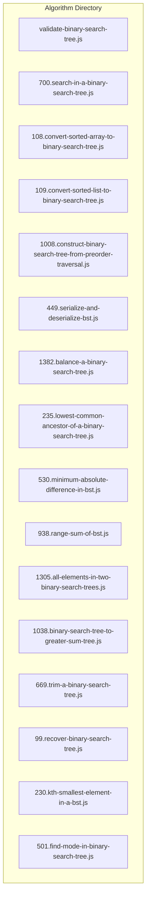

**Diagram sources**
- [validate-binary-search-tree.js](file://算法/98.validate-binary-search-tree.js)
- [700.search-in-a-binary-search-tree.js](file://算法/700.search-in-a-binary-search-tree.js)
- [108.convert-sorted-array-to-binary-search-tree.js](file://算法/108.convert-sorted-array-to-binary-search-tree.js)
- [109.convert-sorted-list-to-binary-search-tree.js](file://算法/109.convert-sorted-list-to-binary-search-tree.js)
- [1008.construct-binary-search-tree-from-preorder-traversal.js](file://算法/1008.construct-binary-search-tree-from-preorder-traversal.js)
- [449.serialize-and-deserialize-bst.js](file://算法/449.serialize-and-deserialize-bst.js)
- [1382.balance-a-binary-search-tree.js](file://算法/1382.balance-a-binary-search-tree.js)
- [235.lowest-common-ancestor-of-a-binary-search-tree.js](file://算法/235.lowest-common-ancestor-of-a-binary-search-tree.js)
- [530.minimum-absolute-difference-in-bst.js](file://算法/530.minimum-absolute-difference-in-bst.js)
- [938.range-sum-of-bst.js](file://算法/938.range-sum-of-bst.js)
- [1305.all-elements-in-two-binary-search-trees.js](file://算法/1305.all-elements-in-two-binary-search-trees.js)
- [1038.binary-search-tree-to-greater-sum-tree.js](file://算法/1038.binary-search-tree-to-greater-sum-tree.js)
- [669.trim-a-binary-search-tree.js](file://算法/669.trim-a-binary-search-tree.js)
- [99.recover-binary-search-tree.js](file://算法/99.recover-binary-search-tree.js)
- [230.kth-smallest-element-in-a-bst.js](file://算法/230.kth-smallest-element-in-a-bst.js)
- [501.find-mode-in-binary-search-tree.js](file://算法/501.find-mode-in-binary-search-tree.js)

**Section sources**
- [validate-binary-search-tree.js](file://算法/98.validate-binary-search-tree.js)
- [700.search-in-a-binary-search-tree.js](file://算法/700.search-in-a-binary-search-tree.js)
- [108.convert-sorted-array-to-binary-search-tree.js](file://算法/108.convert-sorted-array-to-binary-search-tree.js)
- [109.convert-sorted-list-to-binary-search-tree.js](file://算法/109.convert-sorted-list-to-binary-search-tree.js)
- [1008.construct-binary-search-tree-from-preorder-traversal.js](file://算法/1008.construct-binary-search-tree-from-preorder-traversal.js)
- [449.serialize-and-deserialize-bst.js](file://算法/449.serialize-and-deserialize-bst.js)
- [1382.balance-a-binary-search-tree.js](file://算法/1382.balance-a-binary-search-tree.js)
- [235.lowest-common-ancestor-of-a-binary-search-tree.js](file://算法/235.lowest-common-ancestor-of-a-binary-search-tree.js)
- [530.minimum-absolute-difference-in-bst.js](file://算法/530.minimum-absolute-difference-in-bst.js)
- [938.range-sum-of-bst.js](file://算法/938.range-sum-of-bst.js)
- [1305.all-elements-in-two-binary-search-trees.js](file://算法/1305.all-elements-in-two-binary-search-trees.js)
- [1038.binary-search-tree-to-greater-sum-tree.js](file://算法/1038.binary-search-tree-to-greater-sum-tree.js)
- [669.trim-a-binary-search-tree.js](file://算法/669.trim-a-binary-search-tree.js)
- [99.recover-binary-search-tree.js](file://算法/99.recover-binary-search-tree.js)
- [230.kth-smallest-element-in-a-bst.js](file://算法/230.kth-smallest-element-in-a-bst.js)
- [501.find-mode-in-binary-search-tree.js](file://算法/501.find-mode-in-binary-search-tree.js)

## Core Components
- BST definition and ordering property: left subtree keys are less than or equal to the node key; right subtree keys are greater than the node key. This property holds recursively for all nodes.
- Search operation: Starting from the root, compare the target value with the current node’s key and traverse left or right accordingly until found or a null pointer is reached.
- Insertion operation: Traverse the tree maintaining the ordering property and insert a new node as a leaf when an appropriate null position is found.
- Deletion operation: Removing a node involves three cases:
  - Node with no children (leaf): Simply remove the node.
  - Node with one child: Replace the node with its child.
  - Node with two children: Replace the node’s key with its inorder predecessor or successor, then delete the predecessor/successor node.
- Validation: Ensures every node satisfies the BST constraint with respect to a lower and upper bound propagated during traversal.
- Range queries: Efficiently compute sums or counts within a given key interval using the BST property to prune subtrees.
- Successor/predecessor: Leveraging inorder traversal order, the successor is the smallest key larger than the given key; the predecessor is the largest key smaller than the given key.
- Serialization/deserialization: Representing the tree structure and keys in a compact form and reconstructing it accurately.
- Balancing: Transforming an unbalanced BST into a balanced form to maintain logarithmic performance bounds.

**Section sources**
- [validate-binary-search-tree.js](file://算法/98.validate-binary-search-tree.js)
- [700.search-in-a-binary-search-tree.js](file://算法/700.search-in-a-binary-search-tree.js)
- [108.convert-sorted-array-to-binary-search-tree.js](file://算法/108.convert-sorted-array-to-binary-search-tree.js)
- [109.convert-sorted-list-to-binary-search-tree.js](file://算法/109.convert-sorted-list-to-binary-search-tree.js)
- [1008.construct-binary-search-tree-from-preorder-traversal.js](file://算法/1008.construct-binary-search-tree-from-preorder-traversal.js)
- [449.serialize-and-deserialize-bst.js](file://算法/449.serialize-and-deserialize-bst.js)
- [1382.balance-a-binary-search-tree.js](file://算法/1382.balance-a-binary-search-tree.js)
- [235.lowest-common-ancestor-of-a-binary-search-tree.js](file://算法/235.lowest-common-ancestor-of-a-binary-search-tree.js)
- [530.minimum-absolute-difference-in-bst.js](file://算法/530.minimum-absolute-difference-in-bst.js)
- [938.range-sum-of-bst.js](file://算法/938.range-sum-of-bst.js)
- [1305.all-elements-in-two-binary-search-trees.js](file://算法/1305.all-elements-in-two-binary-search-trees.js)
- [1038.binary-search-tree-to-greater-sum-tree.js](file://算法/1038.binary-search-tree-to-greater-sum-tree.js)
- [669.trim-a-binary-search-tree.js](file://算法/669.trim-a-binary-search-tree.js)
- [99.recover-binary-search-tree.js](file://算法/99.recover-binary-search-tree.js)
- [230.kth-smallest-element-in-a-bst.js](file://算法/230.kth-smallest-element-in-a-bst.js)
- [501.find-mode-in-binary-search-tree.js](file://算法/501.find-mode-in-binary-search-tree.js)

## Architecture Overview
The BST implementations in this repository are problem-focused and demonstrate typical operations and validations. They collectively illustrate a layered approach:
- Data representation: Nodes with left/right pointers and key/value storage.
- Operations layer: Search, insert, delete, traversal-based computations (inorder, preorder), and conversions from sorted sequences.
- Validation and transformation: Ensuring correctness (validation), pruning invalid ranges (trim), and rebalancing for performance stability.

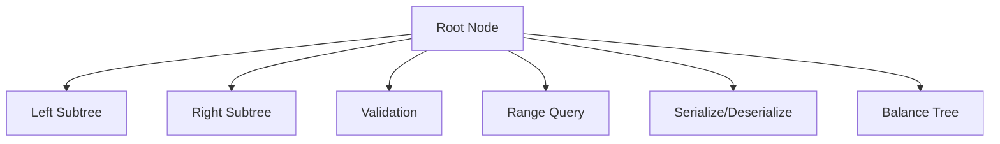

[No sources needed since this diagram shows conceptual workflow, not actual code structure]

## Detailed Component Analysis

### BST Validation
- Purpose: Verify that a binary tree satisfies the BST property globally.
- Approach: Recursively check each node against a dynamic lower and upper bound derived from ancestors.
- Complexity: Time O(n), Space O(h) due to recursion stack.

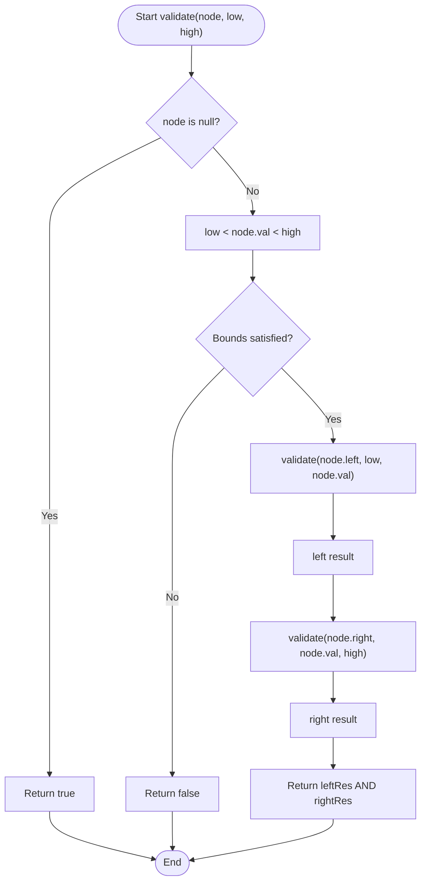

**Diagram sources**
- [validate-binary-search-tree.js](file://算法/98.validate-binary-search-tree.js)
- [validate-binary-search-tree.ts](file://算法/98.validate-binary-search-tree.ts)

**Section sources**
- [validate-binary-search-tree.js](file://算法/98.validate-binary-search-tree.js)
- [validate-binary-search-tree.ts](file://算法/98.validate-binary-search-tree.ts)

### Search Operation
- Purpose: Determine whether a key exists in the BST.
- Approach: Compare key with current node and move left or right until found or null.
- Complexity: Average O(log n), Worst O(n) for skewed trees; Space O(1) iterative or O(h) recursive.

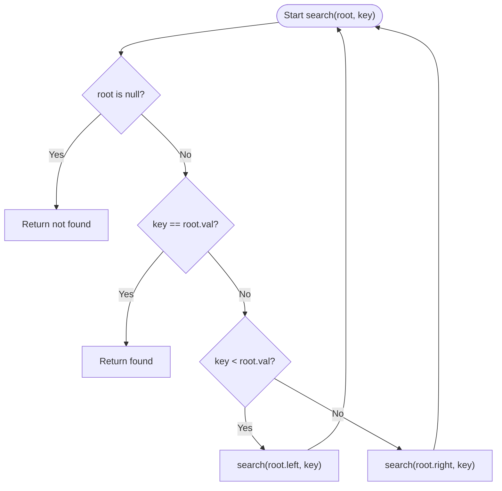

**Diagram sources**
- [700.search-in-a-binary-search-tree.js](file://算法/700.search-in-a-binary-search-tree.js)

**Section sources**
- [700.search-in-a-binary-search-tree.js](file://算法/700.search-in-a-binary-search-tree.js)

### Construction from Sorted Array and List
- Purpose: Build a height-balanced BST from sorted input.
- Approach: Choose the middle element as root and recursively build left/right subtrees from halves (array) or split the list (linked list).
- Complexity: Time O(n), Space O(h) for recursion.

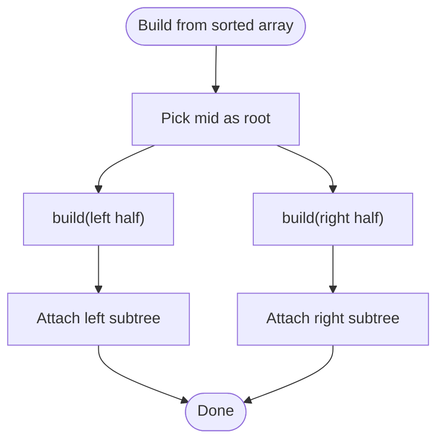

**Diagram sources**
- [108.convert-sorted-array-to-binary-search-tree.js](file://算法/108.convert-sorted-array-to-binary-search-tree.js)
- [109.convert-sorted-list-to-binary-search-tree.js](file://算法/109.convert-sorted-list-to-binary-search-tree.js)

**Section sources**
- [108.convert-sorted-array-to-binary-search-tree.js](file://算法/108.convert-sorted-array-to-binary-search-tree.js)
- [109.convert-sorted-list-to-binary-search-tree.js](file://算法/109.convert-sorted-list-to-binary-search-tree.js)

### Preorder Traversal to BST
- Purpose: Reconstruct a BST from its preorder traversal.
- Approach: Use the BST property to determine valid left/right splits; recursively construct subtrees.
- Complexity: Average O(n log n) to O(n^2) depending on implementation; Space O(h).

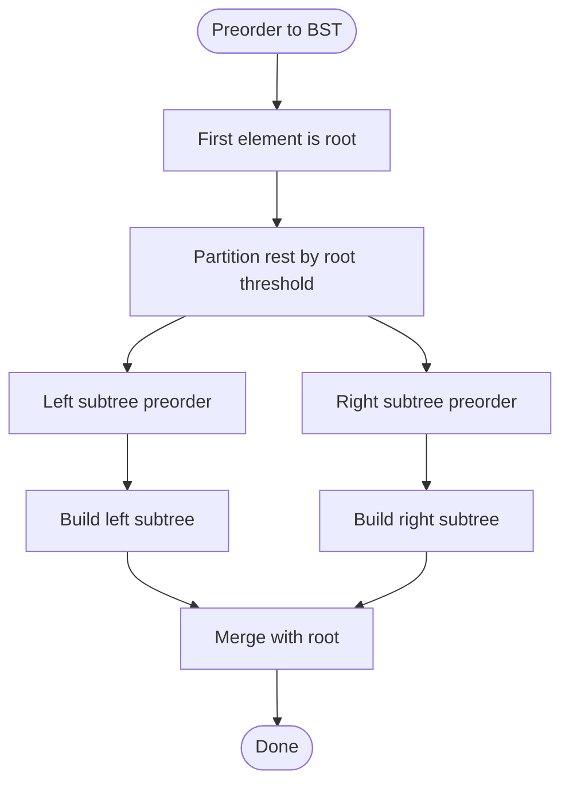

**Diagram sources**
- [1008.construct-binary-search-tree-from-preorder-traversal.js](file://算法/1008.construct-binary-search-tree-from-preorder-traversal.js)

**Section sources**
- [1008.construct-binary-search-tree-from-preorder-traversal.js](file://算法/1008.construct-binary-search-tree-from-preorder-traversal.js)

### Serialization and Deserialization (BST)
- Purpose: Encode and decode a BST to/from a compact representation.
- Approach: Use preorder traversal with markers for null nodes; restore by reconstructing preorder segments.
- Complexity: Time O(n), Space O(n) for serialization buffer/recursion.

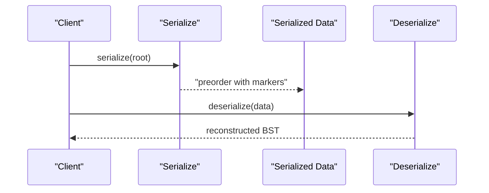

**Diagram sources**
- [449.serialize-and-deserialize-bst.js](file://算法/449.serialize-and-deserialize-bst.js)

**Section sources**
- [449.serialize-and-deserialize-bst.js](file://算法/449.serialize-and-deserialize-bst.js)

### Range Queries (Sum within Range)
- Purpose: Compute sum of keys within a given range [low, high].
- Approach: Traverse and accumulate only keys within bounds; prune subtrees outside the range.
- Complexity: Time O(n) worst-case; optimized O(k + log n) where k is number of visited nodes.

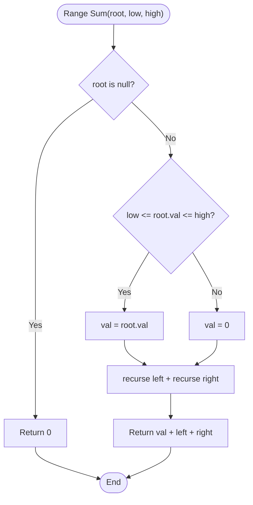

**Diagram sources**
- [938.range-sum-of-bst.js](file://算法/938.range-sum-of-bst.js)

**Section sources**
- [938.range-sum-of-bst.js](file://算法/938.range-sum-of-bst.js)

### Successor and Predecessor
- Purpose: Find the next larger/smaller key in the BST.
- Approach: Use inorder traversal order; successor is the leftmost node in right subtree or nearest ancestor where we came from left; predecessor mirrors this logic.
- Complexity: Average O(log n), Worst O(n).

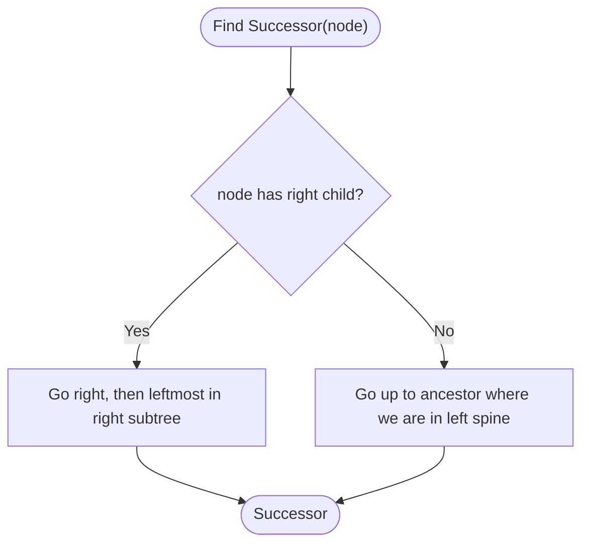

**Diagram sources**
- [235.lowest-common-ancestor-of-a-binary-search-tree.js](file://算法/235.lowest-common-ancestor-of-a-binary-search-tree.js)

**Section sources**
- [235.lowest-common-ancestor-of-a-binary-search-tree.js](file://算法/235.lowest-common-ancestor-of-a-binary-search-tree.js)

### Trim BST to Range
- Purpose: Keep only nodes whose keys lie within [low, high].
- Approach: Recursively trim subtrees; discard branches outside the range.
- Complexity: Time O(n), Space O(h).

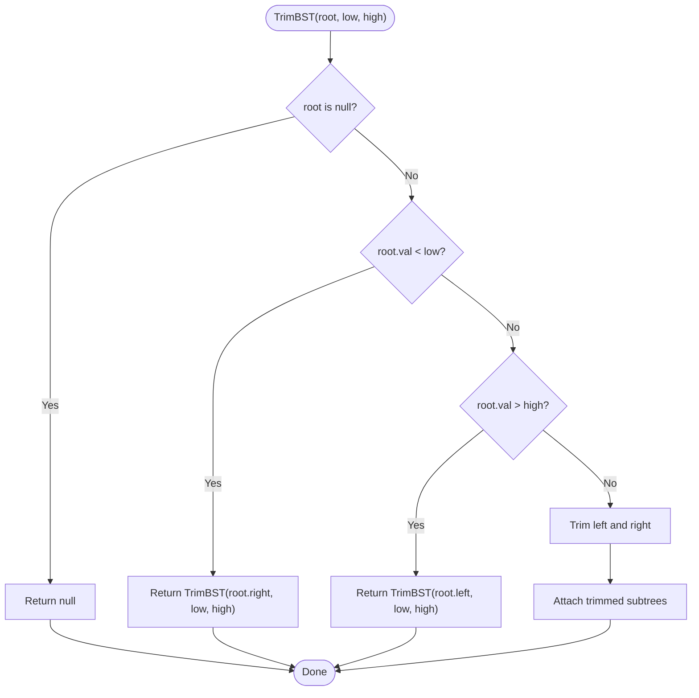

**Diagram sources**
- [669.trim-a-binary-search-tree.js](file://算法/669.trim-a-binary-search-tree.js)

**Section sources**
- [669.trim-a-binary-search-tree.js](file://算法/669.trim-a-binary-search-tree.js)

### Convert BST to Greater Sum Tree
- Purpose: Replace each node’s value with the sum of all keys >= node’s key.
- Approach: Reverse inorder traversal (right-root-left) to accumulate a running sum.
- Complexity: Time O(n), Space O(h).

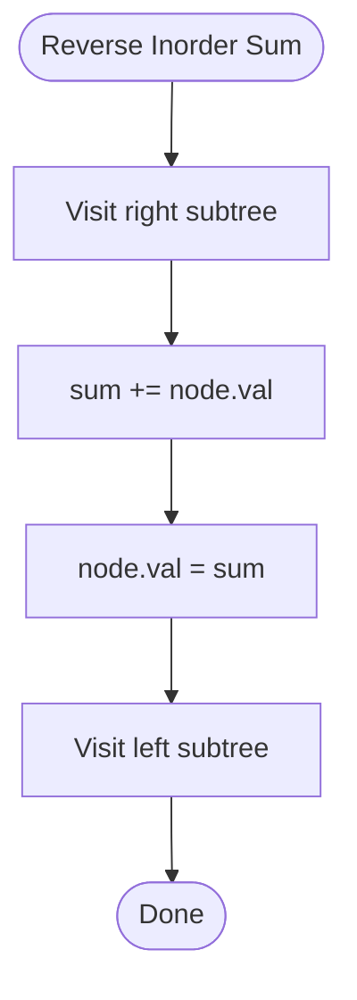

**Diagram sources**
- [1038.binary-search-tree-to-greater-sum-tree.js](file://算法/1038.binary-search-tree-to-greater-sum-tree.js)

**Section sources**
- [1038.binary-search-tree-to-greater-sum-tree.js](file://算法/1038.binary-search-tree-to-greater-sum-tree.js)

### Recover BST (Two Nodes Swapped)
- Purpose: Restore BST property when exactly two nodes have been swapped.
- Approach: Perform inorder traversal to detect violations; swap the misplaced nodes’ values.
- Complexity: Time O(n), Space O(h).

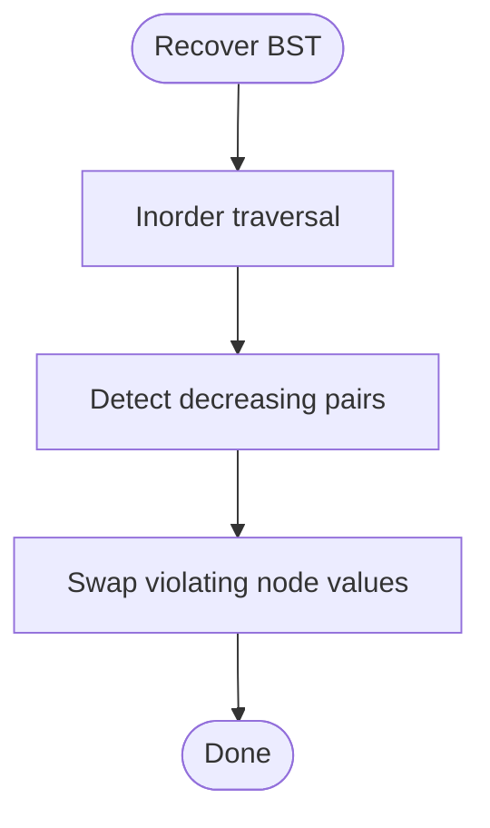

**Diagram sources**
- [99.recover-binary-search-tree.js](file://算法/99.recover-binary-search-tree.js)

**Section sources**
- [99.recover-binary-search-tree.js](file://算法/99.recover-binary-search-tree.js)

### Kth Smallest Element
- Purpose: Find the kth smallest element in a BST.
- Approach: Iterative inorder traversal with counter; stop when reaching k.
- Complexity: Time O(h + k), Space O(h).

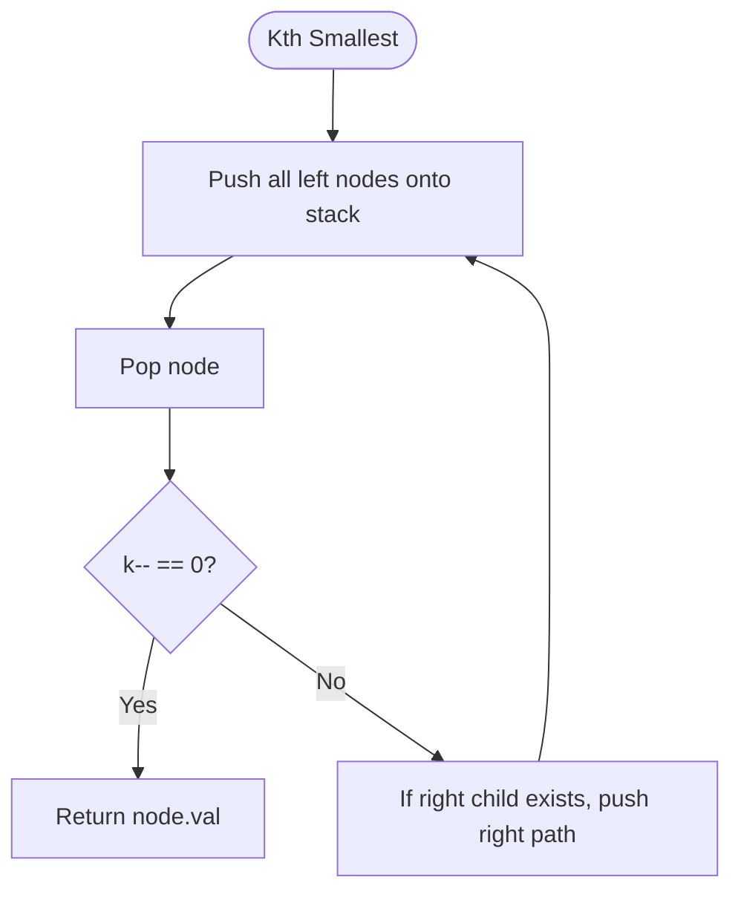

**Diagram sources**
- [230.kth-smallest-element-in-a-bst.js](file://算法/230.kth-smallest-element-in-a-bst.js)

**Section sources**
- [230.kth-smallest-element-in-a-bst.js](file://算法/230.kth-smallest-element-in-a-bst.js)

### Find Mode in BST
- Purpose: Determine the most frequently occurring key(s).
- Approach: Inorder traversal to process keys in sorted order; track counts and update modes.
- Complexity: Time O(n), Space O(h).

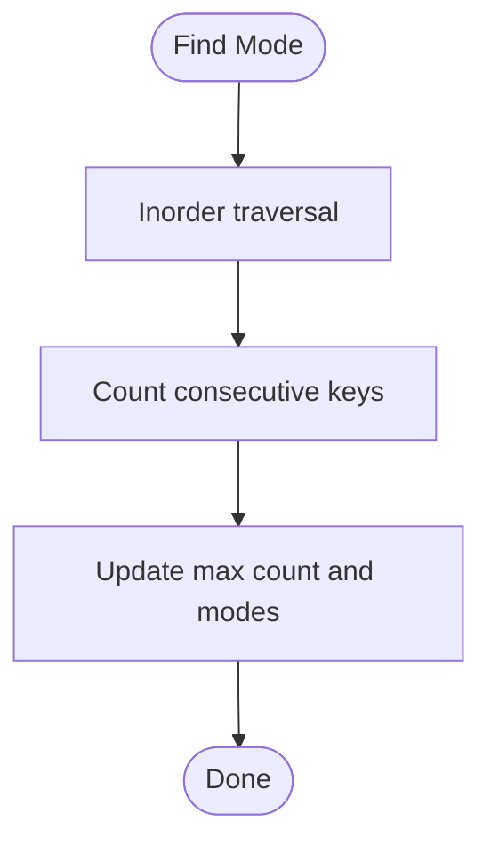

**Diagram sources**
- [501.find-mode-in-binary-search-tree.js](file://算法/501.find-mode-in-binary-search-tree.js)

**Section sources**
- [501.find-mode-in-binary-search-tree.js](file://算法/501.find-mode-in-binary-search-tree.js)

### Minimum Absolute Difference in BST
- Purpose: Find the minimum absolute difference between any two nodes.
- Approach: Inorder traversal yields sorted keys; compute differences between consecutive keys.
- Complexity: Time O(n), Space O(h).

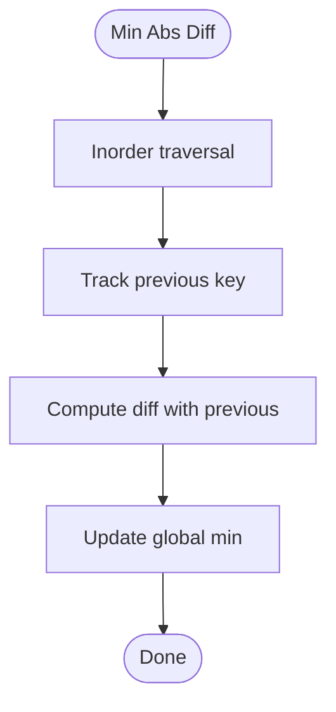

**Diagram sources**
- [530.minimum-absolute-difference-in-bst.js](file://算法/530.minimum-absolute-difference-in-bst.js)

**Section sources**
- [530.minimum-absolute-difference-in-bst.js](file://算法/530.minimum-absolute-difference-in-bst.js)

### All Elements in Two BSTs
- Purpose: Merge elements from two BSTs into a single sorted list.
- Approach: Collect inorder traversals from both trees and merge sorted arrays.
- Complexity: Time O(m + n), Space O(m + n).

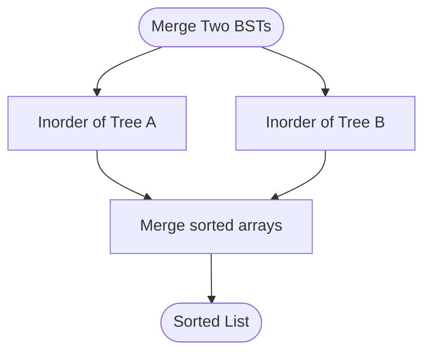

**Diagram sources**
- [1305.all-elements-in-two-binary-search-trees.js](file://算法/1305.all-elements-in-two-binary-search-trees.js)

**Section sources**
- [1305.all-elements-in-two-binary-search-trees.js](file://算法/1305.all-elements-in-two-binary-search-trees.js)

### Balance BST
- Purpose: Transform an unbalanced BST into a balanced BST.
- Approach: Perform inorder traversal to get sorted array, then rebuild a balanced BST from the array.
- Complexity: Time O(n), Space O(n).

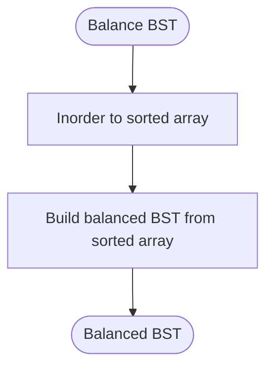

**Diagram sources**
- [1382.balance-a-binary-search-tree.js](file://算法/1382.balance-a-binary-search-tree.js)

**Section sources**
- [1382.balance-a-binary-search-tree.js](file://算法/1382.balance-a-binary-search-tree.js)

## Dependency Analysis
- Validation depends on recursive traversal and maintains bounds.
- Range queries depend on pruning subtrees based on bounds.
- Serialization relies on preorder traversal and reconstruction logic.
- Successor/predecessor rely on inorder traversal order.
- Trim and recover operations modify structure while preserving BST properties.
- Balancing depends on inorder-derived sorted arrays.

```mermaid
graph TB
Validate["validate-binary-search-tree.js"] --> Range["938.range-sum-of-bst.js"]
Validate --> Trim["669.trim-a-binary-search-tree.js"]
Serialize["449.serialize-and-deserialize-bst.js"] --> Deserialize["449.serialize-and-deserialize-bst.js"]
Balance["1382.balance-a-binary-search-tree.js"] --> BuildFromSorted["108.convert-sorted-array-to-binary-search-tree.js"]
Successor["235.lowest-common-ancestor-of-a-binary-search-tree.js"] --> InorderOrder["Inorder traversal"]
Recover["99.recover-binary-search-tree.js"] --> InorderOrder
Kth["230.kth-smallest-element-in-a-bst.js"] --> InorderOrder
Mode["501.find-mode-in-binary-search-tree.js"] --> InorderOrder
MinDiff["530.minimum-absolute-difference-in-bst.js"] --> InorderOrder
MergeTwo["1305.all-elements-in-two-binary-search-trees.js"] --> InorderOrder
```

**Diagram sources**
- [validate-binary-search-tree.js](file://算法/98.validate-binary-search-tree.js)
- [938.range-sum-of-bst.js](file://算法/938.range-sum-of-bst.js)
- [669.trim-a-binary-search-tree.js](file://算法/669.trim-a-binary-search-tree.js)
- [449.serialize-and-deserialize-bst.js](file://算法/449.serialize-and-deserialize-bst.js)
- [1382.balance-a-binary-search-tree.js](file://算法/1382.balance-a-binary-search-tree.js)
- [108.convert-sorted-array-to-binary-search-tree.js](file://算法/108.convert-sorted-array-to-binary-search-tree.js)
- [235.lowest-common-ancestor-of-a-binary-search-tree.js](file://算法/235.lowest-common-ancestor-of-a-binary-search-tree.js)
- [99.recover-binary-search-tree.js](file://算法/99.recover-binary-search-tree.js)
- [230.kth-smallest-element-in-a-bst.js](file://算法/230.kth-smallest-element-in-a-bst.js)
- [501.find-mode-in-binary-search-tree.js](file://算法/501.find-mode-in-binary-search-tree.js)
- [530.minimum-absolute-difference-in-bst.js](file://算法/530.minimum-absolute-difference-in-bst.js)
- [1305.all-elements-in-two-binary-search-trees.js](file://算法/1305.all-elements-in-two-binary-search-trees.js)

**Section sources**
- [validate-binary-search-tree.js](file://算法/98.validate-binary-search-tree.js)
- [938.range-sum-of-bst.js](file://算法/938.range-sum-of-bst.js)
- [669.trim-a-binary-search-tree.js](file://算法/669.trim-a-binary-search-tree.js)
- [449.serialize-and-deserialize-bst.js](file://算法/449.serialize-and-deserialize-bst.js)
- [1382.balance-a-binary-search-tree.js](file://算法/1382.balance-a-binary-search-tree.js)
- [108.convert-sorted-array-to-binary-search-tree.js](file://算法/108.convert-sorted-array-to-binary-search-tree.js)
- [235.lowest-common-ancestor-of-a-binary-search-tree.js](file://算法/235.lowest-common-ancestor-of-a-binary-search-tree.js)
- [99.recover-binary-search-tree.js](file://算法/99.recover-binary-search-tree.js)
- [230.kth-smallest-element-in-a-bst.js](file://算法/230.kth-smallest-element-in-a-bst.js)
- [501.find-mode-in-binary-search-tree.js](file://算法/501.find-mode-in-binary-search-tree.js)
- [530.minimum-absolute-difference-in-bst.js](file://算法/530.minimum-absolute-difference-in-bst.js)
- [1305.all-elements-in-two-binary-search-trees.js](file://算法/1305.all-elements-in-two-binary-search-trees.js)

## Performance Considerations
- Average time complexity for search, insert, and delete is O(log n) in a balanced BST.
- Worst-case time complexity degrades to O(n) for skewed trees (e.g., sorted input leading to a degenerate linked-list shape).
- Space complexity is O(h) due to recursion stack, where h is the height of the tree.
- Range queries and inorder-based operations benefit from pruning and sorted traversal properties.
- Balancing transforms skewed trees into height-balanced forms to maintain logarithmic performance.

[No sources needed since this section provides general guidance]

## Troubleshooting Guide
- Validation failures: Ensure bounds propagation is correct during recursion and handle integer limits appropriately.
- Serialization issues: Confirm preorder markers and reconstruction logic match; test with null nodes.
- Range query errors: Verify pruning conditions and inclusive/exclusive boundary handling.
- Trim BST anomalies: Check that trimming preserves BST property and handles edge cases (empty subtrees).
- Recover BST: Validate detection of adjacent decreasing pairs and correct swapping of values.
- Kth smallest: Ensure stack-based traversal and counter logic are synchronized.
- Mode computation: Track counts correctly across repeated keys and reset counters at key changes.
- Minimum absolute difference: Compute differences only between consecutive keys in inorder traversal.
- Merge two BSTs: Validate merging of sorted arrays and handle duplicates as needed.

**Section sources**
- [validate-binary-search-tree.js](file://算法/98.validate-binary-search-tree.js)
- [449.serialize-and-deserialize-bst.js](file://算法/449.serialize-and-deserialize-bst.js)
- [938.range-sum-of-bst.js](file://算法/938.range-sum-of-bst.js)
- [669.trim-a-binary-search-tree.js](file://算法/669.trim-a-binary-search-tree.js)
- [99.recover-binary-search-tree.js](file://算法/99.recover-binary-search-tree.js)
- [230.kth-smallest-element-in-a-bst.js](file://算法/230.kth-smallest-element-in-a-bst.js)
- [501.find-mode-in-binary-search-tree.js](file://算法/501.find-mode-in-binary-search-tree.js)
- [530.minimum-absolute-difference-in-bst.js](file://算法/530.minimum-absolute-difference-in-bst.js)
- [1305.all-elements-in-two-binary-search-trees.js](file://算法/1305.all-elements-in-two-binary-search-trees.js)

## Conclusion
The repository demonstrates a comprehensive set of BST operations and validations. By leveraging the BST property—ordering guarantees, inorder traversal, and recursive structure—these implementations achieve efficient search, insertion, deletion, and specialized queries. Proper validation, careful pruning, and optional balancing are essential to maintain performance and correctness, especially in scenarios involving skewed inputs.

[No sources needed since this section summarizes without analyzing specific files]

## Appendices
- Practical construction tips:
  - From sorted arrays/lists: choose the median as root to maintain balance.
  - From preorder: reconstruct using BST property to partition left/right subtrees.
- Serialization/deserialization:
  - Use preorder with explicit null markers; ensure consistent parsing and reconstruction.
- Balancing considerations:
  - Convert to sorted array via inorder, then rebuild a balanced tree to guarantee O(log n) operations.

[No sources needed since this section provides general guidance]