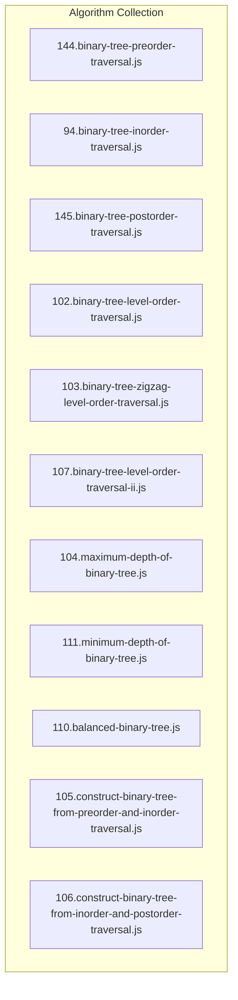
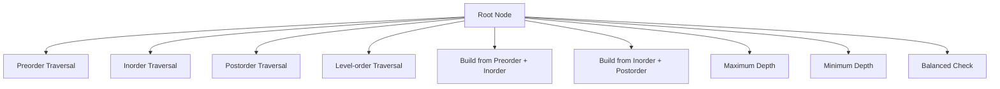
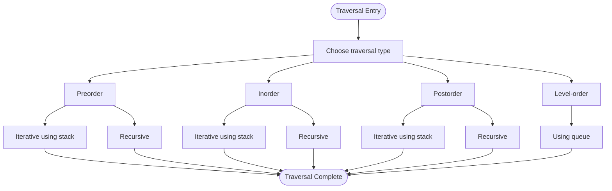
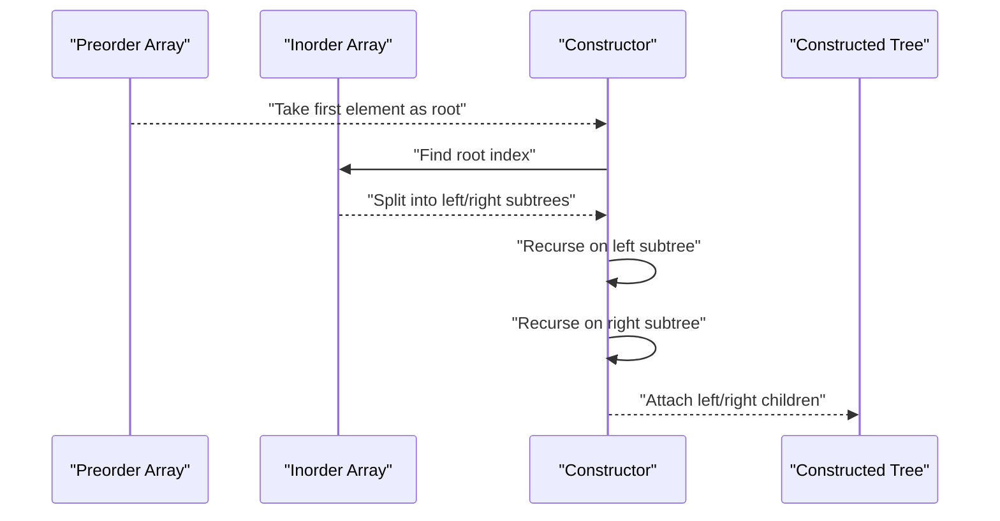
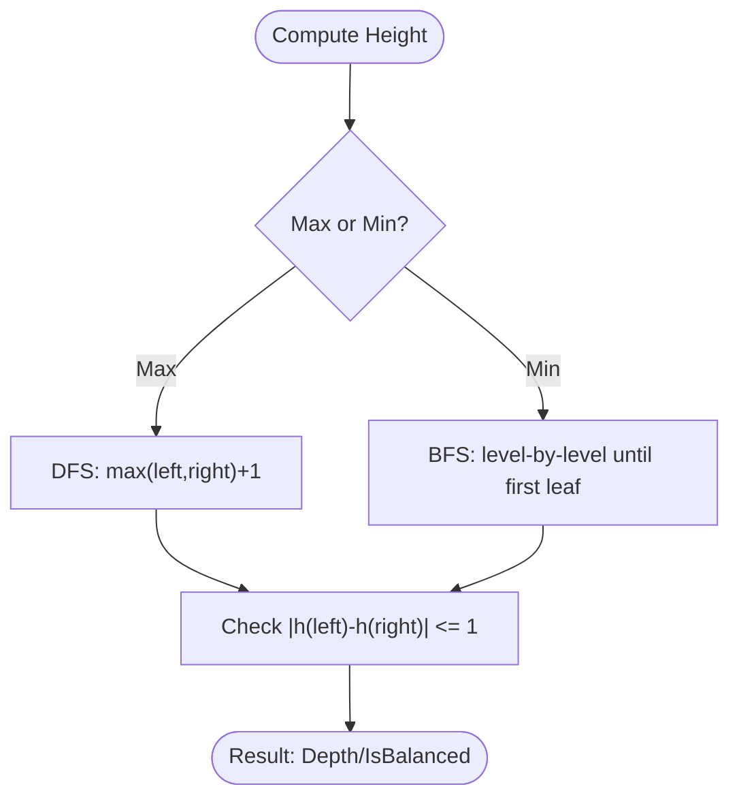
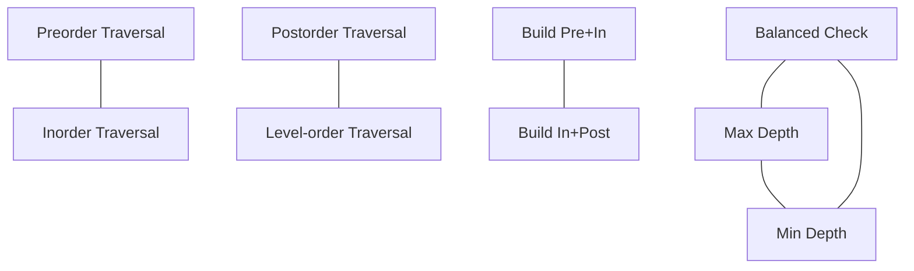

# Binary Trees

<cite>
**Referenced Files in This Document**
- [102.binary-tree-level-order-traversal.js](file://算法/102.binary-tree-level-order-traversal.js)
- [103.binary-tree-zigzag-level-order-traversal.js](file://算法/103.binary-tree-zigzag-level-order-traversal.js)
- [104.maximum-depth-of-binary-tree.js](file://算法/104.maximum-depth-of-binary-tree.js)
- [105.construct-binary-tree-from-preorder-and-inorder-traversal.js](file://算法/105.construct-binary-tree-from-preorder-and-inorder-traversal.js)
- [106.construct-binary-tree-from-inorder-and-postorder-traversal.js](file://算法/106.construct-binary-tree-from-inorder-and-postorder-traversal.js)
- [107.binary-tree-level-order-traversal-ii.js](file://算法/107.binary-tree-level-order-traversal-ii.js)
- [110.balanced-binary-tree.js](file://算法/110.balanced-binary-tree.js)
- [111.minimum-depth-of-binary-tree.js](file://算法/111.minimum-depth-of-binary-tree.js)
- [144.binary-tree-preorder-traversal.js](file://算法/144.binary-tree-preorder-traversal.js)
- [145.binary-tree-postorder-traversal.js](file://算法/145.binary-tree-postorder-traversal.js)
- [94.binary-tree-inorder-traversal.js](file://算法/94.binary-tree-inorder-traversal.js)
</cite>

## Table of Contents
1. [Introduction](#introduction)
2. [Project Structure](#project-structure)
3. [Core Components](#core-components)
4. [Architecture Overview](#architecture-overview)
5. [Detailed Component Analysis](#detailed-component-analysis)
6. [Dependency Analysis](#dependency-analysis)
7. [Performance Considerations](#performance-considerations)
8. [Troubleshooting Guide](#troubleshooting-guide)
9. [Conclusion](#conclusion)

## Introduction
This document presents a comprehensive guide to binary tree data structures and algorithms, grounded in the algorithm collection. It covers fundamental concepts, node representation, and essential operations such as traversal (preorder, inorder, postorder, level-order), tree construction from traversal sequences, searching, insertion, deletion, and height computation. It also includes complexity analysis and practical examples drawn from the repository’s binary tree implementations.

## Project Structure
The repository organizes binary tree algorithms as standalone JavaScript files under the algorithm directory. Each file implements a specific operation or traversal pattern. The structure emphasizes modularity and clarity, enabling focused study of individual algorithms.

**Diagram sources**
- [144.binary-tree-preorder-traversal.js](file://算法/144.binary-tree-preorder-traversal.js)
- [94.binary-tree-inorder-traversal.js](file://算法/94.binary-tree-inorder-traversal.js)
- [145.binary-tree-postorder-traversal.js](file://算法/145.binary-tree-postorder-traversal.js)
- [102.binary-tree-level-order-traversal.js](file://算法/102.binary-tree-level-order-traversal.js)
- [103.binary-tree-zigzag-level-order-traversal.js](file://算法/103.binary-tree-zigzag-level-order-traversal.js)
- [107.binary-tree-level-order-traversal-ii.js](file://算法/107.binary-tree-level-order-traversal-ii.js)
- [104.maximum-depth-of-binary-tree.js](file://算法/104.maximum-depth-of-binary-tree.js)
- [111.minimum-depth-of-binary-tree.js](file://算法/111.minimum-depth-of-binary-tree.js)
- [110.balanced-binary-tree.js](file://算法/110.balanced-binary-tree.js)
- [105.construct-binary-tree-from-preorder-and-inorder-traversal.js](file://算法/105.construct-binary-tree-from-preorder-and-inorder-traversal.js)
- [106.construct-binary-tree-from-inorder-and-postorder-traversal.js](file://算法/106.construct-binary-tree-from-inorder-and-postorder-traversal.js)

**Section sources**
- [144.binary-tree-preorder-traversal.js](file://算法/144.binary-tree-preorder-traversal.js)
- [94.binary-tree-inorder-traversal.js](file://算法/94.binary-tree-inorder-traversal.js)
- [145.binary-tree-postorder-traversal.js](file://算法/145.binary-tree-postorder-traversal.js)
- [102.binary-tree-level-order-traversal.js](file://算法/102.binary-tree-level-order-traversal.js)
- [103.binary-tree-zigzag-level-order-traversal.js](file://算法/103.binary-tree-zigzag-level-order-traversal.js)
- [107.binary-tree-level-order-traversal-ii.js](file://算法/107.binary-tree-level-order-traversal-ii.js)
- [104.maximum-depth-of-binary-tree.js](file://算法/104.maximum-depth-of-binary-tree.js)
- [111.minimum-depth-of-binary-tree.js](file://算法/111.minimum-depth-of-binary-tree.js)
- [110.balanced-binary-tree.js](file://算法/110.balanced-binary-tree.js)
- [105.construct-binary-tree-from-preorder-and-inorder-traversal.js](file://算法/105.construct-binary-tree-from-preorder-and-inorder-traversal.js)
- [106.construct-binary-tree-from-inorder-and-postorder-traversal.js](file://算法/106.construct-binary-tree-from-inorder-and-postorder-traversal.js)

## Core Components
- Node representation: The implementations assume a standard binary tree node structure with left and right child pointers and a value field. While the exact node definition is not present here, the traversal and construction routines operate on nodes conforming to this convention.
- Traversals:
  - Preorder (root, left, right)
  - Inorder (left, root, right)
  - Postorder (left, right, root)
  - Level-order (breadth-first)
- Tree construction:
  - From preorder and inorder sequences
  - From inorder and postorder sequences
- Height and balance:
  - Maximum depth (root-to-deepest leaf)
  - Minimum depth (root-to-nearest leaf)
  - Balanced tree check

These components form the backbone of binary tree manipulation and are implemented across multiple files in the repository.

**Section sources**
- [144.binary-tree-preorder-traversal.js](file://算法/144.binary-tree-preorder-traversal.js)
- [94.binary-tree-inorder-traversal.js](file://算法/94.binary-tree-inorder-traversal.js)
- [145.binary-tree-postorder-traversal.js](file://算法/145.binary-tree-postorder-traversal.js)
- [102.binary-tree-level-order-traversal.js](file://算法/102.binary-tree-level-order-traversal.js)
- [105.construct-binary-tree-from-preorder-and-inorder-traversal.js](file://算法/105.construct-binary-tree-from-preorder-and-inorder-traversal.js)
- [106.construct-binary-tree-from-inorder-and-postorder-traversal.js](file://算法/106.construct-binary-tree-from-inorder-and-postorder-traversal.js)
- [104.maximum-depth-of-binary-tree.js](file://算法/104.maximum-depth-of-binary-tree.js)
- [111.minimum-depth-of-binary-tree.js](file://算法/111.minimum-depth-of-binary-tree.js)
- [110.balanced-binary-tree.js](file://算法/110.balanced-binary-tree.js)

## Architecture Overview
The binary tree algorithms are organized as independent modules, each focusing on a single operation. The typical flow is:
- Input: Root node or traversal arrays
- Processing: Recursive or iterative traversal/construction logic
- Output: Traversal results, constructed tree, or computed metrics (depth, balance)

**Diagram sources**
- [144.binary-tree-preorder-traversal.js](file://算法/144.binary-tree-preorder-traversal.js)
- [94.binary-tree-inorder-traversal.js](file://算法/94.binary-tree-inorder-traversal.js)
- [145.binary-tree-postorder-traversal.js](file://算法/145.binary-tree-postorder-traversal.js)
- [102.binary-tree-level-order-traversal.js](file://算法/102.binary-tree-level-order-traversal.js)
- [105.construct-binary-tree-from-preorder-and-inorder-traversal.js](file://算法/105.construct-binary-tree-from-preorder-and-inorder-traversal.js)
- [106.construct-binary-tree-from-inorder-and-postorder-traversal.js](file://算法/106.construct-binary-tree-from-inorder-and-postorder-traversal.js)
- [104.maximum-depth-of-binary-tree.js](file://算法/104.maximum-depth-of-binary-tree.js)
- [111.minimum-depth-of-binary-tree.js](file://算法/111.minimum-depth-of-binary-tree.js)
- [110.balanced-binary-tree.js](file://算法/110.balanced-binary-tree.js)

## Detailed Component Analysis

### Traversal Algorithms
- Preorder traversal (recursive and iterative)
  - Purpose: Visit nodes in root-left-right order
  - Typical implementation: Recursively process current node, then left subtree, then right subtree; iterative version uses a stack
  - Complexity: Time O(n), Space O(h) where h is tree height
- Inorder traversal (recursive and iterative)
  - Purpose: Visit nodes in left-root-right order
  - Typical implementation: Recursively process left subtree, current node, then right subtree; iterative version uses a stack
  - Complexity: Time O(n), Space O(h)
- Postorder traversal (recursive and iterative)
  - Purpose: Visit nodes in left-right-root order
  - Typical implementation: Recursively process left subtree, right subtree, then current node; iterative version uses a stack and tracks visited nodes
  - Complexity: Time O(n), Space O(h)
- Level-order traversal (iterative)
  - Purpose: Visit nodes level by level from left to right
  - Typical implementation: Uses a queue initialized with root
  - Complexity: Time O(n), Space O(w) where w is tree width

**Diagram sources**
- [144.binary-tree-preorder-traversal.js](file://算法/144.binary-tree-preorder-traversal.js)
- [94.binary-tree-inorder-traversal.js](file://算法/94.binary-tree-inorder-traversal.js)
- [145.binary-tree-postorder-traversal.js](file://算法/145.binary-tree-postorder-traversal.js)
- [102.binary-tree-level-order-traversal.js](file://算法/102.binary-tree-level-order-traversal.js)

**Section sources**
- [144.binary-tree-preorder-traversal.js](file://算法/144.binary-tree-preorder-traversal.js)
- [94.binary-tree-inorder-traversal.js](file://算法/94.binary-tree-inorder-traversal.js)
- [145.binary-tree-postorder-traversal.js](file://算法/145.binary-tree-postorder-traversal.js)
- [102.binary-tree-level-order-traversal.js](file://算法/102.binary-tree-level-order-traversal.js)

### Tree Construction from Traversals
- Construct binary tree from preorder and inorder
  - Key idea: First element in preorder is root; locate root in inorder to split left/right subtrees; recursively build subtrees
  - Complexity: Time O(n), Space O(n) for hash map + recursion
- Construct binary tree from inorder and postorder
  - Key idea: Last element in postorder is root; locate root in inorder to split left/right subtrees; recursively build subtrees
  - Complexity: Time O(n), Space O(n) for hash map + recursion

**Diagram sources**
- [105.construct-binary-tree-from-preorder-and-inorder-traversal.js](file://算法/105.construct-binary-tree-from-preorder-and-inorder-traversal.js)
- [106.construct-binary-tree-from-inorder-and-postorder-traversal.js](file://算法/106.construct-binary-tree-from-inorder-and-postorder-traversal.js)

**Section sources**
- [105.construct-binary-tree-from-preorder-and-inorder-traversal.js](file://算法/105.construct-binary-tree-from-preorder-and-inorder-traversal.js)
- [106.construct-binary-tree-from-inorder-and-postorder-traversal.js](file://算法/106.construct-binary-tree-from-inorder-and-postorder-traversal.js)

### Height and Balance
- Maximum depth
  - Definition: Longest path from root to deepest leaf
  - Implementation: Recursive DFS returning max(depth(left), depth(right)) + 1
  - Complexity: Time O(n), Space O(h)
- Minimum depth
  - Definition: Shortest path from root to nearest leaf
  - Implementation: BFS level traversal stops at first leaf; or recursive DFS with careful base cases
  - Complexity: Time O(n), Space O(w) for BFS or O(h) for DFS
- Balanced binary tree
  - Definition: Absolute difference between left and right subtree heights ≤ 1 for every node
  - Implementation: Compute height per node and check balance condition
  - Complexity: Time O(n log n) worst-case naive; O(n) with optimized single-pass height check

**Diagram sources**
- [104.maximum-depth-of-binary-tree.js](file://算法/104.maximum-depth-of-binary-tree.js)
- [111.minimum-depth-of-binary-tree.js](file://算法/111.minimum-depth-of-binary-tree.js)
- [110.balanced-binary-tree.js](file://算法/110.balanced-binary-tree.js)

**Section sources**
- [104.maximum-depth-of-binary-tree.js](file://算法/104.maximum-depth-of-binary-tree.js)
- [111.minimum-depth-of-binary-tree.js](file://算法/111.minimum-depth-of-binary-tree.js)
- [110.balanced-binary-tree.js](file://算法/110.balanced-binary-tree.js)

### Additional Traversal Variants
- Zigzag level-order traversal
  - Description: Alternating direction per level (left-to-right, then right-to-left)
  - Implementation: Standard BFS with direction flag toggling each level
  - Complexity: Time O(n), Space O(w)
- Bottom-up level-order traversal
  - Description: Traverse levels from bottom to top
  - Implementation: Perform BFS and reverse the result list
  - Complexity: Time O(n), Space O(w)

**Section sources**
- [103.binary-tree-zigzag-level-order-traversal.js](file://算法/103.binary-tree-zigzag-level-order-traversal.js)
- [107.binary-tree-level-order-traversal-ii.js](file://算法/107.binary-tree-level-order-traversal-ii.js)

## Dependency Analysis
- Coupling: Each algorithm file focuses on a single operation and does not depend on others, minimizing cross-file coupling.
- Cohesion: Each file exhibits high cohesion around its operation (e.g., traversal, construction, height).
- External dependencies: No external libraries are assumed; implementations rely on standard JavaScript constructs and DOM APIs where applicable.

**Diagram sources**
- [144.binary-tree-preorder-traversal.js](file://算法/144.binary-tree-preorder-traversal.js)
- [94.binary-tree-inorder-traversal.js](file://算法/94.binary-tree-inorder-traversal.js)
- [145.binary-tree-postorder-traversal.js](file://算法/145.binary-tree-postorder-traversal.js)
- [102.binary-tree-level-order-traversal.js](file://算法/102.binary-tree-level-order-traversal.js)
- [105.construct-binary-tree-from-preorder-and-inorder-traversal.js](file://算法/105.construct-binary-tree-from-preorder-and-inorder-traversal.js)
- [106.construct-binary-tree-from-inorder-and-postorder-traversal.js](file://算法/106.construct-binary-tree-from-inorder-and-postorder-traversal.js)
- [104.maximum-depth-of-binary-tree.js](file://算法/104.maximum-depth-of-binary-tree.js)
- [111.minimum-depth-of-binary-tree.js](file://算法/111.minimum-depth-of-binary-tree.js)
- [110.balanced-binary-tree.js](file://算法/110.balanced-binary-tree.js)

## Performance Considerations
- Time complexity
  - Traversals: O(n) for all orders
  - Tree construction from two traversals: O(n) with hashmap optimization
  - Height computations: O(n) for DFS; BFS for minimum depth
- Space complexity
  - Recursive traversals: O(h) due to call stack
  - Iterative traversals: O(h) for explicit stacks; O(w) for queues in level-order
  - Construction: O(n) for hashmap + recursion/iteration
- Practical tips
  - Prefer iterative approaches when recursion depth is a concern
  - Use BFS for minimum depth to avoid unnecessary recursion
  - For construction, precompute indices in inorder to achieve linear time

## Troubleshooting Guide
- Incorrect traversal order
  - Verify the order of visiting current node, left subtree, and right subtree
  - Confirm whether recursive or iterative implementation is used
- Stack/queue misuse
  - Ensure proper initialization and termination conditions
  - For iterative traversals, manage visited flags carefully to avoid infinite loops
- Construction pitfalls
  - Validate that preorder/inorder or inorder/postorder pairs are consistent
  - Handle duplicates by leveraging node value uniqueness assumptions or indices
- Height computation
  - For minimum depth, ensure early termination at the first leaf encountered
  - For maximum depth, confirm base case handling for null nodes

## Conclusion
The repository provides a robust set of binary tree algorithms, each implemented as a focused module. By understanding the traversal patterns, construction techniques, and height computations, you can effectively manipulate and analyze binary trees. The modular design encourages learning each concept independently while maintaining clarity and performance.