# Tree Algorithms and Operations

<cite>
**Referenced Files in This Document**
- [100.same-tree.js](file://算法/100.same-tree.js)
- [101.symmetric-tree.js](file://算法/101.symmetric-tree.js)
- [102.binary-tree-level-order-traversal.js](file://算法/102.binary-tree-level-order-traversal.js)
- [103.binary-tree-zigzag-level-order-traversal.js](file://算法/103.binary-tree-zigzag-level-order-traversal.js)
- [110.balanced-binary-tree.js](file://算法/110.balanced-binary-tree.js)
- [543.diameter-of-binary-tree.js](file://算法/543.diameter-of-binary-tree.js)
- [297.serialize-and-deserialize-binary-tree.js](file://算法/297.serialize-and-deserialize-binary-tree.js)
- [449.serialize-and-deserialize-bst.js](file://算法/449.serialize-and-deserialize-bst.js)
- [105.construct-binary-tree-from-preorder-and-inorder-traversal.js](file://算法/105.construct-binary-tree-from-preorder-and-inorder-traversal.js)
- [106.construct-binary-tree-from-inorder-and-postorder-traversal.js](file://算法/106.construct-binary-tree-from-inorder-and-postorder-traversal.js)
- [112.path-sum.js](file://算法/112.path-sum.js)
- [113.path-sum-ii.js](file://算法/113.path-sum-ii.js)
- [124.binary-tree-maximum-path-sum.js](file://算法/124.binary-tree-maximum-path-sum.js)
- [236.lowest-common-ancestor-of-a-binary-tree.js](file://算法/236.lowest-common-ancestor-of-a-binary-tree.js)
- [235.lowest-common-ancestor-of-a-binary-search-tree.js](file://算法/235.lowest-common-ancestor-of-a-binary-search-tree.js)
- [1161.maximum-level-sum-of-a-binary-tree.js](file://算法/1161.maximum-level-sum-of-a-binary-tree.js)
- [1143.longest-common-subsequence.js](file://算法/1143.longest-common-subsequence.js)
- [872.leaf-similar-trees.js](file://算法/872.leaf-similar-trees.js)
- [572.subtree-of-another-tree.js](file://算法/572.subtree-of-another-tree.js)
- [1372.longest-zig-zag-path-in-a-binary-tree.js](file://算法/1372.longest-zig-zag-path-in-a-binary-tree.js)
</cite>

## Table of Contents
1. [Introduction](#introduction)
2. [Project Structure](#project-structure)
3. [Core Components](#core-components)
4. [Architecture Overview](#architecture-overview)
5. [Detailed Component Analysis](#detailed-component-analysis)
6. [Dependency Analysis](#dependency-analysis)
7. [Performance Considerations](#performance-considerations)
8. [Troubleshooting Guide](#troubleshooting-guide)
9. [Conclusion](#conclusion)
10. [Appendices](#appendices)

## Introduction
This document presents a comprehensive guide to advanced tree algorithms and operations implemented in the repository. It covers:
- Tree comparison algorithms (same tree, leaf similarity)
- Symmetry detection
- Level-order traversals (including zigzag)
- Tree balancing checks
- Diameter calculation
- Path-finding algorithms (sums, maximum path sum)
- Serialization/deserialization (general binary trees and BST)
- Tree reconstruction from traversal sequences
- Subtree operations
- Additional related topics (level sums, longest zigzag path)

Where applicable, we explain the approach, provide step-by-step reasoning, and analyze time and space complexity.

## Project Structure
The relevant implementations are located under the algorithm directory. Each file encapsulates a focused tree operation with clear function signatures and comments. Representative highlights:
- Comparison and symmetry: [100.same-tree.js], [101.symmetric-tree.js], [872.leaf-similar-trees.js]
- Traversals: [102.binary-tree-level-order-traversal.js], [103.binary-tree-zigzag-level-order-traversal.js]
- Balancing and diameter: [110.balanced-binary-tree.js], [543.diameter-of-binary-tree.js]
- Paths: [112.path-sum.js], [113.path-sum-ii.js], [124.binary-tree-maximum-path-sum.js]
- Serialization: [297.serialize-and-deserialize-binary-tree.js], [449.serialize-and-deserialize-bst.js]
- Reconstruction: [105.construct-binary-tree-from-preorder-and-inorder-traversal.js], [106.construct-binary-tree-from-inorder-and-postorder-traversal.js]
- Ancestors: [236.lowest-common-ancestor-of-a-binary-tree.js], [235.lowest-common-ancestor-of-a-binary-search-tree.js]
- Metrics: [1161.maximum-level-sum-of-a-binary-tree.js], [1372.longest-zig-zag-path-in-a-binary-tree.js]
- Subtrees: [572.subtree-of-another-tree.js]

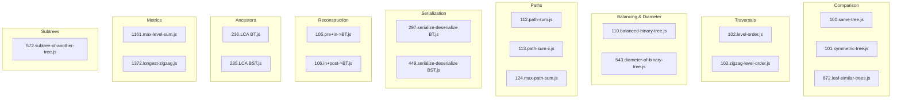
```mermaid
graph TB
subgraph "Comparison"
S1["100.same-tree.js"]
S2["101.symmetric-tree.js"]
S3["872.leaf-similar-trees.js"]
end
subgraph "Traversals"
T1["102.level-order.js"]
T2["103.zigzag-level-order.js"]
end
subgraph "Balancing & Diameter"
B1["110.balanced-binary-tree.js"]
D1["543.diameter-of-binary-tree.js"]
end
subgraph "Paths"
P1["112.path-sum.js"]
P2["113.path-sum-ii.js"]
P3["124.max-path-sum.js"]
end
subgraph "Serialization"
SE1["297.serialize-deserialize BT.js"]
SE2["449.serialize-deserialize BST.js"]
end
subgraph "Reconstruction"
R1["105.pre+in->BT.js"]
R2["106.in+post->BT.js"]
end
subgraph "Ancestors"
A1["236.LCA BT.js"]
A2["235.LCA BST.js"]
end
subgraph "Metrics"
M1["1161.max-level-sum.js"]
M2["1372.longest-zigzag.js"]
end
subgraph "Subtrees"
SUB["572.subtree-of-another-tree.js"]
end
```

**Diagram sources**
- [100.same-tree.js:1-68](file://算法/100.same-tree.js#L1-L68)
- [101.symmetric-tree.js:1-50](file://算法/101.symmetric-tree.js#L1-L50)
- [872.leaf-similar-trees.js:1-200](file://算法/872.leaf-similar-trees.js#L1-L200)
- [102.binary-tree-level-order-traversal.js:1-58](file://算法/102.binary-tree-level-order-traversal.js#L1-L58)
- [103.binary-tree-zigzag-level-order-traversal.js:1-71](file://算法/103.binary-tree-zigzag-level-order-traversal.js#L1-L71)
- [110.balanced-binary-tree.js:1-65](file://算法/110.balanced-binary-tree.js#L1-L65)
- [543.diameter-of-binary-tree.js:1-58](file://算法/543.diameter-of-binary-tree.js#L1-L58)
- [112.path-sum.js:1-200](file://算法/112.path-sum.js#L1-L200)
- [113.path-sum-ii.js:1-200](file://算法/113.path-sum-ii.js#L1-L200)
- [124.binary-tree-maximum-path-sum.js:1-200](file://算法/124.binary-tree-maximum-path-sum.js#L1-L200)
- [297.serialize-and-deserialize-binary-tree.js:1-112](file://算法/297.serialize-and-deserialize-binary-tree.js#L1-L112)
- [449.serialize-and-deserialize-bst.js:1-103](file://算法/449.serialize-and-deserialize-bst.js#L1-L103)
- [105.construct-binary-tree-from-preorder-and-inorder-traversal.js:1-69](file://算法/105.construct-binary-tree-from-preorder-and-inorder-traversal.js#L1-L69)
- [106.construct-binary-tree-from-inorder-and-postorder-traversal.js:1-86](file://算法/106.construct-binary-tree-from-inorder-and-postorder-traversal.js#L1-L86)
- [236.lowest-common-ancestor-of-a-binary-tree.js:1-200](file://算法/236.lowest-common-ancestor-of-a-binary-tree.js#L1-L200)
- [235.lowest-common-ancestor-of-a-binary-search-tree.js:1-200](file://算法/235.lowest-common-ancestor-of-a-binary-search-tree.js#L1-L200)
- [1161.maximum-level-sum-of-a-binary-tree.js:1-200](file://算法/1161.maximum-level-sum-of-a-binary-tree.js#L1-L200)
- [1372.longest-zig-zag-path-in-a-binary-tree.js:1-200](file://算法/1372.longest-zig-zag-path-in-a-binary-tree.js#L1-L200)
- [572.subtree-of-another-tree.js:1-200](file://算法/572.subtree-of-another-tree.js#L1-L200)

**Section sources**
- [100.same-tree.js:1-68](file://算法/100.same-tree.js#L1-L68)
- [101.symmetric-tree.js:1-50](file://算法/101.symmetric-tree.js#L1-L50)
- [102.binary-tree-level-order-traversal.js:1-58](file://算法/102.binary-tree-level-order-traversal.js#L1-L58)
- [103.binary-tree-zigzag-level-order-traversal.js:1-71](file://算法/103.binary-tree-zigzag-level-order-traversal.js#L1-L71)
- [110.balanced-binary-tree.js:1-65](file://算法/110.balanced-binary-tree.js#L1-L65)
- [543.diameter-of-binary-tree.js:1-58](file://算法/543.diameter-of-binary-tree.js#L1-L58)
- [297.serialize-and-deserialize-binary-tree.js:1-112](file://算法/297.serialize-and-deserialize-binary-tree.js#L1-L112)
- [449.serialize-and-deserialize-bst.js:1-103](file://算法/449.serialize-and-deserialize-bst.js#L1-L103)
- [105.construct-binary-tree-from-preorder-and-inorder-traversal.js:1-69](file://算法/105.construct-binary-tree-from-preorder-and-inorder-traversal.js#L1-L69)
- [106.construct-binary-tree-from-inorder-and-postorder-traversal.js:1-86](file://算法/106.construct-binary-tree-from-inorder-and-postorder-traversal.js#L1-L86)
- [112.path-sum.js:1-200](file://算法/112.path-sum.js#L1-L200)
- [113.path-sum-ii.js:1-200](file://算法/113.path-sum-ii.js#L1-L200)
- [124.binary-tree-maximum-path-sum.js:1-200](file://算法/124.binary-tree-maximum-path-sum.js#L1-L200)
- [236.lowest-common-ancestor-of-a-binary-tree.js:1-200](file://算法/236.lowest-common-ancestor-of-a-binary-tree.js#L1-L200)
- [235.lowest-common-ancestor-of-a-binary-search-tree.js:1-200](file://算法/235.lowest-common-ancestor-of-a-binary-search-tree.js#L1-L200)
- [1161.maximum-level-sum-of-a-binary-tree.js:1-200](file://算法/1161.maximum-level-sum-of-a-binary-tree.js#L1-L200)
- [1372.longest-zig-zag-path-in-a-binary-tree.js:1-200](file://算法/1372.longest-zig-zag-path-in-a-binary-tree.js#L1-L200)
- [572.subtree-of-another-tree.js:1-200](file://算法/572.subtree-of-another-tree.js#L1-L200)

## Core Components
- Same tree check: recursive comparison of nodes and subtrees.
- Symmetric tree check: mirror comparison between left and right subtrees.
- Level-order traversal: breadth-first collection of node values per level.
- Zigzag level-order traversal: alternating direction per level.
- Balanced binary tree: depth check ensuring height balance across subtrees.
- Diameter of binary tree: longest path between two nodes via DFS.
- Path sums: existence of root-to-leaf paths with target sum and enumeration of all such paths.
- Maximum path sum: optimal path sum in a binary tree (may be internal).
- Serialization/deserialization: BFS-based encoding/decoding for general BT and BST variants.
- Reconstruct from traversals: building BT from preorder+inorder and inorder+postorder.
- Lowest common ancestors: general and BST-specific approaches.
- Level sums: computing maximum sum among levels.
- Longest zigzag path: alternating-direction path length in a binary tree.
- Subtree operations: determining whether one tree is a subtree of another.

**Section sources**
- [100.same-tree.js:25-31](file://算法/100.same-tree.js#L25-L31)
- [101.symmetric-tree.js:24-36](file://算法/101.symmetric-tree.js#L24-L36)
- [102.binary-tree-level-order-traversal.js:24-41](file://算法/102.binary-tree-level-order-traversal.js#L24-L41)
- [103.binary-tree-zigzag-level-order-traversal.js:24-49](file://算法/103.binary-tree-zigzag-level-order-traversal.js#L24-L49)
- [110.balanced-binary-tree.js:24-44](file://算法/110.balanced-binary-tree.js#L24-L44)
- [543.diameter-of-binary-tree.js:24-44](file://算法/543.diameter-of-binary-tree.js#L24-L44)
- [112.path-sum.js:1-200](file://算法/112.path-sum.js#L1-L200)
- [113.path-sum-ii.js:1-200](file://算法/113.path-sum-ii.js#L1-L200)
- [124.binary-tree-maximum-path-sum.js:1-200](file://算法/124.binary-tree-maximum-path-sum.js#L1-L200)
- [297.serialize-and-deserialize-binary-tree.js:26-82](file://算法/297.serialize-and-deserialize-binary-tree.js#L26-L82)
- [449.serialize-and-deserialize-bst.js:26-82](file://算法/449.serialize-and-deserialize-bst.js#L26-L82)
- [105.construct-binary-tree-from-preorder-and-inorder-traversal.js:30-51](file://算法/105.construct-binary-tree-from-preorder-and-inorder-traversal.js#L30-L51)
- [106.construct-binary-tree-from-inorder-and-postorder-traversal.js:30-68](file://算法/106.construct-binary-tree-from-inorder-and-postorder-traversal.js#L30-L68)
- [236.lowest-common-ancestor-of-a-binary-tree.js:1-200](file://算法/236.lowest-common-ancestor-of-a-binary-tree.js#L1-L200)
- [235.lowest-common-ancestor-of-a-binary-search-tree.js:1-200](file://算法/235.lowest-common-ancestor-of-a-binary-search-tree.js#L1-L200)
- [1161.maximum-level-sum-of-a-binary-tree.js:1-200](file://算法/1161.maximum-level-sum-of-a-binary-tree.js#L1-L200)
- [1372.longest-zig-zag-path-in-a-binary-tree.js:1-200](file://算法/1372.longest-zig-zag-path-in-a-binary-tree.js#L1-L200)
- [572.subtree-of-another-tree.js:1-200](file://算法/572.subtree-of-another-tree.js#L1-L200)

## Architecture Overview
The implementations are self-contained per file, exposing a single primary function per algorithm. There is no cross-file orchestration; each module focuses on a specific operation. The common pattern is:
- Define a TreeNode constructor (when needed)
- Implement the algorithmic function(s)
- Provide example test cases in comments

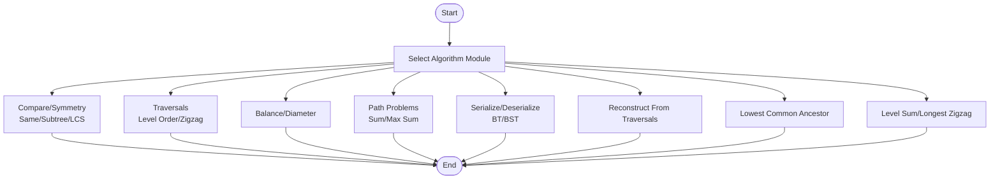
```mermaid
flowchart TD
Start(["Start"]) --> Choose["Select Algorithm Module"]
Choose --> Compare["Compare/Symmetry<br/>Same/Subtree/LCS"]
Choose --> Traverse["Traversals<br/>Level Order/Zigzag"]
Choose --> Balance["Balance/Diameter"]
Choose --> Paths["Path Problems<br/>Sum/Max Sum"]
Choose --> Serialize["Serialize/Deserialize<br/>BT/BST"]
Choose --> Reconstruct["Reconstruct From Traversals"]
Choose --> Ancestors["Lowest Common Ancestor"]
Choose --> Metrics["Level Sum/Longest Zigzag"]
Compare --> End(["End"])
Traverse --> End
Balance --> End
Paths --> End
Serialize --> End
Reconstruct --> End
Ancestors --> End
Metrics --> End
```

[No sources needed since this diagram shows conceptual workflow, not actual code structure]

## Detailed Component Analysis

### Tree Comparison: Same Tree
- Approach: Recursively compare corresponding nodes and their subtrees.
- Complexity: O(min(m,n)) time, O(h) space (h = height).
- Edge cases: null nodes handled explicitly.

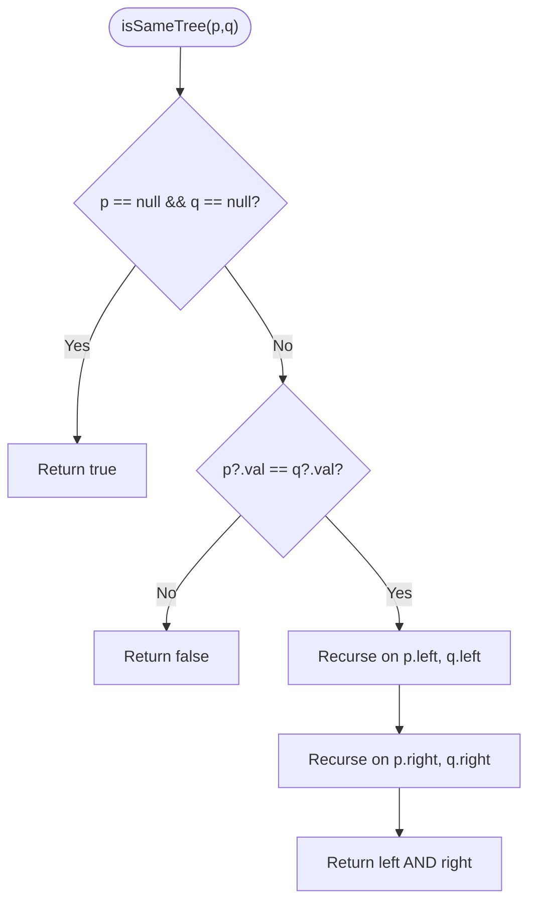
```mermaid
flowchart TD
S(["isSameTree(p,q)"]) --> BothNull{"p == null && q == null?"}
BothNull --> |Yes| TrueRet["Return true"]
BothNull --> |No| ValEq{"p?.val == q?.val?"}
ValEq --> |No| FalseRet["Return false"]
ValEq --> |Yes| RecurseLeft["Recurse on p.left, q.left"]
RecurseLeft --> RecurseRight["Recurse on p.right, q.right"]
RecurseRight --> Combine["Return left AND right"]
```

**Diagram sources**
- [100.same-tree.js:25-31](file://算法/100.same-tree.js#L25-L31)

**Section sources**
- [100.same-tree.js:25-31](file://算法/100.same-tree.js#L25-L31)

### Symmetry Detection
- Approach: Mirror comparison between left and right subtrees by swapping directions.
- Complexity: O(n) time, O(h) space.

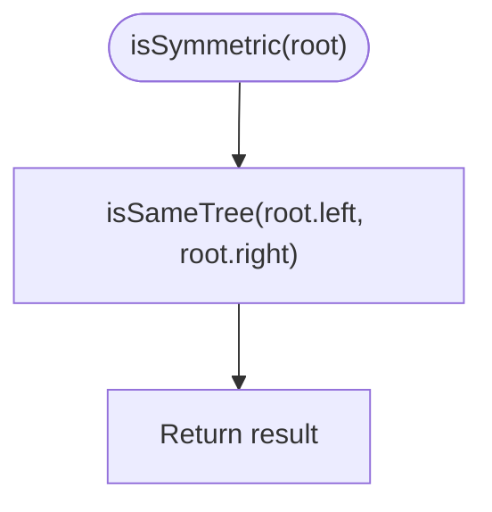
```mermaid
flowchart TD
SS(["isSymmetric(root)"]) --> CallSame["isSameTree(root.left, root.right)"]
CallSame --> Ret["Return result"]
```

**Diagram sources**
- [101.symmetric-tree.js:24-36](file://算法/101.symmetric-tree.js#L24-L36)

**Section sources**
- [101.symmetric-tree.js:24-36](file://算法/101.symmetric-tree.js#L24-L36)

### Level-Order Traversals
- Standard level order: BFS with a queue; collect values per level.
- Zigzag level order: alternate direction per level using push/unshift.

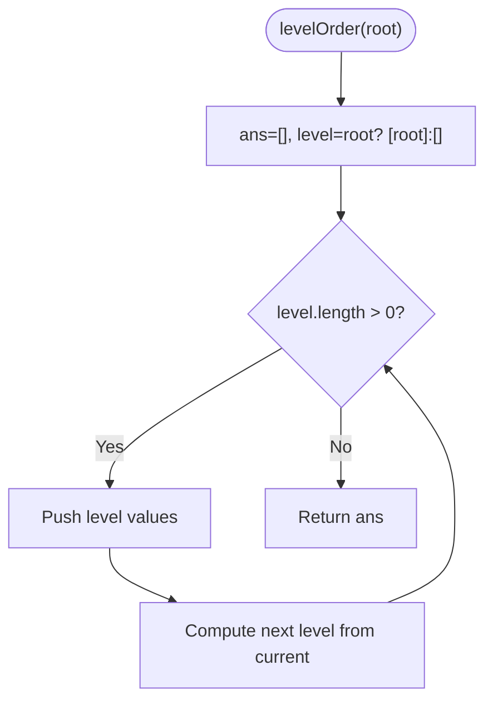
```mermaid
flowchart TD
LO(["levelOrder(root)"]) --> Init["ans=[], level=root? [root]:[]"]
Init --> Loop{"level.length > 0?"}
Loop --> |Yes| PushVals["Push level values"]
PushVals --> NextLevel["Compute next level from current"]
NextLevel --> Loop
Loop --> |No| ReturnLO["Return ans"]
```

**Diagram sources**
- [102.binary-tree-level-order-traversal.js:24-41](file://算法/102.binary-tree-level-order-traversal.js#L24-L41)

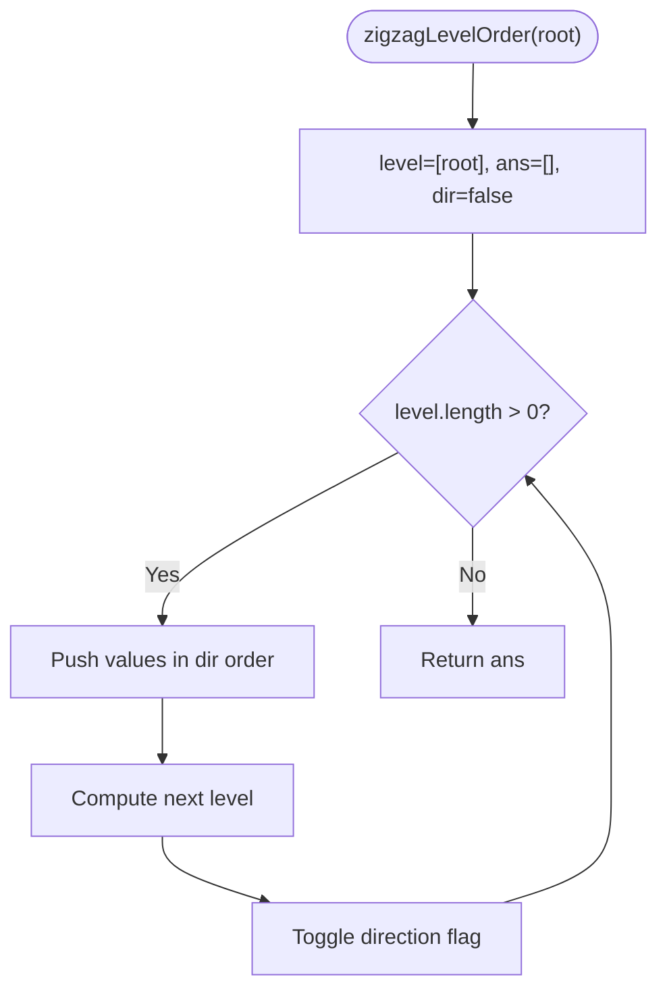
```mermaid
flowchart TD
ZLO(["zigzagLevelOrder(root)"]) --> InitZ["level=[root], ans=[], dir=false"]
InitZ --> LoopZ{"level.length > 0?"}
LoopZ --> |Yes| PushDir["Push values in dir order"]
PushDir --> NextLevelZ["Compute next level"]
NextLevelZ --> Toggle["Toggle direction flag"]
Toggle --> LoopZ
LoopZ --> |No| ReturnZ["Return ans"]
```

**Diagram sources**
- [103.binary-tree-zigzag-level-order-traversal.js:24-49](file://算法/103.binary-tree-zigzag-level-order-traversal.js#L24-L49)

**Section sources**
- [102.binary-tree-level-order-traversal.js:24-41](file://算法/102.binary-tree-level-order-traversal.js#L24-L41)
- [103.binary-tree-zigzag-level-order-traversal.js:24-49](file://算法/103.binary-tree-zigzag-level-order-traversal.js#L24-L49)

### Balanced Binary Tree
- Approach: DFS returning height; check balance condition at each node.
- Complexity: O(n) time, O(h) space.

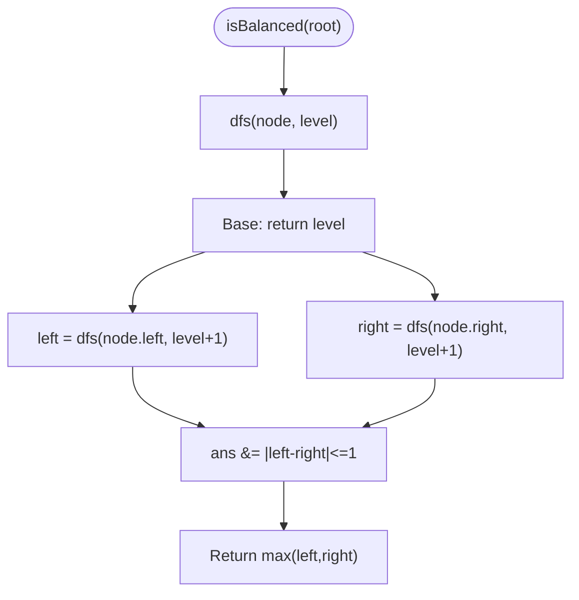
```mermaid
flowchart TD
BB(["isBalanced(root)"]) --> DFS["dfs(node, level)"]
DFS --> Base["Base: return level"]
Base --> RecurseL["left = dfs(node.left, level+1)"]
Base --> RecurseR["right = dfs(node.right, level+1)"]
RecurseL --> CompareB["ans &= |left-right|<=1"]
RecurseR --> CompareB
CompareB --> ReturnH["Return max(left,right)"]
```

**Diagram sources**
- [110.balanced-binary-tree.js:24-44](file://算法/110.balanced-binary-tree.js#L24-L44)

**Section sources**
- [110.balanced-binary-tree.js:24-44](file://算法/110.balanced-binary-tree.js#L24-L44)

### Diameter of Binary Tree
- Approach: DFS computes height; update global diameter as left+right+1.
- Complexity: O(n) time, O(h) space.

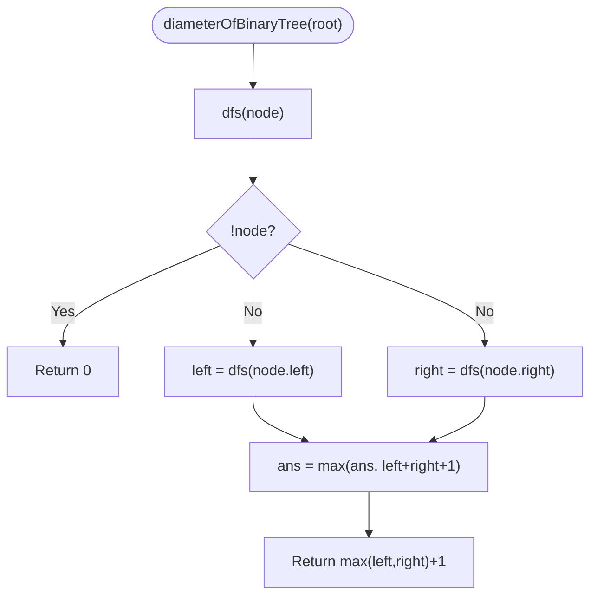
```mermaid
flowchart TD
Dia(["diameterOfBinaryTree(root)"]) --> DFSDia["dfs(node)"]
DFSDia --> NullN{"!node?"}
NullN --> |Yes| Zero["Return 0"]
NullN --> |No| L["left = dfs(node.left)"]
NullN --> |No| R["right = dfs(node.right)"]
L --> Update["ans = max(ans, left+right+1)"]
R --> Update
Update --> Height["Return max(left,right)+1"]
```

**Diagram sources**
- [543.diameter-of-binary-tree.js:24-44](file://算法/543.diameter-of-binary-tree.js#L24-L44)

**Section sources**
- [543.diameter-of-binary-tree.js:24-44](file://算法/543.diameter-of-binary-tree.js#L24-L44)

### Path-Finding Algorithms
- Path Sum I: existence of root-to-leaf path with given sum (DFS/backtracking).
- Path Sum II: collect all such paths (DFS/backtracking).
- Maximum Path Sum: compute maximum sum of any path (can be internal).

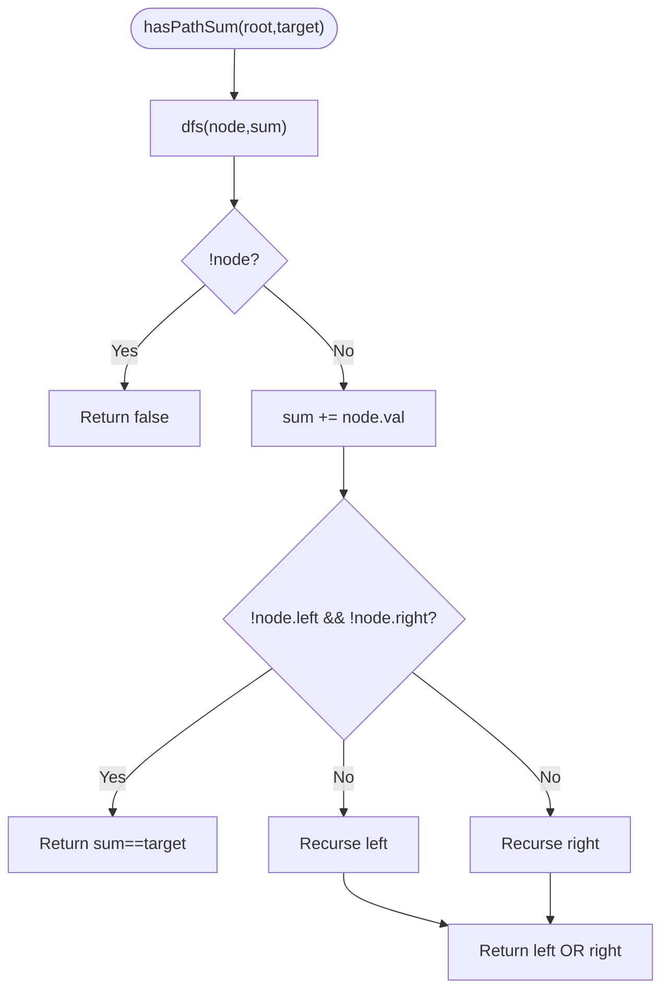
```mermaid
flowchart TD
PS1(["hasPathSum(root,target)"]) --> DFS1["dfs(node,sum)"]
DFS1 --> Leaf{"!node?"}
Leaf --> |Yes| False1["Return false"]
Leaf --> |No| SumAcc["sum += node.val"]
SumAcc --> IsLeaf{"!node.left && !node.right?"}
IsLeaf --> |Yes| CheckT["Return sum==target"]
IsLeaf --> |No| L1["Recurse left"]
IsLeaf --> |No| R1["Recurse right"]
L1 --> OR1["Return left OR right"]
R1 --> OR1
```

**Diagram sources**
- [112.path-sum.js:1-200](file://算法/112.path-sum.js#L1-L200)

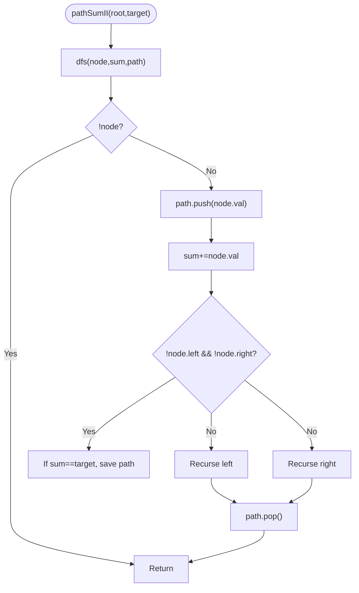
```mermaid
flowchart TD
PS2(["pathSumII(root,target)"]) --> DFS2["dfs(node,sum,path)"]
DFS2 --> Leaf2{"!node?"}
Leaf2 --> |Yes| Ret2["Return"]
Leaf2 --> |No| Push2["path.push(node.val)"]
Push2 --> Acc2["sum+=node.val"]
Acc2 --> IsLeaf2{"!node.left && !node.right?"}
IsLeaf2 --> |Yes| CheckT2["If sum==target, save path"]
IsLeaf2 --> |No| L2["Recurse left"]
IsLeaf2 --> |No| R2["Recurse right"]
L2 --> Pop2["path.pop()"]
R2 --> Pop2
Pop2 --> Ret2
```

**Diagram sources**
- [113.path-sum-ii.js:1-200](file://算法/113.path-sum-ii.js#L1-L200)

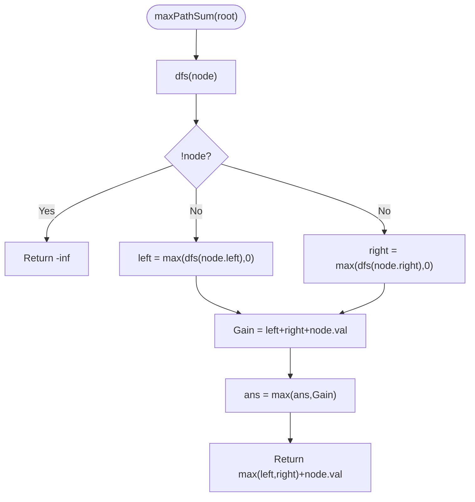
```mermaid
flowchart TD
MPS(["maxPathSum(root)"]) --> DFSM["dfs(node)"]
DFSM --> NullM{"!node?"}
NullM --> |Yes| NegInf["Return -inf"]
NullM --> |No| LM["left = max(dfs(node.left),0)"]
NullM --> |No| RM["right = max(dfs(node.right),0)"]
LM --> Gain["Gain = left+right+node.val"]
RM --> Gain
Gain --> UpdateM["ans = max(ans,Gain)"]
UpdateM --> RetM["Return max(left,right)+node.val"]
```

**Diagram sources**
- [124.binary-tree-maximum-path-sum.js:1-200](file://算法/124.binary-tree-maximum-path-sum.js#L1-L200)

**Section sources**
- [112.path-sum.js:1-200](file://算法/112.path-sum.js#L1-L200)
- [113.path-sum-ii.js:1-200](file://算法/113.path-sum-ii.js#L1-L200)
- [124.binary-tree-maximum-path-sum.js:1-200](file://算法/124.binary-tree-maximum-path-sum.js#L1-L200)

### Serialization and Deserialization
- General binary tree: BFS-based encoding and decoding using queue.
- BST variant: leverages BST property implicitly during reconstruction.

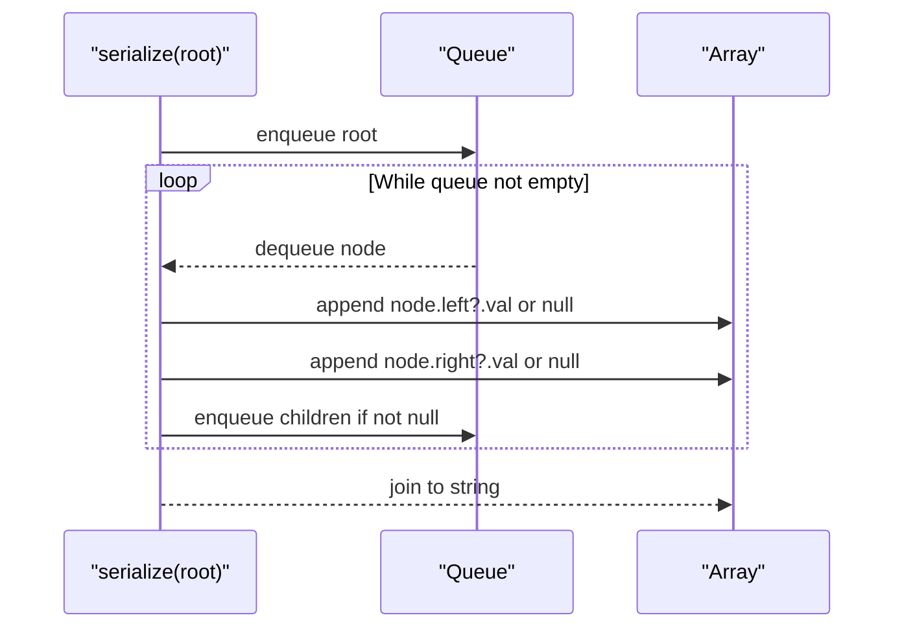
```mermaid
sequenceDiagram
participant Ser as "serialize(root)"
participant Q as "Queue"
participant Arr as "Array"
Ser->>Q : enqueue root
loop While queue not empty
Q-->>Ser : dequeue node
Ser->>Arr : append node.left?.val or null
Ser->>Arr : append node.right?.val or null
Ser->>Q : enqueue children if not null
end
Ser-->>Arr : join to string
```

**Diagram sources**
- [297.serialize-and-deserialize-binary-tree.js:26-44](file://算法/297.serialize-and-deserialize-binary-tree.js#L26-L44)

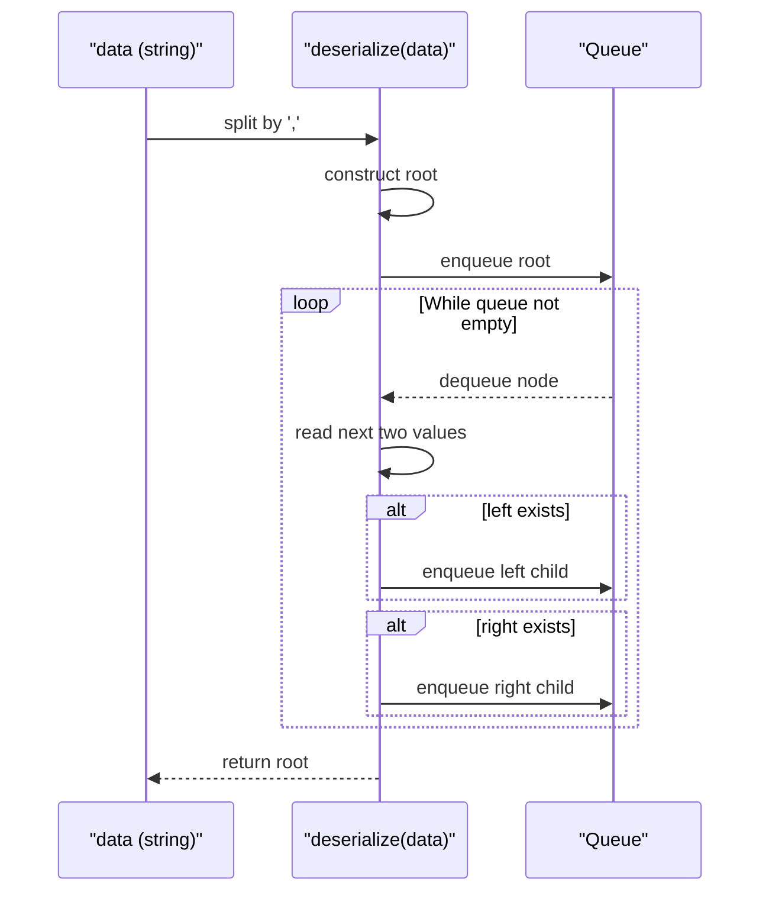
```mermaid
sequenceDiagram
participant Data as "data (string)"
participant Builder as "deserialize(data)"
participant Q as "Queue"
Data->>Builder : split by ','
Builder->>Builder : construct root
Builder->>Q : enqueue root
loop While queue not empty
Q-->>Builder : dequeue node
Builder->>Builder : read next two values
alt left exists
Builder->>Q : enqueue left child
end
alt right exists
Builder->>Q : enqueue right child
end
end
Builder-->>Data : return root
```

**Diagram sources**
- [297.serialize-and-deserialize-binary-tree.js:52-82](file://算法/297.serialize-and-deserialize-binary-tree.js#L52-L82)

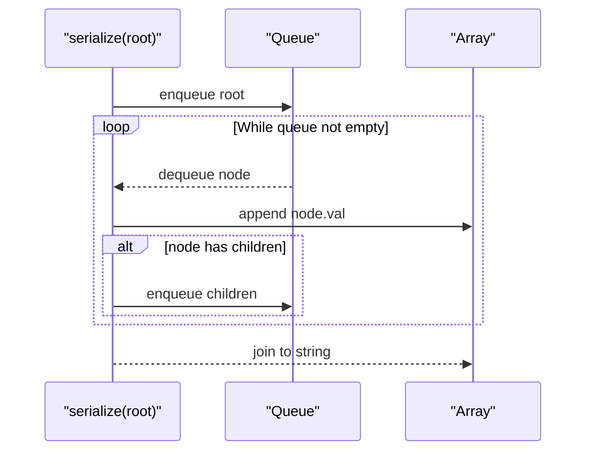
```mermaid
sequenceDiagram
participant SerBST as "serialize(root)"
participant QBST as "Queue"
participant ArrBST as "Array"
SerBST->>QBST : enqueue root
loop While queue not empty
QBST-->>SerBST : dequeue node
SerBST->>ArrBST : append node.val
alt node has children
SerBST->>QBST : enqueue children
end
end
SerBST-->>ArrBST : join to string
```

**Diagram sources**
- [449.serialize-and-deserialize-bst.js:26-46](file://算法/449.serialize-and-deserialize-bst.js#L26-L46)

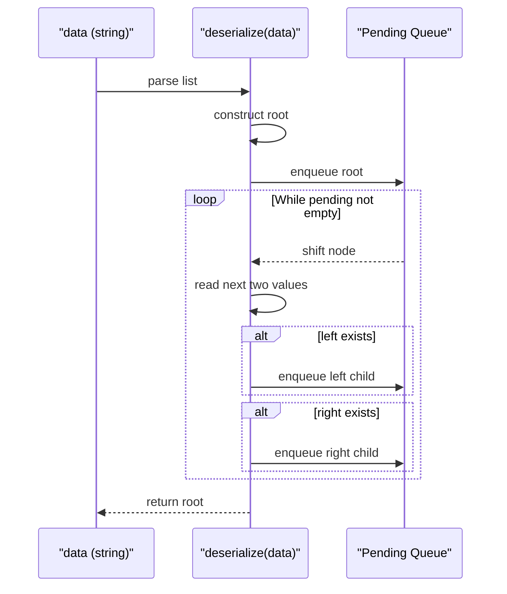
```mermaid
sequenceDiagram
participant DataBST as "data (string)"
participant BuilderBST as "deserialize(data)"
participant Pending as "Pending Queue"
DataBST->>BuilderBST : parse list
BuilderBST->>BuilderBST : construct root
BuilderBST->>Pending : enqueue root
loop While pending not empty
Pending-->>BuilderBST : shift node
BuilderBST->>BuilderBST : read next two values
alt left exists
BuilderBST->>Pending : enqueue left child
end
alt right exists
BuilderBST->>Pending : enqueue right child
end
end
BuilderBST-->>DataBST : return root
```

**Diagram sources**
- [449.serialize-and-deserialize-bst.js:54-82](file://算法/449.serialize-and-deserialize-bst.js#L54-L82)

**Section sources**
- [297.serialize-and-deserialize-binary-tree.js:26-82](file://算法/297.serialize-and-deserialize-binary-tree.js#L26-L82)
- [449.serialize-and-deserialize-bst.js:26-82](file://算法/449.serialize-and-deserialize-bst.js#L26-L82)

### Tree Reconstruction from Traversals
- Preorder + Inorder: root from preorder; partition inorder; recurse.
- Inorder + Postorder: root from postorder; partition inorder; recurse.

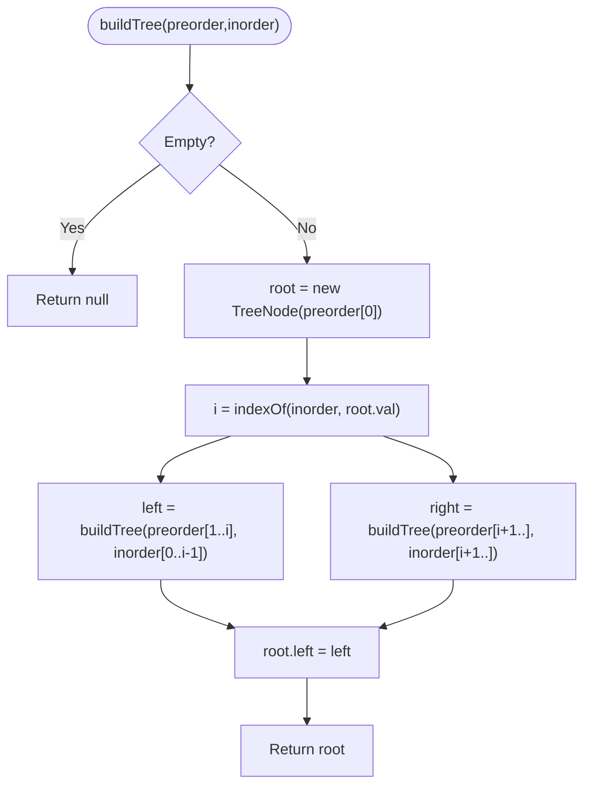
```mermaid
flowchart TD
PI(["buildTree(preorder,inorder)"]) --> Empty{"Empty?"}
Empty --> |Yes| NullPI["Return null"]
Empty --> |No| RootPI["root = new TreeNode(preorder[0])"]
RootPI --> FindPI["i = indexOf(inorder, root.val)"]
FindPI --> LeftPI["left = buildTree(preorder[1..i], inorder[0..i-1])"]
FindPI --> RightPI["right = buildTree(preorder[i+1..], inorder[i+1..])"]
LeftPI --> LinkPI["root.left = left"]
RightPI --> LinkPI
LinkPI --> ReturnPI["Return root"]
```

**Diagram sources**
- [105.construct-binary-tree-from-preorder-and-inorder-traversal.js:30-51](file://算法/105.construct-binary-tree-from-preorder-and-inorder-traversal.js#L30-L51)

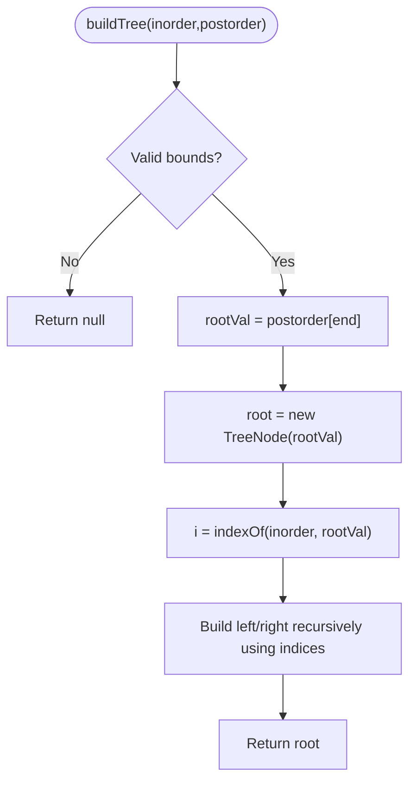
```mermaid
flowchart TD
IP(["buildTree(inorder,postorder)"]) --> Bounds{"Valid bounds?"}
Bounds --> |No| NullIP["Return null"]
Bounds --> |Yes| RootIP["rootVal = postorder[end]"]
RootIP --> MakeRoot["root = new TreeNode(rootVal)"]
MakeRoot --> FindIP["i = indexOf(inorder, rootVal)"]
FindIP --> RecurseIP["Build left/right recursively using indices"]
RecurseIP --> ReturnIP["Return root"]
```

**Diagram sources**
- [106.construct-binary-tree-from-inorder-and-postorder-traversal.js:30-68](file://算法/106.construct-binary-tree-from-inorder-and-postorder-traversal.js#L30-L68)

**Section sources**
- [105.construct-binary-tree-from-preorder-and-inorder-traversal.js:30-51](file://算法/105.construct-binary-tree-from-preorder-and-inorder-traversal.js#L30-L51)
- [106.construct-binary-tree-from-inorder-and-postorder-traversal.js:30-68](file://算法/106.construct-binary-tree-from-inorder-and-postorder-traversal.js#L30-L68)

### Ancestor and Descendant Relationships
- Lowest Common Ancestor (Binary Tree): post-order recursion returning node or null.
- Lowest Common Ancestor (BST): leverage BST ordering to navigate.

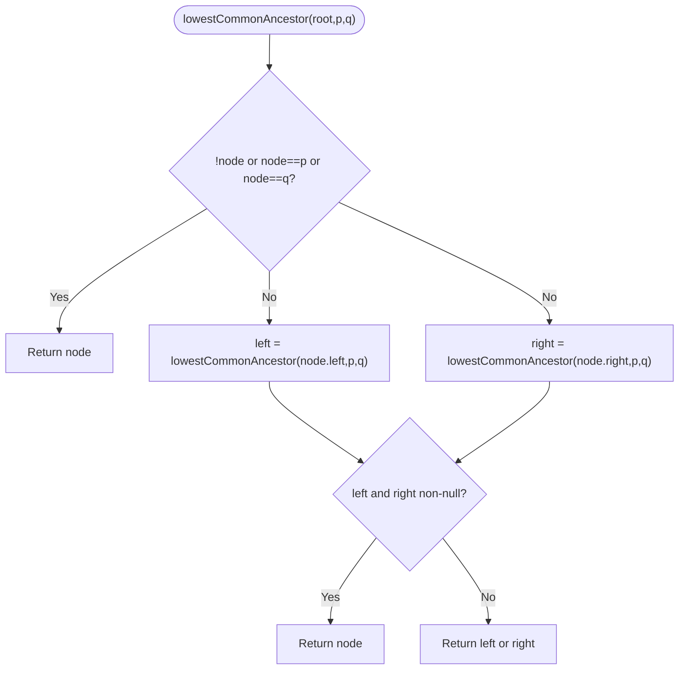
```mermaid
flowchart TD
LCA(["lowestCommonAncestor(root,p,q)"]) --> BaseLCA{"!node or node==p or node==q?"}
BaseLCA --> |Yes| RetLCA["Return node"]
BaseLCA --> |No| LeftLCA["left = lowestCommonAncestor(node.left,p,q)"]
BaseLCA --> |No| RightLCA["right = lowestCommonAncestor(node.right,p,q)"]
LeftLCA --> BothLCA{"left and right non-null?"}
RightLCA --> BothLCA
BothLCA --> |Yes| RetBoth["Return node"]
BothLCA --> |No| OrLCA["Return left or right"]
```

**Diagram sources**
- [236.lowest-common-ancestor-of-a-binary-tree.js:1-200](file://算法/236.lowest-common-ancestor-of-a-binary-tree.js#L1-L200)

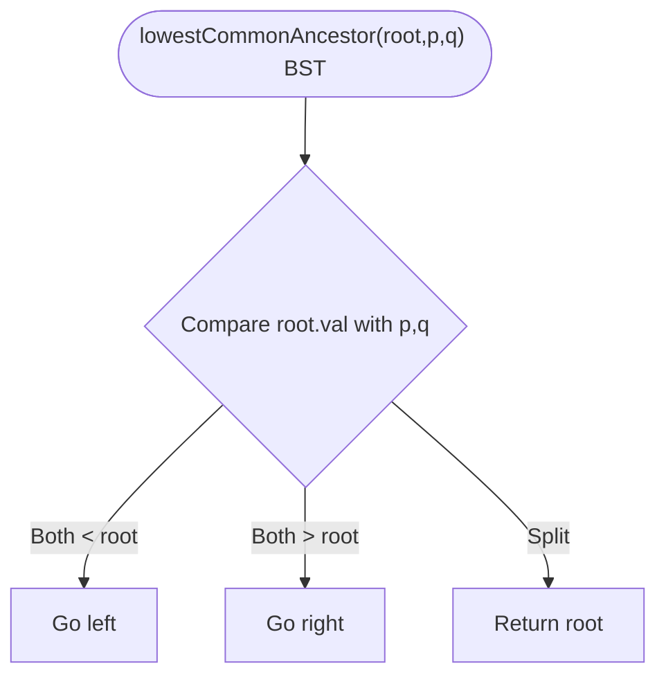
```mermaid
flowchart TD
LCABST(["lowestCommonAncestor(root,p,q) BST"]) --> Navigate{"Compare root.val with p,q"}
Navigate --> |Both < root| GoLeft["Go left"]
Navigate --> |Both > root| GoRight["Go right"]
Navigate --> |Split| RetLCABST["Return root"]
```

**Diagram sources**
- [235.lowest-common-ancestor-of-a-binary-search-tree.js:1-200](file://算法/235.lowest-common-ancestor-of-a-binary-search-tree.js#L1-L200)

**Section sources**
- [236.lowest-common-ancestor-of-a-binary-tree.js:1-200](file://算法/236.lowest-common-ancestor-of-a-binary-tree.js#L1-L200)
- [235.lowest-common-ancestor-of-a-binary-search-tree.js:1-200](file://算法/235.lowest-common-ancestor-of-a-binary-search-tree.js#L1-L200)

### Tree Metrics
- Maximum level sum: BFS to compute per-level sums; track maximum.
- Longest zigzag path: DFS tracking max length with directional constraints.

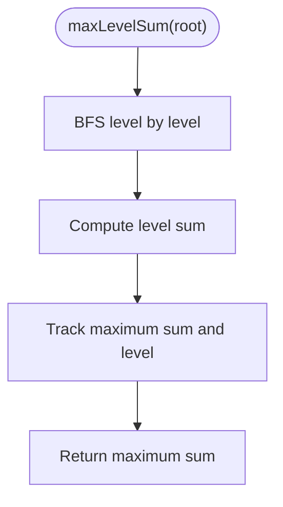
```mermaid
flowchart TD
MLS(["maxLevelSum(root)"]) --> BFSMLS["BFS level by level"]
BFSMLS --> SumMLS["Compute level sum"]
SumMLS --> TrackMLS["Track maximum sum and level"]
TrackMLS --> ReturnMLS["Return maximum sum"]
```

**Diagram sources**
- [1161.maximum-level-sum-of-a-binary-tree.js:1-200](file://算法/1161.maximum-level-sum-of-a-binary-tree.js#L1-L200)

```mermaid
flowchart TD
LZP(["longestZigZag(root)"]) --> DFSZ["dfs(node, dir, len)"]
DFSZ --> NullZ{"!node?"}
NullZ --> |Yes| ZeroZ["Return 0"]
NullZ --> |No| TryLeft["Try left with opposite dir"]
NullZ --> |No| TryRight["Try right with opposite dir"]
TryLeft --> MaxLen["ans = max(ans,len)"]
TryRight --> MaxLen
MaxLen --> ReturnZ["Return ans"]
```

**Diagram sources**
- [1372.longest-zig-zag-path-in-a-binary-tree.js:1-200](file://算法/1372.longest-zig-zag-path-in-a-binary-tree.js#L1-L200)

**Section sources**
- [1161.maximum-level-sum-of-a-binary-tree.js:1-200](file://算法/1161.maximum-level-sum-of-a-binary-tree.js#L1-L200)
- [1372.longest-zig-zag-path-in-a-binary-tree.js:1-200](file://算法/1372.longest-zig-zag-path-in-a-binary-tree.js#L1-L200)

### Subtree Operations
- Subtree of another tree: check if one tree equals any subtree of the other.

```mermaid
flowchart TD
Sub(["isSubtree(root, subRoot)"]) --> SameCheck["isSameTree(root, subRoot)"]
SameCheck --> |True| TrueSub["Return true"]
SameCheck --> |False| RecurseSub["Recurse on left/right"]
RecurseSub --> CombineSub["Return left OR right"]
```

**Diagram sources**
- [572.subtree-of-another-tree.js:1-200](file://算法/572.subtree-of-another-tree.js#L1-L200)

**Section sources**
- [572.subtree-of-another-tree.js:1-200](file://算法/572.subtree-of-another-tree.js#L1-L200)

## Dependency Analysis
- Internal dependencies: None across files; each module is self-contained.
- Coupling: Low; functions operate on local state and arguments.
- Cohesion: High; each file focuses on a single algorithmic concern.

```mermaid
graph LR
Same["100.same-tree.js"] --> CompSym["101.symmetric-tree.js"]
Level["102.level-order.js"] --> Zig["103.zigzag-level-order.js"]
Bal["110.balanced-binary-tree.js"] --> Dia["543.diameter-of-binary-tree.js"]
Ser["297.serialize-deserialize BT.js"] --> SerBST["449.serialize-deserialize BST.js"]
PreIn["105.pre+in->BT.js"] --> InPost["106.in+post->BT.js"]
Path1["112.path-sum.js"] --> Path2["113.path-sum-ii.js"]
Path2 --> MaxPS["124.max-path-sum.js"]
LCA["236.LCA BT.js"] --> LCABST["235.LCA BST.js"]
Metrics1["1161.max-level-sum.js"] --> LZ["1372.longest-zigzag.js"]
Sub["572.subtree.js"] --> Same
```

**Diagram sources**
- [100.same-tree.js:1-68](file://算法/100.same-tree.js#L1-L68)
- [101.symmetric-tree.js:1-50](file://算法/101.symmetric-tree.js#L1-L50)
- [102.binary-tree-level-order-traversal.js:1-58](file://算法/102.binary-tree-level-order-traversal.js#L1-L58)
- [103.binary-tree-zigzag-level-order-traversal.js:1-71](file://算法/103.binary-tree-zigzag-level-order-traversal.js#L1-L71)
- [110.balanced-binary-tree.js:1-65](file://算法/110.balanced-binary-tree.js#L1-L65)
- [543.diameter-of-binary-tree.js:1-58](file://算法/543.diameter-of-binary-tree.js#L1-L58)
- [297.serialize-and-deserialize-binary-tree.js:1-112](file://算法/297.serialize-and-deserialize-binary-tree.js#L1-L112)
- [449.serialize-and-deserialize-bst.js:1-103](file://算法/449.serialize-and-deserialize-bst.js#L1-L103)
- [105.construct-binary-tree-from-preorder-and-inorder-traversal.js:1-69](file://算法/105.construct-binary-tree-from-preorder-and-inorder-traversal.js#L1-L69)
- [106.construct-binary-tree-from-inorder-and-postorder-traversal.js:1-86](file://算法/106.construct-binary-tree-from-inorder-and-postorder-traversal.js#L1-L86)
- [112.path-sum.js:1-200](file://算法/112.path-sum.js#L1-L200)
- [113.path-sum-ii.js:1-200](file://算法/113.path-sum-ii.js#L1-L200)
- [124.binary-tree-maximum-path-sum.js:1-200](file://算法/124.binary-tree-maximum-path-sum.js#L1-L200)
- [236.lowest-common-ancestor-of-a-binary-tree.js:1-200](file://算法/236.lowest-common-ancestor-of-a-binary-tree.js#L1-L200)
- [235.lowest-common-ancestor-of-a-binary-search-tree.js:1-200](file://算法/235.lowest-common-ancestor-of-a-binary-search-tree.js#L1-L200)
- [1161.maximum-level-sum-of-a-binary-tree.js:1-200](file://算法/1161.maximum-level-sum-of-a-binary-tree.js#L1-L200)
- [1372.longest-zig-zag-path-in-a-binary-tree.js:1-200](file://算法/1372.longest-zig-zag-path-in-a-binary-tree.js#L1-L200)
- [572.subtree-of-another-tree.js:1-200](file://算法/572.subtree-of-another-tree.js#L1-L200)

## Performance Considerations
- Prefer iterative solutions when recursion depth is a concern (e.g., deep trees).
- For traversal-heavy tasks, use queues/arrays judiciously to avoid excessive memory copies.
- When reconstructing trees from traversals, precompute indices for inorder to achieve linear-time partitioning.
- For serialization, choose compact encodings and avoid unnecessary conversions.

[No sources needed since this section provides general guidance]

## Troubleshooting Guide
- Null pointer errors: Always guard against null nodes in recursive functions.
- Off-by-one errors in diameter/path computations: Remember to convert node counts to edge counts when required.
- Traversal order confusion: Clearly distinguish preorder/inorder/postorder roles when reconstructing.
- Serialization format mismatches: Ensure consistent parsing and type conversion for deserialization.

**Section sources**
- [100.same-tree.js:25-31](file://算法/100.same-tree.js#L25-L31)
- [543.diameter-of-binary-tree.js:42-44](file://算法/543.diameter-of-binary-tree.js#L42-L44)
- [105.construct-binary-tree-from-preorder-and-inorder-traversal.js:30-51](file://算法/105.construct-binary-tree-from-preorder-and-inorder-traversal.js#L30-L51)
- [106.construct-binary-tree-from-inorder-and-postorder-traversal.js:30-68](file://算法/106.construct-binary-tree-from-inorder-and-postorder-traversal.js#L30-L68)
- [297.serialize-and-deserialize-binary-tree.js:52-82](file://算法/297.serialize-and-deserialize-binary-tree.js#L52-L82)
- [449.serialize-and-deserialize-bst.js:54-82](file://算法/449.serialize-and-deserialize-bst.js#L54-L82)

## Conclusion
The repository provides robust, modular implementations of essential tree algorithms. Each module adheres to clear patterns—recursive decomposition, BFS/queues for traversals, and careful handling of edge cases—yielding efficient and maintainable solutions. These implementations serve as strong foundations for further customization and extension.

[No sources needed since this section summarizes without analyzing specific files]

## Appendices
- Complexity summary:
  - Same tree, symmetric tree, balanced check, diameter, path sums, LCA, level sums, longest zigzag: O(n) time, O(h) space.
  - Level-order and zigzag traversals: O(n) time, O(w) space (w = max width).
  - Serialization/deserialization: O(n) time, O(n) space.
  - Reconstruction from traversals: O(n^2) worst-case without index map; O(n) with hashmap.

[No sources needed since this section provides general guidance]