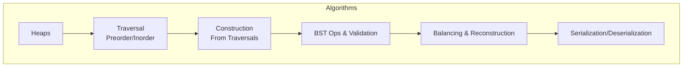
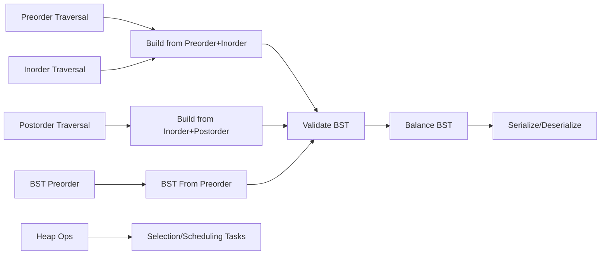
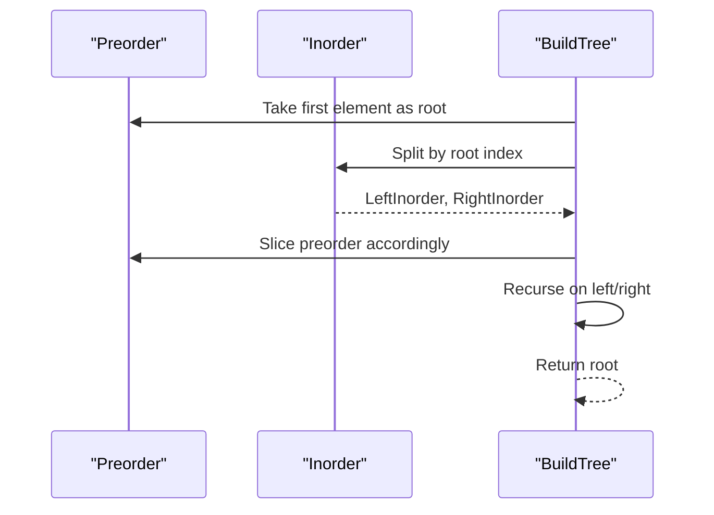
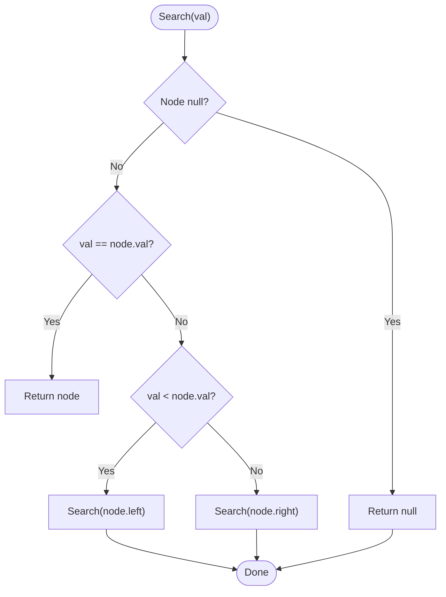
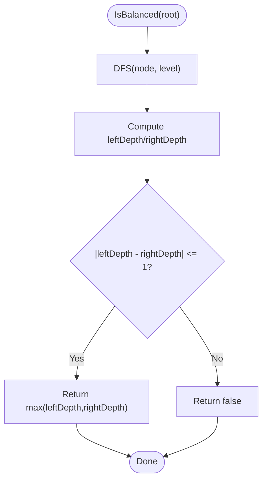
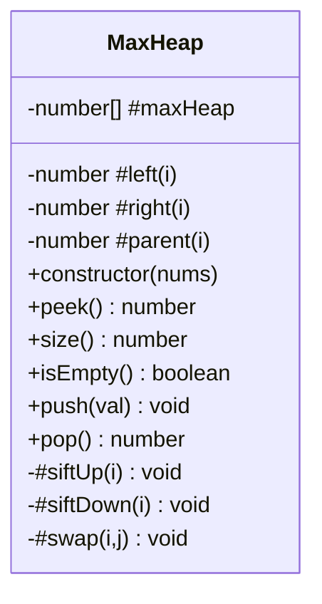
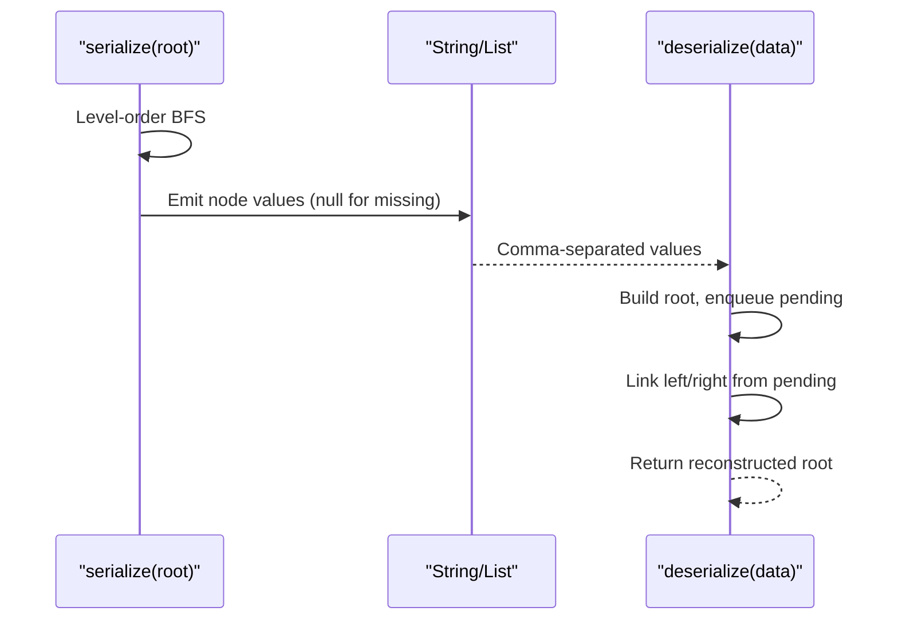
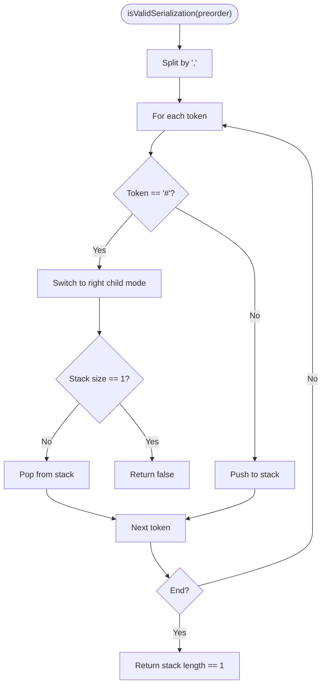
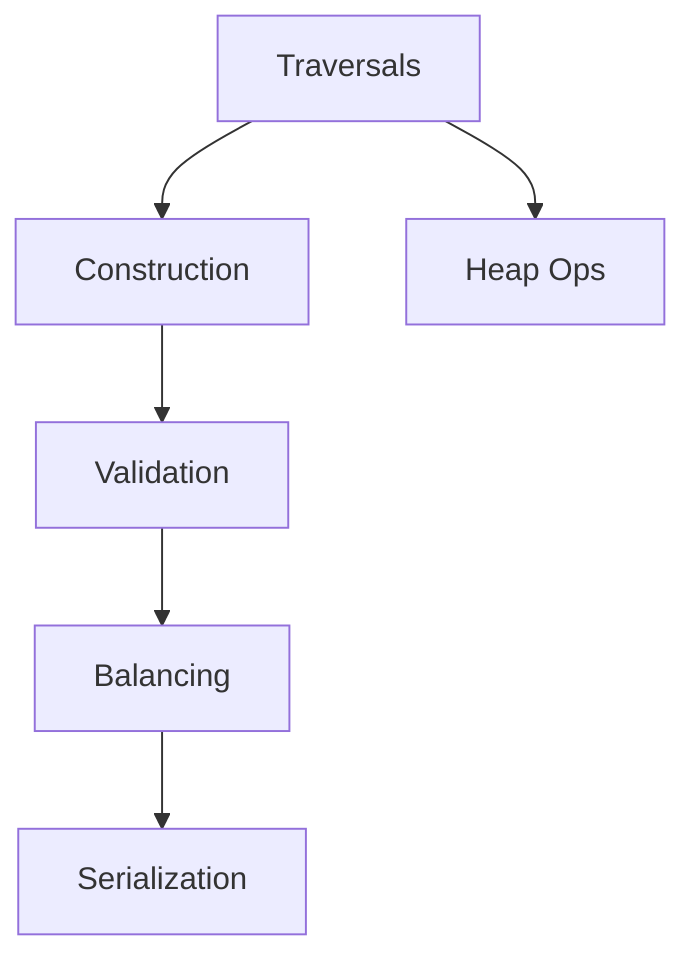

# Trees and Binary Trees

<cite>
**Referenced Files in This Document**
- [144.binary-tree-preorder-traversal.js](file://算法/144.binary-tree-preorder-traversal.js)
- [94.binary-tree-inorder-traversal.js](file://算法/94.binary-tree-inorder-traversal.js)
- [105.construct-binary-tree-from-preorder-and-inorder-traversal.js](file://算法/105.construct-binary-tree-from-preorder-and-inorder-traversal.js)
- [106.construct-binary-tree-from-inorder-and-postorder-traversal.js](file://算法/106.construct-binary-tree-from-inorder-and-postorder-traversal.js)
- [1008.construct-binary-search-tree-from-preorder-traversal.js](file://算法/1008.construct-binary-search-tree-from-preorder-traversal.js)
- [700.search-in-a-binary-search-tree.js](file://算法/700.search-in-a-binary-search-tree.js)
- [1382.balance-a-binary-search-tree.js](file://算法/1382.balance-a-binary-search-tree.js)
- [110.balanced-binary-tree.js](file://算法/110.balanced-binary-tree.js)
- [98.validate-binary-search-tree.ts](file://算法/98.validate-binary-search-tree.ts)
- [449.serialize-and-deserialize-bst.js](file://算法/449.serialize-and-deserialize-bst.js)
- [331.verify-preorder-serialization-of-a-binary-tree.js](file://算法/331.verify-preorder-serialization-of-a-binary-tree.js)
- [1046.last-stone-weight.js](file://算法/1046.last-stone-weight.js)
- [1337.the-k-weakest-rows-in-a-matrix.js](file://算法/1337.the-k-weakest-rows-in-a-matrix.js)
- [1054.distant-barcodes.js](file://算法/1054.distant-barcodes.js)
- [23.merge-k-sorted-lists.js](file://算法/23.merge-k-sorted-lists.js)
- [222.count-complete-tree-nodes.js](file://算法/222.count-complete-tree-nodes.js)
- [1261.find-elements-in-a-contaminated-binary-tree.js](file://算法/1261.find-elements-in-a-contaminated-binary-tree.js)
- [589.n-ary-tree-preorder-traversal.js](file://算法/589.n-ary-tree-preorder-traversal.js)
</cite>

## Table of Contents
1. [Introduction](#introduction)
2. [Project Structure](#project-structure)
3. [Core Components](#core-components)
4. [Architecture Overview](#architecture-overview)
5. [Detailed Component Analysis](#detailed-component-analysis)
6. [Dependency Analysis](#dependency-analysis)
7. [Performance Considerations](#performance-considerations)
8. [Troubleshooting Guide](#troubleshooting-guide)
9. [Conclusion](#conclusion)
10. [Appendices](#appendices)

## Introduction
This document focuses on tree data structures with emphasis on binary trees, binary search trees (BST), balanced BSTs, and heaps. It consolidates traversal algorithms (preorder, inorder, postorder, level-order), construction and modification operations, BST properties and balancing, search/insert/delete complexities, serialization and deserialization, path finding, and tree reconstruction. It also covers memory representation, recursion versus iteration, and visualization techniques grounded in the repository’s implementations.

## Project Structure
The repository organizes tree-related problems primarily under the algorithm directory. Representative files demonstrate traversal, construction from traversals, BST validation and balancing, heap-based operations, and serialization/deserialization.

[No sources needed since this diagram shows conceptual workflow, not actual code structure]

## Core Components
- Tree traversal patterns: recursive and iterative stacks for inorder; recursive preorder; level-order via queues.
- Construction from traversals: preorder+inorder, inorder+postorder, and BST-specific preorder reconstruction.
- BST validation and balancing: inorder monotonic check, in-order extraction followed by divide-and-conquer rebalancing.
- Heap operations: max-heap with sift-up/sift-down, supporting selection tasks.
- Serialization/deserialization: array-based level-order encoding/decoding for BST.
- Path finding and reconstruction: DFS-based set membership and tree reconstruction from traversal sequences.

**Section sources**
- [144.binary-tree-preorder-traversal.js:24-39](file://算法/144.binary-tree-preorder-traversal.js#L24-L39)
- [94.binary-tree-inorder-traversal.js:24-50](file://算法/94.binary-tree-inorder-traversal.js#L24-L50)
- [105.construct-binary-tree-from-preorder-and-inorder-traversal.js:46-52](file://算法/105.construct-binary-tree-from-preorder-and-inorder-traversal.js#L46-L52)
- [106.construct-binary-tree-from-inorder-and-postorder-traversal.js:13-52](file://算法/106.construct-binary-tree-from-inorder-and-postorder-traversal.js#L13-L52)
- [1008.construct-binary-search-tree-from-preorder-traversal.js:24-48](file://算法/1008.construct-binary-search-tree-from-preorder-traversal.js#L24-L48)
- [700.search-in-a-binary-search-tree.js:25-39](file://算法/700.search-in-a-binary-search-tree.js#L25-L39)
- [98.validate-binary-search-tree.ts:26-50](file://算法/98.validate-binary-search-tree.ts#L26-L50)
- [1382.balance-a-binary-search-tree.js:24-52](file://算法/1382.balance-a-binary-search-tree.js#L24-L52)
- [449.serialize-and-deserialize-bst.js:26-63](file://算法/449.serialize-and-deserialize-bst.js#L26-L63)
- [331.verify-preorder-serialization-of-a-binary-tree.js:16-50](file://算法/331.verify-preorder-serialization-of-a-binary-tree.js#L16-L50)
- [1046.last-stone-weight.js:54-147](file://算法/1046.last-stone-weight.js#L54-L147)
- [1337.the-k-weakest-rows-in-a-matrix.js:59-150](file://算法/1337.the-k-weakest-rows-in-a-matrix.js#L59-L150)
- [1054.distant-barcodes.js:63-149](file://算法/1054.distant-barcodes.js#L63-L149)
- [23.merge-k-sorted-lists.js:66-153](file://算法/23.merge-k-sorted-lists.js#L66-L153)

## Architecture Overview
The implementations form a cohesive pipeline:
- Traversal routines feed into construction routines.
- BST validation ensures correctness prior to balancing.
- Serialization leverages traversal-derived encodings.
- Heaps support efficient selection and scheduling tasks.

**Diagram sources**
- [105.construct-binary-tree-from-preorder-and-inorder-traversal.js:46-52](file://算法/105.construct-binary-tree-from-preorder-and-inorder-traversal.js#L46-L52)
- [106.construct-binary-tree-from-inorder-and-postorder-traversal.js:13-52](file://算法/106.construct-binary-tree-from-inorder-and-postorder-traversal.js#L13-L52)
- [1008.construct-binary-search-tree-from-preorder-traversal.js:24-48](file://算法/1008.construct-binary-search-tree-from-preorder-traversal.js#L24-L48)
- [98.validate-binary-search-tree.ts:26-50](file://算法/98.validate-binary-search-tree.ts#L26-L50)
- [1382.balance-a-binary-search-tree.js:24-52](file://算法/1382.balance-a-binary-search-tree.js#L24-L52)
- [449.serialize-and-deserialize-bst.js:26-63](file://算法/449.serialize-and-deserialize-bst.js#L26-L63)
- [1046.last-stone-weight.js:54-147](file://算法/1046.last-stone-weight.js#L54-L147)

## Detailed Component Analysis

### Traversal Algorithms
- Preorder traversal: recursive depth-first visit order.
- Inorder traversal: iterative stack-based approach with direction tracking.
- Level-order traversal: queue-based breadth-first enumeration.

```mermaid
flowchart TD
Start(["Start Traversal"]) --> Choose{"Type?"}
Choose --> |Preorder| Pre["Visit Root -> Left -> Right"]
Choose --> |Inorder| In["Go Left until Null<br/>Pop Stack, Visit, Go Right"]
Choose --> |Level-order| Lo["Enqueue Root<br/>While Queue not empty:<br/>Dequeue, Visit,<br/>Enqueue Children"]
Pre --> End(["Done"])
In --> End
Lo --> End
```

**Diagram sources**
- [144.binary-tree-preorder-traversal.js:24-39](file://算法/144.binary-tree-preorder-traversal.js#L24-L39)
- [94.binary-tree-inorder-traversal.js:46-50](file://算法/94.binary-tree-inorder-traversal.js#L46-L50)

**Section sources**
- [144.binary-tree-preorder-traversal.js:24-39](file://算法/144.binary-tree-preorder-traversal.js#L24-L39)
- [94.binary-tree-inorder-traversal.js:24-50](file://算法/94.binary-tree-inorder-traversal.js#L24-L50)

### Tree Construction from Traversals
- Construct from preorder + inorder: split inorder by root to recursively build subtrees.
- Construct from inorder + postorder: split inorder by last postorder element to recursively build subtrees.
- Construct BST from preorder: partition remaining elements into left subtree (smaller) and right subtree (larger) using binary search-like partitioning.

**Diagram sources**
- [105.construct-binary-tree-from-preorder-and-inorder-traversal.js:46-52](file://算法/105.construct-binary-tree-from-preorder-and-inorder-traversal.js#L46-L52)

**Section sources**
- [105.construct-binary-tree-from-preorder-and-inorder-traversal.js:46-52](file://算法/105.construct-binary-tree-from-preorder-and-inorder-traversal.js#L46-L52)
- [106.construct-binary-tree-from-inorder-and-postorder-traversal.js:13-52](file://算法/106.construct-binary-tree-from-inorder-and-postorder-traversal.js#L13-L52)
- [1008.construct-binary-search-tree-from-preorder-traversal.js:24-48](file://算法/1008.construct-binary-search-tree-from-preorder-traversal.js#L24-L48)

### BST Properties, Search, Insert, Delete
- Search: leverage BST property to traverse left/right until match or null.
- Validation: inorder traversal yields strictly increasing sequence; verify monotonicity.
- Balancing: extract sorted nodes via inorder, then rebuild a height-balanced tree by selecting median as root.

**Diagram sources**
- [700.search-in-a-binary-search-tree.js:25-39](file://算法/700.search-in-a-binary-search-tree.js#L25-L39)

**Section sources**
- [700.search-in-a-binary-search-tree.js:25-39](file://算法/700.search-in-a-binary-search-tree.js#L25-L39)
- [98.validate-binary-search-tree.ts:26-50](file://算法/98.validate-binary-search-tree.ts#L26-L50)
- [1382.balance-a-binary-search-tree.js:24-52](file://算法/1382.balance-a-binary-search-tree.js#L24-L52)

### Balanced Binary Trees
- Height-balance check: compute depths recursively and compare absolute difference.
- Rebalancing: inorder traversal to collect nodes, then divide-and-conquer to construct a balanced BST.

**Diagram sources**
- [110.balanced-binary-tree.js:24-44](file://算法/110.balanced-binary-tree.js#L24-L44)
- [1382.balance-a-binary-search-tree.js:29-51](file://算法/1382.balance-a-binary-search-tree.js#L29-L51)

**Section sources**
- [110.balanced-binary-tree.js:24-44](file://算法/110.balanced-binary-tree.js#L24-L44)
- [1382.balance-a-binary-search-tree.js:24-52](file://算法/1382.balance-a-binary-search-tree.js#L24-L52)

### Heap Structures
- Max-heap with sift-up and sift-down operations.
- Index helpers for parent/left/right.
- Typical use cases: selection of k largest/smallest elements, priority scheduling.

**Diagram sources**
- [1046.last-stone-weight.js:54-147](file://算法/1046.last-stone-weight.js#L54-L147)
- [1337.the-k-weakest-rows-in-a-matrix.js:59-150](file://算法/1337.the-k-weakest-rows-in-a-matrix.js#L59-L150)
- [1054.distant-barcodes.js:63-149](file://算法/1054.distant-barcodes.js#L63-L149)
- [23.merge-k-sorted-lists.js:66-153](file://算法/23.merge-k-sorted-lists.js#L66-L153)

**Section sources**
- [1046.last-stone-weight.js:54-147](file://算法/1046.last-stone-weight.js#L54-L147)
- [1337.the-k-weakest-rows-in-a-matrix.js:59-150](file://算法/1337.the-k-weakest-rows-in-a-matrix.js#L59-L150)
- [1054.distant-barcodes.js:63-149](file://算法/1054.distant-barcodes.js#L63-L149)
- [23.merge-k-sorted-lists.js:66-153](file://算法/23.merge-k-sorted-lists.js#L66-L153)

### Serialization and Deserialization
- Serialize BST using level-order traversal with explicit null markers.
- Deserialize by reconstructing nodes level by level and linking children.

**Diagram sources**
- [449.serialize-and-deserialize-bst.js:26-63](file://算法/449.serialize-and-deserialize-bst.js#L26-L63)

**Section sources**
- [449.serialize-and-deserialize-bst.js:26-63](file://算法/449.serialize-and-deserialize-bst.js#L26-L63)

### Path Finding and Tree Reconstruction
- Verify preorder serialization using a stack and directional state.
- Count nodes in a complete binary tree using height detection and leaf counting.
- Find elements in contaminated trees using DFS to restore values and maintain a lookup set.

**Diagram sources**
- [331.verify-preorder-serialization-of-a-binary-tree.js:16-50](file://算法/331.verify-preorder-serialization-of-a-binary-tree.js#L16-L50)

**Section sources**
- [331.verify-preorder-serialization-of-a-binary-tree.js:16-50](file://算法/331.verify-preorder-serialization-of-a-binary-tree.js#L16-L50)
- [222.count-complete-tree-nodes.js:24-54](file://算法/222.count-complete-tree-nodes.js#L24-L54)
- [1261.find-elements-in-a-contaminated-binary-tree.js:23-46](file://算法/1261.find-elements-in-a-contaminated-binary-tree.js#L23-L46)

### N-ary Tree Traversal
- N-ary preorder traversal using a queue to process children in reverse order.

**Section sources**
- [589.n-ary-tree-preorder-traversal.js:24-37](file://算法/589.n-ary-tree-preorder-traversal.js#L24-L37)

## Dependency Analysis
- Traversal routines are foundational for construction and validation.
- Construction depends on traversal pairs (pre+in, in+post) and BST-specific preorder.
- Validation precedes balancing to ensure correctness.
- Serialization relies on traversal-derived encodings.
- Heaps are self-contained but commonly used in selection tasks.

**Diagram sources**
- [144.binary-tree-preorder-traversal.js:24-39](file://算法/144.binary-tree-preorder-traversal.js#L24-L39)
- [94.binary-tree-inorder-traversal.js:24-50](file://算法/94.binary-tree-inorder-traversal.js#L24-L50)
- [105.construct-binary-tree-from-preorder-and-inorder-traversal.js:46-52](file://算法/105.construct-binary-tree-from-preorder-and-inorder-traversal.js#L46-L52)
- [106.construct-binary-tree-from-inorder-and-postorder-traversal.js:13-52](file://算法/106.construct-binary-tree-from-inorder-and-postorder-traversal.js#L13-L52)
- [1008.construct-binary-search-tree-from-preorder-traversal.js:24-48](file://算法/1008.construct-binary-search-tree-from-preorder-traversal.js#L24-L48)
- [98.validate-binary-search-tree.ts:26-50](file://算法/98.validate-binary-search-tree.ts#L26-L50)
- [1382.balance-a-binary-search-tree.js:24-52](file://算法/1382.balance-a-binary-search-tree.js#L24-L52)
- [449.serialize-and-deserialize-bst.js:26-63](file://算法/449.serialize-and-deserialize-bst.js#L26-L63)
- [1046.last-stone-weight.js:54-147](file://算法/1046.last-stone-weight.js#L54-L147)

**Section sources**
- [144.binary-tree-preorder-traversal.js:24-39](file://算法/144.binary-tree-preorder-traversal.js#L24-L39)
- [94.binary-tree-inorder-traversal.js:24-50](file://算法/94.binary-tree-inorder-traversal.js#L24-L50)
- [105.construct-binary-tree-from-preorder-and-inorder-traversal.js:46-52](file://算法/105.construct-binary-tree-from-preorder-and-inorder-traversal.js#L46-L52)
- [106.construct-binary-tree-from-inorder-and-postorder-traversal.js:13-52](file://算法/106.construct-binary-tree-from-inorder-and-postorder-traversal.js#L13-L52)
- [1008.construct-binary-search-tree-from-preorder-traversal.js:24-48](file://算法/1008.construct-binary-search-tree-from-preorder-traversal.js#L24-L48)
- [98.validate-binary-search-tree.ts:26-50](file://算法/98.validate-binary-search-tree.ts#L26-L50)
- [1382.balance-a-binary-search-tree.js:24-52](file://算法/1382.balance-a-binary-search-tree.js#L24-L52)
- [449.serialize-and-deserialize-bst.js:26-63](file://算法/449.serialize-and-deserialize-bst.js#L26-L63)
- [1046.last-stone-weight.js:54-147](file://算法/1046.last-stone-weight.js#L54-L147)

## Performance Considerations
- Traversals: O(n) time, O(h) space for recursion/stack; level-order uses O(w) queue space where w is maximum width.
- Construction: O(n log n) average to O(n^2) worst-case for naive recursion without indexing; optimized with maps reduces to O(n).
- BST validation: O(n) time, O(h) space.
- Balancing: O(n) to collect + O(n) to rebuild → O(n).
- Heaps: push/pop O(log n), build O(n).
- Serialization: O(n) time and space proportional to output size.

[No sources needed since this section provides general guidance]

## Troubleshooting Guide
- Inorder monotonicity failure indicates invalid BST.
- Incorrect preorder partitioning leads to mismatched subtrees during reconstruction.
- Heap property violations after insert/delete require sift-up/down checks.
- Serialization deserialization mismatches often stem from null handling or level-order ordering assumptions.
- Path finding issues frequently arise from incorrect directional state transitions or stack usage.

**Section sources**
- [98.validate-binary-search-tree.ts:26-50](file://算法/98.validate-binary-search-tree.ts#L26-L50)
- [1008.construct-binary-search-tree-from-preorder-traversal.js:24-48](file://算法/1008.construct-binary-search-tree-from-preorder-traversal.js#L24-L48)
- [1046.last-stone-weight.js:54-147](file://算法/1046.last-stone-weight.js#L54-L147)
- [449.serialize-and-deserialize-bst.js:26-63](file://算法/449.serialize-and-deserialize-bst.js#L26-L63)
- [331.verify-preorder-serialization-of-a-binary-tree.js:16-50](file://算法/331.verify-preorder-serialization-of-a-binary-tree.js#L16-L50)

## Conclusion
The repository demonstrates robust implementations of core tree operations: traversals, construction from traversal pairs, BST validation and balancing, heap-based selection, and serialization/deserialization. These patterns collectively enable efficient search, modification, and representation of hierarchical data, with clear trade-offs between recursion and iteration, and strong support for practical applications like scheduling and path verification.

[No sources needed since this section summarizes without analyzing specific files]

## Appendices
- Memory representation: nodes with pointers to children; arrays can represent complete or level-order structures.
- Recursion vs iteration: recursion mirrors natural traversal definitions; iteration replaces call stack with explicit stack/queue.
- Visualization: use level-order arrays or external tools to render tree shapes; traversal outputs help validate structure.

[No sources needed since this section provides general guidance]