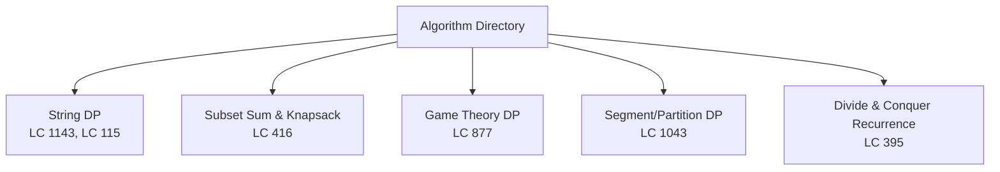
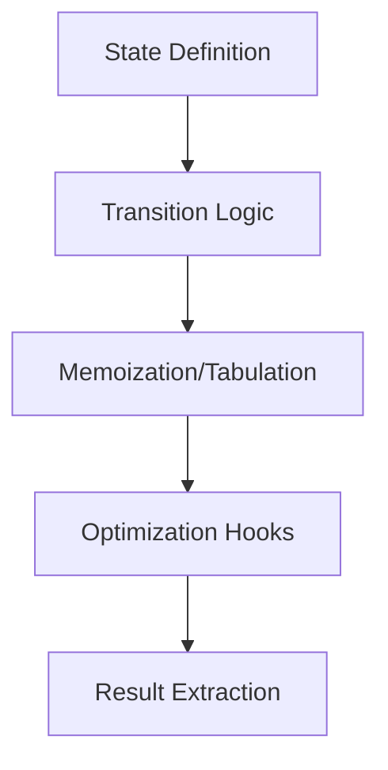
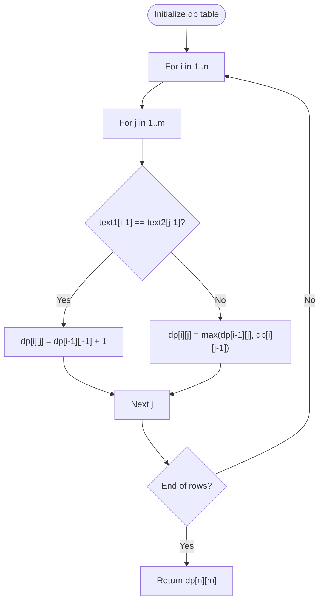
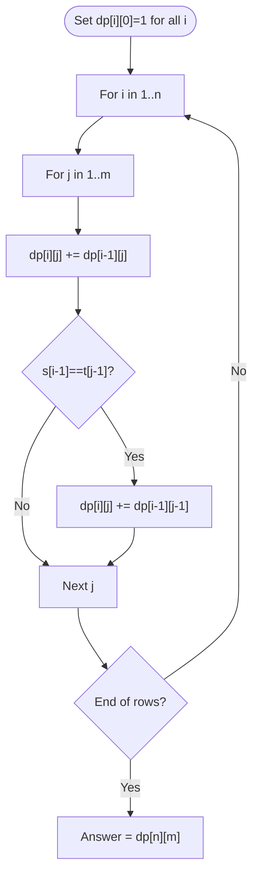
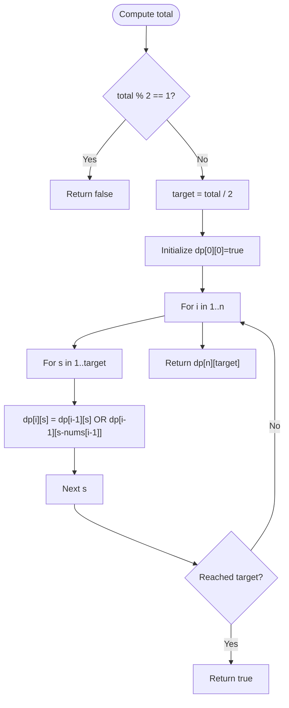
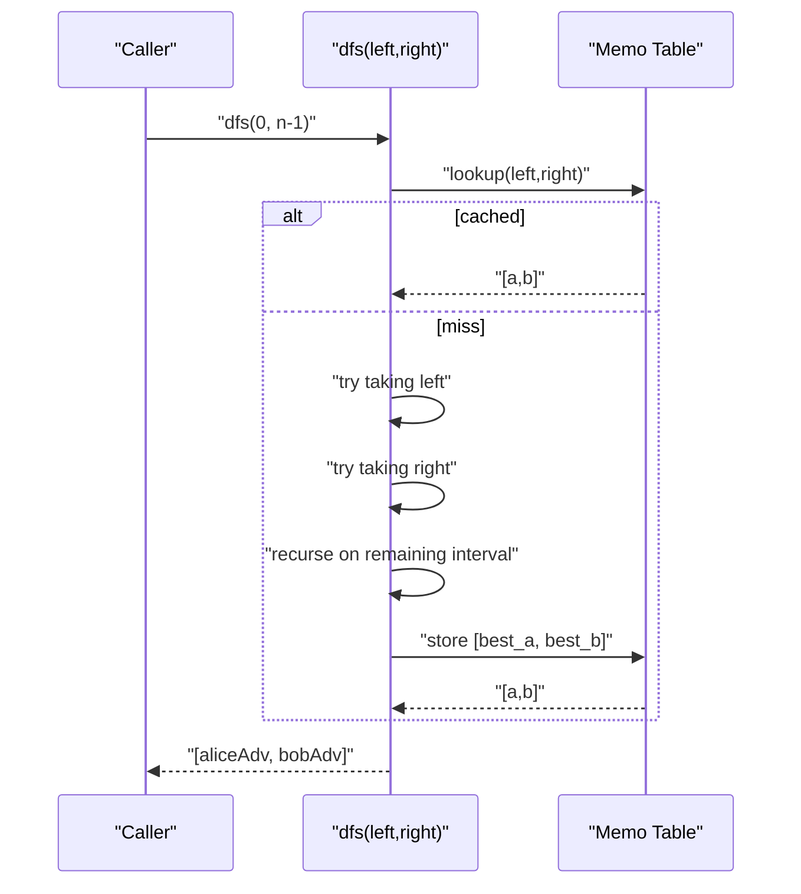
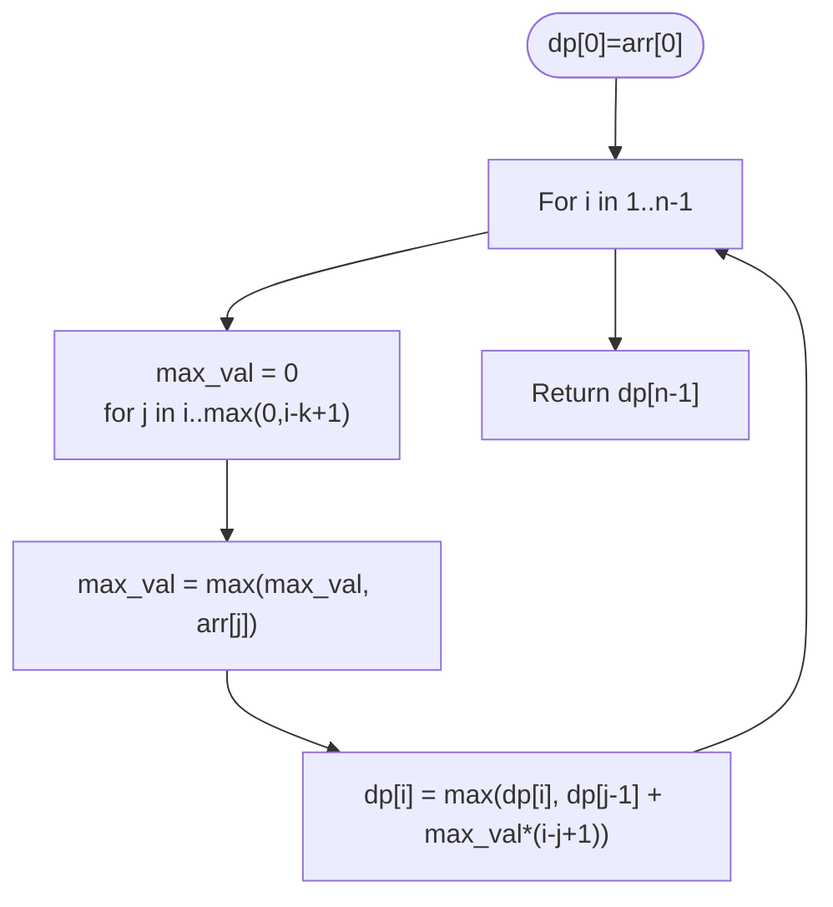
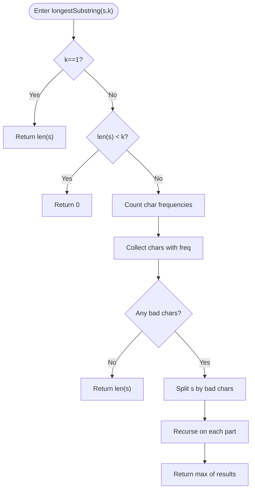
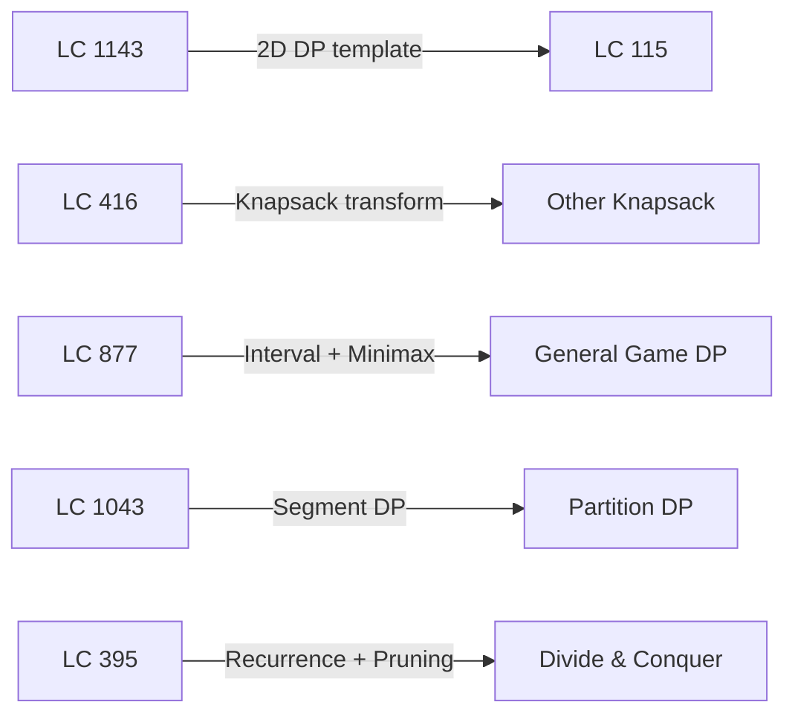

# Advanced DP Patterns

<cite>
**Referenced Files in This Document**
- [1143.longest-common-subsequence.js](file://算法/1143.longest-common-subsequence.js)
- [300.longest-increasing-subsequence.js](file://算法/300.longest-increasing-subsequence.js)
- [416.partition-equal-subset-sum.js](file://算法/416.partition-equal-subset-sum.js)
- [115.distinct-subsequences.js](file://算法/115.distinct-subsequences.js)
- [877.stone-game.js](file://算法/877.stone-game.js)
- [1043.partition-array-for-maximum-sum.js](file://算法/1043.partition-array-for-maximum-sum.js)
- [395.longest-substring-with-at-least-k-repeating-characters.ts](file://算法/395.longest-substring-with-at-least-k-repeating-characters.ts)
</cite>

## Table of Contents
1. [Introduction](#introduction)
2. [Project Structure](#project-structure)
3. [Core Components](#core-components)
4. [Architecture Overview](#architecture-overview)
5. [Detailed Component Analysis](#detailed-component-analysis)
6. [Dependency Analysis](#dependency-analysis)
7. [Performance Considerations](#performance-considerations)
8. [Troubleshooting Guide](#troubleshooting-guide)
9. [Conclusion](#conclusion)
10. [Appendices](#appendices)

## Introduction
This document presents advanced dynamic programming (DP) patterns grounded in concrete implementations from the repository. It focuses on multi-stage optimization, game theory DP, divide-and-conquer-style DP, and complex state-space exploration. It also covers minimax strategies, optimal play in two-player games, and adversarial decision-making. Additional techniques such as coordinate compression and divide-and-conquer recursion are highlighted via applicable examples. The goal is to help practitioners recognize when standard DP patterns require adaptation or combination to solve harder problems.

## Project Structure
The repository organizes algorithm implementations primarily under the algorithm directory, with each file encapsulating a single problem and its solution. For this document, we focus on selected files that demonstrate advanced DP techniques.

**Section sources**
- [1143.longest-common-subsequence.js:17-42](file://算法/1143.longest-common-subsequence.js#L17-L42)
- [416.partition-equal-subset-sum.js:16-49](file://算法/416.partition-equal-subset-sum.js#L16-L49)
- [877.stone-game.js:16-78](file://算法/877.stone-game.js#L16-L78)
- [1043.partition-array-for-maximum-sum.js:17-33](file://算法/1043.partition-array-for-maximum-sum.js#L17-L33)
- [395.longest-substring-with-at-least-k-repeating-characters.ts:12-32](file://算法/395.longest-substring-with-at-least-k-repeating-characters.ts#L12-L32)

## Core Components
- String DP: LCS and distinct subsequences showcase classic 2D DP transitions and recurrence reasoning.
- Subset Sum/Knapsack: Demonstrates 1D/2D boolean DP and early exit optimization.
- Game Theory DP: Minimax over intervals with memoization and adversarial choices.
- Partition DP: Segment-based optimization with bounded lookahead.
- Divide & Conquer Recurrence: Recursive partitioning with pruning based on constraints.

**Section sources**
- [1143.longest-common-subsequence.js:17-42](file://算法/1143.longest-common-subsequence.js#L17-L42)
- [115.distinct-subsequences.js:17-53](file://算法/115.distinct-subsequences.js#L17-L53)
- [416.partition-equal-subset-sum.js:16-49](file://算法/416.partition-equal-subset-sum.js#L16-L49)
- [877.stone-game.js:16-78](file://算法/877.stone-game.js#L16-L78)
- [1043.partition-array-for-maximum-sum.js:17-33](file://算法/1043.partition-array-for-maximum-sum.js#L17-L33)
- [395.longest-substring-with-at-least-k-repeating-characters.ts:12-32](file://算法/395.longest-substring-with-at-least-k-repeating-characters.ts#L12-L32)

## Architecture Overview
We model the repository’s DP solutions as a set of reusable patterns:
- State definition: clear per-problem state spaces (indices, sums, intervals).
- Transition logic: recurrence relations derived from problem semantics.
- Memoization/tabulation: caching to avoid recomputation.
- Optimization hooks: pruning, early exits, and dimensionality reduction.

[No sources needed since this diagram shows conceptual workflow, not actual code structure]

## Detailed Component Analysis

### String DP: Longest Common Subsequence (LC 1143)
- State: dp[i][j] represents the LCS length for prefixes text1[0..i-1], text2[0..j-1].
- Transition: match yields diagonal increment; otherwise take max of left or top.
- Complexity: O(nm) time, O(nm) space (can be optimized to O(min(n,m)) for space).

**Diagram sources**
- [1143.longest-common-subsequence.js:25-42](file://算法/1143.longest-common-subsequence.js#L25-L42)

**Section sources**
- [1143.longest-common-subsequence.js:17-42](file://算法/1143.longest-common-subsequence.js#L17-L42)

### String DP: Distinct Subsequences (LC 115)
- State: dp[i][j] counts how many distinct subsequences of t[0..j-1] appear in s[0..i-1].
- Transition: accumulate by carrying forward dp[i-1][j], and add dp[i-1][j-1] when characters match.
- Complexity: O(nm) time, O(nm) space.

**Diagram sources**
- [115.distinct-subsequences.js:36-53](file://算法/115.distinct-subsequences.js#L36-L53)

**Section sources**
- [115.distinct-subsequences.js:17-53](file://算法/115.distinct-subsequences.js#L17-L53)

### Subset Sum / Knapsack: Can Partition Equal Subset Sum (LC 416)
- Reduction: target = total / 2; check if subset sum equals target.
- DP: boolean knapsack dp[i][s] indicates whether sum s is reachable using first i elements.
- Optimization: early return when dp[i][target] becomes true; can reduce to 1D DP.

**Diagram sources**
- [416.partition-equal-subset-sum.js:21-49](file://算法/416.partition-equal-subset-sum.js#L21-L49)

**Section sources**
- [416.partition-equal-subset-sum.js:16-49](file://算法/416.partition-equal-subset-sum.js#L16-L49)

### Game Theory DP: Stone Game (LC 877)
- State: f(left, right) = [Alice advantage, Bob advantage] in the interval.
- Transition: choose left or right pile, recurse on remaining interval; pick the move that maximizes current player’s advantage.
- Memoization: cache results by interval bounds.
- Adversarial logic: both players play optimally; the minimax difference determines outcome.

**Diagram sources**
- [877.stone-game.js:28-78](file://算法/877.stone-game.js#L28-L78)

**Section sources**
- [877.stone-game.js:16-78](file://算法/877.stone-game.js#L16-L78)

### Partition DP: Max Sum After Partitioning (LC 1043)
- State: dp[i] = best score for arr[0..i].
- Transition: for each position i, look back up to k positions, take the best (dp[j-1] + cost of block [j..i]).
- Cost: block value equals max(arr[j..i]) multiplied by block length.
- Complexity: O(nk) time, O(n) space.

**Diagram sources**
- [1043.partition-array-for-maximum-sum.js:21-33](file://算法/1043.partition-array-for-maximum-sum.js#L21-L33)

**Section sources**
- [1043.partition-array-for-maximum-sum.js:17-33](file://算法/1043.partition-array-for-maximum-sum.js#L17-L33)

### Divide & Conquer Recurrence: Longest Substring with At Least K Repeating Characters (LC 395)
- State: Function longestSubstring(s, k) returns the length of the longest valid substring.
- Transition: compute character frequencies; split s by characters with frequency < k; recursively solve on parts; return max among parts.
- Pruning: if all characters satisfy frequency >= k, return len(s).
- Complexity: average O(n) due to splitting; worst-case O(n^2) if many splits occur.

**Diagram sources**
- [395.longest-substring-with-at-least-k-repeating-characters.ts:12-32](file://算法/395.longest-substring-with-at-least-k-repeating-characters.ts#L12-L32)

**Section sources**
- [395.longest-substring-with-at-least-k-repeating-characters.ts:12-32](file://算法/395.longest-substring-with-at-least-k-repeating-characters.ts#L12-L32)

## Dependency Analysis
- Pattern reuse: Many DP solutions share common templates—state definition, transition, memoization.
- Problem-specific adaptations:
  - String DP relies on 2D indices and character equality checks.
  - Subset DP transforms into a reachability problem over a target sum.
  - Game DP depends on interval state and minimax recursion.
  - Partition DP uses bounded backward scans to compute local optima.
  - Divide & conquer reduces global constraints into local subproblems.

[No sources needed since this diagram shows conceptual relationships, not specific code structure]

## Performance Considerations
- Space optimization:
  - LCS can be reduced to O(min(n, m)) by compressing rows.
  - Knapsack DP can be flattened to 1D when order allows.
- Early exits:
  - Subset DP returns immediately upon reaching the target.
  - Partition DP updates global best during backward scan.
- Recurrence pruning:
  - Divide & conquer splits the problem into independent subproblems, reducing repeated work.

[No sources needed since this section provides general guidance]

## Troubleshooting Guide
- Off-by-one errors in DP indexing:
  - Verify base cases align with 1-based construction vs. 0-based iteration.
- Incorrect transition logic:
  - Ensure transitions reflect problem semantics (e.g., equality condition in LCS).
- Memory limits:
  - Prefer rolling arrays for 1D DP when previous state suffices.
- Recursion depth:
  - Convert tail-recursive or divide & conquer forms to iterative equivalents when needed.

[No sources needed since this section provides general guidance]

## Conclusion
The repository demonstrates a rich set of DP patterns that generalize across domains:
- String DP with 2D state spaces and character-driven transitions.
- Subset-based DP transformed into reachability over sums.
- Game theory DP with interval states and minimax recursion.
- Partition DP with bounded lookahead and segment-wise optimization.
- Divide & conquer recurrences with constraint-based splitting.

Recognizing when to adapt or combine these patterns is key to solving complex problems efficiently.

## Appendices
- Advanced technique pointers:
  - Coordinate compression: useful when values are sparse or large; map to dense indices before DP.
  - Convex hull optimization: applies to recurrences of the form f[i] = min/max{a[j]·b[i] + f[j]} over monotone j; requires slope/intercept comparisons.
  - Slope optimization: leverages decreasing/increasing slopes to maintain a deque of optimal candidates for transitions.

[No sources needed since this section provides general guidance]