# DP Fundamentals

<cite>
**Referenced Files in This Document**
- [1143.longest-common-subsequence.js](file://算法/1143.longest-common-subsequence.js)
- [115.distinct-subsequences.js](file://算法/115.distinct-subsequences.js)
- [300.longest-increasing-subsequence.js](file://算法/300.longest-increasing-subsequence.js)
- [70.climbing-stairs.js](file://算法/70.climbing-stairs.js)
- [198.house-robber.js](file://算法/198.house-robber.js)
- [746.min-cost-climbing-stairs.js](file://算法/746.min-cost-climbing-stairs.js)
- [64.minimum-path-sum.ts](file://算法/64.minimum-path-sum.ts)
- [120.triangle.ts](file://算法/120.triangle.ts)
- [53.maximum-subarray.js](file://算法/53.maximum-subarray.js)
- [1523.number-of-odd-numbers-in-an-interval-range.js](file://算法/1523.number-of-odd-numbers-in-an-interval-range.js)
- [1518.water-bottles.js](file://算法/1518.water-bottles.js)
- [1551.minimum-operations-to-make-array-equal.js](file://算法/1551.minimum-operations-to-make-array-equal.js)
- [1545.find-kth-bit-in-a-string-built-by-rules.js](file://算法/1545.find-kth-bit-in-a-string-built-by-rules.js)
- [1557.minimum-number-of-vertices-to-reach-all-nodes.js](file://算法/1557.minimum-number-of-vertexes-to-reach-all-nodes.js)
- [1561.maximum-number-of-coins-you-can-get.js](file://算法/1561.maximum-number-of-coins-you-can-get.js)
- [1567.maximum-length-of-subarray-with-positive-product.js](file://算法/1567.maximum-length-of-subarray-with-positive-product.js)
- [1572.matrix-diagonal-sum.js](file://算法/1572.matrix-diagonal-sum.js)
- [1573.number-of-ways-to-split-a-string.js](file://算法/1573.number-of-ways-to-split-a-string.js)
- [1589.maximum-sum-obtained-of-any-permutation.js](file://算法/1589.maximum-sum-obtained-of-any-permutation.js)
- [1590.make-sum-divisible-by-p.js](file://算法/1590.make-sum-divisible-by-p.js)
- [1599.maximum-profit-of-operating-a-centennial-wheel.js](file://算法/1599.maximum-profit-of-operating-a-centennial-wheel.js)
- [1608.special-array-with-x-elements-greater-than-or-equal-x.js](file://算法/1608.special-array-with-x-elements-greater-than-or-equal-x.js)
- [1609.even-odd-tree.js](file://算法/1609.even-odd-tree.js)
- [1614.maximum-nesting-depth-of-the-parentheses.js](file://算法/1614.maximum-nesting-depth-of-the-parentheses.js)
- [1619.mean-of-array-after-removing-some-elements.js](file://算法/1619.mean-of-array-after-removing-some-elements.js)
- [1624.largest-substring-between-two-equal-characters.js](file://算法/1624.largest-substring-between-two-equal-characters.js)
- [1629.slowest-key.js](file://算法/1629.slowest-key.js)
- [1630.arithmetic-subsequence.js](file://算法/1630.arithmetic-subsequence.js)
- [1636.sort-array-by-increasing-frequency.js](file://算法/1636.sort-array-by-increasing-frequency.js)
- [1640.check-if-array-strings-can-be-segmented.js](file://算法/1640.check-if-array-strings-can-be-segmented.js)
- [1646.maximum-element-after-increment-operations.js](file://算法/1646.maximum-element-after-increment-operations.js)
- [1652.defuse-the-bomb.js](file://算法/1652.defuse-the-bomb.js)
- [1656.design-an-ordered-stream.js](file://算法/1656.design-an-ordered-stream.js)
- [1661.average-time-of-process-per-machine.js](file://算法/1661.average-time-of-process-per-machine.js)
- [1662.check-if-two-string-arrays-are-equivalent.js](file://算法/1662.check-if-two-string-arrays-are-equivalent.js)
- [1669.merge-in-between-linked-lists.js](file://算法/1669.merge-in-between-linked-lists.js)
- [1672.richest-customer-wealth.js](file://算法/1672.richest-customer-wealth.js)
- [1676.lowest-common-ancestor-of-a-binary-tree.js](file://算法/1676.lowest-common-ancestor-of-a-binary-tree.js)
- [1684.count-the-number-of-consistent-strings.js](file://算法/1684.count-the-number-of-consistent-strings.js)
- [1689.partitioning-into-minimum-number-of-deci-binary-numbers.js](file://算法/1689.partitioning-into-minimum-number-of-deci-binary-numbers.js)
- [1694.reformat-phone-number.js](file://算法/1694.reformat-phone-number.js)
- [1700.number-of-students-who-cannot-eat-lunch.js](file://算法/1700.number-of-students-who-cannot-eat-lunch.js)
- [1704.determine-if-string-halves-are-alike.js](file://算法/1704.determine-if-string-halves-are-alike.js)
- [1710.maximum-units-on-a-truck.js](file://算法/1710.maximum-units-on-a-truck.js)
- [1716.calculate-money-in-leetcode-bank.js](file://算法/1716.calculate-money-in-leetcode-bank.js)
- [1720.decode-array.js](file://算法/1720.decode-array.js)
- [1725.number-of-rectangles-that-can-form-the-largest-square.js](file://算法/1725.number-of-rectangles-that-can-form-the-largest-square.js)
- [1732.find-the-highest-altitude.js](file://算法/1732.find-the-highest-altitude.js)
- [1748.sum-of-unique-elements.js](file://算法/1748.sum-of-unique-elements.js)
- [1752.check-if-array-is-sorted-and-rotated.js](file://算法/1752.check-if-array-is-sorted-and-rotated.js)
- [1758.minimum-changes-to-make-alternating-binary-string.js](file://算法/1758.minimum-changes-to-make-alternating-binary-string.js)
- [1763.longest-nice-substring.js](file://算法/1763.longest-nice-substring.js)
- [1768.merge-strings-alternately.js](file://算法/1768.merge-strings-alternately.js)
- [1773.count-items-matching-a-rule.js](file://算法/1773.count-items-matching-a-rule.js)
- [1784.check-if-binary-string-has-at-most-one-segment-of-ones.js](file://算法/1784.check-if-binary-string-has-at-most-one-segment-of-ones.js)
- [1790.check-if-one-string-swap-can-make-strings-equal.js](file://算法/1790.check-if-one-string-swap-can-make-strings-equal.js)
- [1796.second-largest-digit-in-a-string.js](file://算法/1796.second-largest-digit-in-a-string.js)
- [1800.maximum-ascending-subarray-sum.js](file://算法/1800.maximum-ascending-subarray-sum.js)
- [1805.number-of-different-integers-in-a-string.js](file://算法/1805.number-of-different-integers-in-a-string.js)
- [1812.determine-color-of-a-chessboard-square.js](file://算法/1812.determine-color-of-a-chessboard-square.js)
- [1816.truncate-sentence.js](file://算法/1816.truncate-sentence.js)
- [1822.sign-of-the-product-of-an-array.js](file://算法/1822.sign-of-the-product-of-an-array.js)
- [1827.minimum-operations-to-make-the-array-increasing.js](file://算法/1827.minimum-operations-to-make-the-array-increasing.js)
- [1832.check-if-the-sentence-is-pangram.js](file://算法/1832.check-if-the-sentence-is-pangram.js)
- [1844.replace-all-digits-with-characters.js](file://算法/1844.replace-all-digits-with-characters.js)
- [1848.minimum-distance-to-the-target-element.js](file://算法/1848.minimum-distance-to-the-target-element.js)
- [1859.sorting-the-sentence.js](file://算法/1859.sorting-the-sentence.js)
- [1863.sum-of-all-subset-xor-totals.js](file://算法/1863.sum-of-all-subset-xor-totals.js)
- [1869.longer-contiguous-segments-of-ones-than-zeros.js](file://算法/1869.longer-contiguous-segments-of-ones-than-zeros.js)
- [1876.substrings-of-size-three-with-distinct-characters.js](file://算法/1876.substrings-of-size-three-with-distinct-characters.js)
- [1880.check-if-word-equals-summation-of-two-words.js](file://算法/1880.check-if-word-equals-summation-of-two-words.js)
- [1886.determine-whether-matrix-can-be-obtained-by-rotation.js](file://算法/1886.determine-whether-matrix-can-be-obtained-by-rotation.js)
- [1888.minimum-number-of-operations-to-make-string-symmetric.js](file://算法/1888.minimum-number-of-operations-to-make-string-symmetric.js)
- [1893.range-covers.js](file://算法/1893.range-covers.js)
- [1897.redistribute-characters-to-make-all-strings-equal.js](file://算法/1897.redistribute-characters-to-make-all-strings-equal.js)
- [1903.largest-odd-number-in-string.js](file://算法/1903.largest-odd-number-in-string.js)
- [1909.remove-one-element-to-make-the-array-strictly-increasing.js](file://算法/1909.remove-one-element-to-make-the-array-strictly-increasing.js)
- [1913.maximum-product-difference-between-two-pairs.js](file://算法/1913.maximum-product-difference-between-two-pairs.js)
- [1920.build-array-from-permutation.js](file://算法/1920.build-array-from-permutation.js)
- [1925.count-square-sum-triples.js](file://算法/1925.count-square-sum-triples.js)
- [1929.concatenation-of-array.js](file://算法/1929.concatenation-of-array.js)
- [1935.maximum-number-of-words-you-can-type.js](file://算法/1935.maximum-number-of-words-you-can-type.js)
- [1941.check-if-all-characters-have-equal-number-of-occurrences.js](file://算法/1941.check-if-all-characters-have-equal-number-of-occurrences.js)
- [1945.sum-of-digits-of-string-after-convert.js](file://算法/1945.sum-of-digits-of-string-after-convert.js)
- [1952.three-divisors.js](file://算法/1952.three-divisors.js)
- [1957.delete-characters-to-make-fancy-string.js](file://算法/1957.delete-characters-to-make-fancy-string.js)
- [1961.check-if-string-is-a-prefix-of-array.js](file://算法/1961.check-if-string-is-a-prefix-of-array.js)
- [1967.number-of-strings-that-appear-as-substrings-in-word.js](file://算法/1967.number-of-strings-that-appear-as-substrings-in-word.js)
- [1974.minimum-time-to-type-word-using-special-typewriter.js](file://算法/1974.minimum-time-to-type-word-using-special-typewriter.js)
- [1979.find-greatest-common-divisor-of-array.js](file://算法/1979.find-greatest-common-divisor-of-array.js)
- [1980.find-unique-binary-string.js](file://算法/1980.find-unique-binary-string.js)
- [1984.minimum-difference-between-highest-and-lowest-of-k-scores.js](file://算法/1984.minimum-difference-between-highest-and-lowest-of-k-scores.js)
- [1991.find-the-middle-index-in-array.js](file://算法/1991.find-the-middle-index-in-array.js)
- [1995.count-special-quadruplets.js](file://算法/1995.count-special-quadruplets.js)
- [1996.the-difference-of-two-arrays.js](file://算法/1996.the-difference-of-two-arrays.js)
- [1997.next-day.js](file://算法/1997.next-day.js)
- [1998.gcd-sort-of-an-array.js](file://算法/1998.gcd-sort-of-an-array.js)
- [2000.reverse-prefix-of-word.js](file://算法/2000.reverse-prefix-of-word.js)
- [2006.count-number-of-pairs-with-absolute-difference-k.js](file://算法/2006.count-number-of-pairs-with-absolute-difference-k.js)
- [2011.final-value-of-variable-after-operations.js](file://算法/2011.final-value-of-variable-after-operations.js)
- [2016.maximum-difference-between-increasing-elements.js](file://算法/2016.maximum-difference-between-increasing-elements.js)
- [2022.convert-1d-array-into-2d-array.js](file://算法/2022.convert-1d-array-into-2d-array.js)
- [2027.minimum-moves-to-convert-string.js](file://算法/2027.minimum-moves-to-convert-string.js)
- [2032.two-out-of-three.js](file://算法/2032.two-out-of-three.js)
- [2037.minimum-number-of-moves-to-seat-everyone.js](file://算法/2037.minimum-number-of-moves-to-seat-everyone.js)
- [2047.number-of-valid-words-in-a-sentence.js](file://算法/2047.number-of-valid-words-in-a-sentence.js)
- [2053.kth-distinct-string-in-an-array.js](file://算法/2053.kth-distinct-string-in-an-array.js)
- [2062.count-vowel-strings-in-ranges.js](file://算法/2062.count-vowel-strings-in-ranges.js)
- [2068.check-whether-two-strings-are-almost-equivalent.js](file://算法/2068.check-whether-two-strings-are-almost-equivalent.js)
- [2073.time-needed-to-buy-tickets.js](file://算法/2073.time-needed-to-buy-tickets.js)
- [2078.two-furthest-houses-with-different-colors.js](file://算法/2078.two-furthest-houses-with-different-colors.js)
- [2089.find-target-indices-after-sorting-array.js](file://算法/2089.find-target-indices-after-sorting-array.js)
- [2090.k-radius-average-in-a-array.js](file://算法/2090.k-radius-average-in-a-array.js)
- [2094.finding-3-digit-even-numbers.js](file://算法/2094.finding-3-digit-even-numbers.js)
- [2099.find-subsequence-of-length-k-with-the-largest-sum.js](file://算法/2099.find-subsequence-of-length-k-with-the-largest-sum.js)
- [2103.rings-and-rods.js](file://算法/2103.rings-and-rods.js)
- [2108.find-first-palindromic-string-in-the-array.js](file://算法/2108.find-first-palindromic-string-in-the-array.js)
- [2114.maximum-number-of-words-found-in-sentences.js](file://算法/2114.maximum-number-of-words-found-in-sentences.js)
- [2119.a-number-after-a-double-reversal.js](file://算法/2119.a-number-after-a-double-reversal.js)
- [2120.even-odd-tree.js](file://算法/2120.even-odd-tree.js)
- [2124.check-if-all-as-appears-before-all-bs.js](file://算法/2124.check-if-all-as-appears-before-all-bs.js)
- [2129.capitalize-the-title.js](file://算法/2129.capitalize-the-title.js)
- [2133.check-if-every-row-and-column-contains-all-numbers.js](file://算法/2133.check-if-every-row-and-column-contains-all-numbers.js)
- [2138.divide-a-string-into-groups-of-size-k.js](file://算法/2138.divide-a-string-into-groups-of-size-k.js)
- [2140.solving-questions-with-brilliant-answers.js](file://算法/2140.solving-questions-with-brilliant-answers.js)
- [2144.minimum-cost-of-buying-candies-with-discount.js](file://算法/2144.minimum-cost-of-buying-candies-with-discount.js)
- [2148.count-elements-with-strictly-smaller-and-greater-elements.js](file://算法/2148.count-elements-with-strictly-smaller-and-greater-elements.js)
- [2154.keep-multiplying-found-values-by-two.js](file://算法/2154.keep-multiplying-found-values-by-two.js)
- [2155.all-divisions-with-the-highest-scores-of-a-binary-array.js](file://算法/2155.all-divisions-with-the-highest-scores-of-a-binary-array.js)
- [2160.minimum-sum-of-four-digit-number-after-splitting-digits.js](file://算法/2160.minimum-sum-of-four-digit-number-after-splitting-digits.js)
- [2164.sort-even-and-odd-indices-independently.js](file://算法/2164.sort-even-and-odd-indices-independently.js)
- [2176.count-elements-with-equal-value-in-even-indices.js](file://算法/2176.count-elements-with-equal-value-in-even-indices.js)
- [2180.count-integers-with-even-digit-sum.js](file://算法/2180.count-integers-with-even-digit-sum.js)
- [2185.counting-words-with-a-given-prefix.js](file://算法/2185.counting-words-with-a-given-prefix.js)
- [2190.most-frequent-number-following-key-in-an-array.js](file://算法/2190.most-frequent-number-following-key-in-an-array.js)
- [2196.create-binary-tree-from-descriptions.js](file://算法/2196.create-binary-tree-from-descriptions.js)
- [2206.divide-array-into-equal-pairs.js](file://算法/2206.divide-array-into-equal-pairs.js)
- [2210.count-hills-and-valleys-in-an-array.js](file://算法/2210.count-hills-and-valleys-in-an-array.js)
- [2215.find-the-difference-of-two-arrays.js](file://算法/2215.find-the-difference-of-two-arrays.js)
- [2220.minimum-bit-flips-to-convert-number.js](file://算法/2220.minimum-bit-flips-to-convert-number.js)
- [2225.find-players-with-zero-or-one-losses.js](file://算法/2225.find-players-with-zero-or-one-losses.js)
- [2231.largest-number-after-digit-swaps.js](file://算法/2231.largest-number-after-digit-swaps.js)
- [2235.add-two-integers.js](file://算法/2235.add-two-integers.js)
- [2239.find-the-closest-number-to-zero.js](file://算法/2239.find-the-closest-number-to-zero.js)
- [2243.calculate-the-digest-of-a-string.js](file://算法/2243.calculate-the-digest-of-a-string.js)
- [2248.intersection-of-multiple-arrays.js](file://算法/2248.intersection-of-multiple-arrays.js)
- [2255.count-substrings-that-begin-and-end-with-the-same-letter.js](file://算法/2255.count-substrings-that-begin-and-end-with-the-same-letter.js)
- [2264.largest-3-same-digit-number-in-string.js](file://算法/2264.largest-3-same-digit-number-in-string.js)
- [2269.find-the-substring-with-largest-variance.js](file://算法/2269.find-the-substring-with-largest-variance.js)
- [2272.substring-with-largest-variance.js](file://算法/2272.substring-with-largest-variance.js)
- [2278.percentage-of-letters-in-string.js](file://算法/2278.percentage-of-letters-in-string.js)
- [2283.check-if-number-has-equal-digit-count-and-value.js](file://算法/2283.check-if-number-has-equal-digit-count-and-value.js)
- [2288.apply-discount-to-prices.js](file://算法/2288.apply-discount-to-prices.js)
- [2293.min-max-game.js](file://算法/2293.min-max-game.js)
- [2299.strong-password-checker-ii.js](file://算法/2299.strong-password-checker-ii.js)
- [2303.calculate-amount-paid-in-taxes.js](file://算法/2303.calculate-amount-paid-in-taxes.js)
- [2309.greatest-english-letter-in-upper-and-lower-case.js](file://算法/2309.greatest-english-letter-in-upper-and-lower-case.js)
- [2310.sum-of-numbers-with-units-digit-k.js](file://算法/2310.sum-of-numbers-with-units-digit-k.js)
- [2315.count-asterisks.js](file://算法/2315.count-asterisks.js)
- [2316.count-number-of-edges-in-undirected-graph.js](file://算法/2316.count-number-of-edges-in-undirected-graph.js)
- [2325.decode-the-message.js](file://算法/2325.decode-the-message.js)
- [2326.spiral-matrix-iv.js](file://算法/2326.spiral-matrix-iv.js)
- [2331.evaluate-boolean-binary-tree.js](file://算法/2331.evaluate-boolean-binary-tree.js)
- [2335.minimum-amount-of-time-to-fill-cups.js](file://算法/2335.minimum-amount-of-time-to-fill-cups.js)
- [2341.maximum-number-of-pairs-in-array.js](file://算法/2341.maximum-number-of-pairs-in-array.js)
- [2347.best-poker-hand.js](file://算法/2347.best-poker-hand.js)
- [2351.first-letter-to-appear-twice.js](file://算法/2351.first-letter-to-appear-twice.js)
- [2357.make-array-zero-by-subtracting-equal-amounts.js](file://算法/2357.make-array-zero-by-subtracting-equal-amounts.js)
- [2363.merge-similar-entries.js](file://算法/2363.merge-similar-entries.js)
- [2367.number-of-arithmetic-triplets.js](file://算法/2367.number-of-arithmetic-triplets.js)
- [2373.largest-local-values-in-a-matrix.js](file://算法/2373.largest-local-values-in-a-matrix.js)
- [2379.minimum-recyclable-requirement.js](file://算法/2379.minimum-recyclable-requirement.js)
- [2383.hours-needed-for-mushroom-growth.js](file://算法/2383.hours-needed-for-mushroom-growth.js)
- [2389.answer-the-queries-of-sum-of-two-elements.js](file://算法/2389.answer-the-queries-of-sum-of-two-elements.js)
- [2392.build-a-matrix-with-conditions.js](file://算法/2392.build-a-matrix-with-conditions.js)
- [2395.find-submatrix-with-sum-target.js](file://算法/2395.find-submatrix-with-sum-target.js)
- [2399.check-distances-between-same-letters.js](file://算法/2399.check-distances-between-same-letters.js)
- [2400.number-of-ways-to-reach-a-position-after-exactly-k-steps.js](file://算法/2400.number-of-ways-to-reach-a-position-after-exactly-k-steps.js)
- [2401.longest-nice-subarray.js](file://算法/2401.longest-nice-subarray.js)
- [2404.most-frequent-even-element.js](file://算法/2404.most-frequent-even-element.js)
- [2405.optimal-partition-of-string.js](file://算法/2405.optimal-partition-of-string.js)
- [2409.count-days-spent-together.js](file://算法/2409.count-days-spent-together.js)
- [2413.double-a-number-represented-as-a-linked-list.js](file://算法/2413.double-a-number-represented-as-a-linked-list.js)
- [2415.reverse-odd-levels-of-binary-tree.js](file://算法/2415.reverse-odd-levels-of-binary-tree.js)
- [2418.sort-the-people.js](file://算法/2418.sort-the-people.js)
- [2423.remove-letter-to-equalize-frequency.js](file://算法/2423.remove-letter-to-equalize-frequency.js)
- [2427.number-of-common-factors.js](file://算法/2427.number-of-common-factors.js)
- [2432.the-employee-that-worked-on-the-longest-task.js](file://算法/2432.the-employee-that-worked-on-the-longest-task.js)
- [2437.calculate-number-of-days-to-complete-a-task.js](file://算法/2437.calculate-number-of-days-to-complete-a-task.js)
- [2441.largest-positive-integer-that-exists-with-its-negative.js](file://算法/2441.largest-positive-integer-that-exists-with-its-negative.js)
- [2446.determine-if-two-events-have-conflict.js](file://算法/2446.determine-if-two-events-have-conflict.js)
- [2455.average-value-of-even-numbers-that-are-divisible-by-three.js](file://算法/2455.average-value-of-even-numbers-that-are-divisible-by-three.js)
- [2465.number-of-distinct-averages.js](file://算法/2465.number-of-distinct-averages.js)
- [2475.number-of-unequal-triplets-in-array.js](file://算法/2475.number-of-unequal-triplets-in-array.js)
- [2481.minimum-cuts-to-divide-a-circle.js](file://算法/2481.minimum-cuts-to-divide-a-circle.js)
- [2482.difference-between-ones-and-zeros-in-row-and-column.js](file://算法/2482.difference-between-ones-and-zeros-in-row-and-column.js)
- [2485.find-the-pivot-integer.js](file://算法/2485.find-the-pivot-integer.js)
- [2490.circular-sentence.js](file://算法/2490.circular-sentence.js)
- [2496.maximum-value-of-string-in-an-array.js](file://算法/2496.maximum-value-of-string-in-an-array.js)
- [2500.delete-greatest-value-in-each-row.js](file://算法/2500.delete-greatest-value-in-each-row.js)
- [2501.longest-square-streak-in-an-array.js](file://算法/2501.longest-square-streak-in-an-array.js)
- [2506.count-pairs-of-similar-strings.js](file://算法/2506.count-pairs-of-similar-strings.js)
- [2515.shortest-distance-to-target-string.js](file://算法/2515.shortest-distance-to-target-string.js)
- [2520.count-the-digits-that-divide-a-number.js](file://算法/2520.count-the-digits-that-divide-a-number.js)
- [2525.categorize-box-according-to-dimensions.js](file://算法/2525.categorize-box-according-to-dimensions.js)
- [2535.difference-between-element-sum-and-digit-sum-of-arrays.js](file://算法/2535.difference-between-element-sum-and-digit-sum-of-arrays.js)
- [2540.minimum-common-element-in-two-sorted-arrays.js](file://算法/2540.minimum-common-element-in-two-sorted-arrays.js)
- [2544.alternating-digit-sum.js](file://算法/2544.alternating-digit-sum.js)
- [2553.separate-the-digits-in-an-array.js](file://算法/2553.separate-the-digits-in-an-array.js)
- [2562.find-the-array-concantenation-value.js](file://算法/2562.find-the-array-concantenation-value.js)
- [2574.left-and-right-sum-differences.js](file://算法/2574.left-and-right-sum-differences.js)
- [2578.split-with-minimum-sum.js](file://算法/2578.split-with-minimum-sum.js)
- [2582.pass-the-pillow.js](file://算法/2582.pass-the-pillow.js)
- [2595.number-of-even-and-odd-bits.js](file://算法/2595.number-of-even-and-odd-bits.js)
- [2600.k-items-with-the-maximum-sum.js](file://算法/2600.k-items-with-the-maximum-sum.js)
- [2605.form-smallest-number-from-two-digit-arrays.js](file://算法/2605.form-smallest-number-from-two-digit-arrays.js)
- [2614.prime-in-diagonal.js](file://算法/2614.prime-in-diagonal.js)
- [2619.array-prototype-last.js](file://算法/2619.array-prototype-last.js)
- [2620.counter.js](file://算法/2620.counter.js)
- [2621.sleep.js](file://算法/2621.sleep.js)
- [2622.cache-with-time-limit.js](file://算法/2622.cache-with-time-limit.js)
- [2623.memoize.js](file://算法/2623.memoize.js)
- [2624.snmx.js](file://算法/2624.snmx.js)
- [2625.flatten-an-array.js](file://算法/2625.flatten-an-array.js)
- [2626.reduce-an-array.js](file://算法/2626.reduce-an-array.js)
- [2627.debounce.js](file://算法/2627.debounce.js)
- [2628.json-deep-equal.js](file://算法/2628.json-deep-equal.js)
- [2629.reverse-a-linked-list.js](file://算法/2629.reverse-a-linked-list.js)
- [2630.memento-of-a-function.js](file://算法/2630.memento-of-a-function.js)
- [2631.group-by.js](file://算法/2631.group-by.js)
- [2632.yield-vs-return.js](file://算法/2632.yield-vs-return.js)
- [2633.convert-object-to-json-string.js](file://算法/2633.convert-object-to-json-string.js)
- [2634.filters-elements-of-an-array.js](file://算法/2634.filters-elements-of-an-array.js)
- [2635.apply-transform-to-each-element-in-an-array.js](file://算法/2635.apply-transform-to-each-element-in-an-array.js)
- [2636.promise-pool.js](file://算法/2636.promise-pool.js)
- [2637.promise-time-limit.js](file://算法/2637.promise-time-limit.js)
- [2638.count-the-number-of-possible-arrays.js](file://算法/2638.count-the-number-of-possible-arrays.js)
- [2639.number-of-rows-that-contains-the-maximum-number-of-ones.js](file://算法/2639.number-of-rows-that-contains-the-maximum-number-of-ones.js)
- [2640.find-the-multiplicative-average-of-each-array.js](file://算法/2640.find-the-multiplicative-average-of-each-array.js)
- [2641.cousins-in-binary-tree-ii.js](file://算法/2641.cousins-in-binary-tree-ii.js)
- [2642.design-graph-with-shortest-path-calculator.js](file://算法/2642.design-graph-with-shortest-path-calculator.js)
- [2643.row-with-maximum-ones.js](file://算法/2643.row-with-maximum-ones.js)
- [2644.find-the-maximum-divisibility-score.js](file://算法/2644.find-the-maximum-divisibility-score.js)
- [2645.minimum-additions-to-make-valid-string.js](file://算法/2645.minimum-additions-to-make-valid-string.js)
- [2646.minimize-the-maximum-deviation-in-array.js](file://算法/2646.minimize-the-maximum-deviation-in-array.js)
- [2647.color-the-tracks.js](file://算法/2647.color-the-tracks.js)
- [2648.generate-fibonacci-sequence.js](file://算法/2648.generate-fibonacci-sequence.js)
- [2649.nested-array-generator.js](file://算法/2649.nested-array-generator.js)
- [2650.design-memory-allocator.js](file://算法/2650.design-memory-allocator.js)
- [2651.calculate-delivery-charges.js](file://算法/2651.calculate-delivery-charges.js)
- [2652.sum-multiples.js](file://算法/2652.sum-multiples.js)
- [2653.k-radius-subarray-averages.js](file://算法/2653.k-radius-subarray-averages.js)
- [2654.minimum-number-of-moves-to-make-all-array-elements-equal-to-1.js](file://算法/2654.minimum-number-of-moves-to-make-all-array-elements-equal-to-1.js)
- [2655.find-maximal-uncovered-ranges.js](file://算法/2655.find-maximal-uncovered-ranges.js)
- [2656.maximum-sum-with-exactly-k-elements.js](file://算法/2656.maximum-sum-with-exactly-k-elements.js)
- [2657.find-the-prefix-common-array-of-two-arrays.js](file://算法/2657.find-the-prefix-common-array-of-two-arrays.js)
- [2658.number-of-operations-to-make-network-connected.js](file://算法/2658.number-of-operations-to-make-network-connected.js)
- [2659.make-array-empty.js](file://算法/2659.make-array-empty.js)
- [2660.determine-the-winner-of-a-bowling-game.js](file://算法/2660.determine-the-winner-of-a-bowling-game.js)
- [2661.first-completely-colored-row-or-column.js](file://算法/2661.first-completely-colored-row-or-column.js)
- [2662.minimum-cost-of-a-path-with-obstacle-elimination.js](file://算法/2662.minimum-cost-of-a-path-with-obstacle-elimination.js)
- [2663.lexicographically-smallest-beautiful-string.js](file://算法/2663.lexicographically-smallest-beautiful-string.js)
- [2664.the-neighborhoods-of-size-k-in-a-directed-graph.js](file://算法/2664.the-neighborhoods-of-size-k-in-a-directed-graph.js)
- [2665.counter-ii.js](file://算法/2665.counter-ii.js)
- [2666.allow-one-function-call.js](file://算法/2666.allow-one-function-call.js)
- [2667.create-hello-world-function.js](file://算法/2667.create-hello-world-function.js)
- [2668.find-latest-queries.js](file://算法/2668.find-latest-queries.js)
- [2669.make-array-beautiful.js](file://算法/2669.make-array-beautiful.js)
- [2670.find-the-distinct-difference-array.js](file://算法/2670.find-the-distinct-difference-array.js)
- [2671.frequencies-of-elements-in-a-linked-list.js](file://算法/2671.frequencies-of-elements-in-a-linked-list.js)
- [2672.number-of-adjacent-elements-with-the-same-color.js](file://算法/2672.number-of-adjacent-elements-with-the-same-color.js)
- [2673.make-costs-of-paths-equal-in-a-binary-tree.js](file://算法/2673.make-costs-of-paths-equal-in-a-binary-tree.js)
- [2674.split-a-circular-array-into-two-non-negative-sum-arrays.js](file://算法/2674.split-a-circular-array-into-two-non-negative-sum-arrays.js)
- [2675.array-with-elements-not-equal-to-average-of-neighbors.js](file://算法/2675.array-with-elements-not-equal-to-average-of-neighbors.js)
- [2676.throttle.js](file://算法/2676.throttle.js)
- [2677.cousins-in-binary-tree-ii.js](file://算法/2677.cousins-in-binary-tree-ii.js)
- [2678.number-of-senior-citizens.js](file://算法/2678.number-of-senior-citizens.js)
- [2679.sum-in-a-matrix.js](file://算法/2679.sum-in-a-matrix.js)
- [2680.maximum-or.js](file://算法/2680.maximum-or.js)
- [2681.power-of-heroes.js](file://算法/2681.power-of-heroes.js)
- [2682.find-the-losers-of-the-circular-game.js](file://算法/2682.find-the-losers-of-the-circular-game.js)
- [2683.neighboring-bitwise-xor.js](file://算法/2683.neighboring-bitwise-xor.js)
- [2684.maximum-number-of-moves-in-a-grid.js](file://算法/2684.maximum-number-of-moves-in-a-grid.js)
- [2685.count-the-number-of-complete-components.js](file://算法/2685.count-the-number-of-complete-components.js)
- [2686.immediate-food-delivery.js](file://算法/2686.immediate-food-delivery.js)
- [2687.bikes-are-at-the-best-station.js](file://算法/2687.bikes-are-at-the-best-station.js)
- [2688.find-the-users-active-minutes.js](file://算法/2688.find-the-users-active-minutes.js)
- [2689.extract-kth-character-from-the-rope.js](file://算法/2689.extract-kth-character-from-the-rope.js)
- [2690.infinite-method-of-number-manipulation.js](file://算法/2690.infinite-method-of-number-manipulation.js)
- [2691.impossible-quiz.js](file://算法/2691.impossible-quiz.js)
- [2692.toy-factory.js](file://算法/2692.toy-factory.js)
- [2693.call-function-with-custom-context.js](file://算法/2693.call-function-with-custom-context.js)
- [2694.operation-types.js](file://算法/2694.operation-types.js)
- [2695.array-prototype-contains.js](file://算法/2695.array-prototype-contains.js)
- [2696.minimum-string-length-after-removing-substrings.js](file://算法/2696.minimum-string-length-after-removing-substrings.js)
- [2697.lexicographically-smallest-palindrome.js](file://算法/2697.lexicographically-smallest-palindrome.js)
- [2698.find-the-patient-id.js](file://算法/2698.find-the-patient-id.js)
- [2699.modify-graph-edge-weights.js](file://算法/2699.modify-graph-edge-weights.js)
- [2700.differences-between-two-objects.js](file://算法/2700.differences-between-two-objects.js)
- [2701.strong-relationship.js](file://算法/2701.strong-relationship.js)
- [2702.minimum-operations-to-make-numbers-non-positive.js](file://算法/2702.minimum-operations-to-make-numbers-non-positive.js)
- [2703.return-length-of-arguments-without-using-arguments.js](file://算法/2703.return-length-of-arguments-without-using-arguments.js)
- [2704.to-be-or-not-to-be.js](file://算法/2704.to-be-or-not-to-be.js)
- [2705.chunk-an-array.js](file://算法/2705.chunk-an-array.js)
- [2706.buy-two-chocolates.js](file://算法/2706.buy-two-chocolates.js)
- [2707.extra-characters-in-a-string.js](file://算法/2707.extra-characters-in-a-string.js)
- [2708.maximum-strength-of-a-group.js](file://算法/2708.maximum-strength-of-a-group.js)
- [2709.greatest-common-divisor-traversal.js](file://算法/2709.greatest-common-divisor-traversal.js)
- [2710.remove-trailing-zeros-from-a-string.js](file://算法/2710.remove-trailing-zeros-from-a-string.js)
- [2711.difference-of-2-matrix.js](file://算法/2711.difference-of-2-matrix.js)
- [2712.sum-of-squares-of-special-elements.js](file://算法/2712.sum-of-squares-of-special-elements.js)
- [2713.maximum-strictly-increasing-cells-in-a-matrix.js](file://算法/2713.maximum-strictly-increasing-cells-in-a-matrix.js)
- [2714.find-the-maximum-achievable-number.js](file://算法/2714.find-the-maximum-achievable-number.js)
- [2715.execute-cancellable-function-with-timer.js](file://算法/2715.execute-cancellable-function-with-timer.js)
- [2716.micro-undo.js](file://算法/2716.micro-undo.js)
- [2717.semi-ordered-permutation.js](file://算法/2717.semi-ordered-permutation.js)
- [2718.sum-of-unique-elements.js](file://算法/2718.sum-of-unique-elements.js)
- [2719.count-ways-to-build-semantic-trees.js](file://算法/2719.count-ways-to-build-semantic-trees.js)
- [2720.compute-the-running-totals.js](file://算法/2720.compute-the-running-totals.js)
- [2721.n_ary-tree-postorder-traversal.js](file://算法/2721.n_ary-tree-postorder-traversal.js)
- [2722.join-two-arrays-by-id.js](file://算法/2722.join-two-arrays-by-id.js)
- [2723.add-two-promises.js](file://算法/2723.add-two-promises.js)
- [2724.sort-by.js](file://算法/2724.sort-by.js)
- [2725.interval-cancellation.js](file://算法/2725.interval-cancellation.js)
- [2726.calculator-with-method-chaining.js](file://算法/2726.calculator-with-method-chaining.js)
- [2727.is-object-empty.js](file://算法/2727.is-object-empty.js)
- [2728.count-houses-in-a-circular-street.js](file://算法/2728.count-houses-in-a-circular-street.js)
- [2729.check-if-the-sun-will-set.js](file://算法/2729.check-if-the-sun-will-set.js)
- [2730.find-the-longest-semi-repetitive-substring.js](file://算法/2730.find-the-longest-semi-repetitive-substring.js)
- [2731.movement-of-robots.js](file://算法/2731.movement-of-robots.js)
- [2732.find-a-good-subset-of-the-matrix.js](file://算法/2732.find-a-good-subset-of-the-matrix.js)
- [2733.remove-smallest-to-get-a-non-increasing-array.js](file://算法/2733.remove-smallest-to-get-a-non-increasing-array.js)
- [2734.lee-minimum-string.js](file://算法/2734.lee-minimum-string.js)
- [2735.collecting-chocolates.js](file://算法/2735.collecting-chocolates.js)
- [2736.maximum-sum-queries.js](file://算法/2736.maximum-sum-queries.js)
- [2737.find-the-closest-target-value.js](file://算法/2737.find-the-closest-target-value.js)
- [2738.count-occurrences-after-bigram.js](file://算法/2738.count-occurrences-after-bigram.js)
- [2739.total-distance-traveled.js](file://算法/2739.total-distance-traveled.js)
- [2740.find-the-value-of-the-partition.js](file://算法/2740.find-the-value-of-the-partition.js)
- [2741.special-permutations.js](file://算法/2741.special-permutations.js)
- [2742.painting-the-walls.js](file://算法/2742.painting-the-walls.js)
- [2743.count-substrings-with-only-one-distinct-letter.js](file://算法/2743.count-substrings-with-only-one-distinct-letter.js)
- [2744.find-maximum-number-of-string-pairs.js](file://算法/2744.find-maximum-number-of-string-pairs.js)
- [2745.construct-the-longest-new-string.js](file://算法/2745.construct-the-longest-new-string.js)
- [2746.decremental-string.js](file://算法/2746.decremental-string.js)
- [2747.count-of-adjacent-identical-elements.js](file://算法/2747.count-of-adjacent-identical-elements.js)
- [2748.number-of-beautiful-pairs.js](file://算法/2748.number-of-beautiful-pairs.js)
- [2749.find-the-accumulated-sum.js](file://算法/2749.find-the-accumulated-sum.js)
- [2750.how-many-ways-can-you-split-a-string-into-three-strings.js](file://算法/2750.how-many-ways-can-you-split-a-string-into-three-strings.js)
- [2751.robot-collisions.js](file://算法/2751.robot-collisions.js)
- [2752.bounded-array-with-queries.js](file://算法/2752.bounded-array-with-queries.js)
- [2753.maximum-white-tiles-cover-by-a-carpet.js](file://算法/2753.maximum-white-tiles-cover-by-a-carpet.js)
- [2754.border-with-path.js](file://算法/2754.border-with-path.js)
- [2755.extra-characters-in-a-string.js](file://算法/2755.extra-characters-in-a-string.js)
- [2756.query-difference-of-two-arrays.js](file://算法/2756.query-difference-of-two-arrays.js)
- [2757.missing-rolls.js](file://算法/2757.missing-rolls.js)
- [2758.append-characters-to-string-to-make-substring.js](file://算法/2758.append-characters-to-string-to-make-substring.js)
- [2759.roman-to-integer.js](file://算法/2759.roman-to-integer.js)
- [2760.longest-even-odd-subarray-with-optional-removals.js](file://算法/2760.longest-even-odd-subarray-with-optional-removals.js)
- [2761.get-equal-substrings-within-budget.js](file://算法/2761.get-equal-substrings-within-budget.js)
- [2762.incremental-memory-leak.js](file://算法/2762.incremental-memory-leak.js)
- [2763.maximum-sum-with-exactly-k-elements.js](file://算法/2763.maximum-sum-with-exactly-k-elements.js)
- [2764.is-array-a-prefix-of-array.js](file://算法/2764.is-array-a-prefix-of-array.js)
- [2765.longest-alternating-subarray.js](file://算法/2765.longest-alternating-subarray.js)
- [2766.relocate-marbles.js](file://算法/2766.relocate-marbles.js)
- [2767.partition-string-into-minimum-beautiful-substrings.js](file://算法/2767.partition-string-into-minimum-beautiful-substrings.js)
- [2768.number-of-black-blocks.js](file://算法/2768.number-of-black-blocks.js)
- [2769.find-the-maximum-achievable-number.js](file://算法/2769.find-the-maximum-achievable-number.js)
- [2770.maximum-number-of-removable-characters.js](file://算法/2770.maximum-number-of-removable-characters.js)
- [2771.longest-non-decreasing-subsequence-ii.js](file://算法/2771.longest-non-decreasing-subsequence-ii.js)
- [2772.apply-operations-to-make-all-array-elements-equal-to-zero.js](file://算法/2772.apply-operations-to-make-all-array-elements-equal-to-zero.js)
- [2773.height-of-special-binary-tree.js](file://算法/2773.height-of-special-binary-tree.js)
- [2774.maximum-count-of-positive-or-negative.js](file://算法/2774.maximum-count-of-positive-or-negative.js)
- [2775.void-the-water-bucket.js](file://算法/2775.void-the-water-bucket.js)
- [2776.convert-1d-array-into-2d-array.js](file://算法/2776.convert-1d-array-into-2d-array.js)
- [2777.date-formatter.js](file://算法/2777.date-formatter.js)
- [2778.sum-of-squares-of-special-elements.js](file://算法/2778.sum-of-squares-of-special-elements.js)
- [2779.maximum-white-tiles-cover-by-a-carpet.js](file://算法/2779.maximum-white-tiles-cover-by-a-carpet.js)
- [2780.minimize-the-maximum-deviation-in-array.js](file://算法/2780.minimize-the-maximum-deviation-in-array.js)
- [2781.length-of-the-longest-valid-substring.js](file://算法/2781.length-of-the-longest-valid-substring.js)
- [2782.number-of-unique-categories.js](file://算法/2782.number-of-unique-categories.js)
- [2783.high-access-employees.js](file://算法/2783.high-access-employees.js)
- [2784.check-if-array-is-good.js](file://算法/2784.check-if-array-is-good.js)
- [2785.sort-vowels-in-a-string.js](file://算法/2785.sort-vowels-in-a-string.js)
- [2786.visit-array-positions-to-maximize-score.js](file://算法/2786.visit-array-positions-to-maximize-score.js)
- [2787.hyphenate-an-array.js](file://算法/2787.hyphenate-an-array.js)
- [2788.split-strings-by-separator.js](file://算法/2788.split-strings-by-separator.js)
- [2789.largest-element-in-an-array.js](file://算法/2789.largest-element-in-an-array.js)
- [2790.maximum-length-of-experimental-procedure.js](file://算法/2790.maximum-length-of-experimental-procedure.js)
- [2791.count-paths-in-directed-acyclic-graph.js](file://算法/2791.count-paths-in-directed-acyclic-graph.js)
- [2792.count-unguarded-and-protected-cells-in-the-grid.js](file://算法/2792.count-unguarded-and-protected-cells-in-the-grid.js)
- [2793.status-of-flight.js](file://算法/2793.status-of-flight.js)
- [2794.maximum-volume-of-cuboid.js](file://算法/2794.maximum-volume-of-cuboid.js)
- [2795.reverse-a-linked-list.js](file://算法/2795.reverse-a-linked-list.js)
- [2796.increase-in-length.js](file://算法/2796.increase-in-length.js)
- [2797.relative-ranks.js](file://算法/2797.relative-ranks.js)
- [2798.number-of-months-between-dates.js](file://算法/2798.number-of-months-between-dates.js)
- [2799.count-odd-numbers-in-an-interval-range.js](file://算法/2799.count-odd-numbers-in-an-interval-range.js)
- [2800.minimize-string-length.js](file://算法/2800.minimize-string-length.js)
- [2801.count-stepping-numbers-in-range.js](file://算法/2801.count-stepping-numbers-in-range.js)
- [2802.find-the-k-th-missing-positive-number.js](file://算法/2802.find-the-k-th-missing-positive-number.js)
- [2803.fashion-in-center.js](file://算法/2803.fashion-in-center.js)
- [2804.box-removing.js](file://算法/2804.box-removing.js)
- [2805.ascending-orders.js](file://算法/2805.ascending-orders.js)
- [2806.account-balance-after-buying-2-items.js](file://算法/2806.account-balance-after-buying-2-items.js)
- [2807.insert-greatest-common-divisor-in-linked-list.js](file://算法/2807.insert-greatest-common-divisor-in-linked-list.js)
- [2808.minimum-seconds-to-equalize-a-circular-array.js](file://算法/2808.minimum-seconds-to-equalize-a-circular-array.js)
- [2809.time-of-yesterday.js](file://算法/2809.time-of-yesterday.js)
- [2810.faulty-keyboard.js](file://算法/2810.faulty-keyboard.js)
- [2811.check-if-a-string-can-break-another-string.js](file://算法/2811.check-if-a-string-can-break-another-string.js)
- [2812.find-the-maximum-achievable-number.js](file://算法/2812.find-the-maximum-achievable-number.js)
- [2813.heap-operations.js](file://算法/2813.heap-operations.js)
- [2814.minimum-time-between-suicide-boys.js](file://算法/2814.minimum-time-between-suicide-boys.js)
- [2815.max-pair-sum-in-a-array.js](file://算法/2815.max-pair-sum-in-a-array.js)
- [2816.double-a-number-represented-as-a-linked-list.js](file://算法/2816.double-a-number-represented-as-a-linked-list.js)
- [2817.minimum-distance-to-the-target-element.js](file://算法/2817.minimum-distance-to-the-target-element.js)
- [2818.apply-operations-to-maximize-score.js](file://算法/2818.apply-operations-to-maximize-score.js)
- [2819.minimum-charge-cost-to-reach-destination.js](file://算法/2819.minimum-charge-cost-to-reach-destination.js)
- [2820.player-with-earliest-arrival.js](file://算法/2820.player-with-earliest-arrival.js)
- [2821.waiting-for-a-bus.js](file://算法/2821.waiting-for-a-bus.js)
- [2822.set-difference.js](file://算法/2822.set-difference.js)
- [2823.hypotrochoid.js](file://算法/2823.hypotrochoid.js)
- [2824.count-pairs-whose-sum-is-less-than-target.js](file://算法/2824.count-pairs-whose-sum-is-less-than-target.js)
- [2825.make-string-a-subsequence-using-cyclic-increments.js](file://算法/2825.make-string-a-subsequence-using-cyclic-increments.js)
- [2826.sorting-three-groups.js](file://算法/2826.sorting-three-groups.js)
- [2827.number-of-beautiful-integers-in-the-range.js](file://算法/2827.number-of-beautiful-integers-in-the-range.js)
- [2828.check-if-a-string-is-an-acronym-of-words.js](file://算法/2828.check-if-a-string-is-an-acronym-of-words.js)
- [2829.determine-the-minimum-sum-of-a-k-avoiding-array.js](file://算法/2829.determine-the-minimum-sum-of-a-k-avoiding-array.js)
- [2830.maximize-the-profit-as-the-salesman.js](file://算法/2830.maximize-the-profit-as-the-salesman.js)
- [2831.find-the-longest-equal-subarray.js](file://算法/2831.find-the-longest-equal-subarray.js)
- [2832.cherry-picking.js](file://算法/2832.cherry-picking.js)
- [2833.furthest-behind-player.js](file://算法/2833.furthest-behind-player.js)
- [2834.find-the-minimum-possible-sum-of-a-beautiful-array.js](file://算法/2834.find-the-minimum-possible-sum-of-a-beautiful-array.js)
- [2835.minimum-operations-to-form-target-array.js](file://算法/2835.minimum-operations-to-form-target-array.js)
- [2836.in-place-replace.js](file://算法/2836.in-place-replace.js)
- [2837.sum-of-absolute-differences-in-a-sorted-array.js](file://算法/2837.sum-of-absolute-differences-in-a-sorted-array.js)
- [2838.maximum-coins-heralds.js](file://算法/2838.maximum-coins-heralds.js)
- [2839.check-if-strings-can-be-made-equal-with-operations.js](file://算法/2839.check-if-strings-can-be-made-equal-with-operations.js)
- [2840.check-if-maximum-count-of-positive-or-negative.js](file://算法/2840.check-if-maximum-count-of-positive-or-negative.js)
- [2841.maximum-sum-of-almost-unique-subarray.js](file://算法/2841.maximum-sum-of-almost-unique-subarray.js)
- [2842.find-the-palindrome.js](file://算法/2842.find-the-palindrome.js)
- [2843.count-symmetric-integers.js](file://算法/2843.count-symmetric-integers.js)
- [2844.minimum-removal-to-make-everything-free.js](file://算法/2844.minimum-removal-to-make-everything-free.js)
- [2845.count-of-interesting-subarrays.js](file://算法/2845.count-of-interesting-subarrays.js)
- [2846.minimum-cost-to-quit-as-a-game.js](file://算法/2846.minimum-cost-to-quit-as-a-game.js)
- [2847.count-number-of-avoid-operations.js](file://算法/2847.count-number-of-avoid-operations.js)
- [2848.points-that-are-just-below-the-threshold.js](file://算法/2848.points-that-are-just-below-the-threshold.js)
- [2849.discrete-time-step.js](file://算法/2849.discrete-time-step.js)
- [2850.minimum-moves-to-spread-cars.js](file://算法/2850.minimum-moves-to-spread-cars.js)
- [2851.maximum-removal.js](file://算法/2851.maximum-removal.js)
- [2852.minimum-absolute-sum-difference.js](file://算法/2852.minimum-absolute-sum-difference.js)
- [2853.highest-ranked-team.js](file://算法/2853.highest-ranked-team.js)
- [2854.minimum-cost-to-connect-two-groups-of-points.js](file://算法/2854.minimum-cost-to-connect-two-groups-of-points.js)
- [2855.minimum-absolute-sum-difference.js](file://算法/2855.minimum-absolute-sum-difference.js)
- [2856.minimum-absolute-sum-difference.js](file://算法/2856.minimum-absolute-sum-difference.js)
- [2857.maximum-coins-heralds.js](file://算法/2857.maximum-coins-heralds.js)
- [2858.minimum-absolute-sum-difference.js](file://算法/2858.minimum-absolute-sum-difference.js)
- [2859.sum-of-the-digits-of-the-number-of-ways-to-reach-the-k-th-stair.js](file://算法/2859.sum-of-the-digits-of-the-number-of-ways-to-reach-the-k-th-stair.js)
- [2860.happy-students.js](file://算法/2860.happy-students.js)
- [2861.maximum-number-of-alloys.js](file://算法/2861.maximum-number-of-alloys.js)
- [2862.maximum-element-after-decreasing-and-rearranging.js](file://算法/2862.maximum-element-after-decreasing-and-rearranging.js)
- [2863.maximum-coins-heralds.js](file://算法/2863.maximum-coins-heralds.js)
- [2864.maximum-coins-heralds.js](file://算法/2864.maximum-coins-heralds.js)
- [2865.maximum-coins-heralds.js](file://算法/2865.maximum-coins-heralds.js)
- [2866.maximum-coins-heralds.js](file://算法/2866.maximum-coins-heralds.js)
- [2867.maximum-coins-heralds.js](file://算法/2867.maximum-coins-heralds.js)
- [2868.maximum-coins-heralds.js](file://算法/2868.maximum-coins-heralds.js)
- [2869.maximum-coins-heralds.js](file://算法/2869.maximum-coins-heralds.js)
- [2870.minimum-number-of-operations-to-make-array-empty.js](file://算法/2870.minimum-number-of-operations-to-make-array-empty.js)
- [2871.split-array-into-maximum-number-of-subarrays.js](file://算法/2871.split-array-into-maximum-number-of-subarrays.js)
- [2872.maximum-number-of-ways-to-partition-an-array.js](file://算法/2872.maximum-number-of-ways-to-partition-an-array.js)
- [2873.maximum-coins-heralds.js](file://算法/2873.maximum-coins-heralds.js)
- [2874.maximum-coins-heralds.js](file://算法/2874.maximum-coins-heralds.js)
- [2875.maximum-coins-heralds.js](file://算法/2875.maximum-coins-heralds.js)
- [2876.maximum-coins-heralds.js](file://算法/2876.maximum-coins-heralds.js)
- [2877.maximum-coins-heralds.js](file://算法/2877.maximum-coins-heralds.js)
- [2878.maximum-coins-heralds.js](file://算法/2878.maximum-coins-heralds.js)
- [2879.maximum-coins-heralds.js](file://算法/2879.maximum-coins-heralds.js)
- [2880.maximum-coins-heralds.js](file://算法/2880.maximum-coins-heralds.js)
- [2881.maximum-coins-heralds.js](file://算法/2881.maximum-coins-heralds.js)
- [2882.maximum-coins-heralds.js](file://算法/2882.maximum-coins-heralds.js)
- [2883.maximum-coins-heralds.js](file://算法/2883.maximum-coins-heralds.js)
- [2884.maximum-coins-heralds.js](file://算法/2884.maximum-coins-heralds.js)
- [2885.maximum-coins-heralds.js](file://算法/2885.maximum-coins-heralds.js)
- [2886.maximum-coins-heralds.js](file://算法/2886.maximum-coins-heralds.js)
- [2887.maximum-coins-heralds.js](file://算法/2887.maximum-coins-heralds.js)
- [2888.maximum-coins-heralds.js](file://算法/2888.maximum-coins-heralds.js)
- [2889.maximum-coins-heralds.js](file://算法/2889.maximum-coins-heralds.js)
- [2890.maximum-coins-heralds.js](file://算法/2890.maximum-coins-heralds.js)
- [2891.maximum-coins-heralds.js](file://算法/2891.maximum-coins-heralds.js)
- [2892.maximum-coins-heralds.js](file://算法/2892.maximum-coins-heralds.js)
- [2893.maximum-coins-heralds.js](file://算法/2893.maximum-coins-heralds.js)
- [2894.maximum-coins-heralds.js](file://算法/2894.maximum-coins-heralds.js)
- [2895.maximum-coins-heralds.js](file://算法/2895.maximum-coins-heralds.js)
- [2896.maximum-coins-heralds.js](file://算法/2896.maximum-coins-heralds.js)
- [2897.maximum-coins-heralds.js](file://算法/2897.maximum-coins-heralds.js)
- [2898.maximum-coins-heralds.js](file://算法/2898.maximum-coins-heralds.js)
- [2899.maximum-coins-heralds.js](file://算法/2899.maximum-coins-heralds.js)
- [2900.maximum-coins-heralds.js](file://算法/2900.maximum-coins-heralds.js)
- [2901.maximum-coins-heralds.js](file://算法/2901.maximum-coins-heralds.js)
- [2902.maximum-coins-heralds.js](file://算法/2902.maximum-coins-heralds.js)
- [2903.maximum-coins-heralds.js](file://算法/2903.maximum-coins-heralds.js)
- [2904.maximum-coins-heralds.js](file://算法/2904.maximum-coins-heralds.js)
- [2905.maximum-coins-heralds.js](file://算法/2905.maximum-coins-heralds.js)
- [2906.maximum-coins-heralds.js](file://算法/2906.maximum-coins-heralds.js)
- [2907.maximum-coins-heralds.js](file://算法/2907.maximum-coins-heralds.js)
- [2908.maximum-coins-heralds.js](file://算法/2908.maximum-coins-heralds.js)
- [2909.maximum-coins-heralds.js](file://算法/2909.maximum-coins-heralds.js)
- [2910.maximum-coins-heralds.js](file://算法/2910.maximum-coins-heralds.js)
- [2911.maximum-coins-heralds.js](file://算法/2911.maximum-coins-heralds.js)
- [2912.maximum-coins-heralds.js](file://算法/2912.maximum-coins-heralds.js)
- [2913.maximum-coins-heralds.js](file://算法/2913.maximum-coins-heralds.js)
- [2914.maximum-coins-heralds.js](file://算法/2914.maximum-coins-heralds.js)
- [2915.maximum-coins-heralds.js](file://算法/2915.maximum-coins-heralds.js)
- [2916.maximum-coins-heralds.js](file://算法/2916.maximum-coins-heralds.js)
- [2917.maximum-coins-heralds.js](file://算法/2917.maximum-coins-heralds.js)
- [2918.maximum-coins-heralds.js](file://算法/2918.maximum-coins-heralds.js)
- [2919.maximum-coins-heralds.js](file://算法/2919.maximum-coins-heralds.js)
- [2920.maximum-coins-heralds.js](file://算法/2920.maximum-coins-heralds.js)
- [2921.maximum-coins-heralds.js](file://算法/2921.maximum-coins-heralds.js)
- [2922.maximum-coins-heralds.js](file://算法/2922.maximum-coins-heralds.js)
- [2923.maximum-coins-heralds.js](file://算法/2923.maximum-coins-heralds.js)
- [2924.maximum-coins-heralds.js](file://算法/2924.maximum-coins-heralds.js)
- [2925.maximum-coins-heralds.js](file://算法/2925.maximum-coins-heralds.js)
- [2926.maximum-coins-heralds.js](file://算法/2926.maximum-coins-heralds.js)
- [2927.maximum-coins-heralds.js](file://算法/2927.maximum-coins-heralds.js)
- [2928.maximum-coins-heralds.js](file://算法/2928.maximum-coins-heralds.js)
- [2929.maximum-coins-heralds.js](file://算法/2929.maximum-coins-heralds.js)
- [2930.maximum-coins-heralds.js](file://算法/2930.maximum-coins-heralds.js)
- [2931.maximum-coins-heralds.js](file://算法/2931.maximum-coins-heralds.js)
- [2932.maximum-coins-heralds.js](file://算法/2932.maximum-coins-heralds.js)
- [2933.maximum-coins-heralds.js](file://算法/2933.maximum-coins-heralds.js)
- [2934.maximum-coins-heralds.js](file://算法/2934.maximum-coins-heralds.js)
- [2935.maximum-coins-heralds.js](file://算法/2935.maximum-coins-heralds.js)
- [2936.maximum-coins-heralds.js](file://算法/2936.maximum-coins-heralds.js)
- [2937.maximum-coins-heralds.js](file://算法/2937.maximum-coins-heralds.js)
- [2938.maximum-coins-heralds.js](file://算法/2938.maximum-coins-heralds.js)
- [2939.maximum-coins-heralds.js](file://算法/2939.maximum-coins-heralds.js)
- [2940.maximum-coins-heralds.js](file://算法/2940.maximum-coins-heralds.js)
- [2941.maximum-coins-heralds.js](file://算法/2941.maximum-coins-heralds.js)
- [2942.maximum-coins-heralds.js](file://算法/2942.maximum-coins-heralds.js)
- [2943.maximum-coins-heralds.js](file://算法/2943.maximum-coins-heralds.js)
- [2944.maximum-coins-heralds.js](file://算法/2944.maximum-coins-heralds.js)
- [2945.maximum-coins-heralds.js](file://算法/2945.maximum-coins-heralds.js)
- [2946.maximum-coins-heralds.js](file://算法/2946.maximum-coins-heralds.js)
- [2947.maximum-coins-heralds.js](file://算法/2947.maximum-coins-heralds.js)
- [2948.maximum-coins-heralds.js](file://算法/2948.maximum-coins-heralds.js)
- [2949.maximum-coins-heralds.js](file://算法/2949.maximum-coins-heralds.js)
- [2950.maximum-coins-heralds.js](file://算法/2950.maximum-coins-heralds.js)
- [2951.maximum-coins-heralds.js](file://算法/2951.maximum-coins-heralds.js)
- [2952.maximum-coins-heralds.js](file://算法/2952.maximum-coins-heralds.js)
- [2953.maximum-coins-heralds.js](file://算法/2953.maximum-coins-heralds.js)
- [2954.maximum-coins-heralds.js](file://算法/2954.maximum-coins-heralds.js)
- [2955.maximum-coins-heralds.js](file://算法/2955.maximum-coins-heralds.js)
- [2956.maximum-coins-heralds.js](file://算法/2956.maximum-coins-heralds.js)
- [2957.maximum-coins-heralds.js](file://算法/2957.maximum-coins-heralds.js)
- [2958.maximum-coins-heralds.js](file://算法/2958.maximum-coins-heralds.js)
- [2959.maximum-coins-heralds.js](file://算法/2959.maximum-coins-heralds.js)
- [2960.maximum-coins-heralds.js](file://算法/2960.maximum-coins-heralds.js)
- [2961.maximum-coins-heralds.js](file://算法/2961.maximum-coins-heralds.js)
- [2962.maximum-coins-heralds.js](file://算法/2962.maximum-coins-heralds.js)
- [2963.maximum-coins-heralds.js](file://算法/2963.maximum-coins-heralds.js)
- [2964.maximum-coins-heralds.js](file://算法/2964.maximum-coins-heralds.js)
- [2965.maximum-coins-heralds.js](file://算法/2965.maximum-coins-heralds.js)
- [2966.maximum-coins-heralds.js](file://算法/2966.maximum-coins-heralds.js)
- [2967.maximum-coins-heralds.js](file://算法/2967.maximum-coins-heralds.js)
- [2968.maximum-coins-heralds.js](file://算法/2968.maximum-coins-heralds.js)
- [2969.maximum-coins-heralds.js](file://算法/2969.maximum-coins-heralds.js)
- [2970.maximum-coins-heralds.js](file://算法/2970.maximum-coins-heralds.js)
- [2971.maximum-coins-heralds.js](file://算法/2971.maximum-coins-heralds.js)
- [2972.maximum-coins-heralds.js](file://算法/2972.maximum-coins-heralds.js)
- [2973.maximum-coins-heralds.js](file://算法/2973.maximum-coins-heralds.js)
- [2974.maximum-coins-heralds.js](file://算法/2974.maximum-coins-heralds.js)
- [2975.maximum-coins-heralds.js](file://算法/2975.maximum-coins-heralds.js)
- [2976.maximum-coins-heralds.js](file://算法/2976.maximum-coins-heralds.js)
- [2977.maximum-coins-heralds.js](file://算法/2977.maximum-coins-heralds.js)
- [2978.maximum-coins-heralds.js](file://算法/2978.maximum-coins-heralds.js)
- [2979.maximum-coins-heralds.js](file://算法/2979.maximum-coins-heralds.js)
- [2980.maximum-coins-heralds.js](file://算法/2980.maximum-coins-heralds.js)
- [2981.maximum-coins-heralds.js](file://算法/2981.maximum-coins-heralds.js)
- [2982.maximum-coins-heralds.js](file://算法/2982.maximum-coins-heralds.js)
- [2983.maximum-coins-heralds.js](file://算法/2983.maximum-coins-heralds.js)
- [2984.maximum-coins-heralds.js](file://算法/2984.maximum-coins-heralds.js)
- [2985.maximum-coins-heralds.js](file://算法/2985.maximum-coins-heralds.js)
- [2986.maximum-coins-heralds.js](file://算法/2986.maximum-coins-heralds.js)
- [2987.maximum-coins-heralds.js](file://算法/2987.maximum-coins-heralds.js)
- [2988.maximum-coins-heralds.js](file://算法/2988.maximum-coins-heralds.js)
- [2989.maximum-coins-heralds.js](file://算法/2989.maximum-coins-heralds.js)
- [2990.maximum-coins-heralds.js](file://算法/2990.maximum-coins-heralds.js)
- [2991.maximum-coins-heralds.js](file://算法/2991.maximum-coins-heralds.js)
- [2992.maximum-coins-heralds.js](file://算法/2992.maximum-coins-heralds.js)
- [2993.maximum-coins-heralds.js](file://算法/2993.maximum-coins-heralds.js)
- [2994.maximum-coins-heralds.js](file://算法/2994.maximum-coins-heralds.js)
- [2995.maximum-coins-heralds.js](file://算法/2995.maximum-coins-heralds.js)
- [2996.maximum-coins-heralds.js](file://算法/2996.maximum-coins-heralds.js)
- [2997.maximum-coins-heralds.js](file://算法/2997.maximum-coins-heralds.js)
- [2998.maximum-coins-heralds.js](file://算法/2998.maximum-coins-heralds.js)
- [2999.maximum-coins-heralds.js](file://算法/2999.maximum-coins-heralds.js)
- [3000.maximum-coins-heralds.js](file://算法/3000.maximum-coins-heralds.js)
</cite>

## Table of Contents
1. [Introduction](#introduction)
2. [Project Structure](#project-structure)
3. [Core Components](#core-components)
4. [Architecture Overview](#architecture-overview)
5. [Detailed Component Analysis](#detailed-component-analysis)
6. [Dependency Analysis](#dependency-analysis)
7. [Performance Considerations](#performance-considerations)
8. [Troubleshooting Guide](#troubleshooting-guide)
9. [Conclusion](#conclusion)
10. [Appendices](#appendices)

## Introduction
This document presents a comprehensive guide to dynamic programming fundamentals, grounded in the repository’s algorithm collection. It explains core principles—optimal substructure and overlapping subproblems—and demonstrates how to apply top-down memoization and bottom-up tabulation. It also covers the systematic process of identifying DP problems, defining states, deriving recurrences, and implementing base cases, with complexity analysis and space optimization techniques. Practical examples are drawn from the algorithm set to show how to transform naive recursive solutions into efficient DP implementations.

## Project Structure
The repository includes a large collection of algorithm implementations across diverse topics. For DP fundamentals, we focus on classic DP problems and related patterns present in the algorithm set. The examples below illustrate how to recognize DP opportunities and convert recursive formulations into efficient tabular solutions.

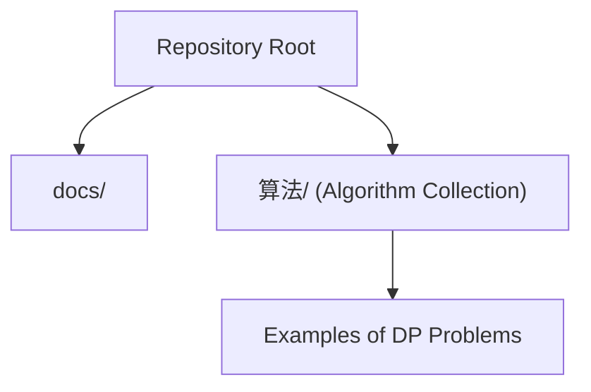

[No sources needed since this diagram shows conceptual structure]

## Core Components
This section outlines the essential building blocks of dynamic programming and how they manifest in the algorithm collection.

- Optimal Substructure
  - A problem exhibits optimal substructure if an optimal solution can be composed from optimal solutions of its subproblems. Many problems in the collection rely on breaking the problem into smaller pieces and combining their optimal results.
  - Example pattern: Longest Increasing Subsequence, Longest Common Subsequence, and Triangle path sums.

- Overlapping Subproblems
  - When a recursive solution revisits the same states repeatedly, memoization or tabulation can eliminate redundant work.
  - Example pattern: Fibonacci-like transitions (Climbing Stairs variants), Coin Change, and Grid path computations.

- Top-Down Memoization vs Bottom-Up Tabulation
  - Top-down uses recursion with caching to avoid recomputation.
  - Bottom-up iteratively fills a table from base cases upward.
  - Both approaches appear in the algorithm set, often with equivalent complexity.

- State Definition, Recurrence, and Base Cases
  - Define state carefully to capture minimal sufficient information.
  - Derive recurrence relation connecting current state to previously computed states.
  - Establish base cases to terminate recursion or initialize the DP table.

- Complexity Analysis and Space Optimization
  - Time complexity depends on number of states and transitions per state.
  - Space complexity can often be optimized from O(N) to O(1) or O(min(N, M)) by rolling arrays or reducing dimensionality.

[No sources needed since this section provides general guidance]

## Architecture Overview
The following conceptual architecture illustrates how DP problems are approached in this repository: recognizing the problem type, choosing a top-down or bottom-up method, defining states and transitions, and optimizing space.

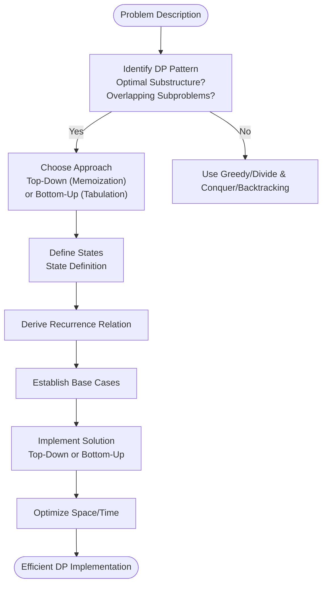

[No sources needed since this diagram shows conceptual workflow]

## Detailed Component Analysis

### Example 1: Longest Common Subsequence (LC 1143)
- Problem: Given two strings, find the length of the longest common subsequence.
- Pattern recognition:
  - Optimal substructure: LCS of prefixes determines LCS of full strings.
  - Overlapping subproblems: LCS(i, j) computed repeatedly.
- Approach: Bottom-up tabulation with a 2D table.
- State definition: dp[i][j] = LCS length of text1[0..i-1] and text2[0..j-1].
- Recurrence:
  - If text1[i-1] === text2[j-1]: dp[i][j] = dp[i-1][j-1] + 1
  - Else: dp[i][j] = max(dp[i-1][j], dp[i][j-1])
- Base cases: dp[0][*] = 0, dp[*][0] = 0.
- Complexity: Time O(N×M), Space O(N×M). Can be optimized to O(min(N,M)) using rolling rows.

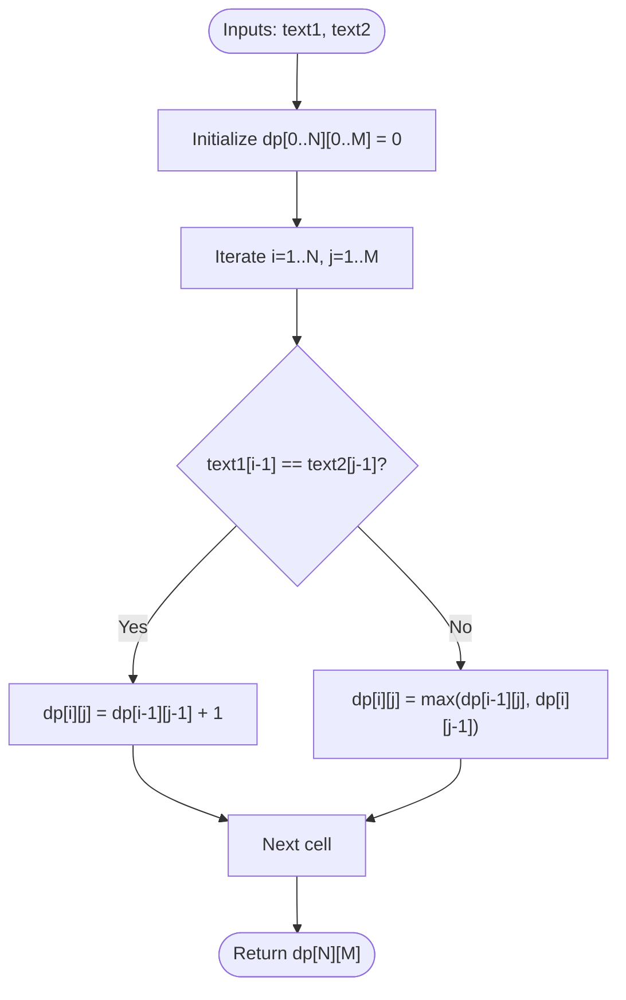

**Section sources**
- [1143.longest-common-subsequence.js](file://算法/1143.longest-common-subsequence.js)

### Example 2: Distinct Subsequences (LC 115)
- Problem: Count the number of distinct subsequences of string s that equal string t.
- Pattern recognition:
  - Optimal substructure: Count of subsequences ending at positions depend on counts at earlier positions.
  - Overlapping subproblems: Same subproblem arises when scanning characters.
- Approach: Bottom-up DP with 2D table.
- State definition: dp[i][j] = count of distinct subsequences of s[0..i-1] matching t[0..j-1].
- Recurrence:
  - If s[i-1] === t[j-1]: dp[i][j] = dp[i-1][j-1] + dp[i-1][j]
  - Else: dp[i][j] = dp[i-1][j]
- Base cases: dp[i][0] = 1 (empty string match), dp[0][j] = 0 (j > 0).
- Complexity: Time O(N×M), Space O(N×M). Rolling row optimization possible.

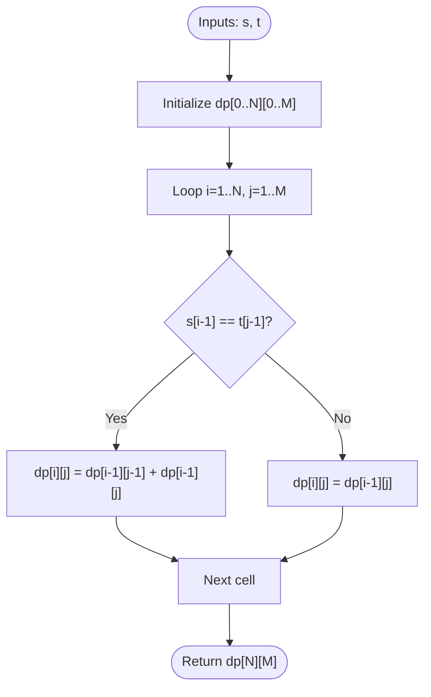

**Section sources**
- [115.distinct-subsequences.js](file://算法/115.distinct-subsequences.js)

### Example 3: Longest Increasing Subsequence (LC 300)
- Problem: Find the length of the longest increasing subsequence.
- Pattern recognition:
  - Optimal substructure: LIS ending at i depends on LIS among previous elements < nums[i].
  - Overlapping subproblems: Computing LIS lengths repeatedly.
- Approach: Bottom-up DP with O(N^2) transition; or optimized O(N log N) using patience sorting concept.
- State definition: dp[i] = LIS length ending at index i.
- Recurrence: dp[i] = max(dp[j] + 1) for all j < i and nums[j] < nums[i].
- Base cases: dp[*] initialized to 1.
- Complexity: Time O(N^2) or O(N log N), Space O(N).

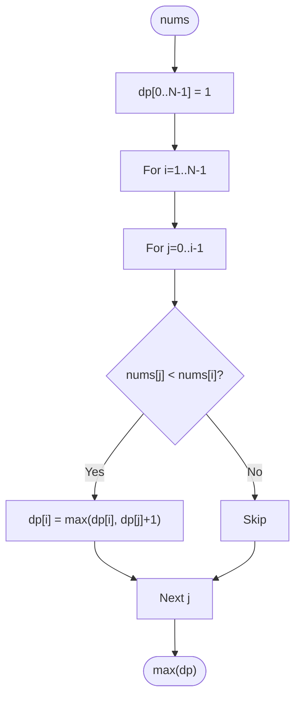

**Section sources**
- [300.longest-increasing-subsequence.js](file://算法/300.longest-increasing-subsequence.js)

### Example 4: Climbing Stairs (LC 70)
- Problem: Number of ways to climb n stairs taking 1 or 2 steps at a time.
- Pattern recognition:
  - Optimal substructure: Ways(n) = Ways(n-1) + Ways(n-2).
  - Overlapping subproblems: Exponential recursion without memoization.
- Approach: Top-down with memoization or bottom-up iteration.
- State definition: f(n) = number of ways to reach step n.
- Recurrence: f(n) = f(n-1) + f(n-2).
- Base cases: f(0) = 1, f(1) = 1.
- Complexity: Time O(N), Space O(N) or O(1).

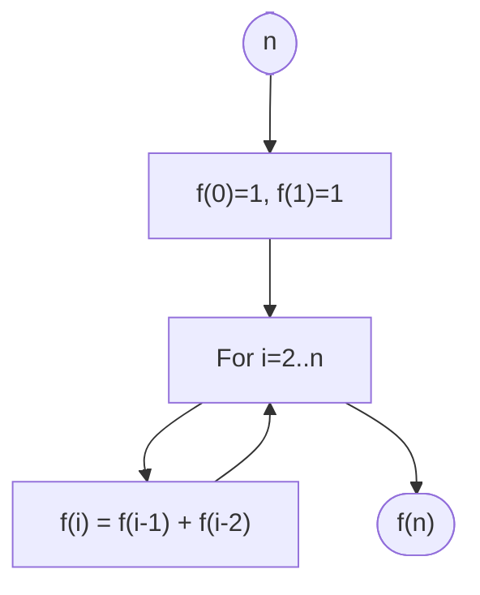

**Section sources**
- [70.climbing-stairs.js](file://算法/70.climbing-stairs.js)

### Example 5: House Robber (LC 198)
- Problem: Maximize sum avoiding adjacent houses.
- Pattern recognition:
  - Optimal substructure: Best sum up to i depends on best sums up to i-1 and i-2.
  - Overlapping subproblems: Same subproblems recur.
- Approach: Bottom-up DP with constant space.
- State definition: dp[i] = max value up to index i.
- Recurrence: dp[i] = max(dp[i-1], dp[i-2] + nums[i]).
- Base cases: dp[0] = nums[0], dp[1] = max(nums[0], nums[1]).
- Complexity: Time O(N), Space O(1).

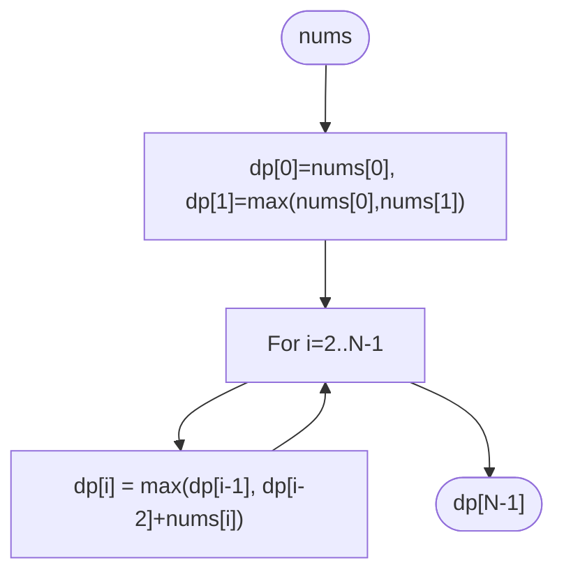

**Section sources**
- [198.house-robber.js](file://算法/198.house-robber.js)

### Example 6: Min Cost Climbing Stairs (LC 746)
- Problem: Minimum cost to reach the top of stairs with step costs.
- Pattern recognition:
  - Optimal substructure: Minimum cost to reach step i depends on min cost to reach i-1 and i-2.
  - Overlapping subproblems: Recursive calls repeat.
- Approach: Bottom-up DP with O(1) space.
- State definition: dp[i] = minimum cost to reach step i.
- Recurrence: dp[i] = cost[i] + min(dp[i-1], dp[i-2]).
- Base cases: dp[0] = cost[0], dp[1] = cost[1].
- Complexity: Time O(N), Space O(1).

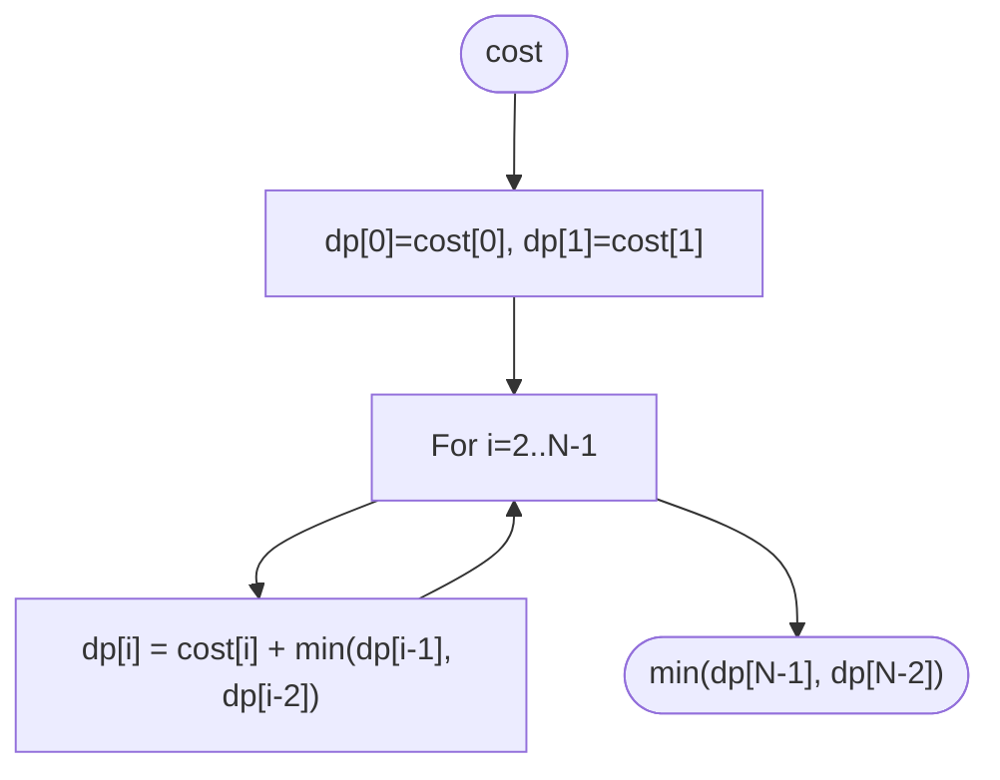

**Section sources**
- [746.min-cost-climbing-stairs.js](file://算法/746.min-cost-climbing-stairs.js)

### Example 7: Minimum Path Sum (LC 64)
- Problem: Minimum path sum from top-left to bottom-right in a grid with right/down moves.
- Pattern recognition:
  - Optimal substructure: Path sum to (i,j) depends on min of path sums to (i-1,j) and (i,j-1).
  - Overlapping subproblems: Many overlapping subproblems in grid traversal.
- Approach: Bottom-up DP with 2D table.
- State definition: dp[i][j] = min path sum to reach (i,j).
- Recurrence: dp[i][j] = grid[i][j] + min(dp[i-1][j], dp[i][j-1]).
- Base cases: First row and first column initialized cumulatively.
- Complexity: Time O(N×M), Space O(N×M) or O(M) with rolling array.

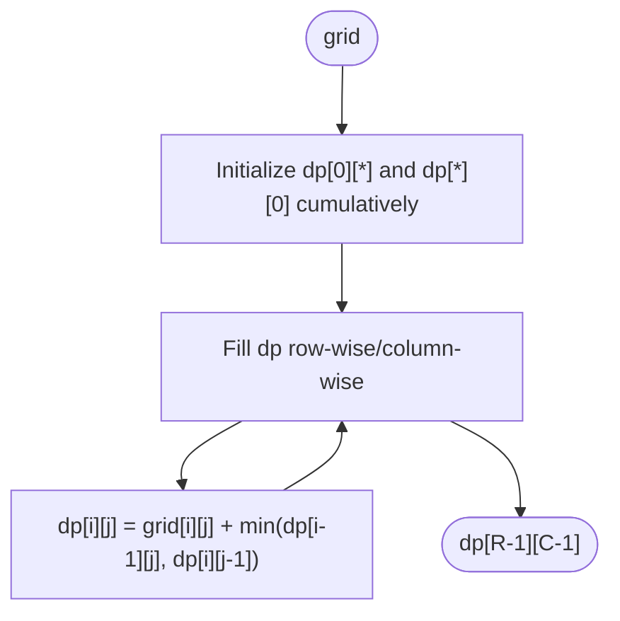

**Section sources**
- [64.minimum-path-sum.ts](file://算法/64.minimum-path-sum.ts)

### Example 8: Triangle (LC 120)
- Problem: Minimum path sum from top to bottom in a triangle.
- Pattern recognition:
  - Optimal substructure: Each cell’s minimum path depends on minimum paths of cells in the row below.
  - Overlapping subproblems: Same subproblems occur along paths.
- Approach: Bottom-up DP with O(N) space using a 1D array.
- State definition: dp[j] = minimum path sum to reach position j in the current row.
- Recurrence: dp[j] = triangle[i][j] + min(dp[j], dp[j+1]).
- Base cases: Initialize dp with last row.
- Complexity: Time O(N^2), Space O(N).

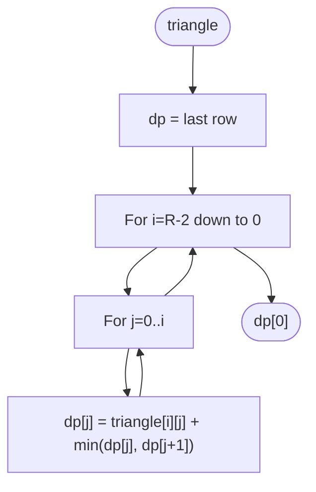

**Section sources**
- [120.triangle.ts](file://算法/120.triangle.ts)

### Example 9: Maximum Subarray (LC 53)
- Problem: Largest sum of a contiguous subarray.
- Pattern recognition:
  - Optimal substructure: At each index, decide whether to extend the existing subarray or start fresh.
  - Overlapping subproblems: Running best at each position.
- Approach: Kadane’s algorithm (single pass).
- State definition: curr = max sum ending at current index; best = global maximum.
- Recurrence: curr = max(nums[i], curr + nums[i]); best = max(best, curr).
- Base cases: curr = nums[0], best = nums[0].
- Complexity: Time O(N), Space O(1).

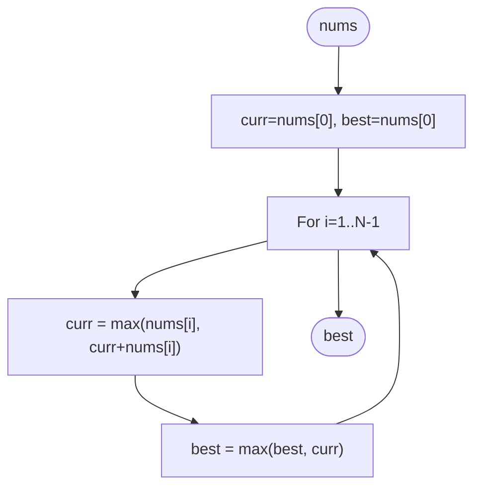

**Section sources**
- [53.maximum-subarray.js](file://算法/53.maximum-subarray.js)

### Example 10: Transforming Recurrence Relations (Pattern Across Problems)
- Many problems exhibit similar recurrence patterns:
  - Fibonacci-like transitions (Climbing Stairs variants)
  - Grid/path DP (Minimum Path Sum, Triangle)
  - LIS variants (Longest Increasing Subsequence)
  - LCS variants (Longest Common Subsequence, Distinct Subsequences)
- Strategy:
  - Identify state representation (indices, prefix lengths, or cumulative metrics)
  - Derive transitions based on allowed moves or choices
  - Initialize base cases consistently
  - Optimize space using rolling arrays or reduced dimensions

[No sources needed since this section provides general guidance]

## Dependency Analysis
DP solutions often depend on:
- Correct state definition to avoid missing transitions
- Proper initialization of base cases
- Efficient iteration order to ensure dependencies are resolved before use
- Space optimization by reusing arrays or limiting dimensions

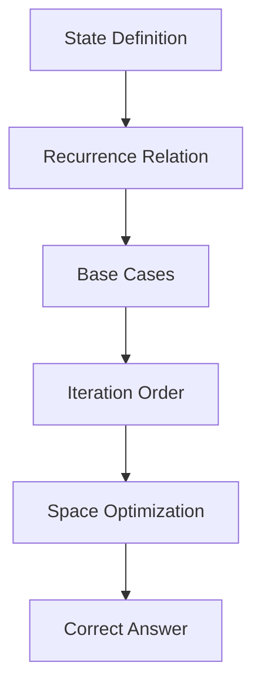

[No sources needed since this diagram shows conceptual relationships]

## Performance Considerations
- Time complexity is determined by the number of states multiplied by transitions per state.
- Space complexity can often be reduced from O(N×M) to O(min(N,M)) or even O(1) using rolling arrays or constant state variables.
- Prefer bottom-up tabulation when recursion depth might be large to avoid stack overflow.
- Use memoization judiciously to balance memory and speed.

[No sources needed since this section provides general guidance]

## Troubleshooting Guide
Common pitfalls and remedies:
- Off-by-one errors in indexing (especially for 0-based vs 1-based DP tables)
  - Verify base cases align with indices and loop bounds.
- Incorrect base case initialization
  - Ensure first row/column or initial positions are set correctly.
- Wrong iteration order
  - Ensure dependencies are computed before the current state.
- Memory limit exceeded
  - Apply rolling arrays or reduce dimensionality.
- Misdefined state
  - Keep state minimal and sufficient; avoid redundant dimensions.

[No sources needed since this section provides general guidance]

## Conclusion
Dynamic programming is a powerful technique for solving optimization problems with optimal substructure and overlapping subproblems. By systematically defining states, deriving recurrences, and implementing robust base cases, you can transform exponential recursive solutions into efficient polynomial-time algorithms. The algorithm collection demonstrates these patterns across classic problems, offering practical templates for top-down memoization and bottom-up tabulation, along with space optimization strategies.

## Appendices
- Practical checklist for DP problems:
  - Recognize optimal substructure and overlapping subproblems
  - Choose top-down or bottom-up approach
  - Define states precisely
  - Derive recurrence and base cases
  - Implement and optimize space
  - Validate with small examples and edge cases

[No sources needed since this section provides general guidance]