# Dynamic Programming

<cite>
**Referenced Files in This Document**
- [300.longest-increasing-subsequence.js](file://算法/300.longest-increasing-subsequence.js)
- [1143.longest-common-subsequence.js](file://算法/1143.longest-common-subsequence.js)
- [115.distinct-subsequences.js](file://算法/115.distinct-subsequences.js)
- [64.minimum-path-sum.ts](file://算法/64.minimum-path-sum.ts)
- [174.dungeon-game.js](file://算法/174.dungeon-game.js)
- [746.min-cost-climbing-stairs.js](file://算法/746.min-cost-climbing-stairs.js)
- [337.house-robber-iii.js](file://算法/337.house-robber-iii.js)
- [1091.shortest-path-in-binary-matrix.js](file://算法/1091.shortest-path-in-binary-matrix.js)
- [1391.check-if-there-is-a-valid-path-in-a-grid.js](file://算法/1391.check-if-there-is-a-valid-path-in-a-grid.js)
</cite>

## Table of Contents
1. [Introduction](#introduction)
2. [Project Structure](#project-structure)
3. [Core Components](#core-components)
4. [Architecture Overview](#architecture-overview)
5. [Detailed Component Analysis](#detailed-component-analysis)
6. [Dependency Analysis](#dependency-analysis)
7. [Performance Considerations](#performance-considerations)
8. [Troubleshooting Guide](#troubleshooting-guide)
9. [Conclusion](#conclusion)
10. [Appendices](#appendices)

## Introduction
This document presents a focused guide to dynamic programming (DP) concepts and implementation strategies, grounded in concrete examples from the repository. It explains core principles—optimal substructure and overlapping subproblems—and demonstrates top-down memoization and bottom-up tabulation. Classic problem categories covered include sequence problems (LIS, LCS, distinct subsequences), grid-based problems (minimum path sum, shortest path in binary matrix), and game/tree optimization (dungeon health, climbing stairs, house robber variant). For each category, we outline step-by-step breakdowns, recurrence relations, and complexity analyses, along with space optimization strategies.

## Project Structure
The repository organizes algorithm implementations primarily under the “算法” directory. For this document, we focus on DP-related files that illustrate core DP patterns and techniques. These files demonstrate both top-down recursion with memoization and bottom-up tabulation, often with space optimizations.

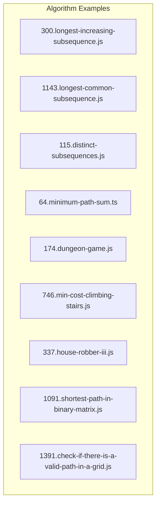

**Diagram sources**
- [300.longest-increasing-subsequence.js:1-37](file://算法/300.longest-increasing-subsequence.js#L1-L37)
- [1143.longest-common-subsequence.js:1-58](file://算法/1143.longest-common-subsequence.js#L1-L58)
- [115.distinct-subsequences.js:1-65](file://算法/115.distinct-subsequences.js#L1-L65)
- [64.minimum-path-sum.ts:1-52](file://算法/64.minimum-path-sum.ts#L1-L52)
- [174.dungeon-game.js:1-63](file://算法/174.dungeon-game.js#L1-L63)
- [746.min-cost-climbing-stairs.js:1-47](file://算法/746.min-cost-climbing-stairs.js#L1-L47)
- [337.house-robber-iii.js:1-65](file://算法/337.house-robber-iii.js#L1-L65)
- [1091.shortest-path-in-binary-matrix.js:1-81](file://算法/1091.shortest-path-in-binary-matrix.js#L1-L81)
- [1391.check-if-there-is-a-valid-path-in-a-grid.js:1-139](file://算法/1391.check-if-there-is-a-valid-path-in-a-grid.js#L1-L139)

**Section sources**
- [300.longest-increasing-subsequence.js:1-37](file://算法/300.longest-increasing-subsequence.js#L1-L37)
- [1143.longest-common-subsequence.js:1-58](file://算法/1143.longest-common-subsequence.js#L1-L58)
- [115.distinct-subsequences.js:1-65](file://算法/115.distinct-subsequences.js#L1-L65)
- [64.minimum-path-sum.ts:1-52](file://算法/64.minimum-path-sum.ts#L1-L52)
- [174.dungeon-game.js:1-63](file://算法/174.dungeon-game.js#L1-L63)
- [746.min-cost-climbing-stairs.js:1-47](file://算法/746.min-cost-climbing-stairs.js#L1-L47)
- [337.house-robber-iii.js:1-65](file://算法/337.house-robber-iii.js#L1-L65)
- [1091.shortest-path-in-binary-matrix.js:1-81](file://算法/1091.shortest-path-in-binary-matrix.js#L1-L81)
- [1391.check-if-there-is-a-valid-path-in-a-grid.js:1-139](file://算法/1391.check-if-there-is-a-valid-path-in-a-grid.js#L1-L139)

## Core Components
- Optimal substructure: Solutions to larger problems depend on optimal solutions to smaller subproblems.
- Overlapping subproblems: Subproblems recur multiple times; storing results avoids recomputation.
- Top-down memoization: Recursion with caching (e.g., map/dictionary) to store computed states.
- Bottom-up tabulation: Iterative fill of DP tables, often with rolling arrays for space optimization.

These principles appear across the selected files, each illustrating a canonical DP pattern.

**Section sources**
- [300.longest-increasing-subsequence.js:16-37](file://算法/300.longest-increasing-subsequence.js#L16-L37)
- [1143.longest-common-subsequence.js:17-42](file://算法/1143.longest-common-subsequence.js#L17-L42)
- [115.distinct-subsequences.js:17-53](file://算法/115.distinct-subsequences.js#L17-L53)
- [64.minimum-path-sum.ts:12-40](file://算法/64.minimum-path-sum.ts#L12-L40)
- [174.dungeon-game.js:16-47](file://算法/174.dungeon-game.js#L16-L47)
- [746.min-cost-climbing-stairs.js:16-35](file://算法/746.min-cost-climbing-stairs.js#L16-L35)
- [337.house-robber-iii.js:24-49](file://算法/337.house-robber-iii.js#L24-L49)

## Architecture Overview
The DP implementations in this repository follow a consistent pattern:
- Define state representation (indices, totals, or structural properties).
- Establish base cases and initialization.
- Derive transitions (recurrence relation) from smaller subproblems.
- Choose strategy:
  - Top-down: recursive descent with memoization.
  - Bottom-up: iterative table filling with minimal memory footprint.

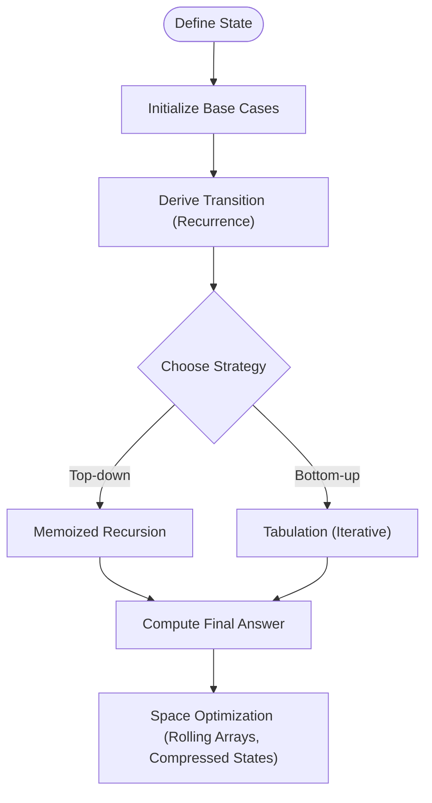

[No sources needed since this diagram shows conceptual workflow, not actual code structure]

## Detailed Component Analysis

### Longest Increasing Subsequence (LIS)
- Pattern: Sequence DP with O(n^2) tabulation; optimized O(n log n) exists but not shown here.
- State: dp[i] represents the length of the LIS ending at index i.
- Transition: For each i, check all j < i where nums[j] < nums[i], take max(dp[j]) + 1.
- Complexity: Time O(n^2), Space O(n).

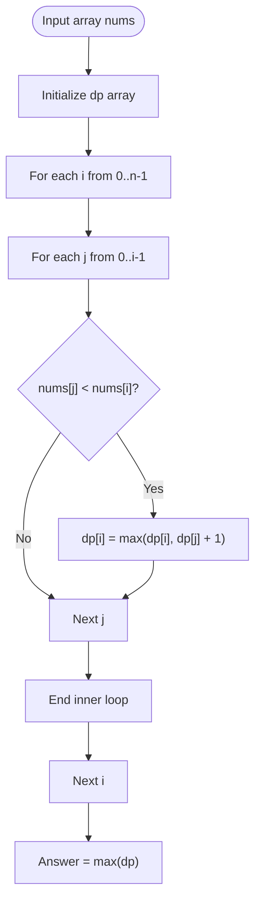

**Diagram sources**
- [300.longest-increasing-subsequence.js:16-37](file://算法/300.longest-increasing-subsequence.js#L16-L37)

**Section sources**
- [300.longest-increasing-subsequence.js:16-37](file://算法/300.longest-increasing-subsequence.js#L16-L37)

### Longest Common Subsequence (LCS)
- Pattern: Classic 2D grid DP.
- State: dp[i][j] is the LCS length for text1[0..i-1] and text2[0..j-1].
- Transition:
  - If text1[i-1] == text2[j-1]: dp[i][j] = dp[i-1][j-1] + 1
  - Else: dp[i][j] = max(dp[i-1][j], dp[i][j-1])
- Complexity: Time O(n*m), Space O(n*m).

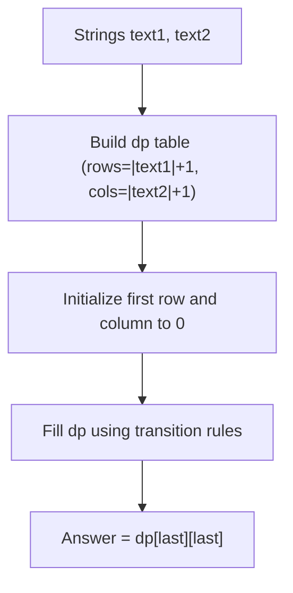

**Diagram sources**
- [1143.longest-common-subsequence.js:26-42](file://算法/1143.longest-common-subsequence.js#L26-L42)

**Section sources**
- [1143.longest-common-subsequence.js:17-42](file://算法/1143.longest-common-subsequence.js#L17-L42)

### Distinct Subsequences
- Pattern: Counting DP with 2D table.
- State: dp[i][j] counts distinct subsequences of t[0..j-1] in s[0..i-1].
- Transition: dp[i][j] = dp[i-1][j] + (if s[i-1]==t[j-1], then dp[i-1][j-1]).
- Initialization: First column filled with 1 (empty string match).
- Complexity: Time O(n*m), Space O(n*m).

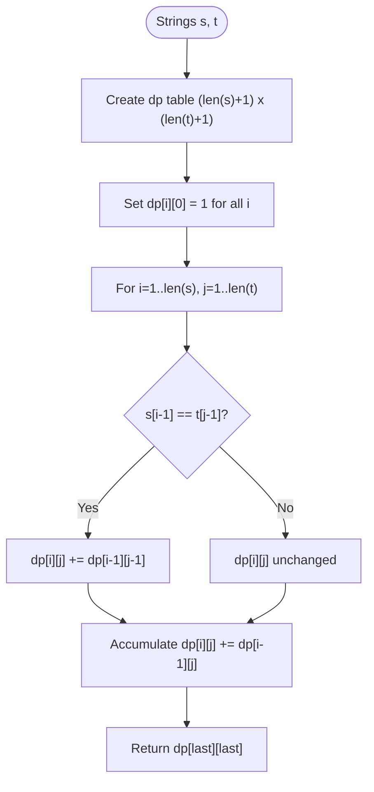

**Diagram sources**
- [115.distinct-subsequences.js:36-53](file://算法/115.distinct-subsequences.js#L36-L53)

**Section sources**
- [115.distinct-subsequences.js:17-53](file://算法/115.distinct-subsequences.js#L17-L53)

### Minimum Path Sum (Grid)
- Pattern: Bottom-up 2D DP with prefix initialization.
- State: dp[i][j] minimum path sum to reach cell (i, j).
- Transition: dp[i][j] = min(dp[i-1][j], dp[i][j-1]) + grid[i][j].
- Complexity: Time O(m*n), Space O(m*n); can be optimized to O(n) using rolling rows.

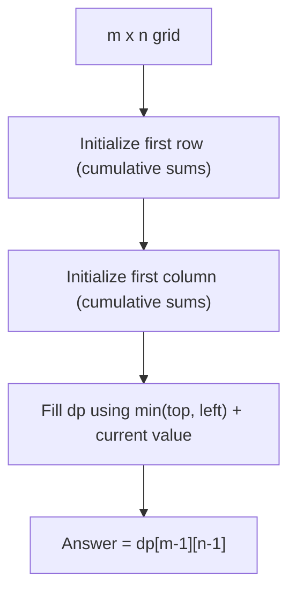

**Diagram sources**
- [64.minimum-path-sum.ts:18-40](file://算法/64.minimum-path-sum.ts#L18-L40)

**Section sources**
- [64.minimum-path-sum.ts:12-40](file://算法/64.minimum-path-sum.ts#L12-L40)

### Dungeon Game (Min HP)
- Pattern: Reverse DP (work backwards from finish).
- State: dp[i][j] minimal health needed at (i, j) to survive to the end.
- Transition: dp[i][j] = max(1, min(dp[i+1][j], dp[i][j+1]) - dungeon[i][j]).
- Complexity: Time O(m*n), Space O(m*n).

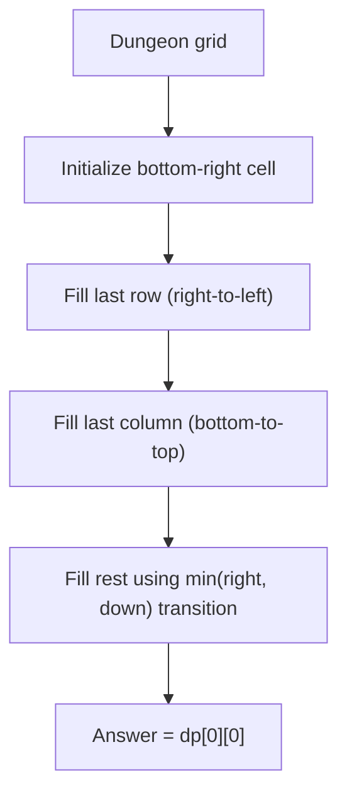

**Diagram sources**
- [174.dungeon-game.js:23-47](file://算法/174.dungeon-game.js#L23-L47)

**Section sources**
- [174.dungeon-game.js:16-47](file://算法/174.dungeon-game.js#L16-L47)

### Min Cost Climbing Stairs
- Pattern: Bottom-up with constant space.
- State: cost1, cost2 represent dp[i-2], dp[i-1].
- Transition: dp[i] = min(dp[i-1] + cost[i-1], dp[i-2] + cost[i-2]).
- Complexity: Time O(n), Space O(1).

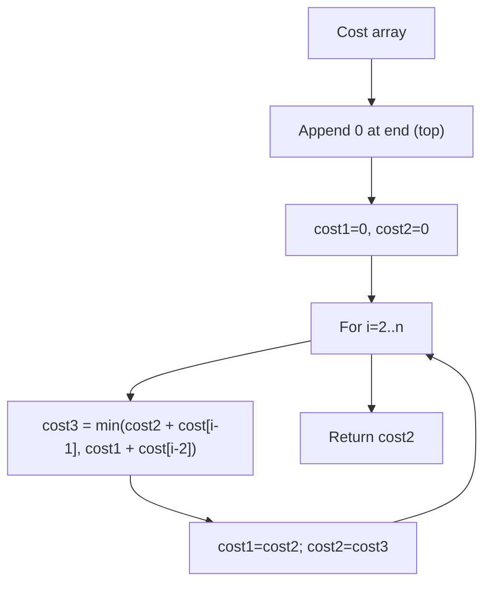

**Diagram sources**
- [746.min-cost-climbing-stairs.js:20-35](file://算法/746.min-cost-climbing-stairs.js#L20-L35)

**Section sources**
- [746.min-cost-climbing-stairs.js:16-35](file://算法/746.min-cost-climbing-stairs.js#L16-L35)

### House Robber III (Binary Tree)
- Pattern: Top-down with memoization on tree nodes.
- State: For each node, compute max value with and without robbing it.
- Transition: Use cached results to avoid recomputation; combine grandchildren vs. children outcomes.
- Complexity: Time O(nodes), Space O(height) for recursion stack plus cache.

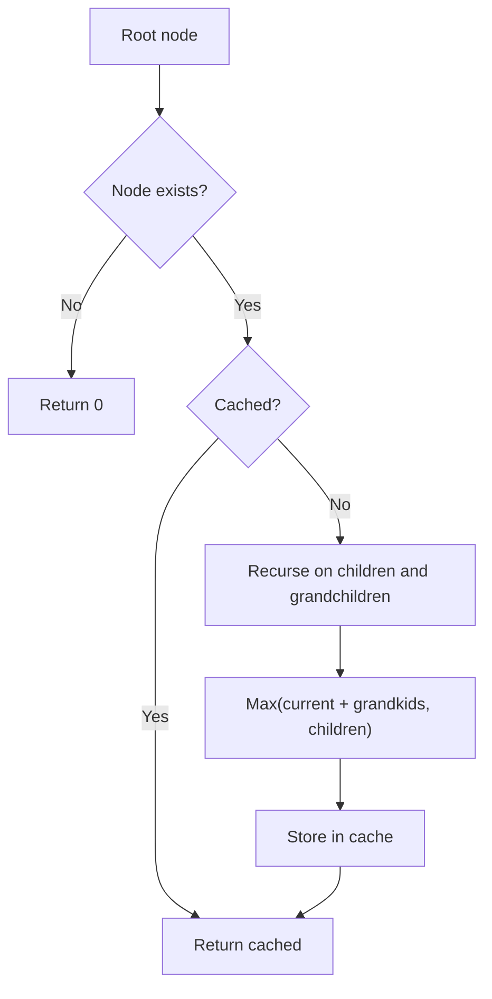

**Diagram sources**
- [337.house-robber-iii.js:24-49](file://算法/337.house-robber-iii.js#L24-L49)

**Section sources**
- [337.house-robber-iii.js:24-49](file://算法/337.house-robber-iii.js#L24-L49)

### Shortest Path in Binary Matrix (BFS)
- Pattern: Breadth-First Search (not strictly DP), but illustrates shortest path computation.
- State: Queue of coordinates with distance counter.
- Transition: Explore 8 directions; mark visited to avoid cycles.
- Complexity: Average O(m*n), worst-case depends on grid density.

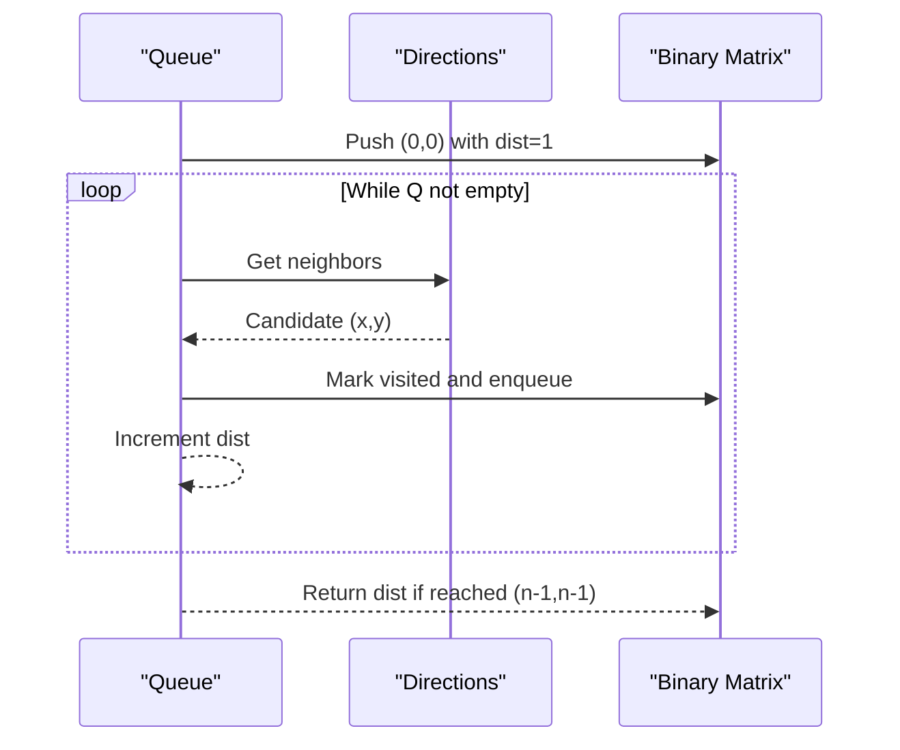

**Diagram sources**
- [1091.shortest-path-in-binary-matrix.js:20-65](file://算法/1091.shortest-path-in-binary-matrix.js#L20-L65)

**Section sources**
- [1091.shortest-path-in-binary-matrix.js:16-65](file://算法/1091.shortest-path-in-binary-matrix.js#L16-L65)

### Check if There Is a Valid Path in a Grid
- Pattern: Simulation with directional constraints; not DP, but demonstrates careful state transitions and boundary checks.
- State: Current position and previous position to ensure continuity.
- Transition: Based on street types, move to adjacent cells respecting bidirectional connectivity.
- Complexity: O(m*n) visits; constant extra space.

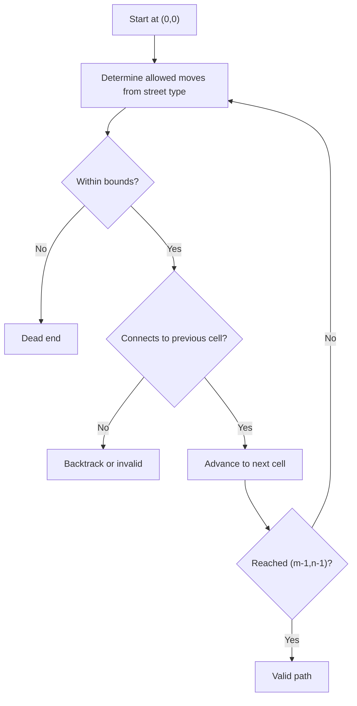

**Diagram sources**
- [1391.check-if-there-is-a-valid-path-in-a-grid.js:16-106](file://算法/1391.check-if-there-is-a-valid-path-in-a-grid.js#L16-L106)

**Section sources**
- [1391.check-if-there-is-a-valid-path-in-a-grid.js:16-106](file://算法/1391.check-if-there-is-a-valid-path-in-a-grid.js#L16-L106)

## Dependency Analysis
- Cohesion: Each file focuses on a single DP pattern or related problem family.
- Coupling: Minimal inter-file dependencies; each solution is self-contained.
- External dependencies: None; pure algorithmic implementations.

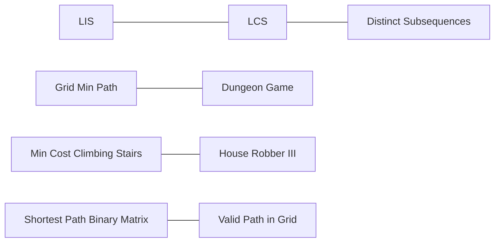

[No sources needed since this diagram shows conceptual relationships, not specific code structure]

**Section sources**
- [300.longest-increasing-subsequence.js:16-37](file://算法/300.longest-increasing-subsequence.js#L16-L37)
- [1143.longest-common-subsequence.js:17-42](file://算法/1143.longest-common-subsequence.js#L17-L42)
- [115.distinct-subsequences.js:17-53](file://算法/115.distinct-subsequences.js#L17-L53)
- [64.minimum-path-sum.ts:12-40](file://算法/64.minimum-path-sum.ts#L12-L40)
- [174.dungeon-game.js:16-47](file://算法/174.dungeon-game.js#L16-L47)
- [746.min-cost-climbing-stairs.js:16-35](file://算法/746.min-cost-climbing-stairs.js#L16-L35)
- [337.house-robber-iii.js:24-49](file://算法/337.house-robber-iii.js#L24-L49)
- [1091.shortest-path-in-binary-matrix.js:16-65](file://算法/1091.shortest-path-in-binary-matrix.js#L16-L65)
- [1391.check-if-there-is-a-valid-path-in-a-grid.js:16-106](file://算法/1391.check-if-there-is-a-valid-path-in-a-grid.js#L16-L106)

## Performance Considerations
- Prefer bottom-up tabulation when recursion depth risks overflow; it also enables easier space optimization.
- Use rolling arrays for 1D-like transitions (e.g., climbing stairs) to reduce memory from O(n) to O(1).
- Initialize boundaries carefully to avoid recomputation and off-by-one errors.
- For 2D DP, consider compressing rows/columns if only immediate neighbors are used.
- When applicable, switch to reverse DP (e.g., dungeon health) to simplify base cases and transitions.

[No sources needed since this section provides general guidance]

## Troubleshooting Guide
- Off-by-one errors in indices: Verify dp dimensions and base rows/columns.
- Incorrect base initialization: Ensure first row/column reflect empty prefixes or trivial cases.
- State definition mismatch: Confirm state captures sufficient information to derive transitions uniquely.
- Memory limits: Replace full 2D arrays with rolling arrays or streaming updates.
- Recursion depth: Convert top-down memoization to bottom-up tabulation for deep recursions.

[No sources needed since this section provides general guidance]

## Conclusion
The repository’s DP examples showcase canonical patterns: sequence DP (LIS, LCS, distinct subsequences), grid DP (min path sum, dungeon health), and structural DP (tree robber). By focusing on state definition, base cases, transitions, and space optimization, these implementations serve as practical templates for solving similar problems efficiently.

[No sources needed since this section summarizes without analyzing specific files]

## Appendices
- Complexity summary:
  - LIS (tabulated): Time O(n^2), Space O(n)
  - LCS: Time O(n*m), Space O(n*m)
  - Distinct Subsequences: Time O(n*m), Space O(n*m)
  - Minimum Path Sum: Time O(m*n), Space O(m*n) or O(n) with rolling
  - Dungeon Game: Time O(m*n), Space O(m*n)
  - Min Cost Climbing Stairs: Time O(n), Space O(1)
  - House Robber III: Time O(nodes), Space O(height) plus cache
  - Shortest Path Binary Matrix: Average O(m*n), BFS frontier
  - Valid Path in Grid: O(m*n), simulation with connectivity checks

[No sources needed since this section provides general guidance]