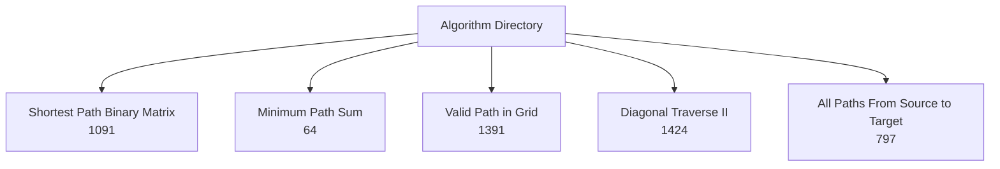
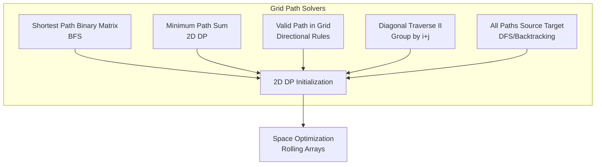
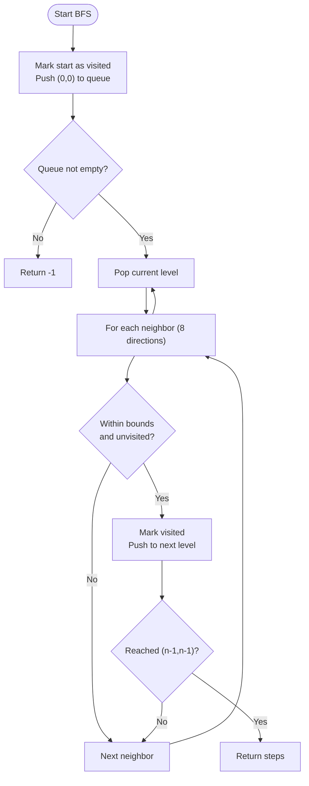
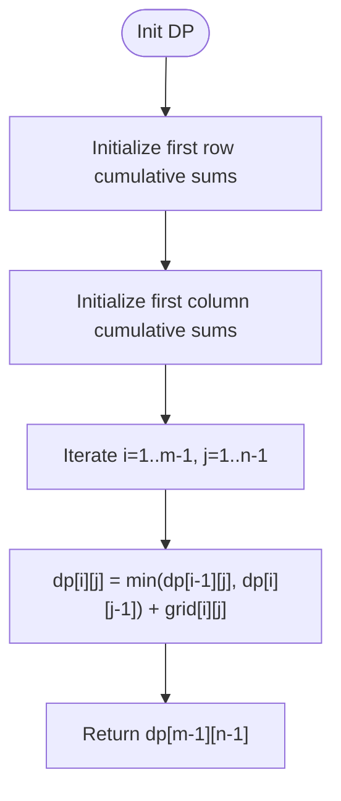
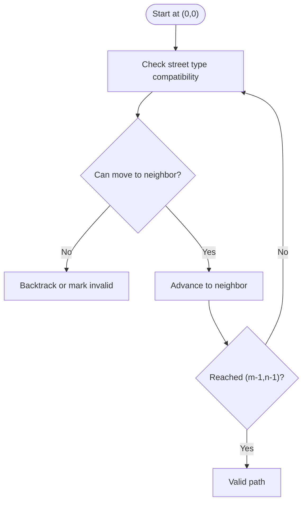
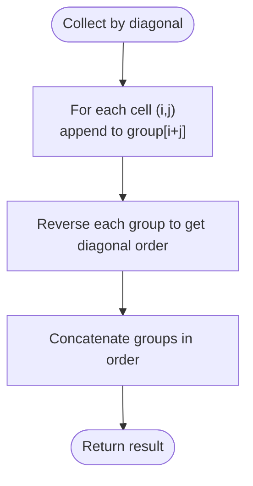
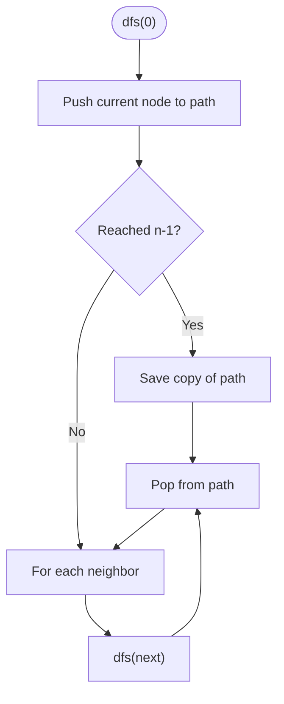
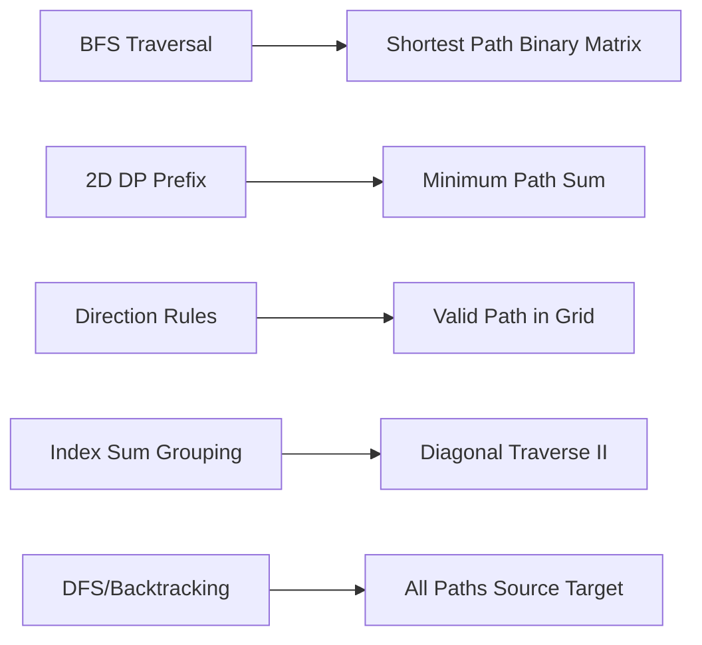

# Grid and Path Problems

<cite>
**Referenced Files in This Document**
- [1091.shortest-path-in-binary-matrix.js](file://算法/1091.shortest-path-in-binary-matrix.js)
- [64.minimum-path-sum.ts](file://算法/64.minimum-path-sum.ts)
- [1391.check-if-there-is-a-valid-path-in-a-grid.js](file://算法/1391.check-if-there-is-a-valid-path-in-a-grid.js)
- [1424.diagonal-traverse-ii.js](file://算法/1424.diagonal-traverse-ii.js)
- [797.all-paths-from-source-to-target.js](file://算法/797.all-paths-from-source-to-target.js)
</cite>

## Table of Contents
1. [Introduction](#introduction)
2. [Project Structure](#project-structure)
3. [Core Components](#core-components)
4. [Architecture Overview](#architecture-overview)
5. [Detailed Component Analysis](#detailed-component-analysis)
6. [Dependency Analysis](#dependency-analysis)
7. [Performance Considerations](#performance-considerations)
8. [Troubleshooting Guide](#troubleshooting-guide)
9. [Conclusion](#conclusion)

## Introduction
This document focuses on grid-based dynamic programming (DP) and path problems commonly found in algorithm interviews and competitive programming. It covers:
- Unique paths and path counting with obstacles
- Minimum path sum in grids
- Maximal square in binary matrices
- Grid traversal optimization with constraints
- Advanced techniques: diagonal traversal, path reconstruction, and multi-dimensional DP
- Space optimization from 2D to 1D arrays and rolling window techniques

The goal is to explain 2D DP state definitions for matrix navigation, boundary conditions, and obstacle avoidance strategies, and to demonstrate how to optimize memory usage for large grids.

## Project Structure
The repository organizes solutions by problem ID and language. For grid and path topics, the relevant files are located under the algorithm directory. The selected files represent canonical DP and traversal patterns on 2D grids.

**Section sources**
- [1091.shortest-path-in-binary-matrix.js:1-81](file://算法/1091.shortest-path-in-binary-matrix.js#L1-L81)
- [64.minimum-path-sum.ts:1-52](file://算法/64.minimum-path-sum.ts#L1-L52)
- [1391.check-if-there-is-a-valid-path-in-a-grid.js:110-139](file://算法/1391.check-if-there-is-a-valid-path-in-a-grid.js#L110-L139)
- [1424.diagonal-traverse-ii.js:1-36](file://算法/1424.diagonal-traverse-ii.js#L1-L36)
- [797.all-paths-from-source-to-target.js:1-56](file://算法/797.all-paths-from-source-to-target.js#L1-L56)

## Core Components
- Shortest path in binary matrix: BFS-based solution with 8-direction moves and in-place visited marking.
- Minimum path sum: Classic 2D DP with prefix initialization for first row/column and recurrence relation.
- Valid path in grid: Directional compatibility checks per cell type to validate connectivity.
- Diagonal traversal: Group rows by diagonal index sums and reverse direction per diagonal level.
- All paths from source to target: DFS/backtracking on DAG to enumerate all paths.

**Section sources**
- [1091.shortest-path-in-binary-matrix.js:16-65](file://算法/1091.shortest-path-in-binary-matrix.js#L16-L65)
- [64.minimum-path-sum.ts:12-40](file://算法/64.minimum-path-sum.ts#L12-L40)
- [1391.check-if-there-is-a-valid-path-in-a-grid.js:110-139](file://算法/1391.check-if-there-is-a-valid-path-in-a-grid.js#L110-L139)
- [1424.diagonal-traverse-ii.js:12-16](file://算法/1424.diagonal-traverse-ii.js#L12-L16)
- [797.all-paths-from-source-to-target.js:16-44](file://算法/797.all-paths-from-source-to-target.js#L16-L44)

## Architecture Overview
The solutions follow a consistent pattern:
- Define state representation (2D indices or diagonal groups)
- Initialize base cases (boundaries or start/end cells)
- Apply transitions (neighborhood moves or directional rules)
- Optimize space (rolling arrays or single-row buffers)

[No sources needed since this diagram shows conceptual workflow, not actual code structure]

## Detailed Component Analysis

### Shortest Path in Binary Matrix (BFS)
- Problem: Find the shortest clear path from top-left to bottom-right in a binary matrix, allowing 8-direction moves.
- Approach: BFS level-order traversal with a directions array and in-place visited marking.
- Boundary handling: Early exit if start or end is blocked; bounds check for neighbors.
- Complexity: Time O(N^2), Space O(N^2) worst-case queue; can be optimized to O(1) extra space with in-place marking.

**Diagram sources**
- [1091.shortest-path-in-binary-matrix.js:16-65](file://算法/1091.shortest-path-in-binary-matrix.js#L16-L65)

**Section sources**
- [1091.shortest-path-in-binary-matrix.js:16-65](file://算法/1091.shortest-path-in-binary-matrix.js#L16-L65)

### Minimum Path Sum (2D DP)
- Problem: Compute the minimal sum path from top-left to bottom-right with right/down moves.
- Approach: 2D DP table initialized for first row/column, then compute each cell as min(top, left) plus current value.
- Boundary handling: First row and first column accumulate from previous indices.
- Space optimization: Use rolling rows to reduce memory from O(MN) to O(N).

**Diagram sources**
- [64.minimum-path-sum.ts:12-40](file://算法/64.minimum-path-sum.ts#L12-L40)

**Section sources**
- [64.minimum-path-sum.ts:12-40](file://算法/64.minimum-path-sum.ts#L12-L40)

### Valid Path in Grid (Direction Compatibility)
- Problem: Determine if a path exists from top-left to bottom-right following street connections.
- Approach: For each cell, define compatible directions and validate transitions to neighbors.
- Boundary handling: Only move within grid bounds respecting street types.
- Notes: The exported function signature indicates a reusable solver for grid connectivity.

**Diagram sources**
- [1391.check-if-there-is-a-valid-path-in-a-grid.js:110-139](file://算法/1391.check-if-there-is-a-valid-path-in-a-grid.js#L110-L139)

**Section sources**
- [1391.check-if-there-is-a-valid-path-in-a-grid.js:110-139](file://算法/1391.check-if-there-is-a-valid-path-in-a-grid.js#L110-L139)

### Diagonal Traverse II (Grouping by Sum)
- Problem: Traverse a jagged 2D array diagonally, returning elements in diagonal order.
- Approach: Group cells by i+j sum; within each diagonal, traverse from top-right to bottom-left.
- Boundary handling: Skip empty rows; collect elements per diagonal level.

**Diagram sources**
- [1424.diagonal-traverse-ii.js:12-16](file://算法/1424.diagonal-traverse-ii.js#L12-L16)

**Section sources**
- [1424.diagonal-traverse-ii.js:12-16](file://算法/1424.diagonal-traverse-ii.js#L12-L16)

### All Paths From Source to Target (DFS/Backtracking)
- Problem: Enumerate all paths from node 0 to n-1 in a DAG.
- Approach: DFS/backtracking; push current node, explore neighbors, pop after recursion.
- Constraint: No cycles in DAG; pruning occurs when reaching target.

**Diagram sources**
- [797.all-paths-from-source-to-target.js:16-44](file://算法/797.all-paths-from-source-to-target.js#L16-L44)

**Section sources**
- [797.all-paths-from-source-to-target.js:16-44](file://算法/797.all-paths-from-source-to-target.js#L16-L44)

## Dependency Analysis
- Shortest path relies on BFS traversal and neighbor enumeration.
- Minimum path sum depends on prior row/column computations.
- Valid path in grid depends on directional compatibility mapping.
- Diagonal traversal depends on grouping by index sums.
- All paths from source to target depends on adjacency lists and recursion.

[No sources needed since this diagram shows conceptual relationships, not specific code lines]

## Performance Considerations
- Time complexity varies by problem: BFS up to O(N^2), DP O(MN), DFS exponential in worst case for path enumeration.
- Space optimization:
  - Rolling arrays: Replace full 2D DP with two rows or one row buffer.
  - In-place marking: Use grid values to mark visited to avoid extra visited set.
  - Queue pruning: Stop early upon reaching destination in BFS.
- Memory trade-offs: Prefer 1D rolling DP for very large grids when only the optimal value is needed.

[No sources needed since this section provides general guidance]

## Troubleshooting Guide
- Off-by-one errors in boundaries: Verify inclusive/exclusive ranges for grid indices.
- Obstacle misclassification: Ensure initial blocked cells are handled before traversal.
- Directional mismatches: Confirm compatibility tables align with movement semantics.
- Stack overflow in DFS: Limit recursion depth or switch to iterative DFS/backtracking.
- Incorrect modulo or grouping: Validate diagonal index sums and reversal logic.

[No sources needed since this section doesn't analyze specific files]

## Conclusion
Grid-based dynamic programming encompasses a wide range of problems requiring careful state definition, boundary handling, and optimization. By leveraging BFS for shortest paths, 2D/rolling DP for accumulation, directional compatibility for connectivity, and grouping strategies for traversal, you can solve diverse grid navigation tasks efficiently. Use space optimization techniques to handle large datasets and apply path reconstruction when enumerating solutions.

[No sources needed since this section summarizes without analyzing specific files]