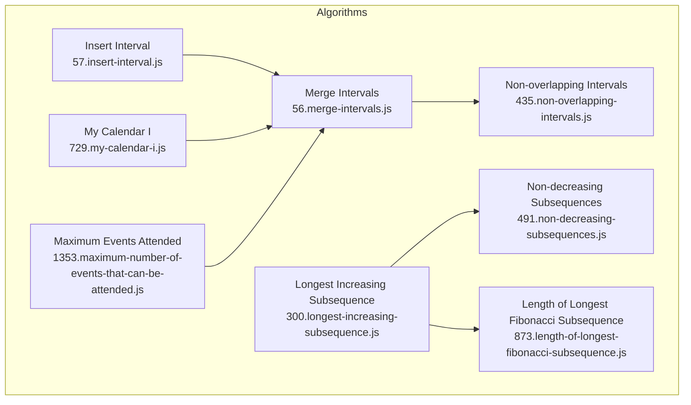
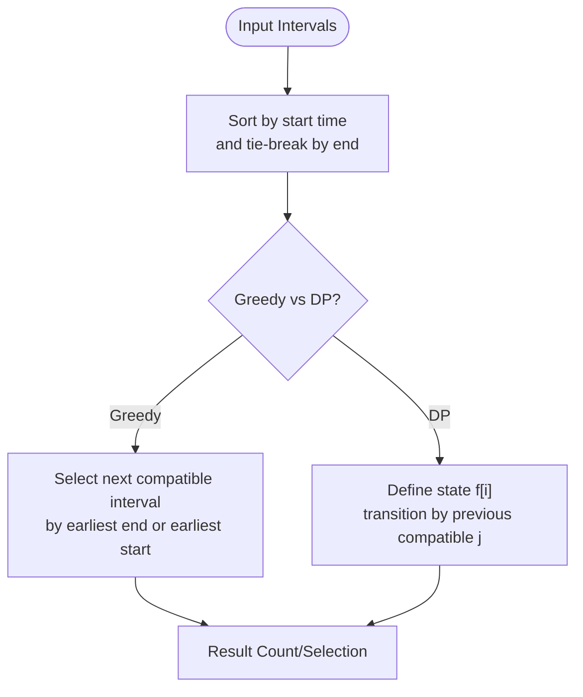
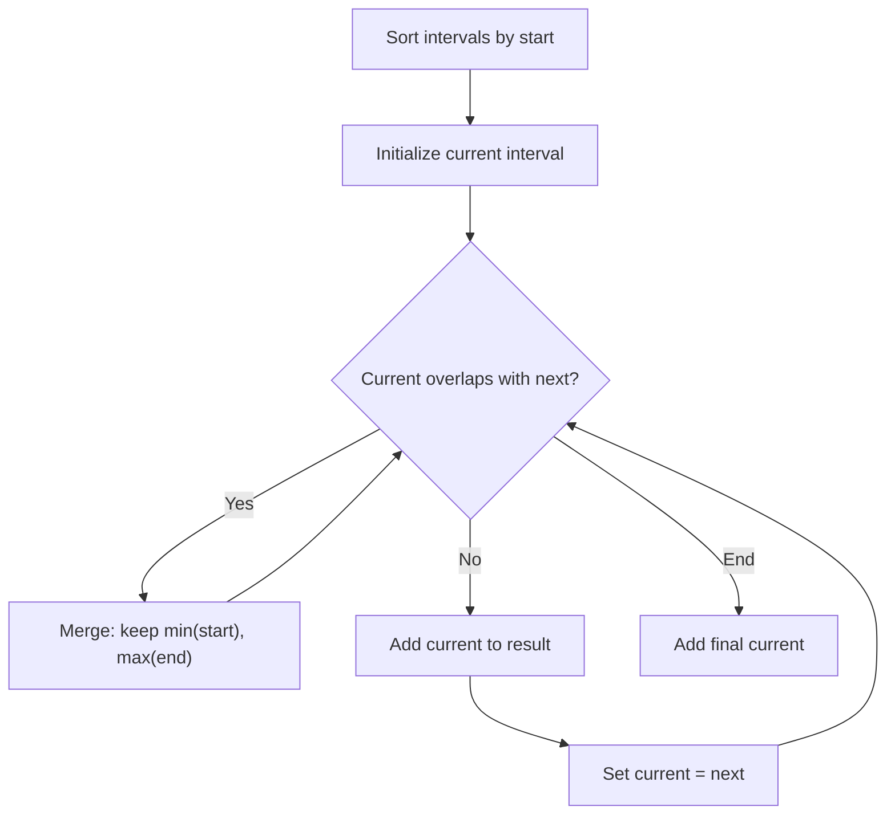
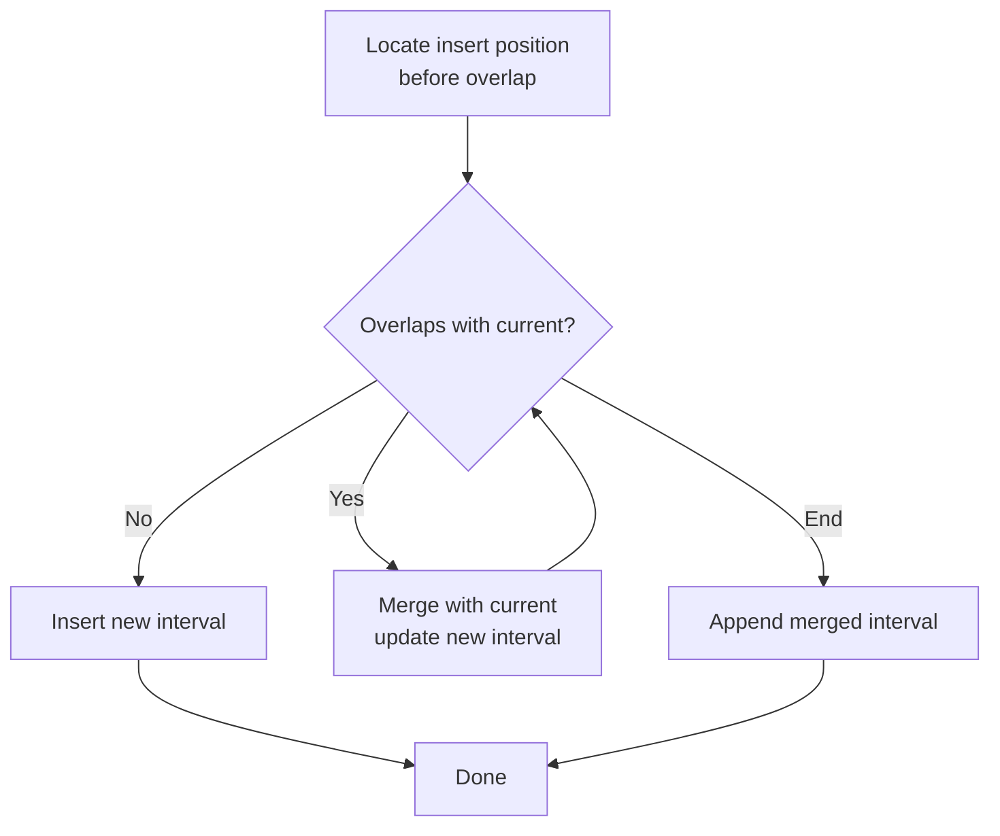
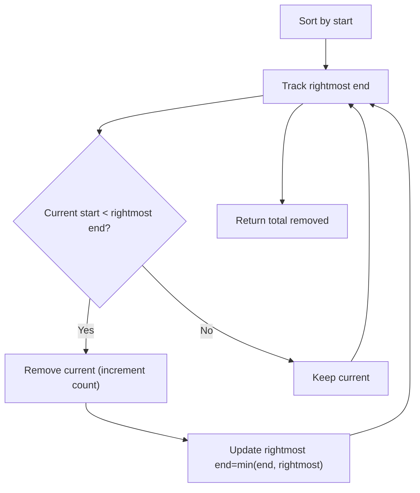
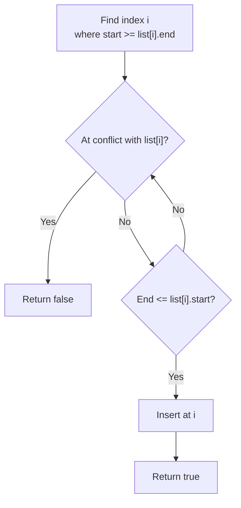
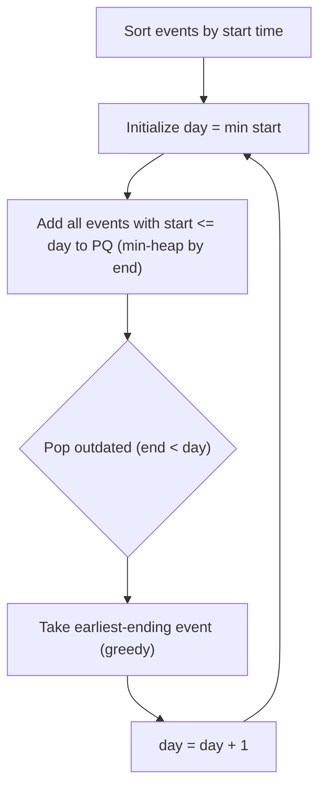
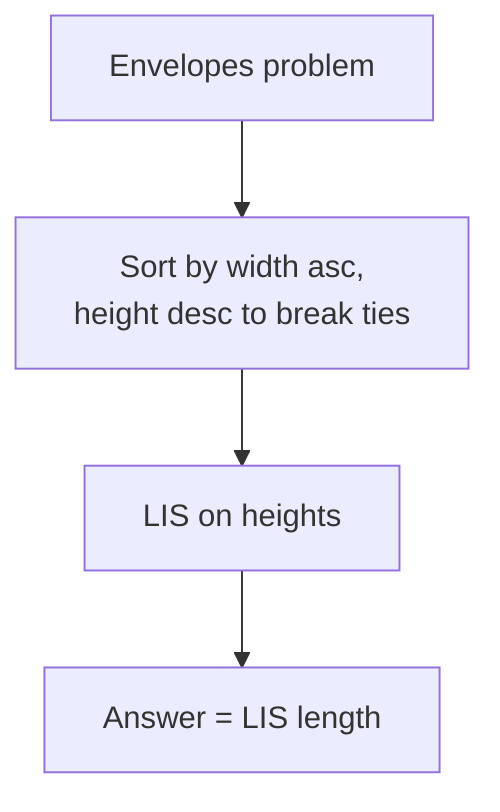
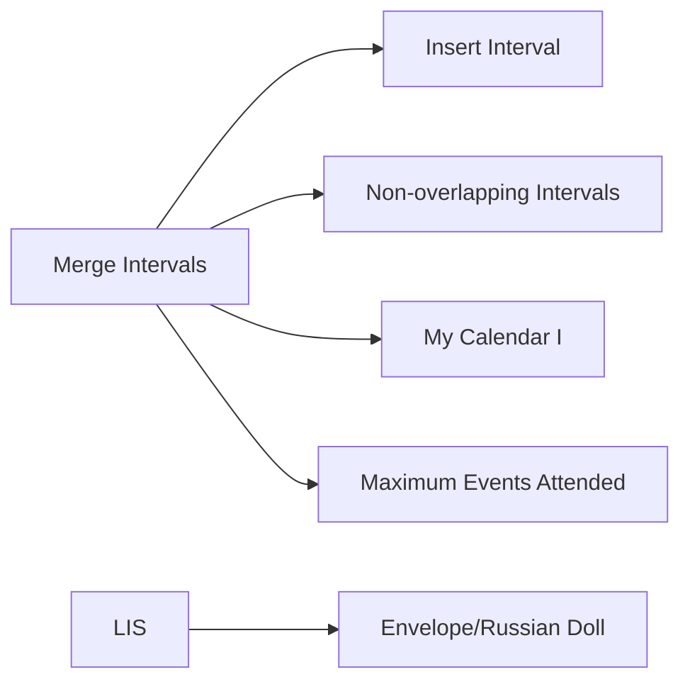

# Interval and Range Problems

<cite>
**Referenced Files in This Document**
- [435.non-overlapping-intervals.js](file://算法/435.non-overlapping-intervals.js)
- [56.merge-intervals.js](file://算法/56.merge-intervals.js)
- [57.insert-interval.js](file://算法/57.insert-interval.js)
- [729.my-calendar-i.js](file://算法/729.my-calendar-i.js)
- [1353.maximum-number-of-events-that-can-be-attended.js](file://算法/1353.maximum-number-of-events-that-can-be-attended.js)
- [300.longest-increasing-subsequence.js](file://算法/300.longest-increasing-subsequence.js)
- [491.non-decreasing-subsequences.js](file://算法/491.non-decreasing-subsequences.js)
- [873.length-of-longest-fibonacci-subsequence.js](file://算法/873.length-of-longest-fibonacci-subsequence.js)
</cite>

## Table of Contents
1. [Introduction](#introduction)
2. [Project Structure](#project-structure)
3. [Core Components](#core-components)
4. [Architecture Overview](#architecture-overview)
5. [Detailed Component Analysis](#detailed-component-analysis)
6. [Dependency Analysis](#dependency-analysis)
7. [Performance Considerations](#performance-considerations)
8. [Troubleshooting Guide](#troubleshooting-guide)
9. [Conclusion](#conclusion)
10. [Appendices](#appendices)

## Introduction
This document focuses on interval-based dynamic programming and greedy problems. It consolidates practical implementations for:
- Interval scheduling and calendar booking
- Merge intervals and insert intervals
- Activity selection and event attendance
- Envelope/Russian doll problems via LIS-like transformations
- Sorting strategies and greedy-DP hybrid approaches
- State definitions for interval relationships and dependency chains
- Advanced techniques for overlapping intervals, weight maximization, and multi-dimensional constraints

The goal is to help you recognize optimal substructure, transform interval problems into LIS-like structures, and apply efficient DP or greedy strategies.

## Project Structure
The repository includes multiple interval and LIS-related implementations under the algorithm directory. The selected files demonstrate classic interval operations and LIS-derived transformations.

**Diagram sources**
- [56.merge-intervals.js:16-40](file://算法/56.merge-intervals.js#L16-L40)
- [57.insert-interval.js:17-45](file://算法/57.insert-interval.js#L17-L45)
- [435.non-overlapping-intervals.js:16-37](file://算法/435.non-overlapping-intervals.js#L16-L37)
- [729.my-calendar-i.js:13-43](file://算法/729.my-calendar-i.js#L13-L43)
- [1353.maximum-number-of-events-that-can-be-attended.js:16-25](file://算法/1353.maximum-number-of-events-that-can-be-attended.js#L16-L25)
- [300.longest-increasing-subsequence.js:16-37](file://算法/300.longest-increasing-subsequence.js#L16-L37)
- [491.non-decreasing-subsequences.js:16-45](file://算法/491.non-decreasing-subsequences.js#L16-L45)
- [873.length-of-longest-fibonacci-subsequence.js:16-38](file://算法/873.length-of-longest-fibonacci-subsequence.js#L16-L38)

**Section sources**
- [56.merge-intervals.js:16-40](file://算法/56.merge-intervals.js#L16-L40)
- [57.insert-interval.js:17-45](file://算法/57.insert-interval.js#L17-L45)
- [435.non-overlapping-intervals.js:16-37](file://算法/435.non-overlapping-intervals.js#L16-L37)
- [729.my-calendar-i.js:13-43](file://算法/729.my-calendar-i.js#L13-L43)
- [1353.maximum-number-of-events-that-can-be-attended.js:16-25](file://算法/1353.maximum-number-of-events-that-can-be-attended.js#L16-L25)
- [300.longest-increasing-subsequence.js:16-37](file://算法/300.longest-increasing-subsequence.js#L16-L37)
- [491.non-decreasing-subsequences.js:16-45](file://算法/491.non-decreasing-subsequences.js#L16-L45)
- [873.length-of-longest-fibonacci-subsequence.js:16-38](file://算法/873.length-of-longest-fibonacci-subsequence.js#L16-L38)

## Core Components
- Merge intervals: Linear scan after sorting by start time; merge overlapping segments.
- Insert interval: Locate insertion position and merge intersecting intervals.
- Non-overlapping intervals: Greedy removal strategy minimizing overlaps by keeping the interval that ends latest.
- Calendar booking: Maintain sorted list and binary-search-like insertion to detect overlap.
- Event attendance: Greedy by end time to maximize count.
- LIS and LIS-like transforms: Recognizing envelopes as LIS over width and height pairs.

Key implementation references:
- Merge intervals: [merge:16-40](file://算法/56.merge-intervals.js#L16-L40)
- Insert interval: [insert:17-45](file://算法/57.insert-interval.js#L17-L45)
- Non-overlapping intervals: [eraseOverlapIntervals:16-37](file://算法/435.non-overlapping-intervals.js#L16-L37)
- Calendar booking: [MyCalendar.book:23-43](file://算法/729.my-calendar-i.js#L23-L43)
- Event attendance: [maxEvents:16-25](file://算法/1353.maximum-number-of-events-that-can-be-attended.js#L16-L25)
- LIS: [lengthOfLIS:16-37](file://算法/300.longest-increasing-subsequence.js#L16-L37)
- Non-decreasing subsequences: [findSubsequences:16-45](file://算法/491.non-decreasing-subsequences.js#L16-L45)
- Fibonacci subsequence: [lenLongestFibSubseq:16-38](file://算法/873.length-of-longest-fibonacci-subsequence.js#L16-L38)

**Section sources**
- [56.merge-intervals.js:16-40](file://算法/56.merge-intervals.js#L16-L40)
- [57.insert-interval.js:17-45](file://算法/57.insert-interval.js#L17-L45)
- [435.non-overlapping-intervals.js:16-37](file://算法/435.non-overlapping-intervals.js#L16-L37)
- [729.my-calendar-i.js:13-43](file://算法/729.my-calendar-i.js#L13-L43)
- [1353.maximum-number-of-events-that-can-be-attended.js:16-25](file://算法/1353.maximum-number-of-events-that-can-be-attended.js#L16-L25)
- [300.longest-increasing-subsequence.js:16-37](file://算法/300.longest-increasing-subsequence.js#L16-L37)
- [491.non-decreasing-subsequences.js:16-45](file://算法/491.non-decreasing-subsequences.js#L16-L45)
- [873.length-of-longest-fibonacci-subsequence.js:16-38](file://算法/873.length-of-longest-fibonacci-subsequence.js#L16-L38)

## Architecture Overview
The interval family shares a common pipeline:
- Normalize intervals (sort by start, then by end when needed)
- Greedy decisions or DP transitions based on ordering
- Optional auxiliary data structures (priority queues, sets, maps)

[No sources needed since this diagram shows conceptual workflow, not actual code structure]

## Detailed Component Analysis

### Merge Intervals
- Strategy: Sort by start time; iterate and merge when overlap exists.
- Complexity: O(n log n) for sort plus O(n) scan.

**Diagram sources**
- [56.merge-intervals.js:16-40](file://算法/56.merge-intervals.js#L16-L40)

**Section sources**
- [56.merge-intervals.js:16-40](file://算法/56.merge-intervals.js#L16-L40)

### Insert Interval
- Strategy: Find insertion index respecting order; merge intersecting intervals greedily.

**Diagram sources**
- [57.insert-interval.js:17-45](file://算法/57.insert-interval.js#L17-L45)

**Section sources**
- [57.insert-interval.js:17-45](file://算法/57.insert-interval.js#L17-L45)

### Non-overlapping Intervals (Removal Minimization)
- Strategy: Greedily keep the interval that ends latest among overlapping candidates.

**Diagram sources**
- [435.non-overlapping-intervals.js:16-37](file://算法/435.non-overlapping-intervals.js#L16-L37)

**Section sources**
- [435.non-overlapping-intervals.js:16-37](file://算法/435.non-overlapping-intervals.js#L16-L37)

### My Calendar I
- Strategy: Maintain a sorted list; locate insertion point and check neighbors for overlap.

**Diagram sources**
- [729.my-calendar-i.js:23-43](file://算法/729.my-calendar-i.js#L23-L43)

**Section sources**
- [729.my-calendar-i.js:13-43](file://算法/729.my-calendar-i.js#L13-L43)

### Maximum Number of Events That Can Be Attended
- Strategy: Greedy by end time; use a priority queue to track latest end times.

**Diagram sources**
- [1353.maximum-number-of-events-that-can-be-attended.js:16-25](file://算法/1353.maximum-number-of-events-that-can-be-attended.js#L16-L25)

**Section sources**
- [1353.maximum-number-of-events-that-can-be-attended.js:16-25](file://算法/1353.maximum-number-of-events-that-can-be-attended.js#L16-L25)

### LIS and LIS-like Transforms
- Longest Increasing Subsequence: Classic DP with O(n^2) or optimized with patience sorting.
- Non-decreasing subsequences: Backtracking with pruning and deduplication.
- Fibonacci subsequence: Enumerate first two elements and extend while lookup succeeds.

**Diagram sources**
- [300.longest-increasing-subsequence.js:16-37](file://算法/300.longest-increasing-subsequence.js#L16-L37)
- [491.non-decreasing-subsequences.js:16-45](file://算法/491.non-decreasing-subsequences.js#L16-L45)
- [873.length-of-longest-fibonacci-subsequence.js:16-38](file://算法/873.length-of-longest-fibonacci-subsequence.js#L16-L38)

**Section sources**
- [300.longest-increasing-subsequence.js:16-37](file://算法/300.longest-increasing-subsequence.js#L16-L37)
- [491.non-decreasing-subsequences.js:16-45](file://算法/491.non-decreasing-subsequences.js#L16-L45)
- [873.length-of-longest-fibonacci-subsequence.js:16-38](file://算法/873.length-of-longest-fibonacci-subsequence.js#L16-L38)

## Dependency Analysis
- Merge intervals is foundational for insert and non-overlapping removal.
- Calendar booking relies on ordered storage and neighbor checks.
- Event attendance builds on merge-like ordering and greedy selection.
- LIS-based transforms generalize envelope problems.

[No sources needed since this diagram shows conceptual relationships, not specific code structure]

## Performance Considerations
- Sorting dominates complexity for most interval problems; ensure O(n log n) sort and linear passes.
- Use greedy strategies when applicable to avoid O(n^2) DP.
- For LIS variants, consider patience sorting or coordinate compression to reduce dimensionality.
- Maintain auxiliary structures (e.g., heaps) carefully to avoid extra overhead.

[No sources needed since this section provides general guidance]

## Troubleshooting Guide
Common pitfalls and remedies:
- Off-by-one errors in interval comparisons (start vs end).
- Incorrect tie-breaking when sorting by start time; consider secondary sort by end.
- For greedy removal, always keep the interval ending latest among conflicts.
- In calendar booking, remember to compare against both predecessor and successor intervals.
- For LIS transforms, ensure stable sorting to break ties correctly (width ascending, height descending).

**Section sources**
- [56.merge-intervals.js:16-40](file://算法/56.merge-intervals.js#L16-L40)
- [57.insert-interval.js:17-45](file://算法/57.insert-interval.js#L17-L45)
- [435.non-overlapping-intervals.js:16-37](file://算法/435.non-overlapping-intervals.js#L16-L37)
- [729.my-calendar-i.js:23-43](file://算法/729.my-calendar-i.js#L23-L43)
- [1353.maximum-number-of-events-that-can-be-attended.js:16-25](file://算法/1353.maximum-number-of-events-that-can-be-attended.js#L16-L25)
- [300.longest-increasing-subsequence.js:16-37](file://算法/300.longest-increasing-subsequence.js#L16-L37)

## Conclusion
Interval and range problems frequently reduce to:
- Ordering and greedy selection (merge, insert, remove overlap, calendar booking, event attendance)
- LIS-like structures (envelope/Russian dolls)
Mastering these patterns and their state definitions enables robust solutions across diverse constraints and objectives.

[No sources needed since this section summarizes without analyzing specific files]

## Appendices
- State definitions:
  - f[i]: LIS ending at i
  - rightmost_end: greedy tracker for non-overlapping removal
  - PQ of ends: greedy event attendance
- Dependency chains:
  - Merge → Insert → Non-overlapping Removal
  - Merge → Calendar Booking
  - Merge → Event Attendance
  - LIS → Envelope/Russian Doll

[No sources needed since this section provides general guidance]