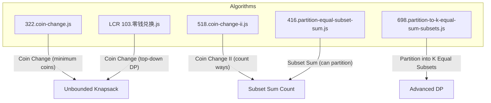
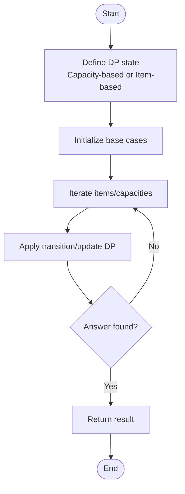
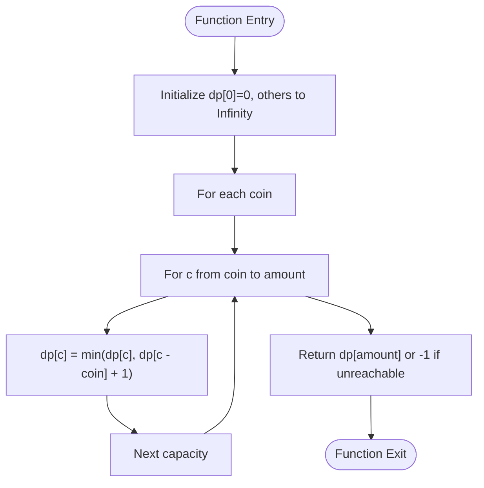
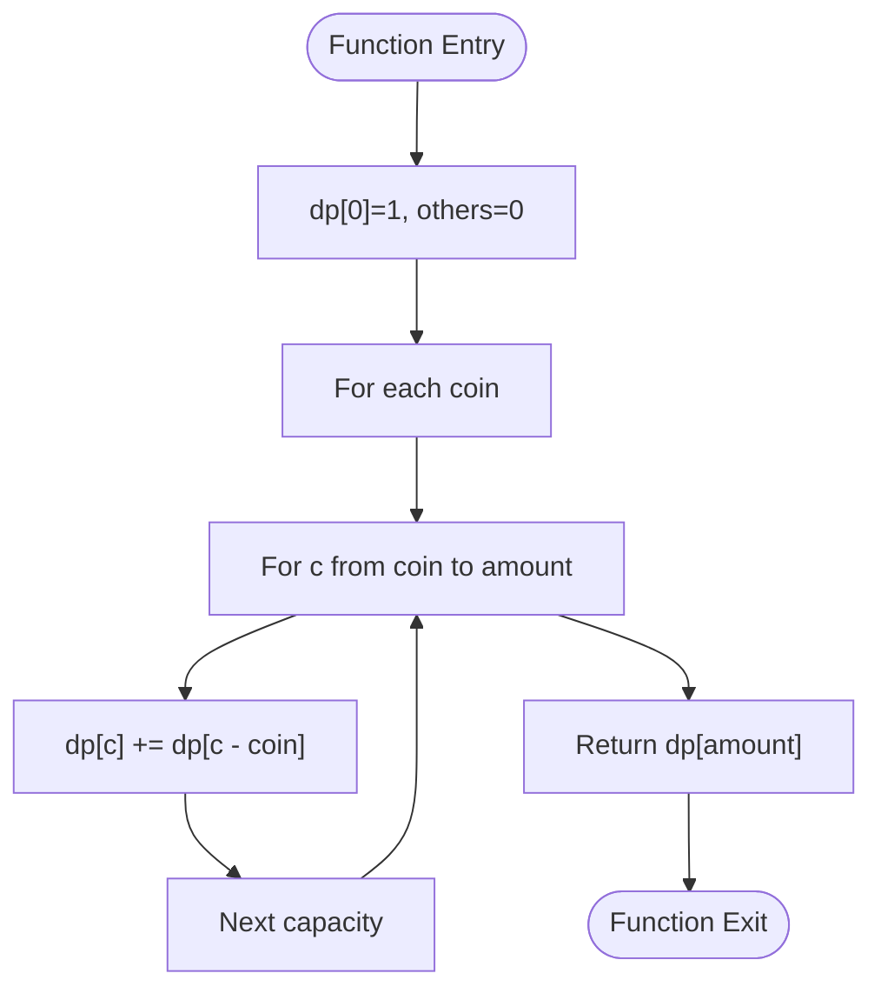
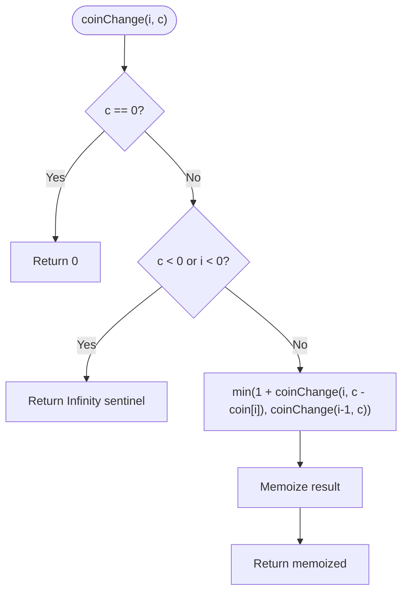
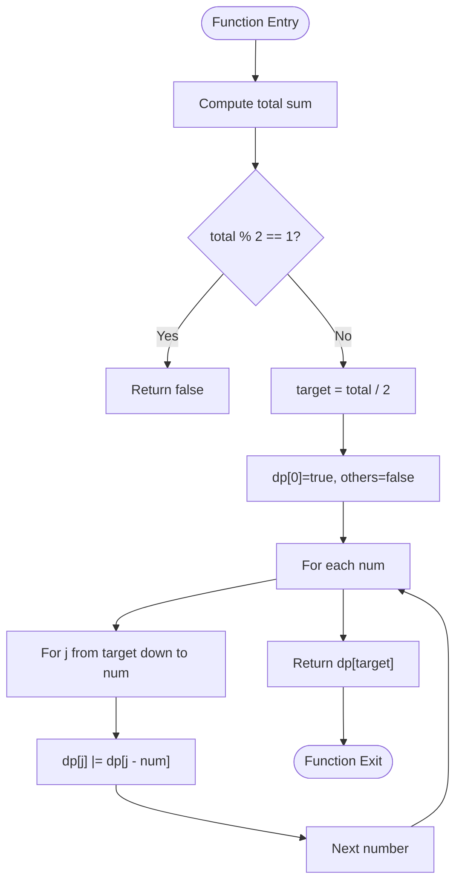
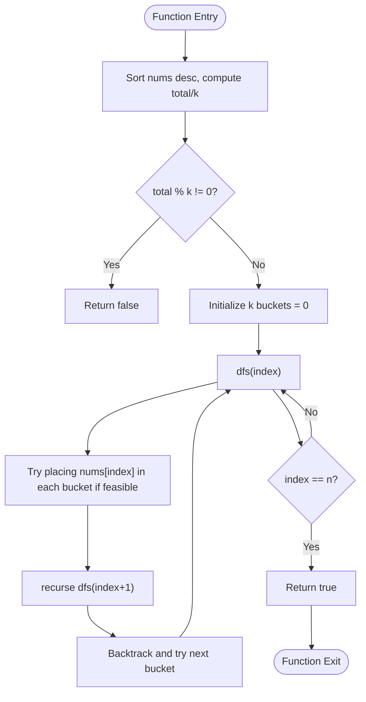
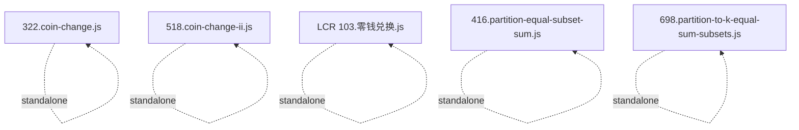

# Knapsack Family

<cite>
**Referenced Files in This Document**
- [322.coin-change.js](file://算法/322.coin-change.js)
- [518.coin-change-ii.js](file://算法/518.coin-change-ii.js)
- [LCR 103.零钱兑换.js](file://算法/LCR 103.零钱兑换.js)
- [416.partition-equal-subset-sum.js](file://算法/416.partition-equal-subset-sum.js)
- [698.partition-to-k-equal-sum-subsets.js](file://算法/698.partition-to-k-equal-sum-subsets.js)
</cite>

## Table of Contents
1. [Introduction](#introduction)
2. [Project Structure](#project-structure)
3. [Core Components](#core-components)
4. [Architecture Overview](#architecture-overview)
5. [Detailed Component Analysis](#detailed-component-analysis)
6. [Dependency Analysis](#dependency-analysis)
7. [Performance Considerations](#performance-considerations)
8. [Troubleshooting Guide](#troubleshooting-guide)
9. [Conclusion](#conclusion)
10. [Appendices](#appendices)

## Introduction
This document explains knapsack-type dynamic programming problems with a focus on classic formulations and related variants present in the repository. It covers:
- Classic 0/1 knapsack and unbounded knapsack
- Subset sum and coin change problems
- Capacity constraints and value maximization/minimization
- State formulations: item-based vs capacity-based
- Advanced variations: partition into equal subsets, partition into k equal subsets
- Optimization techniques: space compression and rolling arrays

The goal is to help readers understand the core DP patterns, translate them across problem types, and apply optimizations for large constraints.

## Project Structure
The knapsack-family content in this repository is primarily represented by several JavaScript implementations under the “算法” directory. These files demonstrate different DP formulations and variations of knapsack/subset/partition problems.

**Diagram sources**
- [322.coin-change.js:17-46](file://算法/322.coin-change.js#L17-L46)
- [518.coin-change-ii.js:17-54](file://算法/518.coin-change-ii.js#L17-L54)
- [LCR 103.零钱兑换.js:17-57](file://算法/LCR 103.零钱兑换.js#L17-L57)
- [416.partition-equal-subset-sum.js:16-49](file://算法/416.partition-equal-subset-sum.js#L16-L49)
- [698.partition-to-k-equal-sum-subsets.js:17-48](file://算法/698.partition-to-k-equal-sum-subsets.js#L17-L48)

**Section sources**
- [322.coin-change.js:1-66](file://算法/322.coin-change.js#L1-L66)
- [518.coin-change-ii.js:1-74](file://算法/518.coin-change-ii.js#L1-L74)
- [LCR 103.零钱兑换.js:1-90](file://算法/LCR 103.零钱兑换.js#L1-L90)
- [416.partition-equal-subset-sum.js:1-65](file://算法/416.partition-equal-subset-sum.js#L1-L65)
- [698.partition-to-k-equal-sum-subsets.js:1-48](file://算法/698.partition-to-k-equal-sum-subsets.js#L1-L48)

## Core Components
- Unbounded knapsack via coin change (minimum coins): Uses a capacity-based DP state where dp[c] represents the minimum number of coins to form amount c.
- Subset sum count (coin change II): Uses a capacity-based DP where dp[c] counts the number of combinations to form amount c.
- Top-down coin change with memoization: Demonstrates item-based recursion with pruning and early exits.
- Subset sum feasibility (can partition): Transforms the problem into a subset sum feasibility check with capacity target = total/2.
- Partition into K equal subsets: Backtracking with pruning and capacity-based checks per bucket.

Key DP patterns:
- Item-based state: f(i, c) depends on considering or skipping item i.
- Capacity-based state: f(c) depends on previously computed capacities up to c.

Optimization highlights:
- Space compression: Rolling arrays reduce O(n·W) to O(W) space.
- Pruning and early termination: Skip impossible branches and return early upon success.

**Section sources**
- [322.coin-change.js:17-46](file://算法/322.coin-change.js#L17-L46)
- [518.coin-change-ii.js:17-54](file://算法/518.coin-change-ii.js#L17-L54)
- [LCR 103.零钱兑换.js:17-57](file://算法/LCR 103.零钱兑换.js#L17-L57)
- [416.partition-equal-subset-sum.js:16-49](file://算法/416.partition-equal-subset-sum.js#L16-L49)
- [698.partition-to-k-equal-sum-subsets.js:17-48](file://算法/698.partition-to-k-equal-sum-subsets.js#L17-L48)

## Architecture Overview
The implementations share a common DP architecture: define state, initialize base cases, iterate transitions, and derive answers. Some use top-down recursion with memoization, others bottom-up iteration.

[No sources needed since this diagram shows conceptual workflow, not actual code structure]

## Detailed Component Analysis

### Unbounded Knapsack: Coin Change (Minimum Coins)
- Problem: Given coin denominations and a target amount, find the minimum number of coins to reach the amount.
- State: dp[c] = minimum coins to form capacity c.
- Transition: For each coin, relax dp[c] using dp[c - coin] + 1.
- Space: Bottom-up O(amount) with rolling array.

**Diagram sources**
- [322.coin-change.js:26-45](file://算法/322.coin-change.js#L26-L45)

**Section sources**
- [322.coin-change.js:17-46](file://算法/322.coin-change.js#L17-L46)

### Subset Sum Count: Coin Change II
- Problem: Count the number of combinations to form a target amount using unlimited coins.
- State: dp[c] = number of ways to form capacity c.
- Transition: For each coin, accumulate dp[c] += dp[c - coin].
- Base case: dp[0] = 1.

**Diagram sources**
- [518.coin-change-ii.js:29-53](file://算法/518.coin-change-ii.js#L29-L53)

**Section sources**
- [518.coin-change-ii.js:17-54](file://算法/518.coin-change-ii.js#L17-L54)

### Top-Down Coin Change with Memoization
- Approach: Recursively decide whether to include a coin or skip it, memoizing results.
- Early exit: If a subproblem is unsolvable, prune further exploration.
- Useful for scenarios where branching factors are large but pruning reduces work.

**Diagram sources**
- [LCR 103.零钱兑换.js:37-54](file://算法/LCR 103.零钱兑换.js#L37-L54)

**Section sources**
- [LCR 103.零钱兑换.js:17-57](file://算法/LCR 103.零钱兑换.js#L17-L57)

### Subset Sum Feasibility: Can Partition Equal Subset
- Transformation: If total sum is odd, impossible. Target = total / 2. Check if a subset sums to target.
- State: dp[j] indicates whether sum j is achievable.
- Transition: For each number, update dp from right to left to avoid reuse.

**Diagram sources**
- [416.partition-equal-subset-sum.js:21-46](file://算法/416.partition-equal-subset-sum.js#L21-L46)

**Section sources**
- [416.partition-equal-subset-sum.js:16-49](file://算法/416.partition-equal-subset-sum.js#L16-L49)

### Partition to K Equal Subsets
- Approach: Backtracking with pruning. Maintain k buckets; try placing each number into valid buckets.
- Pruning: Sort descending, skip duplicate placements, early terminate when solution found.

**Diagram sources**
- [698.partition-to-k-equal-sum-subsets.js:22-47](file://算法/698.partition-to-k-equal-sum-subsets.js#L22-L47)

**Section sources**
- [698.partition-to-k-equal-sum-subsets.js:17-48](file://算法/698.partition-to-k-equal-sum-subsets.js#L17-L48)

## Dependency Analysis
- All implementations are self-contained single-file solutions.
- There are no inter-file imports or shared modules among the knapsack-family files.
- The repository also includes other algorithm categories (e.g., graph, math, string), but they are not directly coupled to these DP files.

**Diagram sources**
- [322.coin-change.js:1-66](file://算法/322.coin-change.js#L1-L66)
- [518.coin-change-ii.js:1-74](file://算法/518.coin-change-ii.js#L1-L74)
- [LCR 103.零钱兑换.js:1-90](file://算法/LCR 103.零钱兑换.js#L1-L90)
- [416.partition-equal-subset-sum.js:1-65](file://算法/416.partition-equal-subset-sum.js#L1-L65)
- [698.partition-to-k-equal-sum-subsets.js:1-48](file://算法/698.partition-to-k-equal-sum-subsets.js#L1-L48)

**Section sources**
- [322.coin-change.js:1-66](file://算法/322.coin-change.js#L1-L66)
- [518.coin-change-ii.js:1-74](file://算法/518.coin-change-ii.js#L1-L74)
- [LCR 103.零钱兑换.js:1-90](file://算法/LCR 103.零钱兑换.js#L1-L90)
- [416.partition-equal-subset-sum.js:1-65](file://算法/416.partition-equal-subset-sum.js#L1-L65)
- [698.partition-to-k-equal-sum-subsets.js:1-48](file://算法/698.partition-to-k-equal-sum-subsets.js#L1-L48)

## Performance Considerations
- Time complexity:
  - Unbounded knapsack (minimum coins): O(amount · number_of_coins)
  - Subset sum count (coin change II): O(amount · number_of_coins)
  - Subset sum feasibility: O(total_sum · n) with capacity target
  - Partition to K equal subsets: Exponential worst-case; heavy pruning improves practical runtime
- Space complexity:
  - Bottom-up capacity-based DP: O(amount) after rolling array optimization
  - Top-down memoization: O(amount) for state cache plus recursion depth
- Optimizations:
  - Rolling arrays: Replace 2D dp[i][c] with 1D dp[c] by iterating capacities backwards for item-based updates.
  - Pruning: Sort inputs, early exits, and branch pruning in backtracking.
  - Meet-in-the-middle: Not implemented in the current files; applicable for subset problems with very large constraints to reduce complexity from O(2^n) to O(2^{n/2}).

[No sources needed since this section provides general guidance]

## Troubleshooting Guide
Common pitfalls and remedies:
- Integer overflow and off-by-one errors in capacity indexing.
- Incorrect base cases (e.g., dp[0] should reflect solvability).
- Order of iteration matters for item-based updates; when using 1D dp, iterate capacities in reverse order to avoid reusing the same item multiple times.
- For backtracking, ensure pruning conditions prevent redundant branches and maintain correctness.

**Section sources**
- [322.coin-change.js:26-45](file://算法/322.coin-change.js#L26-L45)
- [518.coin-change-ii.js:29-53](file://算法/518.coin-change-ii.js#L29-L53)
- [LCR 103.零钱兑换.js:37-54](file://算法/LCR 103.零钱兑换.js#L37-L54)
- [416.partition-equal-subset-sum.js:21-46](file://算法/416.partition-equal-subset-sum.js#L21-L46)
- [698.partition-to-k-equal-sum-subsets.js:22-47](file://算法/698.partition-to-k-equal-sum-subsets.js#L22-L47)

## Conclusion
The repository demonstrates canonical DP patterns for knapsack-family problems:
- Unbounded knapsack (minimum coins) and subset sum counting
- Top-down memoization and capacity-based bottom-up DP
- Subset feasibility and advanced partitioning with backtracking and pruning

These patterns generalize to classic 0/1 knapsack, subset sum, and coin change variations. For extremely large constraints, consider space compression, rolling arrays, and advanced techniques like meet-in-the-middle.

[No sources needed since this section summarizes without analyzing specific files]

## Appendices
- State formulation guide:
  - Item-based: f(i, c) considers whether to include item i given capacity c.
  - Capacity-based: f(c) reflects the best value/feasibility for capacity c.
- Typical transitions:
  - Unbounded: f(c) = min(f(c), f(c - w) + v)
  - Subset sum count: f(c) += f(c - w)
  - 0/1 knapsack: iterate capacities backwards to avoid reuse

[No sources needed since this section provides general guidance]