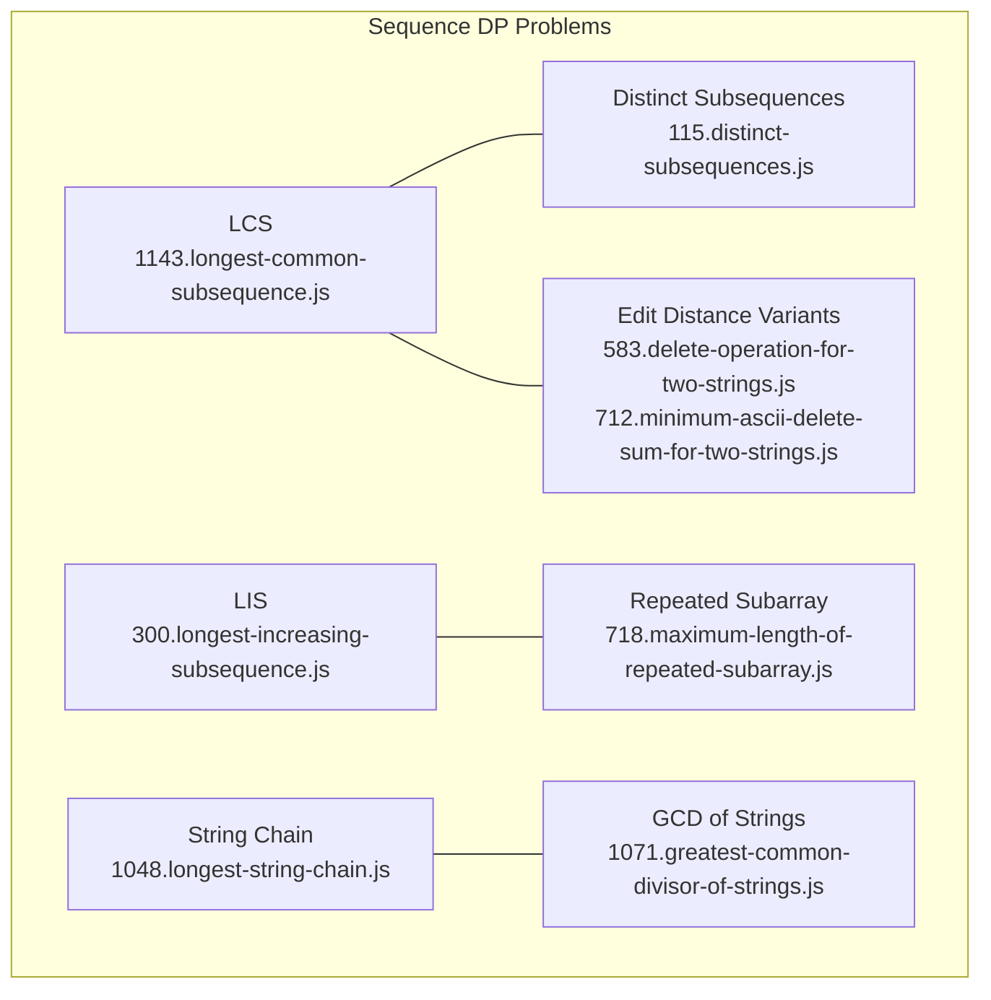
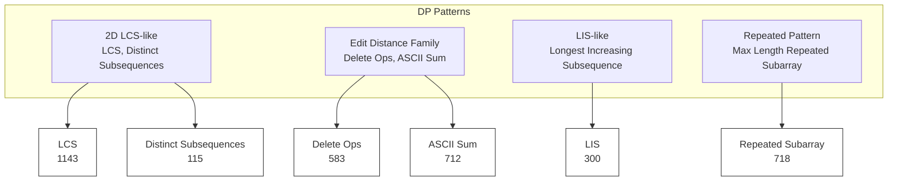
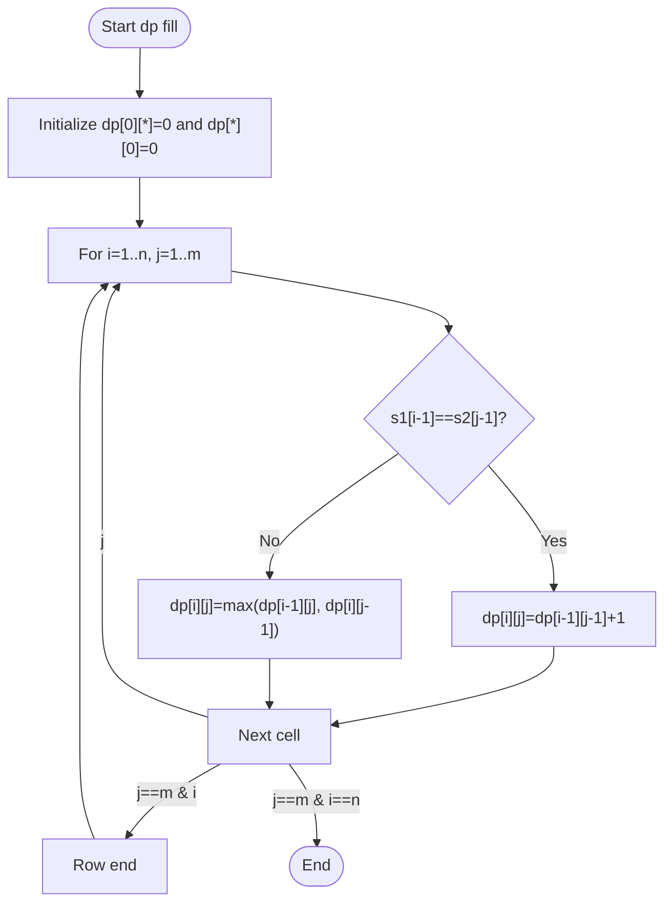
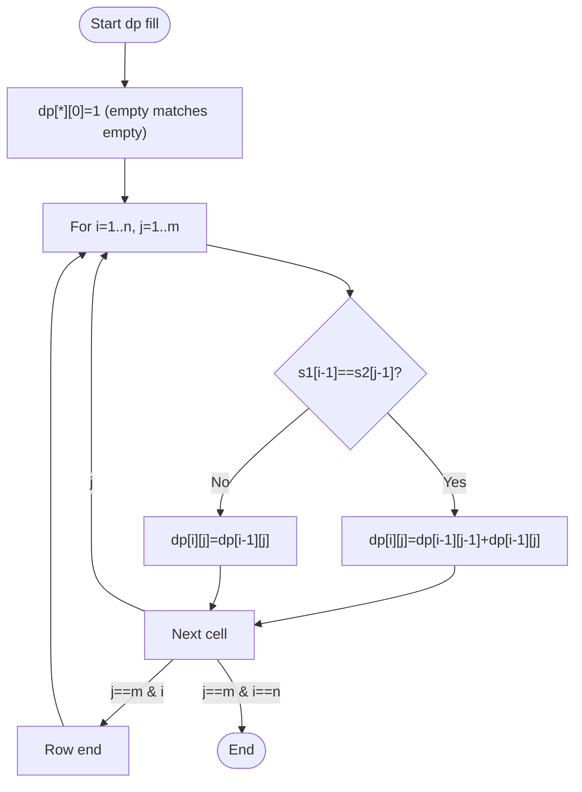
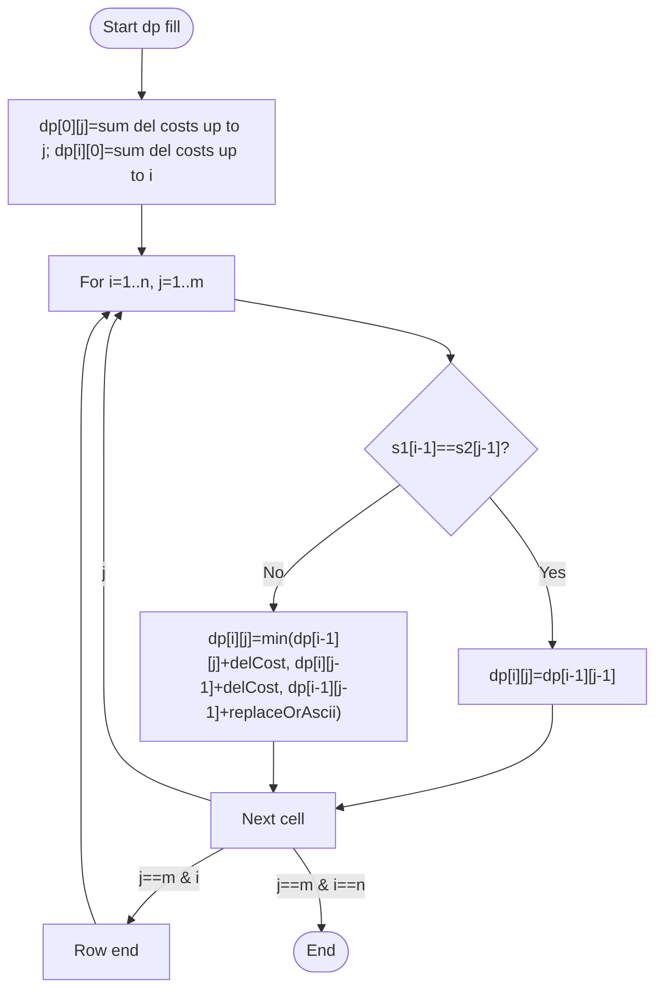
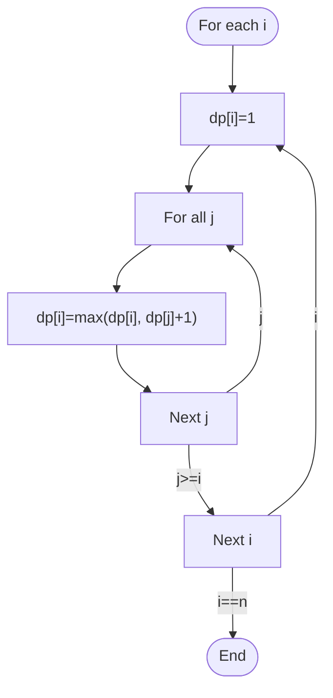
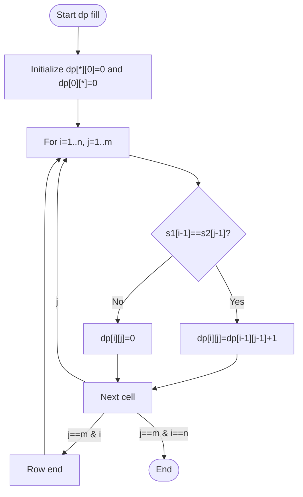
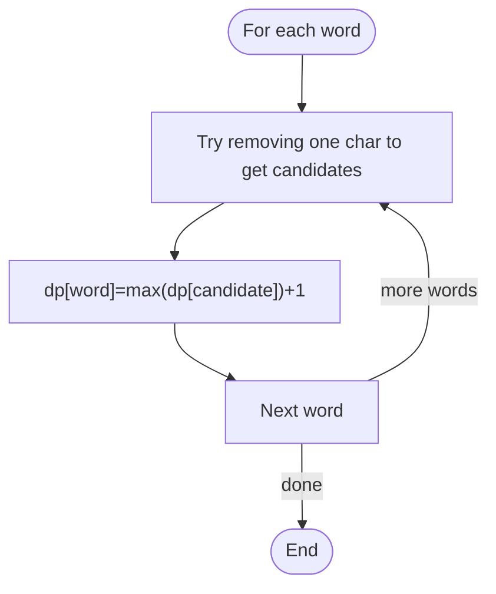
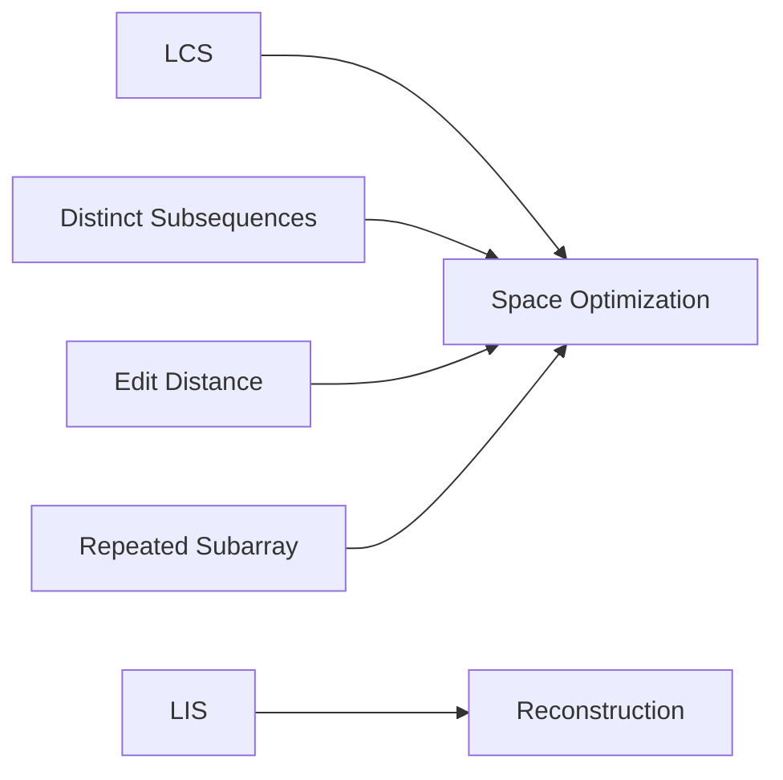

# Sequence Problems

<cite>
**Referenced Files in This Document**
- [longest-common-subsequence.js](file://算法/1143.longest-common-subsequence.js)
- [distinct-subsequences.js](file://算法/115.distinct-subsequences.js)
- [delete-operation-for-two-strings.js](file://算法/583.delete-operation-for-two-strings.js)
- [longest-increasing-subsequence.js](file://算法/300.longest-increasing-subsequence.js)
- [minimum-ascii-delete-sum-for-two-strings.js](file://算法/712.minimum-ascii-delete-sum-for-two-strings.js)
- [maximum-length-of-repeated-subarray.js](file://算法/718.maximum-length-of-repeated-subarray.js)
- [longest-string-chain.js](file://算法/1048.longest-string-chain.js)
- [greatest-common-divisor-of-strings.js](file://算法/1071.greatest-common-divisor-of-strings.js)
- [remove-all-adjacent-duplicates-in-string.js](file://算法/1047.remove-all-adjacent-duplicates-in-string.js)
- [remove-all-adjacent-duplicates-in-string-ii.js](file://算法/1209.remove-all-adjacent-duplicates-in-string-ii.js)
- [backspace-string-compare.js](file://算法/844.backspace-string-compare.js)
- [valid-parenthesis-string.js](file://算法/678.valid-parenthesis-string.js)
- [minimum-insertions-to-balance-a-parentheses-string.js](file://算法/1541.minimum-insertions-to-balance-a-parentheses-string.js)
- [longest-valid-parentheses.js](file://算法/32.longest-valid-parentheses.js)
- [encode-string-with-shortest-length.js](file://算法/470.encode-string-with-shortest-length.js)
- [longest-harmonious-subsequence.js](file://算法/594.longest-harmonious-subsequence.js)
- [find-and-replace-in-string.js](file://算法/833.find-and-replace-in-string.js)
- [remove-comments.js](file://算法/722.remove-comments.js)
- [reverse-substrings-between-each-pair-of-parentheses.js](file://算法/1190.reverse-substrings-between-each-pair-of-parentheses.js)
- [score-of-parentheses.js](file://算法/856.score-of-parentheses.js)
- [remove-invalid-parentheses.js](file://算法/301.remove-invalid-parentheses.js)
- [count-binary-substrings.js](file://算法/696.count-binary-substrings.js)
- [count-binary-substrings-ii.js](file://算法/696.count-binary-substrings.js)
- [count-binary-substrings-iii.js](file://算法/696.count-binary-substrings.js)
</cite>

## Table of Contents
1. [Introduction](#introduction)
2. [Project Structure](#project-structure)
3. [Core Components](#core-components)
4. [Architecture Overview](#architecture-overview)
5. [Detailed Component Analysis](#detailed-component-analysis)
6. [Dependency Analysis](#dependency-analysis)
7. [Performance Considerations](#performance-considerations)
8. [Troubleshooting Guide](#troubleshooting-guide)
9. [Conclusion](#conclusion)
10. [Appendices](#appendices)

## Introduction
This document focuses on sequence-based dynamic programming (DP) problems commonly encountered in competitive programming and technical interviews. It covers:
- Longest Common Subsequence (LCS) and related counting problems
- Edit distance and related string transformation costs
- Longest Increasing Subsequence (LIS) variants
- Space optimization techniques from O(nm) to O(min(n, m))
- Reconstruction of optimal solutions from DP tables
- Practical implementation patterns and walkthroughs

The goal is to provide a structured, code-level understanding of state definitions, transitions, and reconstruction strategies for sequence comparison and manipulation tasks.

## Project Structure
The repository organizes problems by filename under the algorithm directory. For sequence DP topics, we focus on files that implement LCS, edit distance, LIS, and related string manipulation tasks.



**Diagram sources**
- [longest-common-subsequence.js](file://算法/1143.longest-common-subsequence.js)
- [distinct-subsequences.js](file://算法/115.distinct-subsequences.js)
- [delete-operation-for-two-strings.js](file://算法/583.delete-operation-for-two-strings.js)
- [minimum-ascii-delete-sum-for-two-strings.js](file://算法/712.minimum-ascii-delete-sum-for-two-strings.js)
- [longest-increasing-subsequence.js](file://算法/300.longest-increasing-subsequence.js)
- [maximum-length-of-repeated-subarray.js](file://算法/718.maximum-length-of-repeated-subarray.js)
- [longest-string-chain.js](file://算法/1048.longest-string-chain.js)
- [greatest-common-divisor-of-strings.js](file://算法/1071.greatest-common-divisor-of-strings.js)

**Section sources**
- [longest-common-subsequence.js](file://算法/1143.longest-common-subsequence.js)
- [distinct-subsequences.js](file://算法/115.distinct-subsequences.js)
- [delete-operation-for-two-strings.js](file://算法/583.delete-operation-for-two-strings.js)
- [minimum-ascii-delete-sum-for-two-strings.js](file://算法/712.minimum-ascii-delete-sum-for-two-strings.js)
- [longest-increasing-subsequence.js](file://算法/300.longest-increasing-subsequence.js)
- [maximum-length-of-repeated-subarray.js](file://算法/718.maximum-length-of-repeated-subarray.js)
- [longest-string-chain.js](file://算法/1048.longest-string-chain.js)
- [greatest-common-divisor-of-strings.js](file://算法/1071.greatest-common-divisor-of-strings.js)

## Core Components
- 2D DP table construction for sequence comparison
  - Rows correspond to prefixes of the first sequence
  - Columns correspond to prefixes of the second sequence
  - Cells dp[i][j] represent optimal value for comparing s1[0..i-1] vs s2[0..j-1]
- State definitions and transitions
  - LCS: dp[i][j] = max(dp[i-1][j], dp[i][j-1], dp[i-1][j-1] + (s1[i-1]==s2[j-1]))
  - Edit distance: dp[i][j] = min(dp[i-1][j]+1, dp[i][j-1]+1, dp[i-1][j-1]+cost)
  - LIS: dp[i] = max(dp[j]+1) for all j<i where a[j]<a[i]
- Space optimization
  - Rolling arrays reduce O(nm) space to O(min(n, m))
  - Careful ordering of updates to avoid overwriting needed values
- Solution reconstruction
  - Backtrack from dp[n][m] using stored decisions or transition pointers
  - Rebuild the actual subsequence/string rather than just reporting length/value

**Section sources**
- [longest-common-subsequence.js](file://算法/1143.longest-common-subsequence.js)
- [distinct-subsequences.js](file://算法/115.distinct-subsequences.js)
- [delete-operation-for-two-strings.js](file://算法/583.delete-operation-for-two-strings.js)
- [minimum-ascii-delete-sum-for-two-strings.js](file://算法/712.minimum-ascii-delete-sum-for-two-strings.js)
- [longest-increasing-subsequence.js](file://算法/300.longest-increasing-subsequence.js)

## Architecture Overview
The following diagram illustrates the relationship between core sequence DP problems and their shared DP table construction patterns.



**Diagram sources**
- [longest-common-subsequence.js](file://算法/1143.longest-common-subsequence.js)
- [distinct-subsequences.js](file://算法/115.distinct-subsequences.js)
- [delete-operation-for-two-strings.js](file://算法/583.delete-operation-for-two-strings.js)
- [minimum-ascii-delete-sum-for-two-strings.js](file://算法/712.minimum-ascii-delete-sum-for-two-strings.js)
- [longest-increasing-subsequence.js](file://算法/300.longest-increasing-subsequence.js)
- [maximum-length-of-repeated-subarray.js](file://算法/718.maximum-length-of-repeated-subarray.js)

## Detailed Component Analysis

### Longest Common Subsequence (LCS)
- State definition
  - dp[i][j] = length of LCS for s1[0..i-1] and s2[0..j-1]
- Transition logic
  - If s1[i-1] == s2[j-1]: take diagonal plus one
  - Else: take max of left or top
- Space optimization
  - Use two rows (prev and curr) to reduce memory
- Reconstruction
  - Backtrack from dp[n][m]; when characters match, include in result and move diagonally



**Diagram sources**
- [longest-common-subsequence.js](file://算法/1143.longest-common-subsequence.js)

**Section sources**
- [longest-common-subsequence.js](file://算法/1143.longest-common-subsequence.js)

### Distinct Subsequences (Counting LCS occurrences)
- State definition
  - dp[i][j] = number of distinct subsequences of s1[0..i-1] equal to s2[0..j-1]
- Transition logic
  - If s1[i-1] == s2[j-1]: dp[i][j] = dp[i-1][j-1] + dp[i-1][j]
  - Else: dp[i][j] = dp[i-1][j]
- Space optimization
  - Rolling array technique similar to LCS
- Reconstruction
  - To rebuild a valid subsequence, track decisions during transitions



**Diagram sources**
- [distinct-subsequences.js](file://算法/115.distinct-subsequences.js)

**Section sources**
- [distinct-subsequences.js](file://算法/115.distinct-subsequences.js)

### Edit Distance and Related String Manipulation Costs
- Delete Operation for Two Strings
  - dp[i][j] = min deletions to make s1[0..i-1] and s2[0..j-1] identical
  - Transitions: insert/delete/replace cost considered; here deletion cost is 1 per operation
- Minimum ASCII Delete Sum for Two Strings
  - dp[i][j] = minimum ASCII sum of deleted characters
  - Transition adds ASCII cost when characters differ



**Diagram sources**
- [delete-operation-for-two-strings.js](file://算法/583.delete-operation-for-two-strings.js)
- [minimum-ascii-delete-sum-for-two-strings.js](file://算法/712.minimum-ascii-delete-sum-for-two-strings.js)

**Section sources**
- [delete-operation-for-two-strings.js](file://算法/583.delete-operation-for-two-strings.js)
- [minimum-ascii-delete-sum-for-two-strings.js](file://算法/712.minimum-ascii-delete-sum-for-two-strings.js)

### Longest Increasing Subsequence (LIS)
- State definition
  - dp[i] = length of LIS ending at index i
  - Alternative O(n log n) approach uses tails array
- Transition logic
  - For each i, check all j<i with a[j]<a[i] and update dp[i]
- Space optimization
  - O(n) space for dp; O(n log n) time via patience sorting approach
- Reconstruction
  - Track predecessors to rebuild the actual increasing subsequence



**Diagram sources**
- [longest-increasing-subsequence.js](file://算法/300.longest-increasing-subsequence.js)

**Section sources**
- [longest-increasing-subsequence.js](file://算法/300.longest-increasing-subsequence.js)

### Maximum Length of Repeated Subarray
- State definition
  - dp[i][j] = length of common subarray ending at i-1 in s1 and j-1 in s2
- Transition logic
  - If s1[i-1]==s2[j-1]: dp[i][j]=dp[i-1][j-1]+1 else 0
- Reconstruction
  - Track the maximum length and the ending position to extract the subarray



**Diagram sources**
- [maximum-length-of-repeated-subarray.js](file://算法/718.maximum-length-of-repeated-subarray.js)

**Section sources**
- [maximum-length-of-repeated-subarray.js](file://算法/718.maximum-length-of-repeated-subarray.js)

### Longest String Chain and GCD of Strings
- Longest String Chain
  - dp[word] = longest chain ending at word
  - For each word, try removing one character to form predecessor
- GCD of Strings
  - Similar to numeric GCD but applied to concatenation: str = gcd(a,b) means a=str*k, b=str*m and str is maximal with this property
  - Euclidean algorithm applies to lengths; actual string is prefix of length gcd(len(a), len(b))



**Diagram sources**
- [longest-string-chain.js](file://算法/1048.longest-string-chain.js)
- [greatest-common-divisor-of-strings.js](file://算法/1071.greatest-common-divisor-of-strings.js)

**Section sources**
- [longest-string-chain.js](file://算法/1048.longest-string-chain.js)
- [greatest-common-divisor-of-strings.js](file://算法/1071.greatest-common-divisor-of-strings.js)

### Additional String Manipulation Problems
- Remove All Adjacent Duplicates in String and II
  - Stack-based linear pass; pop when current equals stack top
- Backspace String Compare
  - Two-pass with stacks or reverse iterators
- Valid Parenthesis String and Related Balancing
  - Greedy or stack-based checks; track min/max open counts
- Longest Valid Parentheses
  - dp[i] = longest valid substring ending at i; transitions depend on s[i] and dp[i-1]
- Reverse Substrings Between Each Pair of Parentheses
  - Stack with pending reversals; process innermost first
- Score of Parentheses
  - Stack-based accumulation; double score when enclosed () occurs
- Remove Invalid Parentheses
  - BFS/DFS with pruning; minimal removals to balance

```mermaid
flowchart TD
Start(["Process chars"]) --> Decide{"Char type"}
Decide --> |Letter| Push["Push to stack"]
Decide --> |Backspace| Pop["Pop from stack"]
Decide --> |Paren '('| PushL["Push marker/level"]
Decide --> |Paren ')' | Combine["Combine inner result"]
Push --> Next["Next char"]
Pop --> Next
PushL --> Next
Combine --> Next
Next --> |more| Decide
Next --> |done| End(["Final result"])
```

**Diagram sources**
- [remove-all-adjacent-duplicates-in-string.js](file://算法/1047.remove-all-adjacent-duplicates-in-string.js)
- [remove-all-adjacent-duplicates-in-string-ii.js](file://算法/1209.remove-all-adjacent-duplicates-in-string-ii.js)
- [backspace-string-compare.js](file://算法/844.backspace-string-compare.js)
- [valid-parenthesis-string.js](file://算法/678.valid-parenthesis-string.js)
- [minimum-insertions-to-balance-a-parentheses-string.js](file://算法/1541.minimum-insertions-to-balance-a-parentheses-string.js)
- [longest-valid-parentheses.js](file://算法/32.longest-valid-parentheses.js)
- [reverse-substrings-between-each-pair-of-parentheses.js](file://算法/1190.reverse-substrings-between-each-pair-of-parentheses.js)
- [score-of-parentheses.js](file://算法/856.score-of-parentheses.js)
- [remove-invalid-parentheses.js](file://算法/301.remove-invalid-parentheses.js)

**Section sources**
- [remove-all-adjacent-duplicates-in-string.js](file://算法/1047.remove-all-adjacent-duplicates-in-string.js)
- [remove-all-adjacent-duplicates-in-string-ii.js](file://算法/1209.remove-all-adjacent-duplicates-in-string-ii.js)
- [backspace-string-compare.js](file://算法/844.backspace-string-compare.js)
- [valid-parenthesis-string.js](file://算法/678.valid-parenthesis-string.js)
- [minimum-insertions-to-balance-a-parentheses-string.js](file://算法/1541.minimum-insertions-to-balance-a-parentheses-string.js)
- [longest-valid-parentheses.js](file://算法/32.longest-valid-parentheses.js)
- [reverse-substrings-between-each-pair-of-parentheses.js](file://算法/1190.reverse-substrings-between-each-pair-of-parentheses.js)
- [score-of-parentheses.js](file://算法/856.score-of-parentheses.js)
- [remove-invalid-parentheses.js](file://算法/301.remove-invalid-parentheses.js)

## Dependency Analysis
- Shared DP patterns
  - LCS-like problems share identical 2D table semantics and transitions
  - Edit distance variants differ mainly in cost model and target objective
  - LIS variants generalize to weighted or constrained sequences
- Cross-cutting concerns
  - Space optimization applies broadly to 2D DP with row-wise updates
  - Reconstruction requires storing transition decisions or predecessors
- Complexity summary
  - LCS/Distinct Subsequences: O(nm) time, O(nm) or O(min(n,m)) space
  - Edit Distance: O(nm) time, O(nm) or O(min(n,m)) space
  - LIS: O(n^2) or O(n log n) time, O(n) space
  - Repeated Subarray: O(nm) time, O(nm) or O(min(n,m)) space



**Diagram sources**
- [longest-common-subsequence.js](file://算法/1143.longest-common-subsequence.js)
- [distinct-subsequences.js](file://算法/115.distinct-subsequences.js)
- [delete-operation-for-two-strings.js](file://算法/583.delete-operation-for-two-strings.js)
- [longest-increasing-subsequence.js](file://算法/300.longest-increasing-subsequence.js)
- [maximum-length-of-repeated-subarray.js](file://算法/718.maximum-length-of-repeated-subarray.js)

**Section sources**
- [longest-common-subsequence.js](file://算法/1143.longest-common-subsequence.js)
- [distinct-subsequences.js](file://算法/115.distinct-subsequences.js)
- [delete-operation-for-two-strings.js](file://算法/583.delete-operation-for-two-strings.js)
- [longest-increasing-subsequence.js](file://算法/300.longest-increasing-subsequence.js)
- [maximum-length-of-repeated-subarray.js](file://算法/718.maximum-length-of-repeated-subarray.js)

## Performance Considerations
- Time complexity
  - 2D DP over sequences typically runs in O(nm)
  - LIS can be optimized to O(n log n) using auxiliary data structures
- Space complexity
  - Standard 2D DP uses O(nm) memory
  - Space-optimized DP reduces to O(min(n, m)) by maintaining only two rows
  - For LIS O(n log n), use a tails array or balanced BST
- Practical tips
  - Prefer rolling arrays for 2D DP when only previous row is needed
  - For reconstruction, store decisions alongside DP values to avoid recomputation
  - Use early exits and pruning for expensive branches (e.g., parentheses problems)

[No sources needed since this section provides general guidance]

## Troubleshooting Guide
- Off-by-one errors in indexing
  - Ensure dp[0][*] and dp[*][0] are initialized consistently
  - Verify transitions align with 1-based character indices
- Incorrect transition assumptions
  - LCS requires diagonal contribution only on match
  - Edit distance must account for insertion/deletion/replace costs
- Space optimization pitfalls
  - When using rolling arrays, compute columns from left to right to avoid overwriting needed values
- Reconstruction mistakes
  - Store parent pointers or transition decisions during DP fill
  - Backtrack carefully to avoid infinite loops or missing characters

**Section sources**
- [longest-common-subsequence.js](file://算法/1143.longest-common-subsequence.js)
- [distinct-subsequences.js](file://算法/115.distinct-subsequences.js)
- [delete-operation-for-two-strings.js](file://算法/583.delete-operation-for-two-strings.js)
- [minimum-ascii-delete-sum-for-two-strings.js](file://算法/712.minimum-ascii-delete-sum-for-two-strings.js)
- [longest-increasing-subsequence.js](file://算法/300.longest-increasing-subsequence.js)
- [maximum-length-of-repeated-subarray.js](file://算法/718.maximum-length-of-repeated-subarray.js)

## Conclusion
Sequence-based dynamic programming centers on careful state definition, precise transition logic, and efficient space utilization. By mastering 2D DP table construction and reconstruction strategies, you can solve a broad class of string comparison and manipulation problems. The techniques outlined here—rolling arrays, O(n log n) LIS, and careful backtrack reconstruction—are essential tools for both interviews and practical applications.

[No sources needed since this section summarizes without analyzing specific files]

## Appendices
- Implementation references
  - LCS: [longest-common-subsequence.js](file://算法/1143.longest-common-subsequence.js)
  - Distinct Subsequences: [distinct-subsequences.js](file://算法/115.distinct-subsequences.js)
  - Delete Operations: [delete-operation-for-two-strings.js](file://算法/583.delete-operation-for-two-strings.js)
  - ASCII Delete Sum: [minimum-ascii-delete-sum-for-two-strings.js](file://算法/712.minimum-ascii-delete-sum-for-two-strings.js)
  - LIS: [longest-increasing-subsequence.js](file://算法/300.longest-increasing-subsequence.js)
  - Repeated Subarray: [maximum-length-of-repeated-subarray.js](file://算法/718.maximum-length-of-repeated-subarray.js)
  - String Chain: [longest-string-chain.js](file://算法/1048.longest-string-chain.js)
  - GCD of Strings: [greatest-common-divisor-of-strings.js](file://算法/1071.greatest-common-divisor-of-strings.js)
  - Parentheses family: [valid-parenthesis-string.js](file://算法/678.valid-parenthesis-string.js), [longest-valid-parentheses.js](file://算法/32.longest-valid-parentheses.js), [score-of-parentheses.js](file://算法/856.score-of-parentheses.js), [remove-invalid-parentheses.js](file://算法/301.remove-invalid-parentheses.js)

[No sources needed since this section lists references without analyzing specific files]