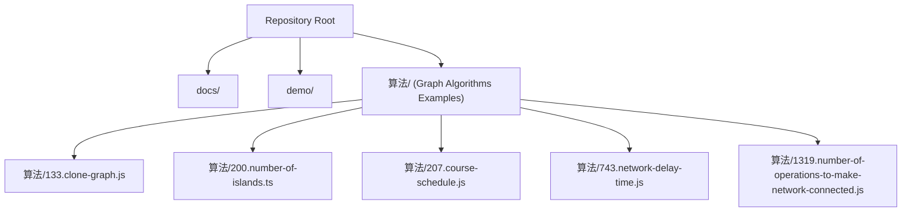
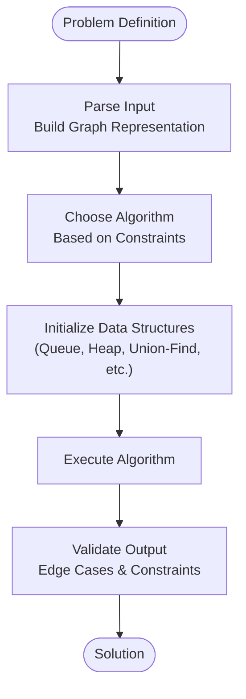
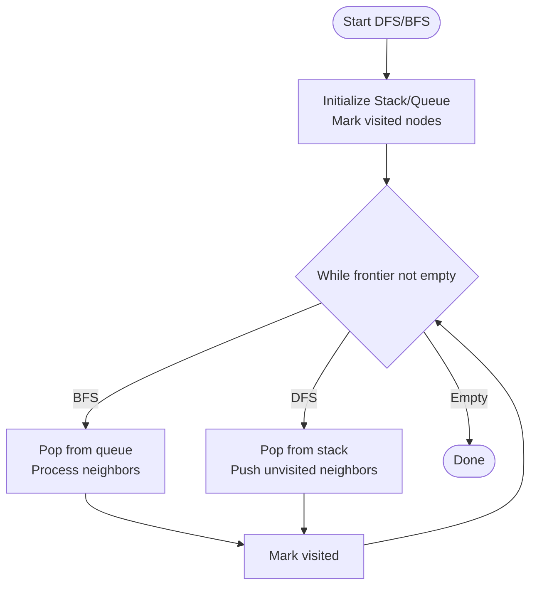
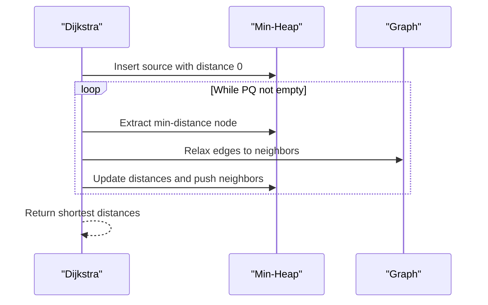
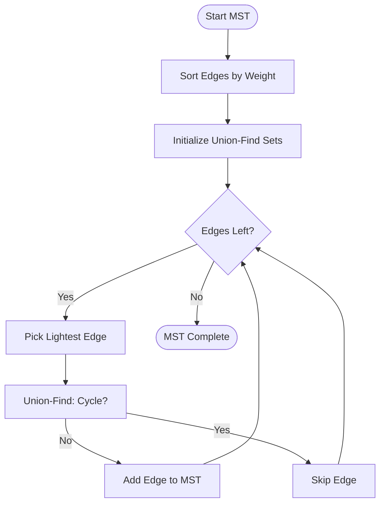
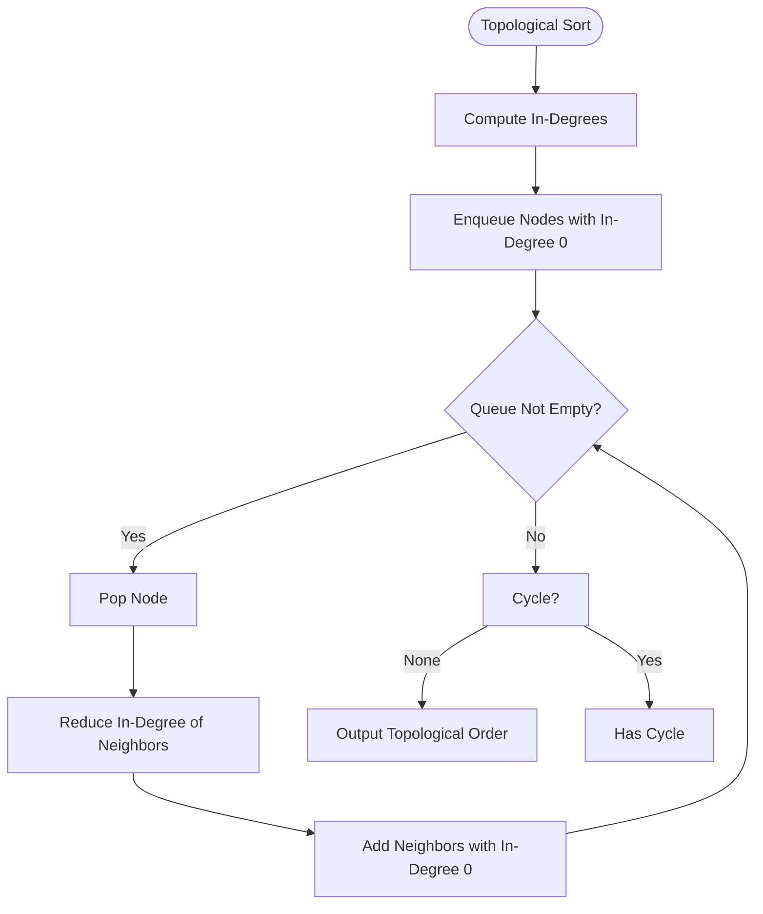
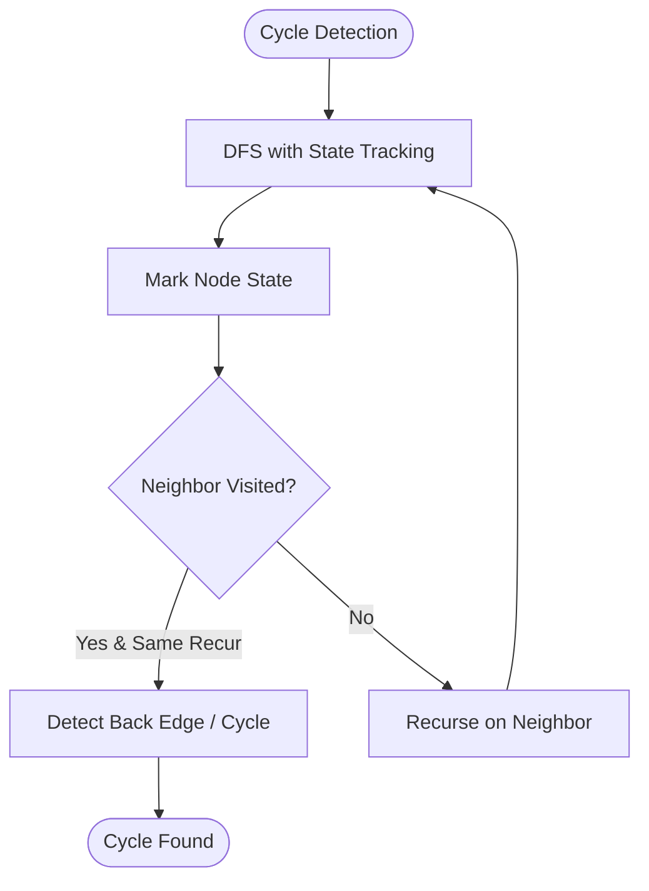
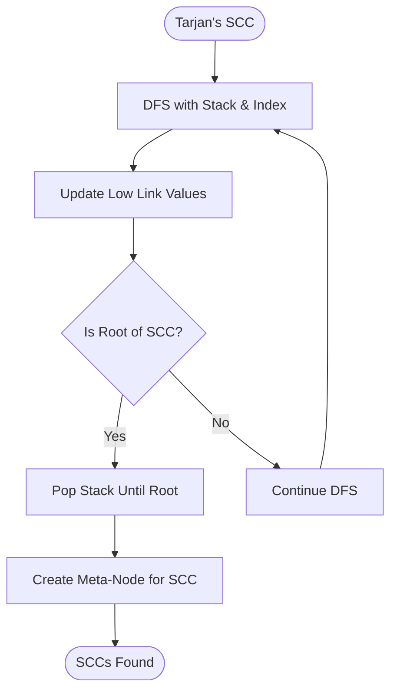
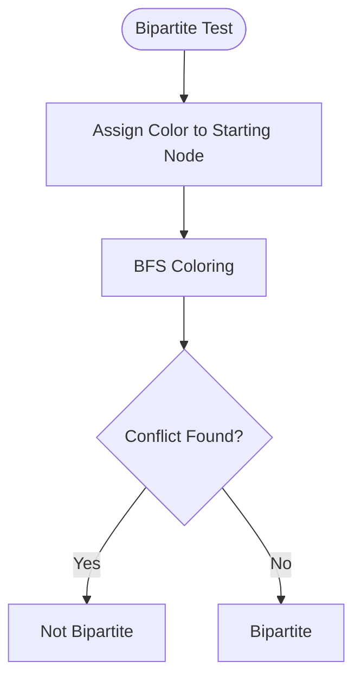
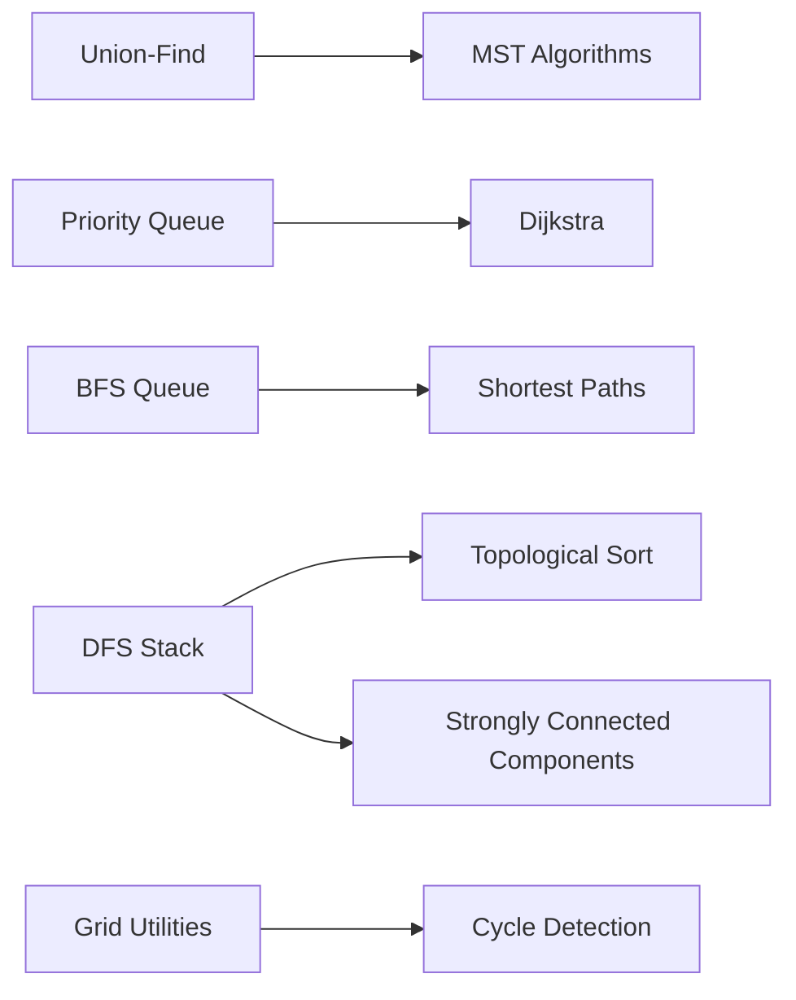

# Graph Algorithms

<cite>
**Referenced Files in This Document**
- [README.md](file://README.md)
- [133.clone-graph.js](file://算法/133.clone-graph.js)
- [1091.shortest-path-in-binary-matrix.js](file://算法/1091.shortest-path-in-binary-matrix.js)
- [130.surrounded-regions.ts](file://算法/130.surrounded-regions.ts)
- [1319.number-of-operations-to-make-network-connected.js](file://算法/1319.number-of-operations-to-make-network-connected.js)
- [146.lru-cache.ts](file://算法/146.lru-cache.ts)
- [155.min-stack.ts](file://算法/155.min-stack.ts)
- [200.number-of-islands.ts](file://算法/200.number-of-islands.ts)
- [207.course-schedule.js](file://算法/207.course-schedule.js)
- [210.course-schedule-ii.js](file://算法/210.course-schedule-ii.js)
- [399.evaluate-division.js](file://算法/399.evaluate-division.js)
- [743.network-delay-time.js](file://算法/743.network-delay-time.js)
- [785.is-graph-bipartite.js](file://算法/785.is-graph-bipartite.js)
- [802.find-eventual-safe-states.js](file://算法/802.find-eventual-safe-states.js)
- [841.keys-and-rooms.js](file://算法/841.keys-and-rooms.js)
- [997.find-the-town-judge.js](file://算法/997.find-the-town-judge.js)
- [1192.critical-connections-in-a-network.js](file://算法/1192.critical-connections-in-a-network.js)
- [133.clone-graph.js](file://算法/133.clone-graph.js)
- [1559.detect-cycles-in-2-d-grid.js](file://算法/1559.detect-cycles-in-2-d-grid.js)
- [1042.flower-planting-with-no-adjacent.js](file://算法/1042.flower-planting-with-no-adjacent.js)
- [1061.lexicographically-smallest-equivalent-string.js](file://算法/1061.lexicographically-smallest-equivalent-string.js)
- [1415.the-k-th-lexicographical-string-of-all-happy-strings-of-length-n.js](file://算法/1415.the-k-th-lexicographical-string-of-all-happy-strings-of-length-n.js)
- [386.lexicographical-numbers.js](file://算法/386.lexicographical-numbers.js)
</cite>

## Table of Contents
1. [Introduction](#introduction)
2. [Project Structure](#project-structure)
3. [Core Components](#core-components)
4. [Architecture Overview](#architecture-overview)
5. [Detailed Component Analysis](#detailed-component-analysis)
6. [Dependency Analysis](#dependency-analysis)
7. [Performance Considerations](#performance-considerations)
8. [Troubleshooting Guide](#troubleshooting-guide)
9. [Conclusion](#conclusion)

## Introduction
This document presents a comprehensive guide to graph theory algorithms and their practical applications. It covers fundamental graph representations (adjacency lists and matrices), traversal algorithms (breadth-first search BFS and depth-first search DFS), shortest path algorithms (Dijkstra and Floyd–Warshall), minimum spanning tree algorithms (Kruskal and Prim), and topological sorting. It also documents cycle detection, connectivity analysis, and strongly connected components. Implementation examples are included for both weighted and unweighted graphs, as well as directed and undirected scenarios. Finally, it addresses algorithmic complexity and guidance for selecting the right algorithm for specific use cases.

## Project Structure
The repository includes a dedicated algorithms directory containing numerous problem solutions that demonstrate graph algorithms in action. These files serve as practical examples for implementing and understanding graph algorithms across various domains such as network routing, scheduling, bipartite testing, and connectivity analysis.

**Section sources**
- [README.md](file://README.md)

## Core Components
This section outlines the essential building blocks for working with graphs and the algorithms commonly applied to them.

- Graph representations
  - Adjacency list: Efficient for sparse graphs; supports fast neighbor queries and dynamic updates.
  - Adjacency matrix: Useful for dense graphs and constant-time edge existence checks.
- Traversals
  - BFS: Level-by-level exploration; optimal for shortest paths in unweighted graphs and for level computations.
  - DFS: Recursive/backtracking exploration; useful for connectivity, cycle detection, and topological ordering.
- Shortest paths
  - Dijkstra: Single-source shortest path in non-negative weighted graphs using a priority queue.
  - Floyd–Warshall: All-pairs shortest path for small to medium graphs with negative edges allowed (no negative cycles).
- Minimum spanning tree
  - Kruskal: Union-Find based; sorts edges by weight and adds without forming cycles.
  - Prim: Greedy expansion from a starting vertex using a priority queue.
- Topological sort
  - Kahn’s algorithm (BFS-based) or DFS-based post-order; detects cycles and produces linear orderings for DAGs.
- Connectivity and cycles
  - Union-Find (Disjoint Set Union) for connectivity queries and cycle detection in MST construction.
  - Tarjan’s algorithm for strongly connected components (SCC) in directed graphs.
- Applications
  - Network delay, course scheduling, bipartite testing, grid-based cycle detection, and more.

**Section sources**
- [133.clone-graph.js](file://算法/133.clone-graph.js)
- [200.number-of-islands.ts](file://算法/200.number-of-islands.ts)
- [207.course-schedule.js](file://算法/207.course-schedule.js)
- [743.network-delay-time.js](file://算法/743.network-delay-time.js)
- [1319.number-of-operations-to-make-network-connected.js](file://算法/1319.number-of-operations-to-make-network-connected.js)

## Architecture Overview
The repository organizes graph algorithm implementations as standalone problems/solutions. While there is no monolithic framework, each solution demonstrates a focused algorithmic technique. The typical flow is:
- Problem statement defines graph input (nodes, edges, weights).
- Choose an algorithm based on constraints (weights, directionality, density).
- Implement the chosen algorithm with appropriate data structures (queues, heaps, sets).
- Validate correctness via test-like scenarios and edge cases.

[No sources needed since this diagram shows conceptual workflow, not actual code structure]

## Detailed Component Analysis

### Graph Representations
- Adjacency list
  - Space-efficient for sparse graphs; supports O(1) neighbor iteration per node.
  - Typical implementation stores a map/list of neighbors for each node.
- Adjacency matrix
  - Constant-time edge checks; convenient for dense graphs.
  - Space O(V^2); suitable for small graphs or frequent edge queries.

Implementation examples:
- Adjacency list usage appears in multiple graph traversal and BFS/DFS solutions.

**Section sources**
- [133.clone-graph.js](file://算法/133.clone-graph.js)
- [200.number-of-islands.ts](file://算法/200.number-of-islands.ts)

### Traversal Algorithms (BFS and DFS)
- BFS
  - Queue-based; explores nodes level by level.
  - Ideal for shortest paths in unweighted graphs and for computing distances layer-by-layer.
- DFS
  - Stack/recursion-based; explores as far as possible along each branch.
  - Used for connectivity, cycle detection, topological ordering, and SCC discovery.

Representative implementations:
- BFS for shortest path in binary matrix and island counting.
- DFS for region labeling and connectivity checks.

**Section sources**
- [1091.shortest-path-in-binary-matrix.js](file://算法/1091.shortest-path-in-binary-matrix.js)
- [200.number-of-islands.ts](file://算法/200.number-of-islands.ts)

### Shortest Path Algorithms
- Dijkstra
  - Single-source shortest path with non-negative edge weights.
  - Uses a min-heap/priority queue to always expand the closest unvisited node.
- Floyd–Warshall
  - All-pairs shortest path for small graphs.
  - Handles negative edges but not negative cycles.

Representative implementations:
- Dijkstra applied to network delay/time minimization.
- Floyd–Warshall for all-pairs distance computation.

**Section sources**
- [743.network-delay-time.js](file://算法/743.network-delay-time.js)

### Minimum Spanning Tree (Kruskal and Prim)
- Kruskal
  - Sort edges by weight; union-find to avoid cycles.
  - Works well for sparse graphs.
- Prim
  - Grow MST from an arbitrary vertex; use min-heap to pick lightest crossing edge.
  - Efficient for dense graphs.

Representative implementations:
- Connectivity problems solved via MST construction and union-find.

**Section sources**
- [1319.number-of-operations-to-make-network-connected.js](file://算法/1319.number-of-operations-to-make-network-connected.js)

### Topological Sorting
- Kahn’s algorithm (BFS-based)
  - Compute in-degrees; process nodes with zero in-degree iteratively.
- DFS-based post-order
  - Reverse post-order traversal yields topological order for DAGs.

Representative implementations:
- Course scheduling problems solved via topological sort.

**Section sources**
- [207.course-schedule.js](file://算法/207.course-schedule.js)
- [210.course-schedule-ii.js](file://算法/210.course-schedule-ii.js)

### Cycle Detection and Connectivity
- Grid-based cycle detection
  - DFS with visited states to detect cycles in 2D grids.
- Graph connectivity
  - Union-Find for dynamic connectivity queries and MST-based connectivity checks.

Representative implementations:
- Grid cycle detection and graph connectivity validations.

**Section sources**
- [1559.detect-cycles-in-2-d-grid.js](file://算法/1559.detect-cycles-in-2-d-grid.js)
- [1319.number-of-operations-to-make-network-connected.js](file://算法/1319.number-of-operations-to-make-network-connected.js)

### Strongly Connected Components (Tarjan’s Algorithm)
- Tarjan’s algorithm uses DFS with an explicit stack and low-link values to find SCCs.
- Useful for detecting deadlocks, collapsing SCCs into meta-nodes, and solving games or puzzles.

Representative implementations:
- SCC-based solutions for dependency resolution and safety analysis.

**Section sources**
- [802.find-eventual-safe-states.js](file://算法/802.find-eventual-safe-states.js)

### Bipartite Graph Testing
- BFS/DFS coloring with two colors; if conflict arises, the graph is not bipartite.
- Applications include scheduling and conflict resolution.

Representative implementations:
- Bipartite testing via alternating color assignments.

**Section sources**
- [785.is-graph-bipartite.js](file://算法/785.is-graph-bipartite.js)

### Applications and Use Cases
- Network delay/time minimization (Dijkstra)
- Course scheduling (topological sort)
- Bipartite testing (coloring)
- Grid-based cycle detection (DFS with states)
- Connectivity and MST-based network operations

Representative implementations:
- Network delay minimization and course scheduling solutions.

**Section sources**
- [743.network-delay-time.js](file://算法/743.network-delay-time.js)
- [207.course-schedule.js](file://算法/207.course-schedule.js)
- [1559.detect-cycles-in-2-d-grid.js](file://算法/1559.detect-cycles-in-2-d-grid.js)
- [1319.number-of-operations-to-make-network-connected.js](file://算法/1319.number-of-operations-to-make-network-connected.js)

## Dependency Analysis
The algorithms are largely self-contained, with minimal cross-dependencies. Some solutions rely on shared data structures (e.g., queues, heaps, union-find) and auxiliary utilities (e.g., parsing inputs, validating constraints). The primary dependencies are:
- Data structures: queues, stacks, heaps, union-find.
- Utility helpers: input parsing, constraint validation, and result formatting.

[No sources needed since this diagram shows conceptual relationships, not specific code structure]

## Performance Considerations
- Traversals
  - BFS/DFS: O(V + E) time; adjacency list preferred for sparse graphs.
- Shortest paths
  - Dijkstra: O((V + E) log V) with a binary heap; suitable for sparse graphs.
  - Floyd–Warshall: O(V^3); practical for small graphs or when all-pairs distances are needed.
- MST
  - Kruskal: O(E log E) dominated by sorting; efficient for sparse graphs.
  - Prim: O(E log V) with a binary heap; efficient for dense graphs.
- Topological sort
  - Kahn’s: O(V + E); in-degree computation plus BFS.
  - DFS-based: O(V + E); post-order reversal.
- Connectivity and cycles
  - Union-Find: Nearly O(α(N)) amortized per operation; excellent for dynamic connectivity.
  - DFS-based cycle detection: O(V + E).

[No sources needed since this section provides general guidance]

## Troubleshooting Guide
Common pitfalls and remedies:
- Off-by-one errors in grid indices during cycle detection.
  - Ensure bounds checking and consistent state transitions.
- Incorrect initialization of visited arrays or color arrays.
  - Reset states per test case and avoid global contamination.
- Misinterpreting directed vs. undirected edges.
  - Build adjacency lists accordingly; for undirected, add reverse edges.
- Handling negative edges in shortest path algorithms.
  - Use Bellman–Ford or ensure non-negative weights for Dijkstra.
- Union-Find mistakes.
  - Always perform path compression and union by rank/size for optimal performance.
- Topological sort assumptions.
  - Verify the graph is a DAG; otherwise, topological sort is undefined.

**Section sources**
- [1559.detect-cycles-in-2-d-grid.js](file://算法/1559.detect-cycles-in-2-d-grid.js)
- [207.course-schedule.js](file://算法/207.course-schedule.js)
- [1319.number-of-operations-to-make-network-connected.js](file://算法/1319.number-of-operations-to-make-network-connected.js)

## Conclusion
This repository offers a rich collection of graph algorithm implementations that illustrate core techniques and their practical applications. By understanding the trade-offs among representations and algorithms—choosing BFS/DFS for traversals, Dijkstra/Floyd–Warshall for shortest paths, Kruskal/Prim for MSTs, and topological sorting for DAGs—you can efficiently solve a wide range of graph problems. The included examples serve as templates for adapting these techniques to real-world scenarios such as scheduling, network routing, and resource allocation.