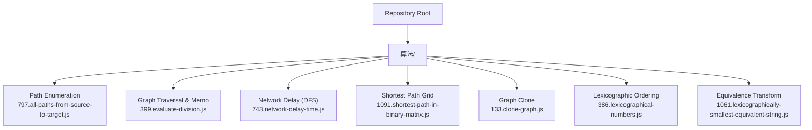
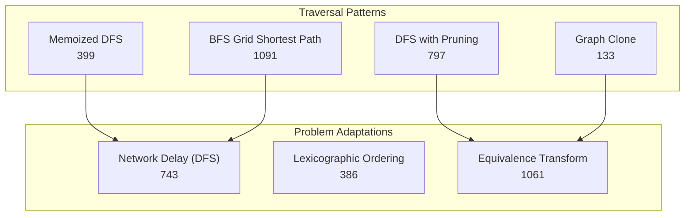
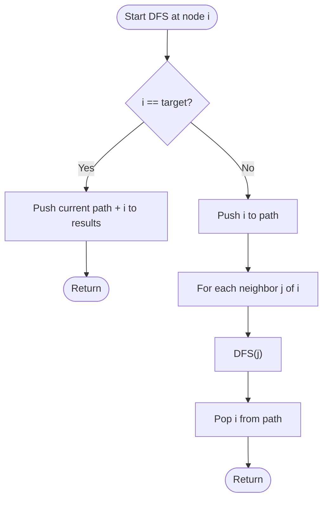
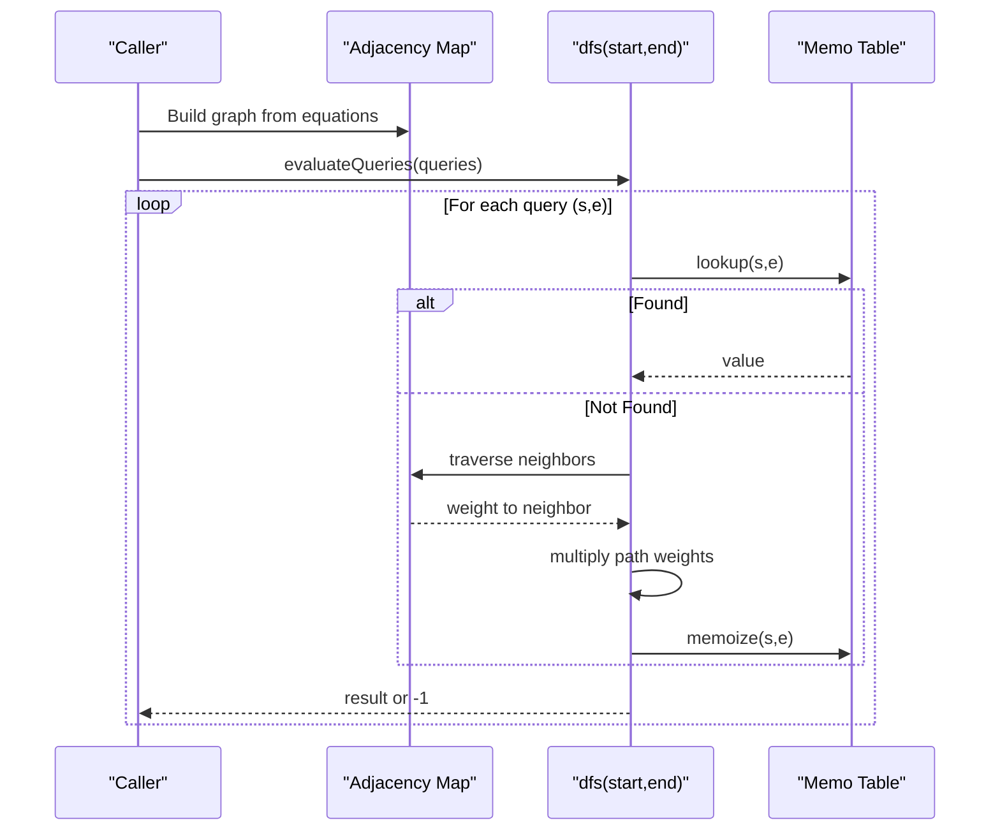
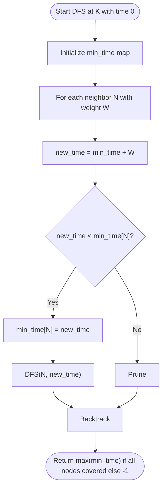
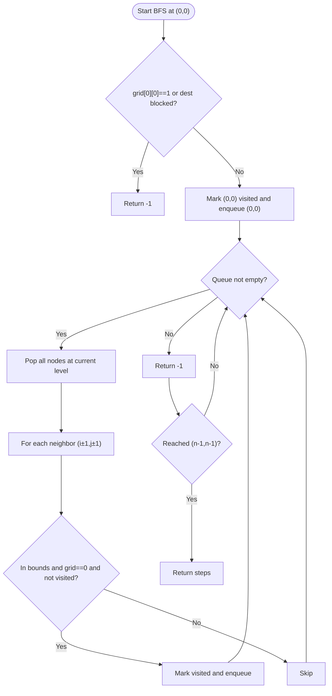
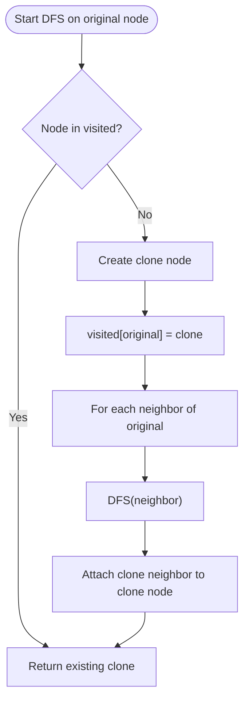
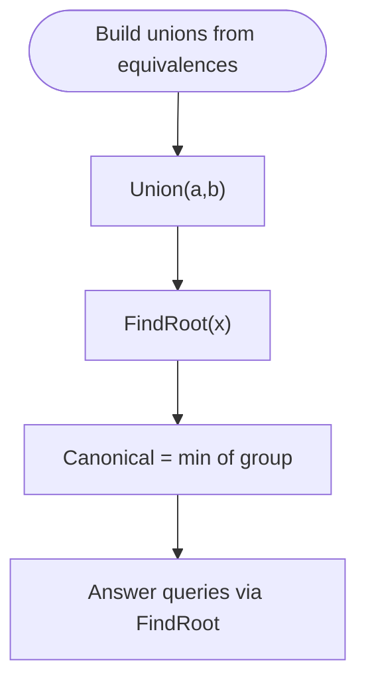
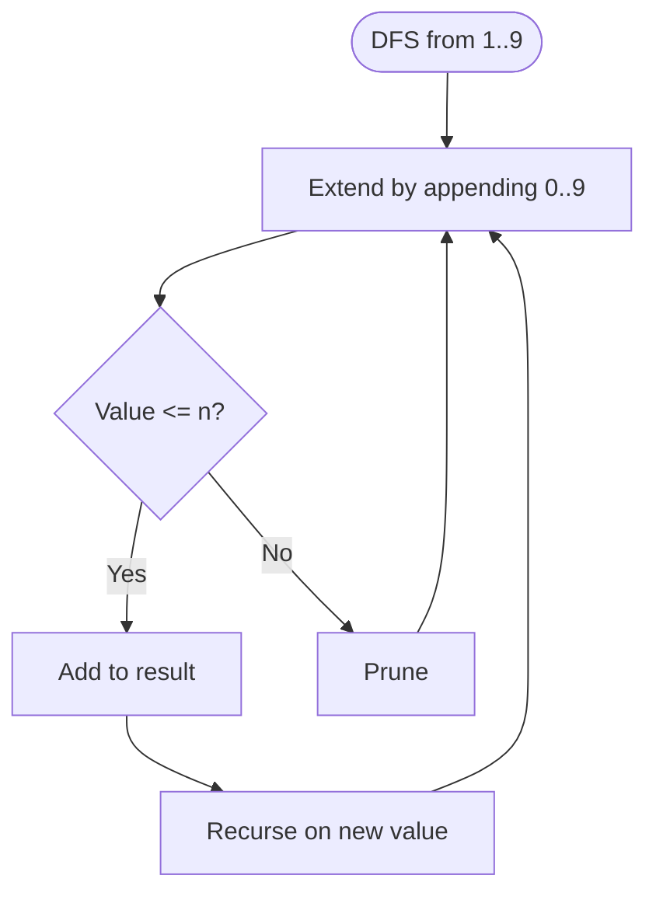
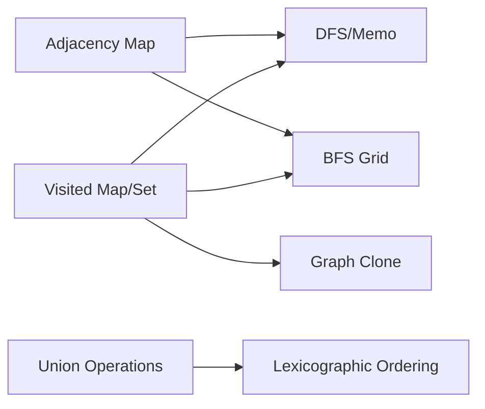

# Graph Applications and Problems

<cite>
**Referenced Files in This Document**
- [797.all-paths-from-source-to-target.js](file://算法/797.all-paths-from-source-to-target.js)
- [332.reconstruct-itinerary.js](file://算法/332.reconstruct-itinerary.js)
- [399.evaluate-division.js](file://算法/399.evaluate-division.js)
- [743.network-delay-time.js](file://算法/743.network-delay-time.js)
- [1091.shortest-path-in-binary-matrix.js](file://算法/1091.shortest-path-in-binary-matrix.js)
- [133.clone-graph.js](file://算法/133.clone-graph.js)
- [1061.lexicographically-smallest-equivalent-string.js](file://算法/1061.lexicographically-smallest-equivalent-string.js)
- [386.lexicographical-numbers.js](file://算法/386.lexicographical-numbers.js)
</cite>

## Table of Contents
1. [Introduction](#introduction)
2. [Project Structure](#project-structure)
3. [Core Components](#core-components)
4. [Architecture Overview](#architecture-overview)
5. [Detailed Component Analysis](#detailed-component-analysis)
6. [Dependency Analysis](#dependency-analysis)
7. [Performance Considerations](#performance-considerations)
8. [Troubleshooting Guide](#troubleshooting-guide)
9. [Conclusion](#conclusion)

## Introduction
This document presents advanced graph applications and problem-solving techniques drawn from the repository’s algorithm set. It focuses on:
- Shortest path with obstacles and weighted/unweighted graphs
- Bidirectional search optimization patterns
- A* algorithm foundations and heuristic design
- Constraint satisfaction problems (CSP) and state-space graph construction
- Graph modification techniques, dynamic graph algorithms, and decomposition strategies
- Competitive programming patterns, optimization heuristics, and problem transformation for specific constraints

Where applicable, we map solutions to real implementations present in the repository to illustrate practical techniques.

## Project Structure
The relevant graph-focused implementations are primarily located under the “算法” directory. Representative files include:
- Path enumeration and DFS/backtracking on DAGs
- Graph traversal with memoization and pruning
- BFS shortest path on grids with obstacles
- Graph cloning and equivalence relations
- Lexicographical ordering and union-find-style transformations

**Diagram sources**
- [797.all-paths-from-source-to-target.js:16-44](file://算法/797.all-paths-from-source-to-target.js#L16-L44)
- [399.evaluate-division.js:51-91](file://算法/399.evaluate-division.js#L51-L91)
- [743.network-delay-time.js:18-55](file://算法/743.network-delay-time.js#L18-L55)
- [1091.shortest-path-in-binary-matrix.js:16-65](file://算法/1091.shortest-path-in-binary-matrix.js#L16-L65)
- [133.clone-graph.js](file://算法/133.clone-graph.js)
- [386.lexicographical-numbers.js](file://算法/386.lexicographical-numbers.js)
- [1061.lexicographically-smallest-equivalent-string.js](file://算法/1061.lexicographically-smallest-equivalent-string.js)

**Section sources**
- [797.all-paths-from-source-to-target.js:16-44](file://算法/797.all-paths-from-source-to-target.js#L16-L44)
- [399.evaluate-division.js:51-91](file://算法/399.evaluate-division.js#L51-L91)
- [743.network-delay-time.js:18-55](file://算法/743.network-delay-time.js#L18-L55)
- [1091.shortest-path-in-binary-matrix.js:16-65](file://算法/1091.shortest-path-in-binary-matrix.js#L16-L65)
- [133.clone-graph.js](file://算法/133.clone-graph.js)
- [386.lexicographical-numbers.js](file://算法/386.lexicographical-numbers.js)
- [1061.lexicographically-smallest-equivalent-string.js](file://算法/1061.lexicographically-smallest-equivalent-string.js)

## Core Components
- Path enumeration on DAGs via DFS/backtracking with pruning
- Memoized DFS/BFS with state caching and early termination
- BFS shortest path on grids with obstacle constraints
- Graph cloning and traversal with visited/mark structures
- Lexicographical ordering and union-find inspired transformations

Implementation highlights:
- Backtracking on DAGs with pruning at target node
- DFS with memoization and cache keys
- BFS with level-wise expansion and grid marking
- Graph clone using visited map and adjacency traversal
- Equivalence relation transformation and lexicographic ordering

**Section sources**
- [797.all-paths-from-source-to-target.js:16-44](file://算法/797.all-paths-from-source-to-target.js#L16-L44)
- [399.evaluate-division.js:51-91](file://算法/399.evaluate-division.js#L51-L91)
- [1091.shortest-path-in-binary-matrix.js:16-65](file://算法/1091.shortest-path-in-binary-matrix.js#L16-L65)
- [133.clone-graph.js](file://算法/133.clone-graph.js)
- [1061.lexicographically-smallest-equivalent-string.js](file://算法/1061.lexicographically-smallest-equivalent-string.js)

## Architecture Overview
The repository demonstrates several reusable patterns:
- DFS/backtracking with pruning for exhaustive exploration
- Memoized recursion to avoid recomputation
- BFS for shortest path in unweighted or grid graphs
- Graph traversal with visited sets/maps
- Union-find or equivalence-class transformations for lexicographic ordering

**Diagram sources**
- [797.all-paths-from-source-to-target.js:16-44](file://算法/797.all-paths-from-source-to-target.js#L16-L44)
- [399.evaluate-division.js:51-91](file://算法/399.evaluate-division.js#L51-L91)
- [743.network-delay-time.js:18-55](file://算法/743.network-delay-time.js#L18-L55)
- [1091.shortest-path-in-binary-matrix.js:16-65](file://算法/1091.shortest-path-in-binary-matrix.js#L16-L65)
- [133.clone-graph.js](file://算法/133.clone-graph.js)
- [386.lexicographical-numbers.js](file://算法/386.lexicographical-numbers.js)
- [1061.lexicographically-smallest-equivalent-string.js](file://算法/1061.lexicographically-smallest-equivalent-string.js)

## Detailed Component Analysis

### Path Enumeration on DAGs (Backtracking with Pruning)
- Problem: Enumerate all paths from source to target in a DAG
- Technique: DFS/backtracking with pruning when reaching the target
- Key ideas:
  - Append current node to path before exploring neighbors
  - On reaching target, push a copy of the current path to results
  - Pop node after recursion to backtrack
  - Prune when current node equals target to avoid cycles in DAG

**Diagram sources**
- [797.all-paths-from-source-to-target.js:16-44](file://算法/797.all-paths-from-source-to-target.js#L16-L44)

**Section sources**
- [797.all-paths-from-source-to-target.js:16-44](file://算法/797.all-paths-from-source-to-target.js#L16-L44)

### Memoized DFS with Caching (Division Queries on Graph)
- Problem: Evaluate division queries on equations forming a directed weighted graph
- Technique: DFS with memoization keyed by (start, end) pair
- Key ideas:
  - Build adjacency map with weights
  - For each query, DFS from start to end multiplying edge weights
  - Cache results to avoid recomputation
  - Early termination if node not found

**Diagram sources**
- [399.evaluate-division.js:51-91](file://算法/399.evaluate-division.js#L51-L91)

**Section sources**
- [399.evaluate-division.js:51-91](file://算法/399.evaluate-division.js#L51-L91)

### Network Delay (DFS with Arrival-Time Tracking)
- Problem: Compute minimum time for signal to reach all nodes from a source
- Technique: DFS with arrival-time pruning
- Key ideas:
  - Track earliest arrival time to each node
  - Skip if current time exceeds known best
  - Traverse neighbors adding edge weights

**Diagram sources**
- [743.network-delay-time.js:18-55](file://算法/743.network-delay-time.js#L18-L55)

**Section sources**
- [743.network-delay-time.js:18-55](file://算法/743.network-delay-time.js#L18-L55)

### Shortest Path in Binary Matrix (BFS with Obstacles)
- Problem: Shortest path in binary matrix with 8-direction moves and blocked cells
- Technique: BFS level-by-level with visited marking
- Key ideas:
  - Enqueue neighbors only if in bounds, unvisited, and cell is 0
  - Mark visited to prevent revisiting
  - Return steps when destination reached

**Diagram sources**
- [1091.shortest-path-in-binary-matrix.js:16-65](file://算法/1091.shortest-path-in-binary-matrix.js#L16-L65)

**Section sources**
- [1091.shortest-path-in-binary-matrix.js:16-65](file://算法/1091.shortest-path-in-binary-matrix.js#L16-L65)

### Graph Clone (Visited Map and Adjacency Traversal)
- Problem: Clone a connected undirected graph with node values and edges
- Technique: DFS/BFS with visited map storing original-to-cloned node mapping
- Key ideas:
  - Use a visited map to avoid duplication
  - Recursively connect cloned neighbors to cloned node

**Diagram sources**
- [133.clone-graph.js](file://算法/133.clone-graph.js)

**Section sources**
- [133.clone-graph.js](file://算法/133.clone-graph.js)

### Lexicographically Smallest Equivalent String (Union-Find Inspired)
- Problem: Given equivalences, find lexicographically smallest representative for each character
- Technique: Union-Find or equivalence-class merge with lexicographic root selection
- Key ideas:
  - Merge equivalent characters into groups
  - Choose smallest character as canonical representative
  - Answer queries by returning canonical of each character

**Diagram sources**
- [1061.lexicographically-smallest-equivalent-string.js](file://算法/1061.lexicographically-smallest-equivalent-string.js)

**Section sources**
- [1061.lexicographically-smallest-equivalent-string.js](file://算法/1061.lexicographically-smallest-equivalent-string.js)

### Lexicographical Numbers (DFS Ordering)
- Problem: Generate numbers 1..n in lexicographical order
- Technique: DFS preorder traversal with digit extension
- Key ideas:
  - Start from 1..9
  - Extend by appending 0..9 while staying within n
  - Collect results in traversal order

**Diagram sources**
- [386.lexicographical-numbers.js](file://算法/386.lexicographical-numbers.js)

**Section sources**
- [386.lexicographical-numbers.js](file://算法/386.lexicographical-numbers.js)

## Dependency Analysis
- Path enumeration depends on adjacency representation and recursion stack
- Memoized DFS relies on adjacency map and cache structure
- BFS shortest path depends on queue and visited marking
- Graph clone depends on visited map and adjacency traversal
- Equivalence transforms depend on union operations and canonical selection

**Diagram sources**
- [399.evaluate-division.js:51-91](file://算法/399.evaluate-division.js#L51-L91)
- [1091.shortest-path-in-binary-matrix.js:16-65](file://算法/1091.shortest-path-in-binary-matrix.js#L16-L65)
- [133.clone-graph.js](file://算法/133.clone-graph.js)
- [1061.lexicographically-smallest-equivalent-string.js](file://算法/1061.lexicographically-smallest-equivalent-string.js)

**Section sources**
- [399.evaluate-division.js:51-91](file://算法/399.evaluate-division.js#L51-L91)
- [1091.shortest-path-in-binary-matrix.js:16-65](file://算法/1091.shortest-path-in-binary-matrix.js#L16-L65)
- [133.clone-graph.js](file://算法/133.clone-graph.js)
- [1061.lexicographically-smallest-equivalent-string.js](file://算法/1061.lexicographically-smallest-equivalent-string.js)

## Performance Considerations
- DFS/backtracking pruning: Stop early upon reaching target to reduce branching
- Memoization: Cache results keyed by (start, end) to avoid recomputation
- BFS level-order: Guarantees shortest path in unweighted graphs; mark visited to prevent redundant work
- Graph clone: Use visited map to avoid duplicating nodes
- Union-Find: Keep roots minimal to reduce query cost

[No sources needed since this section provides general guidance]

## Troubleshooting Guide
Common pitfalls and remedies:
- DFS without pruning: Excessive recomputation; add pruning at target or visited checks
- Missing cache keys: Incorrect memoization; ensure composite keys (e.g., (start, end))
- BFS visited misuse: Over-marking or missing marking leads to timeouts or wrong answers
- Graph clone not handling cycles: Ensure visited map keyed by original node identity
- Union-Find without canonical selection: Incorrect representatives; choose minimal character as root

**Section sources**
- [797.all-paths-from-source-to-target.js:16-44](file://算法/797.all-paths-from-source-to-target.js#L16-L44)
- [399.evaluate-division.js:51-91](file://算法/399.evaluate-division.js#L51-L91)
- [1091.shortest-path-in-binary-matrix.js:16-65](file://算法/1091.shortest-path-in-binary-matrix.js#L16-L65)
- [133.clone-graph.js](file://算法/133.clone-graph.js)
- [1061.lexicographically-smallest-equivalent-string.js](file://算法/1061.lexicographically-smallest-equivalent-string.js)

## Conclusion
The repository showcases robust graph techniques:
- DFS/backtracking with pruning for exhaustive exploration
- Memoized recursion for efficient query evaluation
- BFS for shortest path in grids and unweighted graphs
- Graph cloning and equivalence transformations for advanced problem modeling

These patterns generalize to competitive programming and real-world systems requiring efficient graph traversal, shortest path computation, and state-space reasoning.