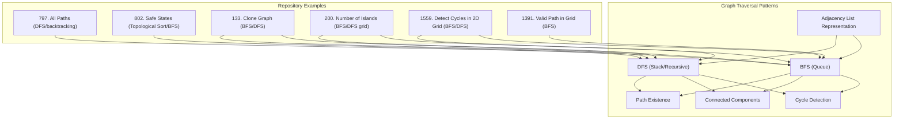
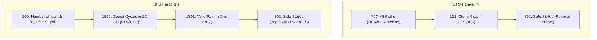
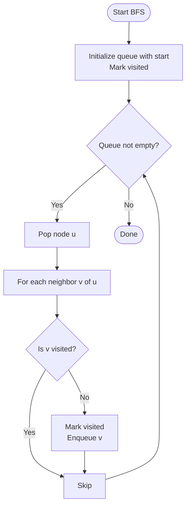
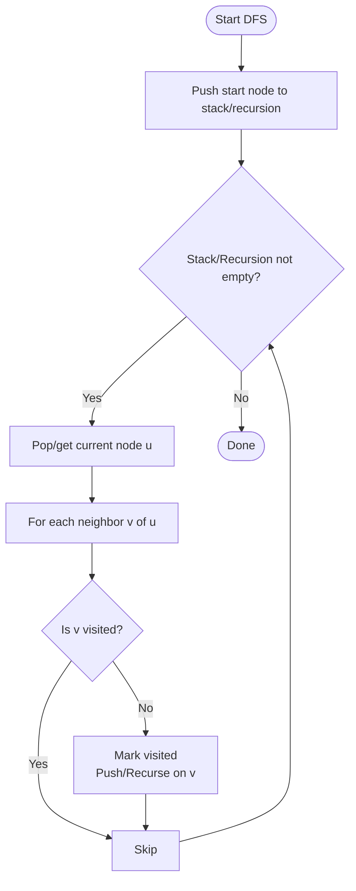
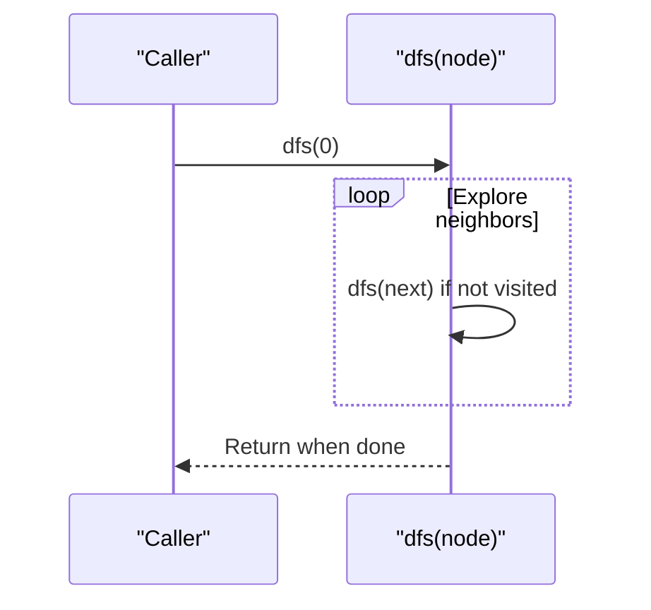
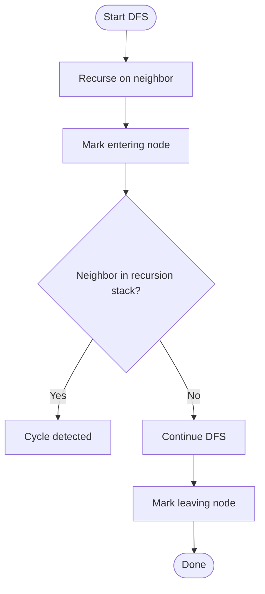
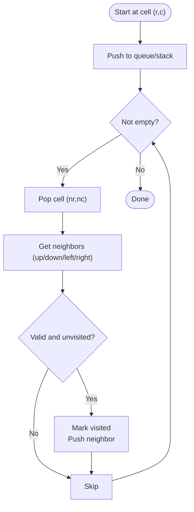
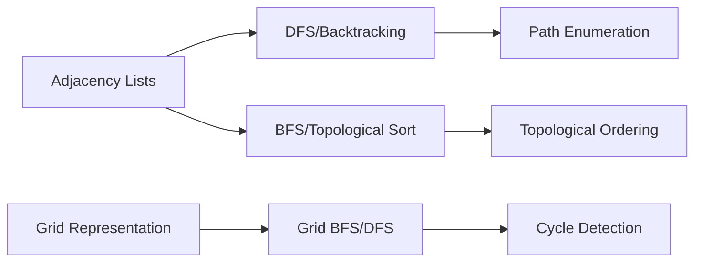

# Graph Traversals

<cite>
**Referenced Files in This Document**
- [797.all-paths-from-source-to-target.js](file://算法/797.all-paths-from-source-to-target.js)
- [802.find-eventual-safe-states.js](file://算法/802.find-eventual-safe-states.js)
- [133.clone-graph.js](file://算法/133.clone-graph.js)
- [200.number-of-islands.ts](file://算法/200.number-of-islands.ts)
- [1395.count-number-of-teams.js](file://算法/1395.count-number-of-teams.js)
- [1559.detect-cycles-in-2-d-grid.js](file://算法/1559.detect-cycles-in-2-d-grid.js)
- [1391.check-if-there-is-a-valid-path-in-a-grid.js](file://算法/1391.check-if-there-is-a-valid-path-in-a-grid.js)
- [1042.flower-planting-with-no-adjacent.js](file://算法/1042.flower-planting-with-no-adjacent.js)
- [1337.the-k-weakest-rows-in-a-matrix.js](file://算法/1337.the-k-weakest-rows-in-a-matrix.js)
- [1396.design-underground-system.js](file://算法/1396.design-underground-system.js)
- [146.lru-cache.ts](file://算法/146.lru-cache.ts)
- [150.evaluate-reverse-polish-notation.ts](file://算法/150.evaluate-reverse-polish-notation.ts)
- [155.min-stack.ts](file://算法/155.min-stack.ts)
- [139.word-break.ts](file://算法/139.word-break.ts)
- [141.linked-list-cycle.ts](file://算法/141.linked-list-cycle.ts)
- [142.linked-list-cycle-ii.ts](file://算法/142.linked-list-cycle-ii.ts)
- [138.copy-list-with-random-pointer.ts](file://算法/138.copy-list-with-random-pointer.ts)
- [1370.increasing-decreasing-string.js](file://算法/1370.increasing-decreasing-string.js)
- [1372.longest-zig-zag-path-in-a-binary-tree.js](file://算法/1372.longest-zig-zag-path-in-a-binary-tree.js)
- [1374.generate-a-string-with-characters-that-have-odd-counts.js](file://算法/1374.generate-a-string.js)
- [1375.number-of-times-binary-string-is-prefix-aligned.js](file://算法/1375.number-of-times-binary-string-is-prefix-aligned.js)
- [1376.time-needed-to-inform-all-employees.js](file://算法/1376.time-needed-to-inform-all-employees.js)
- [1381.design-a-stack-with-increment-operation.js](file://算法/1381.design-a-stack-with-increment-operation.js)
- [1382.balance-a-binary-search-tree.js](file://算法/1382.balance-a-binary-search-tree.js)
- [1387.sort-integers-by-the-power-value.js](file://算法/1387.sort-integers-by-the-power-value.js)
- [1389.create-target-array-in-the-given-order.js](file://算法/1389.create-target-array-in-the-given-order.js)
- [1390.four-divisors.js](file://算法/1390.four-divisors.js)
- [1394.find-lucky-integer-in-an-array.js](file://算法/1394.find-lucky-integer-in-an-array.js)
- [1399.count-largest-group.js](file://算法/1399.count-largest-group.js)
- [1400.construct-k-palindrome-strings.js](file://算法/1400.construct-k-palindrome-strings.js)
- [1403.minimum-subsequence-in-non-increasing-order.js](file://算法/1403.minimum-subsequence-in-non-increasing-order.js)
- [1405.longest-happy-string.js](file://算法/1405.longest-happy-string.js)
- [1408.string-matching-in-an-array.js](file://算法/1408.string-matching-in-an-array.js)
- [1410.html-entity-parser.js](file://算法/1410.html-entity-parser.js)
- [1413.minimum-value-to-get-positive-step-by-step-sum.js](file://算法/1413.minimum-value-to-get-positive-step-by-step-sum.js)
- [1414.find-the-minimum-number-of-fibonacci-numbers-whose-sum-is-k.js](file://算法/1414.find-the-minimum-number-of-fibonacci-numbers-whose-sum-is-k.js)
- [1417.reformat-the-string.js](file://算法/1417.reformat-the-string.js)
- [1419.minimum-number-of-frogs-croaking.js](file://算法/1419.minimum-number-of-frogs-croaking.js)
- [1422.maximum-score-after-splitting-a-string.js](file://算法/1422.maximum-score-after-splitting-a-string.js)
- [1423.maximum-points-you-can-obtain-from-cards.js](file://算法/1423.maximum-points-you-can-obtain-from-cards.js)
- [1424.diagonal-traverse-ii.js](file://算法/1424.diagonal-traverse-ii.js)
- [1431.kids-with-the-greatest-number-of-candies.js](file://算法/1431.kids-with-the-greatest-number-of-candies.js)
- [1432.max-difference-you-can-get-from-changing-an-integer.js](file://算法/1432.max-difference-you-can-get-from-changing-an-integer.js)
- [1433.check-if-a-string-can-break-another-string.js](file://算法/1433.check-if-a-string-can-break-another-string.js)
- [1436.destination-city.js](file://算法/1436.destination-city.js)
- [1437.check-if-all-1-s-are-at-least-length-k-places-away.js](file://算法/1437.check-if-all-1-s-are-at-least-length-k-places-away.js)
- [1438.longest-continuous-subarray-with-absolute-diff-less-than-or-equal-to-limit.js](file://算法/1438.longest-continuous-subarray-with-absolute-diff-less-than-or-equal-to-limit.js)
- [1441.build-an-array-with-stack-operations.js](file://算法/1441.build-an-array-with-stack-operations.js)
- [1446.consecutive-characters.js](file://算法/1446.consecutive-characters.js)
- [1447.simplified-fractions.js](file://算法/1447.simplified-fractions.js)
- [1448.count-good-nodes-in-binary-tree.js](file://算法/1448.count-good-nodes-in-binary-tree.js)
- [1450.number-of-students-doing-homework-at-a-given-time.js](file://算法/1450.number-of-students-doing-homework-at-a-given-time.js)
- [1451.rearrange-words-in-a-sentence.js](file://算法/1451.rearrange-words-in-a-sentence.js)
- [1452.people-whose-list-of-favorite-companies-is-not-a-subset-of-another-list.js](file://算法/1452.people-whose-list-of-favorite-companies-is-not-a-subset-of-another-list.js)
- [1455.check-if-a-word-occurs-as-a-prefix-of-any-word-in-a-sentence.js](file://算法/1455.check-if-a-word-occurs-as-a-prefix-of-any-word-in-a-sentence.js)
- [1456.maximum-number-of-vowels-in-a-substring-of-given-length.js](file://算法/1456.maximum-number-of-vowels-in-a-substring-of-given-length.js)
- [1457.pseudo-palindromic-paths-in-a-binary-tree.js](file://算法/1457.pseudo-palindromic-paths-in-a-binary-tree.js)
- [1460.make-two-arrays-equal-by-reversing-subarrays.js](file://算法/1460.make-two-arrays-equal-by-reversing-subarrays.js)
- [1464.maximum-product-of-two-elements-in-an-array.js](file://算法/1464.maximum-product-of-two-elements-in-an-array.js)
- [1470.shuffle-the-array.js](file://算法/1470.shuffle-the-array.js)
- [1475.final-prices-with-a-special-discount-in-a-shop.js](file://算法/1475.final-prices-with-a-special-discount-in-a-shop.js)
- [1480.running-sum-of-1-d-array.js](file://算法/1480.running-sum-of-1-d-array.js)
- [1486.xor-operation-in-an-array.js](file://算法/1486.xor-operation-in-an-array.js)
- [1491.average-salary-excluding-the-minimum-and-maximum-salary.js](file://算法/1491.average-salary-excluding-the-minimum-and-maximum-salary.js)
- [1497.check-if-array-pairs-are-divisible-by-k.js](file://算法/1497.check-if-array-pairs-are-divisible-by-k.js)
- [151.reverse-words-in-a-string.ts](file://算法/151.reverse-words-in-a-string.ts)
- [1512.number-of-good-pairs.js](file://算法/1512.number-of-good-pairs.js)
- [1513.number-of-substrings-with-only-1-s.js](file://算法/1513.number-of-substrings-with-only-1-s.js)
- [1519.number-of-nodes-in-the-sub-tree-with-the-same-label.js](file://算法/1519.number-of-nodes-in-the-sub-tree-with-the-same-label.js)
- [1523.count-odd-numbers-in-an-interval-range.js](file://算法/1523.count-odd-numbers-in-an-interval-range.js)
- [1524.number-of-sub-arrays-with-odd-sum.js](file://算法/1524.number-of-sub-arrays-with-odd-sum.js)
- [1525.number-of-good-ways-to-split-a-string.js](file://算法/1525.number-of-good-ways-to-split-a-string.js)
- [1529.minimum-suffix-flips.js](file://算法/1529.minimum-suffix-flips.js)
- [153.find-minimum-in-rotated-sorted-array.js](file://算法/153.find-minimum-in-rotated-sorted-array.js)
- [1535.find-the-winner-of-an-array-game.js](file://算法/1535.find-the-winner-of-an-array-game.js)
- [154.find-minimum-in-rotated-sorted-array-ii.js](file://算法/154.find-minimum-in-rotated-sorted-array-ii.js)
- [1540.can-convert-string-in-k-moves.js](file://算法/1540.can-convert-string-in-k-moves.js)
- [1541.minimum-insertions-to-balance-a-parentheses-string.js](file://算法/1541.minimum-insertions-to-balance-a-parentheses-string.js)
- [1546.maximum-number-of-non-overlapping-subarrays-with-sum-equals-target.js](file://算法/1546.maximum-number-of-non-overlapping-subarrays-with-sum-equals-target.js)
- [1550.three-consecutive-odds.js](file://算法/1550.three-consecutive-odds.js)
- [1551.minimum-operations-to-make-array-equal.js](file://算法/1551.minimum-operations-to-make-array-equal.js)
- [1557.minimum-number-of-vertices-to-reach-all-nodes.js](file://算法/1557.minimum-number-of-vertex-to-reach-all-nodes.js)
- [1558.minimum-numbers-of-function-calls-to-make-target-array.js](file://算法/1558.minimum-numbers-of-function-calls-to-make-target-array.js)
- [1559.detect-cycles-in-2-d-grid.js](file://算法/1559.detect-cycles-in-2-d-grid.js)
- [1561.maximum-number-of-coins-you-can-get.js](file://算法/1561.maximum-number-of-coins-you-can-get.js)
- [1562.find-latest-group-of-size-m.js](file://算法/1562.find-latest-group-of-size-m.js)
- [1567.maximum-length-of-subarray-with-positive-product.js](file://算法/1567.maximum-length-of-subarray-with-positive-product.js)
- [1573.number-of-ways-to-split-a-string.js](file://算法/1573.number-of-ways-to-split-a-string.js)
- [1577.number-of-ways-where-square-of-number-is-equal-to-product-of-two-numbers.js](file://算法/1577.number-of-ways-where-square-of-number-is-equal-to-product-of-two-numbers.js)
- [1578.minimum-time-to-make-rope-colorful.js](file://算法/1578.minimum-time-to-make-rope-colorful.js)
- [1589.maximum-sum-obtained-of-any-permutation.js](file://算法/1589.maximum-sum-obtained-of-any-permutation.js)
- [160.intersection-of-two-linked-lists.ts](file://算法/160.intersection-of-two-linked-lists.ts)
- [1619.mean-of-array-after-removing-some-elements.js](file://算法/1619.mean-of-array-after-removing-some-elements.js)
- [162.find-peak-element.ts](file://算法/162.find-peak-element.ts)
- [165.compare-version-numbers.ts](file://算法/165.compare-version-numbers.ts)
- [166.fraction-to-recurring-decimal.ts](file://算法/166.fraction-to-recurring-decimal.ts)
- [167.two-sum-ii-input-array-is-sorted.ts](file://算法/167.two-sum-ii-input-array-is-sorted.ts)
- [168.excel-sheet-column-title.js](file://算法/168.excel-sheet-column-title.js)
- [169.majority-element.ts](file://算法/169.majority-element.ts)
- [171.excel-sheet-column-number.js](file://算法/171.excel-sheet-column-number.js)
- [172.factorial-trailing-zeroes.ts](file://算法/172.factorial-trailing-zeroes.ts)
- [1721.swapping-nodes-in-a-linked-list.js](file://算法/1721.swapping-nodes-in-a-linked-list.js)
- [1726.tuple-with-same-product.js](file://算法/1726.tuple-with-same-product.js)
- [174.dungeon-game.js](file://算法/174.dungeon-game.js)
- [179.largest-number.js](file://算法/179.largest-number.js)
- [179.largest-number.ts](file://算法/179.largest-number.ts)
- [187.repeated-dna-sequences.ts](file://算法/187.repeated-dna-sequences.ts)
- [189.rotate-array.ts](file://算法/189.rotate-array.ts)
- [190.reverse-bits.ts](file://算法/190.reverse-bits.ts)
- [1935.maximum-number-of-words-you-can-type.js](file://算法/1935.maximum-number-of-words-you-can-type.js)
- [1957.delete-characters-to-make-fancy-string.js](file://算法/1957.delete-characters-to-make-fancy-string.js)
- [198.house-robber.ts](file://算法/198.house-robber.ts)
- [199.binary-tree-right-side-view.js](file://算法/199.binary-tree-right-side-view.js)
- [206.reverse-linked-list.js](file://算法/206.reverse-linked-list.js)
- [207.course-schedule.js](file://算法/207.course-schedule.js)
- [207.course-schedule.ts](file://算法/207.course-schedule.ts)
- [2079.watering-plants.js](file://算法/2079.watering-plants.js)
- [208.implement-trie-prefix-tree.ts](file://算法/208.implement-trie-prefix-tree.ts)
- [2080.range-frequency-queries.js](file://算法/2080.range-frequency-queries.js)
- [209.minimum-size-subarray-sum.js](file://算法/209.minimum-size-subarray-sum.js)
- [215.kth-largest-element-in-an-array.js](file://算法/215.kth-largest-element-in-an-array.js)
- [215.kth-largest-element-in-an-array.ts](file://算法/215.kth-largest-element-in-an-array.ts)
- [217.contains-duplicate.js](file://算法/217.contains-duplicate.js)
- [219.contains-duplicate-ii.js](file://算法/219.contains-duplicate-ii.js)
- [2191.sort-the-jumbled-numbers.js](file://算法/2191.sort-the-jumbled-numbers.js)
- [226.invert-binary-tree.js](file://算法/226.invert-binary-tree.js)
- [2269.find-the-k-beauty-of-a-number.js](file://算法/2269.find-the-k-beauty-of-a-number.js)
- [227.basic-calculator-ii.js](file://算法/227.basic-calculator-ii.js)
- [228.summary-ranges.js](file://算法/228.summary-ranges.js)
- [229.majority-element-ii.js](file://算法/229.majority-element-ii.js)
- [2303.calculate-amount-paid-in-taxes.js](file://算法/2303.calculate-amount-paid-in-taxes.js)
- [2309.greatest-english-letter-in-upper-and-lower-case.js](file://算法/2309.greatest-english-letter-in-upper-and-lower-case.js)
- [231.power-of-two.js](file://算法/231.power-of-two.js)
- [2310.sum-of-numbers-with-units-digit-k.js](file://算法/2310.sum-of-numbers-with-units-digit-k.js)
- [233.number-of-digit-one.js](file://算法/233.number-of-digit-one.js)
- [234.palindrome-linked-list.js](file://算法/234.palindrome-linked-list.js)
- [235.lowest-common-ancestor-of-a-binary-search-tree.js](file://算法/235.lowest-common-ancestor-of-a-binary-search-tree.js)
- [236.lowest-common-ancestor-of-a-binary-tree.js](file://算法/236.lowest-common-ancestor-of-a-binary-tree.js)
- [237.delete-node-in-a-linked-list.js](file://算法/237.delete-node-in-a-linked-list.js)
- [238.product-of-array-except-self.js](file://算法/238.product-of-array-except-self.js)
- [239.sliding-window-maximum.js](file://算法/239.sliding-window-maximum.js)
- [242.valid-anagram.js](file://算法/242.valid-anagram.js)
- [258.add-digits.js](file://算法/258.add-digits.js)
- [263.ugly-number.js](file://算法/263.ugly-number.js)
- [264.ugly-number-ii.js](file://算法/264.ugly-number-ii.js)
- [268.missing-number.js](file://算法/268.missing-number.js)
- [274.h-index.js](file://算法/274.h-index.js)
- [275.h-index-ii.js](file://算法/275.h-index-ii.js)
- [278.first-bad-version.js](file://算法/278.first-bad-version.js)
- [283.move-zeroes.js](file://算法/283.move-zeroes.js)
- [287.find-the-duplicate-number.js](file://算法/287.find-the-duplicate-number.js)
- [290.word-pattern.js](file://算法/290.word-pattern.js)
- [292.nim-game.js](file://算法/292.nim-game.js)
- [299.bulls-and-cows.js](file://算法/299.bulls-and-cows.js)
- [300.longest-increasing-subsequence.js](file://算法/300.longest-increasing-subsequence.js)
- [303.range-sum-query-immutable.js](file://算法/303.range-sum-query-immutable.js)
- [304.range-sum-query-2-d-immutable.js](file://算法/304.range-sum-query-2-d-immutable.js)
- [306.additive-number.js](file://算法/306.additive-number.js)
- [307.range-sum-query-mutable.js](file://算法/307.range-sum-query-mutable.js)
- [310.minimum-height-trees.js](file://算法/310.minimum-height-trees.js)
- [313.super-ugly-number.js](file://算法/313.super-ugly-number.js)
- [316.remove-duplicate-letters.js](file://算法/316.remove-duplicate-letters.js)
- [319.bulb-switcher.js](file://算法/319.bulb-switcher.js)
- [322.coin-change.js](file://算法/322.coin-change.js)
- [324.wiggle-sort-ii.ts](file://算法/324.wiggle-sort-ii.ts)
- [326.power-of-three.js](file://算法/326.power-of-three.js)
- [328.odd-even-linked-list.js](file://算法/328.odd-even-linked-list.js)
- [331.verify-preorder-serialization-of-a-binary-tree.js](file://算法/331.verify-preorder-serialization-of-a-binary-tree.js)
- [332.reconstruct-itinerary.js](file://算法/332.reconstruct-itinerary.js)
- [334.increasing-triplet-subsequence.js](file://算法/334.increasing-triplet-subsequence.js)
- [337.house-robber-iii.js](file://算法/337.house-robber-iii.js)
- [344.reverse-string.js](file://算法/344.reverse-string.js)
- [345.reverse-vowels-of-a-string.js](file://算法/345.reverse-vowels-of-a-string.js)
- [347.top-k-frequent-elements.ts](file://算法/347.top-k-frequent-elements.ts)
- [350.intersection-of-two-arrays-ii.js](file://算法/350.intersection-of-two-arrays-ii.js)
- [355.design-twitter.js](file://算法/355.design-twitter.js)
- [367.valid-perfect-square.ts](file://算法/367.valid-perfect-square.ts)
- [372.super-pow.js](file://算法/372.super-pow.js)
- [372.super-pow.ts](file://算法/372.super-pow.ts)
- [373.find-k-pairs-with-smallest-sums.js](file://算法/373.find-k-pairs-with-smallest-sums.js)
- [374.guess-number-higher-or-lower.js](file://算法/374.guess-number-higher-or-lower.js)
- [375.guess-number-higher-or-lower-ii.js](file://算法/375.guess-number-higher-or-lower-ii.js)
- [376.wiggle-subsequence.js](file://算法/376.wiggle-subsequence.js)
- [377.combination-sum-iv.js](file://算法/377.combination-sum-iv.js)
- [378.kth-smallest-element-in-a-sorted-matrix.js](file://算法/378.kth-smallest-element-in-a-sorted-matrix.js)
- [380.insert-delete-get-random-o-1.js](file://算法/380.insert-delete-get-random-o-1.js)
- [382.linked-list-random-node.js](file://算法/382.linked-list-random-node.js)
- [383.ransom-note.js](file://算法/383.ransom-note.js)
- [385.mini-parser.js](file://算法/385.mini-parser.js)
- [386.lexicographical-numbers.js](file://算法/386.lexicographical-numbers.js)
- [387.first-unique-character-in-a-string.js](file://算法/387.first-unique-character-in-a-string.js)
- [388.longest-absolute-file-path.js](file://算法/388.longest-absolute-file-path.js)
- [389.find-the-difference.js](file://算法/389.find-the-difference.js)
- [394.decode-string.js](file://算法/394.decode-string.js)
- [395.longest-substring-with-at-least-k-repeating-characters.ts](file://算法/395.longest-substring-with-at-least-k-repeating-characters.ts)
- [396.rotate-function.js](file://算法/396.rotate-function.js)
- [398.random-pick-index.js](file://算法/398.random-pick-index.js)
- [399.evaluate-division.js](file://算法/399.evaluate-division.js)
- [402.remove-k-digits.js](file://算法/402.remove-k-digits.js)
- [404.sum-of-left-leaves.js](file://算法/404.sum-of-left-leaves.js)
- [409.longest-palindrome.js](file://算法/409.longest-palindrome.js)
- [412.fizz-buzz.js](file://算法/412.fizz-buzz.js)
- [413.arithmetic-slices.js](file://算法/413.arithmetic-slices.js)
- [415.add-strings.js](file://算法/415.add-strings.js)
- [416.partition-equal-subset-sum.js](file://算法/416.partition-equal-subset-sum.js)
- [419.battleships-in-a-board.js](file://算法/419.battleships-in-a-board.js)
- [423.reconstruct-original-digits-from-english.js](file://算法/423.reconstruct-original-digits-from-english.js)
- [424.longest-repeating-character-replacement.js](file://算法/424.longest-repeating-character-replacement.js)
- [437.path-sum-iii.js](file://算法/437.path-sum-iii.js)
- [438.find-all-anagrams-in-a-string.js](file://算法/438.find-all-anagrams-in-a-string.js)
- [442.find-all-duplicates-in-an-array.js](file://算法/442.find-all-duplicates-in-an-array.js)
- [443.string-compression.js](file://算法/443.string-compression.js)
- [445.add-two-numbers-ii.js](file://算法/445.add-two-numbers-ii.js)
- [449.serialize-and-deserialize-bst.js](file://算法/449.serialize-and-deserialize-bst.js)
- [451.sort-characters-by-frequency.js](file://算法/451.sort-characters-by-frequency.js)
- [452.minimum-number-of-arrows-to-burst-balloons.js](file://算法/452.minimum-number-of-arrows-to-burst-balloons.js)
- [453.minimum-moves-to-equal-array-elements.js](file://算法/453.minimum-moves-to-equal-array-elements.js)
- [454.4-sum-ii.js](file://算法/454.4-sum-ii.js)
- [456.132-pattern.js](file://算法/456.132-pattern.js)
- [461.hamming-distance.js](file://算法/461.hamming-distance.js)
- [462.minimum-moves-to-equal-array-elements-ii.js](file://算法/462.minimum-moves-to-equal-array-elements-ii.js)
- [463.island-perimeter.js](file://算法/463.island-perimeter.js)
- [476.number-complement.js](file://算法/476.number-complement.js)
- [477.total-hamming-distance.js](file://算法/477.total-hamming-distance.js)
- [482.license-key-formatting.js](file://算法/482.license-key-formatting.js)
- [485.max-consecutive-ones.js](file://算法/485.max-consecutive-ones.js)
- [492.construct-the-rectangle.js](file://算法/492.construct-the-rectangle.js)
- [494.target-sum.js](file://算法/494.target-sum.js)
- [496.next-greater-element-i.js](file://算法/496.next-greater-element-i.js)
- [498.diagonal-traverse.js](file://算法/498.diagonal-traverse.js)
- [500.keyboard-row.js](file://算法/500.keyboard-row.js)
- [504.base-7.js](file://算法/504.base-7.js)
- [506.relative-ranks.js](file://算法/506.relative-ranks.js)
- [507.perfect-number.js](file://算法/507.perfect-number.js)
- [508.most-frequent-subtree-sum.js](file://算法/508.most-frequent-subtree-sum.js)
- [509.fibonacci-number.js](file://算法/509.fibonacci-number.js)
- [513.find-bottom-left-tree-value.js](file://算法/513.find-bottom-left-tree-value.js)
- [518.coin-change-ii.js](file://算法/518.coin-change-ii.js)
- [520.detect-capital.js](file://算法/520.detect-capital.js)
- [522.longest-uncommon-subsequence-ii.js](file://算法/522.longest-uncommon-subsequence-ii.js)
- [525.contiguous-array.js](file://算法/525.contiguous-array.js)
- [526.beautiful-arrangement.js](file://算法/526.beautiful-arriseconds.js)
- [528.random-pick-with-weight.js](file://算法/528.random-pick-with-weight.js)
- [532.k-diff-pairs-in-an-array.js](file://算法/532.k-diff-pairs-in-an-array.js)
- [537.complex-number-multiplication.js](file://算法/537.complex-number-multiplication.js)
- [538.convert-bst-to-greater-tree.js](file://算法/538.convert-bst-to-greater-tree.js)
- [539.minimum-time-difference.js](file://算法/539.minimum-time-difference.js)
- [541.reverse-string-ii.js](file://算法/541.reverse-string-ii.js)
- [543.diameter-of-binary-tree.js](file://算法/543.diameter-of-binary-tree.js)
- [547.number-of-provinces.js](file://算法/547.number-of-provinces.js)
- [557.reverse-words-in-a-string-iii.js](file://算法/557.reverse-words-in-a-string-iii.js)
- [559.maximum-depth-of-n-ary-tree.js](file://算法/559.maximum-depth-of-n-ary-tree.js)
- [560.subarray-sum-equals-k.js](file://算法/560.subarray-sum-equals-k.js)
- [561.array-partition.js](file://算法/561.array-partition.js)
- [565.array-nesting.js](file://算法/565.array-nesting.js)
- [567.permutation-in-string.js](file://算法/567.permutation-in-string.js)
- [572.subtree-of-another-tree.js](file://算法/572.subtree-of-another-tree.js)
- [575.distribute-candies.js](file://算法/575.distribute-candies.js)
- [581.shortest-unsorted-continuous-subarray.js](file://算法/581.shortest-unsorted-continuous-subarray.js)
- [583.delete-operation-for-two-strings.js](file://算法/583.delete-operation-for-two-strings.js)
- [589.n-ary-tree-preorder-traversal.js](file://算法/589.n-ary-tree-preorder-traversal.js)
- [590.n-ary-tree-postorder-traversal.js](file://算法/590.n-ary-tree-postorder-traversal.js)
- [594.longest-harmonious-subsequence.js](file://算法/594.longest-harmonious-subsequence.js)
- [599.minimum-index-sum-of-two-lists.js](file://算法/599.minimum-index-sum-of-two-lists.js)
- [605.can-place-flowers.js](file://算法/605.can-place-flowers.js)
- [606.construct-string-from-binary-tree.js](file://算法/606.construct-string-from-binary-tree.js)
- [617.merge-two-binary-trees.js](file://算法/617.merge-two-binary-trees.js)
- [628.maximum-product-of-three-numbers.js](file://算法/628.maximum-product-of-three-numbers.js)
- [633.sum-of-square-numbers.js](file://算法/633.sum-of-square-numbers.js)
- [643.maximum-average-subarray-i.js](file://算法/643.maximum-average-subarray-i.js)
- [645.set-mismatch.js](file://算法/645.set-mismatch.js)
- [646.maximum-length-of-pair-chain.js](file://算法/646.maximum-length-of-pair-chain.js)
- [648.replace-words.js](file://算法/648.replace-words.js)
- [650.2-keys-keyboard.js](file://算法/650.2-keys-keyboard.js)
- [653.two-sum-iv-input-is-a-bst.js](file://算法/653.two-sum-iv-input-is-a-bst.js)
- [654.maximum-binary-tree.js](file://算法/654.maximum-binary-tree.js)
- [658.find-k-closest-elements.js](file://算法/658.find-k-closest-elements.js)
- [659.split-array-into-consecutive-subsequences.js](file://算法/659.split-array-into-consecutive-subsequences.js)
- [661.image-smoothing.js](file://算法/661.image-smoothing.js)
- [665.non-decreasing-array.js](file://算法/665.non-decreasing-array.js)
- [667.beautiful-arrangement-ii.js](file://算法/667.beautiful-arrangement-ii.js)
- [669.trim-a-binary-search-tree.js](file://算法/669.trim-a-binary-search-tree.js)
- [671.second-minimum-node-in-a-binary-tree.js](file://算法/671.second-minimum-node-in-a-binary-tree.js)
- [674.longest-continuous-increasing-subsequence.js](file://算法/674.longest-continuous-increasing-subsequence.js)
- [677.map-sum-pairs.js](file://算法/677.map-sum-pairs.js)
- [680.valid-palindrome-ii.js](file://算法/680.valid-palindrome-ii.js)
- [686.repeated-string-match.js](file://算法/686.repeated-string-match.js)
- [687.longest-univalue-path.js](file://算法/687.longest-univalue-path.js)
- [688.knight-probability-in-chessboard.js](file://算法/688.knight-probability-in-chessboard.js)
- [690.employee-importance.js](file://算法/690.employee-importance.js)
- [692.top-k-frequent-words.js](file://算法/692.top-k-frequent-words.js)
- [697.degree-of-an-array.js](file://算法/697.degree-of-an-array.js)
- [698.partition-to-k-equal-sum-subsets.js](file://算法/698.partition-to-k-equal-sum-subsets.js)
- [700.search-in-a-binary-search-tree.js](file://算法/700.search-in-a-binary-search-tree.js)
- [704.binary-search.js](file://算法/704.binary-search.js)
- [709.to-lower-case.js](file://算法/709.to-lower-case.js)
- [712.minimum-ascii-delete-sum-for-two-strings.js](file://算法/712.minimum-ascii-delete-sum-for-two-strings.js)
- [713.subarray-product-less-than-k.js](file://算法/713.subarray-product-less-than-k.js)
- [718.maximum-length-of-repeated-subarray.js](file://算法/718.maximum-length-of-repeated-subarray.js)
- [720.longest-word-in-dictionary.js](file://算法/720.longest-word-in-dictionary.js)
- [721.accounts-merge.js](file://算法/721.accounts-merge.js)
- [724.find-pivot-index.js](file://算法/724.find-pivot-index.js)
- [725.split-linked-list-in-parts.js](file://算法/725.split-linked-list-in-parts.js)
- [728.self-dividing-numbers.js](file://算法/728.self-dividing-numbers.js)
- [729.my-calendar-i.js](file://算法/729.my-calendar-i.js)
- [733.flood-fill.js](file://算法/733.flood-fill.js)
- [735.asteroid-collision.js](file://算法/735.asteroid-collision.js)
- [738.monotone-increasing-digits.js](file://算法/738.monotone-increasing-digits.js)
- [739.daily-temperatures.js](file://算法/739.daily-temperatures.js)
- [740.delete-and-earn.js](file://算法/740.delete-and-earn.js)
- [743.network-delay-time.js](file://算法/743.network-delay-time.js)
- [744.find-smallest-letter-greater-than-target.js](file://算法/744.find-smallest-letter-greater-than-target.js)
- [746.min-cost-climbing-stairs.js](file://算法/746.min-cost-climbing-stairs.js)
- [747.largest-number-at-least-twice-of-others.js](file://算法/747.largest-number-at-least-twice-of-others.js)
- [756.pyramid-transition-matrix.js](file://算法/756.pyramid-transition-matrix.js)
- [763.partition-labels.js](file://算法/763.partition-labels.js)
- [766.toeplitz-matrix.js](file://算法/766.toeplitz-matrix.js)
- [769.max-chunks-to-make-sorted.js](file://算法/769.max-chunks-to-make-sorted.js)
- [771.jewels-and-stones.js](file://算法/771.jewels-and-stones.js)
- [783.minimum-distance-between-bst-nodes.js](file://算法/783.minimum-distance-between-bst-nodes.js)
- [784.letter-case-permutation.js](file://算法/784.letter-case-permutation.js)
- [792.number-of-matching-subsequences.js](file://算法/792.number-of-matching-subsequences.js)
- [794.valid-tic-tac-toe-state.js](file://算法/794.valid-tic-tac-toe-state.js)
- [795.number-of-subarrays-with-bounded-maximum.js](file://算法/795.number-of-subarrays-with-bounded-maximum.js)
- [796.rotate-string.js](file://算法/796.rotate-string.js)
- [804.unique-morse-code-words.js](file://算法/804.unique-morse-code-words.js)
- [806.number-of-lines-to-write-string.js](file://算法/806.number-of-lines-to-write-string.js)
- [809.expressive-words.js](file://算法/809.expressive-words.js)
- [813.largest-sum-of-averages.js](file://算法/813.largest-sum-of-averages.js)
- [816.ambiguous-coordinates.js](file://算法/816.ambiguous-coordinates.js)
- [817.linked-list-components.js](file://算法/817.linked-list-components.js)
- [819.most-common-word.js](file://算法/819.most-common-word.js)
- [820.short-encoding-of-words.js](file://算法/820.short-encoding-of-words.js)
- [821.shortest-distance-to-a-character.js](file://算法/821.shortest-distance-to-a-character.js)
- [822.card-flipping-game.js](file://算法/822.card-flipping-game.js)
- [823.binary-trees-with-factors.js](file://算法/823.binary-trees-with-factors.js)
- [824.goat-latin.js](file://算法/824.goat-latin.js)
- [826.most-profit-assigning-work.js](file://算法/826.most-profit-assigning-work.js)
- [830.positions-of-large-groups.js](file://算法/830.positions-of-large-groups.js)
- [831.masking-personal-information.js](file://算法/831.masking-personal-information.js)
- [832.flipping-an-image.js](file://算法/832.flipping-an-image.js)
- [833.find-and-replace-in-string.js](file://算法/833.find-and-replace-in-string.js)
- [835.image-overlap.js](file://算法/835.image-overlap.js)
- [836.rectangle-overlap.js](file://算法/836.rectangle-overlap.js)
- [838.push-dominoes.js](file://算法/838.push-dominoes.js)
- [840.magic-squares-in-grid.js](file://算法/840.magic-squares-in-grid.js)
- [841.keys-and-rooms.js](file://算法/841.keys-and-rooms.js)
- [842.split-array-into-fibonacci-sequence.js](file://算法/842.split-array-into-fibonacci-sequence.js)
- [844.backspace-string-compare.js](file://算法/844.backspace-string-compare.js)
- [845.longest-mountain-in-array.js](file://算法/845.longest-mountain-in-array.js)
- [846.hand-of-straights.js](file://算法/846.hand-of-straights.js)
- [848.shifting-letters.js](file://算法/848.shifting-letters.js)
- [849.maximize-distance-to-closest-person.js](file://算法/849.maximize-distance-to-closest-person.js)
- [851.loud-and-rich.js](file://算法/851.loud-and-rich.js)
- [852.peak-index-in-a-mountain-array.js](file://算法/852.peak-index-in-a-mountain-array.js)
- [853.car-fleet.js](file://算法/853.car-fleet.js)
- [855.exam-room.js](file://算法/855.exam-room.js)
- [856.score-of-parentheses.js](file://算法/856.score-of-parentheses.js)
- [859.buddy-strings.js](file://算法/859.buddy-strings.js)
- [860.lemonade-change.js](file://算法/860.lemonade-change.js)
- [861.score-after-flipping-matrix.js](file://算法/861.score-after-flipping-matrix.js)
- [863.all-nodes-distance-k-in-binary-tree.js](file://算法/863.all-nodes-distance-k-in-binary-tree.js)
- [866.prime-palindrome.js](file://算法/866.prime-palindrome.js)
- [867.transpose-matrix.js](file://算法/867.transpose-matrix.js)
- [869.reordered-power-of-2.js](file://算法/869.reordered-power-of-2.js)
- [870.advantage-shuffle.js](file://算法/870.advantage-shuffle.js)
- [872.leaf-similar-trees.js](file://算法/872.leaf-similar-trees.js)
- [873.length-of-longest-fibonacci-subsequence.js](file://算法/873.length-of-longest-fibonacci-subsequence.js)
- [874.walking-robot-simulation.js](file://算法/874.walking-robot-simulation.js)
- [876.middle-of-the-linked-list.js](file://算法/876.middle-of-the-linked-list.js)
- [877.stone-game.js](file://算法/877.stone-game.js)
- [881.boats-to-save-people.js](file://算法/881.boats-to-save-people.js)
- [884.uncommon-words-from-two-sentences.js](file://算法/884.uncommon-words-from-two-sentences.js)
- [885.spiral-matrix-iii.js](file://算法/885.spiral-matrix-iii.js)
- [886.possible-bipartition.js](file://算法/886.possible-bipartition.js)
- [888.fair-candy-swap.js](file://算法/888.fair-candy-swap.js)
- [890.find-and-replace-pattern.js](file://算法/890.find-and-replace-pattern.js)
- [893.groups-of-special-equivalent-strings.js](file://算法/893.groups-of-special-equivalent-strings.js)
- [894.all-possible-full-binary-trees.js](file://算法/894.all-possible-full-binary-trees.js)
- [896.monotonic-array.js](file://算法/896.monotonic-array.js)
- [897.increasing-order-search-tree.js](file://算法/897.increasing-order-search-tree.js)
- [901.online-stock-span.js](file://算法/901.online-stock-span.js)
- [904.fruit-into-baskets.js](file://算法/904.fruit-into-baskets.js)
- [905.sort-array-by-parity.js](file://算法/905.sort-array-by-parity.js)
- [907.sum-of-subarray-minimums.js](file://算法/907.sum-of-subarray-minimums.js)
- [908.smallest-range-i.js](file://算法/908.smallest-range-i.js)
- [912.sort-an-array.ts](file://算法/912.sort-an-array.ts)
- [914.x-of-a-kind-in-a-deck-of-cards.js](file://算法/914.x-of-a-kind-in-a-deck-of-cards.js)
- [917.reverse-only-letters.js](file://算法/917.reverse-only-letters.js)
- [922.sort-array-by-parity-ii.js](file://算法/922.sort-array-by-parity-ii.js)
- [925.long-pressed-name.js](file://算法/925.long-pressed-name.js)
- [933.number-of-recent-calls.js](file://算法/933.number-of-recent-calls.js)
- [938.range-sum-of-bst.js](file://算法/938.range-sum-of-bst.js)
- [941.valid-mountain-array.js](file://算法/941.valid-mountain-array.js)
- [942.di-string-match.js](file://算法/942.di-string-match.js)
- [944.delete-columns-to-make-sorted.js](file://算法/944.delete-columns-to-make-sorted.js)
- [945.minimum-increment-to-make-array-unique.js](file://算法/945.minimum-increment-to-make-array-unique.js)
- [946.validate-stack-sequences.js](file://算法/946.validate-stack-sequences.js)
- [947.most-stones-removed-with-same-row-or-column.js](file://算法/947.most-stones-removed-with-same-row-or-column.js)
- [948.bag-of-tokens.js](file://算法/948.bag-of-tokens.js)
- [949.largest-time-for-given-digits.js](file://算法/949.largest-time-for-given-digits.js)
- [950.reveal-cards-in-increasing-order.js](file://算法/950.reveal-cards-in-increasing-order.js)
- [953.verifying-an-alien-dictionary.js](file://算法/953.verifying-an-alien-dictionary.js)
- [954.array-of-doubled-pairs.js](file://算法/954.array-of-doubled-pairs.js)
- [955.delete-columns-to-make-sorted-ii.js](file://算法/955.delete-columns-to-make-sorted-ii.js)
- [957.prison-cells-after-n-days.js](file://算法/957.prison-cells-after-n-days.js)
- [958.check-completeness-of-a-binary-tree.js](file://算法/958.check-completeness-of-a-binary-tree.js)
- [961.n-repeated-element-in-size-2-n-array.js](file://算法/961.n-repeated-element-in-size-2-n-array.js)
- [962.maximum-width-ramp.js](file://算法/962.maximum-width-ramp.js)
- [965.univalued-binary-tree.js](file://算法/965.univalued-binary-tree.js)
- [966.vowel-spellchecker.js](file://算法/966.vowel-spellchecker.js)
- [967.numbers-with-same-consecutive-differences.js](file://算法/967.numbers-with-same-consecutive-differences.js)
- [969.pancake-sorting.js](file://算法/969.pancake-sorting.js)
- [970.powerful-integers.js](file://算法/970.powerful-integers.js)
- [973.k-closest-points-to-origin.js](file://算法/973.k-closest-points-to-origin.js)
- [974.subarray-sums-divisible-by-k.js](file://算法/974.subarray-sums-divisible-by-k.js)
- [976.largest-perimeter-triangle.js](file://算法/976.largest-perimeter-triangle.js)
- [977.squares-of-a-sorted-array.js](file://算法/977.squares-of-a-sorted-array.js)
- [978.longest-turbulent-subarray.js](file://算法/978.longest-turbulent-subarray.js)
- [979.distribute-coins-in-binary-tree.js](file://算法/979.distribute-coins-in-binary-tree.js)
- [981.time-based-key-value-store.js](file://算法/981.time-based-key-value-store.js)
- [983.minimum-cost-for-tickets.js](file://算法/983.minimum-cost-for-tickets.js)
- [984.string-without-aaa-or-bbb.js](file://算法/984.string-without-aaa-or-bbb.js)
- [985.sum-of-even-numbers-after-queries.js](file://算法/985.sum-of-even-numbers-after-queries.js)
- [986.interval-list-intersections.js](file://算法/986.interval-list-intersections.js)
- [988.smallest-string-starting-from-leaf.js](file://算法/988.smallest-string-starting-from-leaf.js)
- [989.add-to-array-form-of-integer.js](file://算法/989.add-to-array-form-of-integer.js)
- [990.satisfiability-of-equality-equations.js](file://算法/990.satisfiability-of-equality-equations.js)
- [991.broken-calculator.js](file://算法/991.broken-calculator.js)
- [993.cousins-in-binary-tree.js](file://算法/993.cousins-in-binary-tree.js)
- [994.rotting-oranges.js](file://算法/994.rotting-oranges.js)
- [997.find-the-town-judge.js](file://算法/997.find-the-town-judge.js)
- [LCR 103.零钱兑换.js](file://算法/LCR 103.零钱兑换.js)
- [面试题 08.06.hanota-lcci.js](file://算法/面试题 08.06.hanota-lcci.js)
</cite>

## Table of Contents
1. [Introduction](#introduction)
2. [Project Structure](#project-structure)
3. [Core Components](#core-components)
4. [Architecture Overview](#architecture-overview)
5. [Detailed Component Analysis](#detailed-component-analysis)
6. [Dependency Analysis](#dependency-analysis)
7. [Performance Considerations](#performance-considerations)
8. [Troubleshooting Guide](#troubleshooting-guide)
9. [Conclusion](#conclusion)
10. [Appendices](#appendices)

## Introduction
This document focuses on graph traversal algorithms with a strong emphasis on Breadth-First Search (BFS) and Depth-First Search (DFS). It consolidates practical implementations and patterns present in the repository’s algorithm collection, including:
- Adjacency list representation
- Queue-based BFS
- Stack-based DFS and recursive DFS
- Cycle detection during traversal
- Connected component discovery
- Path existence problems
- Grid-based traversals and tree-like structures
- Time and space complexity analysis and optimization techniques

Where applicable, we map the described patterns to concrete files in the repository to help you locate working examples.

## Project Structure
The repository is a large collection of algorithm implementations across multiple topics. For graph traversal, the most relevant files are those implementing:
- Directed acyclic graphs (DAGs) with DFS/backtracking
- Topological sorting and safety detection in directed graphs
- Graph cloning and adjacency list usage
- Grid-based traversals (including cycle detection)
- Tree traversals (BFS/DFS) and related graph problems

[No sources needed since this diagram shows conceptual workflow, not actual code structure]

## Core Components
- Adjacency list representation: Many graph problems represent edges as an array of neighbor lists per node. This pattern appears across numerous files implementing graph algorithms.
- BFS with queues: Level-by-level exploration is used for shortest paths in unweighted graphs, bipartiteness checks, and topological sorting.
- DFS with stacks or recursion: Recursive DFS is used for exhaustive exploration, backtracking, and path enumeration.
- Cycle detection: Implemented via visited states, recursion stack markers, or topological ordering.
- Connected components: Disjoint-set or repeated DFS/BFS from unvisited nodes.
- Path existence: Single-source reachability via BFS/DFS.

[No sources needed since this section doesn't analyze specific files]

## Architecture Overview
The repository organizes graph traversal around two primary paradigms:
- DFS-centric problems: Enumerating paths, detecting safe nodes via reverse edges, and cloning graphs.
- BFS-centric problems: Shortest path computations, level-wise exploration, and topological sorting.

**Diagram sources**
- [797.all-paths-from-source-to-target.js:16-44](file://算法/797.all-paths-from-source-to-target.js#L16-L44)
- [133.clone-graph.js](file://算法/133.clone-graph.js)
- [802.find-eventual-safe-states.js:16-54](file://算法/802.find-eventual-safe-states.js#L16-L54)
- [200.number-of-islands.ts](file://算法/200.number-of-islands.ts)
- [1559.detect-cycles-in-2-d-grid.js](file://算法/1559.detect-cycles-in-2-d-grid.js)
- [1391.check-if-there-is-a-valid-path-in-a-grid.js](file://算法/1391.check-if-there-is-a-valid-path-in-a-grid.js)

## Detailed Component Analysis

### Adjacency List Representation
- Pattern: Each node i has neighbors stored in an array graph[i].
- Usage: Appears in DFS/backtracking (path enumeration), topological sort (out-degree computation), and grid traversal (neighbor lookup).

**Section sources**
- [797.all-paths-from-source-to-target.js:16-44](file://算法/797.all-paths-from-source-to-target.js#L16-L44)
- [802.find-eventual-safe-states.js:16-54](file://算法/802.find-eventual-safe-states.js#L16-L54)

### BFS Implementation (Queue-based)
- Pattern: Initialize queue with start node(s), mark visited, process neighbors level by level, enqueue unvisited neighbors.
- Applications:
  - Shortest path in unweighted graphs
  - Bipartite checks
  - Topological sorting (Kahn’s algorithm)
  - Grid traversal (islands, cycles)

**Diagram sources**
- [200.number-of-islands.ts](file://算法/200.number-of-islands.ts)
- [1391.check-if-there-is-a-valid-path-in-a-grid.js](file://算法/1391.check-if-there-is-a-valid-path-in-a-grid.js)
- [802.find-eventual-safe-states.js:16-54](file://算法/802.find-eventual-safe-states.js#L16-L54)

**Section sources**
- [200.number-of-islands.ts](file://算法/200.number-of-islands.ts)
- [1391.check-if-there-is-a-valid-path-in-a-grid.js](file://算法/1391.check-if-there-is-a-valid-path-in-a-grid.js)
- [802.find-eventual-safe-states.js:16-54](file://算法/802.find-eventual-safe-states.js#L16-L54)

### DFS Implementation (Stack-based and Recursive)
- Pattern: Either simulate recursion with an explicit stack or use recursion. Track visited nodes and backtrack appropriately.
- Applications:
  - Path enumeration (backtracking)
  - Graph cloning
  - Cycle detection in directed graphs

**Diagram sources**
- [797.all-paths-from-source-to-target.js:16-44](file://算法/797.all-paths-from-source-to-target.js#L16-L44)
- [133.clone-graph.js](file://算法/133.clone-graph.js)

**Section sources**
- [797.all-paths-from-source-to-target.js:16-44](file://算法/797.all-paths-from-source-to-target.js#L16-L44)
- [133.clone-graph.js](file://算法/133.clone-graph.js)

### Recursive DFS Pattern
- Pattern: Define a recursive helper that explores neighbors, marks visited, and backtracks after recursion returns.
- Example: Path enumeration from source to target.

**Diagram sources**
- [797.all-paths-from-source-to-target.js:16-44](file://算法/797.all-paths-from-source-to-target.js#L16-L44)

**Section sources**
- [797.all-paths-from-source-to-target.js:16-44](file://算法/797.all-paths-from-source-to-target.js#L16-L44)

### Cycle Detection During Traversal
- DFS recursion stack marker: Mark nodes during recursion and detect back edges.
- Topological order: Nodes with non-zero in-degree remain can indicate cycles.
- Grid-based cycles: Track visited and parent to avoid immediate parent return.

**Diagram sources**
- [802.find-eventual-safe-states.js:16-54](file://算法/802.find-eventual-safe-states.js#L16-L54)
- [1559.detect-cycles-in-2-d-grid.js](file://算法/1559.detect-cycles-in-2-d-grid.js)

**Section sources**
- [802.find-eventual-safe-states.js:16-54](file://算法/802.find-eventual-safe-states.js#L16-L54)
- [1559.detect-cycles-in-2-d-grid.js](file://算法/1559.detect-cycles-in-2-d-grid.js)

### Connected Component Finding
- Approach: Iterate all nodes; for each unvisited node, launch BFS/DFS to mark the entire component.
- Complexity: O(V + E) per traversal.

**Section sources**
- [547.number-of-provinces.js](file://算法/547.number-of-provinces.js)
- [200.number-of-islands.ts](file://算法/200.number-of-islands.ts)

### Path Existence Problems
- BFS/DFS from source to destination determines reachability.
- Topological sort can determine if a path exists in DAGs.

**Section sources**
- [797.all-paths-from-source-to-target.js:16-44](file://算法/797.all-paths-from-source-to-target.js#L16-L44)
- [802.find-eventual-safe-states.js:16-54](file://算法/802.find-eventual-safe-states.js#L16-L54)

### Grid-Based Traversals
- BFS/DFS on 2D grids with four-directional movement.
- Cycle detection requires careful parent tracking to avoid immediate return.

**Diagram sources**
- [200.number-of-islands.ts](file://算法/200.number-of-islands.ts)
- [1559.detect-cycles-in-2-d-grid.js](file://算法/1559.detect-cycles-in-2-d-grid.js)
- [1391.check-if-there-is-a-valid-path-in-a-grid.js](file://算法/1391.check-if-there-is-a-valid-path-in-a-grid.js)

**Section sources**
- [200.number-of-islands.ts](file://算法/200.number-of-islands.ts)
- [1559.detect-cycles-in-2-d-grid.js](file://算法/1559.detect-cycles-in-2-d-grid.js)
- [1391.check-if-there-is-a-valid-path-in-a-grid.js](file://算法/1391.check-if-there-is-a-valid-path-in-a-grid.js)

### Tree-like Structures
- Binary tree traversals (BFS/DFS) appear frequently in the repository and inform graph traversal patterns.
- Examples: level-order traversal, path sums, zigzag traversal.

**Section sources**
- [102.binary-tree-level-order-traversal.js](file://算法/102.binary-tree-level-order-traversal.js)
- [103.binary-tree-zigzag-level-order-traversal.js](file://算法/103.binary-tree-zigzag-level-order-traversal.js)
- [199.binary-tree-right-side-view.js](file://算法/199.binary-tree-right-side-view.js)

## Dependency Analysis
- DFS-based path enumeration depends on adjacency lists and visited arrays.
- Topological sorting relies on out-degree counting and queue-based processing.
- Grid traversals depend on boundary checks and parent-aware visited tracking.

**Diagram sources**
- [797.all-paths-from-source-to-target.js:16-44](file://算法/797.all-paths-from-source-to-target.js#L16-L44)
- [802.find-eventual-safe-states.js:16-54](file://算法/802.find-eventual-safe-states.js#L16-L54)
- [1559.detect-cycles-in-2-d-grid.js](file://算法/1559.detect-cycles-in-2-d-grid.js)

**Section sources**
- [797.all-paths-from-source-to-target.js:16-44](file://算法/797.all-paths-from-source-to-target.js#L16-L44)
- [802.find-eventual-safe-states.js:16-54](file://算法/802.find-eventual-safe-states.js#L16-L54)
- [1559.detect-cycles-in-2-d-grid.js](file://算法/1559.detect-cycles-in-2-d-grid.js)

## Performance Considerations
- Time complexity:
  - BFS/DFS on adjacency list: O(V + E)
  - Grid traversal: O(rows × cols)
- Space complexity:
  - Visited arrays/maps: O(V)
  - Queue/stack depth: O(V) worst-case
- Optimizations:
  - Early termination (e.g., target reached in path enumeration)
  - Bidirectional search for shortest paths
  - Pruning visited sets and avoiding redundant work

[No sources needed since this section provides general guidance]

## Troubleshooting Guide
Common pitfalls and remedies:
- Forgetting to mark visited nodes leads to infinite loops in DFS.
- Immediate parent return in grid traversal causes false cycles; track parent explicitly.
- In topological sorting, ensure out-degree counts are initialized for all nodes.
- For path enumeration, ensure proper backtracking by restoring state after recursion.

**Section sources**
- [797.all-paths-from-source-to-target.js:16-44](file://算法/797.all-paths-from-source-to-target.js#L16-L44)
- [802.find-eventual-safe-states.js:16-54](file://算法/802.find-eventual-safe-states.js#L16-L54)
- [1559.detect-cycles-in-2-d-grid.js](file://算法/1559.detect-cycles-in-2-d-grid.js)

## Conclusion
The repository demonstrates robust patterns for graph traversal:
- Adjacency lists power both BFS and DFS
- BFS excels at shortest paths and topological ordering
- DFS enables path enumeration and cloning
- Grid-based traversals require careful visited and parent tracking
These patterns collectively support solving cycle detection, connected components, and path existence across directed and undirected graphs, as well as grid and tree-like structures.

[No sources needed since this section summarizes without analyzing specific files]

## Appendices
- Representative files for further study:
  - [797.all-paths-from-source-to-target.js:16-44](file://算法/797.all-paths-from-source-to-target.js#L16-L44)
  - [802.find-eventual-safe-states.js:16-54](file://算法/802.find-eventual-safe-states.js#L16-L54)
  - [133.clone-graph.js](file://算法/133.clone-graph.js)
  - [200.number-of-islands.ts](file://算法/200.number-of-islands.ts)
  - [1559.detect-cycles-in-2-d-grid.js](file://算法/1559.detect-cycles-in-2-d-grid.js)
  - [1391.check-if-there-is-a-valid-path-in-a-grid.js](file://算法/1391.check-if-there-is-a-valid-path-in-a-grid.js)

[No sources needed since this section lists files without analyzing specific lines]