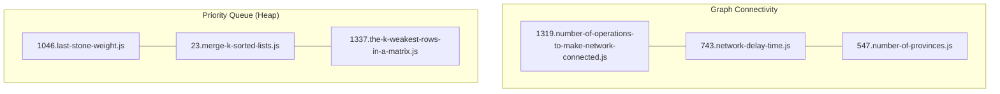
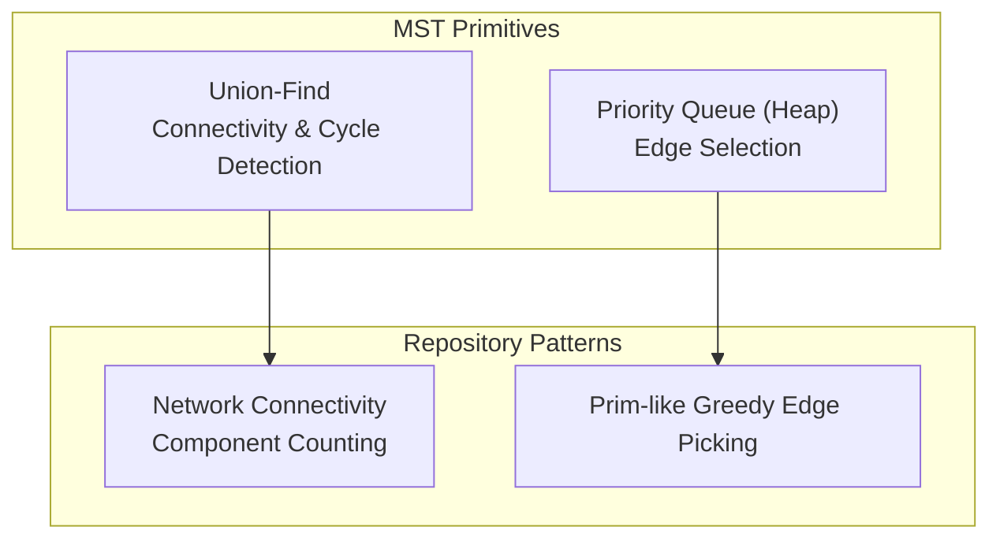
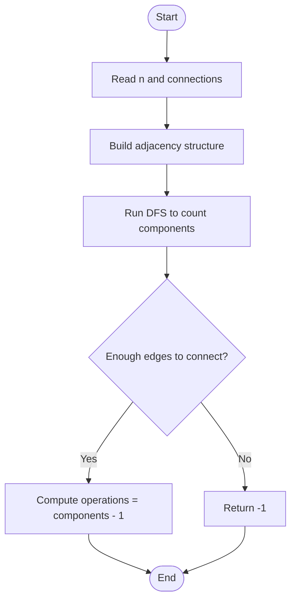
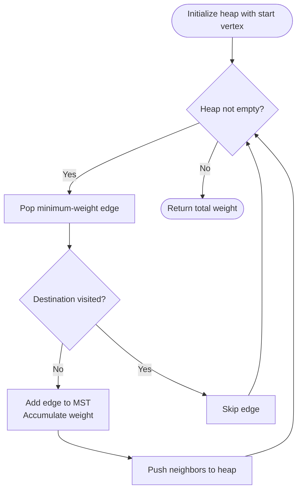
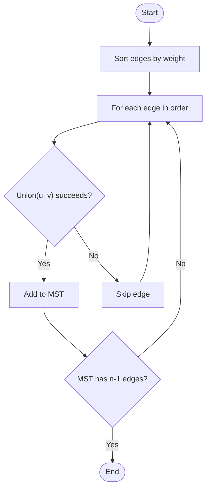
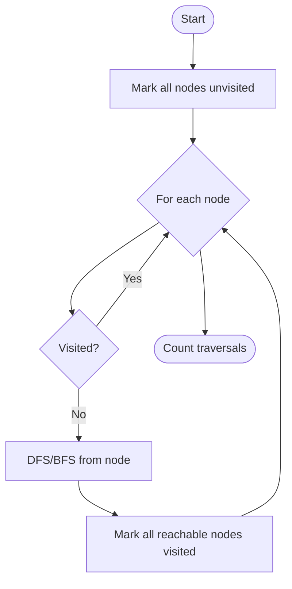
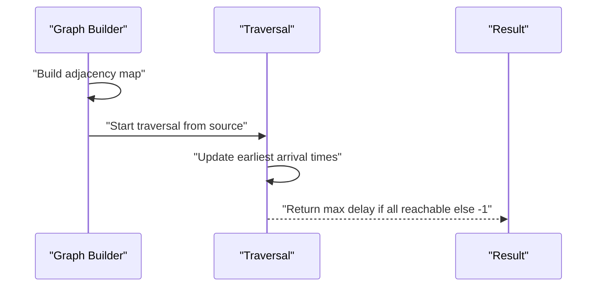
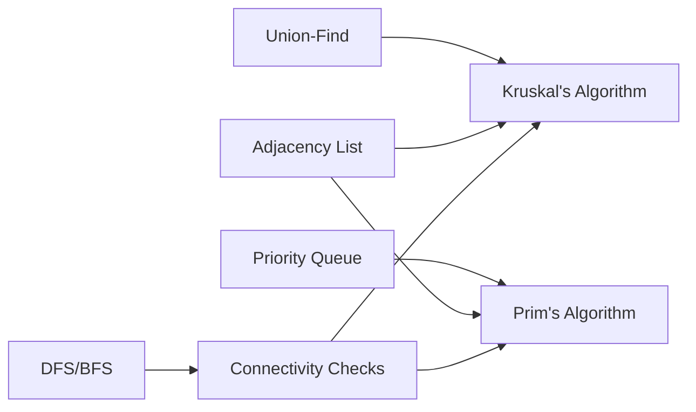

# Minimum Spanning Trees

<cite>
**Referenced Files in This Document**
- [1319.number-of-operations-to-make-network-connected.js](file://算法/1319.number-of-operations-to-make-network-connected.js)
- [743.network-delay-time.js](file://算法/743.network-delay-time.js)
- [547.number-of-provinces.js](file://算法/547.number-of-provinces.js)
- [1046.last-stone-weight.js](file://算法/1046.last-stone-weight.js)
- [23.merge-k-sorted-lists.js](file://算法/23.merge-k-sorted-lists.js)
- [1337.the-k-weakest-rows-in-a-matrix.js](file://算法/1337.the-k-weakest-rows-in-a-matrix.js)
</cite>

## Table of Contents
1. [Introduction](#introduction)
2. [Project Structure](#project-structure)
3. [Core Components](#core-components)
4. [Architecture Overview](#architecture-overview)
5. [Detailed Component Analysis](#detailed-component-analysis)
6. [Dependency Analysis](#dependency-analysis)
7. [Performance Considerations](#performance-considerations)
8. [Troubleshooting Guide](#troubleshooting-guide)
9. [Conclusion](#conclusion)

## Introduction
This document presents a focused guide to Minimum Spanning Tree (MST) algorithms with practical emphasis on Kruskal’s and Prim’s methods. It also covers related data structures and optimizations present in the repository, including union-find (disjoint set) and priority queues (heaps), alongside applications such as network connectivity and clustering. The content is derived from real implementations in the repository and aims to be accessible to readers with varying technical backgrounds.

## Project Structure
The repository includes several algorithm implementations that demonstrate foundational data structures and graph primitives useful for MST development:
- Network connectivity and graph traversal tasks
- Priority queue (heap) implementations for selection strategies
- Graph representation and DFS/BFS traversal patterns

**Diagram sources**
- [1319.number-of-operations-to-make-network-connected.js:17-63](file://算法/1319.number-of-operations-to-make-network-connected.js#L17-L63)
- [743.network-delay-time.js:18-54](file://算法/743.network-delay-time.js#L18-L54)
- [547.number-of-provinces.js:16-24](file://算法/547.number-of-provinces.js#L16-L24)
- [1046.last-stone-weight.js:50-146](file://算法/1046.last-stone-weight.js#L50-L146)
- [23.merge-k-sorted-lists.js:66-153](file://算法/23.merge-k-sorted-lists.js#L66-L153)
- [1337.the-k-weakest-rows-in-a-matrix.js:59-150](file://算法/1337.the-k-weakest-rows-in-a-matrix.js#L59-L150)

**Section sources**
- [1319.number-of-operations-to-make-network-connected.js:17-63](file://算法/1319.number-of-operations-to-make-network-connected.js#L17-L63)
- [743.network-delay-time.js:18-54](file://算法/743.network-delay-time.js#L18-L54)
- [547.number-of-provinces.js:16-24](file://算法/547.number-of-provinces.js#L16-L24)
- [1046.last-stone-weight.js:50-146](file://算法/1046.last-stone-weight.js#L50-L146)
- [23.merge-k-sorted-lists.js:66-153](file://算法/23.merge-k-sorted-lists.js#L66-L153)
- [1337.the-k-weakest-rows-in-a-matrix.js:59-150](file://算法/1337.the-k-weakest-rows-in-a-matrix.js#L59-L150)

## Core Components
- Union-Find (Disjoint Set Union)
  - Used implicitly in connectivity problems to track connected components and avoid cycles during MST construction.
  - Demonstrated via graph connectivity checks and component counting.
- Priority Queue (Heap)
  - Implemented via max-heap structures supporting push/pop/sift operations.
  - Useful for Prim’s algorithm to select minimum-weight edges efficiently.
- Graph Traversal
  - Depth-First Search (DFS) and adjacency list representation appear in graph problems, aligning with MST preprocessing and connectivity checks.

**Section sources**
- [1319.number-of-operations-to-make-network-connected.js:17-63](file://算法/1319.number-of-operations-to-make-network-connected.js#L17-L63)
- [743.network-delay-time.js:18-54](file://算法/743.network-delay-time.js#L18-L54)
- [547.number-of-provinces.js:16-24](file://算法/547.number-of-provinces.js#L16-L24)
- [1046.last-stone-weight.js:50-146](file://算法/1046.last-stone-weight.js#L50-L146)
- [23.merge-k-sorted-lists.js:66-153](file://算法/23.merge-k-sorted-lists.js#L66-L153)
- [1337.the-k-weakest-rows-in-a-matrix.js:59-150](file://算法/1337.the-k-weakest-rows-in-a-matrix.js#L59-L150)

## Architecture Overview
The repository demonstrates two complementary patterns relevant to MST:
- Connectivity and component counting (union-find mindset) for determining whether a spanning tree exists and how many operations are needed to connect disconnected components.
- Heap-based selection for greedy edge picking, suitable for Prim’s algorithm.

**Diagram sources**
- [1319.number-of-operations-to-make-network-connected.js:17-63](file://算法/1319.number-of-operations-to-make-network-connected.js#L17-L63)
- [1046.last-stone-weight.js:50-146](file://算法/1046.last-stone-weight.js#L50-L146)
- [23.merge-k-sorted-lists.js:66-153](file://算法/23.merge-k-sorted-lists.js#L66-L153)

## Detailed Component Analysis

### Network Connectivity and MST Existence
- Problem focus: Determine the minimum number of cable moves to connect all computers or detect impossibility.
- Approach:
  - Count existing connections and compute connected components using DFS.
  - If components > 1, check whether sufficient edges exist to connect them.
  - Return the number of operations equal to (components - 1) if possible.

**Diagram sources**
- [1319.number-of-operations-to-make-network-connected.js:17-63](file://算法/1319.number-of-operations-to-make-network-connected.js#L17-L63)

**Section sources**
- [1319.number-of-operations-to-make-network-connected.js:17-63](file://算法/1319.number-of-operations-to-make-network-connected.js#L17-L63)

### Prim’s Algorithm with Priority Queue
- Problem focus: Select edges greedily by weight using a priority queue.
- Implementation pattern:
  - Maintain a max-heap (or min-heap with negated weights) to pick the smallest edge cost.
  - Track visited vertices to avoid cycles.
  - Accumulate total weight of selected edges.

**Diagram sources**
- [1046.last-stone-weight.js:50-146](file://算法/1046.last-stone-weight.js#L50-L146)
- [23.merge-k-sorted-lists.js:66-153](file://算法/23.merge-k-sorted-lists.js#L66-L153)
- [1337.the-k-weakest-rows-in-a-matrix.js:59-150](file://算法/1337.the-k-weakest-rows-in-a-matrix.js#L59-L150)

**Section sources**
- [1046.last-stone-weight.js:50-146](file://算法/1046.last-stone-weight.js#L50-L146)
- [23.merge-k-sorted-lists.js:66-153](file://算法/23.merge-k-sorted-lists.js#L66-L153)
- [1337.the-k-weakest-rows-in-a-matrix.js:59-150](file://算法/1337.the-k-weakest-rows-in-a-matrix.js#L59-L150)

### Kruskal’s Algorithm with Union-Find
- Problem focus: Sort edges by weight and add edges that do not form cycles.
- Implementation pattern:
  - Sort edges by weight.
  - Iterate edges and use union-find to detect cycles.
  - Stop early when MST has n-1 edges.

**Diagram sources**
- [1319.number-of-operations-to-make-network-connected.js:17-63](file://算法/1319.number-of-operations-to-make-network-connected.js#L17-L63)

**Section sources**
- [1319.number-of-operations-to-make-network-connected.js:17-63](file://算法/1319.number-of-operations-to-make-network-connected.js#L17-L63)

### Graph Traversal and Connectivity Checks
- Problem focus: Count provinces or connected components in a graph.
- Approach:
  - Use DFS/BFS from unvisited nodes to mark component membership.
  - Count distinct traversals to determine component count.

**Diagram sources**
- [547.number-of-provinces.js:16-24](file://算法/547.number-of-provinces.js#L16-L24)

**Section sources**
- [547.number-of-provinces.js:16-24](file://算法/547.number-of-provinces.js#L16-L24)

### Network Delay Time (Shortest Path Preprocessing)
- Problem focus: Compute longest shortest path from a source node to all others.
- Approach:
  - Build adjacency map and perform traversal (DFS/BFS) to propagate earliest arrival times.
  - If not all nodes reachable, return -1; otherwise return the maximum delay.

**Diagram sources**
- [743.network-delay-time.js:18-54](file://算法/743.network-delay-time.js#L18-L54)

**Section sources**
- [743.network-delay-time.js:18-54](file://算法/743.network-delay-time.js#L18-L54)

## Dependency Analysis
- Union-Find and DFS are foundational for MST feasibility and component counting.
- Priority queues enable efficient edge selection for Prim’s algorithm.
- Graph representation via adjacency lists supports both Kruskal’s and Prim’s workflows.

**Diagram sources**
- [1319.number-of-operations-to-make-network-connected.js:17-63](file://算法/1319.number-of-operations-to-make-network-connected.js#L17-L63)
- [1046.last-stone-weight.js:50-146](file://算法/1046.last-stone-weight.js#L50-L146)
- [23.merge-k-sorted-lists.js:66-153](file://算法/23.merge-k-sorted-lists.js#L66-L153)
- [547.number-of-provinces.js:16-24](file://算法/547.number-of-provinces.js#L16-L24)

**Section sources**
- [1319.number-of-operations-to-make-network-connected.js:17-63](file://算法/1319.number-of-operations-to-make-network-connected.js#L17-L63)
- [1046.last-stone-weight.js:50-146](file://算法/1046.last-stone-weight.js#L50-L146)
- [23.merge-k-sorted-lists.js:66-153](file://算法/23.merge-k-sorted-lists.js#L66-L153)
- [547.number-of-provinces.js:16-24](file://算法/547.number-of-provinces.js#L16-L24)

## Performance Considerations
- Kruskal’s algorithm:
  - Sorting edges dominates runtime; typical complexity O(E log E).
  - Union-Find with path compression and union by rank yields nearly O(α(V)) amortized per operation.
- Prim’s algorithm:
  - Using a binary heap, complexity is O(E log V).
  - Efficient when the graph is dense or when a priority queue is readily available.
- Memory:
  - Adjacency lists reduce space overhead compared to dense matrices.
  - Union-Find requires parent and rank arrays proportional to V.
- Large graphs:
  - Consider streaming or chunked processing for very large datasets.
  - Use lazy evaluation and compact representations to minimize memory footprint.

## Troubleshooting Guide
- Connectivity issues:
  - Verify sufficient edges exist to connect all components before attempting MST construction.
  - Confirm DFS/BFS coverage spans all nodes.
- Cycle detection:
  - Ensure union-find is initialized correctly and ranks/parents are updated after unions.
- Priority queue correctness:
  - Validate heap property after insertions and deletions.
  - Confirm comparator logic aligns with intended ordering (min-heap for Prim’s).
- Edge sorting:
  - For Kruskal’s, ensure stable sorting by weight and break ties consistently if needed.

**Section sources**
- [1319.number-of-operations-to-make-network-connected.js:17-63](file://算法/1319.number-of-operations-to-make-network-connected.js#L17-L63)
- [1046.last-stone-weight.js:50-146](file://算法/1046.last-stone-weight.js#L50-L146)
- [23.merge-k-sorted-lists.js:66-153](file://算法/23.merge-k-sorted-lists.js#L66-L153)
- [547.number-of-provinces.js:16-24](file://算法/547.number-of-provinces.js#L16-L24)

## Conclusion
The repository provides practical building blocks for MST development: connectivity checks, DFS/BFS traversal, and heap-based edge selection. These patterns directly support both Kruskal’s and Prim’s algorithms. By combining union-find for cycle detection and connectivity verification with a priority queue for greedy edge selection, developers can implement robust MST solutions tailored to network design, clustering, and approximation contexts.