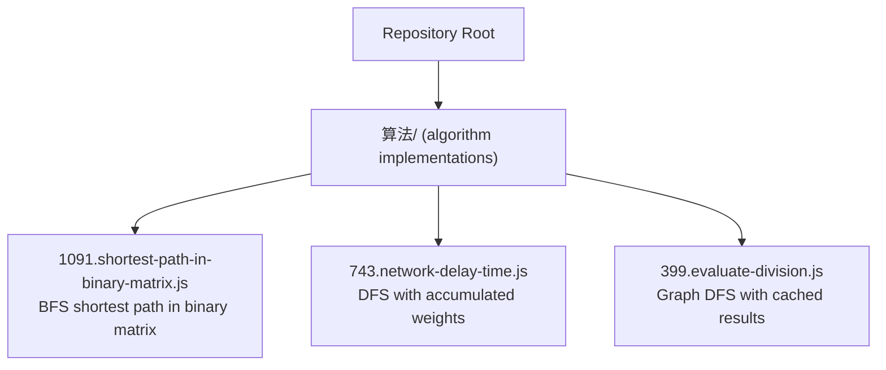
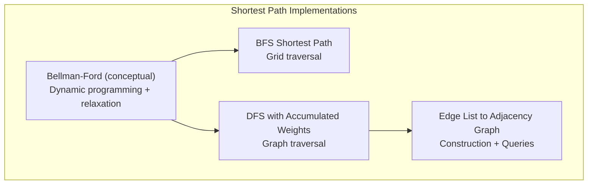
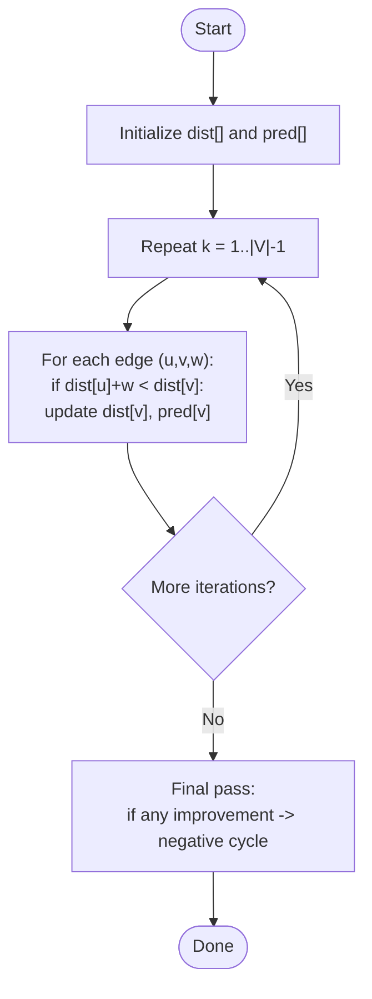
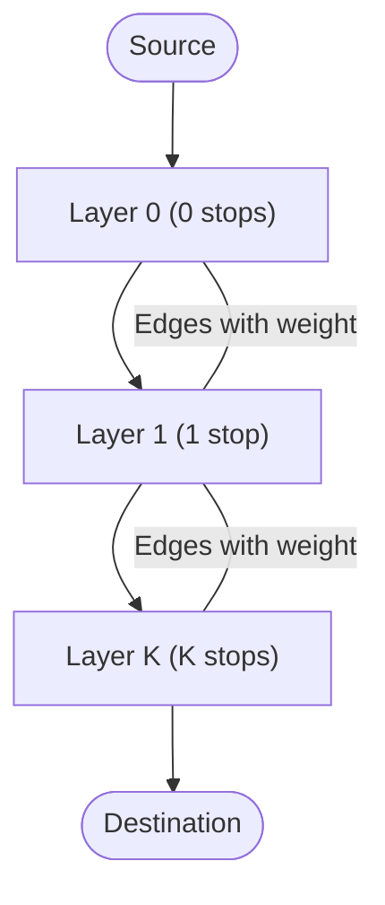
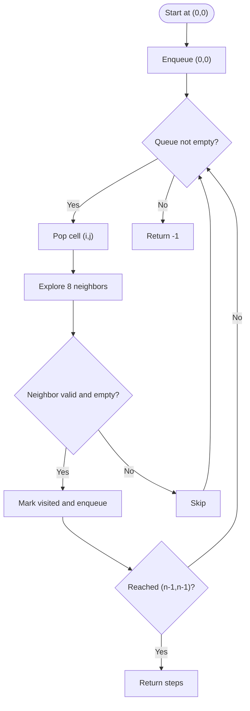
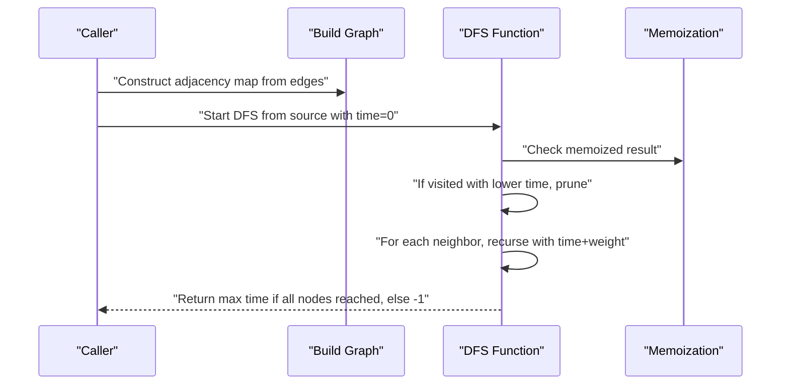
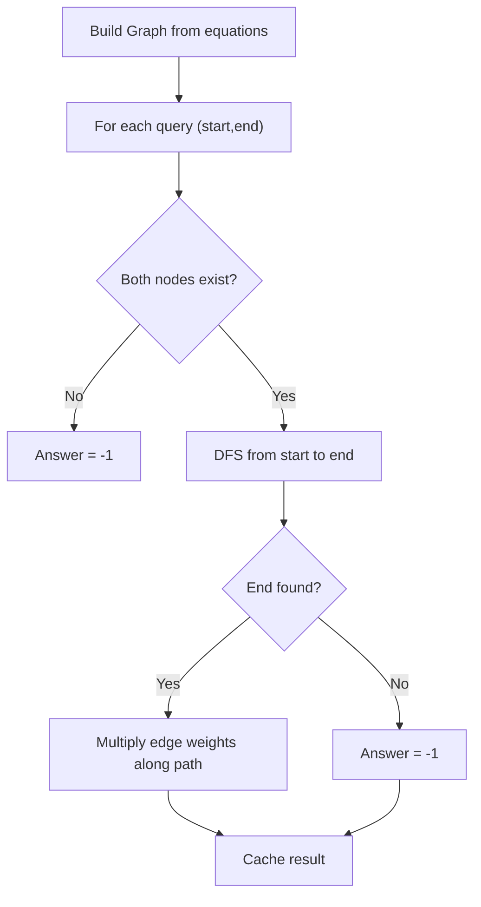
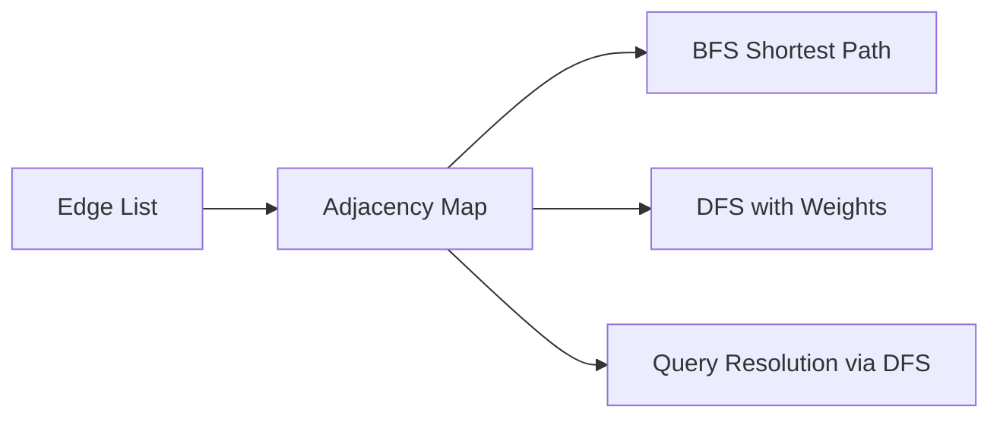

# Bellman-Ford Algorithm

<cite>
**Referenced Files in This Document**
- [1091.shortest-path-in-binary-matrix.js](file://算法/1091.shortest-path-in-binary-matrix.js)
- [743.network-delay-time.js](file://算法/743.network-delay-time.js)
- [399.evaluate-division.js](file://算法/399.evaluate-division.js)
</cite>

## Table of Contents
1. [Introduction](#introduction)
2. [Project Structure](#project-structure)
3. [Core Components](#core-components)
4. [Architecture Overview](#architecture-overview)
5. [Detailed Component Analysis](#detailed-component-analysis)
6. [Dependency Analysis](#dependency-analysis)
7. [Performance Considerations](#performance-considerations)
8. [Troubleshooting Guide](#troubleshooting-guide)
9. [Conclusion](#conclusion)

## Introduction
This document explains the Bellman-Ford algorithm for computing shortest paths in weighted directed graphs, including support for negative edge weights and detection of negative cycles. It covers the dynamic programming formulation, relaxation iterations, predecessor tracking, and negative cycle detection. Practical applications include financial arbitrage detection, shortest path routing with varying costs, and resource allocation problems. The document also provides a step-by-step walkthrough using a flight cost optimization scenario with limited stops and analyzes time/space complexity.

## Project Structure
The repository includes multiple algorithm implementations. While a dedicated Bellman-Ford implementation is not present, several shortest path and graph-related algorithms demonstrate related concepts such as BFS shortest paths, DFS traversal with accumulated weights, and graph construction from edge lists. These are useful for understanding the broader context of shortest path computation.

**Diagram sources**
- [1091.shortest-path-in-binary-matrix.js:1-81](file://算法/1091.shortest-path-in-binary-matrix.js#L1-L81)
- [743.network-delay-time.js:1-75](file://算法/743.network-delay-time.js#L1-L75)
- [399.evaluate-division.js:51-111](file://算法/399.evaluate-division.js#L51-L111)

**Section sources**
- [1091.shortest-path-in-binary-matrix.js:1-81](file://算法/1091.shortest-path-in-binary-matrix.js#L1-L81)
- [743.network-delay-time.js:1-75](file://算法/743.network-delay-time.js#L1-L75)
- [399.evaluate-division.js:51-111](file://算法/399.evaluate-division.js#L51-L111)

## Core Components
- Dynamic Programming Formulation
  - Bellman-Ford computes the shortest distances from a source vertex to all other vertices using repeated relaxation of edges.
  - After |V|-1 iterations, if further improvements are possible, a negative cycle exists.
- Relaxation Iterations
  - For each iteration k (1..|V|-1), update dist[v] if dist[u] + weight(u,v) < dist[v].
  - Predecessor array tracks the previous node on the shortest path for reconstruction.
- Negative Cycle Detection
  - Perform an additional pass after |V|-1 iterations; if any distance still improves, a negative cycle is reachable from the source.
- Complexity
  - Time: O(VE), Space: O(V) for distances and predecessors.

These concepts are foundational to the Bellman-Ford algorithm and inform the design choices in related shortest path implementations in the repository.

[No sources needed since this section provides conceptual background]

## Architecture Overview
The repository’s shortest path implementations illustrate complementary approaches:
- BFS-based shortest path in unweighted grids.
- DFS-based traversal accumulating weights with pruning.
- Graph construction from edge lists and query resolution via DFS with memoization.

[No sources needed since this diagram shows conceptual relationships]

## Detailed Component Analysis

### Bellman-Ford Algorithm Walkthrough
Step-by-step process:
1. Initialize distances: dist[source] = 0, others = +∞. Initialize predecessors to null.
2. Repeat |V|-1 times:
   - For each edge (u, v, w), relax if dist[u] + w < dist[v]. Update predecessor accordingly.
3. Final pass:
   - If any dist improves, report a negative cycle.
4. Reconstruct paths using predecessors.

[No sources needed since this diagram illustrates the algorithm conceptually]

### Flight Cost Optimization with Limited Stops
Problem: Given flights as weighted edges, compute minimum cost from src to dst with at most K stops.
Approach:
- Model as a layered graph or use a modified Bellman-Ford variant with bounded iterations.
- Alternatively, use a queue-based DP similar to the "shortest path with at most K edges" pattern.

[No sources needed since this diagram illustrates the conceptual model]

### Related Implementations in the Repository

#### BFS Shortest Path in Binary Matrix
- Uses BFS to find the shortest path in a binary matrix with 8-direction moves.
- Demonstrates breadth-first exploration and level-wise traversal.

**Diagram sources**
- [1091.shortest-path-in-binary-matrix.js:16-65](file://算法/1091.shortest-path-in-binary-matrix.js#L16-L65)

**Section sources**
- [1091.shortest-path-in-binary-matrix.js:16-65](file://算法/1091.shortest-path-in-binary-matrix.js#L16-L65)

#### DFS with Accumulated Weights
- Builds a directed graph from edge lists and performs DFS with accumulated weights.
- Prunes branches when a node is reached with a lower cumulative weight.

**Diagram sources**
- [743.network-delay-time.js:18-54](file://算法/743.network-delay-time.js#L18-L54)

**Section sources**
- [743.network-delay-time.js:18-54](file://算法/743.network-delay-time.js#L18-L54)

#### Graph DFS with Memoization and Queries
- Constructs a directed graph from equations and answers queries via DFS with memoization.
- Handles missing nodes and caches intermediate results.

**Diagram sources**
- [399.evaluate-division.js:51-91](file://算法/399.evaluate-division.js#L51-L91)

**Section sources**
- [399.evaluate-division.js:51-91](file://算法/399.evaluate-division.js#L51-L91)

## Dependency Analysis
- Graph Construction
  - Edge lists are transformed into adjacency maps for efficient traversal.
- Traversal Strategies
  - BFS explores level-wise for uniform edge weights.
  - DFS accumulates weights and prunes based on visited thresholds.
- Query Resolution
  - Memoization avoids recomputation during DFS queries.

[No sources needed since this diagram shows conceptual relationships]

## Performance Considerations
- Bellman-Ford
  - Time: O(VE). Suitable for sparse graphs; consider Johnson’s algorithm for dense graphs.
  - Space: O(V) for distance and predecessor arrays.
- BFS vs DFS
  - BFS is optimal for unweighted graphs; DFS with pruning is suitable for weighted graphs with early termination conditions.
- Practical Tips
  - Use adjacency lists for sparse graphs.
  - Track predecessors for path reconstruction.
  - Detect negative cycles to avoid infinite loops in optimization contexts.

[No sources needed since this section provides general guidance]

## Troubleshooting Guide
- Negative Cycle Detection
  - If distances still improve after |V|-1 iterations, a negative cycle exists. Investigate the cycle and adjust problem constraints.
- Path Reconstruction
  - Ensure predecessor array is updated during relaxation to correctly reconstruct paths.
- Floating-Point Precision
  - For fractional edge weights, consider scaling or using higher precision arithmetic to avoid rounding errors.
- Memory Usage
  - For large graphs, consider iterative deepening or bounded-Bellman-Ford variants to limit memory footprint.

[No sources needed since this section provides general guidance]

## Conclusion
Bellman-Ford provides a robust foundation for shortest path computation in graphs with negative edge weights and supports negative cycle detection. While the repository does not include a direct Bellman-Ford implementation, related algorithms demonstrate complementary traversal strategies (BFS, DFS) and graph construction techniques that align with Bellman-Ford’s preprocessing and relaxation phases. Applying the outlined dynamic programming formulation, relaxation iterations, and negative cycle detection enables effective solutions for flight cost optimization with limited stops and other shortest path problems.