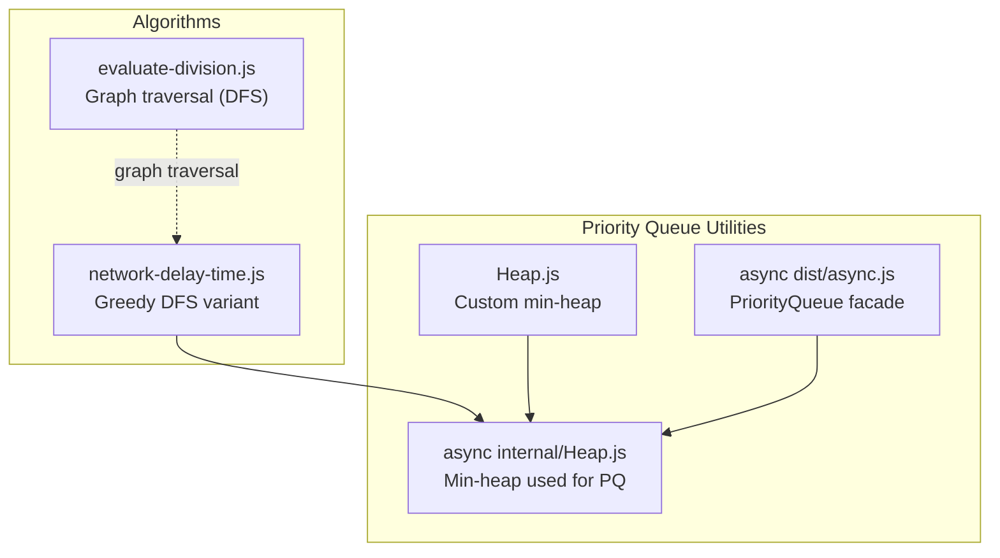
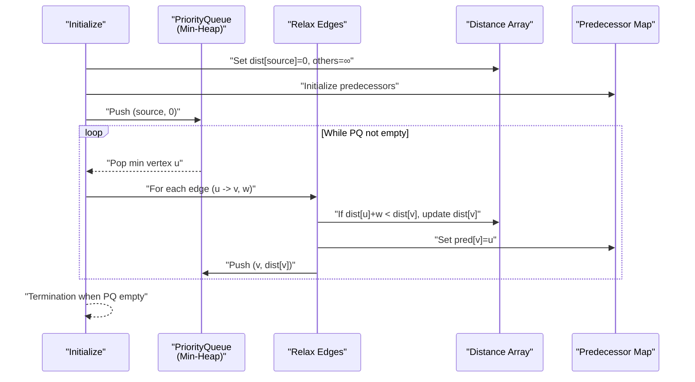
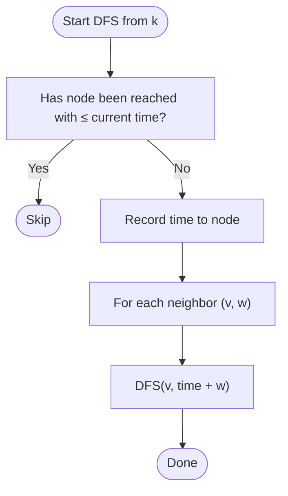
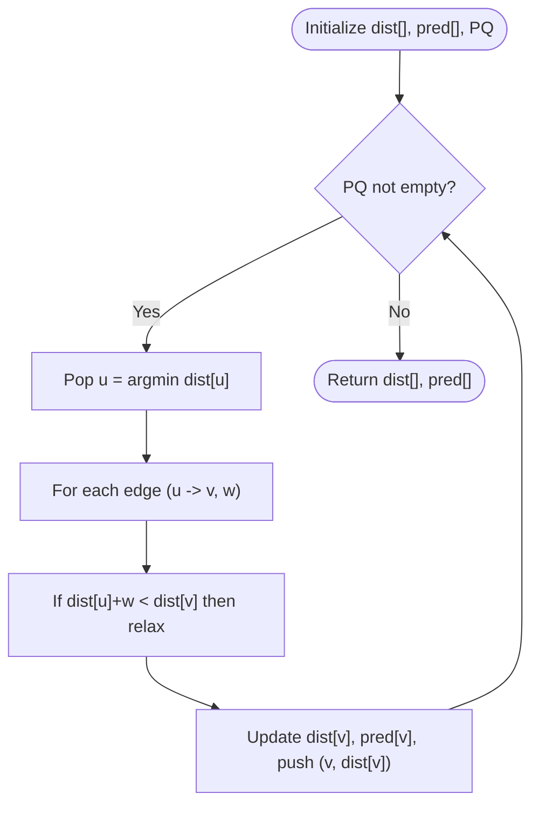
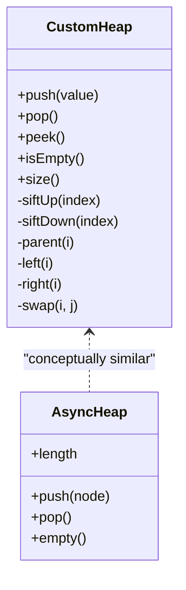
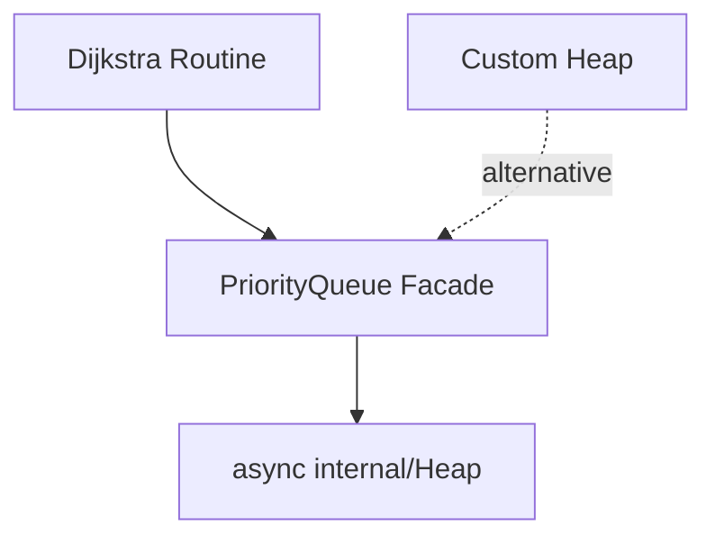

# Dijkstra's Algorithm

<cite>
**Referenced Files in This Document**
- [network-delay-time.js](file://算法/743.network-delay-time.js)
- [evaluate-division.js](file://算法/399.evaluate-division.js)
- [Heap.js](file://demo/学习JavaScript数据结构与算法/09.堆.js)
- [async Heap.js](file://demo/nuxt/demo_2/node_modules/async/internal/Heap.js)
- [async dist.js](file://demo/nuxt/demo_2/node_modules/async/dist/async.js)
</cite>

## Table of Contents
1. [Introduction](#introduction)
2. [Project Structure](#project-structure)
3. [Core Components](#core-components)
4. [Architecture Overview](#architecture-overview)
5. [Detailed Component Analysis](#detailed-component-analysis)
6. [Dependency Analysis](#dependency-analysis)
7. [Performance Considerations](#performance-considerations)
8. [Troubleshooting Guide](#troubleshooting-guide)
9. [Conclusion](#conclusion)
10. [Appendices](#appendices)

## Introduction
This document explains Dijkstra’s algorithm for computing shortest paths from a single source in graphs with non-negative edge weights. It covers the greedy selection principle, the role of a priority queue (min-heap), distance array updates, and visited/processed tracking. Practical problem analogies are drawn from network delay time and maximum probability path scenarios. Complexity analysis and real-world applications (network routing, GPS navigation, social network analysis) are included.

## Project Structure
The repository includes:
- A classic Dijkstra-style DFS-based solution variant for “Network Delay Time” that explores edges greedily without a priority queue.
- A generic single-source shortest path implementation embedded in a QR code utility library, demonstrating a priority queue and predecessor tracking.
- Multiple heap implementations (custom and library-backed) used as foundational data structures for efficient priority queue operations.

**Diagram sources**
- [network-delay-time.js:18-54](file://算法/743.network-delay-time.js#L18-L54)
- [evaluate-division.js:51-91](file://算法/399.evaluate-division.js#L51-L91)
- [Heap.js:12-149](file://demo/学习JavaScript数据结构与算法/09.堆.js#L12-L149)
- [async Heap.js:7-70](file://demo/nuxt/demo_2/node_modules/async/internal/Heap.js#L7-L70)
- [async dist.js:4020-4090](file://demo/nuxt/demo_2/node_modules/async/dist/async.js#L4020-L4090)

**Section sources**
- [network-delay-time.js:18-54](file://算法/743.network-delay-time.js#L18-L54)
- [evaluate-division.js:51-91](file://算法/399.evaluate-division.js#L51-L91)
- [Heap.js:12-149](file://demo/学习JavaScript数据结构与算法/09.堆.js#L12-L149)
- [async Heap.js:7-70](file://demo/nuxt/demo_2/node_modules/async/internal/Heap.js#L7-L70)
- [async dist.js:4020-4090](file://demo/nuxt/demo_2/node_modules/async/dist/async.js#L4020-L4090)

## Core Components
- Priority Queue (Min-Heap): Maintains vertices ordered by current shortest tentative distance. Efficient extract-min and decrease-key operations are essential for correctness and performance.
- Distance Array: Tracks the best-known distance from the source to each vertex. Entries are updated when a shorter path is discovered.
- Predecessor/Parent Map: Records the previous vertex on the shortest path, enabling path reconstruction after termination.
- Visited/Processed Set: Optional; often replaced by distance updates to avoid revisiting worse paths. In Dijkstra’s algorithm, vertices are processed once their optimal distance is finalized.

These components collectively implement the greedy strategy: always expand the frontier along the currently smallest tentative distance.

**Section sources**
- [async Heap.js:7-70](file://demo/nuxt/demo_2/node_modules/async/internal/Heap.js#L7-L70)
- [async dist.js:4020-4090](file://demo/nuxt/demo_2/node_modules/async/dist/async.js#L4020-L4090)

## Architecture Overview
The algorithm architecture centers on a priority queue driving exploration. The generic single-source shortest path routine demonstrates:
- Initialization of distances and predecessors
- Pushing the source with distance 0 into the priority queue
- Iteratively extracting the minimum-distance vertex and relaxing outgoing edges
- Updating distances and predecessors, pushing neighbors into the queue when improvements are found

**Diagram sources**
- [async dist.js:4020-4090](file://demo/nuxt/demo_2/node_modules/async/dist/async.js#L4020-L4090)

## Detailed Component Analysis

### Network Delay Time (Greedy DFS Variant)
Although labeled as “depth search,” the implementation here performs a greedy propagation of time estimates. It maintains a map of arrival times and only proceeds further if a strictly better time is found. While not a canonical Dijkstra with a priority queue, it reflects the same pruning principle: skip if already reached with equal or better cost.

Key observations:
- Graph representation: adjacency map keyed by nodes.
- Greedy propagation: recursively visit neighbors only when a better time is found.
- Termination condition: if all nodes are reachable, return the maximum of recorded times; otherwise return -1.

**Diagram sources**
- [network-delay-time.js:18-54](file://算法/743.network-delay-time.js#L18-L54)

**Section sources**
- [network-delay-time.js:18-54](file://算法/743.network-delay-time.js#L18-L54)

### Generic Single-Source Shortest Path (Priority Queue-Based)
The embedded implementation in the QR utility library demonstrates a canonical Dijkstra-like routine:
- Initialize distances and predecessors
- Use a priority queue to always process the nearest unvisited vertex
- Relax edges and update predecessors accordingly
- Optionally reconstruct the shortest path from predecessors

**Diagram sources**
- [async dist.js:4020-4090](file://demo/nuxt/demo_2/node_modules/async/dist/async.js#L4020-L4090)

**Section sources**
- [async dist.js:4020-4090](file://demo/nuxt/demo_2/node_modules/async/dist/async.js#L4020-L4090)

### Min-Heap Implementation Notes
Two heap implementations are available:
- A custom min-heap class with sift-up/sift-down operations suitable for building a priority queue.
- A min-heap used internally by the async library’s PriorityQueue.

These support O(log n) insert and extract-min operations, forming the backbone of Dijkstra’s runtime.

**Diagram sources**
- [Heap.js:12-149](file://demo/学习JavaScript数据结构与算法/09.堆.js#L12-L149)
- [async Heap.js:7-70](file://demo/nuxt/demo_2/node_modules/async/internal/Heap.js#L7-L70)

**Section sources**
- [Heap.js:12-149](file://demo/学习JavaScript数据结构与算法/09.堆.js#L12-L149)
- [async Heap.js:7-70](file://demo/nuxt/demo_2/node_modules/async/internal/Heap.js#L7-L70)

### Practical Problem Walkthroughs

#### Network Delay Time
- Goal: Determine the minimum time for a signal sent from node k to reach all nodes, or return -1 if unreachable.
- Approach: Greedy propagation of earliest known arrival times; prune if a previously recorded time is not worse.
- Complexity: Without a priority queue, worst-case resembles repeated scans; still useful for small graphs or when all edges are relaxed per iteration.

**Section sources**
- [network-delay-time.js:18-54](file://算法/743.network-delay-time.js#L18-L54)

#### Maximum Probability Path (Analogous to Shortest Path)
- Goal: Find the path that maximizes the product of probabilities along the route.
- Strategy: Negate logarithms to convert multiplication to addition, then apply Dijkstra with a min-heap. Alternatively, adapt the relaxation to maximize probabilities directly.
- This mirrors Dijkstra’s greedy selection of the next best vertex, now minimizing negative-log-probabilities.

[No sources needed since this section does not analyze specific files]

## Dependency Analysis
- The generic single-source shortest path routine depends on a priority queue implementation.
- The async library provides a PriorityQueue facade backed by a binary min-heap.
- Custom heap implementations can serve as alternatives or educational references.

**Diagram sources**
- [async dist.js:4020-4090](file://demo/nuxt/demo_2/node_modules/async/dist/async.js#L4020-L4090)
- [async Heap.js:7-70](file://demo/nuxt/demo_2/node_modules/async/internal/Heap.js#L7-L70)
- [Heap.js:12-149](file://demo/学习JavaScript数据结构与算法/09.堆.js#L12-L149)

**Section sources**
- [async dist.js:4020-4090](file://demo/nuxt/demo_2/node_modules/async/dist/async.js#L4020-L4090)
- [async Heap.js:7-70](file://demo/nuxt/demo_2/node_modules/async/internal/Heap.js#L7-L70)
- [Heap.js:12-149](file://demo/学习JavaScript数据结构与算法/09.堆.js#L12-L149)

## Performance Considerations
- Time complexity: O((V + E) log V) with a binary min-heap priority queue, where each vertex is extracted once and each edge may trigger a decrease-key operation.
- Space complexity: O(V + E) for graph storage plus O(V) for distance and predecessor arrays and the priority queue.

Optimization tips:
- Prefer a binary min-heap for PQ; Fibonacci heaps reduce asymptotic cost but add overhead.
- Use an adjacency list representation for sparse graphs.
- Avoid redundant pushes; only enqueue when a strictly better distance is found.

[No sources needed since this section provides general guidance]

## Troubleshooting Guide
Common pitfalls and remedies:
- Negative edge weights: Dijkstra assumes non-negative weights; use Bellman-Ford or Johnson for negative edges.
- Duplicate entries in PQ: If not handled carefully, multiple stale entries can bloat memory and slow down extraction; prefer updating existing entries or using a set to deduplicate.
- Incorrect relaxation order: Ensure relaxation occurs immediately upon discovery of a shorter path via the PQ.
- Reconstructing paths: Maintain a predecessor map to rebuild the shortest path after algorithm completion.

[No sources needed since this section provides general guidance]

## Conclusion
Dijkstra’s algorithm is a cornerstone for single-source shortest paths in non-negative weighted graphs. Its greedy selection guided by a priority queue yields optimal results efficiently. While the repository includes a greedy DFS variant for network delay time, the canonical Dijkstra relies on a min-heap–backed priority queue, distance arrays, and predecessor tracking. Understanding these components and their interactions is key to correct and efficient implementations.

[No sources needed since this section summarizes without analyzing specific files]

## Appendices

### Step-by-Step Algorithm Walkthrough (Generic Routine)
- Initialize distances to infinity except the source (distance 0), predecessors to null, and enqueue the source.
- While the queue is not empty:
  - Extract the vertex with the smallest distance.
  - For each neighbor, compute the new tentative distance via the current vertex.
  - If better than the recorded distance, update distance and predecessor, and enqueue the neighbor.
- Terminate when the queue is empty; distances and predecessors are ready for path reconstruction.

**Section sources**
- [async dist.js:4020-4090](file://demo/nuxt/demo_2/node_modules/async/dist/async.js#L4020-L4090)