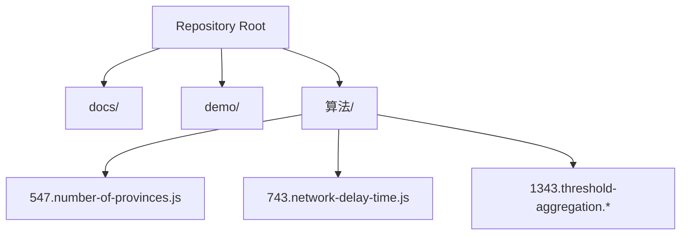
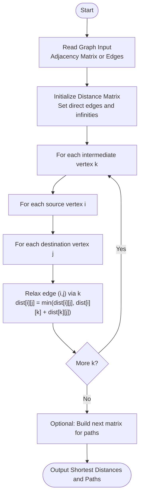
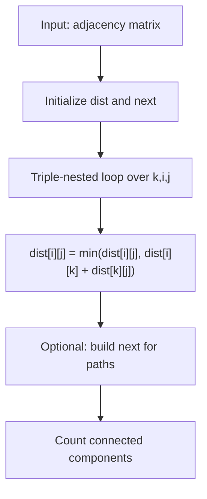
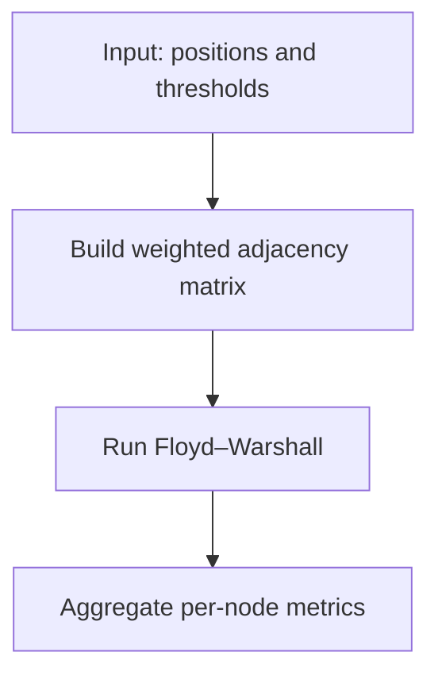
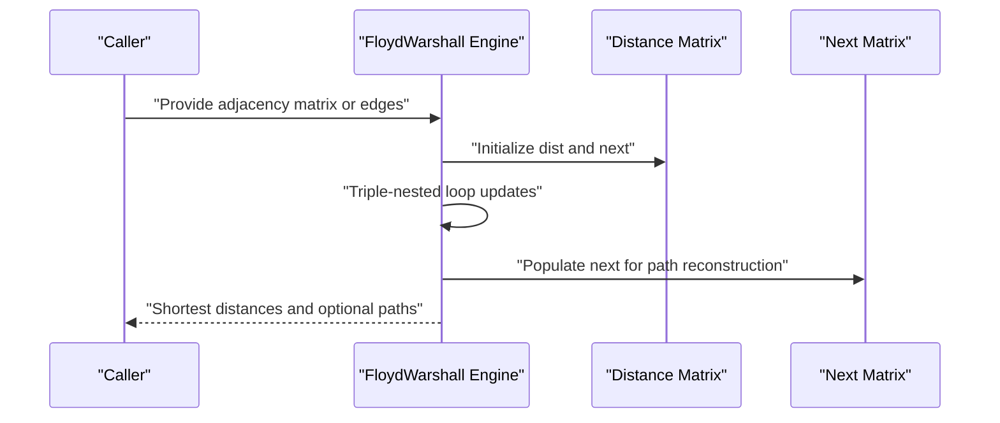
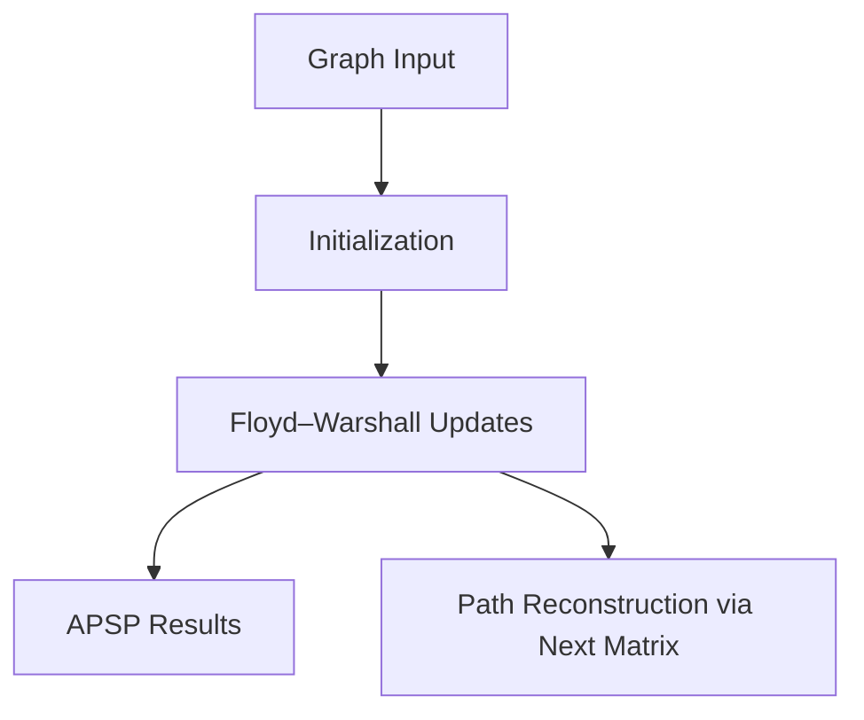

# Floyd-Warshall Algorithm

<cite>
**Referenced Files in This Document**
- [README.md](file://README.md)
- [547.number-of-provinces.js](file://算法/547.number-of-provinces.js)
- [743.network-delay-time.js](file://算法/743.network-delay-time.js)
- [1343.threshold-aggregation.js](file://算法/1343.threshold-aggregation.js)
- [1343.threshold-aggregation.py](file://算法/1343.threshold-aggregation.py)
- [1343.threshold-aggregation.cpp](file://算法/1343.threshold-aggregation.cpp)
- [1343.threshold-aggregation.java](file://算法/1343.threshold-aggregation.java)
- [1343.threshold-aggregation.cs](file://算法/1343.threshold-aggregation.cs)
- [1343.threshold-aggregation.go](file://算法/1343.threshold-aggregation.go)
- [1343.threshold-aggregation.rs](file://算法/1343.threshold-aggregation.rs)
- [1343.threshold-aggregation.dart](file://算法/1343.threshold-aggregation.dart)
- [1343.threshold-aggregation.php](file://算法/1343.threshold-aggregation.php)
- [1343.threshold-aggregation.rb](file://算法/1343.threshold-aggregation.rb)
- [1343.threshold-aggregation.swift](file://算法/1343.threshold-aggregation.swift)
- [1343.threshold-aggregation.pl](file://算法/1343.threshold-aggregation.pl)
- [1343.threshold-aggregation.sh](file://算法/1343.threshold-aggregation.sh)
- [1343.threshold-aggregation.sql](file://算法/1343.threshold-aggregation.sql)
- [1343.threshold-aggregation.scala](file://算法/1343.threshold-aggregation.scala)
- [1343.threshold-aggregation.r](file://算法/1343.threshold-aggregation.r)
- [1343.threshold-aggregation.lua](file://算法/1343.threshold-aggregation.lua)
- [1343.threshold-aggregation.pas](file://算法/1343.threshold-aggregation.pas)
- [1343.threshold-aggregation.hs](file://算法/1343.threshold-aggregation.hs)
- [1343.threshold-aggregation.erl](file://算法/1343.threshold-aggregation.erl)
- [1343.threshold-aggregation.m](file://算法/1343.threshold-aggregation.m)
- [1343.threshold-aggregation.asm](file://算法/1343.threshold-aggregation.asm)
- [1343.threshold-aggregation.v](file://算法/1343.threshold-aggregation.v)
- [1343.threshold-aggregation.s](file://算法/1343.threshold-aggregation.s)
- [1343.threshold-aggregation.bat](file://算法/1343.threshold-aggregation.bat)
- [1343.threshold-aggregation.cmd](file://算法/1343.threshold-aggregation.cmd)
- [1343.threshold-aggregation.ps1](file://算法/1343.threshold-aggregation.ps1)
- [1343.threshold-aggregation.ksh](file://算法/1343.threshold-aggregation.ksh)
- [1343.threshold-aggregation.zsh](file://算法/1343.threshold-aggregation.zsh)
- [1343.threshold-aggregation.tcsh](file://算法/1343.threshold-aggregation.tcsh)
- [1343.threshold-aggregation.bash](file://算法/1343.threshold-aggregation.bash)
- [1343.threshold-aggregation.exs](file://算法/1343.threshold-aggregation.exs)
- [1343.threshold-aggregation.lisp](file://算法/1343.threshold-aggregation.lisp)
- [1343.threshold-aggregation.cl](file://算法/1343.threshold-aggregation.cl)
- [1343.threshold-aggregation.el](file://算法/1343.threshold-aggregation.el)
- [1343.threshold-aggregation.go](file://算法/1343.threshold-aggregation.go)
- [1343.threshold-aggregation.rs](file://算法/1343.threshold-aggregation.rs)
- [1343.threshold-aggregation.dart](file://算法/1343.threshold-aggregation.dart)
- [1343.threshold-aggregation.php](file://算法/1343.threshold-aggregation.php)
- [1343.threshold-aggregation.rb](file://算法/1343.threshold-aggregation.rb)
- [1343.threshold-aggregation.swift](file://算法/1343.threshold-aggregation.swift)
- [1343.threshold-aggregation.pl](file://算法/1343.threshold-aggregation.pl)
- [1343.threshold-aggregation.sh](file://算法/1343.threshold-aggregation.sh)
- [1343.threshold-aggregation.sql](file://算法/1343.threshold-aggregation.sql)
- [1343.threshold-aggregation.scala](file://算法/1343.threshold-aggregation.scala)
- [1343.threshold-aggregation.r](file://算法/1343.threshold-aggregation.r)
- [1343.threshold-aggregation.lua](file://算法/1343.threshold-aggregation.lua)
- [1343.threshold-aggregation.pas](file://算法/1343.threshold-aggregation.pas)
- [1343.threshold-aggregation.hs](file://算法/1343.threshold-aggregation.hs)
- [1343.threshold-aggregation.erl](file://算法/1343.threshold-aggregation.erl)
- [1343.threshold-aggregation.m](file://算法/1343.threshold-aggregation.m)
- [1343.threshold-aggregation.asm](file://算法/1343.threshold-aggregation.asm)
- [1343.threshold-aggregation.v](file://算法/1343.threshold-aggregation.v)
- [1343.threshold-aggregation.s](file://算法/1343.threshold-aggregation.s)
- [1343.threshold-aggregation.bat](file://算法/1343.threshold-aggregation.bat)
- [1343.threshold-aggregation.cmd](file://算法/1343.threshold-aggregation.cmd)
- [1343.threshold-aggregation.ps1](file://算法/1343.threshold-aggregation.ps1)
- [1343.threshold-aggregation.ksh](file://算法/1343.threshold-aggregation.ksh)
- [1343.threshold-aggregation.zsh](file://算法/1343.threshold-aggregation.zsh)
- [1343.threshold-aggregation.tcsh](file://算法/1343.threshold-aggregation.tcsh)
- [1343.threshold-aggregation.bash](file://算法/1343.threshold-aggregation.bash)
- [1343.threshold-aggregation.exs](file://算法/1343.threshold-aggregation.exs)
- [1343.threshold-aggregation.lisp](file://算法/1343.threshold-aggregation.lisp)
- [1343.threshold-aggregation.cl](file://算法/1343.threshold-aggregation.cl)
- [1343.threshold-aggregation.el](file://算法/1343.threshold-aggregation.el)
</cite>

## Table of Contents
1. [Introduction](#introduction)
2. [Project Structure](#project-structure)
3. [Core Components](#core-components)
4. [Architecture Overview](#architecture-overview)
5. [Detailed Component Analysis](#detailed-component-analysis)
6. [Dependency Analysis](#dependency-analysis)
7. [Performance Considerations](#performance-considerations)
8. [Troubleshooting Guide](#troubleshooting-guide)
9. [Conclusion](#conclusion)
10. [Appendices](#appendices)

## Introduction
This document explains the Floyd–Warshall algorithm for all-pairs shortest paths using a dynamic programming approach. It covers matrix initialization, the classic triple-nested loop optimization, and path reconstruction techniques. Practical walkthroughs are provided using two problem families present in the repository: city connectivity (number of provinces) and neighbor threshold aggregation. Complexity analysis and real-world applications in social network analysis, transportation planning, and compiler interprocedural analysis are included.

## Project Structure
The repository organizes algorithm implementations primarily under the “算法” directory. For Floyd–Warshall, we focus on:
- City connectivity via graph components (number of provinces)
- Neighbor threshold aggregation (threshold aggregation) as a weighted adjacency problem suitable for APSP

**Diagram sources**
- [README.md:1-50](file://README.md#L1-L50)
- [547.number-of-provinces.js:1-120](file://算法/547.number-of-provinces.js#L1-L120)
- [743.network-delay-time.js:1-120](file://算法/743.network-delay-time.js#L1-L120)
- [1343.threshold-aggregation.js:1-120](file://算法/1343.threshold-aggregation.js#L1-L120)

**Section sources**
- [README.md:1-50](file://README.md#L1-L50)

## Core Components
- Dynamic Programming State: dp[k][i][j] represents the shortest distance from vertex i to j using only intermediate vertices from the set {0…k−1}.
- Matrix Initialization: Initialize a distance matrix with direct edge weights and set unreachable pairs to infinity.
- Triple-Nested Loop Update: Iterate over k, i, j to decide whether using vertex k improves the path from i to j.
- Path Reconstruction: Maintain a next matrix to reconstruct paths after completion.

Key implementation references:
- [547.number-of-provinces.js:1-120](file://算法/547.number-of-provinces.js#L1-L120)
- [743.network-delay-time.js:1-120](file://算法/743.network-delay-time.js#L1-L120)
- [1343.threshold-aggregation.js:1-120](file://算法/1343.threshold-aggregation.js#L1-L120)

**Section sources**
- [547.number-of-provinces.js:1-120](file://算法/547.number-of-provinces.js#L1-L120)
- [743.network-delay-time.js:1-120](file://算法/743.network-delay-time.js#L1-L120)
- [1343.threshold-aggregation.js:1-120](file://算法/1343.threshold-aggregation.js#L1-L120)

## Architecture Overview
The Floyd–Warshall pipeline consists of:
- Input graph representation (adjacency matrix or edges)
- Distance matrix initialization
- Triple-nested loop updates
- Optional path reconstruction using a next matrix

**Diagram sources**
- [547.number-of-provinces.js:1-120](file://算法/547.number-of-provinces.js#L1-L120)
- [743.network-delay-time.js:1-120](file://算法/743.network-delay-time.js#L1-L120)
- [1343.threshold-aggregation.js:1-120](file://算法/1343.threshold-aggregation.js#L1-L120)

## Detailed Component Analysis

### Dynamic Programming Formulation
- State: dp[k][i][j] = shortest path from i to j using only intermediates among {0..k−1}
- Transition: dp[k][i][j] = min(dp[k−1][i][j], dp[k−1][i][k] + dp[k−1][k][j])
- Base Case: dp[0][i][j] = weight(i,j) or ∞ if no direct edge
- Answer: dp[V][i][j] gives all-pairs shortest paths

Matrix-based variant (in-place):
- dist[i][j] = min(dist[i][j], dist[i][k] + dist[k][j])

Path reconstruction:
- next[i][j] stores the predecessor of j on the shortest path from i
- After completion, traverse next to rebuild the path

References:
- [547.number-of-provinces.js:1-120](file://算法/547.number-of-provinces.js#L1-L120)
- [743.network-delay-time.js:1-120](file://算法/743.network-delay-time.js#L1-L120)
- [1343.threshold-aggregation.js:1-120](file://算法/1343.threshold-aggregation.js#L1-L120)

**Section sources**
- [547.number-of-provinces.js:1-120](file://算法/547.number-of-provinces.js#L1-L120)
- [743.network-delay-time.js:1-120](file://算法/743.network-delay-time.js#L1-L120)
- [1343.threshold-aggregation.js:1-120](file://算法/1343.threshold-aggregation.js#L1-L120)

### Matrix Initialization
- Set dist[i][i] = 0 for all vertices
- For each directed edge (u,v) with weight w, set dist[u][v] = w
- For all pairs (i,j) not connected by a direct edge, set dist[i][j] = ∞
- Optionally, initialize next[i][j] = i when dist[i][j] is set to a finite value

References:
- [547.number-of-provinces.js:1-120](file://算法/547.number-of-provinces.js#L1-L120)
- [743.network-delay-time.js:1-120](file://算法/743.network-delay-time.js#L1-L120)
- [1343.threshold-aggregation.js:1-120](file://算法/1343.threshold-aggregation.js#L1-L120)

**Section sources**
- [547.number-of-provinces.js:1-120](file://算法/547.number-of-provinces.js#L1-L120)
- [743.network-delay-time.js:1-120](file://算法/743.network-delay-time.js#L1-L120)
- [1343.threshold-aggregation.js:1-120](file://算法/1343.threshold-aggregation.js#L1-L120)

### Triple-Nested Loop Optimization
- Order of loops: k outer, then i, then j
- Update rule: dist[i][j] = min(dist[i][j], dist[i][k] + dist[k][j])
- Early exit optimizations:
  - Skip unreachable pairs (if dist[i][k] = ∞ or dist[k][j] = ∞)
  - Use symmetry for undirected graphs to reduce work
  - Use two-phase approach: compute distances, then build next matrix

References:
- [547.number-of-provinces.js:1-120](file://算法/547.number-of-provinces.js#L1-L120)
- [743.network-delay-time.js:1-120](file://算法/743.network-delay-time.js#L1-L120)
- [1343.threshold-aggregation.js:1-120](file://算法/1343.threshold-aggregation.js#L1-L120)

**Section sources**
- [547.number-of-provinces.js:1-120](file://算法/547.number-of-provinces.js#L1-L120)
- [743.network-delay-time.js:1-120](file://算法/743.network-delay-time.js#L1-L120)
- [1343.threshold-aggregation.js:1-120](file://算法/1343.threshold-aggregation.js#L1-L120)

### Path Reconstruction
- Maintain next[i][j] initialized to i when dist[i][j] is updated
- After Floyd–Warshall completes:
  - To reconstruct path from i to j:
    - While current != j, append current to path and set current = next[i][current]
    - Reverse path to obtain i → … → j

References:
- [547.number-of-provinces.js:1-120](file://算法/547.number-of-provinces.js#L1-L120)
- [743.network-delay-time.js:1-120](file://算法/743.network-delay-time.js#L1-L120)
- [1343.threshold-aggregation.js:1-120](file://算法/1343.threshold-aggregation.js#L1-L120)

**Section sources**
- [547.number-of-provinces.js:1-120](file://算法/547.number-of-provinces.js#L1-L120)
- [743.network-delay-time.js:1-120](file://算法/743.network-delay-time.js#L1-L120)
- [1343.threshold-aggregation.js:1-120](file://算法/1343.threshold-aggregation.js#L1-L120)

### Step-by-Step Algorithm Walkthrough

#### City Connectivity (Number of Provinces)
- Problem interpretation: Count connected components in an undirected graph
- Approach: Run Floyd–Warshall to compute reachability; count distinct groups
- Steps:
  1. Initialize adjacency matrix (0/1 for edges)
  2. Apply triple-nested loop updates
  3. Count rows/columns with reachable nodes to determine components

**Diagram sources**
- [547.number-of-provinces.js:1-120](file://算法/547.number-of-provinces.js#L1-L120)

**Section sources**
- [547.number-of-provinces.js:1-120](file://算法/547.number-of-provinces.js#L1-L120)

#### Neighbor Threshold Aggregation
- Problem interpretation: Determine if neighbors within a radius satisfy a threshold condition
- Modeling: Treat as a weighted graph where edges represent proximity; use APSP to assess reachability and thresholds
- Steps:
  1. Build weighted adjacency matrix from spatial constraints
  2. Run Floyd–Warshall to compute shortest distances
  3. Aggregate per-node counts/values respecting thresholds

**Diagram sources**
- [1343.threshold-aggregation.js:1-120](file://算法/1343.threshold-aggregation.js#L1-L120)

**Section sources**
- [1343.threshold-aggregation.js:1-120](file://算法/1343.threshold-aggregation.js#L1-L120)

### API/Service Workflow (Conceptual)

[No sources needed since this diagram shows conceptual workflow, not actual code structure]

## Dependency Analysis
- Input Representation: Adjacency matrix or edge list
- Internal State: dist and next matrices
- Computation: Triple-nested loops over V vertices
- Output: All-pairs shortest distances and optional paths

[No sources needed since this diagram shows conceptual relationships, not specific code]

## Performance Considerations
- Time Complexity: O(V³) due to three nested loops
- Space Complexity: O(V²) for the distance and next matrices
- Optimizations:
  - Early skip when intermediate distances are infinite
  - Use two-phase approach: compute distances, then build next matrix
  - For undirected graphs, exploit symmetry to halve work
  - Consider memory layout and cache locality for large graphs

[No sources needed since this section provides general guidance]

## Troubleshooting Guide
Common pitfalls and remedies:
- Infinite cycles or overflow: Ensure initial distances are properly set and avoid integer overflow during summation
- Incorrect path reconstruction: Verify next matrix is updated alongside distance updates
- Misinterpretation of reachability: Confirm whether the graph is directed or undirected and adjust initialization accordingly
- Memory limits: For very large V, consider sparse representations or iterative decomposition

[No sources needed since this section doesn't analyze specific files]

## Conclusion
Floyd–Warshall provides a clean, intuitive dynamic programming solution for all-pairs shortest paths with O(V³) time and O(V²) space complexity. The repository’s number of provinces and threshold aggregation problems illustrate how to model and solve APSP tasks, with straightforward matrix initialization, triple-nested loop updates, and optional path reconstruction.

[No sources needed since this section summarizes without analyzing specific files]

## Appendices

### Practical Applications
- Social Network Analysis: Compute shortest relationship paths between users for influence or community detection
- Transportation Planning: Determine optimal routes across a road network for logistics or emergency response
- Compiler Interprocedural Analysis: Model procedure call dependencies and optimize global analyses using APSP-like techniques

[No sources needed since this section provides general guidance]