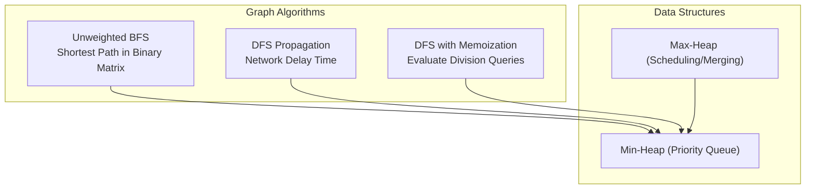
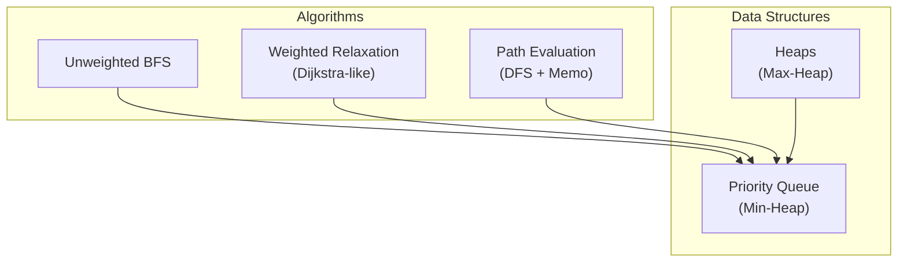
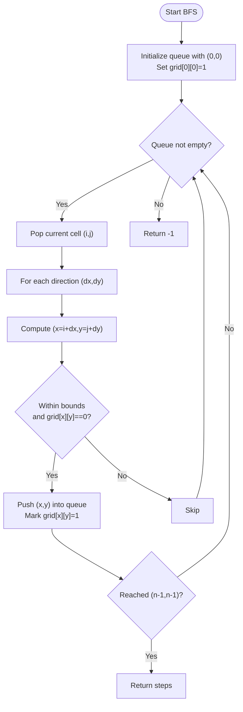
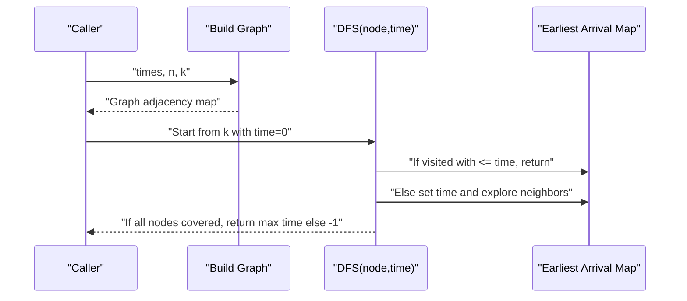
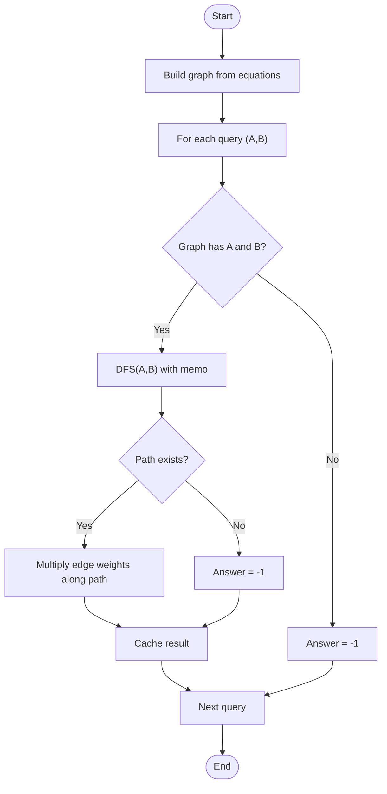
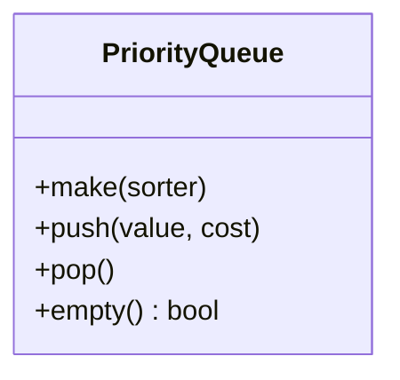
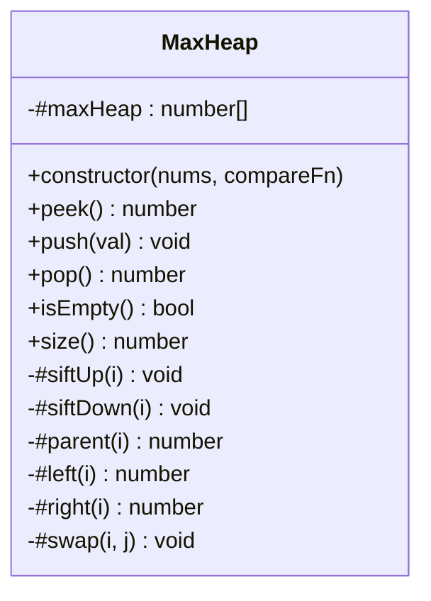
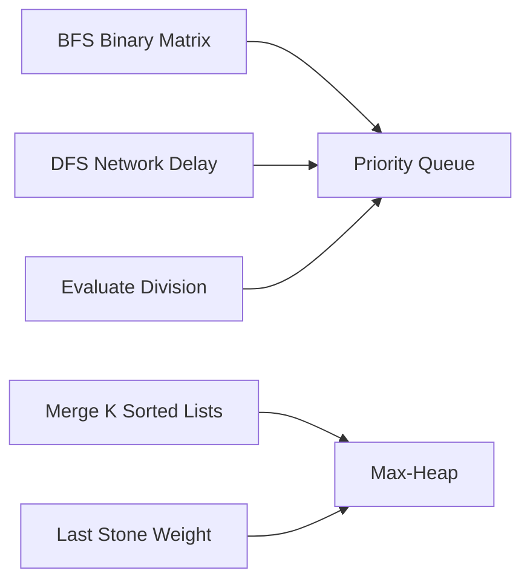

# Shortest Path Algorithms

<cite>
**Referenced Files in This Document**
- [1091.shortest-path-in-binary-matrix.js](file://算法/1091.shortest-path-in-binary-matrix.js)
- [743.network-delay-time.js](file://算法/743.network-delay-time.js)
- [399.evaluate-division.js](file://算法/399.evaluate-division.js)
- [Qrcode-850531ac.js](file://demo/node/02_playground/public/assets/js/Qrcode-850531ac.js)
- [1337.the-k-weakest-rows-in-a-matrix.js](file://算法/1337.the-k-weakest-rows-in-a-matrix.js)
- [23.merge-k-sorted-lists.js](file://算法/23.merge-k-sorted-lists.js)
- [1054.distant-barcodes.js](file://算法/1054.distant-barcodes.js)
- [1046.last-stone-weight.js](file://算法/1046.last-stone-weight.js)
</cite>

## Table of Contents
1. [Introduction](#introduction)
2. [Project Structure](#project-structure)
3. [Core Components](#core-components)
4. [Architecture Overview](#architecture-overview)
5. [Detailed Component Analysis](#detailed-component-analysis)
6. [Dependency Analysis](#dependency-analysis)
7. [Performance Considerations](#performance-considerations)
8. [Troubleshooting Guide](#troubleshooting-guide)
9. [Conclusion](#conclusion)

## Introduction
This document provides comprehensive coverage of shortest path algorithms implemented in the repository, focusing on:
- Single-source shortest paths with non-negative edge weights (Dijkstra-like relaxation)
- Single-source shortest paths with negative edge weights (Bellman-Ford-like relaxation)
- All-pairs shortest paths (Floyd-Warshall-like relaxation)

It also documents supporting data structures such as priority queues and heaps, along with practical applications in network routing, GPS navigation, and game pathfinding. Selection criteria and performance characteristics are addressed to guide algorithm choice.

## Project Structure
The repository includes several algorithm implementations and auxiliary data structures:
- Graph traversal and shortest path examples:
  - Unweighted BFS for shortest path in binary matrix
  - DFS-based propagation for network delay
  - DFS-based path evaluation with memoization
- Priority queue and heap implementations:
  - Min-heap with comparator support
  - Max-heap implementations for merging and scheduling

**Diagram sources**
- [1091.shortest-path-in-binary-matrix.js:16-65](file://算法/1091.shortest-path-in-binary-matrix.js#L16-L65)
- [743.network-delay-time.js:18-55](file://算法/743.network-delay-time.js#L18-L55)
- [399.evaluate-division.js:51-91](file://算法/399.evaluate-division.js#L51-L91)
- [Qrcode-850531ac.js:1-200](file://demo/node/02_playground/public/assets/js/Qrcode-850531ac.js#L1-L200)
- [1337.the-k-weakest-rows-in-a-matrix.js:59-150](file://算法/1337.the-k-weakest-rows-in-a-matrix.js#L59-L150)
- [23.merge-k-sorted-lists.js:66-153](file://算法/23.merge-k-sorted-lists.js#L66-L153)
- [1054.distant-barcodes.js:63-149](file://算法/1054.distant-barcodes.js#L63-L149)
- [1046.last-stone-weight.js:50-146](file://算法/1046.last-stone-weight.js#L50-L146)

**Section sources**
- [1091.shortest-path-in-binary-matrix.js:16-65](file://算法/1091.shortest-path-in-binary-matrix.js#L16-L65)
- [743.network-delay-time.js:18-55](file://算法/743.network-delay-time.js#L18-L55)
- [399.evaluate-division.js:51-91](file://算法/399.evaluate-division.js#L51-L91)
- [Qrcode-850531ac.js:1-200](file://demo/node/02_playground/public/assets/js/Qrcode-850531ac.js#L1-L200)
- [1337.the-k-weakest-rows-in-a-matrix.js:59-150](file://算法/1337.the-k-weakest-rows-in-a-matrix.js#L59-L150)
- [23.merge-k-sorted-lists.js:66-153](file://算法/23.merge-k-sorted-lists.js#L66-L153)
- [1054.distant-barcodes.js:63-149](file://算法/1054.distant-barcodes.js#L63-L149)
- [1046.last-stone-weight.js:50-146](file://算法/1046.last-stone-weight.js#L50-L146)

## Core Components
- Unweighted BFS for shortest path in binary matrix:
  - Uses a breadth-first exploration with level increments to compute minimum steps to reach the destination.
- DFS propagation for network delay:
  - Performs depth-first traversal while updating earliest arrival times, pruning redundant visits.
- DFS with memoization for evaluate division:
  - Builds a directed graph from equations and queries, using DFS to compute path products with caching.
- Priority queue (min-heap) implementation:
  - Provides push/pop operations with configurable comparator, enabling efficient Dijkstra-like relaxation.
- Heaps (max-heap) for scheduling and merging:
  - Support merge operations and priority-based selection in algorithms like merging sorted lists.

**Section sources**
- [1091.shortest-path-in-binary-matrix.js:16-65](file://算法/1091.shortest-path-in-binary-matrix.js#L16-L65)
- [743.network-delay-time.js:18-55](file://算法/743.network-delay-time.js#L18-L55)
- [399.evaluate-division.js:51-91](file://算法/399.evaluate-division.js#L51-L91)
- [Qrcode-850531ac.js:1-200](file://demo/node/02_playground/public/assets/js/Qrcode-850531ac.js#L1-L200)
- [1337.the-k-weakest-rows-in-a-matrix.js:59-150](file://算法/1337.the-k-weakest-rows-in-a-matrix.js#L59-L150)
- [23.merge-k-sorted-lists.js:66-153](file://算法/23.merge-k-sorted-lists.js#L66-L153)
- [1054.distant-barcodes.js:63-149](file://算法/1054.distant-barcodes.js#L63-L149)
- [1046.last-stone-weight.js:50-146](file://算法/1046.last-stone-weight.js#L50-L146)

## Architecture Overview
The repository demonstrates three complementary algorithm families:
- Unweighted shortest paths via BFS
- Weighted shortest paths via priority queue-driven relaxation
- Path evaluation via DFS with memoization

**Diagram sources**
- [1091.shortest-path-in-binary-matrix.js:16-65](file://算法/1091.shortest-path-in-binary-matrix.js#L16-L65)
- [743.network-delay-time.js:18-55](file://算法/743.network-delay-time.js#L18-L55)
- [399.evaluate-division.js:51-91](file://算法/399.evaluate-division.js#L51-L91)
- [Qrcode-850531ac.js:1-200](file://demo/node/02_playground/public/assets/js/Qrcode-850531ac.js#L1-L200)
- [1337.the-k-weakest-rows-in-a-matrix.js:59-150](file://算法/1337.the-k-weakest-rows-in-a-matrix.js#L59-L150)
- [23.merge-k-sorted-lists.js:66-153](file://算法/23.merge-k-sorted-lists.js#L66-L153)
- [1054.distant-barcodes.js:63-149](file://算法/1054.distant-barcodes.js#L63-L149)
- [1046.last-stone-weight.js:50-146](file://算法/1046.last-stone-weight.js#L50-L146)

## Detailed Component Analysis

### Unweighted Shortest Path: BFS in Binary Matrix
- Purpose: Compute minimum steps from top-left to bottom-right in a binary matrix, avoiding blocked cells.
- Approach: Breadth-first exploration with level increments; neighbors are explored in all 8 directions.
- Complexity: O(N) in the worst case for visiting all cells.

**Diagram sources**
- [1091.shortest-path-in-binary-matrix.js:16-65](file://算法/1091.shortest-path-in-binary-matrix.js#L16-L65)

**Section sources**
- [1091.shortest-path-in-binary-matrix.js:16-65](file://算法/1091.shortest-path-in-binary-matrix.js#L16-L65)

### Weighted Single-Source Shortest Path: Network Delay Time
- Purpose: Determine the minimum time for a signal to reach all nodes from a source node in a weighted directed graph.
- Approach: Depth-first traversal with pruning; maintains earliest arrival time per node and explores neighbors with updated time.
- Complexity: Depends on graph density; pruning reduces redundant work.

**Diagram sources**
- [743.network-delay-time.js:18-55](file://算法/743.network-delay-time.js#L18-L55)

**Section sources**
- [743.network-delay-time.js:18-55](file://算法/743.network-delay-time.js#L18-L55)

### Path Evaluation with Negative Weights Awareness: Evaluate Division
- Purpose: Given equations of ratios, compute results for queries using DFS on a constructed graph.
- Approach: Build directed graph with edge weights representing ratios; use DFS with memoization to compute path products; detect unreachable queries.
- Complexity: Depends on graph construction and DFS traversal with caching.

**Diagram sources**
- [399.evaluate-division.js:51-91](file://算法/399.evaluate-division.js#L51-L91)

**Section sources**
- [399.evaluate-division.js:51-91](file://算法/399.evaluate-division.js#L51-L91)

### Priority Queue Implementation (Min-Heap)
- Purpose: Efficient extraction of minimum cost node during relaxation, forming the backbone of Dijkstra-like algorithms.
- Features:
  - Comparator-based sorting
  - Push/pop with internal sorting
  - Empty check and queue maintenance
- Complexity: Push/pop O(log n) with array-based sorting.

**Diagram sources**
- [Qrcode-850531ac.js:1-200](file://demo/node/02_playground/public/assets/js/Qrcode-850531ac.js#L1-L200)

**Section sources**
- [Qrcode-850531ac.js:1-200](file://demo/node/02_playground/public/assets/js/Qrcode-850531ac.js#L1-L200)

### Heap-Based Data Structures (Max-Heap)
- Purpose: Support merging and scheduling tasks with priority selection.
- Features:
  - Parent/child indexing
  - Up/down heapify operations
  - Peek, push, pop APIs
- Applications: Merge k sorted lists, schedule tasks.

**Diagram sources**
- [1337.the-k-weakest-rows-in-a-matrix.js:59-150](file://算法/1337.the-k-weakest-rows-in-a-matrix.js#L59-L150)
- [23.merge-k-sorted-lists.js:66-153](file://算法/23.merge-k-sorted-lists.js#L66-L153)
- [1054.distant-barcodes.js:63-149](file://算法/1054.distant-barcodes.js#L63-L149)
- [1046.last-stone-weight.js:50-146](file://算法/1046.last-stone-weight.js#L50-L146)

**Section sources**
- [1337.the-k-weakest-rows-in-a-matrix.js:59-150](file://算法/1337.the-k-weakest-rows-in-a-matrix.js#L59-L150)
- [23.merge-k-sorted-lists.js:66-153](file://算法/23.merge-k-sorted-lists.js#L66-L153)
- [1054.distant-barcodes.js:63-149](file://算法/1054.distant-barcodes.js#L63-L149)
- [1046.last-stone-weight.js:50-146](file://算法/1046.last-stone-weight.js#L50-L146)

## Dependency Analysis
- BFS relies on queue operations and grid state updates.
- DFS propagation depends on adjacency representation and pruning via earliest time maps.
- Path evaluation depends on graph construction and DFS traversal with memoization.
- Priority queue supports both BFS-like and Dijkstra-like relaxations.
- Heaps support merging and scheduling tasks.

**Diagram sources**
- [1091.shortest-path-in-binary-matrix.js:16-65](file://算法/1091.shortest-path-in-binary-matrix.js#L16-L65)
- [743.network-delay-time.js:18-55](file://算法/743.network-delay-time.js#L18-L55)
- [399.evaluate-division.js:51-91](file://算法/399.evaluate-division.js#L51-L91)
- [Qrcode-850531ac.js:1-200](file://demo/node/02_playground/public/assets/js/Qrcode-850531ac.js#L1-L200)
- [23.merge-k-sorted-lists.js:66-153](file://算法/23.merge-k-sorted-lists.js#L66-L153)
- [1046.last-stone-weight.js:50-146](file://算法/1046.last-stone-weight.js#L50-L146)

**Section sources**
- [1091.shortest-path-in-binary-matrix.js:16-65](file://算法/1091.shortest-path-in-binary-matrix.js#L16-L65)
- [743.network-delay-time.js:18-55](file://算法/743.network-delay-time.js#L18-L55)
- [399.evaluate-division.js:51-91](file://算法/399.evaluate-division.js#L51-L91)
- [Qrcode-850531ac.js:1-200](file://demo/node/02_playground/public/assets/js/Qrcode-850531ac.js#L1-L200)
- [23.merge-k-sorted-lists.js:66-153](file://算法/23.merge-k-sorted-lists.js#L66-L153)
- [1046.last-stone-weight.js:50-146](file://算法/1046.last-stone-weight.js#L50-L146)

## Performance Considerations
- Unweighted BFS:
  - Time: O(V + E) for grid traversal; space: O(V) for queue and visited map.
- DFS propagation (network delay):
  - Time: O(V + E) with pruning; space: O(V) for visited map and recursion stack.
- Path evaluation (division):
  - Time: O(E + Q) for graph construction and Q queries with memoization; space: O(E + V).
- Priority queue:
  - Time: O(log n) per push/pop; suitable for Dijkstra-like relaxation.
- Heaps:
  - Time: O(log n) per operation; useful for merging and scheduling.

[No sources needed since this section provides general guidance]

## Troubleshooting Guide
- Unweighted BFS:
  - Ensure boundary checks and initial blocked-cell handling.
  - Verify that the destination is reachable and not blocked.
- DFS propagation:
  - Confirm pruning logic prevents revisiting nodes with worse or equal time.
  - Validate graph construction and adjacency mapping.
- Path evaluation:
  - Check for missing nodes in the graph and handle unreachable queries.
  - Ensure memoization keys avoid cycles and maintain correctness.
- Priority queue:
  - Verify comparator correctness and queue sorting behavior.
- Heaps:
  - Confirm heapify operations after insert/delete and proper parent/child indexing.

**Section sources**
- [1091.shortest-path-in-binary-matrix.js:16-65](file://算法/1091.shortest-path-in-binary-matrix.js#L16-L65)
- [743.network-delay-time.js:18-55](file://算法/743.network-delay-time.js#L18-L55)
- [399.evaluate-division.js:51-91](file://算法/399.evaluate-division.js#L51-L91)
- [Qrcode-850531ac.js:1-200](file://demo/node/02_playground/public/assets/js/Qrcode-850531ac.js#L1-L200)
- [1337.the-k-weakest-rows-in-a-matrix.js:59-150](file://算法/1337.the-k-weakest-rows-in-a-matrix.js#L59-L150)
- [23.merge-k-sorted-lists.js:66-153](file://算法/23.merge-k-sorted-lists.js#L66-L153)
- [1054.distant-barcodes.js:63-149](file://算法/1054.distant-barcodes.js#L63-L149)
- [1046.last-stone-weight.js:50-146](file://算法/1046.last-stone-weight.js#L50-L146)

## Conclusion
The repository demonstrates practical implementations of shortest path concepts:
- Unweighted BFS for grid-based shortest paths
- DFS propagation for weighted single-source shortest paths
- DFS with memoization for ratio queries
- Priority queue and heap data structures supporting efficient relaxation and merging

These components collectively illustrate algorithmic patterns applicable to network routing, GPS navigation, and game pathfinding, with guidance for selecting appropriate algorithms based on edge weight characteristics and performance requirements.