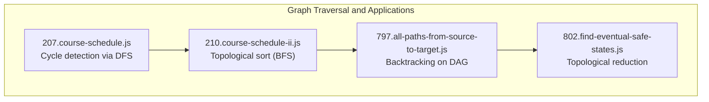
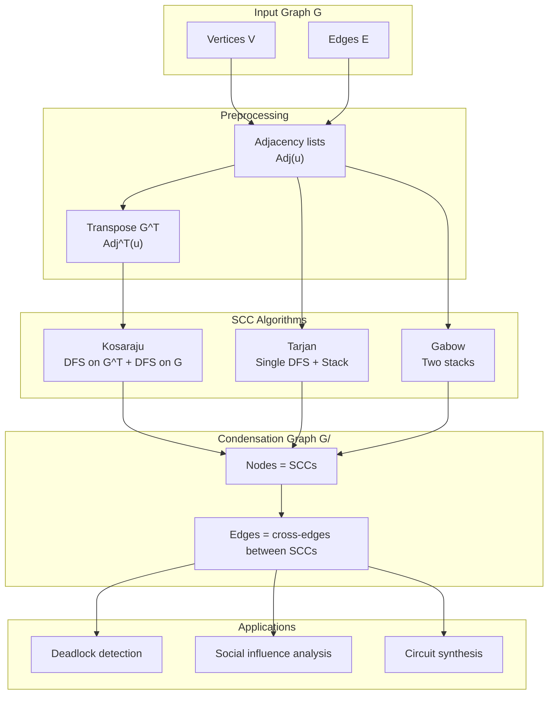
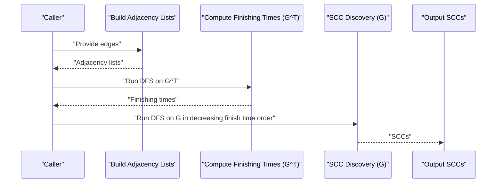
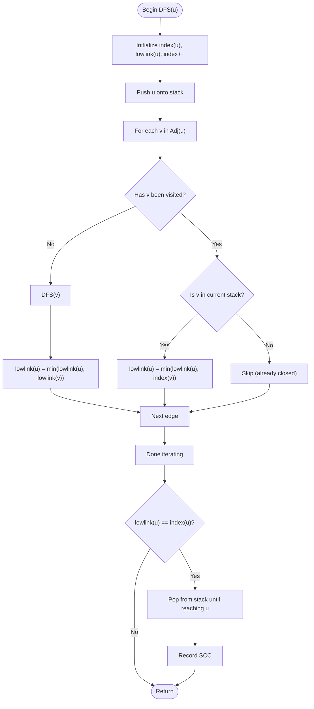
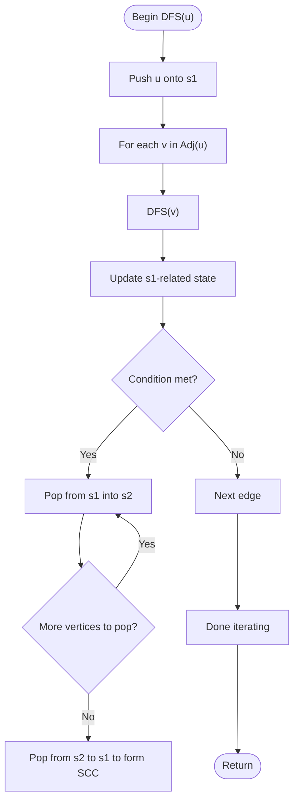
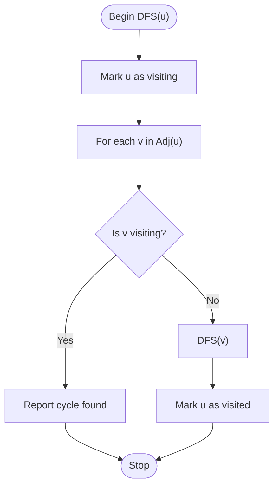
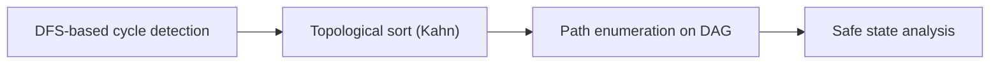

# Strongly Connected Components

<cite>
**Referenced Files in This Document**
- [207.course-schedule.js](file://算法/207.course-schedule.js)
- [210.course-schedule-ii.js](file://算法/210.course-schedule-ii.js)
- [797.all-paths-from-source-to-target.js](file://算法/797.all-paths-from-source-to-target.js)
- [802.find-eventual-safe-states.js](file://算法/802.find-eventual-safe-states.js)
</cite>

## Table of Contents
1. [Introduction](#introduction)
2. [Project Structure](#project-structure)
3. [Core Components](#core-components)
4. [Architecture Overview](#architecture-overview)
5. [Detailed Component Analysis](#detailed-component-analysis)
6. [Dependency Analysis](#dependency-analysis)
7. [Performance Considerations](#performance-considerations)
8. [Troubleshooting Guide](#troubleshooting-guide)
9. [Conclusion](#conclusion)

## Introduction
This document presents a focused, practical guide to strongly connected components (SCCs) in directed graphs, emphasizing three canonical algorithms: Kosaraju’s algorithm using depth-first search (DFS) and transpose graphs, Tarjan’s algorithm using a single DFS with an explicit stack, and Gabow’s algorithm (also known as the two-stack algorithm). It also covers condensation graph construction, cycle detection, and real-world applications such as deadlock detection, social network analysis, and circuit design. Implementation optimization techniques and memory-efficient strategies for large graphs are included to help practitioners build robust systems.

## Project Structure
The repository includes several algorithm implementations that demonstrate graph traversal and related problems. While none of the files implement SCCs directly, they provide strong context for understanding DFS-based algorithms, topological sorting, and safety analysis—topics closely related to SCCs and their applications.

**Diagram sources**
- [207.course-schedule.js:17-61](file://算法/207.course-schedule.js#L17-L61)
- [210.course-schedule-ii.js:17-51](file://算法/210.course-schedule-ii.js#L17-L51)
- [797.all-paths-from-source-to-target.js:16-44](file://算法/797.all-paths-from-source-to-target.js#L16-L44)
- [802.find-eventual-safe-states.js:16-63](file://算法/802.find-eventual-safe-states.js#L16-L63)

**Section sources**
- [207.course-schedule.js:17-61](file://算法/207.course-schedule.js#L17-L61)
- [210.course-schedule-ii.js:17-51](file://算法/210.course-schedule-ii.js#L17-L51)
- [797.all-paths-from-source-to-target.js:16-44](file://算法/797.all-paths-from-source-to-target.js#L16-L44)
- [802.find-eventual-safe-states.js:16-63](file://算法/802.find-eventual-safe-states.js#L16-L63)

## Core Components
- Cycle detection in directed graphs using DFS with recursion stack markers
- Topological sorting via BFS (Kahn’s algorithm) for DAGs
- Backtracking enumeration on DAGs for path discovery
- Eventual safe state identification using reverse topological reduction

These components collectively illustrate the foundational techniques used in SCC computation and its applications.

**Section sources**
- [207.course-schedule.js:17-61](file://算法/207.course-schedule.js#L17-L61)
- [210.course-schedule-ii.js:17-51](file://算法/210.course-schedule-ii.js#L17-L51)
- [797.all-paths-from-source-to-target.js:16-44](file://算法/797.all-paths-from-source-to-target.js#L16-L44)
- [802.find-eventual-safe-states.js:16-63](file://算法/802.find-eventual-safe-states.js#L16-L63)

## Architecture Overview
The following conceptual architecture shows how SCC algorithms relate to graph preprocessing, condensation construction, and downstream analyses.

[No sources needed since this diagram shows conceptual workflow, not actual code structure]

## Detailed Component Analysis

### Kosaraju’s Algorithm (DFS + Transpose)
Kosaraju’s method computes SCCs by performing two passes:
- First pass: DFS on the transposed graph G^T to compute finishing times.
- Second pass: DFS on the original graph G, processing vertices in decreasing order of finishing times to discover SCCs.

[No sources needed since this diagram shows conceptual workflow, not actual code structure]

Implementation highlights:
- Maintain an explicit stack of vertices ordered by decreasing finishing times during the first DFS.
- Use a separate visited set per DFS pass to avoid recomputation.
- For each sink component in G^T, the second DFS yields one SCC in G.

Memory and performance:
- Space: O(V + E) for adjacency lists and auxiliary stacks.
- Time: O(V + E) with constant factors depending on graph density.

### Tarjan’s Algorithm (Single DFS + Stack)
Tarjan’s algorithm computes SCCs in a single DFS pass using an integer index counter and an explicit stack to track the current DFS path. Each time a vertex becomes a root of an SCC, the algorithm pops vertices from the stack to form the SCC.

[No sources needed since this diagram shows conceptual workflow, not actual code structure]

Implementation highlights:
- Maintain a stack of vertices currently in the current DFS path.
- Track index and lowlink values to detect SCC roots.
- Efficient single-pass computation with amortized constant-time stack operations.

Memory and performance:
- Space: O(V + E) for adjacency lists and stack.
- Time: O(V + E).

### Gabow’s Algorithm (Two-Stack Approach)
Gabow’s algorithm uses two stacks:
- s1 stores vertices in DFS order.
- s2 stores vertices whose SCCs have been determined.

When a vertex u satisfies a condition based on s1 and s2, the algorithm pops vertices to form an SCC.

[No sources needed since this diagram shows conceptual workflow, not actual code structure]

Implementation highlights:
- Two stacks enable efficient detection of SCC boundaries.
- Reduces the number of stack operations compared to Tarjan’s algorithm in practice.

Memory and performance:
- Space: O(V + E).
- Time: O(V + E).

### Condensation Graph Construction
After computing SCCs, construct the condensation graph G/ as follows:
- Each SCC becomes a single node in G/.
- For every directed edge (u, v) in G, add a directed edge (S_u, S_v) in G/ if u and v belong to different SCCs.
- G/ is necessarily acyclic.

Applications:
- Deadlock detection: Detect cycles in the wait-for graph; SCCs represent maximal sets of mutually blocking processes.
- Social network analysis: Find tightly-knit communities and influence propagation across clusters.
- Circuit design: Simplify combinational logic and detect hazards.

[No sources needed since this section provides general guidance]

### Cycle Detection
Cycle detection in directed graphs is a prerequisite for many SCC-based analyses:
- Use DFS with recursion stack markers to detect back edges indicating cycles.
- The repository demonstrates this pattern in course scheduling and path enumeration.

[No sources needed since this diagram shows conceptual workflow, not actual code structure]

**Section sources**
- [207.course-schedule.js:17-61](file://算法/207.course-schedule.js#L17-L61)
- [797.all-paths-from-source-to-target.js:16-44](file://算法/797.all-paths-from-source-to-target.js#L16-L44)

### Applications and Use Cases
- Deadlock detection: Model resource allocation as a directed graph; SCCs containing more than one process indicate deadlocks.
- Social network analysis: Identify cohesive groups and measure influence spread within and across clusters.
- Circuit design: Simplify Boolean networks and detect timing hazards by analyzing SCCs in the dependency graph.

[No sources needed since this section provides general guidance]

## Dependency Analysis
The repository’s graph-related files illustrate dependencies among traversal techniques:
- Course schedule (cycle detection) relies on DFS with recursion stack markers.
- Course schedule II (topological sort) uses BFS-based Kahn’s algorithm.
- Path enumeration builds upon DAG assumptions and backtracking.
- Safe state identification reduces the problem to topological properties.

[No sources needed since this diagram shows conceptual relationships, not specific code structures]

**Section sources**
- [207.course-schedule.js:17-61](file://算法/207.course-schedule.js#L17-L61)
- [210.course-schedule-ii.js:17-51](file://算法/210.course-schedule-ii.js#L17-L51)
- [797.all-paths-from-source-to-target.js:16-44](file://算法/797.all-paths-from-source-to-target.js#L16-L44)
- [802.find-eventual-safe-states.js:16-63](file://算法/802.find-eventual-safe-states.js#L16-L63)

## Performance Considerations
- Prefer adjacency lists for sparse graphs to minimize memory footprint and improve cache locality.
- Use iterative DFS with an explicit stack to avoid deep recursion and potential stack overflow on large graphs.
- For Tarjan’s and Gabow’s algorithms, maintain compact representations of the current DFS path and SCC roots.
- Batch operations: When processing many queries, precompute SCCs once and reuse the condensation graph.

[No sources needed since this section provides general guidance]

## Troubleshooting Guide
Common pitfalls and remedies:
- Incorrect finishing time ordering: Ensure the first DFS is performed on G^T and vertices are processed in decreasing order of finishing times.
- Stack misuse: In Tarjan’s algorithm, only push vertices once onto the stack and pop precisely when an SCC root is identified.
- Two-stack invariant: In Gabow’s algorithm, maintain the invariant that s2 contains vertices whose SCCs are finalized.
- Memory leaks: Clear auxiliary structures after computation; avoid retaining references to discarded vertices.
- Large graphs: Switch to iterative DFS and compact data structures; consider streaming or partitioned processing.

[No sources needed since this section provides general guidance]

## Conclusion
Strongly connected components are central to understanding the structure of directed graphs and enable powerful analyses across domains such as deadlock detection, social influence, and circuit design. Kosaraju’s, Tarjan’s, and Gabow’s algorithms offer complementary trade-offs in terms of simplicity, single-pass computation, and practical performance. By combining these algorithms with condensation graph construction and careful engineering practices, developers can build scalable systems for large-scale graph analytics.