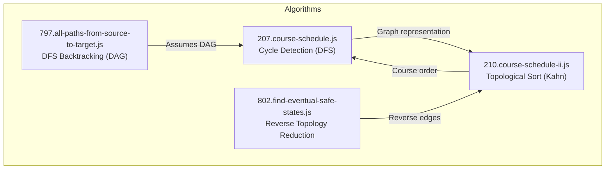
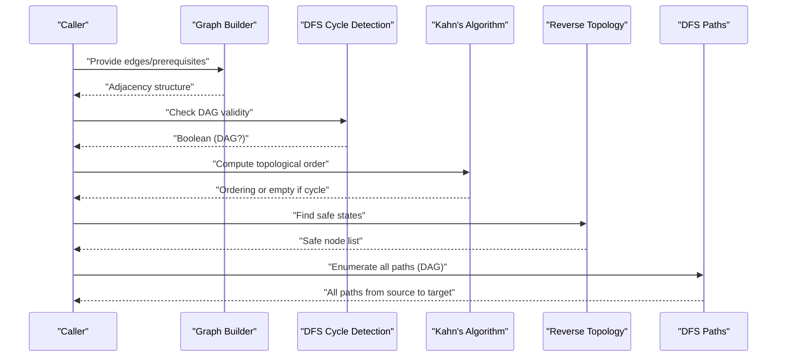
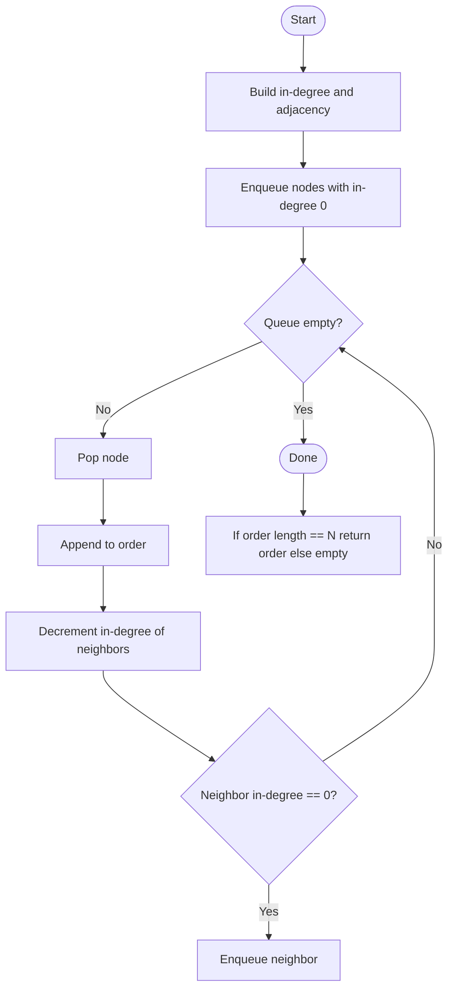
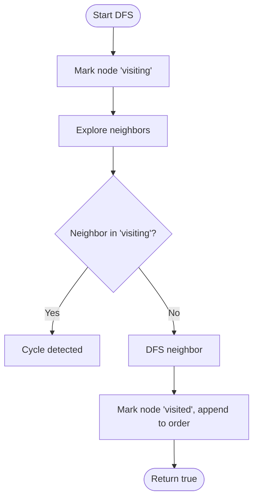
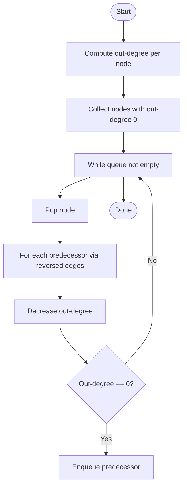
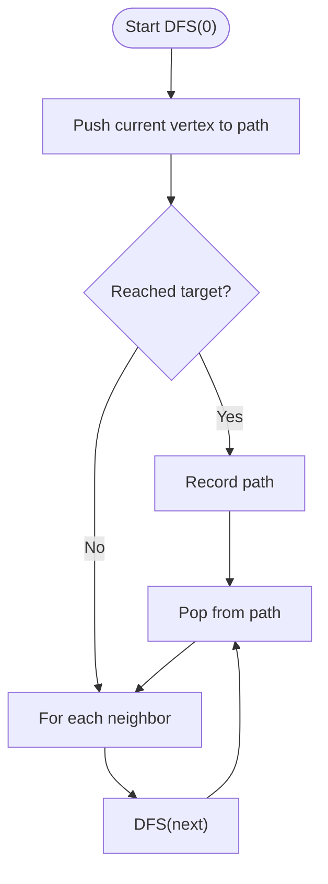
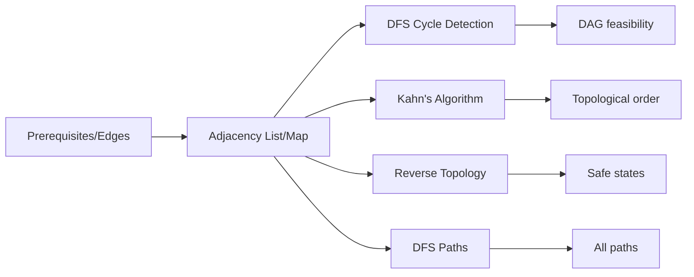

# Topological Sorting

<cite>
**Referenced Files in This Document**
- [207.course-schedule.js](file://算法/207.course-schedule.js)
- [210.course-schedule-ii.js](file://算法/210.course-schedule-ii.js)
- [802.find-eventual-safe-states.js](file://算法/802.find-eventual-safe-states.js)
- [797.all-paths-from-source-to-target.js](file://算法/797.all-paths-from-source-to-target.js)
</cite>

## Table of Contents
1. [Introduction](#introduction)
2. [Project Structure](#project-structure)
3. [Core Components](#core-components)
4. [Architecture Overview](#architecture-overview)
5. [Detailed Component Analysis](#detailed-component-analysis)
6. [Dependency Analysis](#dependency-analysis)
7. [Performance Considerations](#performance-considerations)
8. [Troubleshooting Guide](#troubleshooting-guide)
9. [Conclusion](#conclusion)

## Introduction
This document presents a comprehensive guide to topological sorting algorithms and their practical applications. It covers two canonical approaches—Kahn’s algorithm via in-degree counting and depth-first search (DFS) with post-order traversal—and demonstrates how they apply to:
- Cycle detection in directed acyclic graphs (DAGs)
- Course scheduling feasibility and ordering
- Dependency resolution and build system ordering
- Finding safe states in graphs
- Enumerating all paths in DAGs

The repository provides concrete JavaScript implementations for course scheduling (feasibility and ordering), safe state identification, and path enumeration, enabling both learning and production-ready usage.

## Project Structure
The relevant implementations are located under the algorithms directory:
- Course scheduling feasibility using DFS-based cycle detection
- Course scheduling ordering using Kahn’s algorithm (in-degree counting)
- Safe state discovery using reverse-edge topology reduction
- Path enumeration in DAGs using DFS backtracking

**Diagram sources**
- [207.course-schedule.js:17-61](file://算法/207.course-schedule.js#L17-L61)
- [210.course-schedule-ii.js:17-51](file://算法/210.course-schedule-ii.js#L17-L51)
- [802.find-eventual-safe-states.js:16-63](file://算法/802.find-eventual-safe-states.js#L16-L63)
- [797.all-paths-from-source-to-target.js:16-44](file://算法/797.all-paths-from-source-to-target.js#L16-L44)

**Section sources**
- [207.course-schedule.js:17-61](file://算法/207.course-schedule.js#L17-L61)
- [210.course-schedule-ii.js:17-51](file://算法/210.course-schedule-ii.js#L17-L51)
- [802.find-eventual-safe-states.js:16-63](file://算法/802.find-eventual-safe-states.js#L16-L63)
- [797.all-paths-from-source-to-target.js:16-44](file://算法/797.all-paths-from-source-to-target.js#L16-L44)

## Core Components
- Cycle detection in DAGs using DFS with recursion stack tracking
- Topological sort using Kahn’s algorithm (BFS with in-degree reduction)
- Reverse-edge topology reduction for safe state identification
- DFS backtracking to enumerate all paths in DAGs

These components collectively demonstrate how to:
- Detect cycles to ensure a DAG exists
- Produce a valid topological ordering
- Resolve multiple valid orderings
- Derive lexicographically smallest ordering by controlling adjacency traversal order
- Apply to real-world scenarios like course schedules and build systems

**Section sources**
- [207.course-schedule.js:17-61](file://算法/207.course-schedule.js#L17-L61)
- [210.course-schedule-ii.js:17-51](file://算法/210.course-schedule-ii.js#L17-L51)
- [802.find-eventual-safe-states.js:16-63](file://算法/802.find-eventual-safe-states.js#L16-L63)
- [797.all-paths-from-source-to-target.js:16-44](file://算法/797.all-paths-from-source-to-target.js#L16-L44)

## Architecture Overview
The implementations form a cohesive pipeline:
- Build a graph representation from prerequisites or edges
- Choose an algorithm:
  - DFS-based cycle detection for DAG validation
  - Kahn’s algorithm for topological ordering
  - Reverse-edge reduction for safe state discovery
  - DFS backtracking for path enumeration
- Return results tailored to the problem (boolean feasibility, ordered list, safe nodes, or all paths)

**Diagram sources**
- [207.course-schedule.js:25-58](file://算法/207.course-schedule.js#L25-L58)
- [210.course-schedule-ii.js:21-50](file://算法/210.course-schedule-ii.js#L21-L50)
- [802.find-eventual-safe-states.js:22-62](file://算法/802.find-eventual-safe-states.js#L22-L62)
- [797.all-paths-from-source-to-target.js:23-39](file://算法/797.all-paths-from-source-to-target.js#L23-L39)

## Detailed Component Analysis

### Kahn’s Algorithm: In-Degree Counting
Kahn’s algorithm computes a topological ordering by iteratively removing nodes with zero in-degree. It is ideal for:
- Determining if a dependency graph has a cycle
- Producing a valid execution order
- Handling multiple valid orderings by choosing among zero in-degree nodes

Implementation highlights:
- Initialize in-degree array and adjacency list from prerequisites
- Enqueue all nodes with zero in-degree
- Process nodes, decrementing in-degree of neighbors and enqueuing newly zero-degree nodes
- Return the ordering if all nodes are included; otherwise, a cycle exists

**Diagram sources**
- [210.course-schedule-ii.js:21-50](file://算法/210.course-schedule-ii.js#L21-L50)

**Section sources**
- [210.course-schedule-ii.js:17-51](file://算法/210.course-schedule-ii.js#L17-L51)

### DFS-Based Post-Order Traversal: Cycle Detection and Ordering
DFS-based approaches are useful for:
- Detecting cycles in directed graphs
- Producing a topological ordering via post-order traversal (when applicable)
- Enumerating all paths in DAGs

Implementation highlights:
- Build an adjacency map from prerequisites
- Track visited states: unvisited, visiting (in current path), visited (processed)
- If a node revisited in the same path, a cycle exists
- For ordering, record nodes on post-order (reverse of finish times)

**Diagram sources**
- [207.course-schedule.js:38-52](file://算法/207.course-schedule.js#L38-L52)

**Section sources**
- [207.course-schedule.js:17-61](file://算法/207.course-schedule.js#L17-L61)

### Safe State Discovery Using Reverse Topology
Safe states are those from which all paths eventually lead to terminal states. The approach:
- Compute out-degree for each node
- Collect nodes with out-degree 0 (terminals)
- Reverse the direction of edges and decrement out-degree of predecessors accordingly
- Nodes that reach out-degree 0 via this process are safe

**Diagram sources**
- [802.find-eventual-safe-states.js:22-62](file://算法/802.find-eventual-safe-states.js#L22-L62)

**Section sources**
- [802.find-eventual-safe-states.js:16-63](file://算法/802.find-eventual-safe-states.js#L16-L63)

### Path Enumeration in DAGs
To enumerate all paths from source to target in a DAG:
- Use DFS backtracking
- Maintain a current path and push/pop vertices during exploration
- When reaching the target, record the current path

**Diagram sources**
- [797.all-paths-from-source-to-target.js:23-39](file://算法/797.all-paths-from-source-to-target.js#L23-L39)

**Section sources**
- [797.all-paths-from-source-to-target.js:16-44](file://算法/797.all-paths-from-source-to-target.js#L16-L44)

## Dependency Analysis
The implementations depend on shared graph construction and traversal patterns:
- Graph representation: adjacency lists/maps
- State tracking: visited/processing sets or arrays
- Queue-based processing for Kahn’s algorithm and safe state discovery

**Diagram sources**
- [207.course-schedule.js:25-58](file://算法/207.course-schedule.js#L25-L58)
- [210.course-schedule-ii.js:21-50](file://算法/210.course-schedule-ii.js#L21-L50)
- [802.find-eventual-safe-states.js:22-62](file://算法/802.find-eventual-safe-states.js#L22-L62)
- [797.all-paths-from-source-to-target.js:23-39](file://算法/797.all-paths-from-source-to-target.js#L23-L39)

**Section sources**
- [207.course-schedule.js:25-58](file://算法/207.course-schedule.js#L25-L58)
- [210.course-schedule-ii.js:21-50](file://算法/210.course-schedule-ii.js#L21-L50)
- [802.find-eventual-safe-states.js:22-62](file://算法/802.find-eventual-safe-states.js#L22-L62)
- [797.all-paths-from-source-to-target.js:23-39](file://算法/797.all-paths-from-source-to-target.js#L23-L39)

## Performance Considerations
- Kahn’s algorithm: O(V + E) time and O(V + E) space
- DFS-based cycle detection: O(V + E) time and O(V + E) space
- Safe state discovery: O(V + E) time and O(V + E) space
- Path enumeration in DAGs: O(V + E) for traversal plus output size for recorded paths

Optimization tips:
- Use adjacency lists for sparse graphs
- Prefer BFS queues for Kahn’s algorithm to avoid recursion overhead
- For lexicographically smallest ordering, sort neighbors or use a priority queue to process smaller indices first

[No sources needed since this section provides general guidance]

## Troubleshooting Guide
Common issues and resolutions:
- Incorrect graph representation: ensure prerequisites are mapped to adjacency lists and in-degree arrays
- Misinterpreting cycle detection: verify recursion stack and visited state transitions
- Kahn’s algorithm returning empty ordering: indicates a cycle; validate input prerequisites
- Safe state computation errors: confirm out-degree updates and reversed edge traversal
- Path enumeration producing duplicates: ensure backtracking properly pops vertices after recursion

**Section sources**
- [207.course-schedule.js:38-52](file://算法/207.course-schedule.js#L38-L52)
- [210.course-schedule-ii.js:35-48](file://算法/210.course-schedule-ii.js#L35-L48)
- [802.find-eventual-safe-states.js:46-62](file://算法/802.find-eventual-safe-states.js#L46-L62)
- [797.all-paths-from-source-to-target.js:23-39](file://算法/797.all-paths-from-source-to-target.js#L23-L39)

## Conclusion
Topological sorting underpins many real-world systems, from course scheduling to build pipelines. The repository demonstrates robust, production-ready implementations:
- Use DFS-based cycle detection for DAG validation
- Apply Kahn’s algorithm for efficient topological ordering and dependency resolution
- Employ reverse topology for safe state identification
- Utilize DFS backtracking for enumerating all paths in DAGs

These patterns enable scalable solutions for project management, software compilation, and other dependency-driven workflows.