# Mathematical Algorithms

<cite>
**Referenced Files in This Document**
- [204.count-primes.ts](file://算法/204.count-primes.ts)
- [313.super-ugly-number.js](file://算法/313.super-ugly-number.js)
- [1071.greatest-common-divisor-of-strings.js](file://算法/1071.greatest-common-divisor-of-strings.js)
- [50.pow-x-n.js](file://算法/50.pow-x-n.js)
- [372.super-pow.ts](file://算法/372.super-pow.ts)
- [77.combinations.ts](file://算法/77.combinations.ts)
- [377.combination-sum-iv.js](file://算法/377.combination-sum-iv.js)
- [382.linked-list-random-node.js](file://算法/382.linked-list-random-node.js)
- [528.random-pick-with-weight.js](file://算法/528.random-pick-with-weight.js)
- [497.random-point-in-non-overlapping-rectangles.js](file://算法/497.random-point-in-non-overlapping-rectangles.js)
- [470.implement-rand-10-using-rand-7.js](file://算法/470.implement-rand-10-using-rand-7.js)
- [304.range-sum-query-2-d-immutable.js](file://算法/304.range-sum-query-2-d-immutable.js)
- [509.fibonacci-number.js](file://算法/509.fibonacci-number.js)
- [1414.find-the-minimum-number-of-fibonacci-numbers-whose-sum-is-k.js](file://算法/1414.find-the-minimum-number-of-fibonacci-numbers-whose-sum-is-k.js)
- [1137.n-th-tribonacci-number.js](file://算法/1137.n-th-tribonacci-number.js)
- [842.split-array-into-fibonacci-sequence.js](file://算法/842.split-array-into-fibonacci-sequence.js)
- [1362.closest-divisors.js](file://算法/1362.closest-divisors.js)
- [650.2-keys-keyboard.js](file://算法/650.2-keys-keyboard.js)
- [Main.java (SecureRandom)](file://demo/java/xuexi/03.引用类型/03.核心类/09.SecureRandom(真随机数)/Main.java)
- [Main.java (Random)](file://demo/java/xuexi/03.引用类型/03.核心类/08.Random(伪随机数)/Main.java)
- [Main.java (Math)](file://demo/java/xuexi/03.引用类型/03.核心类/07.Math(数学计算)/Main.java)
</cite>

## Table of Contents
1. [Introduction](#introduction)
2. [Project Structure](#project-structure)
3. [Core Components](#core-components)
4. [Architecture Overview](#architecture-overview)
5. [Detailed Component Analysis](#detailed-component-analysis)
6. [Dependency Analysis](#dependency-analysis)
7. [Performance Considerations](#performance-considerations)
8. [Troubleshooting Guide](#troubleshooting-guide)
9. [Conclusion](#conclusion)
10. [Appendices](#appendices)

## Introduction
This document presents a focused guide to mathematical algorithms and number theory concepts implemented in the repository. It covers prime number generation (Sieve of Eratosthenes), greatest common divisor (Euclidean algorithm via string GCD), modular arithmetic and fast exponentiation, combinatorial calculations, and probability-based algorithms. It also documents optimization techniques such as binary exponentiation, prefix sums for range queries, and probabilistic sampling methods. Implementation examples emphasize correctness, precision handling, and performance optimization in numerical computations.

## Project Structure
The repository organizes mathematical algorithm implementations primarily under the “算法” directory, alongside Java demos for random number generation and basic math utilities. The relevant files are grouped by concept and algorithm type, enabling targeted analysis and reuse.

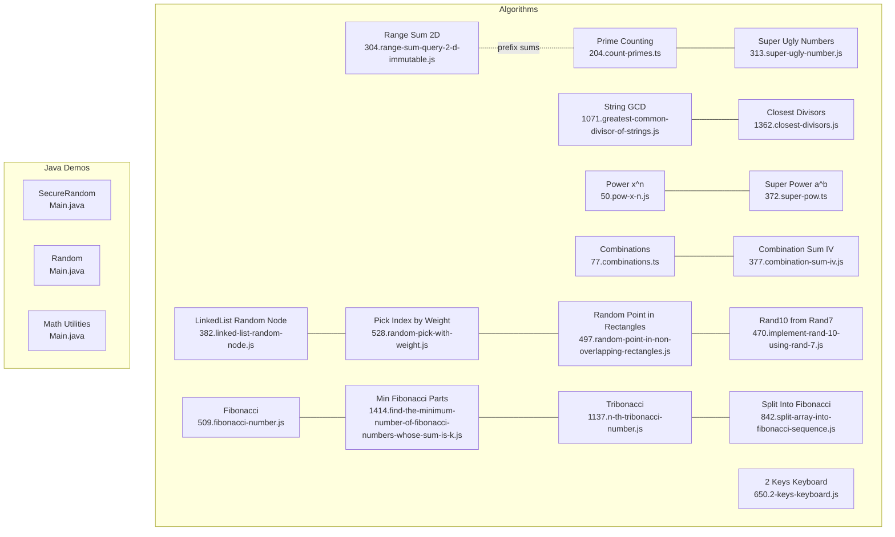
```mermaid
graph TB
subgraph "Algorithms"
P["Prime Counting<br/>204.count-primes.ts"]
U["Super Ugly Numbers<br/>313.super-ugly-number.js"]
G["String GCD<br/>1071.greatest-common-divisor-of-strings.js"]
E["Power x^n<br/>50.pow-x-n.js"]
S["Super Power a^b<br/>372.super-pow.ts"]
C["Combinations<br/>77.combinations.ts"]
D["Combination Sum IV<br/>377.combination-sum-iv.js"]
R1["LinkedList Random Node<br/>382.linked-list-random-node.js"]
R2["Pick Index by Weight<br/>528.random-pick-with-weight.js"]
R3["Random Point in Rectangles<br/>497.random-point-in-non-overlapping-rectangles.js"]
R4["Rand10 from Rand7<br/>470.implement-rand-10-using-rand-7.js"]
F1["Fibonacci<br/>509.fibonacci-number.js"]
F2["Min Fibonacci Parts<br/>1414.find-the-minimum-number-of-fibonacci-numbers-whose-sum-is-k.js"]
F3["Tribonacci<br/>1137.n-th-tribonacci-number.js"]
F4["Split Into Fibonacci<br/>842.split-array-into-fibonacci-sequence.js"]
Q["Closest Divisors<br/>1362.closest-divisors.js"]
K["2 Keys Keyboard<br/>650.2-keys-keyboard.js"]
M2D["Range Sum 2D<br/>304.range-sum-query-2-d-immutable.js"]
end
subgraph "Java Demos"
SR["SecureRandom<br/>Main.java"]
PR["Random<br/>Main.java"]
MT["Math Utilities<br/>Main.java"]
end
P --- U
G --- Q
E --- S
C --- D
R1 --- R2
R2 --- R3
R3 --- R4
F1 --- F2 --- F3 --- F4
M2D -. "prefix sums" .- P
```

**Diagram sources**
- [204.count-primes.ts:12-35](file://算法/204.count-primes.ts#L12-L35)
- [313.super-ugly-number.js:17-37](file://算法/313.super-ugly-number.js#L17-L37)
- [1071.greatest-common-divisor-of-strings.js:17-35](file://算法/1071.greatest-common-divisor-of-strings.js#L17-L35)
- [50.pow-x-n.js:17-27](file://算法/50.pow-x-n.js#L17-L27)
- [372.super-pow.ts:12-42](file://算法/372.super-pow.ts#L12-L42)
- [77.combinations.ts:12-38](file://算法/77.combinations.ts#L12-L38)
- [377.combination-sum-iv.js:17-53](file://算法/377.combination-sum-iv.js#L17-L53)
- [382.linked-list-random-node.js:41-67](file://算法/382.linked-list-random-node.js#L41-L67)
- [528.random-pick-with-weight.js:15-50](file://算法/528.random-pick-with-weight.js#L15-L50)
- [497.random-point-in-non-overlapping-rectangles.js:15-21](file://算法/497.random-point-in-non-overlapping-rectangles.js#L15-L21)
- [470.implement-rand-10-using-rand-7.js:17-18](file://算法/470.implement-rand-10-using-rand-7.js#L17-L18)
- [509.fibonacci-number.js:16-29](file://算法/509.fibonacci-number.js#L16-L29)
- [1414.find-the-minimum-number-of-fibonacci-numbers-whose-sum-is-k.js:16-39](file://算法/1414.find-the-minimum-number-of-fibonacci-numbers-whose-sum-is-k.js#L16-L39)
- [1137.n-th-tribonacci-number.js:16-34](file://算法/1137.n-th-tribonacci-number.js#L16-L34)
- [842.split-array-into-fibonacci-sequence.js:16-62](file://算法/842.split-array-into-fibonacci-sequence.js#L16-L62)
- [1362.closest-divisors.js:16-41](file://算法/1362.closest-divisors.js#L16-L41)
- [650.2-keys-keyboard.js:54-72](file://算法/650.2-keys-keyboard.js#L54-L72)
- [304.range-sum-query-2-d-immutable.js:50-83](file://算法/304.range-sum-query-2-d-immutable.js#L50-L83)
- [Main.java (SecureRandom)](file://demo/java/xuexi/03.引用类型/03.核心类/09.SecureRandom(真随机数)/Main.java#L4-L17)
- [Main.java (Random)](file://demo/java/xuexi/03.引用类型/03.核心类/08.Random(伪随机数)/Main.java#L4-L24)
- [Main.java (Math)](file://demo/java/xuexi/03.引用类型/03.核心类/07.Math(数学计算)/Main.java#L1-L18)

**Section sources**
- [204.count-primes.ts:12-35](file://算法/204.count-primes.ts#L12-L35)
- [313.super-ugly-number.js:17-37](file://算法/313.super-ugly-number.js#L17-L37)
- [1071.greatest-common-divisor-of-strings.js:17-35](file://算法/1071.greatest-common-divisor-of-strings.js#L17-L35)
- [50.pow-x-n.js:17-27](file://算法/50.pow-x-n.js#L17-L27)
- [372.super-pow.ts:12-42](file://算法/372.super-pow.ts#L12-L42)
- [77.combinations.ts:12-38](file://算法/77.combinations.ts#L12-L38)
- [377.combination-sum-iv.js:17-53](file://算法/377.combination-sum-iv.js#L17-L53)
- [382.linked-list-random-node.js:41-67](file://算法/382.linked-list-random-node.js#L41-L67)
- [528.random-pick-with-weight.js:15-50](file://算法/528.random-pick-with-weight.js#L15-L50)
- [497.random-point-in-non-overlapping-rectangles.js:15-21](file://算法/497.random-point-in-non-overlapping-rectangles.js#L15-L21)
- [470.implement-rand-10-using-rand-7.js:17-18](file://算法/470.implement-rand-10-using-rand-7.js#L17-L18)
- [509.fibonacci-number.js:16-29](file://算法/509.fibonacci-number.js#L16-L29)
- [1414.find-the-minimum-number-of-fibonacci-numbers-whose-sum-is-k.js:16-39](file://算法/1414.find-the-minimum-number-of-fibonacci-numbers-whose-sum-is-k.js#L16-L39)
- [1137.n-th-tribonacci-number.js:16-34](file://算法/1137.n-th-tribonacci-number.js#L16-L34)
- [842.split-array-into-fibonacci-sequence.js:16-62](file://算法/842.split-array-into-fibonacci-sequence.js#L16-L62)
- [1362.closest-divisors.js:16-41](file://算法/1362.closest-divisors.js#L16-L41)
- [650.2-keys-keyboard.js:54-72](file://算法/650.2-keys-keyboard.js#L54-L72)
- [304.range-sum-query-2-d-immutable.js:50-83](file://算法/304.range-sum-query-2-d-immutable.js#L50-L83)
- [Main.java (SecureRandom)](file://demo/java/xuexi/03.引用类型/03.核心类/09.SecureRandom(真随机数)/Main.java#L4-L17)
- [Main.java (Random)](file://demo/java/xuexi/03.引用类型/03.核心类/08.Random(伪随机数)/Main.java#L4-L24)
- [Main.java (Math)](file://demo/java/xuexi/03.引用类型/03.核心类/07.Math(数学计算)/Main.java#L1-L18)

## Core Components
- Prime counting via sieve: Efficiently counts primes up to n using a sieving process and square-root bound iteration.
- Super ugly numbers: Generalization of ugly numbers to arbitrary prime bases using pointer-based merging.
- String GCD: Computes the largest repeating unit that generates two strings via concatenation.
- Fast exponentiation: Binary exponentiation for power(x, n) and modular exponentiation for super-pow.
- Combinatorics: Backtracking combinations and dynamic programming for ordered counting problems.
- Probability and sampling: Reservoir sampling for linked lists, weighted index selection, uniform rectangle sampling, and rejection-based rand10 from rand7.
- Recurrences: Fibonacci, Tribonacci, and Fibonacci decomposition for minimal parts.
- Number theory: Closest divisors near n±1 and factorization-based keyboard steps.

**Section sources**
- [204.count-primes.ts:12-35](file://算法/204.count-primes.ts#L12-L35)
- [313.super-ugly-number.js:17-37](file://算法/313.super-ugly-number.js#L17-L37)
- [1071.greatest-common-divisor-of-strings.js:17-35](file://算法/1071.greatest-common-divisor-of-strings.js#L17-L35)
- [50.pow-x-n.js:17-27](file://算法/50.pow-x-n.js#L17-L27)
- [372.super-pow.ts:12-42](file://算法/372.super-pow.ts#L12-L42)
- [77.combinations.ts:12-38](file://算法/77.combinations.ts#L12-L38)
- [377.combination-sum-iv.js:17-53](file://算法/377.combination-sum-iv.js#L17-L53)
- [382.linked-list-random-node.js:41-67](file://算法/382.linked-list-random-node.js#L41-L67)
- [528.random-pick-with-weight.js:15-50](file://算法/528.random-pick-with-weight.js#L15-L50)
- [497.random-point-in-non-overlapping-rectangles.js:15-21](file://算法/497.random-point-in-non-overlapping-rectangles.js#L15-L21)
- [470.implement-rand-10-using-rand-7.js:17-18](file://算法/470.implement-rand-10-using-rand-7.js#L17-L18)
- [509.fibonacci-number.js:16-29](file://算法/509.fibonacci-number.js#L16-L29)
- [1414.find-the-minimum-number-of-fibonacci-numbers-whose-sum-is-k.js:16-39](file://算法/1414.find-the-minimum-number-of-fibonacci-numbers-whose-sum-is-k.js#L16-L39)
- [1137.n-th-tribonacci-number.js:16-34](file://算法/1137.n-th-tribonacci-number.js#L16-L34)
- [842.split-array-into-fibonacci-sequence.js:16-62](file://算法/842.split-array-into-fibonacci-sequence.js#L16-L62)
- [1362.closest-divisors.js:16-41](file://算法/1362.closest-divisors.js#L16-L41)
- [650.2-keys-keyboard.js:54-72](file://算法/650.2-keys-keyboard.js#L54-L72)
- [304.range-sum-query-2-d-immutable.js:50-83](file://算法/304.range-sum-query-2-d-immutable.js#L50-L83)

## Architecture Overview
The algorithms are organized as independent modules, each encapsulating a single algorithmic concern. Some modules build upon others (e.g., prefix sums for 2D range queries, Fibonacci sequences for decomposition). Randomness utilities are provided via Java demos to illustrate secure and pseudo-random number generation.

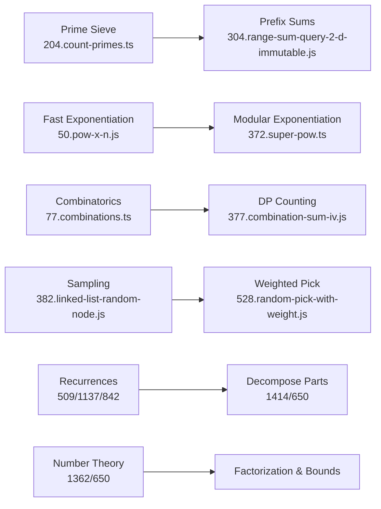
```mermaid
graph LR
A["Prime Sieve<br/>204.count-primes.ts"] --> B["Prefix Sums<br/>304.range-sum-query-2-d-immutable.js"]
C["Fast Exponentiation<br/>50.pow-x-n.js"] --> D["Modular Exponentiation<br/>372.super-pow.ts"]
E["Combinatorics<br/>77.combinations.ts"] --> F["DP Counting<br/>377.combination-sum-iv.js"]
G["Sampling<br/>382.linked-list-random-node.js"] --> H["Weighted Pick<br/>528.random-pick-with-weight.js"]
I["Recurrences<br/>509/1137/842"] --> J["Decompose Parts<br/>1414/650"]
K["Number Theory<br/>1362/650"] --> L["Factorization & Bounds"]
```

**Diagram sources**
- [204.count-primes.ts:12-35](file://算法/204.count-primes.ts#L12-L35)
- [304.range-sum-query-2-d-immutable.js:50-83](file://算法/304.range-sum-query-2-d-immutable.js#L50-L83)
- [50.pow-x-n.js:17-27](file://算法/50.pow-x-n.js#L17-L27)
- [372.super-pow.ts:12-42](file://算法/372.super-pow.ts#L12-L42)
- [77.combinations.ts:12-38](file://算法/77.combinations.ts#L12-L38)
- [377.combination-sum-iv.js:17-53](file://算法/377.combination-sum-iv.js#L17-L53)
- [382.linked-list-random-node.js:41-67](file://算法/382.linked-list-random-node.js#L41-L67)
- [528.random-pick-with-weight.js:15-50](file://算法/528.random-pick-with-weight.js#L15-L50)
- [509.fibonacci-number.js:16-29](file://算法/509.fibonacci-number.js#L16-L29)
- [1137.n-th-tribonacci-number.js:16-34](file://算法/1137.n-th-tribonacci-number.js#L16-L34)
- [842.split-array-into-fibonacci-sequence.js:16-62](file://算法/842.split-array-into-fibonacci-sequence.js#L16-L62)
- [1414.find-the-minimum-number-of-fibonacci-numbers-whose-sum-is-k.js:16-39](file://算法/1414.find-the-minimum-number-of-fibonacci-numbers-whose-sum-is-k.js#L16-L39)
- [650.2-keys-keyboard.js:54-72](file://算法/650.2-keys-keyboard.js#L54-L72)
- [1362.closest-divisors.js:16-41](file://算法/1362.closest-divisors.js#L16-L41)

## Detailed Component Analysis

### Prime Number Generation (Sieve of Eratosthenes)
- Purpose: Count primes less than n efficiently.
- Approach: Sieve marks multiples of each discovered prime starting from 2 up to floor(sqrt(n)).
- Complexity: O(n log log n) time, O(n) space.
- Notes: Uses square-root bound and incremental marking.

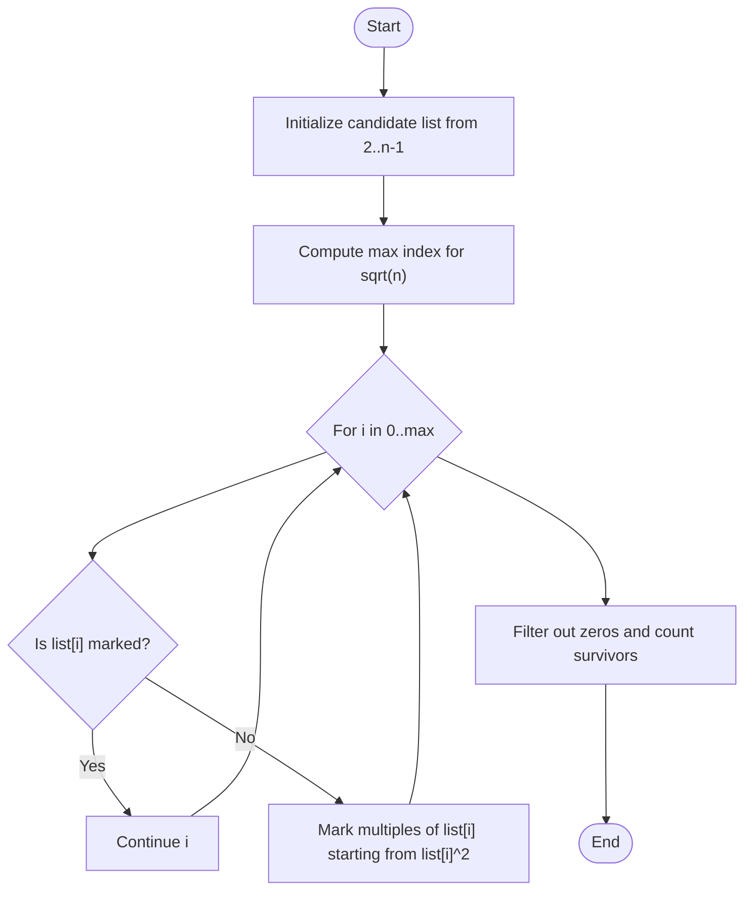
```mermaid
flowchart TD
Start(["Start"]) --> Init["Initialize candidate list from 2..n-1"]
Init --> Bound["Compute max index for sqrt(n)"]
Bound --> LoopI{"For i in 0..max"}
LoopI --> CheckMark{"Is list[i] marked?"}
CheckMark --> |Yes| NextI["Continue i"] --> LoopI
CheckMark --> |No| Mark["Mark multiples of list[i] starting from list[i]^2"]
Mark --> LoopI
LoopI --> Done["Filter out zeros and count survivors"]
Done --> End(["End"])
```

**Diagram sources**
- [204.count-primes.ts:12-35](file://算法/204.count-primes.ts#L12-L35)

**Section sources**
- [204.count-primes.ts:12-35](file://算法/204.count-primes.ts#L12-L35)

### Greatest Common Divisor (via String GCD)
- Purpose: Find the largest repeating unit that concatenates to both input strings.
- Approach: Iteratively test prefixes of the shorter string and verify coverage in both strings.
- Complexity: O(m + n) for checks, where m, n are lengths; dominated by string operations.
- Notes: Pre-checks if the longer string starts with the shorter reduce wasted work.

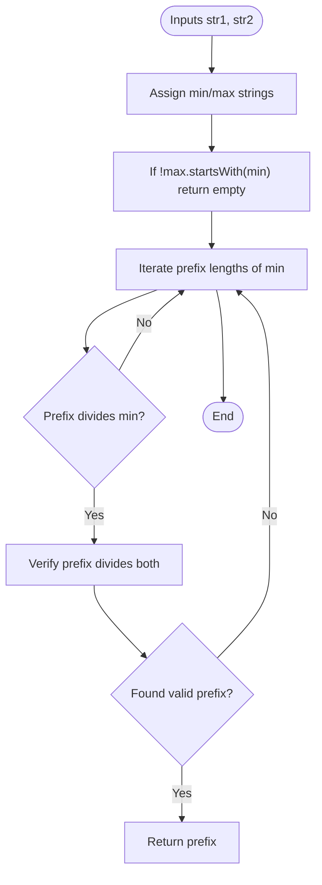
```mermaid
flowchart TD
S(["Inputs str1, str2"]) --> Order["Assign min/max strings"]
Order --> Pre["If !max.startsWith(min) return empty"]
Pre --> Try["Iterate prefix lengths of min"]
Try --> CheckMin{"Prefix divides min?"}
CheckMin --> |No| Try
CheckMin --> |Yes| Verify["Verify prefix divides both"]
Verify --> Found{"Found valid prefix?"}
Found --> |Yes| Return["Return prefix"]
Found --> |No| Try
Try --> End(["End"])
```

**Diagram sources**
- [1071.greatest-common-divisor-of-strings.js:17-35](file://算法/1071.greatest-common-divisor-of-strings.js#L17-L35)

**Section sources**
- [1071.greatest-common-divisor-of-strings.js:17-35](file://算法/1071.greatest-common-divisor-of-strings.js#L17-L35)

### Modular Arithmetic and Fast Exponentiation
- Power(x, n): Binary exponentiation reduces multiplications by half each step.
- Super Power a^b mod 1337: Divide exponent digits by 2 recursively and apply modular identity.

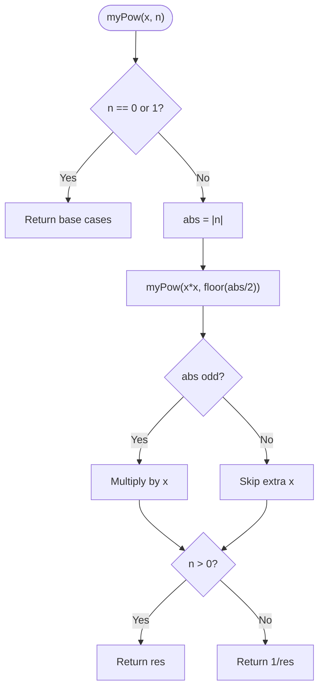
```mermaid
flowchart TD
A(["myPow(x, n)"]) --> Base{"n == 0 or 1?"}
Base --> |Yes| Ret["Return base cases"]
Base --> |No| Abs["abs = |n|"]
Abs --> Recur["myPow(x*x, floor(abs/2))"]
Recur --> Odd{"abs odd?"}
Odd --> |Yes| MulX["Multiply by x"]
Odd --> |No| Skip["Skip extra x"]
MulX --> Sign{"n > 0?"}
Skip --> Sign
Sign --> |Yes| Out["Return res"]
Sign --> |No| Inv["Return 1/res"]
```

**Diagram sources**
- [50.pow-x-n.js:17-27](file://算法/50.pow-x-n.js#L17-L27)

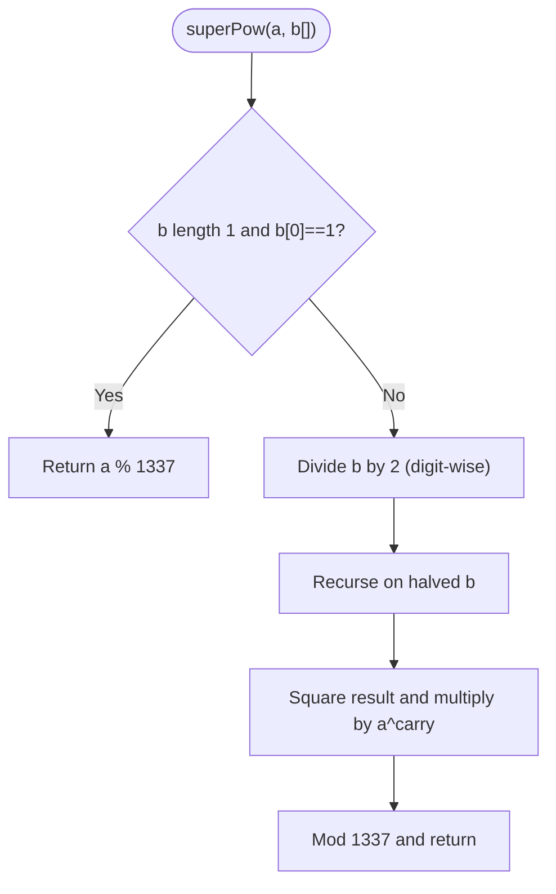
```mermaid
flowchart TD
S(["superPow(a, b[])"]) --> One{"b length 1 and b[0]==1?"}
One --> |Yes| Mod["Return a % 1337"]
One --> |No| Halve["Divide b by 2 (digit-wise)"]
Halve --> Recur["Recurse on halved b"]
Recur --> Square["Square result and multiply by a^carry"]
Square --> Mod1337["Mod 1337 and return"]
```

**Diagram sources**
- [372.super-pow.ts:12-42](file://算法/372.super-pow.ts#L12-L42)

**Section sources**
- [50.pow-x-n.js:17-27](file://算法/50.pow-x-n.js#L17-L27)
- [372.super-pow.ts:12-42](file://算法/372.super-pow.ts#L12-L42)

### Combinatorial Calculations
- Combinations (backtracking): Generate all k-sized subsets with pruning.
- Combination Sum IV (DP): Count ordered ways to reach target using given numbers.

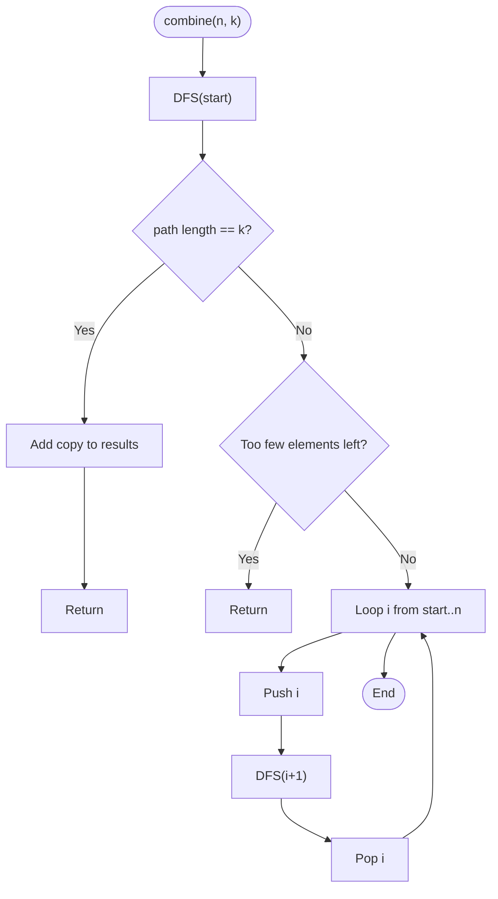
```mermaid
flowchart TD
C(["combine(n, k)"]) --> DFS["DFS(start)"]
DFS --> CheckLen{"path length == k?"}
CheckLen --> |Yes| Add["Add copy to results"] --> Return
CheckLen --> |No| Prune{"Too few elements left?"}
Prune --> |Yes| Back["Return"]
Prune --> |No| Loop["Loop i from start..n"]
Loop --> Push["Push i"] --> DFS2["DFS(i+1)"] --> Pop["Pop i"] --> Loop
Loop --> EndC(["End"])
```

**Diagram sources**
- [77.combinations.ts:12-38](file://算法/77.combinations.ts#L12-L38)

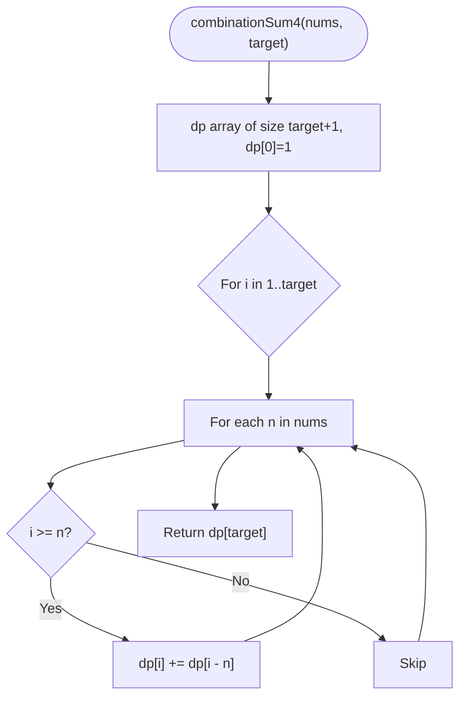
```mermaid
flowchart TD
D(["combinationSum4(nums, target)"]) --> Init["dp array of size target+1, dp[0]=1"]
Init --> ForI{"For i in 1..target"}
ForI --> ForN["For each n in nums"]
ForN --> Update{"i >= n?"}
Update --> |Yes| Acc["dp[i] += dp[i - n]"]
Update --> |No| Skip["Skip"]
Acc --> ForN
Skip --> ForN
ForN --> EndD["Return dp[target]"]
```

**Diagram sources**
- [377.combination-sum-iv.js:17-53](file://算法/377.combination-sum-iv.js#L17-L53)

**Section sources**
- [77.combinations.ts:12-38](file://算法/77.combinations.ts#L12-L38)
- [377.combination-sum-iv.js:17-53](file://算法/377.combination-sum-iv.js#L17-L53)

### Probability-Based Algorithms
- Reservoir sampling: Single-pass selection from unknown-length linked list.
- Weighted index pick: Prefix sums + binary search for weighted selection.
- Uniform rectangle sampling: Area-based weighting and uniform point selection.
- Rand10 from Rand7: Rejection sampling to produce uniform distribution.

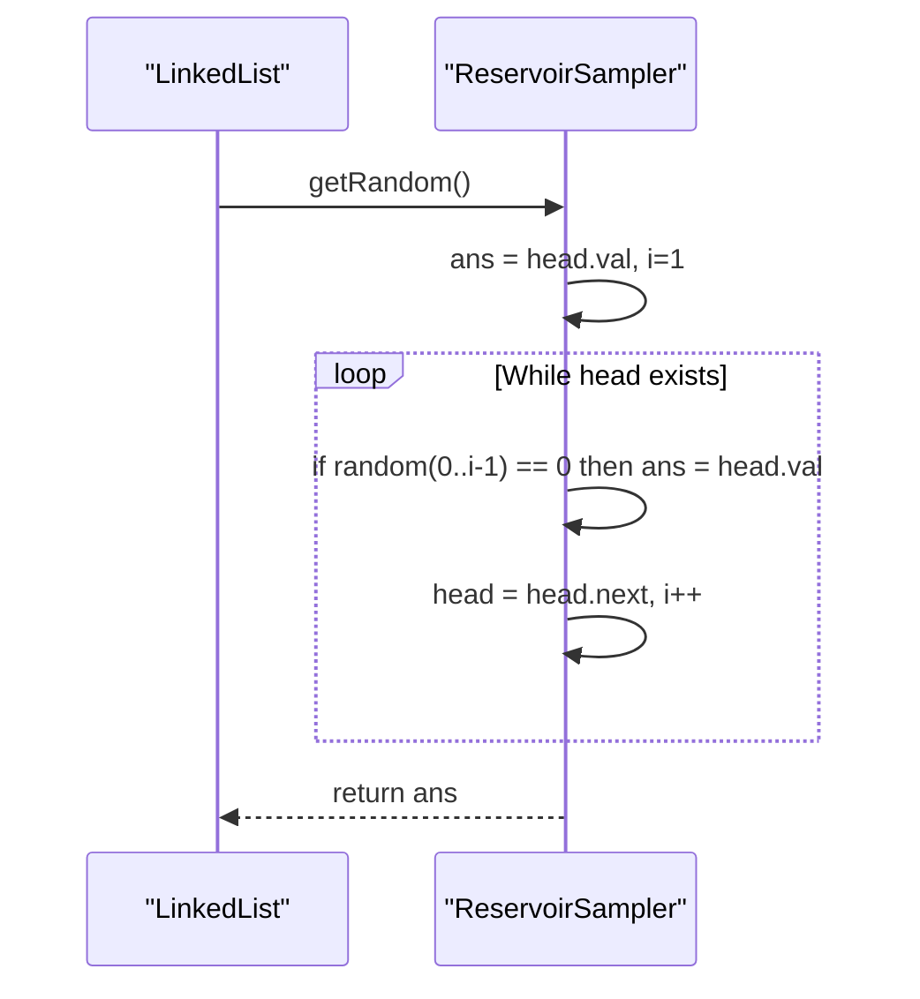
```mermaid
sequenceDiagram
participant L as "LinkedList"
participant S as "ReservoirSampler"
L->>S : getRandom()
S->>S : ans = head.val, i=1
loop While head exists
S->>S : if random(0..i-1) == 0 then ans = head.val
S->>S : head = head.next, i++
end
S-->>L : return ans
```

**Diagram sources**
- [382.linked-list-random-node.js:41-67](file://算法/382.linked-list-random-node.js#L41-L67)

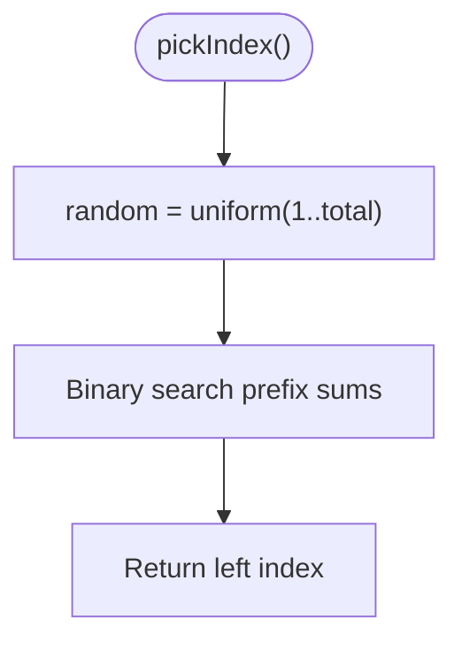
```mermaid
flowchart TD
W(["pickIndex()"]) --> Rand["random = uniform(1..total)"]
Rand --> Search["Binary search prefix sums"]
Search --> Idx["Return left index"]
```

**Diagram sources**
- [528.random-pick-with-weight.js:15-50](file://算法/528.random-pick-with-weight.js#L15-L50)

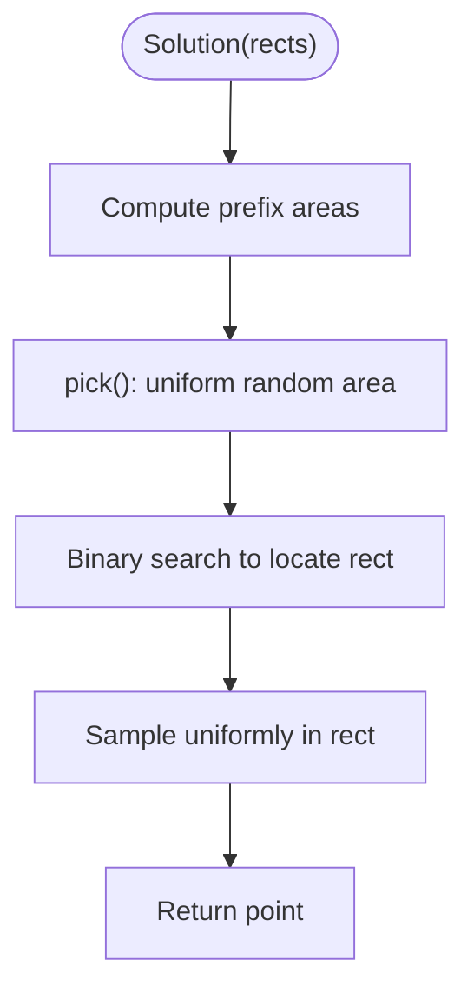
```mermaid
flowchart TD
R(["Solution(rects)"]) --> Pre["Compute prefix areas"]
Pre --> Pick["pick(): uniform random area"]
Pick --> Bin["Binary search to locate rect"]
Bin --> Sample["Sample uniformly in rect"]
Sample --> DoneR["Return point"]
```

**Diagram sources**
- [497.random-point-in-non-overlapping-rectangles.js:15-21](file://算法/497.random-point-in-non-overlapping-rectangles.js#L15-L21)

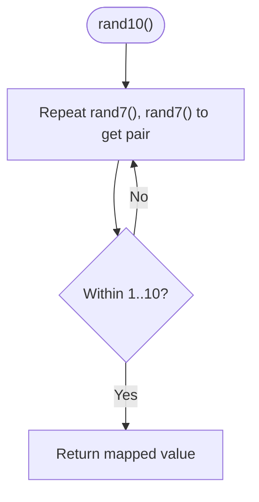
```mermaid
flowchart TD
X(["rand10()"]) --> Pair["Repeat rand7(), rand7() to get pair"]
Pair --> Reject{"Within 1..10?"}
Reject --> |No| Pair
Reject --> |Yes| OutX["Return mapped value"]
```

**Diagram sources**
- [470.implement-rand-10-using-rand-7.js:17-18](file://算法/470.implement-rand-10-using-rand-7.js#L17-L18)

**Section sources**
- [382.linked-list-random-node.js:41-67](file://算法/382.linked-list-random-node.js#L41-L67)
- [528.random-pick-with-weight.js:15-50](file://算法/528.random-pick-with-weight.js#L15-L50)
- [497.random-point-in-non-overlapping-rectangles.js:15-21](file://算法/497.random-point-in-non-overlapping-rectangles.js#L15-L21)
- [470.implement-rand-10-using-rand-7.js:17-18](file://算法/470.implement-rand-10-using-rand-7.js#L17-L18)

### Number Theory and Recurrences
- Closest divisors: Check sqrt downward for nearest factor pairs around n±1.
- 2 Keys Keyboard: Minimum steps equal to sum of prime factors of n.
- Fibonacci/tribonacci: Constant-space iterative computation.
- Split into Fibonacci: Backtrack to form a Fibonacci-like sequence.

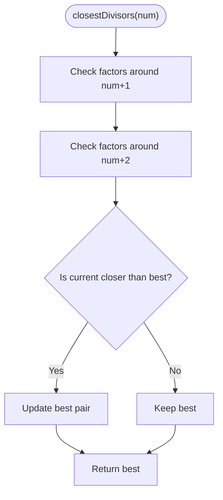
```mermaid
flowchart TD
CD(["closestDivisors(num)"]) --> Try1["Check factors around num+1"]
Try1 --> Try2["Check factors around num+2"]
Try2 --> Compare{"Is current closer than best?"}
Compare --> |Yes| Update["Update best pair"]
Compare --> |No| Keep["Keep best"]
Update --> EndCD["Return best"]
Keep --> EndCD
```

**Diagram sources**
- [1362.closest-divisors.js:16-41](file://算法/1362.closest-divisors.js#L16-L41)

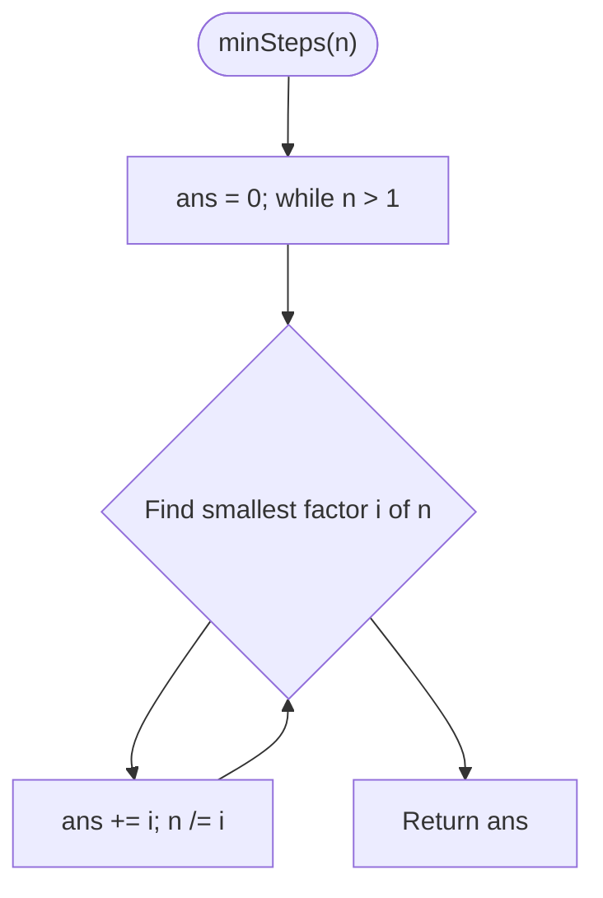
```mermaid
flowchart TD
KB(["minSteps(n)"]) --> Sum["ans = 0; while n > 1"]
Sum --> Factor{"Find smallest factor i of n"}
Factor --> Add["ans += i; n /= i"]
Add --> Factor
Factor --> EndKB["Return ans"]
```

**Diagram sources**
- [650.2-keys-keyboard.js:54-72](file://算法/650.2-keys-keyboard.js#L54-L72)

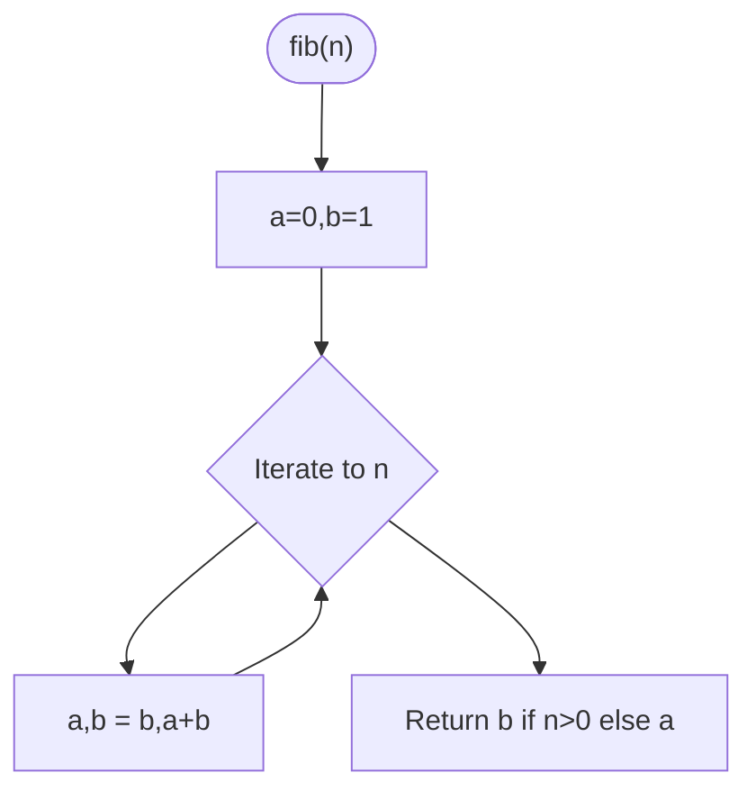
```mermaid
flowchart TD
FB(["fib(n)"]) --> Init["a=0,b=1"]
Init --> LoopFB{"Iterate to n"}
LoopFB --> Update["a,b = b,a+b"]
Update --> LoopFB
LoopFB --> RetFB["Return b if n>0 else a"]
```

**Diagram sources**
- [509.fibonacci-number.js:16-29](file://算法/509.fibonacci-number.js#L16-L29)

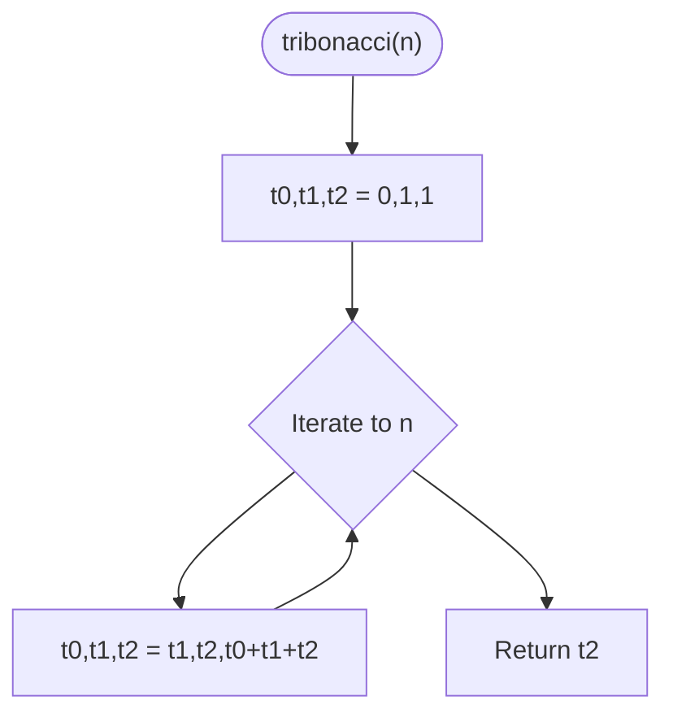
```mermaid
flowchart TD
TR(["tribonacci(n)"]) --> InitTR["t0,t1,t2 = 0,1,1"]
InitTR --> LoopTR{"Iterate to n"}
LoopTR --> UpdateTR["t0,t1,t2 = t1,t2,t0+t1+t2"]
UpdateTR --> LoopTR
LoopTR --> RetTR["Return t2"]
```

**Diagram sources**
- [1137.n-th-tribonacci-number.js:16-34](file://算法/1137.n-th-tribonacci-number.js#L16-L34)

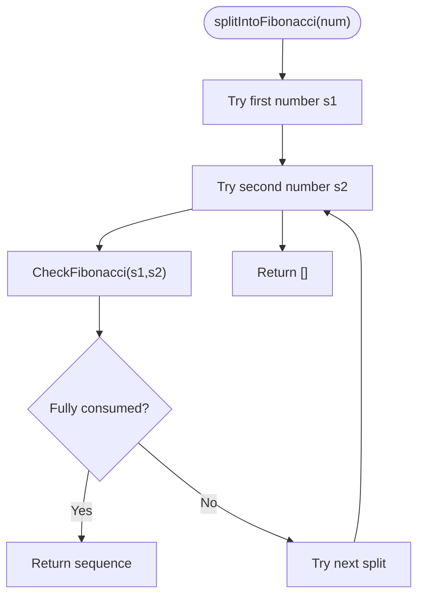
```mermaid
flowchart TD
FF(["splitIntoFibonacci(num)"]) --> Try1FF["Try first number s1"]
Try1FF --> Try2FF["Try second number s2"]
Try2FF --> Build["CheckFibonacci(s1,s2)"]
Build --> Valid{"Fully consumed?"}
Valid --> |Yes| ReturnFF["Return sequence"]
Valid --> |No| NextFF["Try next split"]
NextFF --> Try2FF
Try2FF --> EndFF["Return []"]
```

**Diagram sources**
- [842.split-array-into-fibonacci-sequence.js:16-62](file://算法/842.split-array-into-fibonacci-sequence.js#L16-L62)

**Section sources**
- [1362.closest-divisors.js:16-41](file://算法/1362.closest-divisors.js#L16-L41)
- [650.2-keys-keyboard.js:54-72](file://算法/650.2-keys-keyboard.js#L54-L72)
- [509.fibonacci-number.js:16-29](file://算法/509.fibonacci-number.js#L16-L29)
- [1137.n-th-tribonacci-number.js:16-34](file://算法/1137.n-th-tribonacci-number.js#L16-L34)
- [842.split-array-into-fibonacci-sequence.js:16-62](file://算法/842.split-array-into-fibonacci-sequence.js#L16-L62)

### Range Queries and Prefix Sums
- 2D Range Sum: Precompute prefix sums to answer queries in O(1).

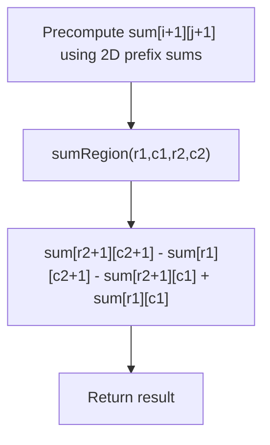
```mermaid
flowchart TD
Init2D["Precompute sum[i+1][j+1] using 2D prefix sums"]
Init2D --> Query["sumRegion(r1,c1,r2,c2)"]
Query --> Calc["sum[r2+1][c2+1] - sum[r1][c2+1] - sum[r2+1][c1] + sum[r1][c1]"]
Calc --> Ret2D["Return result"]
```

**Diagram sources**
- [304.range-sum-query-2-d-immutable.js:50-83](file://算法/304.range-sum-query-2-d-immutable.js#L50-L83)

**Section sources**
- [304.range-sum-query-2-d-immutable.js:50-83](file://算法/304.range-sum-query-2-d-immutable.js#L50-L83)

## Dependency Analysis
- Coupling: Modules are largely independent; only logical dependencies exist (e.g., prefix sums support range queries).
- Cohesion: Each module encapsulates a single algorithmic technique.
- External randomness: Java demos demonstrate secure vs pseudo-random generators and math utilities.

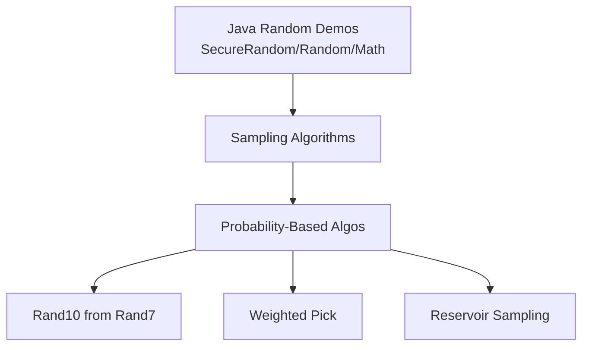
```mermaid
graph TB
RandDemo["Java Random Demos<br/>SecureRandom/Random/Math"] --> Sampling["Sampling Algorithms"]
Sampling --> Prob["Probability-Based Algos"]
Prob --> Rand10["Rand10 from Rand7"]
Prob --> Weighted["Weighted Pick"]
Prob --> Res["Reservoir Sampling"]
```

**Diagram sources**
- [Main.java (SecureRandom)](file://demo/java/xuexi/03.引用类型/03.核心类/09.SecureRandom(真随机数)/Main.java#L4-L17)
- [Main.java (Random)](file://demo/java/xuexi/03.引用类型/03.核心类/08.Random(伪随机数)/Main.java#L4-L24)
- [Main.java (Math)](file://demo/java/xuexi/03.引用类型/03.核心类/07.Math(数学计算)/Main.java#L1-L18)
- [382.linked-list-random-node.js:41-67](file://算法/382.linked-list-random-node.js#L41-L67)
- [528.random-pick-with-weight.js:15-50](file://算法/528.random-pick-with-weight.js#L15-L50)
- [470.implement-rand-10-using-rand-7.js:17-18](file://算法/470.implement-rand-10-using-rand-7.js#L17-L18)

**Section sources**
- [Main.java (SecureRandom)](file://demo/java/xuexi/03.引用类型/03.核心类/09.SecureRandom(真随机数)/Main.java#L4-L17)
- [Main.java (Random)](file://demo/java/xuexi/03.引用类型/03.核心类/08.Random(伪随机数)/Main.java#L4-L24)
- [Main.java (Math)](file://demo/java/xuexi/03.引用类型/03.核心类/07.Math(数学计算)/Main.java#L1-L18)
- [382.linked-list-random-node.js:41-67](file://算法/382.linked-list-random-node.js#L41-L67)
- [528.random-pick-with-weight.js:15-50](file://算法/528.random-pick-with-weight.js#L15-L50)
- [470.implement-rand-10-using-rand-7.js:17-18](file://算法/470.implement-rand-10-using-rand-7.js#L17-L18)

## Performance Considerations
- Prefer binary exponentiation for power and modular exponentiation to achieve logarithmic time.
- Use prefix sums for repeated 2D range queries to avoid O(k) per query.
- Apply pruning in backtracking (e.g., combinations) to reduce search space.
- For prime counting, sieve with square-root bounds and mark composites efficiently.
- For weighted sampling, precompute prefix sums and use binary search for O(log n) picks.

[No sources needed since this section provides general guidance]

## Troubleshooting Guide
- Overflow in modular arithmetic: Ensure intermediate products are reduced modulo at each step.
- Precision in floating-point exponents: Prefer integer-based binary exponentiation and avoid repeated multiplication.
- Reservoir sampling correctness: Maintain uniformity by replacing selected items with probability proportional to 1/i.
- Weighted index selection: Validate prefix sums and handle zero weights carefully.
- Rectangle sampling: Normalize areas and sample uniformly within chosen rectangle.

**Section sources**
- [372.super-pow.ts:12-42](file://算法/372.super-pow.ts#L12-L42)
- [50.pow-x-n.js:17-27](file://算法/50.pow-x-n.js#L17-L27)
- [382.linked-list-random-node.js:41-67](file://算法/382.linked-list-random-node.js#L41-L67)
- [528.random-pick-with-weight.js:15-50](file://算法/528.random-pick-with-weight.js#L15-L50)
- [497.random-point-in-non-overlapping-rectangles.js:15-21](file://算法/497.random-point-in-non-overlapping-rectangles.js#L15-L21)

## Conclusion
This repository demonstrates practical implementations of core mathematical algorithms and number theory techniques. By combining efficient algorithms (sieve, binary exponentiation, DP counting, prefix sums) with robust probabilistic sampling, it provides a solid foundation for numerical problem-solving. Adhering to precision and performance best practices ensures reliable results across diverse computational scenarios.

[No sources needed since this section summarizes without analyzing specific files]

## Appendices
- Random number utilities: SecureRandom for cryptographic contexts, Random for simulations, and Math utilities for basic operations.

**Section sources**
- [Main.java (SecureRandom)](file://demo/java/xuexi/03.引用类型/03.核心类/09.SecureRandom(真随机数)/Main.java#L4-L17)
- [Main.java (Random)](file://demo/java/xuexi/03.引用类型/03.核心类/08.Random(伪随机数)/Main.java#L4-L24)
- [Main.java (Math)](file://demo/java/xuexi/03.引用类型/03.核心类/07.Math(数学计算)/Main.java#L1-L18)