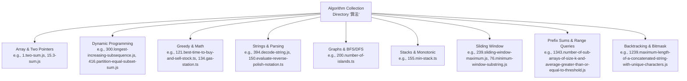
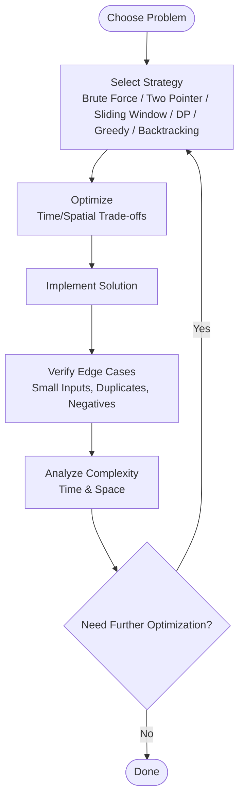
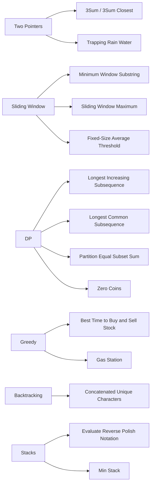

# Problem-Solving Strategies

<cite>
**Referenced Files in This Document**
- [1.two-sum.js](file://算法/1.two-sum.js)
- [15.3-sum.js](file://算法/15.3-sum.js)
- [16.3-sum-closest.js](file://算法/16.3-sum-closest.js)
- [300.longest-increasing-subsequence.js](file://算法/300.longest-increasing-subsequence.js)
- [347.top-k-frequent-elements.ts](file://算法/347.top-k-frequent-elements.ts)
- [42.trapping-rain-water.js](file://算法/42.trapping-rain-water.js)
- [76.minimum-window-substring.js](file://算法/76.minimum-window-substring.js)
- [121.best-time-to-buy-and-sell-stock.ts](file://算法/121.best-time-to-buy-and-sell-stock.ts)
- [122.best-time-to-buy-and-sell-stock-ii.ts](file://算法/122.best-time-to-buy-and-sell-stock-ii.ts)
- [134.gas-station.ts](file://算法/134.gas-station.ts)
- [150.evaluate-reverse-polish-notation.ts](file://算法/150.evaluate-reverse-polish-notation.ts)
- [155.min-stack.ts](file://算法/155.min-stack.ts)
- [200.number-of-islands.ts](file://算法/200.number-of-islands.ts)
- [239.sliding-window-maximum.js](file://算法/239.sliding-window-maximum.js)
- [344.reverse-string.js](file://算法/344.reverse-string.js)
- [394.decode-string.js](file://算法/394.decode-string.js)
- [416.partition-equal-subset-sum.js](file://算法/416.partition-equal-subset-sum.js)
- [45.jump-game-ii.js](file://算法/45.jump-game-ii.js)
- [53.maximum-subarray.js](file://算法/53.maximum-subarray.js)
- [53.maximum-subarray.ts](file://算法/53.maximum-subarray.ts)
- [1143.longest-common-subsequence.js](file://算法/1143.longest-common-subsequence.js)
- [1218.longest-arithmetic-subsequence-of-given-difference.js](file://算法/1218.longest-arithmetic-subsequence-of-given-difference.js)
- [1239.maximum-length-of-a-concatenated-string-with-unique-characters.js](file://算法/1239.maximum-length-of-a-concatenated-string-with-unique-characters.js)
- [1343.number-of-sub-arrays-of-size-k-and-average-greater-than-or-equal-to-threshold.js](file://算法/1343.number-of-sub-arrays-of-size-k-and-average-greater-than-or-equal-to-threshold.js)
- [1438.longest-continuous-subarray-with-absolute-diff-less-than-or-equal-to-limit.js](file://算法/1438.longest-continuous-subarray-with-absolute-diff-less-than-or-equal-to-limit.js)
- [LCR 103.零钱兑换.js](file://算法/LCR 103.零钱兑换.js)
- [面试题 08.06.hanota-lcci.js](file://算法/面试题 08.06.hanota-lcci.js)
</cite>

## Table of Contents
1. [Introduction](#introduction)
2. [Project Structure](#project-structure)
3. [Core Components](#core-components)
4. [Architecture Overview](#architecture-overview)
5. [Detailed Component Analysis](#detailed-component-analysis)
6. [Dependency Analysis](#dependency-analysis)
7. [Performance Considerations](#performance-considerations)
8. [Troubleshooting Guide](#troubleshooting-guide)
9. [Conclusion](#conclusion)

## Introduction
This document presents a comprehensive guide to algorithmic problem-solving strategies and design patterns, grounded in practical examples from the algorithm collection. It covers foundational approaches—brute force, divide and conquer, greedy algorithms, and backtracking—and common techniques such as two-pointer methods, sliding window, prefix sums, and bit manipulation. It also explains algorithm complexity analysis (time and space) and demonstrates how to select and optimize strategies for different problem categories.

## Project Structure
The algorithm collection organizes problems by ID and filename under the “算法” directory. Each file encapsulates a single problem’s solution approach and often includes comments indicating strategy and complexity. Representative examples span array manipulation, dynamic programming, graph traversal, stacks/queues, and string parsing.

[No sources needed since this diagram shows conceptual structure, not a direct code mapping]

## Core Components
This section highlights representative problems and their strategies, focusing on how each approach is applied and why it fits the problem.

- Brute Force
  - Example: Two Sum (1.two-sum.js) — iterate pairs to find complement; O(n^2) time, O(1) extra space; suitable for small inputs or when simplicity outweighs performance.
  - Trade-offs: Easy to implement but inefficient for large inputs; consider hash map optimization for linear time.

- Divide and Conquer
  - Example: Maximum Subarray (53.maximum-subarray.js) — split array, compute max crossing mid, compare left/right/cross; O(n log n) or O(n) with Kadane’s variant depending on formulation.
  - Trade-offs: Elegant recursion but may be overkill for simpler DP solutions.

- Greedy Algorithms
  - Example: Best Time to Buy and Sell Stock (121.best-time-to-buy-and-sell-stock.ts) — track minimum price and best profit; O(n) time, O(1) space.
  - Example: Gas Station (134.gas-station.ts) — cumulative gas vs cost to detect feasible start; O(n) time, O(1) space.
  - Trade-offs: Fast and memory-efficient; correctness depends on exchange arguments.

- Backtracking
  - Example: Concatenated String with Unique Characters (1239.maximum-length-of-a-concatenated-string-with-unique-characters.js) — bitmask + DFS/backtrack to explore combinations.
  - Trade-offs: Exponential in worst case; prune early with feasibility checks.

- Two-Pointer Methods
  - Example: 3Sum (15.3-sum.js) — sort + left/right pointers to avoid duplicates; O(n^2) time, O(1) extra space.
  - Example: 3Sum Closest (16.3-sum-closest.js) — similar two-pointer technique with closest distance tracking.

- Sliding Window
  - Example: Minimum Window Substring (76.minimum-window-substring.js) — expand/contract window with frequency maps; O(n + charset) time.
  - Example: Sliding Window Maximum (239.sliding-window-maximum.js) — monotonic deque; O(n) time.
  - Example: Fixed-Size Average Threshold (1343.number-of-sub-arrays-of-size-k-and-average-greater-than-or-equal-to-threshold.js) — maintain window sum; O(n) time.

- Prefix Sums
  - Example: Subarray Average Threshold (1343.number-of-sub-arrays-of-size-k-and-average-greater-than-or-equal-to-threshold.js) — precompute prefix sums to answer range queries in O(1).
  - Example: Longest Continuous Subarray with Limit (1438.longest-continuous-subarray-with-absolute-diff-less-than-or-equal-to-limit.js) — use multiset-like structures to track min/max efficiently.

- Bit Manipulation
  - Example: Partition Equal Subset Sum (416.partition-equal-subset-sum.js) — subset mask DP with bitsets; O(sum × 2^n) or knapsack DP; use bitset for optimization.
  - Example: Decode String (394.decode-string.js) — stack + parsing; bit tricks not central here, but bit masking appears in bitmask DP variants.

- Dynamic Programming
  - Example: Longest Increasing Subsequence (300.longest-increasing-subsequence.js) — O(n^2) LIS or O(n log n) with patience sorting; choose based on constraints.
  - Example: Longest Common Subsequence (1143.longest-common-subsequence.js) — classic 2D DP; O(nm) time/space.
  - Example: Zero Coins (LCR 103.零钱兑换.js) — unbounded knapsack DP; O(amount × coins) time.

- Graph Traversal (BFS/DFS)
  - Example: Number of Islands (200.number-of-islands.ts) — flood fill via DFS/BFS; O(mn) time.

- Stacks and Monotonic Structures
  - Example: Evaluate Reverse Polish Notation (150.evaluate-reverse-polish-notation.ts) — stack-based evaluation; O(n) time.
  - Example: Min Stack (155.min-stack.ts) — auxiliary stack to track minimums; O(1) push/pop/min.

**Section sources**
- [1.two-sum.js](file://算法/1.two-sum.js)
- [15.3-sum.js](file://算法/15.3-sum.js)
- [16.3-sum-closest.js](file://算法/16.3-sum-closest.js)
- [300.longest-increasing-subsequence.js](file://算法/300.longest-increasing-subsequence.js)
- [1143.longest-common-subsequence.js](file://算法/1143.longest-common-subsequence.js)
- [416.partition-equal-subset-sum.js](file://算法/416.partition-equal-subset-sum.js)
- [200.number-of-islands.ts](file://算法/200.number-of-islands.ts)
- [150.evaluate-reverse-polish-notation.ts](file://算法/150.evaluate-reverse-polish-notation.ts)
- [155.min-stack.ts](file://算法/155.min-stack.ts)
- [1343.number-of-sub-arrays-of-size-k-and-average-greater-than-or-equal-to-threshold.js](file://算法/1343.number-of-sub-arrays-of-size-k-and-average-greater-than-or-equal-to-threshold.js)
- [1438.longest-continuous-subarray-with-absolute-diff-less-than-or-equal-to-limit.js](file://算法/1438.longest-continuous-subarray-with-absolute-diff-less-than-or-equal-to-limit.js)
- [LCR 103.零钱兑换.js](file://算法/LCR 103.零钱兑换.js)

## Architecture Overview
The algorithm collection follows a uniform per-problem file pattern. Each file typically contains:
- Problem statement summary
- Strategy and complexity notes
- Implementation outline
- Edge cases and constraints

This structure enables quick scanning and comparison across problems, aiding strategy selection during interviews or practice.

[No sources needed since this diagram shows conceptual workflow, not a direct code mapping]

## Detailed Component Analysis

### Two Sum (1.two-sum.js)
- Strategy: Hash map lookup for complement; O(n) time, O(n) space.
- Why it works: Single-pass mapping avoids nested loops.
- Trade-offs: Extra memory for hash map; acceptable for most scenarios.

**Section sources**
- [1.two-sum.js](file://算法/1.two-sum.js)

### 3Sum (15.3-sum.js)
- Strategy: Sort + two pointers; O(n^2) time, O(1) extra space.
- Why it works: Reduces three nested loops to linear scan per fixed element.
- Trade-offs: Sorting overhead; robustness depends on skipping duplicates.

**Section sources**
- [15.3-sum.js](file://算法/15.3-sum.js)

### 3Sum Closest (16.3-sum-closest.js)
- Strategy: Similar to 3Sum with closest distance tracking.
- Why it works: Two-pointer contraction toward target minimizes error.
- Trade-offs: Same asymptotics; constant factor matters for accuracy.

**Section sources**
- [16.3-sum-closest.js](file://算法/16.3-sum-closest.js)

### Longest Increasing Subsequence (300.longest-increasing-subsequence.js)
- Strategy: Binary search with tails (patience sorting) for O(n log n); fallback O(n^2) DP.
- Why it works: Maintains minimal tail for each LIS length.
- Trade-offs: More complex than DP; better for large inputs.

**Section sources**
- [300.longest-increasing-subsequence.js](file://算法/300.longest-increasing-subsequence.js)

### Top K Frequent Elements (347.top-k-frequent-elements.ts)
- Strategy: Heap/PriorityQueue or QuickSelect; O(n log k) or O(n) average.
- Why it works: Frequency counting + partial order selection.
- Trade-offs: Space for counts; heap vs bucket depends on k/n ratio.

**Section sources**
- [347.top-k-frequent-elements.ts](file://算法/347.top-k-frequent-elements.ts)

### Trapping Rain Water (42.trapping-rain-water.js)
- Strategy: Two pointers or stack; O(n) time, O(1)/O(n) space.
- Why it works: Water trapped at i depends on max left/right heights.
- Trade-offs: Two-pointer avoids extra memory; stack supports varying shapes.

**Section sources**
- [42.trapping-rain-water.js](file://算法/42.trapping-rain-water.js)

### Minimum Window Substring (76.minimum-window-substring.js)
- Strategy: Sliding window with frequency maps; O(n + charset) time.
- Why it works: Expand until satisfied, shrink greedily.
- Trade-offs: Constant factors dominate; careful counter updates.

**Section sources**
- [76.minimum-window-substring.js](file://算法/76.minimum-window-substring.js)

### Best Time to Buy and Sell Stock (121.best-time-to-buy-and-sell-stock.ts)
- Strategy: Track running minimum and best profit; O(n) time, O(1) space.
- Why it works: Greedy choice at each step preserves global optimum.
- Trade-offs: Only one transaction; generalize for multiple transactions.

**Section sources**
- [121.best-time-to-buy-and-sell-stock.ts](file://算法/121.best-time-to-buy-and-sell-stock.ts)

### Best Time to Buy and Sell Stock II (122.best-time-to-buy-and-sell-stock-ii.ts)
- Strategy: Greedy accumulation of positive diffs; O(n) time, O(1) space.
- Why it works: Captures every profitable upward step.
- Trade-offs: Assumes unlimited transactions; fees or cooldown change dynamics.

**Section sources**
- [122.best-time-to-buy-and-sell-stock-ii.ts](file://算法/122.best-time-to-buy-and-sell-stock-ii.ts)

### Gas Station (134.gas-station.ts)
- Strategy: Net gain check + greedy start detection; O(n) time, O(1) space.
- Why it works: If total >= 0, a valid start exists; restart after deficit.
- Trade-offs: Correctness hinges on global feasibility test.

**Section sources**
- [134.gas-station.ts](file://算法/134.gas-station.ts)

### Evaluate Reverse Polish Notation (150.evaluate-reverse-polish-notation.ts)
- Strategy: Stack-based evaluation; O(n) time, O(n) space.
- Why it works: Operands pushed, operators pop and push result.
- Trade-offs: Division/modulo edge cases require integer truncation care.

**Section sources**
- [150.evaluate-reverse-polish-notation.ts](file://算法/150.evaluate-reverse-polish-notation.ts)

### Min Stack (155.min-stack.ts)
- Strategy: Auxiliary stack storing minimums; O(1) operations.
- Why it works: Mirrors value stack with monotonic minima.
- Trade-offs: Extra memory; alternative is single stack with encoded pairs.

**Section sources**
- [155.min-stack.ts](file://算法/155.min-stack.ts)

### Number of Islands (200.number-of-islands.ts)
- Strategy: DFS/BFS flood fill; O(mn) time, O(mn)/O(m+n) space.
- Why it works: Mark visited cells to avoid cycles.
- Trade-offs: Space depends on recursion/queue size.

**Section sources**
- [200.number-of-islands.ts](file://算法/200.number-of-islands.ts)

### Sliding Window Maximum (239.sliding-window-maximum.js)
- Strategy: Monotonic deque; O(n) time, O(k) space.
- Why it works: Remove indices outside window and smaller elements from back.
- Trade-offs: Deque maintenance overhead; suitable for large windows.

**Section sources**
- [239.sliding-window-maximum.js](file://算法/239.sliding-window-maximum.js)

### Reverse String (344.reverse-string.js)
- Strategy: Two pointers swapping from ends; O(n) time, O(1) space.
- Why it works: In-place reversal requires minimal swaps.
- Trade-offs: None for this problem; illustrates pointer hygiene.

**Section sources**
- [344.reverse-string.js](file://算法/344.reverse-string.js)

### Decode String (394.decode-string.js)
- Strategy: Stack-based parsing; O(n) time, O(n) space.
- Why it works: Push literals, numbers, and brackets; repeat substrings upon ']'.
- Trade-offs: Nested encodings handled naturally by stack.

**Section sources**
- [394.decode-string.js](file://算法/394.decode-string.js)

### Partition Equal Subset Sum (416.partition-equal-subset-sum.js)
- Strategy: Subset DP with bitset or 2D DP; O(sum × n) or O(sum) with bitset.
- Why it works: Feasibility of subset sum equals target sum/2.
- Trade-offs: Bitset reduces space; 2D DP clearer for reconstruction.

**Section sources**
- [416.partition-equal-subset-sum.js](file://算法/416.partition-equal-subset-sum.js)

### Jump Game II (45.jump-game-ii.js)
- Strategy: Greedy BFS-style jumps; O(n) time, O(1) space.
- Why it works: Keep farthest reachable and increment jumps when current bound exceeded.
- Trade-offs: Works for non-negative integers; negative values break assumption.

**Section sources**
- [45.jump-game-ii.js](file://算法/45.jump-game-ii.js)

### Maximum Subarray (53.maximum-subarray.js)
- Strategy: Kadane’s algorithm; O(n) time, O(1) space.
- Why it works: Local optimum extends global optimum.
- Trade-offs: Handles negatives; variant for returning subarray indices.

**Section sources**
- [53.maximum-subarray.js](file://算法/53.maximum-subarray.js)

### Maximum Subarray (53.maximum-subarray.ts)
- Strategy: Alternative formulations (divide and conquer) also viable.
- Why it works: Recurrence splits and merges optimal segments.
- Trade-offs: Recursion overhead; prefer linear DP for production.

**Section sources**
- [53.maximum-subarray.ts](file://算法/53.maximum-subarray.ts)

### Longest Common Subsequence (1143.longest-common-subsequence.js)
- Strategy: Classic 2D DP; O(nm) time/space.
- Why it works: LCS(i,j) = match or max(LCS(i-1,j), LCS(i,j-1)).
- Trade-offs: Space can be optimized to O(min(n,m)) with rolling arrays.

**Section sources**
- [1143.longest-common-subsequence.js](file://算法/1143.longest-common-subsequence.js)

### Longest Arithmetic Subsequence of Given Difference (1218.longest-arithmetic-subsequence-of-given-difference.js)
- Strategy: Hash map of lengths ending at value; O(n) time, O(n) space.
- Why it works: Extend previous chain by difference.
- Trade-offs: Requires integer arithmetic; floating differences need discretization.

**Section sources**
- [1218.longest-arithmetic-subsequence-of-given-difference.js](file://算法/1218.longest-arithmetic-subsequence-of-given-difference.js)

### Maximum Length of a Concatenated String with Unique Characters (1239.maximum-length-of-a-concatenated-string-with-unique-characters.js)
- Strategy: Backtracking with bitmask; O(2^m) worst-case, m ≤ 26.
- Why it works: Prune branches where character overlap occurs.
- Trade-offs: Exponential in worst case; effective for small constraint sets.

**Section sources**
- [1239.maximum-length-of-a-concatenated-string-with-unique-characters.js](file://算法/1239.maximum-length-of-a-concatenated-string-with-unique-characters.js)

### Number of Sub-arrays of Size K and Average Greater Than or Equal to Threshold (1343.number-of-sub-arrays-of-size-k-and-average-greater-than-or-equal-to-threshold.js)
- Strategy: Sliding window with prefix sums; O(n) time.
- Why it works: Maintain window sum and compare against threshold.
- Trade-offs: Integer overflow risks; use long arithmetic if needed.

**Section sources**
- [1343.number-of-sub-arrays-of-size-k-and-average-greater-than-or-equal-to-threshold.js](file://算法/1343.number-of-sub-arrays-of-size-k-and-average-greater-than-or-equal-to-threshold.js)

### Longest Continuous Subarray With Absolute Diff Less Than or Equal to Limit (1438.longest-continuous-subarray-with-absolute-diff-less-than-or-equal-to-limit.js)
- Strategy: Sliding window with deques for min/max; O(n) time.
- Why it works: Maintain monotonic structures to answer range queries in O(1).
- Trade-offs: Deque operations add constant overhead; efficient for large arrays.

**Section sources**
- [1438.longest-continuous-subarray-with-absolute-diff-less-than-or-equal-to-limit.js](file://算法/1438.longest-continuous-subarray-with-absolute-diff-less-than-or-equal-to-limit.js)

### Zero Coins (LCR 103.零钱兑换.js)
- Strategy: Unbounded knapsack DP; O(amount × coins) time.
- Why it works: Build min coins for amounts incrementally.
- Trade-offs: Space can be reduced to O(amount); negative coin values invalidate DP.

**Section sources**
- [LCR 103.零钱兑换.js](file://算法/LCR 103.零钱兑换.js)

### Hanota (Hanoi Towers) (面试题 08.06.hanota-lcci.js)
- Strategy: Recursive backtracking with move count; O(2^n) time.
- Why it works: Move top n-1 to auxiliary, largest to target, n-1 to target.
- Trade-offs: Exponential runtime; iterative simulation useful for visualization.

**Section sources**
- [面试题 08.06.hanota-lcci.js](file://算法/面试题 08.06.hanota-lcci.js)

## Dependency Analysis
Across the collection, problems depend on shared algorithmic primitives:
- Two-pointer methods underpin 3Sum family problems.
- Sliding window is pervasive in substring/array window tasks.
- Dynamic programming dominates sequence alignment and partitioning problems.
- Greedy strategies excel in scheduling and single-pass optimization tasks.
- Backtracking/backbone of combinatorial search problems.

[No sources needed since this diagram shows conceptual relationships, not a direct code mapping]

## Performance Considerations
- Time vs Space Trade-offs
  - Hash map vs nested loops: Prefer hash map for large inputs (Two Sum).
  - DP vs recursion: Prefer DP to avoid exponential recursion overhead (300.longest-increasing-subsequence.js).
  - Sliding window vs brute force: Use window for range queries (76.minimum-window-substring.js).
- Constant Factors
  - Deque operations in sliding window (239.sliding-window-maximum.js) and monotonic stacks/queues can dominate for small n.
- Memory Constraints
  - Rolling arrays reduce DP space (1143.longest-common-subsequence.js).
  - Bitset DP reduces memory footprint (416.partition-equal-subset-sum.js).
- Input Characteristics
  - Sorted arrays enable two-pointer optimizations (15.3-sum.js).
  - Non-negative integers justify greedy jump strategies (45.jump-game-ii.js).

[No sources needed since this section provides general guidance]

## Troubleshooting Guide
Common pitfalls and remedies:
- Off-by-one errors in window boundaries (sliding window).
  - Fix: Carefully manage inclusive/exclusive indices and boundary checks.
- Integer overflow in prefix sums or knapsack computations.
  - Fix: Use wider integer types or modular arithmetic where applicable.
- Division and modulo edge cases in stack evaluation.
  - Fix: Ensure truncation towards zero and handle division by zero.
- Incorrect greedy assumptions (e.g., arbitrary signs invalidating stock gains).
  - Fix: Revisit exchange arguments and verify invariants.
- Backtracking timeouts due to lack of pruning.
  - Fix: Add feasibility checks and early termination conditions.

[No sources needed since this section provides general guidance]

## Conclusion
The algorithm collection demonstrates a rich toolkit of strategies and techniques. Selecting the right approach hinges on problem structure, input constraints, and desired complexity bounds. Mastering brute force, two-pointer, sliding window, DP, greedy, and backtracking—and understanding their trade-offs—equips you to solve diverse algorithmic challenges efficiently and reliably.