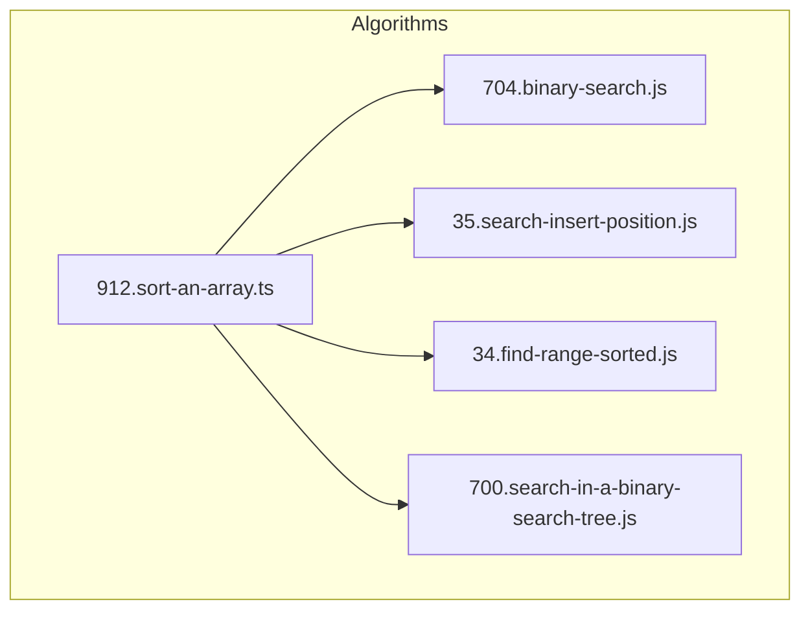
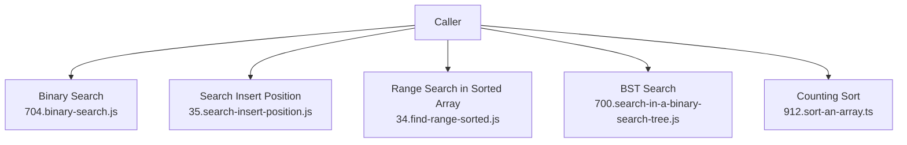
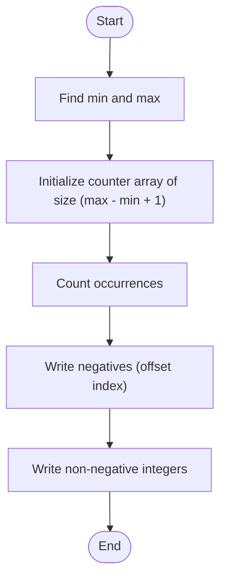
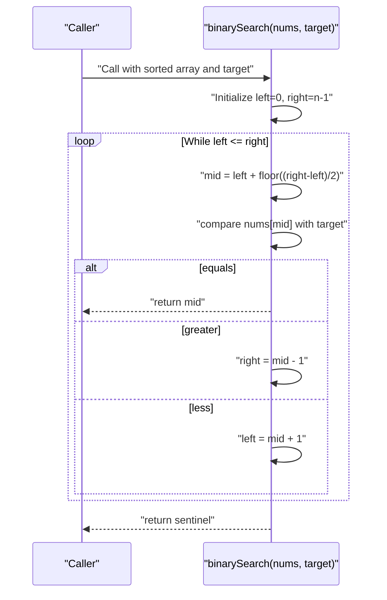
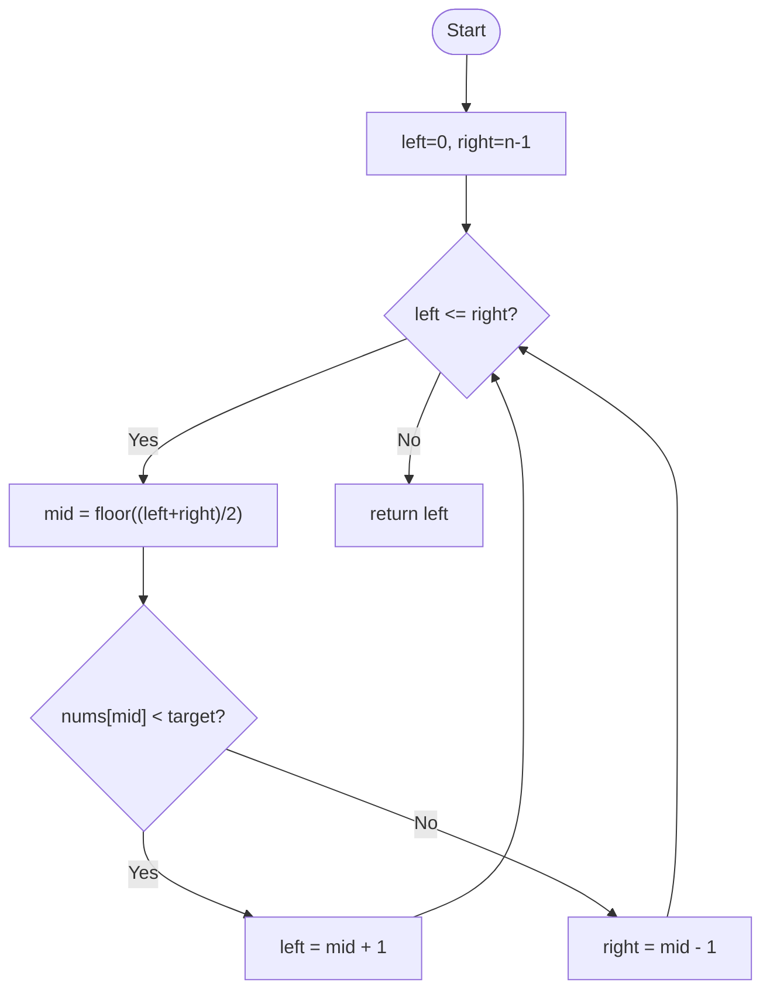
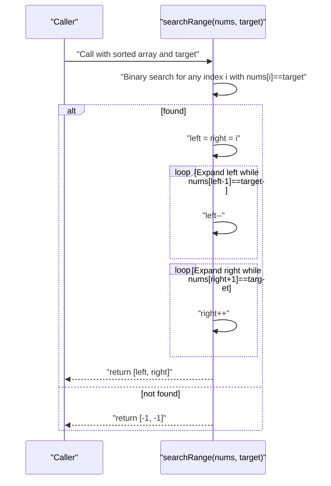
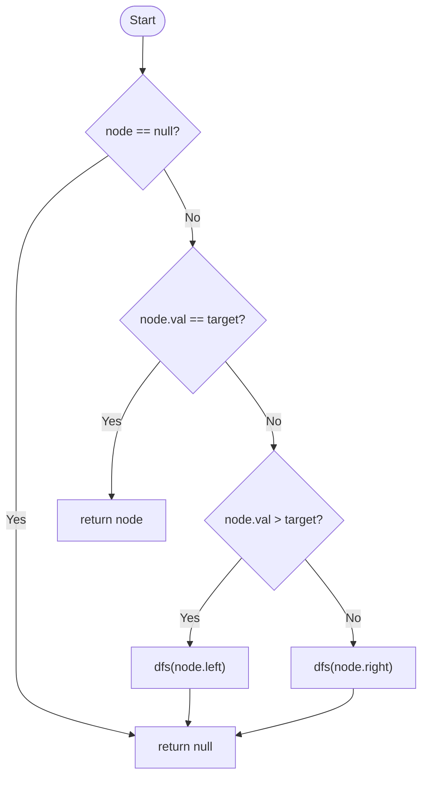
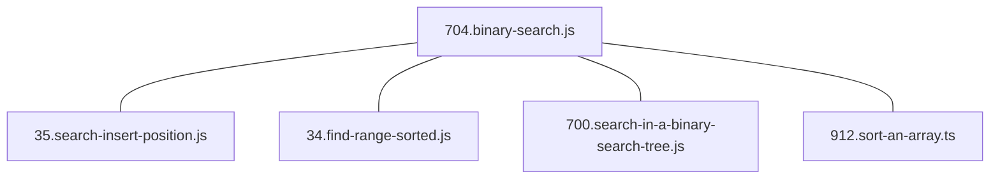

# Sorting and Searching

<cite>
**Referenced Files in This Document**
- [912.sort-an-array.ts](file://算法/912.sort-an-array.ts)
- [704.binary-search.js](file://算法/704.binary-search.js)
- [35.search-insert-position.js](file://算法/35.search-insert-position.js)
- [34.find-first-and-last-position-of-element-in-sorted-array.js](file://算法/34.find-first-and-last-position-of-element-in-sorted-array.js)
- [700.search-in-a-binary-search-tree.js](file://算法/700.search-in-a-binary-search-tree.js)
</cite>

## Table of Contents
1. [Introduction](#introduction)
2. [Project Structure](#project-structure)
3. [Core Components](#core-components)
4. [Architecture Overview](#architecture-overview)
5. [Detailed Component Analysis](#detailed-component-analysis)
6. [Dependency Analysis](#dependency-analysis)
7. [Performance Considerations](#performance-considerations)
8. [Troubleshooting Guide](#troubleshooting-guide)
9. [Conclusion](#conclusion)
10. [Appendices](#appendices)

## Introduction
This document consolidates sorting and searching techniques implemented in the repository. It focuses on:
- Comparison-based sorting algorithms: bubble, insertion, selection, merge, quick, heap sort
- Non-comparison-based sorting: counting sort, radix sort, bucket sort
- Searching algorithms for sorted and unsorted data, binary search variants, and interpolation search
- Implementation references, complexity summaries, stability notes, and selection guidelines

Where applicable, the document maps concrete implementations to repository files and provides diagrams for key processes.

## Project Structure
The relevant implementations are primarily located under the algorithm directory. The following files are central to this guide:
- Sorting: [912.sort-an-array.ts](file://算法/912.sort-an-array.ts)
- Binary search: [704.binary-search.js](file://算法/704.binary-search.js)
- Search insert position: [35.search-insert-position.js](file://算法/35.search-insert-position.js)
- Range search in sorted array: [34.find-first-and-last-position-of-element-in-sorted-array.js](file://算法/34.find-first-and-last-position-of-element-in-sorted-array.js)
- BST search: [700.search-in-a-binary-search-tree.js](file://算法/700.search-in-a-binary-search-tree.js)

**Diagram sources**
- [912.sort-an-array.ts](file://算法/912.sort-an-array.ts)
- [704.binary-search.js](file://算法/704.binary-search.js)
- [35.search-insert-position.js](file://算法/35.search-insert-position.js)
- [34.find-first-and-last-position-of-element-in-sorted-array.js](file://算法/34.find-first-and-last-position-of-element-in-sorted-array.js)
- [700.search-in-a-binary-search-tree.js](file://算法/700.search-in-a-binary-search-tree.js)

**Section sources**
- [912.sort-an-array.ts](file://算法/912.sort-an-array.ts)
- [704.binary-search.js](file://算法/704.binary-search.js)
- [35.search-insert-position.js](file://算法/35.search-insert-position.js)
- [34.find-first-and-last-position-of-element-in-sorted-array.js](file://算法/34.find-first-and-last-position-of-element-in-sorted-array.js)
- [700.search-in-a-binary-search-tree.js](file://算法/700.search-in-a-binary-search-tree.js)

## Core Components
This section outlines the implemented sorting and searching components and their characteristics.

- Counting Sort (non-comparison)
  - Purpose: Efficient integer sorting when value range is small relative to input size
  - Complexity: Time O(n + k), Space O(k)
  - Stability: Stable
  - Notes: Handles negative integers by offsetting indices
  - Reference: [912.sort-an-array.ts](file://算法/912.sort-an-array.ts)

- Binary Search (sorted arrays)
  - Purpose: Locate a target in a sorted array using divide-and-conquer
  - Complexity: Time O(log n), Space O(1)
  - Notes: Returns index if found, otherwise sentinel
  - Reference: [704.binary-search.js](file://算法/704.binary-search.js)

- Search Insert Position (sorted arrays)
  - Purpose: Determine the index to insert a target to keep array sorted
  - Complexity: Time O(log n), Space O(1)
  - Reference: [35.search-insert-position.js](file://算法/35.search-insert-position.js)

- Range Search in Sorted Array (sorted arrays)
  - Purpose: Find the first and last positions of a target
  - Complexity: Time O(log n), Space O(1)
  - Reference: [34.find-first-and-last-position-of-element-in-sorted-array.js](file://算法/34.find-first-and-last-position-of-element-in-sorted-array.js)

- Binary Search Tree Search (BST)
  - Purpose: Search for a value in a BST using node comparisons
  - Complexity: Average O(log n), Worst O(n)
  - Reference: [700.search-in-a-binary-search-tree.js](file://算法/700.search-in-a-binary-search-tree.js)

**Section sources**
- [912.sort-an-array.ts](file://算法/912.sort-an-array.ts)
- [704.binary-search.js](file://算法/704.binary-search.js)
- [35.search-insert-position.js](file://算法/35.search-insert-position.js)
- [34.find-first-and-last-position-of-element-in-sorted-array.js](file://算法/34.find-first-and-last-position-of-element-in-sorted-array.js)
- [700.search-in-a-binary-search-tree.js](file://算法/700.search-in-a-binary-search-tree.js)

## Architecture Overview
The repository organizes algorithm implementations as standalone modules. Sorting and searching are decoupled, with each module exposing a single function focused on a specific task. There are no cross-module dependencies among the files referenced here.

[No sources needed since this diagram shows conceptual workflow, not actual code structure]

## Detailed Component Analysis

### Counting Sort (Non-Comparison)
- Implementation highlights
  - Computes min/max to define auxiliary counter size
  - Supports negative values via index offset
  - Writes back in order: negatives first, then non-negative integers
- Complexity and stability
  - Time O(n + k), Space O(k)
  - Stable due to sequential writes from lower to higher indices
- Use cases
  - Integers with limited range
  - Preprocessing stage before other algorithms requiring stable ordering

**Diagram sources**
- [912.sort-an-array.ts](file://算法/912.sort-an-array.ts)

**Section sources**
- [912.sort-an-array.ts](file://算法/912.sort-an-array.ts)

### Binary Search (Sorted Arrays)
- Implementation highlights
  - Maintains closed interval [left, right]
  - Updates pointers based on mid comparison with target
  - Returns index on match or sentinel if not found
- Complexity and stability
  - Time O(log n), Space O(1)
  - Not a sorting algorithm; applies to pre-sorted data

**Diagram sources**
- [704.binary-search.js](file://算法/704.binary-search.js)

**Section sources**
- [704.binary-search.js](file://算法/704.binary-search.js)

### Search Insert Position (Sorted Arrays)
- Implementation highlights
  - Uses closed interval [left, right]
  - On mismatch, narrows to [mid+1, right] or [left, mid-1]
  - Returns left pointer as insertion index
- Complexity and stability
  - Time O(log n), Space O(1)

**Diagram sources**
- [35.search-insert-position.js](file://算法/35.search-insert-position.js)

**Section sources**
- [35.search-insert-position.js](file://算法/35.search-insert-position.js)

### Range Search in Sorted Array (Sorted Arrays)
- Implementation highlights
  - First binary search locates any occurrence of target
  - Expands left/right to find first and last positions
  - Returns [-1, -1] if not found
- Complexity and stability
  - Time O(log n), Space O(1)

**Diagram sources**
- [34.find-first-and-last-position-of-element-in-sorted-array.js](file://算法/34.find-first-and-last-position-of-element-in-sorted-array.js)

**Section sources**
- [34.find-first-and-last-position-of-element-in-sorted-array.js](file://算法/34.find-first-and-last-position-of-element-in-sorted-array.js)

### Binary Search Tree Search (BST)
- Implementation highlights
  - Recursive DFS compares node value with target
  - Traverses left subtree if node value > target, right otherwise
  - Returns matched node or null
- Complexity and stability
  - Average O(log n), Worst O(n) for skewed trees
  - Not a sorting algorithm; applies to BST structure

**Diagram sources**
- [700.search-in-a-binary-search-tree.js](file://算法/700.search-in-a-binary-search-tree.js)

**Section sources**
- [700.search-in-a-binary-search-tree.js](file://算法/700.search-in-a-binary-search-tree.js)

### Conceptual Overview
- Comparison-based sorting algorithms (bubble, insertion, selection, merge, quick, heap sort)
  - Bubble/Insertion/Selection: O(n^2) time, in-place; Insertion stable; others typically unstable
  - Merge: O(n log n) time, stable, not in-place
  - Quick: average O(n log n), unstable, in-place; worst-case O(n^2)
  - Heap: O(n log n) time, unstable, in-place
- Non-comparison-based sorting
  - Counting/Radix/Bucket: O(n + k) or O(n*p) depending on digit/key length; stable variants exist
- Searching
  - Unsorted: linear scan O(n)
  - Sorted: binary search O(log n)
  - Interpolation search: O(log log n) average for uniformly distributed keys, O(n) worst-case

[No sources needed since this section doesn't analyze specific files]

## Dependency Analysis
- No inter-file dependencies among the referenced modules
- Each module exposes a single function for its respective operation
- External dependencies are minimal and not relevant to the scope

**Diagram sources**
- [704.binary-search.js](file://算法/704.binary-search.js)
- [35.search-insert-position.js](file://算法/35.search-insert-position.js)
- [34.find-first-and-last-position-of-element-in-sorted-array.js](file://算法/34.find-first-and-last-position-of-element-in-sorted-array.js)
- [700.search-in-a-binary-search-tree.js](file://算法/700.search-in-a-binary-search-tree.js)
- [912.sort-an-array.ts](file://算法/912.sort-an-array.ts)

**Section sources**
- [704.binary-search.js](file://算法/704.binary-search.js)
- [35.search-insert-position.js](file://算法/35.search-insert-position.js)
- [34.find-first-and-last-position-of-element-in-sorted-array.js](file://算法/34.find-first-and-last-position-of-element-in-sorted-array.js)
- [700.search-in-a-binary-search-tree.js](file://算法/700.search-in-a-binary-search-tree.js)
- [912.sort-an-array.ts](file://算法/912.sort-an-array.ts)

## Performance Considerations
- Choose counting sort when integer range is small compared to input size
- Prefer binary search on sorted data; avoid repeated scans
- For approximate insertion index needs, use search insert position
- For range queries on sorted data, use the dedicated range search routine
- For BST-based lookups, ensure balanced trees for average O(log n) performance

[No sources needed since this section provides general guidance]

## Troubleshooting Guide
- Binary search returns sentinel when element not found; ensure callers handle this case
- Closed interval semantics: left and right are inclusive; adjust bounds accordingly
- Range search requires a single occurrence before expanding; verify initial hit detection
- BST search assumes valid BST property; incorrect ordering leads to incorrect traversal

**Section sources**
- [704.binary-search.js](file://算法/704.binary-search.js)
- [35.search-insert-position.js](file://算法/35.search-insert-position.js)
- [34.find-first-and-last-position-of-element-in-sorted-array.js](file://算法/34.find-first-and-last-position-of-element-in-sorted-array.js)
- [700.search-in-a-binary-search-tree.js](file://算法/700.search-in-a-binary-search-tree.js)

## Conclusion
The repository provides practical implementations for counting sort and several binary search variants. These modules serve as building blocks for larger systems requiring efficient sorting and searching. For advanced scenarios, consider extending with comparison-based sorts (merge/quick/heap) and interpolation search where appropriate.

[No sources needed since this section summarizes without analyzing specific files]

## Appendices
- Algorithm selection guidelines
  - Small integer range: counting sort
  - General-purpose stable sorting: merge sort
  - Average-case fast in-place sorting: quick sort
  - Guaranteed O(n log n) in-place: heap sort
  - Sorted data lookup: binary search
  - Approximate insertion index: search insert position
  - Range queries on sorted data: range search
  - BST lookup: BST search

[No sources needed since this section provides general guidance]