# Backend Development

<cite>
**Referenced Files in This Document**
- [Main.java](file://demo/java/xuexi/01.基础/01.变量定义/Main.java)
- [Main.java](file://demo/java/xuexi/03.引用类型/02.对象/01.基础/Main.java)
- [Main.java](file://demo/java/xuexi/04.异常处理/01.基础/Main.java)
- [01_path.ts](file://demo/node/01模块/src/01_path.ts)
- [server.js](file://demo/网络协议/http服务/服务端/server.js)
- [app.js](file://demo/网络协议/https/app.js)
- [server.js](file://demo/网络协议/tcp/server.js)
- [server.js](file://demo/网络协议/h2/server.js)
- [app.js](file://demo/网络协议/http模拟/app.js)
</cite>

## Table of Contents
1. [Introduction](#introduction)
2. [Project Structure](#project-structure)
3. [Core Components](#core-components)
4. [Architecture Overview](#architecture-overview)
5. [Detailed Component Analysis](#detailed-component-analysis)
6. [Dependency Analysis](#dependency-analysis)
7. [Performance Considerations](#performance-considerations)
8. [Troubleshooting Guide](#troubleshooting-guide)
9. [Conclusion](#conclusion)
10. [Appendices](#appendices)

## Introduction
This document provides a comprehensive guide to backend development with a focus on Node.js and Java server-side programming. It explains architecture patterns, asynchronous programming models, and practical server-side development practices. It also documents Node.js core modules (with emphasis on path utilities), file system operations, and HTTP server creation, alongside Java fundamentals including object-oriented concepts, collections, and exception handling. The content balances conceptual overviews for beginners transitioning from frontend to backend with technical depth for building scalable server applications.

## Project Structure
The repository organizes backend learning materials into two primary tracks:
- Java fundamentals and OOP: covering primitives, control flow, object modeling, and exception handling.
- Node.js and server protocols: demonstrating path utilities, HTTP/TCP/HTTPS/H2 servers, and basic HTTP simulation.

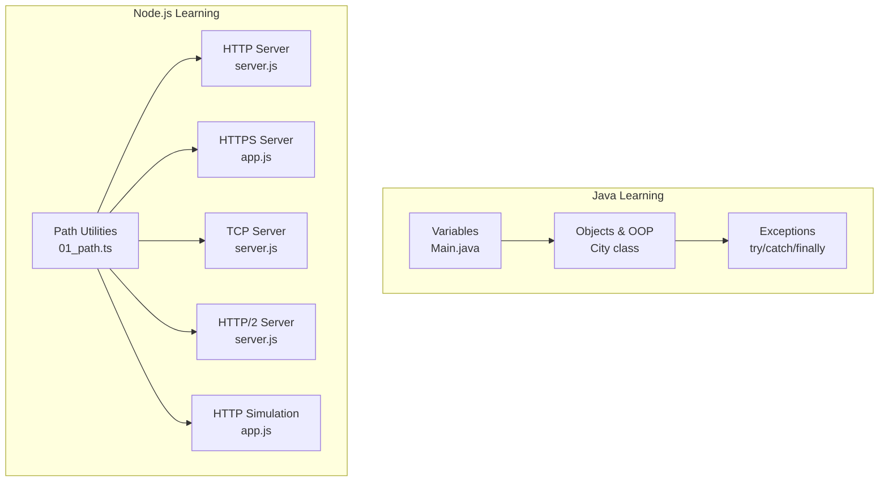

**Diagram sources**
- [Main.java:1-21](file://demo/java/xuexi/01.基础/01.变量定义/Main.java#L1-L21)
- [Main.java:1-82](file://demo/java/xuexi/03.引用类型/02.对象/01.基础/Main.java#L1-L82)
- [Main.java:1-56](file://demo/java/xuexi/04.异常处理/01.基础/Main.java#L1-L56)
- [01_path.ts:1-74](file://demo/node/01模块/src/01_path.ts#L1-L74)
- [server.js](file://demo/网络协议/http服务/服务端/server.js)
- [app.js](file://demo/网络协议/https/app.js)
- [server.js](file://demo/网络协议/tcp/server.js)
- [server.js](file://demo/网络协议/h2/server.js)
- [app.js](file://demo/网络协议/http模拟/app.js)

**Section sources**
- [Main.java:1-21](file://demo/java/xuexi/01.基础/01.变量定义/Main.java#L1-L21)
- [Main.java:1-82](file://demo/java/xuexi/03.引用类型/02.对象/01.基础/Main.java#L1-L82)
- [Main.java:1-56](file://demo/java/xuexi/04.异常处理/01.基础/Main.java#L1-L56)
- [01_path.ts:1-74](file://demo/node/01模块/src/01_path.ts#L1-L74)

## Core Components
- Node.js path utilities: Demonstrates path parsing, joining, normalization, and resolution for robust file path handling across platforms.
- HTTP/TCP/HTTPS/H2 servers: Basic server implementations to illustrate protocol differences and request handling patterns.
- Java OOP fundamentals: Classes, visibility modifiers, constructors, method overloading, static members, and exception handling patterns.

Practical takeaways:
- Use path utilities to avoid platform-specific path errors and build maintainable file resolution logic.
- Choose the right transport protocol based on performance and compatibility needs.
- Apply OOP principles and proper exception handling to keep server logic predictable and resilient.

**Section sources**
- [01_path.ts:1-74](file://demo/node/01模块/src/01_path.ts#L1-L74)
- [server.js](file://demo/网络协议/http服务/服务端/server.js)
- [app.js](file://demo/网络协议/https/app.js)
- [server.js](file://demo/网络协议/tcp/server.js)
- [server.js](file://demo/网络协议/h2/server.js)
- [Main.java:1-82](file://demo/java/xuexi/03.引用类型/02.对象/01.基础/Main.java#L1-L82)
- [Main.java:1-56](file://demo/java/xuexi/04.异常处理/01.基础/Main.java#L1-L56)

## Architecture Overview
The backend architecture can be viewed as layered:
- Protocol Layer: Handles incoming requests via HTTP/HTTPS/TCP/HTTP2.
- Application Layer: Processes requests, performs business logic, and interacts with storage or external services.
- Persistence Layer: Manages data access and caching.
- Utility Layer: Provides cross-cutting concerns like logging, error handling, and path/file operations.

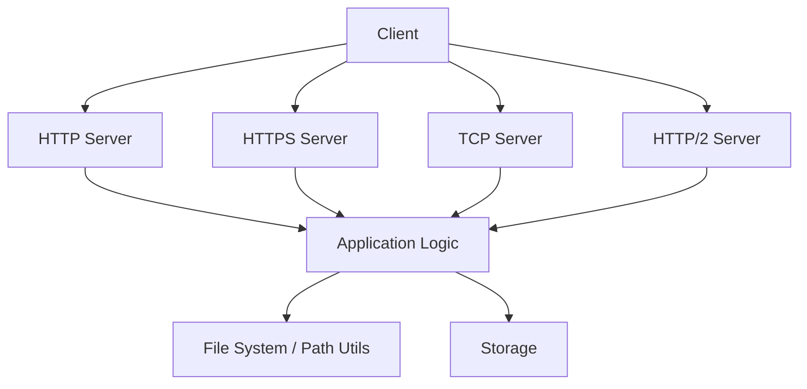

[No sources needed since this diagram shows conceptual workflow, not actual code structure]

## Detailed Component Analysis

### Node.js Path Utilities
This module demonstrates core path operations:
- basename/dirname/extname: Extract parts of a path.
- format/join/normalize/parse/resolve: Construct, join, normalize, parse, and resolve paths.

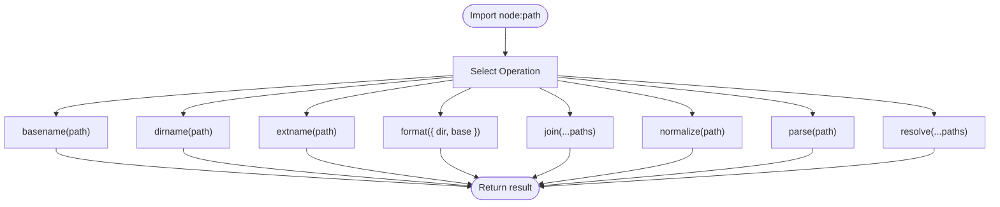

**Diagram sources**
- [01_path.ts:1-74](file://demo/node/01模块/src/01_path.ts#L1-L74)

Implementation highlights:
- Use format to construct platform-appropriate paths from components.
- Use resolve to convert relative paths to absolute ones based on current working directory.
- Use parse to decompose paths into structured components for inspection or transformation.

Best practices:
- Prefer resolve and normalize to prevent path traversal vulnerabilities.
- Use parse/format for dynamic path construction and logging.

**Section sources**
- [01_path.ts:1-74](file://demo/node/01模块/src/01_path.ts#L1-L74)

### HTTP Server Creation
Basic HTTP server implementation demonstrates request handling and response writing.

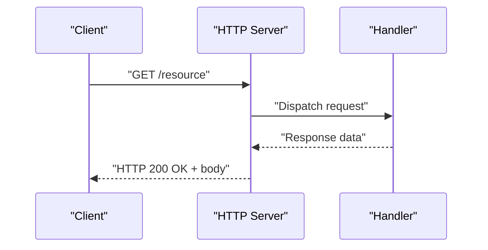

**Diagram sources**
- [server.js](file://demo/网络协议/http服务/服务端/server.js)

Operational notes:
- The server listens on a port and responds to requests synchronously.
- Suitable for learning and small-scale services; production-grade servers often add routing, middleware, and concurrency controls.

**Section sources**
- [server.js](file://demo/网络协议/http服务/服务端/server.js)

### HTTPS Server
HTTPS server adds TLS encryption to protect data in transit.

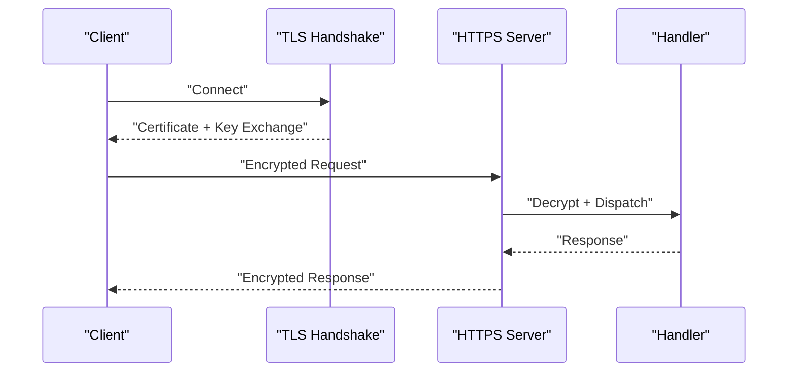

**Diagram sources**
- [app.js](file://demo/网络协议/https/app.js)

Key points:
- Certificate material is loaded to establish trust and secure communication.
- Use HTTPS for APIs handling sensitive data.

**Section sources**
- [app.js](file://demo/网络协议/https/app.js)

### TCP Server
TCP server illustrates low-level socket handling for custom protocols or binary data.

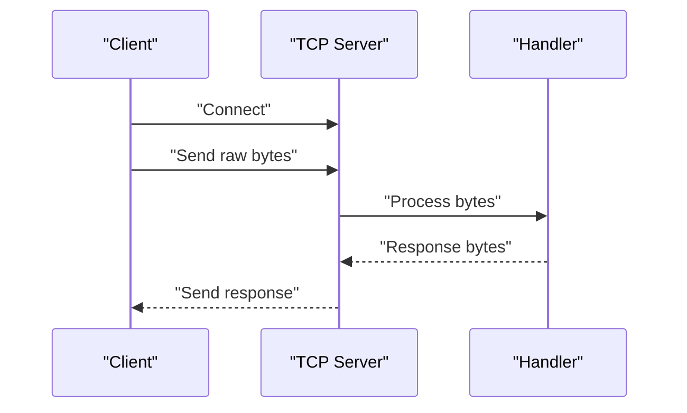

**Diagram sources**
- [server.js](file://demo/网络协议/tcp/server.js)

Guidance:
- Implement framing and serialization for structured messages.
- Handle connection lifecycle (open/close) and backpressure.

**Section sources**
- [server.js](file://demo/网络协议/tcp/server.js)

### HTTP/2 Server
HTTP/2 server showcases multiplexed streams and header compression.

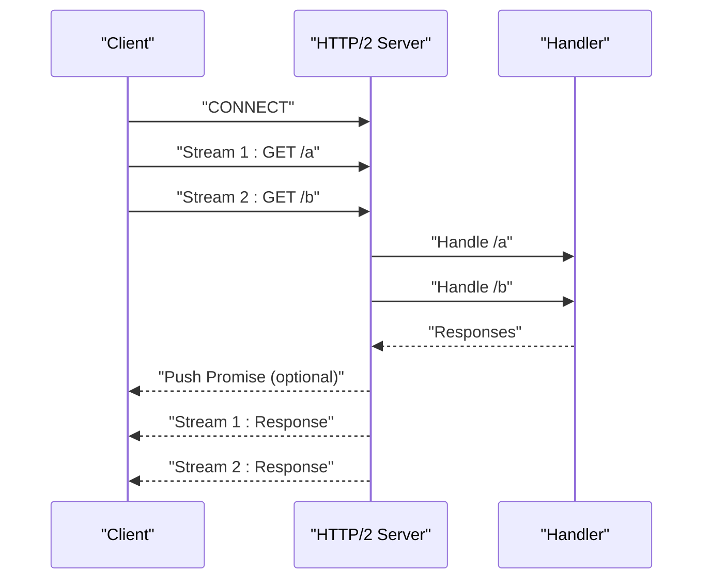

**Diagram sources**
- [server.js](file://demo/网络协议/h2/server.js)

Notes:
- Multiplexing reduces latency for concurrent requests.
- Use push promises judiciously to improve perceived performance.

**Section sources**
- [server.js](file://demo/网络协议/h2/server.js)

### Java OOP Fundamentals
This section covers class definition, visibility, constructors, method overloading, static members, and exception handling.

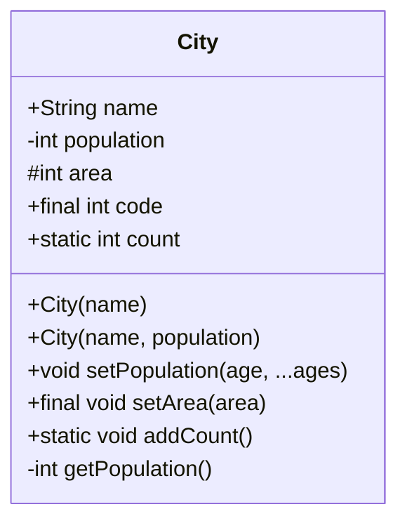

**Diagram sources**
- [Main.java:1-82](file://demo/java/xuexi/03.引用类型/02.对象/01.基础/Main.java#L1-L82)

Key concepts:
- Visibility modifiers control access: public, private, protected, and package-private.
- Static members belong to the class; they are accessed via the class name and cannot use this.
- Constructors enable flexible initialization and can chain via this().
- Method overloading is determined by parameter signature, not return type.
- Final fields/methods prevent modification or overriding.

Best practices:
- Encapsulate state with private fields and controlled accessors.
- Use static helpers for utility functions that do not rely on instance state.

**Section sources**
- [Main.java:1-82](file://demo/java/xuexi/03.引用类型/02.对象/01.基础/Main.java#L1-L82)

### Exception Handling Patterns
Exception handling demonstrates try/catch/finally blocks, multi-catch, and throwing exceptions.

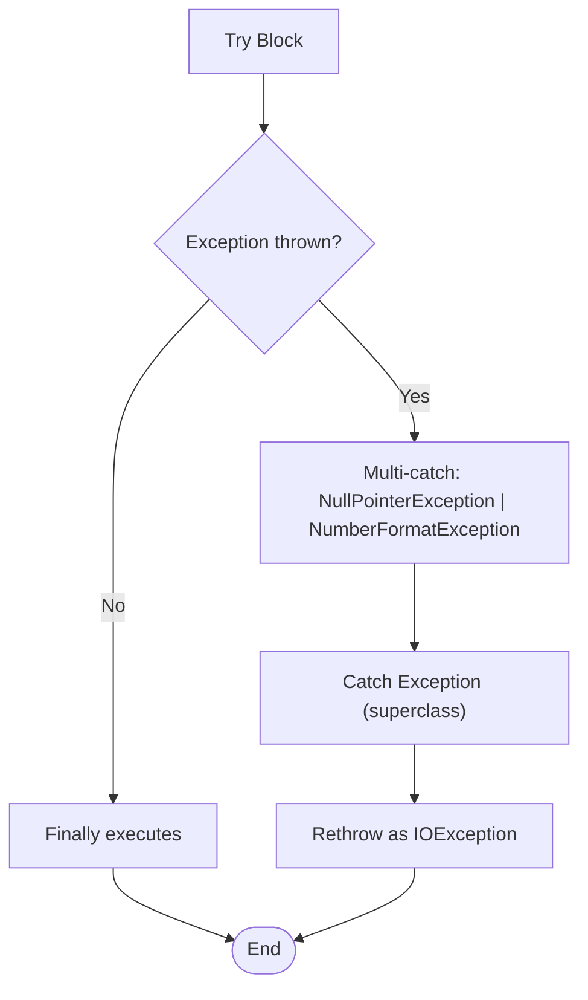

**Diagram sources**
- [Main.java:1-56](file://demo/java/xuexi/04.异常处理/01.基础/Main.java#L1-L56)

Guidelines:
- Order catch blocks from most specific to most general.
- Use finally for cleanup tasks that must run regardless of exceptions.
- Wrap caught exceptions with higher-level exceptions to preserve context.

**Section sources**
- [Main.java:1-56](file://demo/java/xuexi/04.异常处理/01.基础/Main.java#L1-L56)

### HTTP Simulation Example
This example simulates HTTP interactions for testing or prototyping.

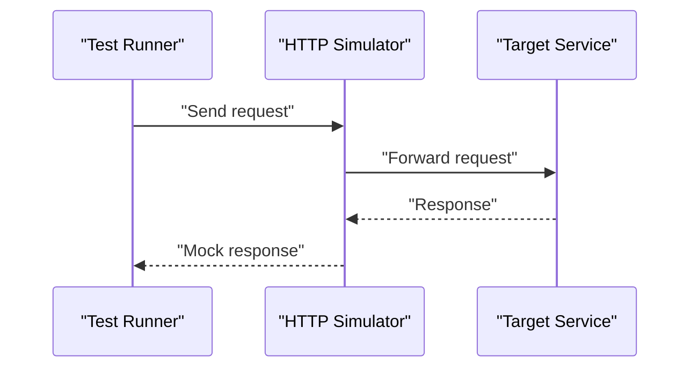

**Diagram sources**
- [app.js](file://demo/网络协议/http模拟/app.js)

Usage:
- Useful for load testing, contract verification, or isolating service dependencies during development.

**Section sources**
- [app.js](file://demo/网络协议/http模拟/app.js)

## Dependency Analysis
- Node.js path utilities depend on the built-in node:path module and operate independently of network stacks.
- HTTP/HTTPS/TCP/H2 servers are standalone protocol handlers; they can be composed with application logic and file system utilities.
- Java OOP components (classes, methods, visibility) form the foundation for larger systems and integrate with exception handling and collections.

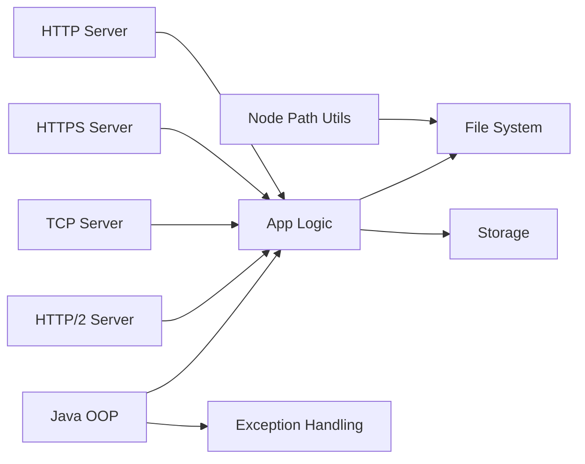

[No sources needed since this diagram shows conceptual relationships, not specific code structure]

## Performance Considerations
- Choose the appropriate protocol: HTTP/2 for multiplexing and compression; HTTPS for security; TCP for custom protocols.
- Normalize and resolve paths early to avoid repeated computation and reduce risk of path traversal.
- Minimize blocking operations in request handlers; offload heavy work to worker pools or async services.
- Use static helpers judiciously; avoid unnecessary allocations in hot paths.

[No sources needed since this section provides general guidance]

## Troubleshooting Guide
Common issues and remedies:
- Path resolution failures: Verify platform separators and use normalize/resolve consistently.
- Incorrect catch ordering: Place more specific exceptions before general ones.
- Resource leaks: Ensure finally blocks release resources or use try-with-resources equivalents.
- Protocol mismatch: Confirm client-server protocol alignment (HTTP vs HTTPS vs TCP vs HTTP/2).

**Section sources**
- [01_path.ts:1-74](file://demo/node/01模块/src/01_path.ts#L1-L74)
- [Main.java:1-56](file://demo/java/xuexi/04.异常处理/01.基础/Main.java#L1-L56)

## Conclusion
Backend development spans protocol selection, path/file operations, and robust error handling. Node.js path utilities and server examples provide a practical foundation for building scalable services. Java OOP and exception handling patterns reinforce reliable, maintainable server logic. By combining these concepts—layered architecture, protocol awareness, and disciplined error handling—you can develop efficient and secure backend systems.

[No sources needed since this section summarizes without analyzing specific files]

## Appendices
- Beginner checklist:
  - Understand protocol differences and choose the right transport.
  - Use path utilities to manage file locations safely.
  - Model domain logic with clear OOP abstractions.
  - Handle exceptions with precise catch blocks and meaningful rethrows.
- Advanced topics to explore:
  - Asynchronous patterns (callbacks/promises/async-await).
  - Middleware and routing frameworks.
  - Caching strategies and database integration.
  - Security hardening (input validation, rate limiting, secure headers).

[No sources needed since this section provides general guidance]