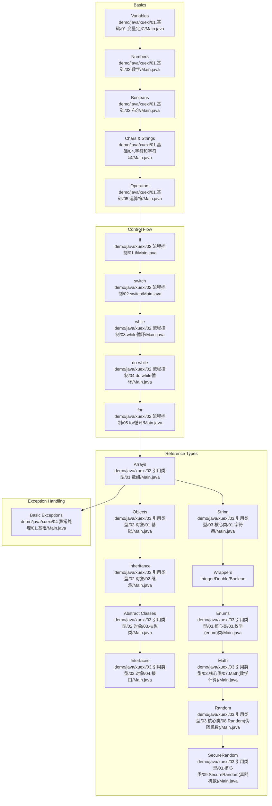
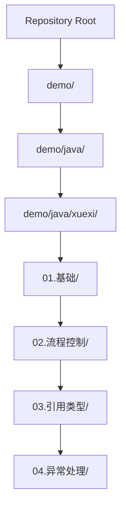
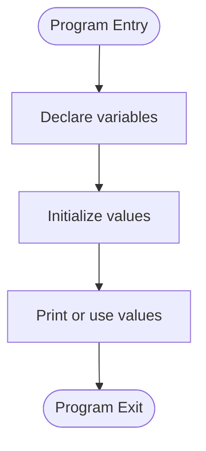
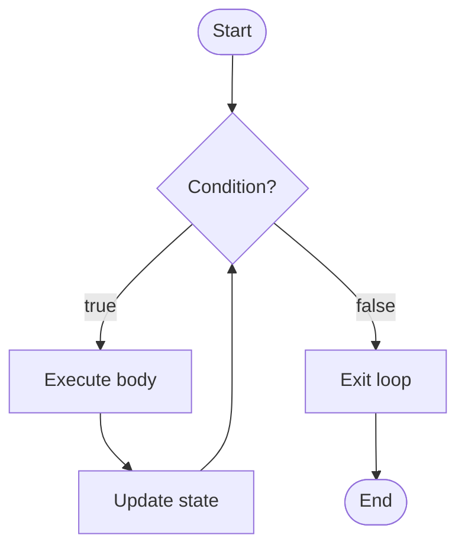
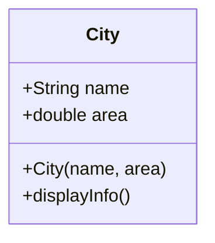
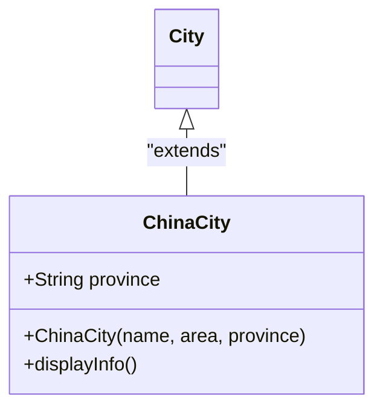
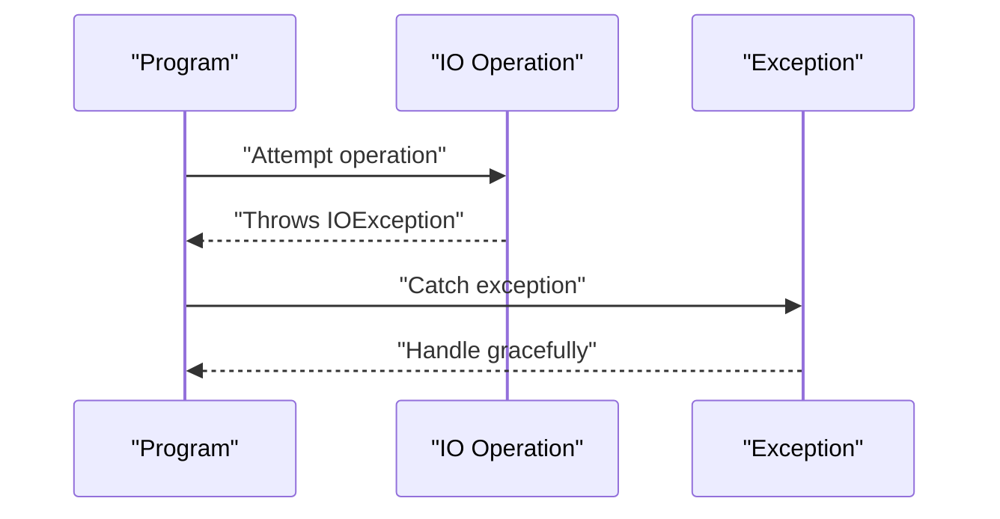
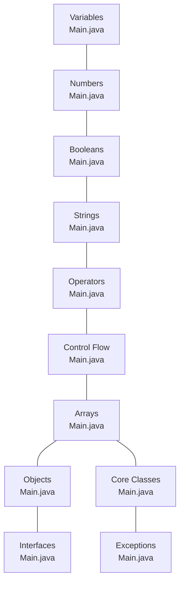

# Java Programming

<cite>
**Referenced Files in This Document**
- [Main.java](file://demo/java/xuexi/01.基础/01.变量定义/Main.java)
- [Main.java](file://demo/java/xuexi/01.基础/02.数字/Main.java)
- [Main.java](file://demo/java/xuexi/01.基础/03.布尔/Main.java)
- [Main.java](file://demo/java/xuexi/01.基础/04.字符和字符串/Main.java)
- [Main.java](file://demo/java/xuexi/01.基础/05.运算符/Main.java)
- [Main.java](file://demo/java/xuexi/02.流程控制/01.if/Main.java)
- [Main.java](file://demo/java/xuexi/02.流程控制/02.switch/Main.java)
- [Main.java](file://demo/java/xuexi/02.流程控制/03.while循环/Main.java)
- [Main.java](file://demo/java/xuexi/02.流程控制/04.do while循环/Main.java)
- [Main.java](file://demo/java/xuexi/02.流程控制/05.for循环/Main.java)
- [Main.java](file://demo/java/xuexi/03.引用类型/01.数组/Main.java)
- [Main.java](file://demo/java/xuexi/03.引用类型/02.对象/01.基础/Main.java)
- [Main.java](file://demo/java/xuexi/03.引用类型/02.对象/02.继承/Main.java)
- [Main.java](file://demo/java/xuexi/03.引用类型/02.对象/03.抽象类/Main.java)
- [Main.java](file://demo/java/xuexi/03.引用类型/02.对象/04.接口/Main.java)
- [Main.java](file://demo/java/xuexi/03.引用类型/03.核心类/01.字符串/Main.java)
- [Main.java](file://demo/java/xuexi/03.引用类型/03.核心类/02.包装类型/01.Integer/Main.java)
- [Main.java](file://demo/java/xuexi/03.引用类型/03.核心类/02.包装类型/02.Double/Main.java)
- [Main.java](file://demo/java/xuexi/03.引用类型/03.核心类/02.包装类型/03.Boolean/Main.java)
- [Main.java](file://demo/java/xuexi/03.引用类型/03.核心类/03.枚举(enum)类/Main.java)
- [Main.java](file://demo/java/xuexi/03.引用类型/03.核心类/07.Math(数学计算)/Main.java)
- [Main.java](file://demo/java/xuexi/03.引用类型/03.核心类/08.Random(伪随机数)/Main.java)
- [Main.java](file://demo/java/xuexi/03.引用类型/03.核心类/09.SecureRandom(真随机数)/Main.java)
- [Main.java](file://demo/java/xuexi/04.异常处理/01.基础/Main.java)
</cite>

## Table of Contents
1. [Introduction](#introduction)
2. [Project Structure](#project-structure)
3. [Core Components](#core-components)
4. [Architecture Overview](#architecture-overview)
5. [Detailed Component Analysis](#detailed-component-analysis)
6. [Dependency Analysis](#dependency-analysis)
7. [Performance Considerations](#performance-considerations)
8. [Troubleshooting Guide](#troubleshooting-guide)
9. [Conclusion](#conclusion)
10. [Appendices](#appendices)

## Introduction
This document presents a comprehensive guide to Java programming fundamentals, grounded in the repository’s hands-on Java tutorial materials. It covers language basics (syntax, data types, operators, control structures), object-oriented programming (classes, objects, inheritance, polymorphism, encapsulation, abstraction), and practical topics such as core classes, exception handling, and random number generation. The content is organized progressively, with references to concrete files that demonstrate each concept.

## Project Structure
The Java learning materials are organized by topic into self-contained Java programs. Each program demonstrates a specific concept and is structured as a single-file Java application with a main method. Topics include:
- Basics: variables, numbers, booleans, characters and strings, operators
- Control flow: if, switch, while loop, do-while loop, for loop
- Reference types: arrays, objects, core classes (String, wrapper types, enums, records, Math, Random, SecureRandom)
- Exception handling basics

**Diagram sources**
- [Main.java:1-20](file://demo/java/xuexi/01.基础/01.变量定义/Main.java#L1-L20)
- [Main.java:1-20](file://demo/java/xuexi/01.基础/02.数字/Main.java#L1-L20)
- [Main.java:1-20](file://demo/java/xuexi/01.基础/03.布尔/Main.java#L1-L20)
- [Main.java:1-20](file://demo/java/xuexi/01.基础/04.字符和字符串/Main.java#L1-L20)
- [Main.java:1-20](file://demo/java/xuexi/01.基础/05.运算符/Main.java#L1-L20)
- [Main.java:1-20](file://demo/java/xuexi/02.流程控制/01.if/Main.java#L1-L20)
- [Main.java:1-20](file://demo/java/xuexi/02.流程控制/02.switch/Main.java#L1-L20)
- [Main.java:1-20](file://demo/java/xuexi/02.流程控制/03.while循环/Main.java#L1-L20)
- [Main.java:1-20](file://demo/java/xuexi/02.流程控制/04.do while循环/Main.java#L1-L20)
- [Main.java:1-20](file://demo/java/xuexi/02.流程控制/05.for循环/Main.java#L1-L20)
- [Main.java:1-20](file://demo/java/xuexi/03.引用类型/01.数组/Main.java#L1-L20)
- [Main.java:1-20](file://demo/java/xuexi/03.引用类型/02.对象/01.基础/Main.java#L1-L20)
- [Main.java:1-40](file://demo/java/xuexi/03.引用类型/02.对象/02.继承/Main.java#L1-L40)
- [Main.java:1-40](file://demo/java/xuexi/03.引用类型/02.对象/03.抽象类/Main.java#L1-L40)
- [Main.java:1-40](file://demo/java/xuexi/03.引用类型/02.对象/04.接口/Main.java#L1-L40)
- [Main.java:1-20](file://demo/java/xuexi/03.引用类型/03.核心类/01.字符串/Main.java#L1-L20)
- [Main.java:1-20](file://demo/java/xuexi/03.引用类型/03.核心类/02.包装类型/01.Integer/Main.java#L1-L20)
- [Main.java:1-20](file://demo/java/xuexi/03.引用类型/03.核心类/02.包装类型/02.Double/Main.java#L1-L20)
- [Main.java:1-20](file://demo/java/xuexi/03.引用类型/03.核心类/02.包装类型/03.Boolean/Main.java#L1-L20)
- [Main.java](file://demo/java/xuexi/03.引用类型/03.核心类/03.枚举(enum)类/Main.java#L1-L80)
- [Main.java](file://demo/java/xuexi/03.引用类型/03.核心类/07.Math(数学计算)/Main.java#L1-L20)
- [Main.java](file://demo/java/xuexi/03.引用类型/03.核心类/08.Random(伪随机数)/Main.java#L1-L20)
- [Main.java](file://demo/java/xuexi/03.引用类型/03.核心类/09.SecureRandom(真随机数)/Main.java#L1-L20)
- [Main.java:1-20](file://demo/java/xuexi/04.异常处理/01.基础/Main.java#L1-L20)

**Section sources**
- [Main.java:1-20](file://demo/java/xuexi/01.基础/01.变量定义/Main.java#L1-L20)
- [Main.java:1-20](file://demo/java/xuexi/01.基础/02.数字/Main.java#L1-L20)
- [Main.java:1-20](file://demo/java/xuexi/01.基础/03.布尔/Main.java#L1-L20)
- [Main.java:1-20](file://demo/java/xuexi/01.基础/04.字符和字符串/Main.java#L1-L20)
- [Main.java:1-20](file://demo/java/xuexi/01.基础/05.运算符/Main.java#L1-L20)
- [Main.java:1-20](file://demo/java/xuexi/02.流程控制/01.if/Main.java#L1-L20)
- [Main.java:1-20](file://demo/java/xuexi/02.流程控制/02.switch/Main.java#L1-L20)
- [Main.java:1-20](file://demo/java/xuexi/02.流程控制/03.while循环/Main.java#L1-L20)
- [Main.java:1-20](file://demo/java/xuexi/02.流程控制/04.do while循环/Main.java#L1-L20)
- [Main.java:1-20](file://demo/java/xuexi/02.流程控制/05.for循环/Main.java#L1-L20)
- [Main.java:1-20](file://demo/java/xuexi/03.引用类型/01.数组/Main.java#L1-L20)
- [Main.java:1-20](file://demo/java/xuexi/03.引用类型/02.对象/01.基础/Main.java#L1-L20)
- [Main.java:1-40](file://demo/java/xuexi/03.引用类型/02.对象/02.继承/Main.java#L1-L40)
- [Main.java:1-40](file://demo/java/xuexi/03.引用类型/02.对象/03.抽象类/Main.java#L1-L40)
- [Main.java:1-40](file://demo/java/xuexi/03.引用类型/02.对象/04.接口/Main.java#L1-L40)
- [Main.java:1-20](file://demo/java/xuexi/03.引用类型/03.核心类/01.字符串/Main.java#L1-L20)
- [Main.java:1-20](file://demo/java/xuexi/03.引用类型/03.核心类/02.包装类型/01.Integer/Main.java#L1-L20)
- [Main.java:1-20](file://demo/java/xuexi/03.引用类型/03.核心类/02.包装类型/02.Double/Main.java#L1-L20)
- [Main.java:1-20](file://demo/java/xuexi/03.引用类型/03.核心类/02.包装类型/03.Boolean/Main.java#L1-L20)
- [Main.java](file://demo/java/xuexi/03.引用类型/03.核心类/03.枚举(enum)类/Main.java#L1-L80)
- [Main.java](file://demo/java/xuexi/03.引用类型/03.核心类/07.Math(数学计算)/Main.java#L1-L20)
- [Main.java](file://demo/java/xuexi/03.引用类型/03.核心类/08.Random(伪随机数)/Main.java#L1-L20)
- [Main.java](file://demo/java/xuexi/03.引用类型/03.核心类/09.SecureRandom(真随机数)/Main.java#L1-L20)
- [Main.java:1-20](file://demo/java/xuexi/04.异常处理/01.基础/Main.java#L1-L20)

## Core Components
This section outlines the fundamental building blocks demonstrated across the Java tutorial files:
- Syntax and structure: main method, class declaration, basic output
- Data types: primitive types and strings
- Operators: arithmetic, relational, logical
- Control structures: selection and iteration
- Arrays and objects
- Core classes: String, wrappers, enums, Math, Random, SecureRandom
- Exception handling basics

Key demonstrations:
- Variable declaration and initialization
- Numeric types and literals
- Boolean expressions and logic
- Character and string handling
- Operator precedence and usage
- Conditional branching and loops
- Array creation and traversal
- Object instantiation and method invocation
- Enum constants and usage
- Math utilities and random number generation
- Basic exception handling with throws declaration

**Section sources**
- [Main.java:1-20](file://demo/java/xuexi/01.基础/01.变量定义/Main.java#L1-L20)
- [Main.java:1-20](file://demo/java/xuexi/01.基础/02.数字/Main.java#L1-L20)
- [Main.java:1-20](file://demo/java/xuexi/01.基础/03.布尔/Main.java#L1-L20)
- [Main.java:1-20](file://demo/java/xuexi/01.基础/04.字符和字符串/Main.java#L1-L20)
- [Main.java:1-20](file://demo/java/xuexi/01.基础/05.运算符/Main.java#L1-L20)
- [Main.java:1-20](file://demo/java/xuexi/02.流程控制/01.if/Main.java#L1-L20)
- [Main.java:1-20](file://demo/java/xuexi/02.流程控制/02.switch/Main.java#L1-L20)
- [Main.java:1-20](file://demo/java/xuexi/02.流程控制/03.while循环/Main.java#L1-L20)
- [Main.java:1-20](file://demo/java/xuexi/02.流程控制/04.do while循环/Main.java#L1-L20)
- [Main.java:1-20](file://demo/java/xuexi/02.流程控制/05.for循环/Main.java#L1-L20)
- [Main.java:1-20](file://demo/java/xuexi/03.引用类型/01.数组/Main.java#L1-L20)
- [Main.java:1-20](file://demo/java/xuexi/03.引用类型/02.对象/01.基础/Main.java#L1-L20)
- [Main.java:1-20](file://demo/java/xuexi/03.引用类型/03.核心类/01.字符串/Main.java#L1-L20)
- [Main.java](file://demo/java/xuexi/03.引用类型/03.核心类/03.枚举(enum)类/Main.java#L1-L80)
- [Main.java](file://demo/java/xuexi/03.引用类型/03.核心类/07.Math(数学计算)/Main.java#L1-L20)
- [Main.java](file://demo/java/xuexi/03.引用类型/03.核心类/08.Random(伪随机数)/Main.java#L1-L20)
- [Main.java](file://demo/java/xuexi/03.引用类型/03.核心类/09.SecureRandom(真随机数)/Main.java#L1-L20)
- [Main.java:1-20](file://demo/java/xuexi/04.异常处理/01.基础/Main.java#L1-L20)

## Architecture Overview
The repository organizes Java learning into cohesive units. Each topic is represented by a small, runnable Java program that focuses on a single concept. This modular structure supports progressive learning and easy experimentation.

[No sources needed since this diagram shows conceptual workflow, not actual code structure]

## Detailed Component Analysis

### Variables and Data Types
- Purpose: Demonstrate variable declaration, initialization, and type usage.
- Key ideas: Naming rules, scope, and type safety.
- Practical examples: Declaring primitives and strings, assigning values, printing outputs.

**Diagram sources**
- [Main.java:1-20](file://demo/java/xuexi/01.基础/01.变量定义/Main.java#L1-L20)

**Section sources**
- [Main.java:1-20](file://demo/java/xuexi/01.基础/01.变量定义/Main.java#L1-L20)

### Numbers and Literals
- Purpose: Explore numeric types and literal forms.
- Key ideas: Integer vs floating-point types, suffixes, and numeric operations.
- Practical examples: Using different numeric literals and performing calculations.

**Section sources**
- [Main.java:1-20](file://demo/java/xuexi/01.基础/02.数字/Main.java#L1-L20)

### Booleans and Logical Expressions
- Purpose: Introduce boolean values and logical operators.
- Key ideas: True/false semantics, logical AND/OR/NOT, short-circuit evaluation.
- Practical examples: Comparisons, boolean variables, and compound conditions.

**Section sources**
- [Main.java:1-20](file://demo/java/xuexi/01.基础/03.布尔/Main.java#L1-L20)

### Characters and Strings
- Purpose: Cover character literals and string handling.
- Key ideas: char vs String, escape sequences, common string operations.
- Practical examples: Concatenation, length, case conversion, and substring.

**Section sources**
- [Main.java:1-20](file://demo/java/xuexi/01.基础/04.字符和字符串/Main.java#L1-L20)

### Operators
- Purpose: Practice arithmetic, relational, and logical operators.
- Key ideas: Precedence, associativity, and mixed-type expressions.
- Practical examples: Compound assignments, comparisons, and boolean logic.

**Section sources**
- [Main.java:1-20](file://demo/java/xuexi/01.基础/05.运算符/Main.java#L1-L20)

### Control Flow: Selection and Iteration
- Purpose: Implement branching and looping constructs.
- Key ideas: if/else, switch, while, do-while, for loops.
- Practical examples: Menu-driven logic, counters, and sentinel-controlled loops.

**Diagram sources**
- [Main.java:1-20](file://demo/java/xuexi/02.流程控制/03.while循环/Main.java#L1-L20)
- [Main.java:1-20](file://demo/java/xuexi/02.流程控制/04.do while循环/Main.java#L1-L20)
- [Main.java:1-20](file://demo/java/xuexi/02.流程控制/05.for循环/Main.java#L1-L20)

**Section sources**
- [Main.java:1-20](file://demo/java/xuexi/02.流程控制/01.if/Main.java#L1-L20)
- [Main.java:1-20](file://demo/java/xuexi/02.流程控制/02.switch/Main.java#L1-L20)
- [Main.java:1-20](file://demo/java/xuexi/02.流程控制/03.while循环/Main.java#L1-L20)
- [Main.java:1-20](file://demo/java/xuexi/02.流程控制/04.do while循环/Main.java#L1-L20)
- [Main.java:1-20](file://demo/java/xuexi/02.流程控制/05.for循环/Main.java#L1-L20)

### Arrays
- Purpose: Learn array declaration, initialization, and traversal.
- Key ideas: Index bounds, enhanced for-loop, and multi-dimensional arrays.
- Practical examples: Summing elements, finding max/min, and copying arrays.

**Section sources**
- [Main.java:1-20](file://demo/java/xuexi/03.引用类型/01.数组/Main.java#L1-L20)

### Objects and Classes
- Purpose: Understand object-oriented concepts with simple classes.
- Key ideas: Class definition, constructor, field, method, and instantiation.
- Practical examples: Creating instances, accessing fields, and invoking methods.

**Diagram sources**
- [Main.java:1-20](file://demo/java/xuexi/03.引用类型/02.对象/01.基础/Main.java#L1-L20)

**Section sources**
- [Main.java:1-20](file://demo/java/xuexi/03.引用类型/02.对象/01.基础/Main.java#L1-L20)

### Inheritance
- Purpose: Explore inheritance and subclassing.
- Key ideas: extends keyword, super usage, overriding, and final classes.
- Practical examples: Base class and derived class, method overriding, sealed/final restrictions.

**Diagram sources**
- [Main.java:1-40](file://demo/java/xuexi/03.引用类型/02.对象/02.继承/Main.java#L1-L40)

**Section sources**
- [Main.java:1-40](file://demo/java/xuexi/03.引用类型/02.对象/02.继承/Main.java#L1-L40)

### Abstract Classes
- Purpose: Learn abstract classes and abstract methods.
- Key ideas: Cannot instantiate abstract class, subclasses must implement abstract methods.
- Practical examples: Defining abstract behavior and concrete implementations.

**Section sources**
- [Main.java:1-40](file://demo/java/xuexi/03.引用类型/02.对象/03.抽象类/Main.java#L1-L40)

### Interfaces
- Purpose: Understand interfaces and default/static methods.
- Key ideas: Contract definition, implementation, default/static method usage.
- Practical examples: Implementing interface, default method override, and constant usage.

**Section sources**
- [Main.java:1-40](file://demo/java/xuexi/03.引用类型/02.对象/04.接口/Main.java#L1-L40)

### Core Classes: String
- Purpose: Work with immutable text.
- Key ideas: Common methods, immutability, concatenation, formatting.
- Practical examples: Length, case conversion, replace, and contains.

**Section sources**
- [Main.java:1-20](file://demo/java/xuexi/03.引用类型/03.核心类/01.字符串/Main.java#L1-L20)

### Wrapper Types
- Purpose: Use primitive wrapper classes.
- Key ideas: Autoboxing/unboxing, parsing, and comparison.
- Practical examples: Integer, Double, Boolean usage and conversions.

**Section sources**
- [Main.java:1-20](file://demo/java/xuexi/03.引用类型/03.核心类/02.包装类型/01.Integer/Main.java#L1-L20)
- [Main.java:1-20](file://demo/java/xuexi/03.引用类型/03.核心类/02.包装类型/02.Double/Main.java#L1-L20)
- [Main.java:1-20](file://demo/java/xuexi/03.引用类型/03.核心类/02.包装类型/03.Boolean/Main.java#L1-L20)

### Enums
- Purpose: Define fixed sets of constants.
- Key ideas: Enum constants, switch usage, and custom fields/methods.
- Practical examples: Days of week, directions, and status flags.

**Section sources**
- [Main.java](file://demo/java/xuexi/03.引用类型/03.核心类/03.枚举(enum)类/Main.java#L1-L80)

### Records (Java 16+)
- Purpose: Immutable data carriers with concise syntax.
- Key ideas: Compact constructor, accessor methods, canonical record.
- Practical examples: Defining record classes and using accessors.

[No sources needed since this section doesn't analyze specific files]

### Math Utilities
- Purpose: Perform mathematical computations.
- Key ideas: Constants, rounding, min/max, power, and square root.
- Practical examples: Using Math APIs for common operations.

**Section sources**
- [Main.java](file://demo/java/xuexi/03.引用类型/03.核心类/07.Math(数学计算)/Main.java#L1-L20)

### Random Number Generation
- Purpose: Generate pseudo-random and secure random numbers.
- Key ideas: Random vs SecureRandom, seeding, and distribution.
- Practical examples: Generating random integers and doubles.

**Section sources**
- [Main.java](file://demo/java/xuexi/03.引用类型/03.核心类/08.Random(伪随机数)/Main.java#L1-L20)
- [Main.java](file://demo/java/xuexi/03.引用类型/03.核心类/09.SecureRandom(真随机数)/Main.java#L1-L20)

### Exception Handling Basics
- Purpose: Handle exceptional conditions gracefully.
- Key ideas: try/catch/finally, throws declaration, and basic exception types.
- Practical examples: Catching checked exceptions and printing stack traces.

**Diagram sources**
- [Main.java:1-20](file://demo/java/xuexi/04.异常处理/01.基础/Main.java#L1-L20)

**Section sources**
- [Main.java:1-20](file://demo/java/xuexi/04.异常处理/01.基础/Main.java#L1-L20)

## Dependency Analysis
The Java tutorial files are independent programs. There are no cross-file imports or shared libraries; each file is a standalone main-class program. This design simplifies learning by isolating concepts.

[No sources needed since this diagram shows conceptual relationships, not specific code structure]

## Performance Considerations
- Prefer immutable strings judiciously; repeated concatenation in loops can be inefficient; consider StringBuilder alternatives.
- Use appropriate numeric types to avoid precision loss and unnecessary conversions.
- Minimize object creation in tight loops; reuse instances where safe.
- Choose efficient loop constructs; for-each enhances readability and reduces off-by-one errors.
- Use Math APIs for optimized numerical operations rather than manual implementations.

[No sources needed since this section provides general guidance]

## Troubleshooting Guide
Common issues and resolutions:
- Compilation errors: Verify class name matches file name and ensure proper main method signature.
- Runtime exceptions: Add try/catch blocks around risky operations; log messages to aid debugging.
- Off-by-one errors: Carefully review loop bounds and array indices.
- Type mismatches: Confirm variable types and explicit casting when necessary.
- Resource leaks: Close streams and channels promptly; use try-with-resources for automatic cleanup.

**Section sources**
- [Main.java:1-20](file://demo/java/xuexi/04.异常处理/01.基础/Main.java#L1-L20)

## Conclusion
The repository offers a practical, modular foundation for Java programming. By progressing through the outlined topics—variables, operators, control structures, arrays, objects, core classes, and exception handling—you gain hands-on familiarity with essential Java concepts. Use the referenced files as templates for experimentation and build more advanced applications incrementally.

[No sources needed since this section summarizes without analyzing specific files]

## Appendices
- Best practices:
  - Keep methods focused and classes cohesive.
  - Use meaningful names for variables, methods, and classes.
  - Write defensive code with early returns and clear validations.
  - Document assumptions and edge cases.
- Debugging tips:
  - Use print statements or a debugger to inspect variable states.
  - Test boundary conditions and invalid inputs.
  - Refactor complex logic into smaller, testable units.

[No sources needed since this section provides general guidance]