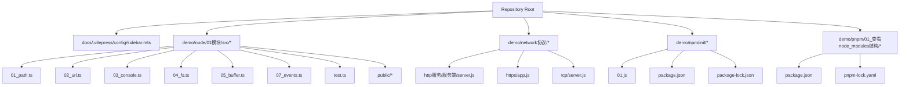
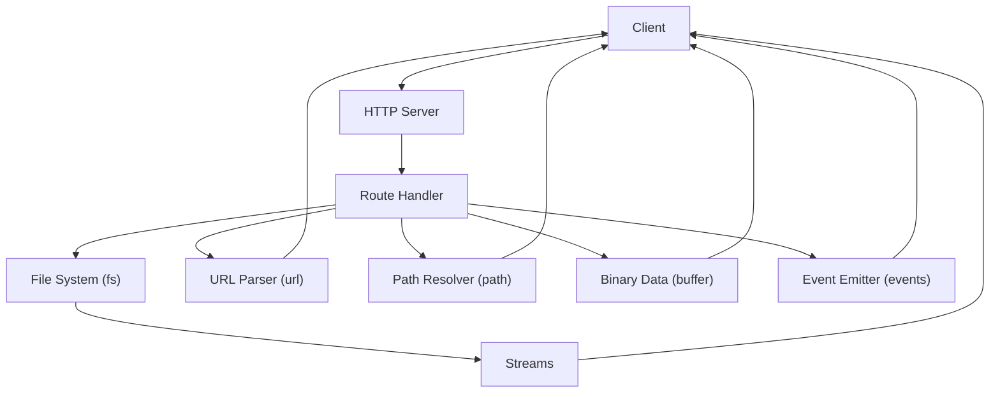
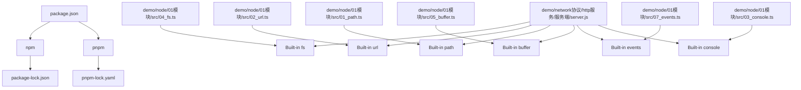

# Node.js Fundamentals

<cite>
**Referenced Files in This Document**
- [README.md](file://README.md)
- [package.json](file://package.json)
- [docs/.vitepress/config/sidebar.mts](file://docs/.vitepress/config/sidebar.mts)
- [demo/node/01模块/src/01_path.ts](file://demo/node/01模块/src/01_path.ts)
- [demo/node/01模块/src/02_url.ts](file://demo/node/01模块/src/02_url.ts)
- [demo/node/01模块/src/03_console.ts](file://demo/node/01模块/src/03_console.ts)
- [demo/node/01模块/src/04_fs.ts](file://demo/node/01模块/src/04_fs.ts)
- [demo/node/01模块/src/05_buffer.ts](file://demo/node/01模块/src/05_buffer.ts)
- [demo/node/01模块/src/07_events.ts](file://demo/node/01模块/src/07_events.ts)
- [demo/node/01模块/src/test.ts](file://demo/node/01模块/src/test.ts)
- [demo/node/01模块/public/writeStream.txt](file://demo/node/01模块/public/writeStream.txt)
- [demo/network协议/http服务/服务端/server.js](file://demo/network协议/http服务/服务端/server.js)
- [demo/network协议/https/app.js](file://demo/network协议/https/app.js)
- [demo/networkprotocol/tcp/server.js](file://demo/networkprotocol/tcp/server.js)
- [demo/npm/init/01.js](file://demo/npm/init/01.js)
- [demo/npm/init/package.json](file://demo/npm/init/package.json)
- [demo/npm/init/package-lock.json](file://demo/npm/init/package-lock.json)
- [demo/pnpm/01_查看node_modules结构/package.json](file://demo/pnpm/01_查看node_modules结构/package.json)
- [demo/pnpm/01_查看node_modules结构/pnpm-lock.yaml](file://demo/pnpm/01_查看node_modules结构/pnpm-lock.yaml)
</cite>

## Table of Contents
1. [Introduction](#introduction)
2. [Project Structure](#project-structure)
3. [Core Components](#core-components)
4. [Architecture Overview](#architecture-overview)
5. [Detailed Component Analysis](#detailed-component-analysis)
6. [Dependency Analysis](#dependency-analysis)
7. [Performance Considerations](#performance-considerations)
8. [Troubleshooting Guide](#troubleshooting-guide)
9. [Conclusion](#conclusion)
10. [Appendices](#appendices)

## Introduction
This document provides a comprehensive guide to Node.js fundamentals, focusing on core concepts, the asynchronous programming model, and server-side JavaScript development. It explains the Node.js runtime architecture, the event loop mechanism, and non-blocking I/O operations. It also documents essential built-in modules (fs, http, path, url, buffer), the module system, and npm/pnpm package management. Practical examples demonstrate creating HTTP servers, handling file operations, working with streams, and implementing basic web APIs. Finally, it outlines best practices for error handling, performance optimization, and memory management in Node.js applications.

## Project Structure
The repository organizes Node.js learning materials under the demo directory, including:
- Node module demonstrations (path, url, console, fs, buffer, events)
- Network protocol examples (HTTP, HTTPS, TCP)
- Package initialization and lock files (npm and pnpm)
- Documentation sidebar entries for Node.js topics

**Diagram sources**
- [docs/.vitepress/config/sidebar.mts:920-978](file://docs/.vitepress/config/sidebar.mts#L920-L978)
- [demo/node/01模块/src/01_path.ts](file://demo/node/01模块/src/01_path.ts)
- [demo/node/01模块/src/02_url.ts](file://demo/node/01模块/src/02_url.ts)
- [demo/node/01模块/src/03_console.ts](file://demo/node/01模块/src/03_console.ts)
- [demo/node/01模块/src/04_fs.ts](file://demo/node/01模块/src/04_fs.ts)
- [demo/node/01模块/src/05_buffer.ts](file://demo/node/01模块/src/05_buffer.ts)
- [demo/node/01模块/src/07_events.ts](file://demo/node/01模块/src/07_events.ts)
- [demo/node/01模块/src/test.ts](file://demo/node/01模块/src/test.ts)
- [demo/node/01模块/public/writeStream.txt](file://demo/node/01模块/public/writeStream.txt)
- [demo/network协议/http服务/服务端/server.js](file://demo/network协议/http服务/服务端/server.js)
- [demo/network协议/https/app.js](file://demo/network协议/https/app.js)
- [demo/networkprotocol/tcp/server.js](file://demo/networkprotocol/tcp/server.js)
- [demo/npm/init/01.js](file://demo/npm/init/01.js)
- [demo/npm/init/package.json](file://demo/npm/init/package.json)
- [demo/npm/init/package-lock.json](file://demo/npm/init/package-lock.json)
- [demo/pnpm/01_查看node_modules结构/package.json](file://demo/pnpm/01_查看node_modules结构/package.json)
- [demo/pnpm/01_查看node_modules结构/pnpm-lock.yaml](file://demo/pnpm/01_查看node_modules结构/pnpm-lock.yaml)

**Section sources**
- [README.md](file://README.md)
- [package.json](file://package.json)
- [docs/.vitepress/config/sidebar.mts:920-978](file://docs/.vitepress/config/sidebar.mts#L920-L978)

## Core Components
This section introduces the fundamental building blocks of Node.js and how they interrelate during runtime.

- Runtime and Event Loop
  - Node.js runs on the V8 engine and uses an event-driven, non-blocking I/O model. The event loop coordinates asynchronous callbacks, enabling concurrency without threads.
  - Non-blocking I/O allows operations like file reads, network requests, and database queries to proceed concurrently, freeing the main thread to handle other tasks.

- Built-in Modules Overview
  - Path: Resolves and manipulates file system paths.
  - Url: Parses and constructs URLs, supports URL and URLSearchParams.
  - Buffer: Handles binary data efficiently.
  - Events: Provides EventEmitter for publish/subscribe patterns.
  - Fs: Reads/writes files and manages file system metadata asynchronously.
  - Console: Standard output/error logging utilities.

- Module System and Package Management
  - Node.js uses CommonJS modules with require() and module.exports.
  - npm initializes projects via package.json and tracks dependencies and versions.
  - pnpm offers deterministic installs and shared storage to optimize disk usage.

Practical examples in this repository demonstrate:
- Creating HTTP servers and handling requests/responses.
- Working with file streams for efficient I/O.
- Parsing URLs and manipulating paths.
- Using Buffer for binary data.
- Emitting and listening to events.

**Section sources**
- [docs/.vitepress/config/sidebar.mts:920-978](file://docs/.vitepress/config/sidebar.mts#L920-L978)
- [demo/node/01模块/src/01_path.ts](file://demo/node/01模块/src/01_path.ts)
- [demo/node/01模块/src/02_url.ts](file://demo/node/01模块/src/02_url.ts)
- [demo/node/01模块/src/03_console.ts](file://demo/node/01模块/src/03_console.ts)
- [demo/node/01模块/src/04_fs.ts](file://demo/node/01模块/src/04_fs.ts)
- [demo/node/01模块/src/05_buffer.ts](file://demo/node/01模块/src/05_buffer.ts)
- [demo/node/01模块/src/07_events.ts](file://demo/node/01模块/src/07_events.ts)
- [demo/network协议/http服务/服务端/server.js](file://demo/network协议/http服务/服务端/server.js)
- [demo/npm/init/01.js](file://demo/npm/init/01.js)
- [demo/npm/init/package.json](file://demo/npm/init/package.json)
- [demo/pnpm/01_查看node_modules结构/package.json](file://demo/pnpm/01_查看node_modules结构/package.json)

## Architecture Overview
The Node.js architecture centers around the event loop and asynchronous I/O. Requests are processed by the main thread, while long-running or blocking operations are offloaded to worker threads or external systems. Built-in modules encapsulate common tasks, and the module system enables modular code organization.

**Diagram sources**
- [demo/networkprotocol/tcp/server.js](file://demo/networkprotocol/tcp/server.js)
- [demo/network协议/https/app.js](file://demo/network协议/https/app.js)
- [demo/node/01模块/src/04_fs.ts](file://demo/node/01模块/src/04_fs.ts)
- [demo/node/01模块/src/02_url.ts](file://demo/node/01模块/src/02_url.ts)
- [demo/node/01模块/src/01_path.ts](file://demo/node/01模块/src/01_path.ts)
- [demo/node/01模块/src/05_buffer.ts](file://demo/node/01模块/src/05_buffer.ts)
- [demo/node/01模块/src/07_events.ts](file://demo/node/01模块/src/07_events.ts)

## Detailed Component Analysis

### Path Module
Purpose: Resolve and manipulate file system paths across platforms.

Key capabilities:
- Join segments into a normalized path.
- Resolve relative paths to absolute paths.
- Extract directory, base, extension, and filename parts.

Example references:
- Path manipulation and normalization in [01_path.ts](file://demo/node/01模块/src/01_path.ts).

Best practices:
- Always use path.join() and path.resolve() to avoid platform-specific path separators.
- Prefer path.posix or path.win32 for explicit POSIX or Windows semantics when necessary.

**Section sources**
- [demo/node/01模块/src/01_path.ts](file://demo/node/01模块/src/01_path.ts)

### Url Module
Purpose: Parse, construct, and work with URLs.

Key capabilities:
- Parse query strings and fragments.
- Construct URLs programmatically.
- Work with URL and URLSearchParams classes.

Example references:
- URL parsing and construction in [02_url.ts](file://demo/node/01模块/src/02_url.ts).

Best practices:
- Use URLSearchParams for dynamic query parameter updates.
- Normalize URLs before comparisons or caching.

**Section sources**
- [demo/node/01模块/src/02_url.ts](file://demo/node/01模块/src/02_url.ts)

### Buffer Module
Purpose: Handle raw binary data efficiently.

Key capabilities:
- Create buffers from strings, arrays, and other sources.
- Copy, slice, and convert between encodings.
- Stream binary data to/from files and networks.

Example references:
- Buffer creation and conversions in [05_buffer.ts](file://demo/node/01模块/src/05_buffer.ts).

Best practices:
- Specify encoding when converting between strings and buffers.
- Use Buffer.allocUnsafe() cautiously; prefer Buffer.alloc() for safety.

**Section sources**
- [demo/node/01模块/src/05_buffer.ts](file://demo/node/01模块/src/05_buffer.ts)

### Events Module
Purpose: Implement event-driven architectures using EventEmitter.

Key capabilities:
- Subscribe to named events.
- Emit events with optional payload.
- Remove listeners and manage event lifecycles.

Example references:
- Event emission and listener registration in [07_events.ts](file://demo/node/01模块/src/07_events.ts).

Best practices:
- Use domain-specific event names.
- Avoid memory leaks by removing listeners when no longer needed.

**Section sources**
- [demo/node/01模块/src/07_events.ts](file://demo/node/01模块/src/07_events.ts)

### File System (fs) Module
Purpose: Interact with the file system asynchronously.

Key capabilities:
- Read files, write files, append data, and manage directories.
- Watch files and directories for changes.
- Obtain file metadata (stats) and manage permissions.

Example references:
- Asynchronous file operations in [04_fs.ts](file://demo/node/01模块/src/04_fs.ts).
- Stream writing to a file in [writeStream.txt](file://demo/node/01模块/public/writeStream.txt).

Best practices:
- Prefer streaming APIs for large files to reduce memory usage.
- Handle errors for missing files and permission issues.
- Use fs.promises for cleaner async/await code.

**Section sources**
- [demo/node/01模块/src/04_fs.ts](file://demo/node/01模块/src/04_fs.ts)
- [demo/node/01模块/public/writeStream.txt](file://demo/node/01模块/public/writeStream.txt)

### HTTP Server
Purpose: Build lightweight web servers and APIs.

Key capabilities:
- Create servers that listen on ports.
- Route requests based on method and path.
- Serve static files and respond with JSON/XML.

Example references:
- Basic HTTP server implementation in [server.js](file://demo/network协议/http服务/服务端/server.js).
- HTTPS server implementation in [app.js](file://demo/network协议/https/app.js).

Best practices:
- Validate and sanitize incoming requests.
- Set appropriate headers (Content-Type, CORS).
- Use streams for serving large files.

**Section sources**
- [demo/network协议/http服务/服务端/server.js](file://demo/network协议/http服务/服务端/server.js)
- [demo/network协议/https/app.js](file://demo/network协议/https/app.js)

### Console Module
Purpose: Log messages and diagnostics.

Key capabilities:
- stdout and stderr logging.
- Formatting and structured logs.

Example references:
- Logging usage in [03_console.ts](file://demo/node/01模块/src/03_console.ts).

Best practices:
- Use console.error for errors and console.warn for warnings.
- Avoid excessive logging in production.

**Section sources**
- [demo/node/01模块/src/03_console.ts](file://demo/node/01模块/src/03_console.ts)

### Streams
Purpose: Process data incrementally for memory efficiency.

Key capabilities:
- Readable streams for consuming data.
- Writable streams for producing data.
- Transform streams for data conversion.

Example references:
- Stream writing to a file in [writeStream.txt](file://demo/node/01模块/public/writeStream.txt).

Best practices:
- Use streams for large files and network responses.
- Handle backpressure and errors in stream pipelines.

**Section sources**
- [demo/node/01模块/public/writeStream.txt](file://demo/node/01模块/public/writeStream.txt)

### Module System and Package Management
Purpose: Organize code into reusable modules and manage dependencies.

Key capabilities:
- Require modules and export functionality.
- Initialize projects with npm and define dependencies.
- Use pnpm for fast, disk-space-efficient installs.

Example references:
- npm init script and package.json in [01.js](file://demo/npm/init/01.js) and [package.json](file://demo/npm/init/package.json).
- Lock files for reproducible installs in [package-lock.json](file://demo/npm/init/package-lock.json) and [pnpm-lock.yaml](file://demo/pnpm/01_查看node_modules结构/pnpm-lock.yaml).

Best practices:
- Pin dependency versions in package.json.
- Keep dependencies updated and audit for vulnerabilities.
- Prefer pnpm for monorepos and large projects.

**Section sources**
- [demo/npm/init/01.js](file://demo/npm/init/01.js)
- [demo/npm/init/package.json](file://demo/npm/init/package.json)
- [demo/npm/init/package-lock.json](file://demo/npm/init/package-lock.json)
- [demo/pnpm/01_查看node_modules结构/package.json](file://demo/pnpm/01_查看node_modules结构/package.json)
- [demo/pnpm/01_查看node_modules结构/pnpm-lock.yaml](file://demo/pnpm/01_查看node_modules结构/pnpm-lock.yaml)

## Dependency Analysis
This section maps how modules depend on each other and how the application resolves dependencies.

**Diagram sources**
- [demo/npm/init/package.json](file://demo/npm/init/package.json)
- [demo/npm/init/package-lock.json](file://demo/npm/init/package-lock.json)
- [demo/pnpm/01_查看node_modules结构/pnpm-lock.yaml](file://demo/pnpm/01_查看node_modules结构/pnpm-lock.yaml)
- [demo/node/01模块/src/04_fs.ts](file://demo/node/01模块/src/04_fs.ts)
- [demo/node/01模块/src/02_url.ts](file://demo/node/01模块/src/02_url.ts)
- [demo/node/01模块/src/01_path.ts](file://demo/node/01模块/src/01_path.ts)
- [demo/node/01模块/src/05_buffer.ts](file://demo/node/01模块/src/05_buffer.ts)
- [demo/node/01模块/src/07_events.ts](file://demo/node/01模块/src/07_events.ts)
- [demo/node/01模块/src/03_console.ts](file://demo/node/01模块/src/03_console.ts)
- [demo/network协议/http服务/服务端/server.js](file://demo/network协议/http服务/服务端/server.js)

**Section sources**
- [demo/npm/init/package.json](file://demo/npm/init/package.json)
- [demo/npm/init/package-lock.json](file://demo/npm/init/package-lock.json)
- [demo/pnpm/01_查看node_modules结构/package.json](file://demo/pnpm/01_查看node_modules结构/package.json)
- [demo/pnpm/01_查看node_modules结构/pnpm-lock.yaml](file://demo/pnpm/01_查看node_modules结构/pnpm-lock.yaml)
- [demo/node/01模块/src/04_fs.ts](file://demo/node/01模块/src/04_fs.ts)
- [demo/node/01模块/src/02_url.ts](file://demo/node/01模块/src/02_url.ts)
- [demo/node/01模块/src/01_path.ts](file://demo/node/01模块/src/01_path.ts)
- [demo/node/01模块/src/05_buffer.ts](file://demo/node/01模块/src/05_buffer.ts)
- [demo/node/01模块/src/07_events.ts](file://demo/node/01模块/src/07_events.ts)
- [demo/node/01模块/src/03_console.ts](file://demo/node/01模块/src/03_console.ts)
- [demo/network协议/http服务/服务端/server.js](file://demo/network协议/http服务/服务端/server.js)

## Performance Considerations
- Non-blocking I/O: Offload heavy computations to worker threads or child processes to keep the event loop responsive.
- Streams: Use streams for large files and network responses to minimize memory footprint.
- Buffers: Prefer Buffer.alloc() for predictable sizing; reuse buffers when safe.
- Event handling: Avoid emitting too many events; batch updates when possible.
- Static assets: Serve static files via reverse proxies or CDNs to reduce Node.js overhead.
- Garbage collection: Minimize object churn in hot paths; avoid closures that capture large scopes unnecessarily.

[No sources needed since this section provides general guidance]

## Troubleshooting Guide
Common issues and remedies:
- File not found errors: Verify resolved paths using path.resolve() and check working directory.
- Permission denied: Ensure the process has read/write permissions for target directories.
- Stream errors: Add error handlers to readable/writable streams; handle backpressure.
- Memory leaks: Remove event listeners after use; avoid retaining references to large objects.
- Dependency conflicts: Rebuild node_modules with pnpm or npm install; check lock files for inconsistencies.

**Section sources**
- [demo/node/01模块/src/04_fs.ts](file://demo/node/01模块/src/04_fs.ts)
- [demo/node/01模块/src/07_events.ts](file://demo/node/01模块/src/07_events.ts)
- [demo/node/01模块/public/writeStream.txt](file://demo/node/01模块/public/writeStream.txt)

## Conclusion
Node.js enables scalable server-side JavaScript through its event-driven, non-blocking architecture. By leveraging built-in modules (fs, http, path, url, buffer, events), adopting streams for I/O, and managing dependencies with npm/pnpm, developers can build efficient and maintainable applications. Following best practices ensures robust error handling, optimal performance, and responsible memory usage.

[No sources needed since this section summarizes without analyzing specific files]

## Appendices
- Additional resources: Explore the Node.js topics listed in the documentation sidebar for deeper dives into each module and advanced patterns.

**Section sources**
- [docs/.vitepress/config/sidebar.mts:920-978](file://docs/.vitepress/config/sidebar.mts#L920-L978)