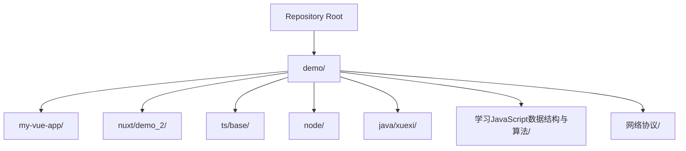
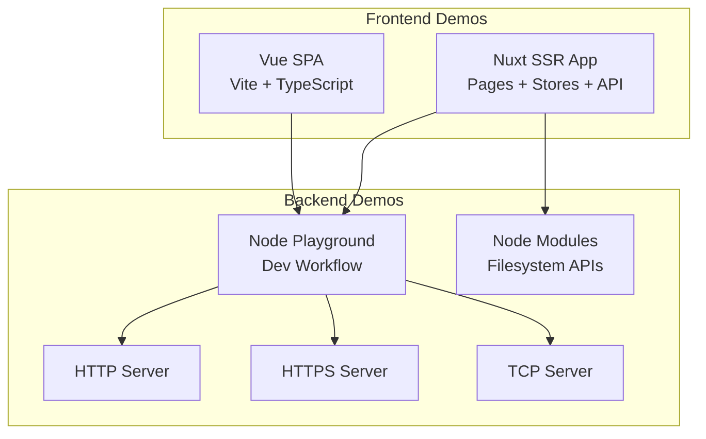
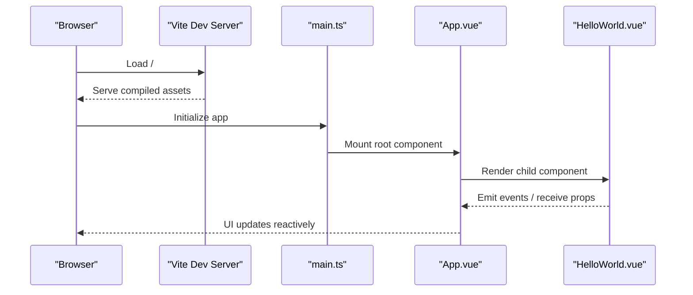
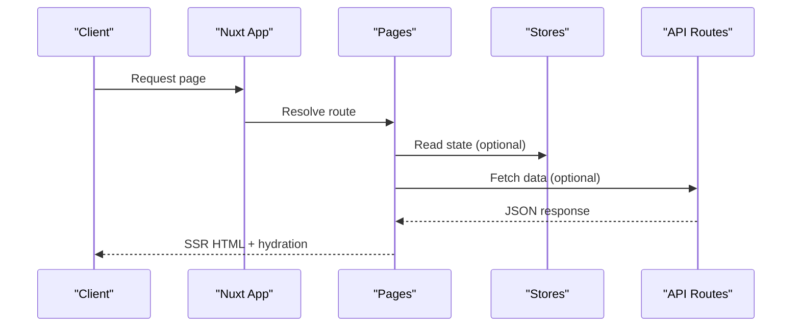
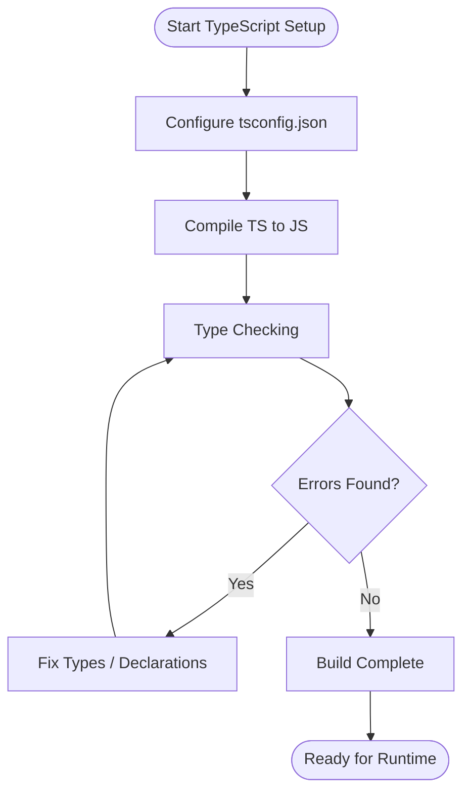
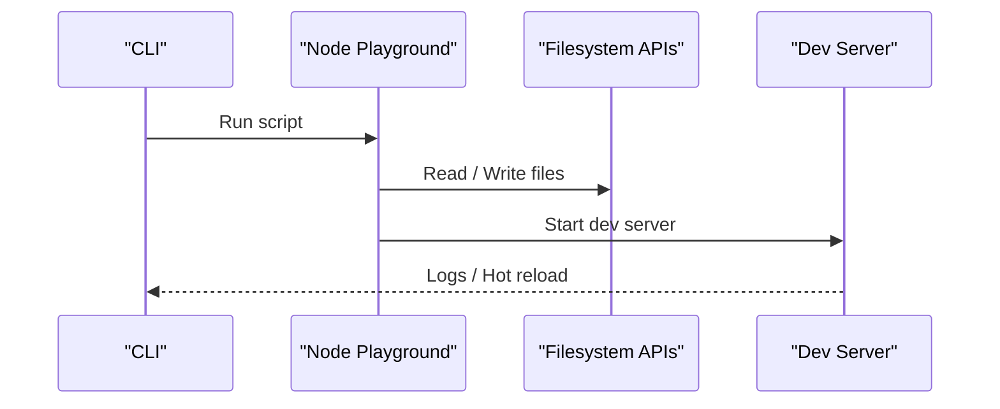
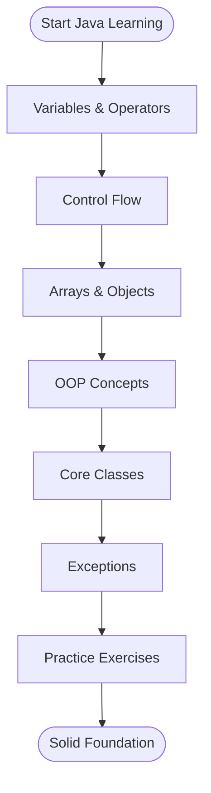
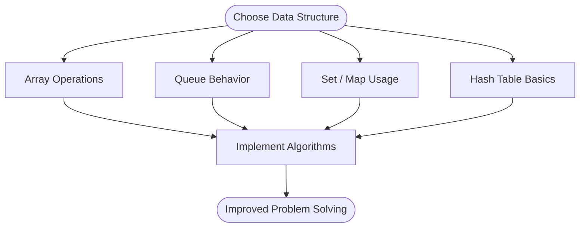
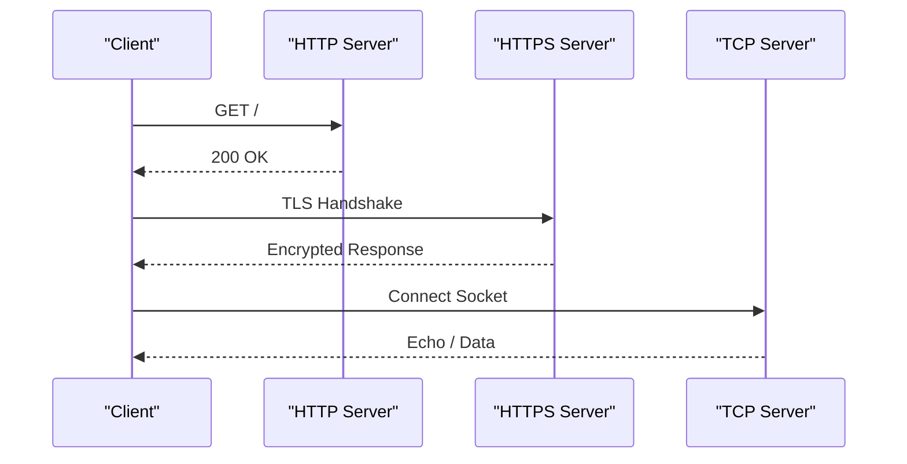
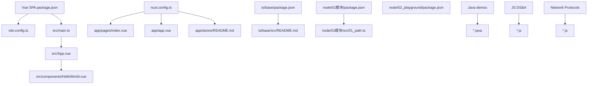

# Demo Projects

<cite>
**Referenced Files in This Document**
- [README.md](file://README.md)
- [demo/my-vue-app/package.json](file://demo/my-vue-app/package.json)
- [demo/my-vue-app/vite.config.ts](file://demo/my-vue-app/vite.config.ts)
- [demo/my-vue-app/src/main.ts](file://demo/my-vue-app/src/main.ts)
- [demo/my-vue-app/src/App.vue](file://demo/my-vue-app/src/App.vue)
- [demo/my-vue-app/src/components/HelloWorld.vue](file://demo/my-vue-app/src/components/HelloWorld.vue)
- [demo/nuxt/demo_2/nuxt.config.ts](file://demo/nuxt/demo_2/nuxt.config.ts)
- [demo/nuxt/demo_2/app/app.vue](file://demo/nuxt/demo_2/app/app.vue)
- [demo/nuxt/demo_2/app/pages/index.vue](file://demo/nuxt/demo_2/app/pages/index.vue)
- [demo/nuxt/demo_2/app/stores/README.md](file://demo/nuxt/demo_2/app/stores/README.md)
- [demo/ts/base/package.json](file://demo/ts/base/package.json)
- [demo/ts/base/src/README.md](file://demo/ts/base/src/README.md)
- [demo/node/01模块/package.json](file://demo/node/01模块/package.json)
- [demo/node/01模块/src/01_path.ts](file://demo/node/01模块/src/01_path.ts)
- [demo/node/02_playground/package.json](file://demo/node/02_playground/package.json)
- [demo/java/xuexi/01.基础/01.变量定义/Main.java](file://demo/java/xuexi/01.基础/01.变量定义/Main.java)
- [demo/java/xuexi/02.流程控制/01.if/Main.java](file://demo/java/xuexi/02.流程控制/01.if/Main.java)
- [demo/java/xuexi/03.引用类型/01.数组/Main.java](file://demo/java/xuexi/03.引用类型/01.数组/Main.java)
- [demo/java/xuexi/03.引用类型/02.对象/01.基础/Person.java](file://demo/java/xuexi/03.引用类型/02.对象/01.基础/Person.java)
- [demo/java/xuexi/03.引用类型/03.核心类/01.字符串/StringDemo.java](file://demo/java/xuexi/03.引用类型/03.核心类/01.字符串/StringDemo.java)
- [demo/java/xuexi/04.异常处理/01.基础/Main.java](file://demo/java/xuexi/04.异常处理/01.基础/Main.java)
- [demo/学习JavaScript数据结构与算法/01.数组.js](file://demo/学习JavaScript数据结构与算法/01.数组.js)
- [demo/学习JavaScript数据结构与算法/03.队列.js](file://demo/学习JavaScript数据结构与算法/03.队列.js)
- [demo/网络协议/http服务\服务端/server.js](file://demo/网络协议/http服务\服务端/server.js)
- [demo/网络协议/https/app.js](file://demo/网络协议/https/app.js)
- [demo/网络协议/tcp/server.js](file://demo/网络协议/tcp/server.js)
</cite>

## Table of Contents
1. [Introduction](#introduction)
2. [Project Structure](#project-structure)
3. [Core Components](#core-components)
4. [Architecture Overview](#architecture-overview)
5. [Detailed Component Analysis](#detailed-component-analysis)
6. [Dependency Analysis](#dependency-analysis)
7. [Performance Considerations](#performance-considerations)
8. [Troubleshooting Guide](#troubleshooting-guide)
9. [Conclusion](#conclusion)
10. [Appendices](#appendices)

## Introduction
This document presents the demo projects section with a focus on practical implementation examples and hands-on learning. It explains the pedagogical value of interactive examples and how they reinforce theoretical concepts. The guide documents the implementation details of:
- Vue.js single-page applications
- Nuxt.js server-side rendering applications
- TypeScript integration patterns
- Node.js backend services
- Java programming examples

It provides conceptual overviews for beginners and technical details for experienced developers adapting patterns to their own projects. Terminology and structure align with the codebase.

## Project Structure
The demo area organizes learning tracks by technology stack and topic:
- Frontend demos: Vue SPA and Nuxt SSR
- Backend demos: Node.js modules and playground
- Language basics: Java fundamentals and exercises
- Data structures and algorithms: JavaScript practice
- Networking protocols: HTTP/HTTPS/TCP servers and simulations

**Section sources**
- [README.md](file://README.md)

## Core Components
This section highlights representative demos and their roles in building practical understanding.

- Vue Single-Page Application
  - Purpose: Minimal Vue + TypeScript + Vite setup demonstrating component composition and TypeScript integration.
  - Key files: [package.json](file://demo/my-vue-app/package.json), [vite.config.ts](file://demo/my-vue-app/vite.config.ts), [src/main.ts](file://demo/my-vue-app/src/main.ts), [src/App.vue](file://demo/my-vue-app/src/App.vue), [src/components/HelloWorld.vue](file://demo/my-vue-app/src/components/HelloWorld.vue).

- Nuxt.js Server-Side Rendering Application
  - Purpose: Nuxt 3 application showcasing pages, layouts, components, stores, and API routes.
  - Key files: [nuxt.config.ts](file://demo/nuxt/demo_2/nuxt.config.ts), [app/app.vue](file://demo/nuxt/demo_2/app/app.vue), [app/pages/index.vue](file://demo/nuxt/demo_2/app/pages/index.vue), [app/stores/README.md](file://demo/nuxt/demo_2/app/stores/README.md).

- TypeScript Integration Patterns
  - Purpose: Demonstrates TypeScript configuration and usage across small modules.
  - Key files: [demo/ts/base/package.json](file://demo/ts/base/package.json), [demo/ts/base/src/README.md](file://demo/ts/base/src/README.md).

- Node.js Backend Services
  - Purpose: Node.js modules and playground for filesystem operations, dev workflow, and TypeScript compilation.
  - Key files: [demo/node/01模块/package.json](file://demo/node/01模块/package.json), [demo/node/01模块/src/01_path.ts](file://demo/node/01模块/src/01_path.ts), [demo/node/02_playground/package.json](file://demo/node/02_playground/package.json).

- Java Programming Examples
  - Purpose: Step-by-step Java fundamentals including variables, control flow, arrays, OOP basics, core classes, and exceptions.
  - Representative files: [Main.java](file://demo/java/xuexi/01.基础/01.变量定义/Main.java), [Main.java](file://demo/java/xuexi/02.流程控制/01.if/Main.java), [Main.java](file://demo/java/xuexi/03.引用类型/01.数组/Main.java), [Person.java](file://demo/java/xuexi/03.引用类型/02.对象/01.基础/Person.java), [StringDemo.java](file://demo/java/xuexi/03.引用类型/03.核心类/01.字符串/StringDemo.java), [Main.java](file://demo/java/xuexi/04.异常处理/01.基础/Main.java).

- Data Structures and Algorithms (JavaScript)
  - Purpose: Practical exercises for arrays, queues, sets, maps, and hash tables.
  - Representative files: [01.数组.js](file://demo/学习JavaScript数据结构与算法/01.数组.js), [03.队列.js](file://demo/学习JavaScript数据结构与算法/03.队列.js).

- Network Protocols (HTTP/HTTPS/TCP)
  - Purpose: Small servers and simulations to illustrate protocol mechanics.
  - Representative files: [server.js](file://demo/网络协议/http服务\服务端/server.js), [app.js](file://demo/网络协议/https/app.js), [server.js](file://demo/网络协议/tcp/server.js).

**Section sources**
- [demo/my-vue-app/package.json](file://demo/my-vue-app/package.json)
- [demo/my-vue-app/vite.config.ts](file://demo/my-vue-app/vite.config.ts)
- [demo/my-vue-app/src/main.ts](file://demo/my-vue-app/src/main.ts)
- [demo/my-vue-app/src/App.vue](file://demo/my-vue-app/src/App.vue)
- [demo/my-vue-app/src/components/HelloWorld.vue](file://demo/my-vue-app/src/components/HelloWorld.vue)
- [demo/nuxt/demo_2/nuxt.config.ts](file://demo/nuxt/demo_2/nuxt.config.ts)
- [demo/nuxt/demo_2/app/app.vue](file://demo/nuxt/demo_2/app/app.vue)
- [demo/nuxt/demo_2/app/pages/index.vue](file://demo/nuxt/demo_2/app/pages/index.vue)
- [demo/nuxt/demo_2/app/stores/README.md](file://demo/nuxt/demo_2/app/stores/README.md)
- [demo/ts/base/package.json](file://demo/ts/base/package.json)
- [demo/ts/base/src/README.md](file://demo/ts/base/src/README.md)
- [demo/node/01模块/package.json](file://demo/node/01模块/package.json)
- [demo/node/01模块/src/01_path.ts](file://demo/node/01模块/src/01_path.ts)
- [demo/node/02_playground/package.json](file://demo/node/02_playground/package.json)
- [demo/java/xuexi/01.基础/01.变量定义/Main.java](file://demo/java/xuexi/01.基础/01.变量定义/Main.java)
- [demo/java/xuexi/02.流程控制/01.if/Main.java](file://demo/java/xuexi/02.流程控制/01.if/Main.java)
- [demo/java/xuexi/03.引用类型/01.数组/Main.java](file://demo/java/xuexi/03.引用类型/01.数组/Main.java)
- [demo/java/xuexi/03.引用类型/02.对象/01.基础/Person.java](file://demo/java/xuexi/03.引用类型/02.对象/01.基础/Person.java)
- [demo/java/xuexi/03.引用类型/03.核心类/01.字符串/StringDemo.java](file://demo/java/xuexi/03.引用类型/03.核心类/01.字符串/StringDemo.java)
- [demo/java/xuexi/04.异常处理/01.基础/Main.java](file://demo/java/xuexi/04.异常处理/01.基础/Main.java)
- [demo/学习JavaScript数据结构与算法/01.数组.js](file://demo/学习JavaScript数据结构与算法/01.数组.js)
- [demo/学习JavaScript数据结构与算法/03.队列.js](file://demo/学习JavaScript数据结构与算法/03.队列.js)
- [demo/网络协议/http服务\服务端/server.js](file://demo/网络协议/http服务\服务端/server.js)
- [demo/网络协议/https/app.js](file://demo/网络协议/https/app.js)
- [demo/网络协议/tcp/server.js](file://demo/网络协议/tcp/server.js)

## Architecture Overview
This section visualizes how the frontend demos (Vue and Nuxt) fit into a typical modern web stack and how backend demos integrate with client-side apps.

**Diagram sources**
- [demo/my-vue-app/package.json](file://demo/my-vue-app/package.json)
- [demo/nuxt/demo_2/nuxt.config.ts](file://demo/nuxt/demo_2/nuxt.config.ts)
- [demo/node/01模块/package.json](file://demo/node/01模块/package.json)
- [demo/node/02_playground/package.json](file://demo/node/02_playground/package.json)
- [demo/网络协议/http服务\服务端/server.js](file://demo/网络协议/http服务\服务端/server.js)
- [demo/网络协议/https/app.js](file://demo/网络协议/https/app.js)
- [demo/网络协议/tcp/server.js](file://demo/网络协议/tcp/server.js)

## Detailed Component Analysis

### Vue.js Single-Page Application
- Purpose: Introduce Vue 3 with TypeScript and Vite. Focus on component composition, TypeScript typing, and build configuration.
- Implementation highlights:
  - Build tooling via Vite configuration.
  - Entry point mounting the root component.
  - A reusable component demonstrating props/events/state patterns.
- Pedagogical value:
  - Encourages experimentation with reactive data, component props, and TypeScript types.
  - Reinforces separation of concerns and modular component design.

**Diagram sources**
- [demo/my-vue-app/vite.config.ts](file://demo/my-vue-app/vite.config.ts)
- [demo/my-vue-app/src/main.ts](file://demo/my-vue-app/src/main.ts)
- [demo/my-vue-app/src/App.vue](file://demo/my-vue-app/src/App.vue)
- [demo/my-vue-app/src/components/HelloWorld.vue](file://demo/my-vue-app/src/components/HelloWorld.vue)

**Section sources**
- [demo/my-vue-app/package.json](file://demo/my-vue-app/package.json)
- [demo/my-vue-app/vite.config.ts](file://demo/my-vue-app/vite.config.ts)
- [demo/my-vue-app/src/main.ts](file://demo/my-vue-app/src/main.ts)
- [demo/my-vue-app/src/App.vue](file://demo/my-vue-app/src/App.vue)
- [demo/my-vue-app/src/components/HelloWorld.vue](file://demo/my-vue-app/src/components/HelloWorld.vue)

### Nuxt.js Server-Side Rendering Application
- Purpose: Demonstrate Nuxt 3 structure including pages, layouts, components, stores, and API routes.
- Implementation highlights:
  - Application root layout and page routing.
  - Store usage guidance and conventions.
  - API endpoints under the app/api directory.
- Pedagogical value:
  - Illustrates full-stack patterns with SSR, routing, and state management.
  - Encourages modular component composition and centralized store usage.

**Diagram sources**
- [demo/nuxt/demo_2/app/app.vue](file://demo/nuxt/demo_2/app/app.vue)
- [demo/nuxt/demo_2/app/pages/index.vue](file://demo/nuxt/demo_2/app/pages/index.vue)
- [demo/nuxt/demo_2/app/stores/README.md](file://demo/nuxt/demo_2/app/stores/README.md)
- [demo/nuxt/demo_2/nuxt.config.ts](file://demo/nuxt/demo_2/nuxt.config.ts)

**Section sources**
- [demo/nuxt/demo_2/nuxt.config.ts](file://demo/nuxt/demo_2/nuxt.config.ts)
- [demo/nuxt/demo_2/app/app.vue](file://demo/nuxt/demo_2/app/app.vue)
- [demo/nuxt/demo_2/app/pages/index.vue](file://demo/nuxt/demo_2/app/pages/index.vue)
- [demo/nuxt/demo_2/app/stores/README.md](file://demo/nuxt/demo_2/app/stores/README.md)

### TypeScript Integration Patterns
- Purpose: Explore TypeScript configuration and usage across small modules to reinforce type safety and developer ergonomics.
- Implementation highlights:
  - Package configuration enabling TypeScript builds.
  - Source module guidance and compiler options.
- Pedagogical value:
  - Reinforces strong typing, interfaces, and compile-time checks.
  - Encourages incremental adoption in existing projects.

**Diagram sources**
- [demo/ts/base/package.json](file://demo/ts/base/package.json)
- [demo/ts/base/src/README.md](file://demo/ts/base/src/README.md)

**Section sources**
- [demo/ts/base/package.json](file://demo/ts/base/package.json)
- [demo/ts/base/src/README.md](file://demo/ts/base/src/README.md)

### Node.js Backend Services
- Purpose: Provide practical examples of Node.js modules and a playground for development workflows.
- Implementation highlights:
  - Module demo using filesystem APIs and path utilities.
  - Playground with dev server and TypeScript configuration.
- Pedagogical value:
  - Demonstrates Node.js core modules, async patterns, and dev tooling.
  - Encourages building reusable modules and testing workflows.

**Diagram sources**
- [demo/node/01模块/package.json](file://demo/node/01模块/package.json)
- [demo/node/01模块/src/01_path.ts](file://demo/node/01模块/src/01_path.ts)
- [demo/node/02_playground/package.json](file://demo/node/02_playground/package.json)

**Section sources**
- [demo/node/01模块/package.json](file://demo/node/01模块/package.json)
- [demo/node/01模块/src/01_path.ts](file://demo/node/01模块/src/01_path.ts)
- [demo/node/02_playground/package.json](file://demo/node/02_playground/package.json)

### Java Programming Examples
- Purpose: Teach fundamental Java concepts progressively with runnable examples.
- Implementation highlights:
  - Variables and operators
  - Control flow (if/switch, loops)
  - Arrays and OOP basics (classes, inheritance, abstraction, interfaces)
  - Core classes (String, wrapper types, Math, Random)
  - Exceptions
- Pedagogical value:
  - Reinforces structured programming and object-oriented design.
  - Encourages iterative improvement and refactoring of basic programs.

**Diagram sources**
- [demo/java/xuexi/01.基础/01.变量定义/Main.java](file://demo/java/xuexi/01.基础/01.变量定义/Main.java)
- [demo/java/xuexi/02.流程控制/01.if/Main.java](file://demo/java/xuexi/02.流程控制/01.if/Main.java)
- [demo/java/xuexi/03.引用类型/01.数组/Main.java](file://demo/java/xuexi/03.引用类型/01.数组/Main.java)
- [demo/java/xuexi/03.引用类型/02.对象/01.基础/Person.java](file://demo/java/xuexi/03.引用类型/02.对象/01.基础/Person.java)
- [demo/java/xuexi/03.引用类型/03.核心类/01.字符串/StringDemo.java](file://demo/java/xuexi/03.引用类型/03.核心类/01.字符串/StringDemo.java)
- [demo/java/xuexi/04.异常处理/01.基础/Main.java](file://demo/java/xuexi/04.异常处理/01.基础/Main.java)

**Section sources**
- [demo/java/xuexi/01.基础/01.变量定义/Main.java](file://demo/java/xuexi/01.基础/01.变量定义/Main.java)
- [demo/java/xuexi/02.流程控制/01.if/Main.java](file://demo/java/xuexi/02.流程控制/01.if/Main.java)
- [demo/java/xuexi/03.引用类型/01.数组/Main.java](file://demo/java/xuexi/03.引用类型/01.数组/Main.java)
- [demo/java/xuexi/03.引用类型/02.对象/01.基础/Person.java](file://demo/java/xuexi/03.引用类型/02.对象/01.基础/Person.java)
- [demo/java/xuexi/03.引用类型/03.核心类/01.字符串/StringDemo.java](file://demo/java/xuexi/03.引用类型/03.核心类/01.字符串/StringDemo.java)
- [demo/java/xuexi/04.异常处理/01.基础/Main.java](file://demo/java/xuexi/04.异常处理/01.基础/Main.java)

### Data Structures and Algorithms (JavaScript)
- Purpose: Provide hands-on exercises for common data structures and algorithmic patterns.
- Implementation highlights:
  - Arrays and queue operations
  - Set and map usage
  - Hash table fundamentals
- Pedagogical value:
  - Reinforces algorithmic thinking and data representation choices.
  - Encourages performance trade-offs and problem decomposition.

**Diagram sources**
- [demo/学习JavaScript数据结构与算法/01.数组.js](file://demo/学习JavaScript数据结构与算法/01.数组.js)
- [demo/学习JavaScript数据结构与算法/03.队列.js](file://demo/学习JavaScript数据结构与算法/03.队列.js)

**Section sources**
- [demo/学习JavaScript数据结构与算法/01.数组.js](file://demo/学习JavaScript数据结构与算法/01.数组.js)
- [demo/学习JavaScript数据结构与算法/03.队列.js](file://demo/学习JavaScript数据结构与算法/03.队列.js)

### Network Protocols (HTTP/HTTPS/TCP)
- Purpose: Demonstrate protocol mechanics with minimal servers and simulations.
- Implementation highlights:
  - HTTP server for basic request handling
  - HTTPS server with certificates
  - TCP server for low-level socket interactions
- Pedagogical value:
  - Reinforces request/response cycles, TLS handshake, and socket programming.
  - Encourages secure communication and protocol-aware design.

**Diagram sources**
- [demo/网络协议/http服务\服务端/server.js](file://demo/网络协议/http服务\服务端/server.js)
- [demo/网络协议/https/app.js](file://demo/网络协议/https/app.js)
- [demo/网络协议/tcp/server.js](file://demo/网络协议/tcp/server.js)

**Section sources**
- [demo/网络协议/http服务\服务端/server.js](file://demo/网络协议/http服务\服务端/server.js)
- [demo/网络协议/https/app.js](file://demo/网络协议/https/app.js)
- [demo/网络协议/tcp/server.js](file://demo/网络协议/tcp/server.js)

## Dependency Analysis
This section maps how demos depend on each other and external tools.

**Diagram sources**
- [demo/my-vue-app/package.json](file://demo/my-vue-app/package.json)
- [demo/my-vue-app/vite.config.ts](file://demo/my-vue-app/vite.config.ts)
- [demo/my-vue-app/src/main.ts](file://demo/my-vue-app/src/main.ts)
- [demo/my-vue-app/src/App.vue](file://demo/my-vue-app/src/App.vue)
- [demo/my-vue-app/src/components/HelloWorld.vue](file://demo/my-vue-app/src/components/HelloWorld.vue)
- [demo/nuxt/demo_2/nuxt.config.ts](file://demo/nuxt/demo_2/nuxt.config.ts)
- [demo/nuxt/demo_2/app/pages/index.vue](file://demo/nuxt/demo_2/app/pages/index.vue)
- [demo/nuxt/demo_2/app/app.vue](file://demo/nuxt/demo_2/app/app.vue)
- [demo/nuxt/demo_2/app/stores/README.md](file://demo/nuxt/demo_2/app/stores/README.md)
- [demo/ts/base/package.json](file://demo/ts/base/package.json)
- [demo/ts/base/src/README.md](file://demo/ts/base/src/README.md)
- [demo/node/01模块/package.json](file://demo/node/01模块/package.json)
- [demo/node/01模块/src/01_path.ts](file://demo/node/01模块/src/01_path.ts)
- [demo/node/02_playground/package.json](file://demo/node/02_playground/package.json)

**Section sources**
- [demo/my-vue-app/package.json](file://demo/my-vue-app/package.json)
- [demo/my-vue-app/vite.config.ts](file://demo/my-vue-app/vite.config.ts)
- [demo/my-vue-app/src/main.ts](file://demo/my-vue-app/src/main.ts)
- [demo/my-vue-app/src/App.vue](file://demo/my-vue-app/src/App.vue)
- [demo/my-vue-app/src/components/HelloWorld.vue](file://demo/my-vue-app/src/components/HelloWorld.vue)
- [demo/nuxt/demo_2/nuxt.config.ts](file://demo/nuxt/demo_2/nuxt.config.ts)
- [demo/nuxt/demo_2/app/pages/index.vue](file://demo/nuxt/demo_2/app/pages/index.vue)
- [demo/nuxt/demo_2/app/app.vue](file://demo/nuxt/demo_2/app/app.vue)
- [demo/nuxt/demo_2/app/stores/README.md](file://demo/nuxt/demo_2/app/stores/README.md)
- [demo/ts/base/package.json](file://demo/ts/base/package.json)
- [demo/ts/base/src/README.md](file://demo/ts/base/src/README.md)
- [demo/node/01模块/package.json](file://demo/node/01模块/package.json)
- [demo/node/01模块/src/01_path.ts](file://demo/node/01模块/src/01_path.ts)
- [demo/node/02_playground/package.json](file://demo/node/02_playground/package.json)

## Performance Considerations
- Vue SPA
  - Keep component props shallow and avoid unnecessary re-renders.
  - Prefer computed properties for derived state.
  - Lazy-load heavy components to reduce initial bundle size.
- Nuxt SSR
  - Minimize server payload by fetching data on demand.
  - Use static generation for content that does not change frequently.
  - Optimize store state shape and avoid large serializations.
- Node.js
  - Use streams for large file operations.
  - Avoid blocking operations in event loop; leverage async I/O.
- Java
  - Choose appropriate data structures for workload (arrays vs lists).
  - Use StringBuilder for concatenation-heavy scenarios.
- Networks
  - Close unused sockets promptly.
  - Validate and sanitize inputs to prevent resource exhaustion.

## Troubleshooting Guide
- Vue SPA
  - If components do not render, verify the root component mount and template syntax.
  - If TypeScript errors occur, check tsconfig settings and import paths.
- Nuxt SSR
  - If pages fail to load, confirm route resolution and middleware order.
  - If store state is inconsistent, review actions and mutations.
- Node.js
  - If filesystem operations fail, check permissions and paths.
  - If dev server does not hot-reload, inspect nodemon configuration.
- Java
  - If compilation fails, ensure JDK compatibility and classpaths.
  - If runtime errors occur, validate array indices and null references.
- Networks
  - If HTTPS fails, verify certificate validity and trust chain.
  - If TCP connections drop, check firewall and connection timeouts.

**Section sources**
- [demo/my-vue-app/src/App.vue](file://demo/my-vue-app/src/App.vue)
- [demo/my-vue-app/src/components/HelloWorld.vue](file://demo/my-vue-app/src/components/HelloWorld.vue)
- [demo/nuxt/demo_2/app/pages/index.vue](file://demo/nuxt/demo_2/app/pages/index.vue)
- [demo/nuxt/demo_2/app/stores/README.md](file://demo/nuxt/demo_2/app/stores/README.md)
- [demo/node/01模块/src/01_path.ts](file://demo/node/01模块/src/01_path.ts)
- [demo/node/02_playground/package.json](file://demo/node/02_playground/package.json)
- [demo/java/xuexi/03.引用类型/01.数组/Main.java](file://demo/java/xuexi/03.引用类型/01.数组/Main.java)
- [demo/网络协议/https/app.js](file://demo/网络协议/https/app.js)
- [demo/网络协议/tcp/server.js](file://demo/网络协议/tcp/server.js)

## Conclusion
These demos provide a practical foundation across frontend frameworks, backend services, language fundamentals, data structures, and networking. They encourage iterative learning, experimentation, and adaptation to real-world projects. Beginners benefit from guided examples, while experienced developers can reuse patterns and architectures to accelerate their own implementations.

## Appendices
- Beginner’s Checklist
  - Start with a Vue SPA to learn component composition and TypeScript.
  - Transition to Nuxt SSR to understand routing and state management.
  - Practice Node.js modules and playground to build robust backend services.
  - Work through Java fundamentals and data structures to strengthen core CS skills.
  - Explore network protocol servers to deepen understanding of transport and security.
- Best Practices
  - Modularize code, favor immutability, and keep configuration explicit.
  - Write tests alongside demos to validate behavior.
  - Document assumptions and trade-offs for future maintainability.