# Java Programming Demo

<cite>
**Referenced Files in This Document**
- [Main.java](file://demo/java/xuexi/01.基础/01.变量定义/Main.java)
- [Main.java](file://demo/java/xuexi/01.基础/02.数字/Main.java)
- [Main.java](file://demo/java/xuexi/01.基础/03.布尔/Main.java)
- [Main.java](file://demo/java/xuexi/01.基础/04.字符和字符串/Main.java)
- [Main.java](file://demo/java/xuexi/01.基础/05.运算符/Main.java)
- [Main.java](file://demo/java/xuexi/02.流程控制/01.if/Main.java)
- [Main.java](file://demo/java/xuexi/02.流程控制/02.switch/Main.java)
- [Main.java](file://demo/java/xuexi/02.流程控制/03.while循环/Main.java)
- [Main.java](file://demo/java/xuexi/02.流程控制/04.do while循环/Main.java)
- [Main.java](file://demo/java/xuexi/02.流程控制/05.for循环/Main.java)
- [Main.java](file://demo/java/xuexi/03.引用类型/01.数组/Main.java)
- [Main.java](file://demo/java/xuexi/03.引用类型/02.对象/01.基础/Main.java)
- [Main.java](file://demo/java/xuexi/03.引用类型/02.对象/02.继承/Main.java)
- [Main.java](file://demo/java/xuexi/03.引用类型/02.对象/03.抽象类/Main.java)
- [Main.java](file://demo/java/xuexi/03.引用类型/02.对象/04.接口/Main.java)
- [Main.java](file://demo/java/xuexi/03.引用类型/03.核心类/01.字符串/Main.java)
- [Main.java](file://demo/java/xuexi/03.引用类型/03.核心类/02.包装类型/01.Integer/Main.java)
- [Main.java](file://demo/java/xuexi/03.引用类型/03.核心类/02.包装类型/02.Double/Main.java)
- [Main.java](file://demo/java/xuexi/03.引用类型/03.核心类/02.包装类型/03.Boolean/Main.java)
- [Main.java](file://demo/java/xuexi/03.引用类型/03.核心类/03.枚举(enum)/Main.java)
- [Main.java](file://demo/java/xuexi/03.引用类型/03.核心类/07.Math(数学计算)/Main.java)
- [Main.java](file://demo/java/xuexi/03.引用类型/03.核心类/08.Random(伪随机数)/Main.java)
- [Main.java](file://demo/java/xuexi/03.引用类型/03.核心类/09.SecureRandom(真随机数)/Main.java)
- [Main.java](file://demo/java/xuexi/04.异常处理/01.基础/Main.java)
</cite>

## Table of Contents
1. [Introduction](#introduction)
2. [Project Structure](#project-structure)
3. [Core Components](#core-components)
4. [Architecture Overview](#architecture-overview)
5. [Detailed Component Analysis](#detailed-component-analysis)
6. [Dependency Analysis](#dependency-analysis)
7. [Performance Considerations](#performance-considerations)
8. [Troubleshooting Guide](#troubleshooting-guide)
9. [Conclusion](#conclusion)

## Introduction
This document presents a structured, progressive Java programming demo designed to teach Java fundamentals and practical patterns. It covers variables and data types, operators, control structures, arrays, classes, inheritance, abstraction, interfaces, core utility classes, and exception handling. Each topic is grounded in real examples from the repository’s Java demos, demonstrating best practices such as immutability, encapsulation, method overloading, and safe use of standard library APIs.

## Project Structure
The Java demos are organized by topic into folders under demo/java/xuexi/. Each topic contains a Main.java file demonstrating a specific concept. The structure supports incremental learning from basic syntax to object-oriented design and standard library usage.

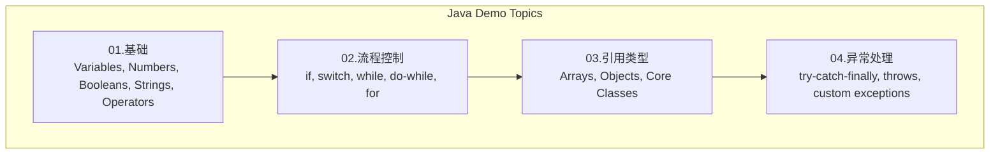

**Section sources**
- [Main.java:1-1](file://demo/java/xuexi/01.基础/01.变量定义/Main.java#L1-L1)
- [Main.java:1-1](file://demo/java/xuexi/02.流程控制/01.if/Main.java#L1-L1)
- [Main.java:1-3](file://demo/java/xuexi/03.引用类型/01.数组/Main.java#L1-L3)
- [Main.java:1-2](file://demo/java/xuexi/04.异常处理/01.基础/Main.java#L1-L2)

## Core Components
This section introduces the foundational building blocks demonstrated in the Java demos.

- Variables and Types
  - Primitive types and literals are introduced with numeric and boolean examples.
  - Strings and characters are covered, including Unicode behavior and immutability.
  - Reference types include arrays and wrapper classes.

- Control Structures
  - Conditional branching with if and switch.
  - Iterative constructs: while, do-while, and for (including enhanced for).

- Arrays
  - Creation via allocation and literal forms.
  - Initialization defaults, indexing, iteration, and sorting utilities.

- Object-Oriented Basics
  - Visibility modifiers, static members, constructors, method overloading, and final semantics.
  - Encapsulation and immutability patterns.

- Core Utility Classes
  - Wrapper types (Integer, Double, Boolean) and their conversion behaviors.
  - String utilities and immutability pitfalls.
  - Enumerations, Math utilities, Random number generation.

- Exception Handling
  - Try-catch-finally, multi-catch, throws declarations, and custom runtime exceptions.

**Section sources**
- [Main.java:1-57](file://demo/java/xuexi/01.基础/02.数字/Main.java#L1-L57)
- [Main.java:1-6](file://demo/java/xuexi/01.基础/03.布尔/Main.java#L1-L6)
- [Main.java:1-30](file://demo/java/xuexi/01.基础/04.字符和字符串/Main.java#L1-L30)
- [Main.java:1-57](file://demo/java/xuexi/01.基础/05.运算符/Main.java#L1-L57)
- [Main.java:1-14](file://demo/java/xuexi/02.流程控制/05.for循环/Main.java#L1-L14)
- [Main.java:1-35](file://demo/java/xuexi/03.引用类型/01.数组/Main.java#L1-L35)
- [Main.java:1-81](file://demo/java/xuexi/03.引用类型/02.对象/01.基础/Main.java#L1-L81)
- [Main.java:1-36](file://demo/java/xuexi/03.引用类型/03.核心类/02.包装类型/01.Integer/Main.java#L1-L36)
- [Main.java:1-1](file://demo/java/xuexi/03.引用类型/03.核心类/01.字符串/Main.java#L1-L1)
- [Main.java](file://demo/java/xuexi/03.引用类型/03.核心类/03.枚举(enum)/Main.java#L62-L62)
- [Main.java](file://demo/java/xuexi/03.引用类型/03.核心类/07.Math(数学计算)/Main.java#L1-L1)
- [Main.java](file://demo/java/xuexi/03.引用类型/03.核心类/08.Random(伪随机数)/Main.java#L3-L3)
- [Main.java](file://demo/java/xuexi/03.引用类型/03.核心类/09.SecureRandom(真随机数)/Main.java#L3-L3)
- [Main.java:1-56](file://demo/java/xuexi/04.异常处理/01.基础/Main.java#L1-L56)

## Architecture Overview
The demos are self-contained single-class programs with a main method per topic. There is no cross-demo dependency; each file demonstrates a concept in isolation. This design emphasizes clarity and progressive learning.

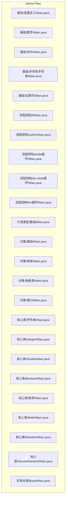

**Diagram sources**
- [Main.java:1-1](file://demo/java/xuexi/01.基础/01.变量定义/Main.java#L1-L1)
- [Main.java:1-57](file://demo/java/xuexi/01.基础/02.数字/Main.java#L1-L57)
- [Main.java:1-6](file://demo/java/xuexi/01.基础/03.布尔/Main.java#L1-L6)
- [Main.java:1-30](file://demo/java/xuexi/01.基础/04.字符和字符串/Main.java#L1-L30)
- [Main.java:1-57](file://demo/java/xuexi/01.基础/05.运算符/Main.java#L1-L57)
- [Main.java:1-1](file://demo/java/xuexi/02.流程控制/01.if/Main.java#L1-L1)
- [Main.java:1-1](file://demo/java/xuexi/02.流程控制/02.switch/Main.java#L1-L1)
- [Main.java:1-10](file://demo/java/xuexi/02.流程控制/03.while循环/Main.java#L1-L10)
- [Main.java:1-1](file://demo/java/xuexi/02.流程控制/04.do while循环/Main.java#L1-L1)
- [Main.java:1-14](file://demo/java/xuexi/02.流程控制/05.for循环/Main.java#L1-L14)
- [Main.java:1-35](file://demo/java/xuexi/03.引用类型/01.数组/Main.java#L1-L35)
- [Main.java:1-81](file://demo/java/xuexi/03.引用类型/02.对象/01.基础/Main.java#L1-L81)
- [Main.java:1-28](file://demo/java/xuexi/03.引用类型/02.对象/02.继承/Main.java#L1-L28)
- [Main.java:1-21](file://demo/java/xuexi/03.引用类型/02.对象/03.抽象类/Main.java#L1-L21)
- [Main.java:1-1](file://demo/java/xuexi/03.引用类型/02.对象/04.接口/Main.java#L1-L1)
- [Main.java:1-1](file://demo/java/xuexi/03.引用类型/03.核心类/01.字符串/Main.java#L1-L1)
- [Main.java:1-36](file://demo/java/xuexi/03.引用类型/03.核心类/02.包装类型/01.Integer/Main.java#L1-L36)
- [Main.java:1-1](file://demo/java/xuexi/03.引用类型/03.核心类/02.包装类型/02.Double/Main.java#L1-L1)
- [Main.java:1-16](file://demo/java/xuexi/03.引用类型/03.核心类/02.包装类型/03.Boolean/Main.java#L1-L16)
- [Main.java](file://demo/java/xuexi/03.引用类型/03.核心类/03.枚举(enum)/Main.java#L62-L62)
- [Main.java](file://demo/java/xuexi/03.引用类型/03.核心类/07.Math(数学计算)/Main.java#L1-L1)
- [Main.java](file://demo/java/xuexi/03.引用类型/03.核心类/08.Random(伪随机数)/Main.java#L3-L3)
- [Main.java](file://demo/java/xuexi/03.引用类型/03.核心类/09.SecureRandom(真随机数)/Main.java#L3-L3)
- [Main.java:1-56](file://demo/java/xuexi/04.异常处理/01.基础/Main.java#L1-L56)

## Detailed Component Analysis

### Variables and Data Types
- Numeric primitives and literals are demonstrated with arithmetic operations and operator precedence.
- Boolean values and logical operators are shown with short-circuit evaluation behavior.
- Characters and strings: Unicode encoding, character arithmetic, string immutability, and comparison pitfalls (use equals, not ==).
- Operators include arithmetic, assignment, relational, logical, and ternary forms.

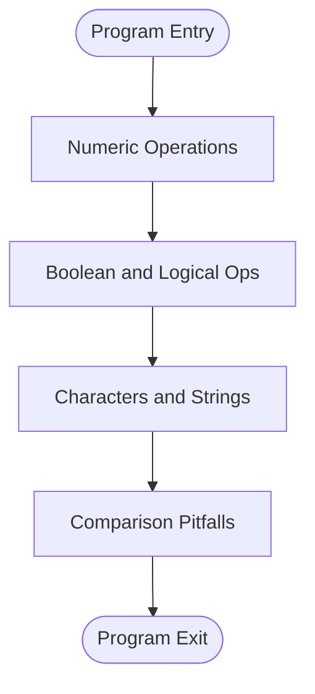

**Diagram sources**
- [Main.java:1-57](file://demo/java/xuexi/01.基础/02.数字/Main.java#L1-L57)
- [Main.java:1-6](file://demo/java/xuexi/01.基础/03.布尔/Main.java#L1-L6)
- [Main.java:1-30](file://demo/java/xuexi/01.基础/04.字符和字符串/Main.java#L1-L30)
- [Main.java:1-57](file://demo/java/xuexi/01.基础/05.运算符/Main.java#L1-L57)

**Section sources**
- [Main.java:1-57](file://demo/java/xuexi/01.基础/02.数字/Main.java#L1-L57)
- [Main.java:1-6](file://demo/java/xuexi/01.基础/03.布尔/Main.java#L1-L6)
- [Main.java:1-30](file://demo/java/xuexi/01.基础/04.字符和字符串/Main.java#L1-L30)
- [Main.java:1-57](file://demo/java/xuexi/01.基础/05.运算符/Main.java#L1-L57)

### Control Structures
- Conditional statements: if and switch with typical patterns.
- Loops: while, do-while, and for (including enhanced for loop for collections/arrays).

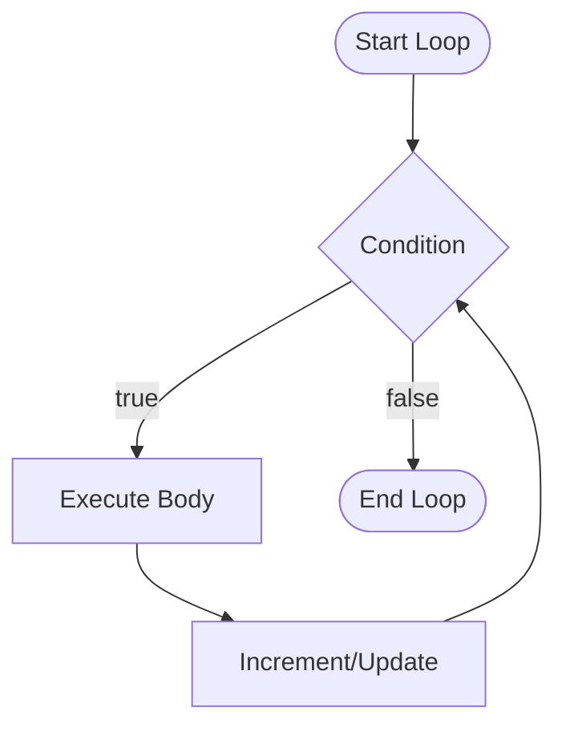

**Diagram sources**
- [Main.java:1-10](file://demo/java/xuexi/02.流程控制/03.while循环/Main.java#L1-L10)
- [Main.java:1-1](file://demo/java/xuexi/02.流程控制/04.do while循环/Main.java#L1-L1)
- [Main.java:1-14](file://demo/java/xuexi/02.流程控制/05.for循环/Main.java#L1-L14)

**Section sources**
- [Main.java:1-1](file://demo/java/xuexi/02.流程控制/01.if/Main.java#L1-L1)
- [Main.java:1-1](file://demo/java/xuexi/02.流程控制/02.switch/Main.java#L1-L1)
- [Main.java:1-10](file://demo/java/xuexi/02.流程控制/03.while循环/Main.java#L1-L10)
- [Main.java:1-1](file://demo/java/xuexi/02.流程控制/04.do while循环/Main.java#L1-L1)
- [Main.java:1-14](file://demo/java/xuexi/02.流程控制/05.for循环/Main.java#L1-L14)

### Arrays
- Array creation via allocation and literal forms.
- Default initialization, length property, indexing, and bounds checking.
- Traversal using classic for and enhanced for loops.
- Sorting with Arrays.sort and Collections.reverseOrder for objects.

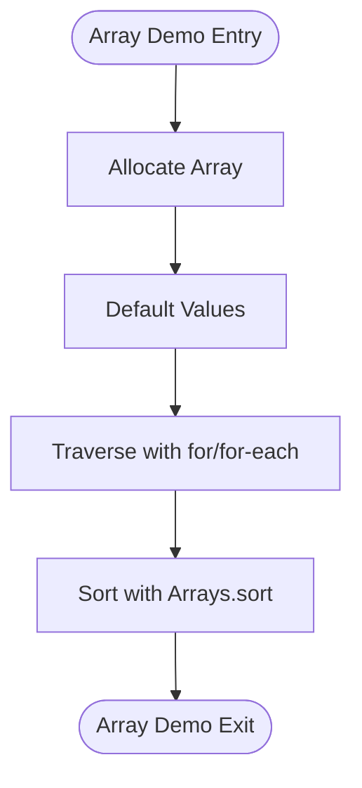

**Diagram sources**
- [Main.java:1-35](file://demo/java/xuexi/03.引用类型/01.数组/Main.java#L1-L35)

**Section sources**
- [Main.java:1-35](file://demo/java/xuexi/03.引用类型/01.数组/Main.java#L1-L35)

### Object-Oriented Programming Fundamentals
- Visibility modifiers, static vs instance members, constructors, method overloading, and final semantics.
- Encapsulation and immutability patterns are illustrated through field visibility and immutable wrappers.

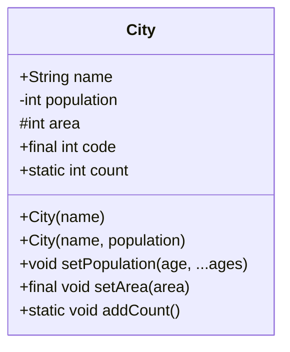

**Diagram sources**
- [Main.java:1-81](file://demo/java/xuexi/03.引用类型/02.对象/01.基础/Main.java#L1-L81)

**Section sources**
- [Main.java:1-81](file://demo/java/xuexi/03.引用类型/02.对象/01.基础/Main.java#L1-L81)

### Inheritance
- Single inheritance using extends.
- Access restrictions (private members not accessible).
- Using super to call parent constructor and members.

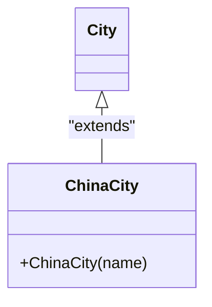

**Diagram sources**
- [Main.java:1-81](file://demo/java/xuexi/03.引用类型/02.对象/01.基础/Main.java#L1-L81)
- [Main.java:1-28](file://demo/java/xuexi/03.引用类型/02.对象/02.继承/Main.java#L1-L28)

**Section sources**
- [Main.java:1-28](file://demo/java/xuexi/03.引用类型/02.对象/02.继承/Main.java#L1-L28)

### Abstraction
- Abstract classes cannot be instantiated.
- Abstract methods must be implemented by subclasses.

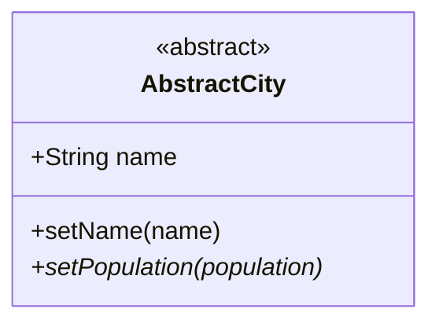

**Diagram sources**
- [Main.java:1-21](file://demo/java/xuexi/03.引用类型/02.对象/03.抽象类/Main.java#L1-L21)

**Section sources**
- [Main.java:1-21](file://demo/java/xuexi/03.引用类型/02.对象/03.抽象类/Main.java#L1-L21)

### Interfaces
- Interfaces define contracts for implementation.
- Example file exists for interface demonstration.

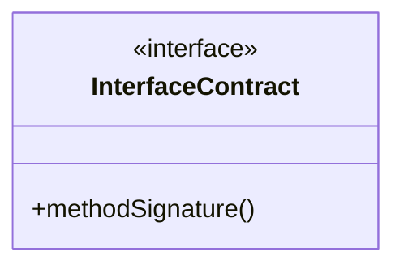

**Diagram sources**
- [Main.java:1-1](file://demo/java/xuexi/03.引用类型/02.对象/04.接口/Main.java#L1-L1)

**Section sources**
- [Main.java:1-1](file://demo/java/xuexi/03.引用类型/02.对象/04.接口/Main.java#L1-L1)

### Core Utility Classes
- Wrapper types: Integer, Double, Boolean, with boxing/unboxing and conversion methods.
- String: immutability, equals vs ==, and multi-line string literals.
- Enumerations, Math utilities, Random and SecureRandom for pseudo- and true randomness.

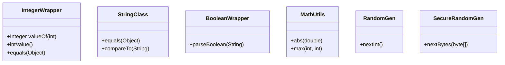

**Diagram sources**
- [Main.java:1-36](file://demo/java/xuexi/03.引用类型/03.核心类/02.包装类型/01.Integer/Main.java#L1-L36)
- [Main.java:1-1](file://demo/java/xuexi/03.引用类型/03.核心类/02.包装类型/02.Double/Main.java#L1-L1)
- [Main.java:1-16](file://demo/java/xuexi/03.引用类型/03.核心类/02.包装类型/03.Boolean/Main.java#L1-L16)
- [Main.java:1-1](file://demo/java/xuexi/03.引用类型/03.核心类/01.字符串/Main.java#L1-L1)
- [Main.java](file://demo/java/xuexi/03.引用类型/03.核心类/03.枚举(enum)/Main.java#L62-L62)
- [Main.java](file://demo/java/xuexi/03.引用类型/03.核心类/07.Math(数学计算)/Main.java#L1-L1)
- [Main.java](file://demo/java/xuexi/03.引用类型/03.核心类/08.Random(伪随机数)/Main.java#L3-L3)
- [Main.java](file://demo/java/xuexi/03.引用类型/03.核心类/09.SecureRandom(真随机数)/Main.java#L3-L3)

**Section sources**
- [Main.java:1-36](file://demo/java/xuexi/03.引用类型/03.核心类/02.包装类型/01.Integer/Main.java#L1-L36)
- [Main.java:1-1](file://demo/java/xuexi/03.引用类型/03.核心类/02.包装类型/02.Double/Main.java#L1-L1)
- [Main.java:1-16](file://demo/java/xuexi/03.引用类型/03.核心类/02.包装类型/03.Boolean/Main.java#L1-L16)
- [Main.java:1-1](file://demo/java/xuexi/03.引用类型/03.核心类/01.字符串/Main.java#L1-L1)
- [Main.java](file://demo/java/xuexi/03.引用类型/03.核心类/03.枚举(enum)/Main.java#L62-L62)
- [Main.java](file://demo/java/xuexi/03.引用类型/03.核心类/07.Math(数学计算)/Main.java#L1-L1)
- [Main.java](file://demo/java/xuexi/03.引用类型/03.核心类/08.Random(伪随机数)/Main.java#L3-L3)
- [Main.java](file://demo/java/xuexi/03.引用类型/03.核心类/09.SecureRandom(真随机数)/Main.java#L3-L3)

### Exception Handling
- Try-catch-finally blocks, multi-catch, throws declarations, and throwing exceptions.
- Custom runtime exception hierarchy.

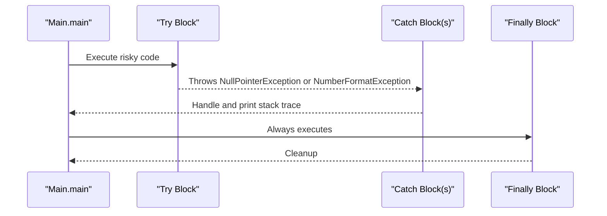

**Diagram sources**
- [Main.java:1-56](file://demo/java/xuexi/04.异常处理/01.基础/Main.java#L1-L56)

**Section sources**
- [Main.java:1-56](file://demo/java/xuexi/04.异常处理/01.基础/Main.java#L1-L56)

## Dependency Analysis
- Cohesion: Each demo file focuses on a single concept, ensuring high cohesion.
- Coupling: No inter-demo dependencies; files are independent.
- External dependencies: Standard library usage (java.util.*, java.io.* for I/O demos).

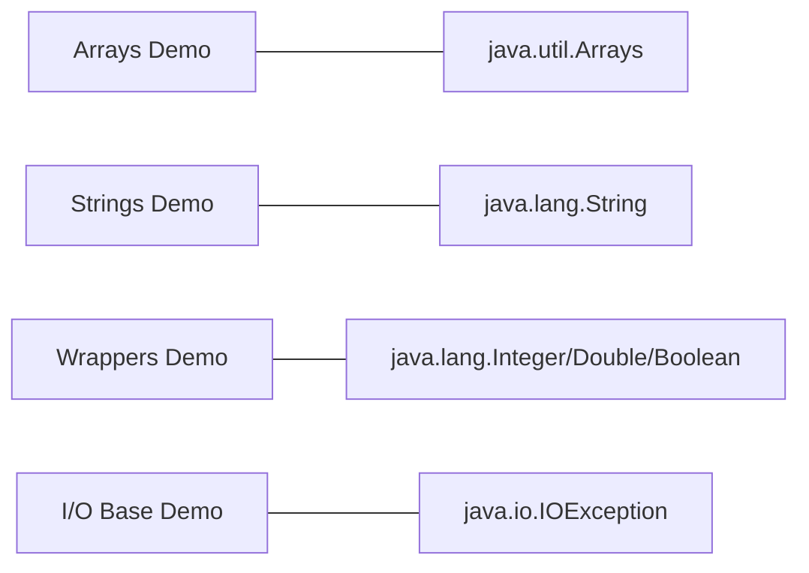

**Diagram sources**
- [Main.java:1-3](file://demo/java/xuexi/03.引用类型/01.数组/Main.java#L1-L3)
- [Main.java:1-1](file://demo/java/xuexi/03.引用类型/03.核心类/01.字符串/Main.java#L1-L1)
- [Main.java:1-36](file://demo/java/xuexi/03.引用类型/03.核心类/02.包装类型/01.Integer/Main.java#L1-L36)
- [Main.java:1-2](file://demo/java/xuexi/04.异常处理/01.基础/Main.java#L1-L2)

**Section sources**
- [Main.java:1-3](file://demo/java/xuexi/03.引用类型/01.数组/Main.java#L1-L3)
- [Main.java:1-1](file://demo/java/xuexi/03.引用类型/03.核心类/01.字符串/Main.java#L1-L1)
- [Main.java:1-36](file://demo/java/xuexi/03.引用类型/03.核心类/02.包装类型/01.Integer/Main.java#L1-L36)
- [Main.java:1-2](file://demo/java/xuexi/04.异常处理/01.基础/Main.java#L1-L2)

## Performance Considerations
- Prefer enhanced for loops for readability and reduced error risk.
- Use StringBuilder for repeated string concatenations.
- Avoid unnecessary boxing/unboxing in tight loops; use primitive streams where applicable.
- Minimize allocations inside loops; reuse objects when safe.

## Troubleshooting Guide
- NullPointerException: occurs when dereferencing null references; handle with try-catch or preconditions.
- ArrayIndexOutOfBoundsException: indicates invalid array indices; validate bounds before access.
- ClassCastException: misuse of casting; ensure type compatibility or use instanceof checks.
- Misusing == with strings: always use equals for content comparison.
- Inheritance access violations: remember private members are not inherited.

**Section sources**
- [Main.java:1-56](file://demo/java/xuexi/04.异常处理/01.基础/Main.java#L1-L56)
- [Main.java:1-30](file://demo/java/xuexi/01.基础/04.字符和字符串/Main.java#L1-L30)

## Conclusion
The Java demos provide a clear, incremental pathway through core language features and OOP principles, supported by practical examples and standard library usage. Learners can progress from basic syntax to classes, inheritance, abstraction, interfaces, and robust error handling, all while observing idiomatic Java practices such as immutability, encapsulation, and safe API usage.