# Node.js Backend Demo

<cite>
**Referenced Files in This Document**
- [package.json](file://demo/node/01模块/package.json)
- [01_path.ts](file://demo/node/01模块/src/01_path.ts)
- [02_url.ts](file://demo/node/01模块/src/02_url.ts)
- [03_console.ts](file://demo/node/01模块/src/03_console.ts)
- [04_fs.ts](file://demo/node/01模块/src/04_fs.ts)
- [05_buffer.ts](file://demo/node/01模块/src/05_buffer.ts)
- [06_BlobAndFile.ts](file://demo/node/01模块/src/06_BlobAndFile.ts)
- [07_events.ts](file://demo/node/01模块/src/07_events.ts)
- [test.ts](file://demo/node/01模块/src/test.ts)
- [app.ts](file://demo/node/02_playground/src/app.ts)
- [loginController.ts](file://demo/node/02_playground/src/controllers/auth/loginController.ts)
- [getSmsCodeController.ts](file://demo/node/02_playground/src/controllers/auth/getSmsCodeController.ts)
- [getVerifyCodeController.ts](file://demo/node/02_playground/src/controllers/auth/getVerifyCodeController.ts)
- [checkVerifyCodeController.ts](file://demo/node/02_playground/src/controllers/auth/checkVerifyCodeController.ts)
- [addDictController.ts](file://demo/node/02_playground/src/controllers/system/dict/addDictController.ts)
- [deleteDictController.ts](file://demo/node/02_playground/src/controllers/system/dict/deleteDictController.ts)
- [nodemon.json](file://demo/node/02_playground/nodemon.json)
- [tsconfig.json](file://demo/node/02_playground/tsconfig.json)
- [package.json](file://demo/node/02_playground/package.json)
- [server.js](file://demo/网络协议/http服务/服务端/server.js)
- [app.js](file://demo/网络协议/https/app.js)
- [server.js](file://demo/网络协议/tcp/server.js)
- [server.js](file://demo/网络协议/h2/server.js)
</cite>

## Table of Contents
1. [Introduction](#introduction)
2. [Project Structure](#project-structure)
3. [Core Components](#core-components)
4. [Architecture Overview](#architecture-overview)
5. [Detailed Component Analysis](#detailed-component-analysis)
6. [Dependency Analysis](#dependency-analysis)
7. [Performance Considerations](#performance-considerations)
8. [Troubleshooting Guide](#troubleshooting-guide)
9. [Conclusion](#conclusion)
10. [Appendices](#appendices)

## Introduction
This document presents a comprehensive Node.js backend demo focused on the module system, file operations, HTTP servers, and a practical playground application. It explains how built-in modules integrate with application architecture, demonstrates asynchronous patterns, and provides guidance for both beginners and experienced developers building production-grade backend services.

## Project Structure
The demo is organized into two primary areas:
- Built-in module demos: A set of TypeScript examples showcasing path handling, URL parsing, console utilities, file system operations, buffer manipulation, Blob/File APIs, and event handling.
- Playground application: A Koa-based backend service with controllers for authentication and system dictionary management, plus development tooling for rapid iteration.

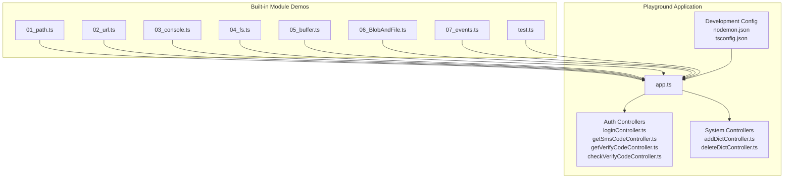

**Diagram sources**
- [01_path.ts](file://demo/node/01模块/src/01_path.ts)
- [02_url.ts](file://demo/node/01模块/src/02_url.ts)
- [03_console.ts](file://demo/node/01modules/src/03_console.ts)
- [04_fs.ts](file://demo/node/01模块/src/04_fs.ts)
- [05_buffer.ts](file://demo/node/01模块/src/05_buffer.ts)
- [06_BlobAndFile.ts](file://demo/node/01模块/src/06_BlobAndFile.ts)
- [07_events.ts](file://demo/node/01模块/src/07_events.ts)
- [test.ts](file://demo/node/01模块/src/test.ts)
- [app.ts](file://demo/node/02_playground/src/app.ts)
- [loginController.ts](file://demo/node/02_playground/src/controllers/auth/loginController.ts)
- [getSmsCodeController.ts](file://demo/node/02_playground/src/controllers/auth/getSmsCodeController.ts)
- [getVerifyCodeController.ts](file://demo/node/02_playground/src/controllers/auth/getVerifyCodeController.ts)
- [checkVerifyCodeController.ts](file://demo/node/02_playground/src/controllers/auth/checkVerifyCodeController.ts)
- [addDictController.ts](file://demo/node/02_playground/src/controllers/system/dict/addDictController.ts)
- [deleteDictController.ts](file://demo/node/02_playground/src/controllers/system/dict/deleteDictController.ts)
- [nodemon.json](file://demo/node/02_playground/nodemon.json)
- [tsconfig.json](file://demo/node/02_playground/tsconfig.json)

**Section sources**
- [package.json](file://demo/node/01模块/package.json)
- [app.ts](file://demo/node/02_playground/src/app.ts)

## Core Components
This section introduces the core building blocks demonstrated in the Node.js backend demo:
- Path handling: Resolving, joining, normalizing, and extracting metadata from file paths.
- URL parsing: Constructing and manipulating URLs and query parameters.
- Console utilities: Logging, timing, and structured output for diagnostics.
- File system operations: Reading, writing, copying, watching, and streaming files.
- Buffer manipulation: Encoding, decoding, and transforming binary data.
- Blob and File APIs: Handling web-like binary resources in Node environments.
- Event handling: Emitting and listening to events for decoupled workflows.

These components collectively illustrate how built-in modules form the foundation of Node.js applications, enabling robust file handling, protocol support, and extensible architectures.

**Section sources**
- [01_path.ts](file://demo/node/01模块/src/01_path.ts)
- [02_url.ts](file://demo/node/01模块/src/02_url.ts)
- [03_console.ts](file://demo/node/01模块/src/03_console.ts)
- [04_fs.ts](file://demo/node/01模块/src/04_fs.ts)
- [05_buffer.ts](file://demo/node/01模块/src/05_buffer.ts)
- [06_BlobAndFile.ts](file://demo/node/01模块/src/06_BlobAndFile.ts)
- [07_events.ts](file://demo/node/01模块/src/07_events.ts)

## Architecture Overview
The playground application follows a layered architecture:
- Entry point initializes middleware, routes, and static assets.
- Controllers encapsulate business actions (authentication and system dictionary operations).
- Middleware handles body parsing, logging, and error propagation.
- Development tools (Nodemon) enable hot reload during iterative development.

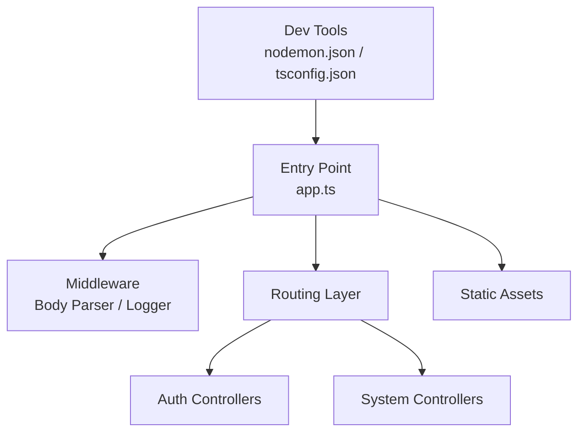

**Diagram sources**
- [app.ts](file://demo/node/02_playground/src/app.ts)
- [loginController.ts](file://demo/node/02_playground/src/controllers/auth/loginController.ts)
- [getSmsCodeController.ts](file://demo/node/02_playground/src/controllers/auth/getSmsCodeController.ts)
- [getVerifyCodeController.ts](file://demo/node/02_playground/src/controllers/auth/getVerifyCodeController.ts)
- [checkVerifyCodeController.ts](file://demo/node/02_playground/src/controllers/auth/checkVerifyCodeController.ts)
- [addDictController.ts](file://demo/node/02_playground/src/controllers/system/dict/addDictController.ts)
- [deleteDictController.ts](file://demo/node/02_playground/src/controllers/system/dict/deleteDictController.ts)
- [nodemon.json](file://demo/node/02_playground/nodemon.json)
- [tsconfig.json](file://demo/node/02_playground/tsconfig.json)

## Detailed Component Analysis

### Path Handling
This module demonstrates path resolution, normalization, and metadata extraction. It illustrates how to construct safe file references and avoid traversal vulnerabilities by normalizing paths before use.

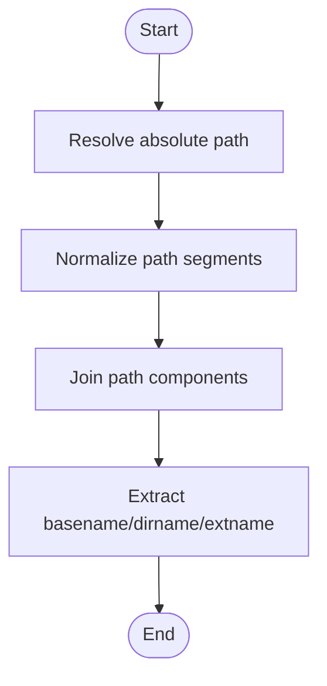

**Diagram sources**
- [01_path.ts](file://demo/node/01模块/src/01_path.ts)

**Section sources**
- [01_path.ts](file://demo/node/01模块/src/01_path.ts)

### URL Parsing
This module covers constructing and parsing URLs, including query parameters. It emphasizes safe handling of user-provided URLs and proper encoding/decoding of special characters.

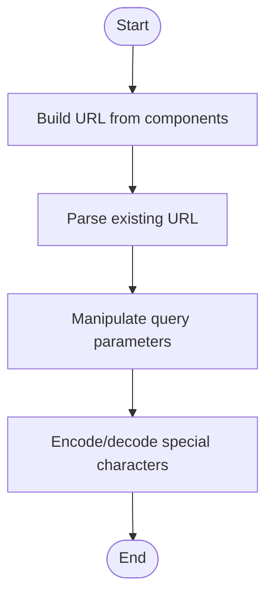

**Diagram sources**
- [02_url.ts](file://demo/node/01模块/src/02_url.ts)

**Section sources**
- [02_url.ts](file://demo/node/01模块/src/02_url.ts)

### Console Utilities
Logging and diagnostics are essential for observability. This module showcases structured logging, timing metrics, and warning/error reporting patterns suitable for backend services.

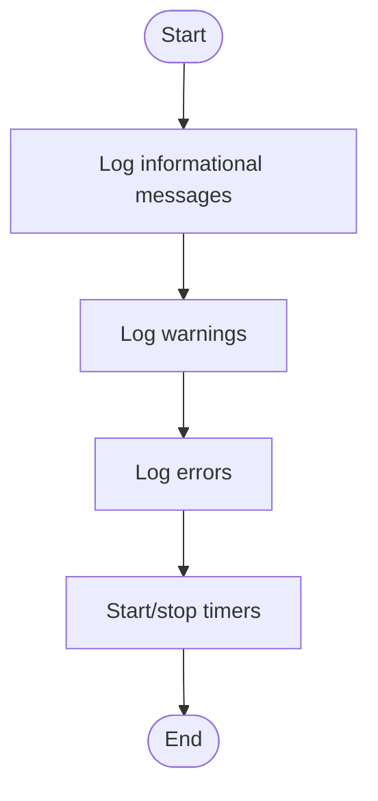

**Diagram sources**
- [03_console.ts](file://demo/node/01模块/src/03_console.ts)

**Section sources**
- [03_console.ts](file://demo/node/01模块/src/03_console.ts)

### File System Operations
This module demonstrates synchronous and asynchronous file operations, including reading, writing, copying, and streaming. It also covers watching files for changes and managing streams for efficient I/O.

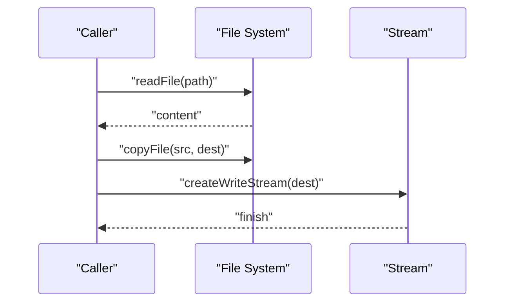

**Diagram sources**
- [04_fs.ts](file://demo/node/01模块/src/04_fs.ts)

**Section sources**
- [04_fs.ts](file://demo/node/01模块/src/04_fs.ts)

### Buffer Manipulation
Buffers are fundamental for handling binary data. This module covers creating, converting, slicing, and transforming buffers, along with encoding and decoding strategies.

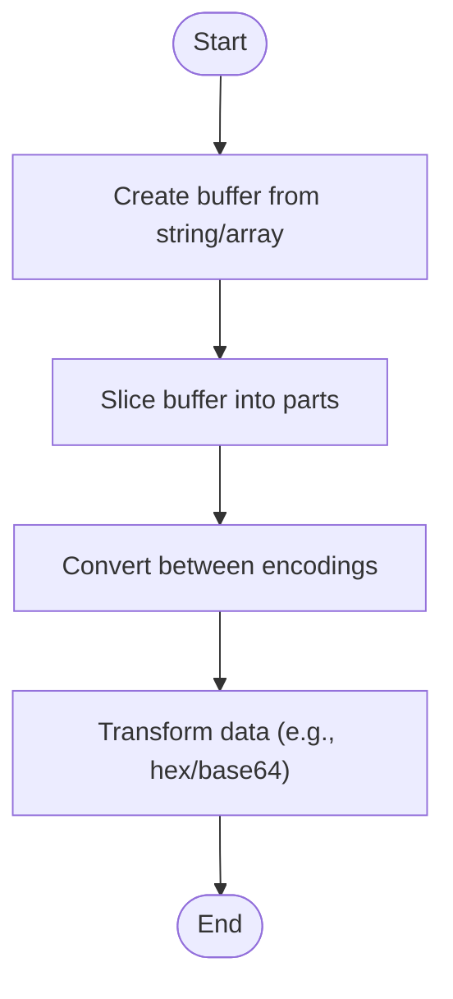

**Diagram sources**
- [05_buffer.ts](file://demo/node/01模块/src/05_buffer.ts)

**Section sources**
- [05_buffer.ts](file://demo/node/01模块/src/05_buffer.ts)

### Blob and File APIs
While primarily browser-focused, Node environments can emulate Blob and File semantics for compatibility with web-like workflows. This module demonstrates creating and manipulating these objects.

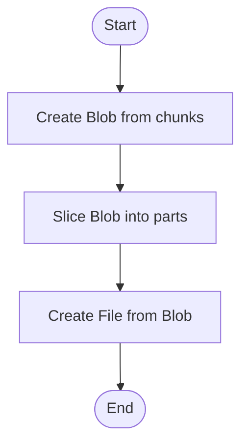

**Diagram sources**
- [06_BlobAndFile.ts](file://demo/node/01模块/src/06_BlobAndFile.ts)

**Section sources**
- [06_BlobAndFile.ts](file://demo/node/01模块/src/06_BlobAndFile.ts)

### Event Handling
Events enable decoupled communication between components. This module shows emitting and listening to custom events, useful for orchestrating workflows and plugin systems.

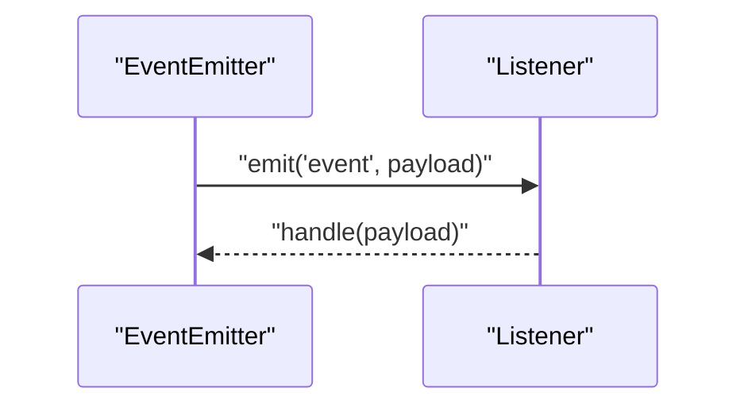

**Diagram sources**
- [07_events.ts](file://demo/node/01模块/src/07_events.ts)

**Section sources**
- [07_events.ts](file://demo/node/01模块/src/07_events.ts)

### Playground Application: Entry Point and Middleware
The application entry point initializes middleware and routes. Middleware commonly includes body parsing, CORS, logging, and error handling. Routing maps incoming requests to controller actions.

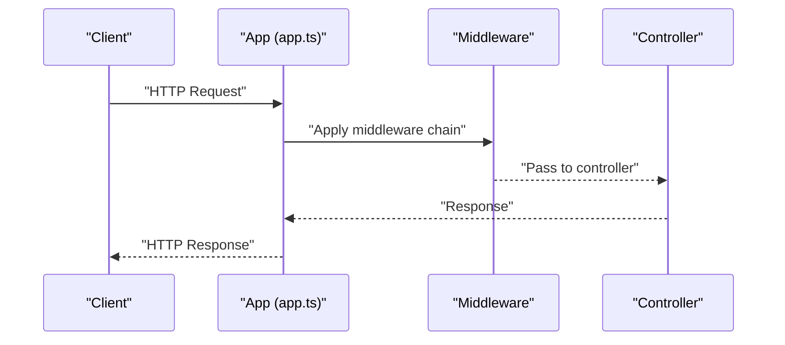

**Diagram sources**
- [app.ts](file://demo/node/02_playground/src/app.ts)

**Section sources**
- [app.ts](file://demo/node/02_playground/src/app.ts)

### Authentication Controllers
Controllers encapsulate business logic for authentication flows:
- Login controller: Validates credentials and issues tokens/sessions.
- SMS verification: Generates and sends SMS codes.
- Captcha verification: Generates and validates image/text-based challenges.
- Verification code checks: Confirms submitted codes against generated ones.

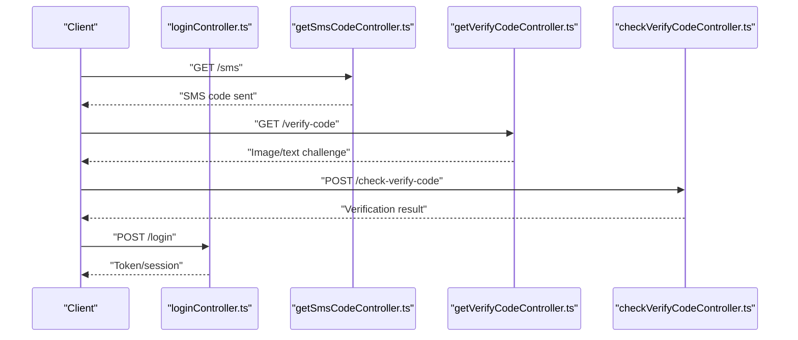

**Diagram sources**
- [loginController.ts](file://demo/node/02_playground/src/controllers/auth/loginController.ts)
- [getSmsCodeController.ts](file://demo/node/02_playground/src/controllers/auth/getSmsCodeController.ts)
- [getVerifyCodeController.ts](file://demo/node/02_playground/src/controllers/auth/getVerifyCodeController.ts)
- [checkVerifyCodeController.ts](file://demo/node/02_playground/src/controllers/auth/checkVerifyCodeController.ts)

**Section sources**
- [loginController.ts](file://demo/node/02_playground/src/controllers/auth/loginController.ts)
- [getSmsCodeController.ts](file://demo/node/02_playground/src/controllers/auth/getSmsCodeController.ts)
- [getVerifyCodeController.ts](file://demo/node/02_playground/src/controllers/auth/getVerifyCodeController.ts)
- [checkVerifyCodeController.ts](file://demo/node/02_playground/src/controllers/auth/checkVerifyCodeController.ts)

### System Dictionary Controllers
System controllers manage dictionary CRUD operations:
- Add dictionary entries.
- Delete dictionary entries.

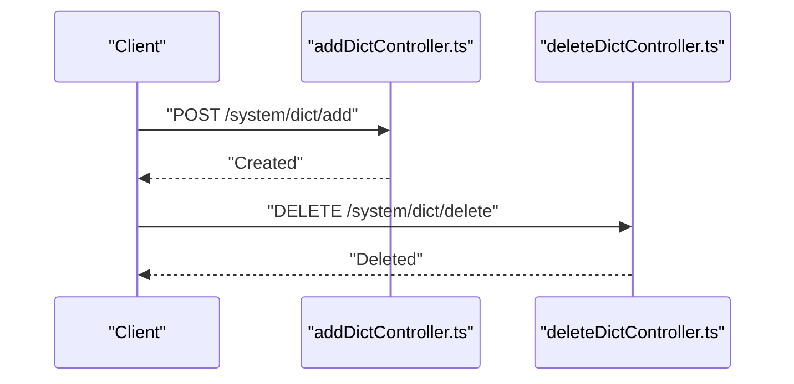

**Diagram sources**
- [addDictController.ts](file://demo/node/02_playground/src/controllers/system/dict/addDictController.ts)
- [deleteDictController.ts](file://demo/node/02_playground/src/controllers/system/dict/deleteDictController.ts)

**Section sources**
- [addDictController.ts](file://demo/node/02_playground/src/controllers/system/dict/addDictController.ts)
- [deleteDictController.ts](file://demo/node/02_playground/src/controllers/system/dict/deleteDictController.ts)

### Development Workflow and Tooling
- Nodemon: Watches source files and restarts the server automatically on changes.
- TypeScript configuration: Ensures type safety and modern JavaScript features.

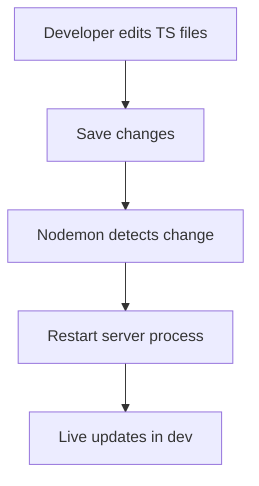

**Diagram sources**
- [nodemon.json](file://demo/node/02_playground/nodemon.json)
- [tsconfig.json](file://demo/node/02_playground/tsconfig.json)

**Section sources**
- [nodemon.json](file://demo/node/02_playground/nodemon.json)
- [tsconfig.json](file://demo/node/02_playground/tsconfig.json)

## Dependency Analysis
The Node.js demos rely on built-in modules and third-party libraries for HTTP and routing. Dependencies are declared in the project’s package files.

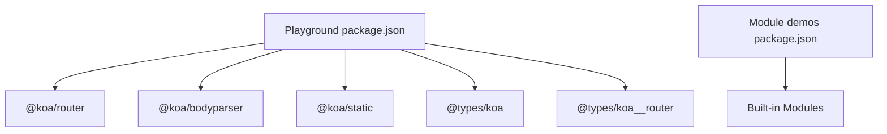

**Diagram sources**
- [package.json](file://demo/node/02_playground/package.json)
- [package.json](file://demo/node/01模块/package.json)

**Section sources**
- [package.json](file://demo/node/02_playground/package.json)
- [package.json](file://demo/node/01模块/package.json)

## Performance Considerations
- Prefer streaming for large file uploads/downloads to reduce memory pressure.
- Use non-blocking I/O and async/await patterns to keep the event loop responsive.
- Minimize synchronous operations in hot paths; leverage buffering and chunked processing.
- Apply compression and caching strategies for static assets and repeated responses.
- Monitor CPU and memory usage during development and load testing.

## Troubleshooting Guide
Common issues and remedies:
- Path traversal and invalid paths: Always normalize and validate paths before file operations.
- Encoding problems with Buffers and Streams: Ensure consistent encoding (UTF-8, base64, hex) across boundaries.
- Asynchronous pitfalls: Avoid mixing sync and async APIs in the same call stack; handle errors via try/catch and centralized error handlers.
- Hot reload not triggering: Verify Nodemon configuration and watch patterns; ensure TypeScript emits JS artifacts.
- Middleware ordering: Place body parser before route handlers; place error handlers last.

**Section sources**
- [04_fs.ts](file://demo/node/01模块/src/04_fs.ts)
- [05_buffer.ts](file://demo/node/01模块/src/05_buffer.ts)
- [07_events.ts](file://demo/node/01模块/src/07_events.ts)
- [nodemon.json](file://demo/node/02_playground/nodemon.json)

## Conclusion
The Node.js backend demo demonstrates how built-in modules underpin real-world applications. By combining path handling, URL parsing, console utilities, file system operations, buffer manipulation, Blob/File APIs, and event handling, developers can build robust, maintainable backend services. The playground application further illustrates modular controllers, middleware, and development workflows suitable for production-grade systems.

## Appendices
- Related network protocol examples: HTTP server, HTTPS app, TCP server, and HTTP/2 server implementations are available for reference and experimentation.

**Section sources**
- [server.js](file://demo/网络协议/http服务/服务端/server.js)
- [app.js](file://demo/网络协议/https/app.js)
- [server.js](file://demo/网络协议/tcp/server.js)
- [server.js](file://demo/网络协议/h2/server.js)