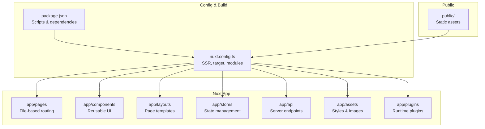
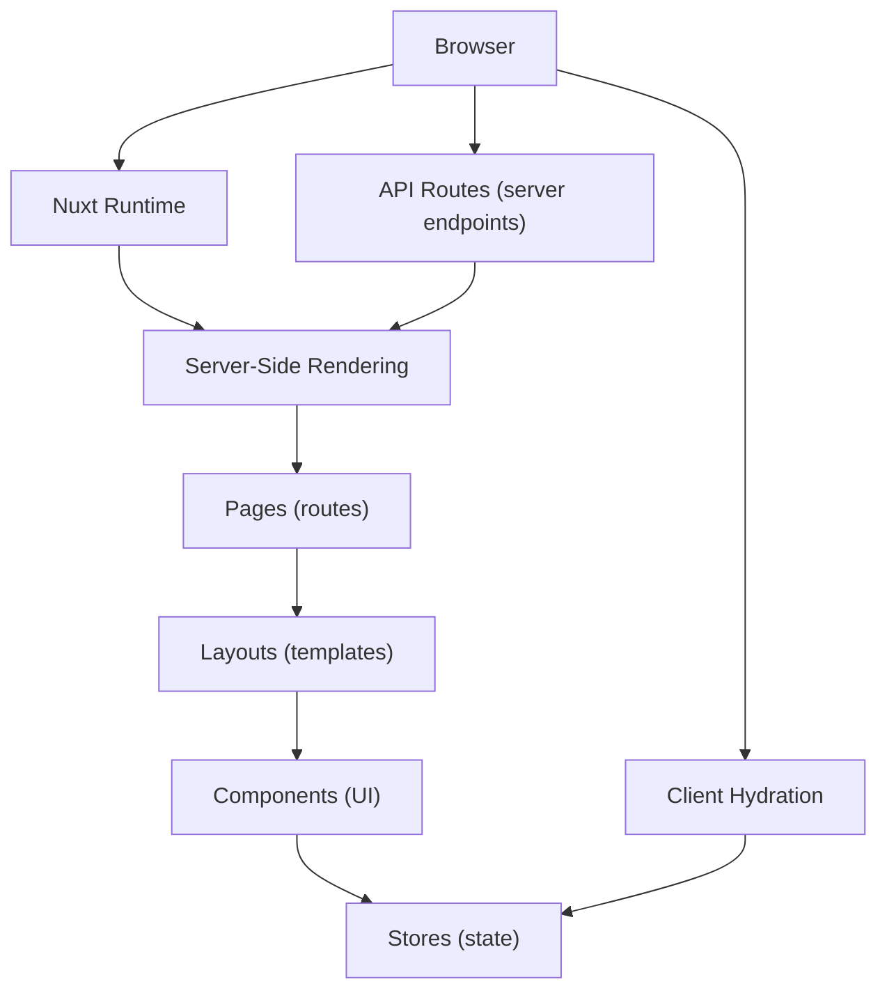
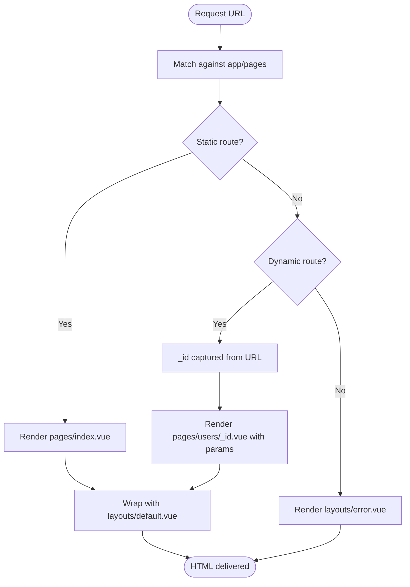
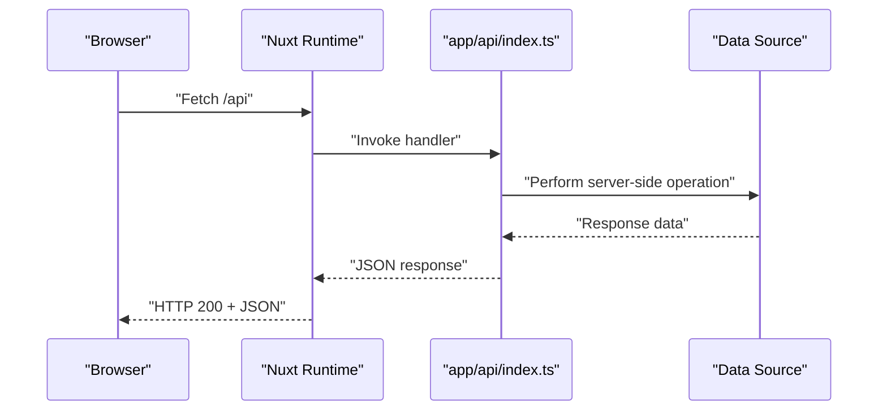
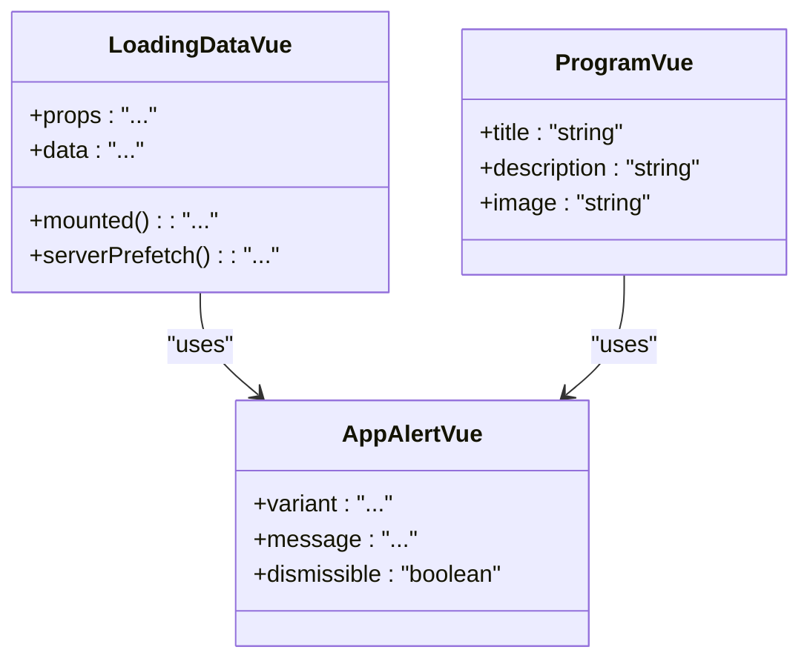
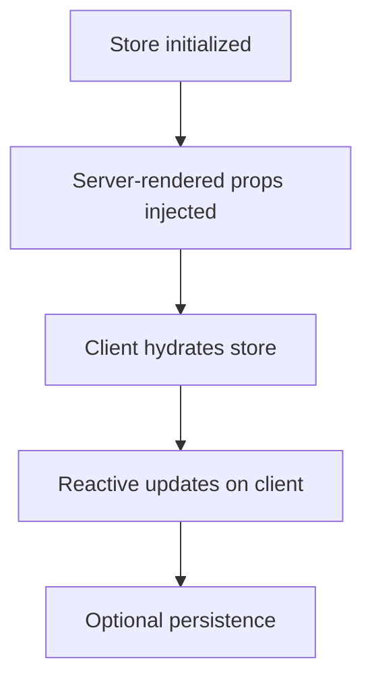
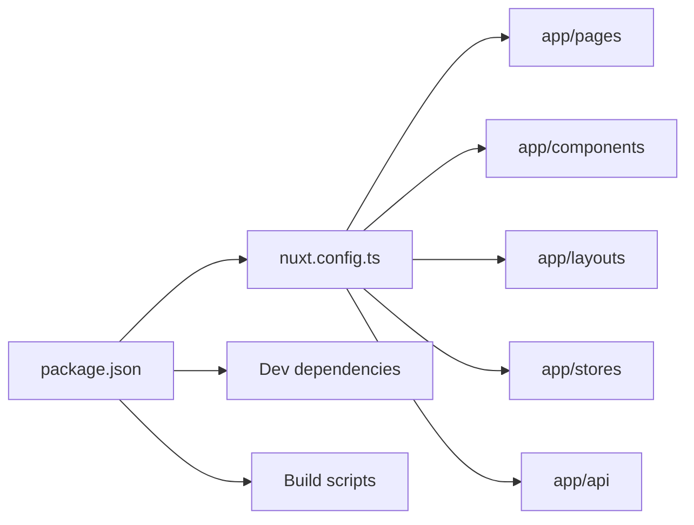

# Nuxt.js SSR Demo Application

<cite>
**Referenced Files in This Document**
- [nuxt.config.ts](file://demo/nuxt/demo_2/nuxt.config.ts)
- [package.json](file://demo/nuxt/demo_2/package.json)
- [app.vue](file://demo/nuxt/demo_2/app/app.vue)
- [index.ts](file://demo/nuxt/demo_2/app/api/index.ts)
- [request.ts](file://demo/nuxt/demo_2/app/api/request.ts)
- [LoadingData.vue](file://demo/nuxt/demo_2/app/components/LoadingData.vue)
- [AppAlert.vue](file://demo/nuxt/demo_2/app/components/AppAlert.vue)
- [Program.vue](file://demo/nuxt/demo_2/app/components/Program.vue)
- [default.vue](file://demo/nuxt/demo_2/app/layouts/default.vue)
- [error.vue](file://demo/nuxt/demo_2/app/layouts/error.vue)
- [index.vue](file://demo/nuxt/demo_2/app/pages/index.vue)
- [users/index.vue](file://demo/nuxt/demo_2/app/pages/users/index.vue)
- [users/_id.vue](file://demo/nuxt/demo_2/app/pages/users/_id.vue)
- [robots.txt](file://demo/nuxt/demo_2/public/robots.txt)
- [store-example.ts](file://demo/nuxt/demo_2/app/stores/store-example.ts)
- [store-users.ts](file://demo/nuxt/demo_2/app/stores/store-users.ts)
- [store-counter.ts](file://demo/nuxt/demo_2/app/stores/store-counter.ts)
</cite>

## Table of Contents
1. [Introduction](#introduction)
2. [Project Structure](#project-structure)
3. [Core Components](#core-components)
4. [Architecture Overview](#architecture-overview)
5. [Detailed Component Analysis](#detailed-component-analysis)
6. [Dependency Analysis](#dependency-analysis)
7. [Performance Considerations](#performance-considerations)
8. [Troubleshooting Guide](#troubleshooting-guide)
9. [Conclusion](#conclusion)

## Introduction
This document explains a full-stack Nuxt.js server-side rendering (SSR) demo application. It covers SSR configuration, file-based routing, API endpoints, and static site generation capabilities. The guide documents the app structure with pages, components, layouts, and stores, and demonstrates how Nuxt’s configuration, file-based routing, and component organization work together to deliver universal applications. It also addresses common SSR patterns, performance optimization techniques, and deployment strategies, making it accessible to beginners while providing sufficient technical depth for production-ready implementations.

## Project Structure
The Nuxt demo application follows a conventional Nuxt project layout with a dedicated app directory containing pages, components, layouts, stores, and API routes. The configuration file defines SSR behavior, build targets, and module integrations. Public assets and robots.txt are served statically.

**Diagram sources**
- [nuxt.config.ts](file://demo/nuxt/demo_2/nuxt.config.ts)
- [package.json](file://demo/nuxt/demo_2/package.json)

**Section sources**
- [nuxt.config.ts](file://demo/nuxt/demo_2/nuxt.config.ts)
- [package.json](file://demo/nuxt/demo_2/package.json)

## Core Components
- Pages: Define routes via file names and nested directories. Dynamic routes use underscore-prefixed parameters.
- Components: Reusable UI building blocks under components/.
- Layouts: Page templates under layouts/, with default and error variants.
- Stores: Pinia stores under stores/ for state management.
- API Routes: Request handlers under app/api/ for server endpoints.
- App Root: Single entry component app/app.vue.

Key implementation patterns:
- File-based routing: Pages map to URLs automatically; nested folders create nested routes.
- SSR rendering: Server renders HTML on first request; client hydrates on navigation.
- Universal behavior: Same code runs on server and client with hydration awareness.
- Static generation: Can be enabled to pre-render pages at build time.

**Section sources**
- [index.vue](file://demo/nuxt/demo_2/app/pages/index.vue)
- [users/index.vue](file://demo/nuxt/demo_2/app/pages/users/index.vue)
- [users/_id.vue](file://demo/nuxt/demo_2/app/pages/users/_id.vue)
- [default.vue](file://demo/nuxt/demo_2/app/layouts/default.vue)
- [error.vue](file://demo/nuxt/demo_2/app/layouts/error.vue)
- [LoadingData.vue](file://demo/nuxt/demo_2/app/components/LoadingData.vue)
- [AppAlert.vue](file://demo/nuxt/demo_2/app/components/AppAlert.vue)
- [Program.vue](file://demo/nuxt/demo_2/app/components/Program.vue)
- [store-example.ts](file://demo/nuxt/demo_2/app/stores/store-example.ts)
- [store-users.ts](file://demo/nuxt/demo_2/app/stores/store-users.ts)
- [store-counter.ts](file://demo/nuxt/demo_2/app/stores/store-counter.ts)
- [index.ts](file://demo/nuxt/demo_2/app/api/index.ts)
- [request.ts](file://demo/nuxt/demo_2/app/api/request.ts)
- [app.vue](file://demo/nuxt/demo_2/app/app.vue)

## Architecture Overview
The application architecture integrates SSR rendering, file-based routing, API endpoints, and state management. The configuration controls SSR mode, build target, and module loading. Pages render server-side initially, then hydrate on the client. API routes handle server-side requests, and stores manage shared state.

**Diagram sources**
- [nuxt.config.ts](file://demo/nuxt/demo_2/nuxt.config.ts)
- [index.vue](file://demo/nuxt/demo_2/app/pages/index.vue)
- [default.vue](file://demo/nuxt/demo_2/app/layouts/default.vue)
- [LoadingData.vue](file://demo/nuxt/demo_2/app/components/LoadingData.vue)
- [store-example.ts](file://demo/nuxt/demo_2/app/stores/store-example.ts)
- [index.ts](file://demo/nuxt/demo_2/app/api/index.ts)

## Detailed Component Analysis

### SSR Configuration and Build Target
- The configuration defines SSR behavior and build target. This enables server-side rendering and determines whether the app builds for universal or static targets.
- Modules can be registered to extend functionality during server startup and page rendering.

Implementation references:
- [nuxt.config.ts](file://demo/nuxt/demo_2/nuxt.config.ts)

**Section sources**
- [nuxt.config.ts](file://demo/nuxt/demo_2/nuxt.config.ts)

### File-Based Routing Patterns
- Static routes: Pages map to URLs by filename and folder nesting.
- Dynamic routes: Parameters use underscore-prefixed filenames.
- Catch-all routes: Optional catch-all patterns can be used for deep linking.

Examples:
- Home page route: [index.vue](file://demo/nuxt/demo_2/app/pages/index.vue)
- Users list: [users/index.vue](file://demo/nuxt/demo_2/app/pages/users/index.vue)
- User detail: [users/_id.vue](file://demo/nuxt/demo_2/app/pages/users/_id.vue)

**Diagram sources**
- [index.vue](file://demo/nuxt/demo_2/app/pages/index.vue)
- [users/index.vue](file://demo/nuxt/demo_2/app/pages/users/index.vue)
- [users/_id.vue](file://demo/nuxt/demo_2/app/pages/users/_id.vue)
- [default.vue](file://demo/nuxt/demo_2/app/layouts/default.vue)
- [error.vue](file://demo/nuxt/demo_2/app/layouts/error.vue)

**Section sources**
- [index.vue](file://demo/nuxt/demo_2/app/pages/index.vue)
- [users/index.vue](file://demo/nuxt/demo_2/app/pages/users/index.vue)
- [users/_id.vue](file://demo/nuxt/demo_2/app/pages/users/_id.vue)

### API Endpoints and Server-Side Requests
- API routes live under app/api/. They are invoked server-side and can fetch data, process requests, and return JSON responses.
- Client-side code can call these endpoints using fetch or a request wrapper.

Example endpoint:
- [index.ts](file://demo/nuxt/demo_2/app/api/index.ts)

Request abstraction:
- [request.ts](file://demo/nuxt/demo_2/app/api/request.ts)

**Diagram sources**
- [index.ts](file://demo/nuxt/demo_2/app/api/index.ts)
- [request.ts](file://demo/nuxt/demo_2/app/api/request.ts)

**Section sources**
- [index.ts](file://demo/nuxt/demo_2/app/api/index.ts)
- [request.ts](file://demo/nuxt/demo_2/app/api/request.ts)

### Components and Hydration Behavior
- Components encapsulate UI logic and can adapt to server vs client contexts.
- During SSR, components render to HTML on the server; on the client, hydration reuses the server-rendered DOM.

Examples:
- [LoadingData.vue](file://demo/nuxt/demo_2/app/components/LoadingData.vue)
- [AppAlert.vue](file://demo/nuxt/demo_2/app/components/AppAlert.vue)
- [Program.vue](file://demo/nuxt/demo_2/app/components/Program.vue)

**Diagram sources**
- [LoadingData.vue](file://demo/nuxt/demo_2/app/components/LoadingData.vue)
- [AppAlert.vue](file://demo/nuxt/demo_2/app/components/AppAlert.vue)
- [Program.vue](file://demo/nuxt/demo_2/app/components/Program.vue)

**Section sources**
- [LoadingData.vue](file://demo/nuxt/demo_2/app/components/LoadingData.vue)
- [AppAlert.vue](file://demo/nuxt/demo_2/app/components/AppAlert.vue)
- [Program.vue](file://demo/nuxt/demo_2/app/components/Program.vue)

### Layouts and Universal Templates
- Layouts define page templates. The default layout wraps pages; the error layout handles errors.
- Layouts ensure consistent structure across pages and integrate with SSR rendering.

Examples:
- [default.vue](file://demo/nuxt/demo_2/app/layouts/default.vue)
- [error.vue](file://demo/nuxt/demo_2/app/layouts/error.vue)

**Section sources**
- [default.vue](file://demo/nuxt/demo_2/app/layouts/default.vue)
- [error.vue](file://demo/nuxt/demo_2/app/layouts/error.vue)

### Stores and State Management
- Pinia stores manage application state. Stores can be hydrated on the client and synchronized with server-rendered props.
- Example stores:
  - [store-example.ts](file://demo/nuxt/demo_2/app/stores/store-example.ts)
  - [store-users.ts](file://demo/nuxt/demo_2/app/stores/store-users.ts)
  - [store-counter.ts](file://demo/nuxt/demo_2/app/stores/store-counter.ts)

**Diagram sources**
- [store-example.ts](file://demo/nuxt/demo_2/app/stores/store-example.ts)
- [store-users.ts](file://demo/nuxt/demo_2/app/stores/store-users.ts)
- [store-counter.ts](file://demo/nuxt/demo_2/app/stores/store-counter.ts)

**Section sources**
- [store-example.ts](file://demo/nuxt/demo_2/app/stores/store-example.ts)
- [store-users.ts](file://demo/nuxt/demo_2/app/stores/store-users.ts)
- [store-counter.ts](file://demo/nuxt/demo_2/app/stores/store-counter.ts)

### Static Site Generation Capabilities
- Static generation can be enabled to pre-render pages at build time, reducing server load and improving performance.
- Public assets and robots.txt are served statically.

References:
- [robots.txt](file://demo/nuxt/demo_2/public/robots.txt)

**Section sources**
- [robots.txt](file://demo/nuxt/demo_2/public/robots.txt)

## Dependency Analysis
The application depends on Nuxt runtime, Vue, and optional modules configured in nuxt.config.ts. Dependencies are declared in package.json and used to build and serve the application.

**Diagram sources**
- [package.json](file://demo/nuxt/demo_2/package.json)
- [nuxt.config.ts](file://demo/nuxt/demo_2/nuxt.config.ts)

**Section sources**
- [package.json](file://demo/nuxt/demo_2/package.json)
- [nuxt.config.ts](file://demo/nuxt/demo_2/nuxt.config.ts)

## Performance Considerations
- Prefer static generation for content-heavy pages to reduce server requests.
- Minimize payload sizes by avoiding heavy initial data fetching on the client.
- Use lazy-loaded components and dynamic imports for non-critical UI.
- Optimize API endpoints to return only necessary data.
- Leverage caching strategies for API responses and static assets.
- Monitor bundle size and split code using Nuxt’s automatic code splitting.

## Troubleshooting Guide
Common issues and resolutions:
- Hydration mismatches: Ensure server-rendered HTML matches client expectations; avoid direct DOM manipulation in mounted hooks.
- API endpoint errors: Verify server-side endpoints are reachable and return valid JSON; check CORS and authentication if applicable.
- Route resolution problems: Confirm file names and nested directories match intended URLs; use catch-all routes for deep links.
- Store hydration: Initialize stores consistently on server and client; avoid non-serializable state.
- Static generation: Validate SSG configuration and ensure all dynamic routes are prerenderable.

## Conclusion
This Nuxt.js SSR demo showcases a structured, universal application with file-based routing, server-side rendering, API endpoints, and state management. By aligning configuration, routing, and component organization, the app delivers fast, SEO-friendly experiences with efficient client-side hydration. Adopting the recommended patterns and optimizations ensures a robust foundation for production deployments.