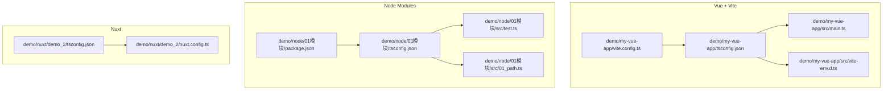
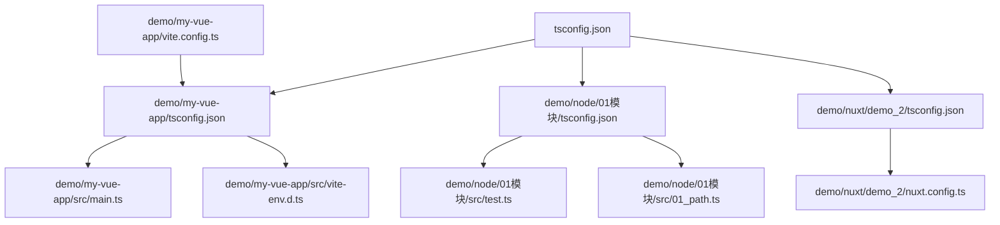
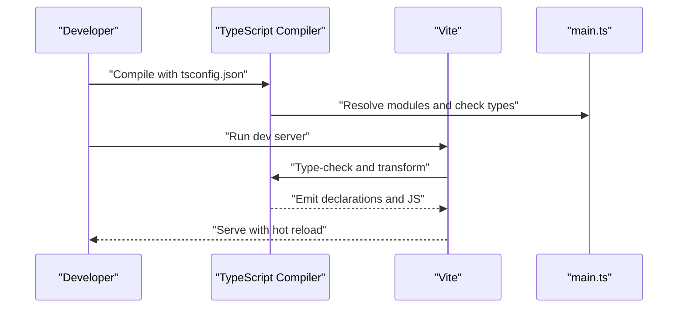
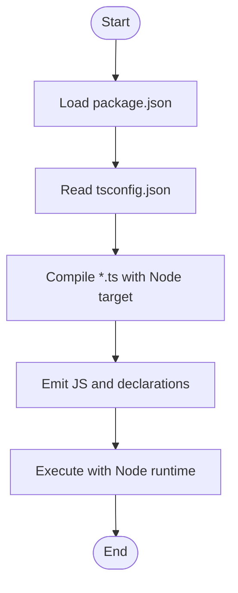
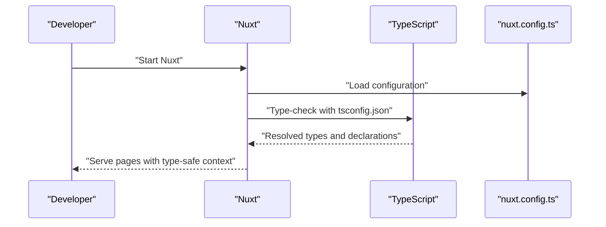
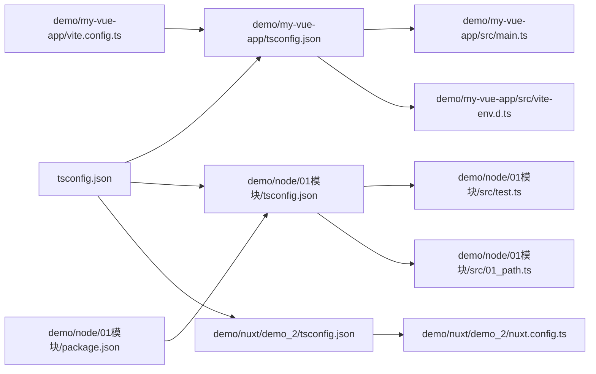

# TypeScript Integration Demo

<cite>
**Referenced Files in This Document**
- [tsconfig.json](file://tsconfig.json)
- [demo/my-vue-app/tsconfig.json](file://demo/my-vue-app/tsconfig.json)
- [demo/my-vue-app/src/main.ts](file://demo/my-vue-app/src/main.ts)
- [demo/my-vue-app/src/vite-env.d.ts](file://demo/my-vue-app/src/vite-env.d.ts)
- [demo/my-vue-app/vite.config.ts](file://demo/my-vue-app/vite.config.ts)
- [demo/node/01模块/src/test.ts](file://demo/node/01模块/src/test.ts)
- [demo/node/01模块/src/01_path.ts](file://demo/node/01模块/src/01_path.ts)
- [demo/node/01模块/package.json](file://demo/node/01模块/package.json)
- [demo/node/02_playground/tsconfig.json](file://demo/node/02_playground/tsconfig.json)
- [demo/node/02_playground/src/app.ts](file://demo/node/02_playground/src/app.ts)
- [demo/nuxt/demo_2/tsconfig.json](file://demo/nuxt/demo_2/tsconfig.json)
- [demo/nuxt/demo_2/nuxt.config.ts](file://demo/nuxt/demo_2/nuxt.config.ts)
</cite>

## Table of Contents
1. [Introduction](#introduction)
2. [Project Structure](#project-structure)
3. [Core Components](#core-components)
4. [Architecture Overview](#architecture-overview)
5. [Detailed Component Analysis](#detailed-component-analysis)
6. [Dependency Analysis](#dependency-analysis)
7. [Performance Considerations](#performance-considerations)
8. [Troubleshooting Guide](#troubleshooting-guide)
9. [Conclusion](#conclusion)

## Introduction
This document presents a hands-on TypeScript integration demo derived from real projects in the repository. It explains TypeScript configuration, type definitions, module systems, and advanced type features through practical examples. You will learn how configuration files govern compilation targets, module resolution, and type safety, and how these integrate with JavaScript interoperability in real-world setups such as Vue + Vite, Node.js modules, and Nuxt applications.

## Project Structure
The TypeScript integration spans three primary environments:
- Vue + Vite application with dual tsconfig files for app and node contexts
- Node.js module demos with explicit tsconfig and package.json
- Nuxt application with framework-specific tsconfig and configuration

**Diagram sources**
- [demo/my-vue-app/tsconfig.json](file://demo/my-vue-app/tsconfig.json)
- [demo/my-vue-app/src/main.ts](file://demo/my-vue-app/src/main.ts)
- [demo/my-vue-app/src/vite-env.d.ts](file://demo/my-vue-app/src/vite-env.d.ts)
- [demo/my-vue-app/vite.config.ts](file://demo/my-vue-app/vite.config.ts)
- [demo/node/01模块/src/test.ts](file://demo/node/01模块/src/test.ts)
- [demo/node/01模块/src/01_path.ts](file://demo/node/01模块/src/01_path.ts)
- [demo/node/01模块/package.json](file://demo/node/01模块/package.json)
- [demo/node/02_playground/tsconfig.json](file://demo/node/02_playground/tsconfig.json)
- [demo/nuxt/demo_2/tsconfig.json](file://demo/nuxt/demo_2/tsconfig.json)
- [demo/nuxt/demo_2/nuxt.config.ts](file://demo/nuxt/demo_2/nuxt.config.ts)

**Section sources**
- [demo/my-vue-app/tsconfig.json](file://demo/my-vue-app/tsconfig.json)
- [demo/my-vue-app/src/main.ts](file://demo/my-vue-app/src/main.ts)
- [demo/my-vue-app/src/vite-env.d.ts](file://demo/my-vue-app/src/vite-env.d.ts)
- [demo/my-vue-app/vite.config.ts](file://demo/my-vue-app/vite.config.ts)
- [demo/node/01模块/src/test.ts](file://demo/node/01模块/src/test.ts)
- [demo/node/01模块/src/01_path.ts](file://demo/node/01模块/src/01_path.ts)
- [demo/node/01模块/package.json](file://demo/node/01模块/package.json)
- [demo/node/02_playground/tsconfig.json](file://demo/node/02_playground/tsconfig.json)
- [demo/nuxt/demo_2/tsconfig.json](file://demo/nuxt/demo_2/tsconfig.json)
- [demo/nuxt/demo_2/nuxt.config.ts](file://demo/nuxt/demo_2/nuxt.config.ts)

## Core Components
- TypeScript configuration files define compiler options, module resolution, and target environments. Examples include a root tsconfig.json and framework-specific tsconfigs such as demo/my-vue-app/tsconfig.json and demo/nuxt/demo_2/tsconfig.json.
- Type declaration files provide ambient typings for global APIs. An example is demo/my-vue-app/src/vite-env.d.ts, which declares Vite’s environment.
- Module systems are demonstrated across:
  - Node.js modules with explicit tsconfig and package.json entries
  - Vue + Vite where tsconfig controls app vs node targets and Vite resolves modules
  - Nuxt where tsconfig integrates with framework configuration

Key takeaways:
- Compiler options control emit targets and module formats.
- Declaration files enable type-safe access to runtime globals.
- Build tools (Vite, Nuxt) rely on tsconfig for accurate type checking and module resolution.

**Section sources**
- [tsconfig.json](file://tsconfig.json)
- [demo/my-vue-app/tsconfig.json](file://demo/my-vue-app/tsconfig.json)
- [demo/my-vue-app/src/vite-env.d.ts](file://demo/my-vue-app/src/vite-env.d.ts)
- [demo/node/01模块/package.json](file://demo/node/01模块/package.json)
- [demo/nuxt/demo_2/tsconfig.json](file://demo/nuxt/demo_2/tsconfig.json)

## Architecture Overview
The TypeScript integration architecture connects configuration, modules, and build tools:

**Diagram sources**
- [tsconfig.json](file://tsconfig.json)
- [demo/my-vue-app/tsconfig.json](file://demo/my-vue-app/tsconfig.json)
- [demo/my-vue-app/src/main.ts](file://demo/my-vue-app/src/main.ts)
- [demo/my-vue-app/src/vite-env.d.ts](file://demo/my-vue-app/src/vite-env.d.ts)
- [demo/my-vue-app/vite.config.ts](file://demo/my-vue-app/vite.config.ts)
- [demo/node/01模块/src/test.ts](file://demo/node/01模块/src/test.ts)
- [demo/node/01模块/src/01_path.ts](file://demo/node/01模块/src/01_path.ts)
- [demo/nuxt/demo_2/tsconfig.json](file://demo/nuxt/demo_2/tsconfig.json)
- [demo/nuxt/demo_2/nuxt.config.ts](file://demo/nuxt/demo_2/nuxt.config.ts)

## Detailed Component Analysis

### Vue + Vite TypeScript Setup
This setup demonstrates:
- Dual tsconfig files for app and node contexts
- Ambient type declarations for Vite environment
- Build tool integration via Vite configuration

**Diagram sources**
- [demo/my-vue-app/tsconfig.json](file://demo/my-vue-app/tsconfig.json)
- [demo/my-vue-app/src/main.ts](file://demo/my-vue-app/src/main.ts)
- [demo/my-vue-app/src/vite-env.d.ts](file://demo/my-vue-app/src/vite-env.d.ts)
- [demo/my-vue-app/vite.config.ts](file://demo/my-vue-app/vite.config.ts)

Practical implications:
- Use separate tsconfig files to isolate app vs node targets.
- Add ambient type declarations for framework globals.
- Align compiler options with Vite’s expectations for module resolution and emit targets.

**Section sources**
- [demo/my-vue-app/tsconfig.json](file://demo/my-vue-app/tsconfig.json)
- [demo/my-vue-app/src/main.ts](file://demo/my-vue-app/src/main.ts)
- [demo/my-vue-app/src/vite-env.d.ts](file://demo/my-vue-app/src/vite-env.d.ts)
- [demo/my-vue-app/vite.config.ts](file://demo/my-vue-app/vite.config.ts)

### Node.js Module TypeScript Demo
This demo showcases:
- Explicit tsconfig targeting Node.js environments
- Package.json configuration for module resolution
- Practical TypeScript modules for Node APIs

**Diagram sources**
- [demo/node/01模块/package.json](file://demo/node/01模块/package.json)
- [demo/node/01模块/src/test.ts](file://demo/node/01模块/src/test.ts)
- [demo/node/01模块/src/01_path.ts](file://demo/node/01模块/src/01_path.ts)
- [demo/node/01模块/tsconfig.json](file://demo/node/01模块/tsconfig.json)

Best practices:
- Keep tsconfig aligned with Node runtime capabilities.
- Use package.json to guide module resolution and script entry points.
- Split concerns into focused modules for maintainability.

**Section sources**
- [demo/node/01模块/package.json](file://demo/node/01模块/package.json)
- [demo/node/01模块/src/test.ts](file://demo/node/01模块/src/test.ts)
- [demo/node/01模块/src/01_path.ts](file://demo/node/01模块/src/01_path.ts)
- [demo/node/01模块/tsconfig.json](file://demo/node/01模块/tsconfig.json)

### Nuxt TypeScript Integration
Nuxt integrates TypeScript through:
- Framework-aware tsconfig
- Nuxt configuration file driving build and dev behavior

**Diagram sources**
- [demo/nuxt/demo_2/tsconfig.json](file://demo/nuxt/demo_2/tsconfig.json)
- [demo/nuxt/demo_2/nuxt.config.ts](file://demo/nuxt/demo_2/nuxt.config.ts)

Operational notes:
- Ensure tsconfig aligns with Nuxt’s module resolution and runtime.
- Keep nuxt.config.ts in sync with TypeScript settings for accurate type inference.

**Section sources**
- [demo/nuxt/demo_2/tsconfig.json](file://demo/nuxt/demo_2/tsconfig.json)
- [demo/nuxt/demo_2/nuxt.config.ts](file://demo/nuxt/demo_2/nuxt.config.ts)

## Dependency Analysis
TypeScript configuration influences module resolution and build outcomes across environments. The following diagram maps key dependencies:

**Diagram sources**
- [tsconfig.json](file://tsconfig.json)
- [demo/my-vue-app/tsconfig.json](file://demo/my-vue-app/tsconfig.json)
- [demo/my-vue-app/src/main.ts](file://demo/my-vue-app/src/main.ts)
- [demo/my-vue-app/src/vite-env.d.ts](file://demo/my-vue-app/src/vite-env.d.ts)
- [demo/my-vue-app/vite.config.ts](file://demo/my-vue-app/vite.config.ts)
- [demo/node/01模块/tsconfig.json](file://demo/node/01模块/tsconfig.json)
- [demo/node/01模块/src/test.ts](file://demo/node/01模块/src/test.ts)
- [demo/node/01模块/src/01_path.ts](file://demo/node/01模块/src/01_path.ts)
- [demo/node/01模块/package.json](file://demo/node/01模块/package.json)
- [demo/nuxt/demo_2/tsconfig.json](file://demo/nuxt/demo_2/tsconfig.json)
- [demo/nuxt/demo_2/nuxt.config.ts](file://demo/nuxt/demo_2/nuxt.config.ts)

**Section sources**
- [tsconfig.json](file://tsconfig.json)
- [demo/my-vue-app/tsconfig.json](file://demo/my-vue-app/tsconfig.json)
- [demo/my-vue-app/src/main.ts](file://demo/my-vue-app/src/main.ts)
- [demo/my-vue-app/src/vite-env.d.ts](file://demo/my-vue-app/src/vite-env.d.ts)
- [demo/my-vue-app/vite.config.ts](file://demo/my-vue-app/vite.config.ts)
- [demo/node/01模块/tsconfig.json](file://demo/node/01模块/tsconfig.json)
- [demo/node/01模块/src/test.ts](file://demo/node/01模块/src/test.ts)
- [demo/node/01模块/src/01_path.ts](file://demo/node/01模块/src/01_path.ts)
- [demo/node/01模块/package.json](file://demo/node/01模块/package.json)
- [demo/nuxt/demo_2/tsconfig.json](file://demo/nuxt/demo_2/tsconfig.json)
- [demo/nuxt/demo_2/nuxt.config.ts](file://demo/nuxt/demo_2/nuxt.config.ts)

## Performance Considerations
- Prefer incremental builds by enabling appropriate tsconfig flags to speed up repeated compilations.
- Keep module resolution efficient by organizing imports and avoiding deep symlink chains.
- Align target environments with deployment platforms to minimize transpile overhead.
- Use ambient declarations judiciously to avoid bloating type checks.

## Troubleshooting Guide
Common issues and resolutions:
- Module resolution errors: Verify tsconfig paths and baseUrl; ensure package.json entries match module specifiers.
- Missing ambient types: Add or adjust declaration files for framework globals (e.g., Vite env).
- Target mismatch: Confirm compilerOptions target and module align with runtime and bundler expectations.
- Build tool conflicts: Align tsconfig with Vite/Nuxt configuration to prevent duplicate or conflicting type checks.

**Section sources**
- [demo/my-vue-app/src/vite-env.d.ts](file://demo/my-vue-app/src/vite-env.d.ts)
- [demo/my-vue-app/tsconfig.json](file://demo/my-vue-app/tsconfig.json)
- [demo/node/01模块/package.json](file://demo/node/01模块/package.json)
- [demo/nuxt/demo_2/tsconfig.json](file://demo/nuxt/demo_2/tsconfig.json)

## Conclusion
By leveraging real-world configurations and examples, this demo illustrates how TypeScript configuration, type definitions, and module systems integrate with modern build tools. Start with aligned tsconfig files, augment with ambient declarations where needed, and coordinate with framework-specific configuration for robust type safety and seamless JavaScript interoperability.