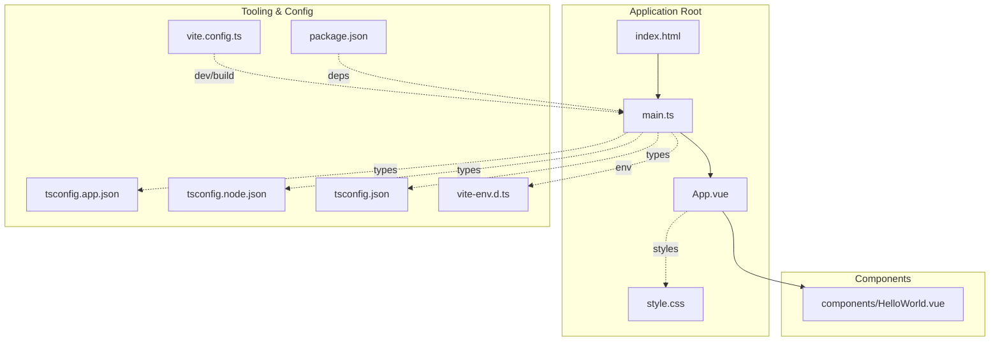
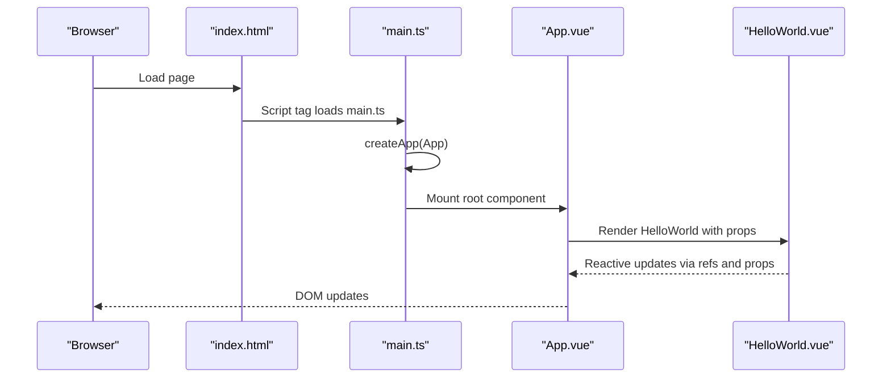
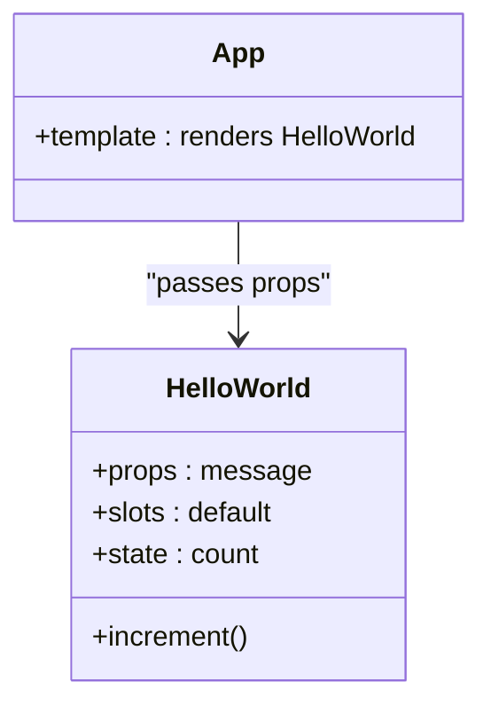
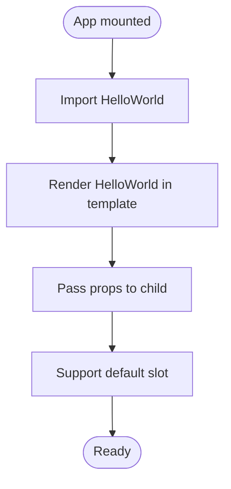
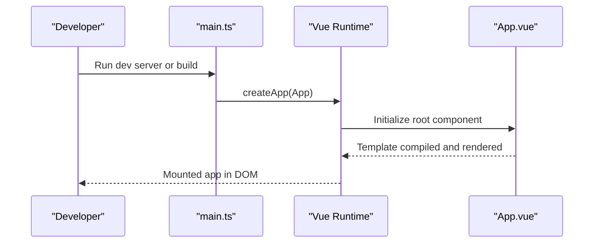
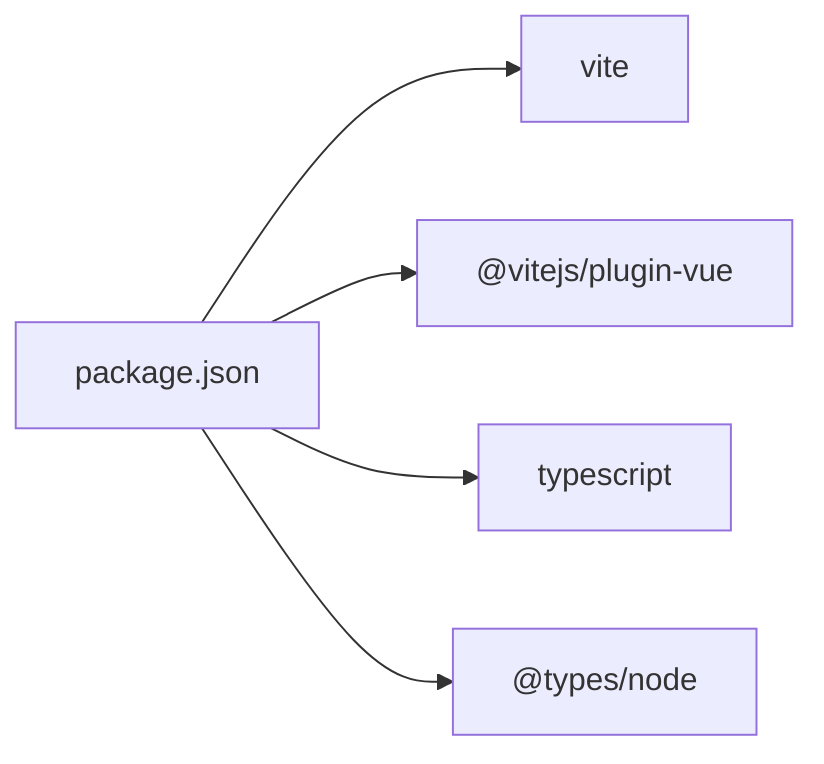

# Vue.js Demo Application

<cite>
**Referenced Files in This Document**
- [App.vue](file://demo/my-vue-app/src/App.vue)
- [HelloWorld.vue](file://demo/my-vue-app/src/components/HelloWorld.vue)
- [main.ts](file://demo/my-vue-app/src/main.ts)
- [style.css](file://demo/my-vue-app/src/style.css)
- [vite.config.ts](file://demo/my-vue-app/vite.config.ts)
- [package.json](file://demo/my-vue-app/package.json)
- [tsconfig.app.json](file://demo/my-vue-app/tsconfig.app.json)
- [tsconfig.json](file://demo/my-vue-app/tsconfig.json)
- [tsconfig.node.json](file://demo/my-vue-app/tsconfig.node.json)
- [vite-env.d.ts](file://demo/my-vue-app/src/vite-env.d.ts)
- [index.html](file://demo/my-vue-app/index.html)
</cite>

## Table of Contents
1. [Introduction](#introduction)
2. [Project Structure](#project-structure)
3. [Core Components](#core-components)
4. [Architecture Overview](#architecture-overview)
5. [Detailed Component Analysis](#detailed-component-analysis)
6. [Dependency Analysis](#dependency-analysis)
7. [Performance Considerations](#performance-considerations)
8. [Troubleshooting Guide](#troubleshooting-guide)
9. [Conclusion](#conclusion)

## Introduction
This document explains a modern Vue.js single-page application built with TypeScript and Vite. It covers the component structure, TypeScript integration, Vite configuration, and build processes. It also documents the HelloWorld component example, the main.ts entry point, styling approaches, and asset management. The guide emphasizes practical patterns for component composition, reactive data binding, and Vue/Vite integration, suitable for both beginners and experienced developers adapting these patterns to production environments.

## Project Structure
The Vue demo application follows a conventional structure with clear separation of concerns:
- Entry point and root component define the SPA bootstrap and top-level UI.
- A dedicated component showcases reactive data binding and props.
- TypeScript configuration files enable strict type checking for both application and Node tooling.
- Vite handles development and production builds, including fast refresh and optimized bundling.

**Diagram sources**
- [index.html](file://demo/my-vue-app/index.html)
- [main.ts](file://demo/my-vue-app/src/main.ts)
- [App.vue](file://demo/my-vue-app/src/App.vue)
- [HelloWorld.vue](file://demo/my-vue-app/src/components/HelloWorld.vue)
- [style.css](file://demo/my-vue-app/src/style.css)
- [vite.config.ts](file://demo/my-vue-app/vite.config.ts)
- [package.json](file://demo/my-vue-app/package.json)
- [tsconfig.app.json](file://demo/my-vue-app/tsconfig.app.json)
- [tsconfig.node.json](file://demo/my-vue-app/tsconfig.node.json)
- [tsconfig.json](file://demo/my-vue-app/tsconfig.json)
- [vite-env.d.ts](file://demo/my-vue-app/src/vite-env.d.ts)

**Section sources**
- [index.html](file://demo/my-vue-app/index.html)
- [main.ts](file://demo/my-vue-app/src/main.ts)
- [App.vue](file://demo/my-vue-app/src/App.vue)
- [HelloWorld.vue](file://demo/my-vue-app/src/components/HelloWorld.vue)
- [style.css](file://demo/my-vue-app/src/style.css)
- [vite.config.ts](file://demo/my-vue-app/vite.config.ts)
- [package.json](file://demo/my-vue-app/package.json)
- [tsconfig.app.json](file://demo/my-vue-app/tsconfig.app.json)
- [tsconfig.node.json](file://demo/my-vue-app/tsconfig.node.json)
- [tsconfig.json](file://demo/my-vue-app/tsconfig.json)
- [vite-env.d.ts](file://demo/my-vue-app/src/vite-env.d.ts)

## Core Components
- App.vue: Root component that orchestrates layout and includes the HelloWorld component.
- HelloWorld.vue: Example component demonstrating props, slots, and reactive data binding.
- main.ts: Application entry point that mounts the root component via createApp.
- style.css: Global stylesheet applied to the application.
- vite.config.ts: Vite configuration enabling Vue plugin and optional overrides.
- TypeScript configs: Separate configurations for app, Node, and root to isolate compile targets and strictness.

Key implementation highlights:
- Component composition: App.vue imports and renders HelloWorld.vue.
- Reactive data: HelloWorld.vue uses ref to manage local state and exposes props for parent-child communication.
- Type safety: TypeScript configs enforce strict checks for both browser and Node contexts.
- Build tooling: Vite integrates Vue SFC compilation and dev server features.

**Section sources**
- [App.vue](file://demo/my-vue-app/src/App.vue)
- [HelloWorld.vue](file://demo/my-vue-app/src/components/HelloWorld.vue)
- [main.ts](file://demo/my-vue-app/src/main.ts)
- [style.css](file://demo/my-vue-app/src/style.css)
- [vite.config.ts](file://demo/my-vue-app/vite.config.ts)
- [tsconfig.app.json](file://demo/my-vue-app/tsconfig.app.json)
- [tsconfig.node.json](file://demo/my-vue-app/tsconfig.node.json)
- [tsconfig.json](file://demo/my-vue-app/tsconfig.json)

## Architecture Overview
The runtime architecture centers on mounting the root component and rendering child components. Vite compiles Vue Single File Components (SFCs), applies TypeScript transpilation, and serves assets during development with hot module replacement.

**Diagram sources**
- [index.html](file://demo/my-vue-app/index.html)
- [main.ts](file://demo/my-vue-app/src/main.ts)
- [App.vue](file://demo/my-vue-app/src/App.vue)
- [HelloWorld.vue](file://demo/my-vue-app/src/components/HelloWorld.vue)

## Detailed Component Analysis

### HelloWorld Component
The HelloWorld component demonstrates:
- Props definition for passing data from parent to child.
- Local reactive state using ref for internal updates.
- Optional slot usage for flexible content projection.
- Composition pattern via setup() returning template bindings.

**Diagram sources**
- [HelloWorld.vue](file://demo/my-vue-app/src/components/HelloWorld.vue)
- [App.vue](file://demo/my-vue-app/src/App.vue)

**Section sources**
- [HelloWorld.vue](file://demo/my-vue-app/src/components/HelloWorld.vue)
- [App.vue](file://demo/my-vue-app/src/App.vue)

### App Root Component
The App component:
- Imports and renders HelloWorld.
- Applies global styles from style.css.
- Serves as the container for page-level layout and state.

**Diagram sources**
- [App.vue](file://demo/my-vue-app/src/App.vue)

**Section sources**
- [App.vue](file://demo/my-vue-app/src/App.vue)

### Entry Point: main.ts
The main.ts file:
- Creates the Vue app instance with createApp.
- Passes the root component (App.vue) to mount.
- Handles environment-specific types via vite-env.d.ts.

**Diagram sources**
- [main.ts](file://demo/my-vue-app/src/main.ts)
- [App.vue](file://demo/my-vue-app/src/App.vue)

**Section sources**
- [main.ts](file://demo/my-vue-app/src/main.ts)

### TypeScript Integration
TypeScript configuration layers:
- tsconfig.app.json: Strict checks for application code.
- tsconfig.node.json: Strict checks for Node tooling and Vite plugins.
- tsconfig.json: Root configuration combining project-wide settings.
- vite-env.d.ts: Type declarations for Vite environment (e.g., import.meta.env).

Best practices:
- Keep app and node configs separate to avoid leaking Node-only types into browser bundles.
- Use strict mode for early bug detection.
- Leverage declaration files for Vite features (e.g., env vars, assets).

**Section sources**
- [tsconfig.app.json](file://demo/my-vue-app/tsconfig.app.json)
- [tsconfig.node.json](file://demo/my-vue-app/tsconfig.node.json)
- [tsconfig.json](file://demo/my-vue-app/tsconfig.json)
- [vite-env.d.ts](file://demo/my-vue-app/src/vite-env.d.ts)

### Vite Configuration and Build Processes
vite.config.ts:
- Enables @vitejs/plugin-vue for SFC support.
- Provides defaults for dev server, aliasing, and build optimization.

Build and dev workflows:
- Development: Fast refresh, HMR, and inline sourcemaps.
- Production: Tree-shaken bundles, minification, and asset optimization.

Asset management:
- Static assets under public are served as-is.
- Dynamic imports and CSS are processed by Vite’s pipeline.

**Section sources**
- [vite.config.ts](file://demo/my-vue-app/vite.config.ts)
- [package.json](file://demo/my-vue-app/package.json)

### Styling Approaches
Global styles:
- style.css is imported by the root component and affects the entire app.
- Scoped styles can be added per component using <style scoped> inside SFCs.

CSS-in-JS and preprocessors:
- Optional integrations (e.g., Sass, PostCSS) can be configured in Vite for advanced styling needs.

**Section sources**
- [style.css](file://demo/my-vue-app/src/style.css)
- [App.vue](file://demo/my-vue-app/src/App.vue)

### Component Communication Patterns
- Props: Parent passes data to child (e.g., message prop).
- Events: Child emits events to parent (e.g., update:count).
- Slots: Flexible content projection for reusable UI.
- Provide/Inject: For deep descendant communication in larger apps.

Patterns demonstrated:
- HelloWorld receives a message prop and renders it.
- Reactive state updates propagate back to parent via event emission.

**Section sources**
- [HelloWorld.vue](file://demo/my-vue-app/src/components/HelloWorld.vue)
- [App.vue](file://demo/my-vue-app/src/App.vue)

### State Management Approaches
- Local state: ref/reactive inside components for small UI state.
- Global state: Pinia for centralized state when the app grows.

Recommended steps:
- Start with local state per component.
- Introduce Pinia when cross-component state sharing becomes frequent.
- Keep actions and getters pure and synchronous where possible.

[No sources needed since this section provides general guidance]

## Dependency Analysis
The application depends on Vue and Vite ecosystem packages. The package.json lists core dependencies and scripts for dev and build tasks.

**Diagram sources**
- [package.json](file://demo/my-vue-app/package.json)

**Section sources**
- [package.json](file://demo/my-vue-app/package.json)

## Performance Considerations
- Lazy loading: Split routes and heavy components to reduce initial bundle size.
- Tree shaking: Prefer ES modules and disable unused features.
- Asset optimization: Compress images and minimize CSS/JS.
- Dev vs prod: Use production builds for performance testing and profiling.

[No sources needed since this section provides general guidance]

## Troubleshooting Guide
Common issues and resolutions:
- Missing type declarations: Ensure vite-env.d.ts exists and is included in tsconfig.
- SFC compilation errors: Verify @vitejs/plugin-vue is present in vite.config.ts.
- Hot reload not working: Check port conflicts and network settings in dev server.
- CSS not applying: Confirm global styles are imported in the root component.

**Section sources**
- [vite-env.d.ts](file://demo/my-vue-app/src/vite-env.d.ts)
- [vite.config.ts](file://demo/my-vue-app/vite.config.ts)
- [App.vue](file://demo/my-vue-app/src/App.vue)

## Conclusion
This Vue.js demo application illustrates a clean, modern setup with TypeScript and Vite. It demonstrates component composition, reactive data binding, and scalable build tooling. By following the patterns outlined here—strict TypeScript configs, modular components, and efficient Vite tooling—you can adapt this foundation to production-grade applications with confidence.