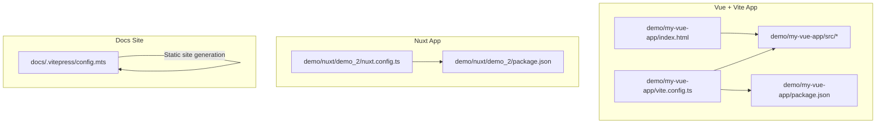
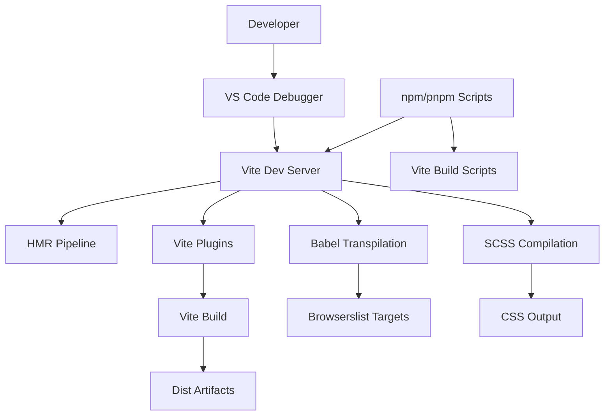
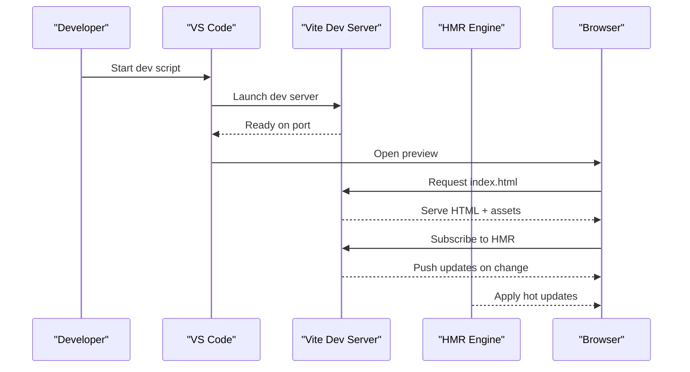
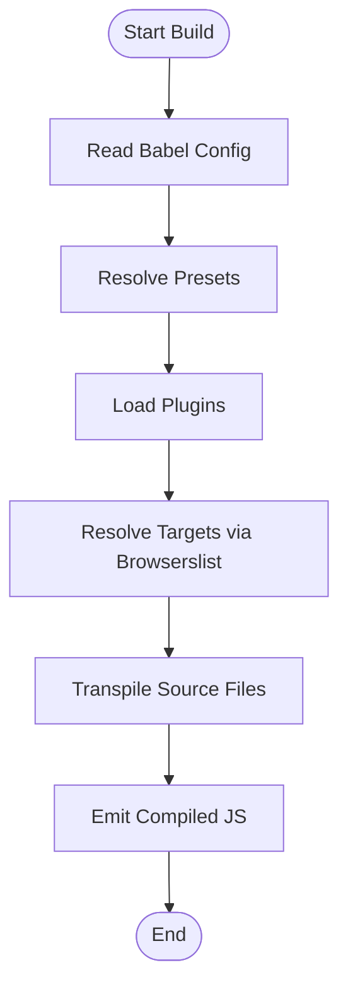
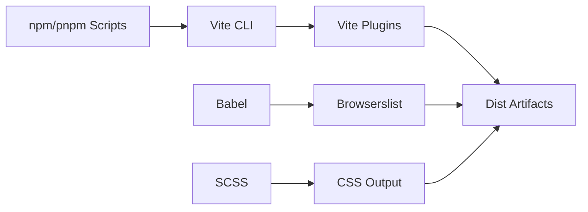

# Build Tools and Automation

<cite>
**Referenced Files in This Document**
- [vite.config.ts](file://demo/my-vue-app/vite.config.ts)
- [package.json](file://demo/my-vue-app/package.json)
- [index.html](file://demo/my-vue-app/index.html)
- [main.ts](file://demo/my-vue-app/src/main.ts)
- [App.vue](file://demo/my-vue-app/src/App.vue)
- [style.css](file://demo/my-vue-app/src/style.css)
- [vite.config.ts](file://demo/nuxt/demo_2/nuxt.config.ts)
- [package.json](file://demo/nuxt/demo_2/package.json)
- [config.mts](file://docs/.vitepress/config.mts)
- [01_HMR.md](file://docs/02_工程化/03_vite/01_HMR.md)
- [02_配置文件.md](file://docs/02_工程化/05_babel/02_配置文件.md)
- [03_配置选项.md](file://docs/02_工程化/05_babel/03_配置选项.md)
- [04_预设.md](file://docs/02_工程化/05_babel/04_预设.md)
- [05_preset-env预设.md](file://docs/02_工程化/05_babel/05_preset-env预设.md)
- [06_插件.md](file://docs/02_工程化/05_babel/06_插件.md)
- [02_CSS 功能扩展.md](file://docs/02_工程化/07_scss/02_CSS 功能扩展.md)
- [03_SassScript.md](file://docs/02_工程化/07_scss/03_SassScript.md)
- [04_规则.md](file://docs/02_工程化/07_scss/04_规则.md)
- [05_流控制规则.md](file://docs/02_工程化/07_scss/05_流控制规则.md)
- [06_混入.md](file://docs/02_工程化/07_scss/06_混入.md)
- [07_函数.md](file://docs/02_工程化/07_scss/07_函数.md)
- [08_扩展.md](file://docs/02_工程化/07_scss/08_扩展.md)
- [01_home.md](file://docs/02_工程化/09_Browserslist/01_home.md)
- [02_概述.md](file://docs/02_工程化/01_vscode/02_概述.md)
- [01_npm.md](file://docs/02_工程化/06_npm/01_npm.md)
- [06_脚本.md](file://docs/02_工程化/06_npm/06_脚本.md)
- [01_pnpm.md](file://docs/02_工程化/10_pnpm/01_pnpm.md)
- [02_工作空间.md](file://docs/02_工程化/10_pnpm/02_工作空间.md)
- [03_问题.md](file://docs/02_工程化/10_pnpm/03_问题.md)
</cite>

## Table of Contents
1. [Introduction](#introduction)
2. [Project Structure](#project-structure)
3. [Core Components](#core-components)
4. [Architecture Overview](#architecture-overview)
5. [Detailed Component Analysis](#detailed-component-analysis)
6. [Dependency Analysis](#dependency-analysis)
7. [Performance Considerations](#performance-considerations)
8. [Troubleshooting Guide](#troubleshooting-guide)
9. [Conclusion](#conclusion)
10. [Appendices](#appendices)

## Introduction
This document explains modern build tools and automation workflows with a focus on Vite, Babel, VS Code, Browserslist, and SCSS. It synthesizes configuration patterns, optimization strategies, and development server capabilities from real projects in this repository, and augments them with authoritative guidance for static site generation, hot module replacement (HMR), and production builds. Practical examples are linked via file paths to concrete configurations and documentation.

## Project Structure
The repository includes:
- A Vue + TypeScript Vite application demonstrating a modern frontend build pipeline.
- A Nuxt 2 application showcasing SSR-oriented build configuration.
- A documentation site powered by VitePress for static site generation.
- Extensive engineering documentation covering Babel, SCSS, Browserslist, VS Code, npm, and pnpm.

**Diagram sources**
- [vite.config.ts](file://demo/my-vue-app/vite.config.ts)
- [package.json](file://demo/my-vue-app/package.json)
- [index.html](file://demo/my-vue-app/index.html)
- [vite.config.ts](file://demo/nuxt/demo_2/nuxt.config.ts)
- [package.json](file://demo/nuxt/demo_2/package.json)
- [config.mts](file://docs/.vitepress/config.mts)

**Section sources**
- [vite.config.ts](file://demo/my-vue-app/vite.config.ts)
- [package.json](file://demo/my-vue-app/package.json)
- [index.html](file://demo/my-vue-app/index.html)
- [vite.config.ts](file://demo/nuxt/demo_2/nuxt.config.ts)
- [package.json](file://demo/nuxt/demo_2/package.json)
- [config.mts](file://docs/.vitepress/config.mts)

## Core Components
- Vite configuration for development and build, including plugins, aliases, and asset handling.
- Babel configuration and presets for JavaScript/TypeScript transpilation.
- SCSS/Sass preprocessing and authoring guidelines.
- Browserslist configuration for target browser support.
- VS Code setup for debugging and development ergonomics.
- npm and pnpm workflows for scripts, workspaces, and dependency management.

**Section sources**
- [vite.config.ts](file://demo/my-vue-app/vite.config.ts)
- [package.json](file://demo/my-vue-app/package.json)
- [02_配置文件.md](file://docs/02_工程化/05_babel/02_配置文件.md)
- [03_配置选项.md](file://docs/02_工程化/05_babel/03_配置选项.md)
- [04_预设.md](file://docs/02_工程化/05_babel/04_预设.md)
- [05_preset-env预设.md](file://docs/02_工程化/05_babel/05_preset-env预设.md)
- [06_插件.md](file://docs/02_工程化/05_babel/06_插件.md)
- [02_CSS 功能扩展.md](file://docs/02_工程化/07_scss/02_CSS 功能扩展.md)
- [03_SassScript.md](file://docs/02_工程化/07_scss/03_SassScript.md)
- [04_规则.md](file://docs/02_工程化/07_scss/04_规则.md)
- [05_流控制规则.md](file://docs/02_工程化/07_scss/05_流控制规则.md)
- [06_混入.md](file://docs/02_工程化/07_scss/06_混入.md)
- [07_函数.md](file://docs/02_工程化/07_scss/07_函数.md)
- [08_扩展.md](file://docs/02_工程化/07_scss/08_扩展.md)
- [01_home.md](file://docs/02_工程化/09_Browserslist/01_home.md)
- [02_概述.md](file://docs/02_工程化/01_vscode/02_概述.md)
- [01_npm.md](file://docs/02_工程化/06_npm/01_npm.md)
- [06_脚本.md](file://docs/02_工程化/06_npm/06_脚本.md)
- [01_pnpm.md](file://docs/02_工程化/10_pnpm/01_pnpm.md)
- [02_工作空间.md](file://docs/02_工程化/10_pnpm/02_工作空间.md)
- [03_问题.md](file://docs/02_工程化/10_pnpm/03_问题.md)

## Architecture Overview
The build system integrates:
- Vite for fast dev server, HMR, and optimized bundling.
- Babel for transpilation and polyfills aligned with Browserslist targets.
- SCSS/Sass for modular stylesheets and advanced features.
- VS Code for debugging and editor productivity.
- npm/pnpm for scripts and workspace management.

**Diagram sources**
- [vite.config.ts](file://demo/my-vue-app/vite.config.ts)
- [01_HMR.md](file://docs/02_工程化/03_vite/01_HMR.md)
- [02_配置文件.md](file://docs/02_工程化/05_babel/02_配置文件.md)
- [05_preset-env预设.md](file://docs/02_工程化/05_babel/05_preset-env预设.md)
- [02_CSS 功能扩展.md](file://docs/02_工程化/07_scss/02_CSS 功能扩展.md)
- [06_脚本.md](file://docs/02_工程化/06_npm/06_脚本.md)
- [01_pnpm.md](file://docs/02_工程化/10_pnpm/01_pnpm.md)

## Detailed Component Analysis

### Vite Configuration and Optimization
Key aspects observed in the Vite application:
- Entry points and HTML wiring align with standard Vite conventions.
- Package scripts orchestrate dev/build/test tasks.
- Typical Vite features include fast cold start, efficient HMR, and optimized production bundles.

**Diagram sources**
- [vite.config.ts](file://demo/my-vue-app/vite.config.ts)
- [package.json](file://demo/my-vue-app/package.json)
- [index.html](file://demo/my-vue-app/index.html)
- [01_HMR.md](file://docs/02_工程化/03_vite/01_HMR.md)

Practical configuration references:
- Application entry and build configuration: [vite.config.ts](file://demo/my-vue-app/vite.config.ts)
- HTML entry for development server: [index.html](file://demo/my-vue-app/index.html)
- Scripts and commands: [package.json](file://demo/my-vue-app/package.json)

Optimization strategies:
- Prefer native ESM and dynamic imports for lazy loading.
- Use Vite’s built-in code splitting and asset handling.
- Configure external libraries and polyfills thoughtfully to avoid duplication.

**Section sources**
- [vite.config.ts](file://demo/my-vue-app/vite.config.ts)
- [package.json](file://demo/my-vue-app/package.json)
- [index.html](file://demo/my-vue-app/index.html)
- [01_HMR.md](file://docs/02_工程化/03_vite/01_HMR.md)

### Babel Transpilation Setup
Babel configuration and presets define how modern JavaScript is transformed for target environments:
- Configuration file location and structure.
- Presets selection and ordering.
- Plugin usage for transformations and polyfills.
- Integration with Browserslist to align output with supported browsers.

**Diagram sources**
- [02_配置文件.md](file://docs/02_工程化/05_babel/02_配置文件.md)
- [03_配置选项.md](file://docs/02_工程化/05_babel/03_配置选项.md)
- [04_预设.md](file://docs/02_工程化/05_babel/04_预设.md)
- [05_preset-env预设.md](file://docs/02_工程化/05_babel/05_preset-env预设.md)
- [06_插件.md](file://docs/02_工程化/05_babel/06_插件.md)
- [01_home.md](file://docs/02_工程化/09_Browserslist/01_home.md)

Practical references:
- Configuration file guidance: [02_配置文件.md](file://docs/02_工程化/05_babel/02_配置文件.md)
- Options and behavior: [03_配置选项.md](file://docs/02_工程化/05_babel/03_配置选项.md)
- Preset composition: [04_预设.md](file://docs/02_工程化/05_babel/04_预设.md)
- Environment-specific transforms: [05_preset-env预设.md](file://docs/02_工程化/05_babel/05_preset-env预设.md)
- Plugin usage patterns: [06_插件.md](file://docs/02_工程化/05_babel/06_插件.md)
- Target browsers alignment: [01_home.md](file://docs/02_工程化/09_Browserslist/01_home.md)

**Section sources**
- [02_配置文件.md](file://docs/02_工程化/05_babel/02_配置文件.md)
- [03_配置选项.md](file://docs/02_工程化/05_babel/03_配置选项.md)
- [04_预设.md](file://docs/02_工程化/05_babel/04_预设.md)
- [05_preset-env预设.md](file://docs/02_工程化/05_babel/05_preset-env预设.md)
- [06_插件.md](file://docs/02_工程化/05_babel/06_插件.md)
- [01_home.md](file://docs/02_工程化/09_Browserslist/01_home.md)

### VS Code Configuration
Recommended setup for debugging and development:
- Extensions for linting, formatting, and language support.
- Debugging launch configurations for local dev servers.
- Workspace settings for consistent formatting and editor behavior.

References:
- General overview and setup guidance: [02_概述.md](file://docs/02_工程化/01_vscode/02_概述.md)

**Section sources**
- [02_概述.md](file://docs/02_工程化/01_vscode/02_概述.md)

### Browserslist Configuration
Define target browsers to drive transpilation and polyfill decisions:
- Centralized configuration for Babel, PostCSS, Autoprefixer, and others.
- Version ranges and usage-based targeting.

Reference:
- Target configuration guidance: [01_home.md](file://docs/02_工程化/09_Browserslist/01_home.md)

**Section sources**
- [01_home.md](file://docs/02_工程化/09_Browserslist/01_home.md)

### SCSS/Sass Preprocessing
Authoring and processing guidelines:
- CSS extensibility and modularization.
- SassScript for variables, maps, and computations.
- Rules, control flow, mixins, functions, and extends.

References:
- CSS features and SCSS fundamentals: [02_CSS 功能扩展.md](file://docs/02_工程化/07_scss/02_CSS 功能扩展.md)
- SassScript basics: [03_SassScript.md](file://docs/02_工程化/07_scss/03_SassScript.md)
- Rules and structure: [04_规则.md](file://docs/02_工程化/07_scss/04_规则.md)
- Control flow: [05_流控制规则.md](file://docs/02_工程化/07_scss/05_流控制规则.md)
- Mixins: [06_混入.md](file://docs/02_工程化/07_scss/06_混入.md)
- Functions: [07_函数.md](file://docs/02_工程化/07_scss/07_函数.md)
- Extends: [08_扩展.md](file://docs/02_工程化/07_scss/08_扩展.md)

**Section sources**
- [02_CSS 功能扩展.md](file://docs/02_工程化/07_scss/02_CSS 功能扩展.md)
- [03_SassScript.md](file://docs/02_工程化/07_scss/03_SassScript.md)
- [04_规则.md](file://docs/02_工程化/07_scss/04_规则.md)
- [05_流控制规则.md](file://docs/02_工程化/07_scss/05_流控制规则.md)
- [06_混入.md](file://docs/02_工程化/07_scss/06_混入.md)
- [07_函数.md](file://docs/02_工程化/07_scss/07_函数.md)
- [08_扩展.md](file://docs/02_工程化/07_scss/08_扩展.md)

### Development Server and HMR
- Vite’s dev server provides instant feedback during development.
- HMR updates modules without full reloads when configured properly.

References:
- HMR behavior and tips: [01_HMR.md](file://docs/02_工程化/03_vite/01_HMR.md)

**Section sources**
- [01_HMR.md](file://docs/02_工程化/03_vite/01_HMR.md)

### Build Optimization Techniques
- Minimize bundle size with tree shaking and code splitting.
- Optimize asset handling and CDN strategies.
- Use environment-aware builds and feature flags.

[No sources needed since this section provides general guidance]

### Static Site Generation and Docs Tooling
- VitePress configuration supports static site generation and theme customization.

Reference:
- VitePress configuration: [config.mts](file://docs/.vitepress/config.mts)

**Section sources**
- [config.mts](file://docs/.vitepress/config.mts)

### Nuxt SSR Build Configuration
- Nuxt applications use a dedicated configuration file for SSR and rendering modes.

Reference:
- Nuxt configuration: [vite.config.ts](file://demo/nuxt/demo_2/nuxt.config.ts)
- Dependencies and scripts: [package.json](file://demo/nuxt/demo_2/package.json)

**Section sources**
- [vite.config.ts](file://demo/nuxt/demo_2/nuxt.config.ts)
- [package.json](file://demo/nuxt/demo_2/package.json)

## Dependency Analysis
Relationships among build tools and scripts:
- npm/pnpm scripts orchestrate Vite dev/build tasks.
- Babel presets/plugins depend on Browserslist targets.
- Vite plugins integrate with transpilation and asset pipelines.

**Diagram sources**
- [06_脚本.md](file://docs/02_工程化/06_npm/06_脚本.md)
- [01_pnpm.md](file://docs/02_工程化/10_pnpm/01_pnpm.md)
- [05_preset-env预设.md](file://docs/02_工程化/05_babel/05_preset-env预设.md)
- [02_CSS 功能扩展.md](file://docs/02_工程化/07_scss/02_CSS 功能扩展.md)

**Section sources**
- [06_脚本.md](file://docs/02_工程化/06_npm/06_脚本.md)
- [01_pnpm.md](file://docs/02_工程化/10_pnpm/01_pnpm.md)
- [05_preset-env预设.md](file://docs/02_工程化/05_babel/05_preset-env预设.md)
- [02_CSS 功能扩展.md](file://docs/02_工程化/07_scss/02_CSS 功能扩展.md)

## Performance Considerations
- Favor native ESM and dynamic imports to enable lazy loading.
- Keep plugin sets minimal and scoped to reduce transform overhead.
- Align Babel transforms with Browserslist to avoid unnecessary polyfills.
- Use Vite’s built-in asset handling and compression for production builds.

[No sources needed since this section provides general guidance]

## Troubleshooting Guide
Common issues and resolutions:
- HMR not updating: Verify client-server connection and plugin compatibility.
- Transpilation errors: Confirm Babel configuration and preset order.
- Asset resolution failures: Check Vite resolve and alias settings.
- Dependency conflicts: Use npm/pnpm scripts and workspace management.

References:
- HMR behavior: [01_HMR.md](file://docs/02_工程化/03_vite/01_HMR.md)
- npm scripts: [06_脚本.md](file://docs/02_工程化/06_npm/06_脚本.md)
- pnpm workspace and issues: [02_工作空间.md](file://docs/02_工程化/10_pnpm/02_工作空间.md), [03_问题.md](file://docs/02_工程化/10_pnpm/03_问题.md)

**Section sources**
- [01_HMR.md](file://docs/02_工程化/03_vite/01_HMR.md)
- [06_脚本.md](file://docs/02_工程化/06_npm/06_脚本.md)
- [02_工作空间.md](file://docs/02_工程化/10_pnpm/02_工作空间.md)
- [03_问题.md](file://docs/02_工程化/10_pnpm/03_问题.md)

## Conclusion
By combining Vite’s fast dev server and HMR, Babel’s targeted transpilation, SCSS/Sass for maintainable styles, Browserslist for precise browser targeting, and VS Code for streamlined development, teams can achieve efficient modern workflows. The referenced configuration files and documentation provide concrete anchors for building, optimizing, and troubleshooting these systems.

[No sources needed since this section summarizes without analyzing specific files]

## Appendices
- Example configuration locations:
  - Vite app: [vite.config.ts](file://demo/my-vue-app/vite.config.ts), [package.json](file://demo/my-vue-app/package.json), [index.html](file://demo/my-vue-app/index.html)
  - Nuxt app: [vite.config.ts](file://demo/nuxt/demo_2/nuxt.config.ts), [package.json](file://demo/nuxt/demo_2/package.json)
  - Docs site: [config.mts](file://docs/.vitepress/config.mts)
- Babel and SCSS documentation: [02_配置文件.md](file://docs/02_工程化/05_babel/02_配置文件.md), [02_CSS 功能扩展.md](file://docs/02_工程化/07_scss/02_CSS 功能扩展.md)
- VS Code setup: [02_概述.md](file://docs/02_工程化/01_vscode/02_概述.md)
- npm and pnpm workflows: [01_npm.md](file://docs/02_工程化/06_npm/01_npm.md), [06_脚本.md](file://docs/02_工程化/06_npm/06_脚本.md), [01_pnpm.md](file://docs/02_工程化/10_pnpm/01_pnpm.md), [02_工作空间.md](file://docs/02_工程化/10_pnpm/02_工作空间.md), [03_问题.md](file://docs/02_工程化/10_pnpm/03_问题.md)