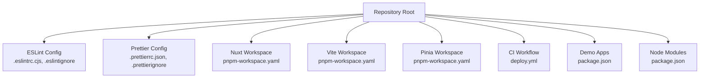
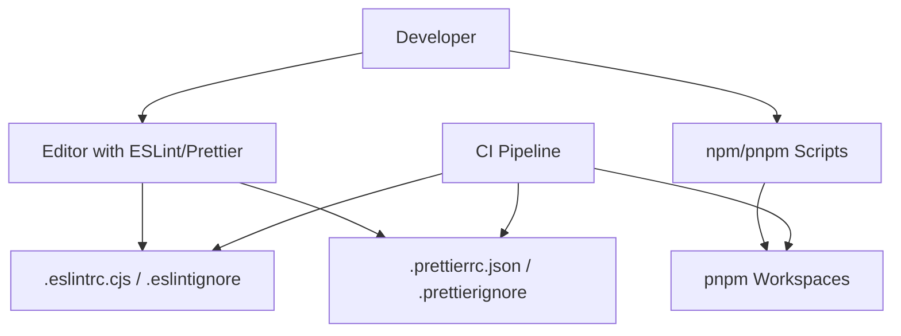
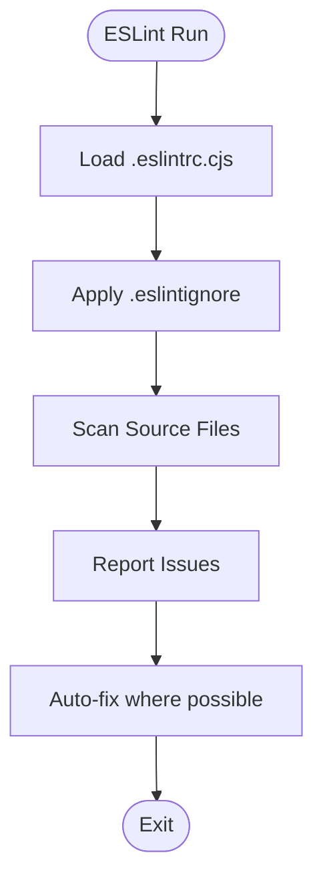
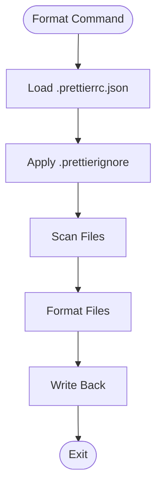
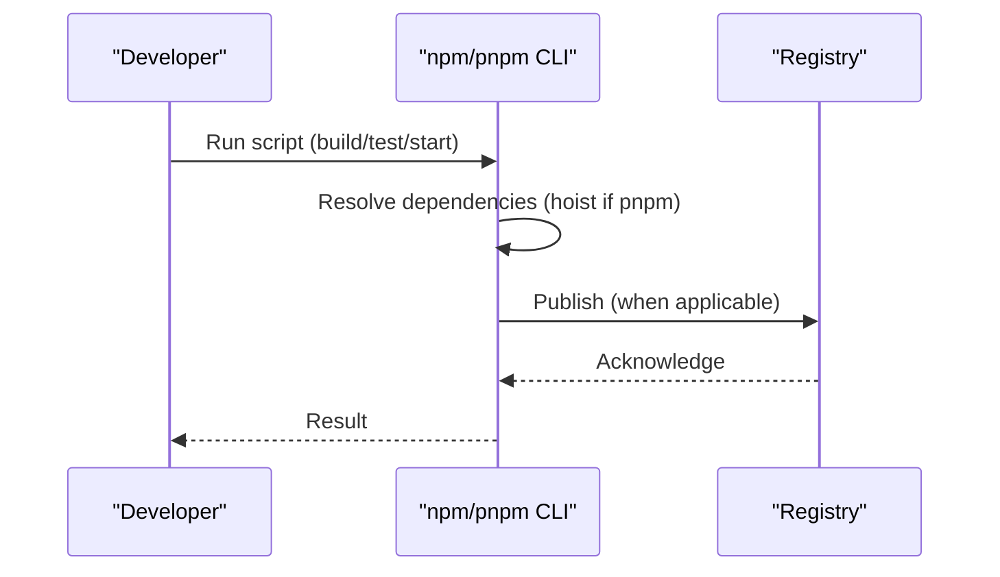
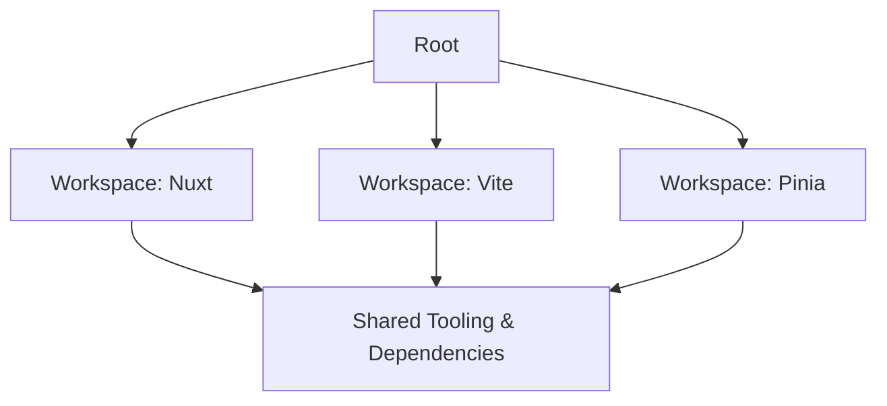
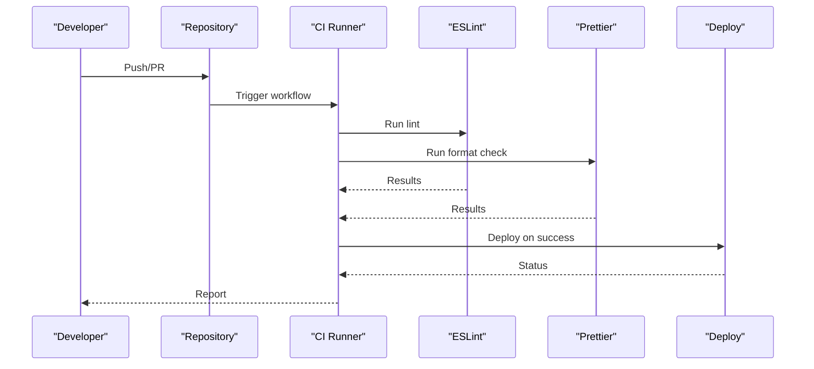
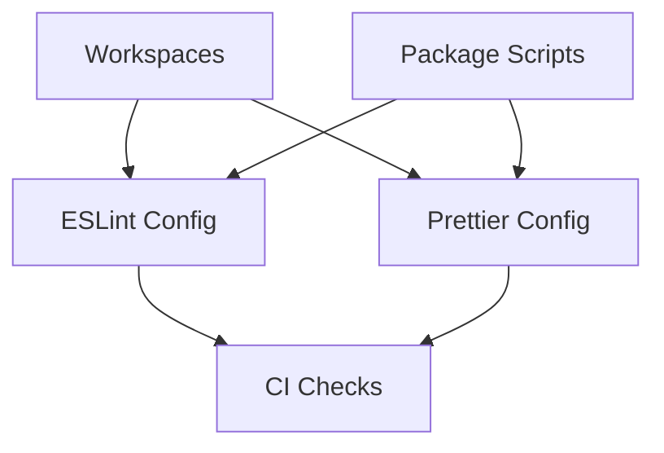

# Code Quality and Standards

<cite>
**Referenced Files in This Document**
- [README.md](file://README.md)
- [package.json](file://package.json)
- [pnpm-workspace.yaml](file://demo/nuxt/demo_2/pnpm-workspace.yaml)
- [pnpm-workspace.yaml](file://源码学习/vite@5.2.11/pnpm-workspace.yaml)
- [pnpm-workspace.yaml](file://源码学习/pinia-2@2.3.1/pnpm-workspace.yaml)
- [.eslintrc.cjs](file://源码学习/vite@5.2.11/.eslintrc.cjs)
- [.eslintignore](file://源码学习/vite@5.2.11/.eslintignore)
- [.prettierrc.json](file://源码学习/vite@5.2.11/.prettierrc.json)
- [.prettierignore](file://源码学习/pinia-2@2.3.1/.prettierignore)
- [.npmrc](file://源码学习/pinia-2@2.3.1/.npmrc)
- [.npmrc](file://源码学习/vite@5.2.11/.npmrc)
- [deploy.yml](file://.github/workflows/deploy.yml)
- [package.json](file://demo/my-vue-app/package.json)
- [package.json](file://demo/node/01模块/package.json)
- [package.json](file://demo/node/02_playground/package.json)
- [package.json](file://demo/npm/init/package.json)
</cite>

## Table of Contents
1. [Introduction](#introduction)
2. [Project Structure](#project-structure)
3. [Core Components](#core-components)
4. [Architecture Overview](#architecture-overview)
5. [Detailed Component Analysis](#detailed-component-analysis)
6. [Dependency Analysis](#dependency-analysis)
7. [Performance Considerations](#performance-considerations)
8. [Troubleshooting Guide](#troubleshooting-guide)
9. [Conclusion](#conclusion)
10. [Appendices](#appendices)

## Introduction
This document defines code quality and standards for linting, formatting, and package management across the repository. It consolidates ESLint configuration, Prettier formatting, npm/pnpm workflows, monorepo setup via workspaces, and CI integration. It also provides practical guidance for code review, testing integration, and continuous improvement of shared standards.

## Project Structure
The repository includes multiple projects and learning demos. For code quality, focus areas include:
- ESLint configuration and ignore files in the Vite project
- Prettier configuration and ignore files in the Pinia project
- Monorepo workspaces in Nuxt, Vite, and Pinia projects
- CI deployment workflow
- npm scripts and package management across demo projects

**Diagram sources**
- [.eslintrc.cjs](file://源码学习/vite@5.2.11/.eslintrc.cjs)
- [.eslintignore](file://源码学习/vite@5.2.11/.eslintignore)
- [.prettierrc.json](file://源码学习/vite@5.2.11/.prettierrc.json)
- [.prettierignore](file://源码学习/pinia-2@2.3.1/.prettierignore)
- [pnpm-workspace.yaml](file://demo/nuxt/demo_2/pnpm-workspace.yaml)
- [pnpm-workspace.yaml](file://源码学习/vite@5.2.11/pnpm-workspace.yaml)
- [pnpm-workspace.yaml](file://源码学习/pinia-2@2.3.1/pnpm-workspace.yaml)
- [deploy.yml](file://github/workflows/deploy.yml)
- [package.json](file://demo/my-vue-app/package.json)
- [package.json](file://demo/node/01模块/package.json)
- [package.json](file://demo/node/02_playground/package.json)
- [package.json](file://demo/npm/init/package.json)

**Section sources**
- [README.md](file://README.md)
- [package.json](file://package.json)

## Core Components
- ESLint configuration and ignore rules for JavaScript/TypeScript/Vue codebases
- Prettier formatting rules and ignore lists for consistent code style
- npm/pnpm workspace configuration for monorepos and dependency hoisting
- CI pipeline for automated deployment and checks
- Demo project package.json scripts for local development and build tasks

**Section sources**
- [.eslintrc.cjs](file://源码学习/vite@5.2.11/.eslintrc.cjs)
- [.eslintignore](file://源码学习/vite@5.2.11/.eslintignore)
- [.prettierrc.json](file://源码学习/vite@5.2.11/.prettierrc.json)
- [.prettierignore](file://源码学习/pinia-2@2.3.1/.prettierignore)
- [pnpm-workspace.yaml](file://demo/nuxt/demo_2/pnpm-workspace.yaml)
- [pnpm-workspace.yaml](file://源码学习/vite@5.2.11/pnpm-workspace.yaml)
- [pnpm-workspace.yaml](file://源码学习/pinia-2@2.3.1/pnpm-workspace.yaml)
- [deploy.yml](file://github/workflows/deploy.yml)
- [package.json](file://demo/my-vue-app/package.json)
- [package.json](file://demo/node/01模块/package.json)
- [package.json](file://demo/node/02_playground/package.json)
- [package.json](file://demo/npm/init/package.json)

## Architecture Overview
The code quality architecture integrates:
- Editor tooling (ESLint/Prettier) for pre-commit/pre-push enforcement
- CI checks to validate linting and formatting
- Monorepo workspaces to centralize shared tooling and dependencies
- npm/pnpm scripts to automate common developer tasks

**Diagram sources**
- [.eslintrc.cjs](file://源码学习/vite@5.2.11/.eslintrc.cjs)
- [.eslintignore](file://源码学习/vite@5.2.11/.eslintignore)
- [.prettierrc.json](file://源码学习/vite@5.2.11/.prettierrc.json)
- [.prettierignore](file://源码学习/pinia-2@2.3.1/.prettierignore)
- [pnpm-workspace.yaml](file://demo/nuxt/demo_2/pnpm-workspace.yaml)
- [pnpm-workspace.yaml](file://源码学习/vite@5.2.11/pnpm-workspace.yaml)
- [pnpm-workspace.yaml](file://源码学习/pinia-2@2.3.1/pnpm-workspace.yaml)
- [deploy.yml](file://github/workflows/deploy.yml)

## Detailed Component Analysis

### ESLint Configuration
- Centralized configuration file defines rulesets and plugin integrations for JavaScript/TypeScript/Vue environments.
- Ignore patterns exclude generated files, lockfiles, and build artifacts.
- Recommended to keep rules consistent across monorepo packages to avoid drift.

**Diagram sources**
- [.eslintrc.cjs](file://源码学习/vite@5.2.11/.eslintrc.cjs)
- [.eslintignore](file://源码学习/vite@5.2.11/.eslintignore)

**Section sources**
- [.eslintrc.cjs](file://源码学习/vite@5.2.11/.eslintrc.cjs)
- [.eslintignore](file://源码学习/vite@5.2.11/.eslintignore)

### Prettier Formatting Standards
- Configuration file defines formatting preferences (print width, tab width, quote style, trailing commas, etc.).
- Ignore file excludes binary, generated, and vendored content.
- Integrate with editor save hooks and CI to enforce consistent formatting.

**Diagram sources**
- [.prettierrc.json](file://源码学习/vite@5.2.11/.prettierrc.json)
- [.prettierignore](file://源码学习/pinia-2@2.3.1/.prettierignore)

**Section sources**
- [.prettierrc.json](file://源码学习/vite@5.2.11/.prettierrc.json)
- [.prettierignore](file://源码学习/pinia-2@2.3.1/.prettierignore)

### Package Management and Publishing
- npm configuration files define registry, caching, and publish settings.
- Demo projects include package.json scripts for building, serving, and testing.
- Prefer pnpm for monorepos to leverage workspace hoisting and deterministic installs.

**Diagram sources**
- [.npmrc](file://源码学习/pinia-2@2.3.1/.npmrc)
- [.npmrc](file://源码学习/vite@5.2.11/.npmrc)
- [package.json](file://demo/my-vue-app/package.json)
- [package.json](file://demo/node/01模块/package.json)
- [package.json](file://demo/node/02_playground/package.json)
- [package.json](file://demo/npm/init/package.json)

**Section sources**
- [.npmrc](file://源码学习/pinia-2@2.3.1/.npmrc)
- [.npmrc](file://源码学习/vite@5.2.11/.npmrc)
- [package.json](file://demo/my-vue-app/package.json)
- [package.json](file://demo/node/01模块/package.json)
- [package.json](file://demo/node/02_playground/package.json)
- [package.json](file://demo/npm/init/package.json)

### pnpm Workspaces and Monorepo Setup
- Workspace manifests declare package locations and shared metadata.
- Enables cross-package linking and hoists shared dependencies to reduce duplication.
- Align versioning and tooling across packages to maintain consistency.

**Diagram sources**
- [pnpm-workspace.yaml](file://demo/nuxt/demo_2/pnpm-workspace.yaml)
- [pnpm-workspace.yaml](file://源码学习/vite@5.2.11/pnpm-workspace.yaml)
- [pnpm-workspace.yaml](file://源码学习/pinia-2@2.3.1/pnpm-workspace.yaml)

**Section sources**
- [pnpm-workspace.yaml](file://demo/nuxt/demo_2/pnpm-workspace.yaml)
- [pnpm-workspace.yaml](file://源码学习/vite@5.2.11/pnpm-workspace.yaml)
- [pnpm-workspace.yaml](file://源码学习/pinia-2@2.3.1/pnpm-workspace.yaml)

### Continuous Integration and Deployment
- CI workflow automates linting, formatting, tests, and deployment steps.
- Integrates with ESLint and Prettier to prevent style and quality regressions.
- Use matrix builds to test across supported Node.js and OS versions.

**Diagram sources**
- [deploy.yml](file://github/workflows/deploy.yml)

**Section sources**
- [deploy.yml](file://github/workflows/deploy.yml)

## Dependency Analysis
- ESLint and Prettier configurations are centralized in specific projects and should be mirrored across monorepo packages.
- Workspaces enable shared tooling but require consistent configuration to avoid conflicts.
- CI depends on local tooling to catch issues early.

**Diagram sources**
- [.eslintrc.cjs](file://源码学习/vite@5.2.11/.eslintrc.cjs)
- [.prettierrc.json](file://源码学习/vite@5.2.11/.prettierrc.json)
- [pnpm-workspace.yaml](file://demo/nuxt/demo_2/pnpm-workspace.yaml)
- [deploy.yml](file://github/workflows/deploy.yml)
- [package.json](file://demo/my-vue-app/package.json)

**Section sources**
- [.eslintrc.cjs](file://源码学习/vite@5.2.11/.eslintrc.cjs)
- [.prettierrc.json](file://源码学习/vite@5.2.11/.prettierrc.json)
- [pnpm-workspace.yaml](file://demo/nuxt/demo_2/pnpm-workspace.yaml)
- [deploy.yml](file://github/workflows/deploy.yml)
- [package.json](file://demo/my-vue-app/package.json)

## Performance Considerations
- Prefer pnpm for faster, disk-space-efficient installs in monorepos.
- Keep ignore lists minimal but precise to avoid scanning unnecessary files.
- Use incremental linting and formatting checks in CI to reduce runtime.

## Troubleshooting Guide
Common issues and resolutions:
- Lint failures after formatting: ensure Prettier runs before ESLint in CI and locally.
- Conflicting rules across packages: align ESLint configurations via shared presets or root overrides.
- Workspace dependency resolution errors: verify workspace globs and lockfile consistency.
- CI vs local discrepancies: standardize Node.js versions and tool versions across environments.

**Section sources**
- [.eslintrc.cjs](file://源码学习/vite@5.2.11/.eslintrc.cjs)
- [.prettierrc.json](file://源码学习/vite@5.2.11/.prettierrc.json)
- [pnpm-workspace.yaml](file://demo/nuxt/demo_2/pnpm-workspace.yaml)
- [deploy.yml](file://github/workflows/deploy.yml)

## Conclusion
Adopting shared ESLint and Prettier configurations, centralizing monorepo tooling via pnpm workspaces, and integrating CI checks ensures consistent, high-quality code across the repository. Teams should enforce editor integrations, update configurations together, and keep CI strict to maintain standards.

## Appendices
- Practical examples:
  - ESLint: see configuration and ignore files in the Vite project.
  - Prettier: see configuration and ignore files in the Pinia project.
  - Workspaces: see workspace manifests in Nuxt, Vite, and Pinia projects.
  - CI: see the deployment workflow.
  - Scripts: see package.json scripts in demo applications.

**Section sources**
- [.eslintrc.cjs](file://源码学习/vite@5.2.11/.eslintrc.cjs)
- [.prettierrc.json](file://源码学习/vite@5.2.11/.prettierrc.json)
- [.prettierignore](file://源码学习/pinia-2@2.3.1/.prettierignore)
- [pnpm-workspace.yaml](file://demo/nuxt/demo_2/pnpm-workspace.yaml)
- [pnpm-workspace.yaml](file://源码学习/vite@5.2.11/pnpm-workspace.yaml)
- [pnpm-workspace.yaml](file://源码学习/pinia-2@2.3.1/pnpm-workspace.yaml)
- [deploy.yml](file://github/workflows/deploy.yml)
- [package.json](file://demo/my-vue-app/package.json)
- [package.json](file://demo/node/01模块/package.json)
- [package.json](file://demo/node/02_playground/package.json)
- [package.json](file://demo/npm/init/package.json)